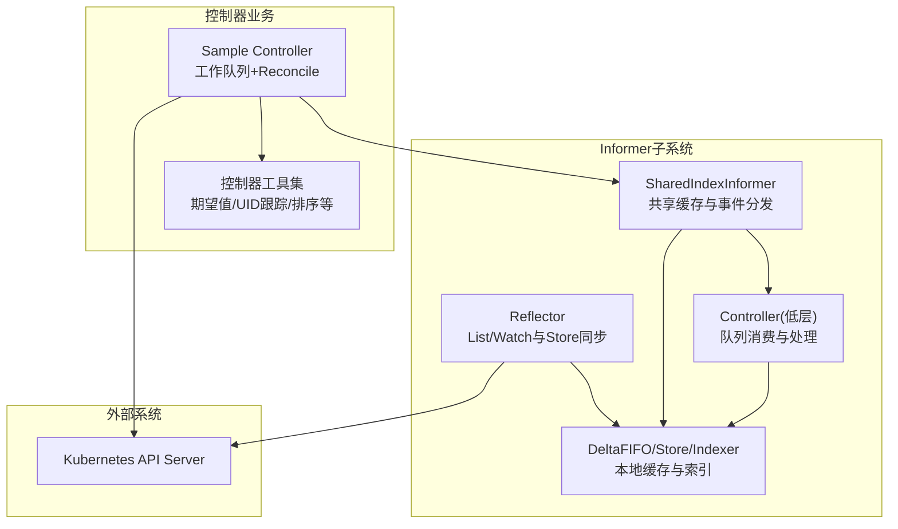
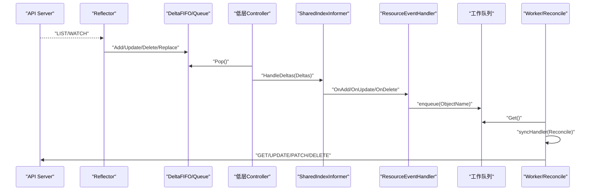
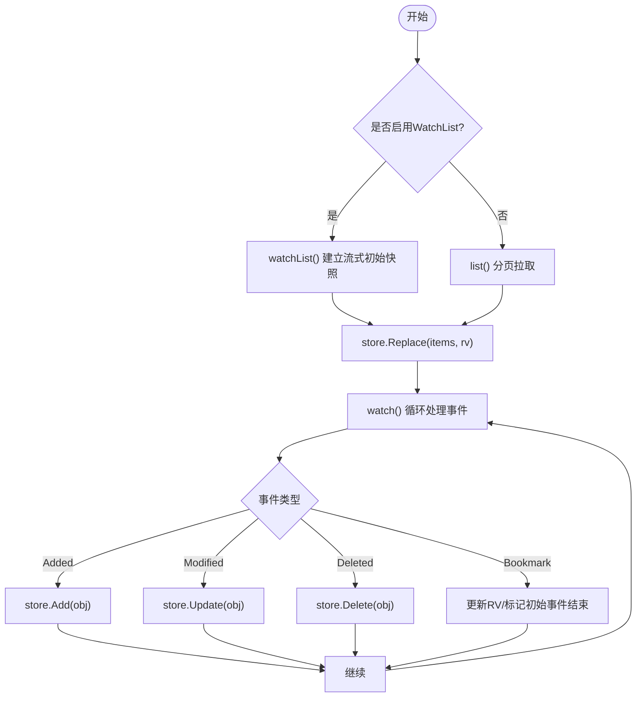
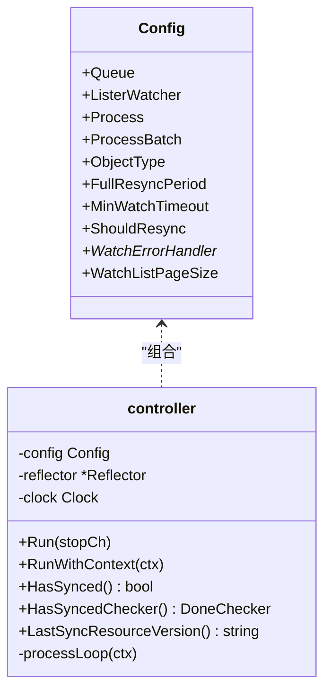
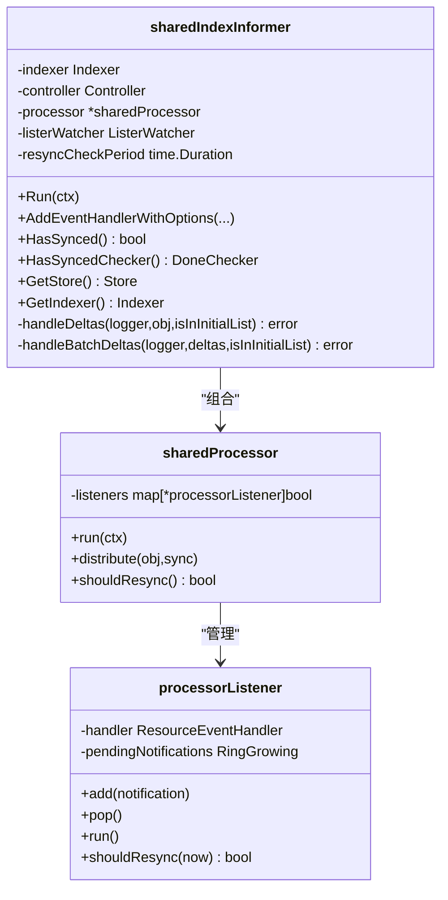
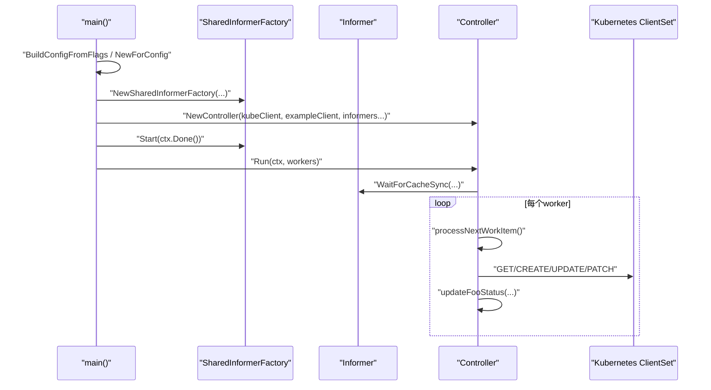
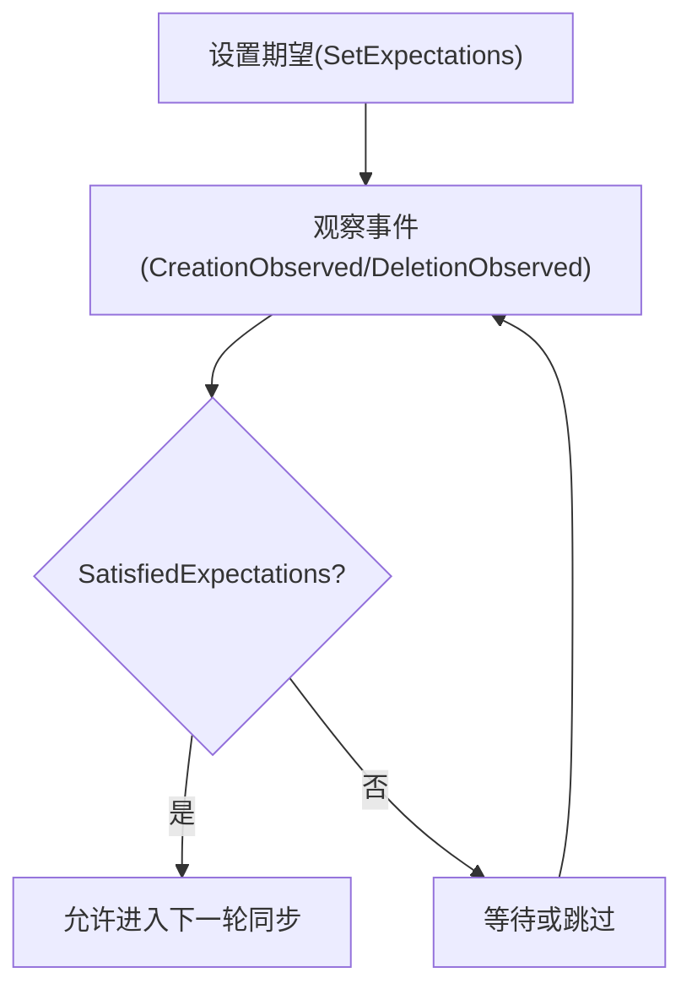
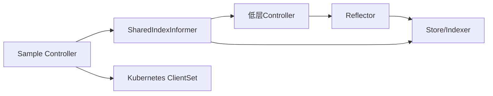

# 控制器框架基础

<cite>
**本文引用的文件**   
- [staging/src/k8s.io/client-go/tools/cache/doc.go](file://staging/src/k8s.io/client-go/tools/cache/doc.go)
- [staging/src/k8s.io/client-go/tools/cache/controller.go](file://staging/src/k8s.io/client-go/tools/cache/controller.go)
- [staging/src/k8s.io/client-go/tools/cache/shared_informer.go](file://staging/src/k8s.io/client-go/tools/cache/shared_informer.go)
- [staging/src/k8s.io/client-go/tools/cache/reflector.go](file://staging/src/k8s.io/client-go/tools/cache/reflector.go)
- [pkg/controller/controller_utils.go](file://pkg/controller/controller_utils.go)
- [staging/src/k8s.io/sample-controller/main.go](file://staging/src/k8s.io/sample-controller/main.go)
- [staging/src/k8s.io/sample-controller/controller.go](file://staging/src/k8s.io/sample-controller/controller.go)
</cite>

## 目录
1. [简介](#简介)
2. [项目结构](#项目结构)
3. [核心组件](#核心组件)
4. [架构总览](#架构总览)
5. [详细组件分析](#详细组件分析)
6. [依赖关系分析](#依赖关系分析)
7. [性能考量](#性能考量)
8. [故障排查指南](#故障排查指南)
9. [结论](#结论)
10. [附录](#附录)

## 简介
本文件面向Kubernetes控制器框架的基础能力，系统性阐述以下主题：
- 控制器的Reconcile循环与状态同步机制
- Informer机制（事件监听、资源缓存、索引）
- 控制器与API服务器的交互方式（客户端库使用与资源操作）
- 控制器基本结构与初始化流程
- 生命周期管理与优雅关闭
- 配置选项与环境变量设置
- 入门示例与最佳实践

## 项目结构
围绕控制器框架的关键代码主要分布在client-go的tools/cache模块以及内置控制器工具包中，并附带一个完整的sample-controller示例。

图示来源
- [staging/src/k8s.io/client-go/tools/cache/reflector.go:286-371](file://staging/src/k8s.io/client-go/tools/cache/reflector.go#L286-L371)
- [staging/src/k8s.io/client-go/tools/cache/controller.go:155-210](file://staging/src/k8s.io/client-go/tools/cache/controller.go#L155-L210)
- [staging/src/k8s.io/client-go/tools/cache/shared_informer.go:328-349](file://staging/src/k8s.io/client-go/tools/cache/shared_informer.go#L328-L349)
- [staging/src/k8s.io/sample-controller/controller.go:92-156](file://staging/src/k8s.io/sample-controller/controller.go#L92-L156)
- [pkg/controller/controller_utils.go:128-220](file://pkg/controller/controller_utils.go#L128-L220)

章节来源
- [staging/src/k8s.io/client-go/tools/cache/doc.go:17-24](file://staging/src/k8s.io/client-go/tools/cache/doc.go#L17-L24)

## 核心组件
- Reflector：负责从API Server执行List和Watch，将对象增量或全量同步到本地Store；支持分页、回退、超时、Bookmark等特性。
- Controller（低层）：基于Config驱动，启动Reflector并持续从Queue弹出Deltas调用Process函数处理。
- SharedIndexInformer：封装Reflector与Controller，提供共享的Indexer缓存、事件分发、Resync机制与HasSynced语义。
- Store/Indexer/DeltaFIFO：本地缓存与队列实现，支持索引与去重合并。
- Sample Controller：演示标准控制器模式（Informer + Workqueue + Reconcile）。
- 控制器工具集：期望值管理、UID跟踪、Pod排序与过滤等通用能力。

章节来源
- [staging/src/k8s.io/client-go/tools/cache/controller.go:43-100](file://staging/src/k8s.io/client-go/tools/cache/controller.go#L43-L100)
- [staging/src/k8s.io/client-go/tools/cache/shared_informer.go:45-139](file://staging/src/k8s.io/client-go/tools/cache/shared_informer.go#L45-L139)
- [staging/src/k8s.io/client-go/tools/cache/reflector.go:105-171](file://staging/src/k8s.io/client-go/tools/cache/reflector.go#L105-L171)
- [staging/src/k8s.io/sample-controller/controller.go:68-89](file://staging/src/k8s.io/sample-controller/controller.go#L68-L89)
- [pkg/controller/controller_utils.go:128-220](file://pkg/controller/controller_utils.go#L128-L220)

## 架构总览
下图展示从API Server到控制器Reconcile的端到端数据流与控制流。

图示来源
- [staging/src/k8s.io/client-go/tools/cache/reflector.go:463-509](file://staging/src/k8s.io/client-go/tools/cache/reflector.go#L463-L509)
- [staging/src/k8s.io/client-go/tools/cache/controller.go:232-261](file://staging/src/k8s.io/client-go/tools/cache/controller.go#L232-L261)
- [staging/src/k8s.io/client-go/tools/cache/shared_informer.go:953-967](file://staging/src/k8s.io/client-go/tools/cache/shared_informer.go#L953-L967)
- [staging/src/k8s.io/sample-controller/controller.go:190-236](file://staging/src/k8s.io/sample-controller/controller.go#L190-L236)

## 详细组件分析

### Reflector：事件监听、资源缓存与一致性保证
- 功能要点
  - 优先尝试WatchList（若启用），否则回退到传统LIST+WATCH。
  - 支持分页、最小/最大Watch超时、指数退避重试、内部错误重试上限。
  - 维护LastSyncResourceVersion，处理Expired/TooLargeRV等异常。
  - 支持Bookmark以标记初始事件结束，确保一致性快照。
- 关键流程
  - RunWithContext -> ListAndWatchWithContext -> watchWithResync -> watch/handleAnyWatch
  - list() 通过pager分页拉取，必要时回退到无分页或RV=""。
  - handleAnyWatch() 统一处理Added/Modified/Deleted/Bookmark事件，更新Store并推进RV。

图示来源
- [staging/src/k8s.io/client-go/tools/cache/reflector.go:420-435](file://staging/src/k8s.io/client-go/tools/cache/reflector.go#L420-L435)
- [staging/src/k8s.io/client-go/tools/cache/reflector.go:672-783](file://staging/src/k8s.io/client-go/tools/cache/reflector.go#L672-L783)
- [staging/src/k8s.io/client-go/tools/cache/reflector.go:972-1095](file://staging/src/k8s.io/client-go/tools/cache/reflector.go#L972-L1095)
- [staging/src/k8s.io/client-go/tools/cache/reflector.go:804-908](file://staging/src/k8s.io/client-go/tools/cache/reflector.go#L804-L908)

章节来源
- [staging/src/k8s.io/client-go/tools/cache/reflector.go:286-371](file://staging/src/k8s.io/client-go/tools/cache/reflector.go#L286-L371)
- [staging/src/k8s.io/client-go/tools/cache/reflector.go:463-509](file://staging/src/k8s.io/client-go/tools/cache/reflector.go#L463-L509)
- [staging/src/k8s.io/client-go/tools/cache/reflector.go:972-1095](file://staging/src/k8s.io/client-go/tools/cache/reflector.go#L972-L1095)

### 低层Controller与Reconcile循环
- 职责
  - 构造Reflector并将事件推入Queue。
  - 持续从Queue弹出Deltas，调用Process或ProcessBatch进行批处理。
- 运行模型
  - RunWithContext启动Reflector与processLoop。
  - processLoop根据FeatureGate与Queue能力选择单条或批量处理路径。

图示来源
- [staging/src/k8s.io/client-go/tools/cache/controller.go:43-100](file://staging/src/k8s.io/client-go/tools/cache/controller.go#L43-L100)
- [staging/src/k8s.io/client-go/tools/cache/controller.go:155-210](file://staging/src/k8s.io/client-go/tools/cache/controller.go#L155-L210)
- [staging/src/k8s.io/client-go/tools/cache/controller.go:232-261](file://staging/src/k8s.io/client-go/tools/cache/controller.go#L232-L261)

章节来源
- [staging/src/k8s.io/client-go/tools/cache/controller.go:155-210](file://staging/src/k8s.io/client-go/tools/cache/controller.go#L155-L210)
- [staging/src/k8s.io/client-go/tools/cache/controller.go:232-261](file://staging/src/k8s.io/client-go/tools/cache/controller.go#L232-L261)

### SharedIndexInformer：共享缓存、事件分发与索引
- 设计要点
  - 内部持有Indexer作为本地缓存，暴露GetStore()/GetIndexer()。
  - 通过sharedProcessor向多个ResourceEventHandler分发事件，支持按处理器粒度Resync。
  - 提供HasSynced/HasSyncedChecker等待“上游已同步且预同步事件已投递”。
- 事件分发
  - OnAdd/OnUpdate/OnDelete在blockDeltas锁保护下写入processorListener。
  - processorListener内部pop/run两协程解耦缓冲与回调执行。

图示来源
- [staging/src/k8s.io/client-go/tools/cache/shared_informer.go:328-349](file://staging/src/k8s.io/client-go/tools/cache/shared_informer.go#L328-L349)
- [staging/src/k8s.io/client-go/tools/cache/shared_informer.go:953-967](file://staging/src/k8s.io/client-go/tools/cache/shared_informer.go#L953-L967)
- [staging/src/k8s.io/client-go/tools/cache/shared_informer.go:1044-1189](file://staging/src/k8s.io/client-go/tools/cache/shared_informer.go#L1044-L1189)
- [staging/src/k8s.io/client-go/tools/cache/shared_informer.go:1240-1446](file://staging/src/k8s.io/client-go/tools/cache/shared_informer.go#L1240-L1446)

章节来源
- [staging/src/k8s.io/client-go/tools/cache/shared_informer.go:45-139](file://staging/src/k8s.io/client-go/tools/cache/shared_informer.go#L45-L139)
- [staging/src/k8s.io/client-go/tools/cache/shared_informer.go:886-951](file://staging/src/k8s.io/client-go/tools/cache/shared_informer.go#L886-L951)
- [staging/src/k8s.io/client-go/tools/cache/shared_informer.go:1044-1189](file://staging/src/k8s.io/client-go/tools/cache/shared_informer.go#L1044-L1189)

### 控制器与API服务器交互（客户端库与资源操作）
- 入口与初始化
  - 构建kubeconfig与kubernetes.Interface、自定义资源clientset。
  - 创建SharedInformerFactory，注册Informer与事件处理器。
  - 启动Informer工厂，等待缓存同步后启动控制器。
- 典型Reconcile流程
  - 从Lister读取目标对象与关联资源。
  - 比较Desired与实际状态，调用ClientSet进行Create/Update/Patch/Status更新。
  - 记录Event，返回错误或nil触发Forget/RateLimit。

图示来源
- [staging/src/k8s.io/sample-controller/main.go:40-82](file://staging/src/k8s.io/sample-controller/main.go#L40-L82)
- [staging/src/k8s.io/sample-controller/controller.go:162-188](file://staging/src/k8s.io/sample-controller/controller.go#L162-L188)
- [staging/src/k8s.io/sample-controller/controller.go:241-312](file://staging/src/k8s.io/sample-controller/controller.go#L241-L312)

章节来源
- [staging/src/k8s.io/sample-controller/main.go:40-82](file://staging/src/k8s.io/sample-controller/main.go#L40-L82)
- [staging/src/k8s.io/sample-controller/controller.go:92-156](file://staging/src/k8s.io/sample-controller/controller.go#L92-L156)
- [staging/src/k8s.io/sample-controller/controller.go:190-236](file://staging/src/k8s.io/sample-controller/controller.go#L190-L236)
- [staging/src/k8s.io/sample-controller/controller.go:241-312](file://staging/src/k8s.io/sample-controller/controller.go#L241-L312)

### 控制器工具集：期望值、UID跟踪与排序
- 期望值（Expectations）
  - 用于抑制风暴：控制器在同步前声明期望的Add/Del数量，观察事件后递减，满足或过期后才触发下一次同步。
- UID跟踪
  - 针对优雅删除场景，记录预期删除的UID集合，避免重复计数。
- Pod排序与筛选
  - 提供ActivePods/ByLogging/ActivePodsWithRanks等排序策略，辅助选择待删除Pod。

图示来源
- [pkg/controller/controller_utils.go:128-220](file://pkg/controller/controller_utils.go#L128-L220)
- [pkg/controller/controller_utils.go:340-410](file://pkg/controller/controller_utils.go#L340-L410)
- [pkg/controller/controller_utils.go:743-909](file://pkg/controller/controller_utils.go#L743-L909)

章节来源
- [pkg/controller/controller_utils.go:128-220](file://pkg/controller/controller_utils.go#L128-L220)
- [pkg/controller/controller_utils.go:340-410](file://pkg/controller/controller_utils.go#L340-L410)
- [pkg/controller/controller_utils.go:743-909](file://pkg/controller/controller_utils.go#L743-L909)

## 依赖关系分析
- 耦合与内聚
  - Reflector与Store强耦合，但通过接口抽象（ReflectorStore/TransformingStore）降低实现绑定。
  - SharedIndexInformer聚合Controller与processor，内聚度高，对外暴露稳定接口。
  - Sample Controller仅依赖Informer与ClientSet，业务逻辑清晰。
- 外部依赖
  - 通过kubernetes.Interface与自定义clientset访问API Server。
  - 使用workqueue进行速率限制与重试。
- 潜在循环依赖
  - 当前分层清晰，未见直接循环导入；注意不要在业务层反向依赖底层cache实现细节。

图示来源
- [staging/src/k8s.io/client-go/tools/cache/reflector.go:70-103](file://staging/src/k8s.io/client-go/tools/cache/reflector.go#L70-L103)
- [staging/src/k8s.io/client-go/tools/cache/shared_informer.go:597-647](file://staging/src/k8s.io/client-go/tools/cache/shared_informer.go#L597-L647)
- [staging/src/k8s.io/sample-controller/controller.go:68-89](file://staging/src/k8s.io/sample-controller/controller.go#L68-L89)

## 性能考量
- WatchList与分页
  - 默认启用WatchList可显著减少服务端压力；当不支持时回退到分页LIST。
  - 对大列表建议合理设置WatchListPageSize，避免直读etcd导致抖动。
- Resync周期
  - 过小的Resync周期会被提升到minimumResyncPeriod；过大则增加最终一致延迟。
- 批处理
  - 在支持的情况下开启ProcessBatch可减少多次回调开销。
- 速率限制与退避
  - 工作队列采用指数失败退避+桶限流；Reflector对429/连接拒绝等做指数退避。
- 内存与CPU
  - 避免在事件处理器中进行耗时操作；必要时异步化或落盘。
  - 合理使用TransformFunc裁剪不必要字段以降低内存占用。

[本节为通用指导，不直接分析具体文件]

## 故障排查指南
- 常见现象与定位
  - 缓存未同步：检查HasSynced/HasSyncedChecker与WaitForCacheSync返回值。
  - Watch频繁断开：关注WatchErrorHandler日志与Backoff行为。
  - 事件丢失或重复：确认IsControlledBy与OwnerReference是否正确；检查UID跟踪与期望值。
  - 性能抖动：检查Resync周期、WatchListPageSize与工作队列限流参数。
- 参考位置
  - Watch错误处理与回退逻辑
  - HasSynced/HasSyncedChecker实现
  - 期望值与UID跟踪工具

章节来源
- [staging/src/k8s.io/client-go/tools/cache/reflector.go:214-229](file://staging/src/k8s.io/client-go/tools/cache/reflector.go#L214-L229)
- [staging/src/k8s.io/client-go/tools/cache/shared_informer.go:800-813](file://staging/src/k8s.io/client-go/tools/cache/shared_informer.go#L800-L813)
- [pkg/controller/controller_utils.go:128-220](file://pkg/controller/controller_utils.go#L128-L220)

## 结论
Kubernetes控制器框架以Reflector+Controller+SharedIndexInformer为核心，结合本地缓存与索引，实现了高效的事件驱动与最终一致的状态同步。配合工作队列、期望值与UID跟踪等工具，可构建高可用、可扩展的控制器。遵循本文的最佳实践与排障建议，有助于快速落地并稳定运行生产级控制器。

[本节为总结性内容，不直接分析具体文件]

## 附录

### 控制器基本结构模板与初始化流程
- 初始化步骤
  - 解析命令行参数与kubeconfig，构建kubernetes.Interface与自定义clientset。
  - 创建SharedInformerFactory，注册所需Informer与事件处理器。
  - 启动Informer工厂，等待缓存同步。
  - 启动若干Worker循环从工作队列取任务并执行Reconcile。
- 关键注意事项
  - 事件处理器中只做轻量入队，避免阻塞。
  - Reconcile中只修改Desired状态，不直接修改缓存对象。
  - 正确设置FieldManager与OwnerReference，避免冲突。

章节来源
- [staging/src/k8s.io/sample-controller/main.go:40-82](file://staging/src/k8s.io/sample-controller/main.go#L40-L82)
- [staging/src/k8s.io/sample-controller/controller.go:92-156](file://staging/src/k8s.io/sample-controller/controller.go#L92-L156)
- [staging/src/k8s.io/sample-controller/controller.go:162-188](file://staging/src/k8s.io/sample-controller/controller.go#L162-L188)

### 生命周期管理与优雅关闭
- 信号处理
  - 使用信号上下文，确保收到SIGTERM/SIGINT后停止Informer与Worker。
- 停止顺序
  - 先停止工作队列，再等待所有Worker完成，最后关闭Informer。
- 参考实现
  - main中SetupSignalHandler与ctx.Done()传播。
  - Controller.Run中defer关闭workqueue并等待退出。

章节来源
- [staging/src/k8s.io/sample-controller/main.go:40-82](file://staging/src/k8s.io/sample-controller/main.go#L40-L82)
- [staging/src/k8s.io/sample-controller/controller.go:162-188](file://staging/src/k8s.io/sample-controller/controller.go#L162-L188)

### 配置选项与环境变量设置
- 控制器侧
  - kubeconfig/master URL通过命令行参数注入。
  - Informer Resync周期通过工厂构造参数传入。
- Informer/Reflector侧
  - MinWatchTimeout、WatchListPageSize、ResyncPeriod、Transform、Indexers等可通过Options配置。
- 环境变量
  - 本项目示例未直接使用环境变量，通常由kubeconfig或命令行参数传递。

章节来源
- [staging/src/k8s.io/sample-controller/main.go:84-88](file://staging/src/k8s.io/sample-controller/main.go#L84-L88)
- [staging/src/k8s.io/client-go/tools/cache/shared_informer.go:351-371](file://staging/src/k8s.io/client-go/tools/cache/shared_informer.go#L351-L371)
- [staging/src/k8s.io/client-go/tools/cache/reflector.go:251-284](file://staging/src/k8s.io/client-go/tools/cache/reflector.go#L251-L284)

### 最佳实践清单
- 使用SharedInformerFactory统一管理Informer生命周期。
- 事件处理器仅做入队，避免阻塞；复杂逻辑放入Reconcile。
- 使用HasSyncedChecker等待缓存与预同步事件完成。
- 合理设置Resync周期与限流参数，避免风暴与抖动。
- 使用UID跟踪与期望值抑制大规模变更时的重复同步。
- 使用Patch/UpdateStatus精确更新，减少冲突。
- 记录结构化日志与Event，便于问题定位。

[本节为通用指导，不直接分析具体文件]