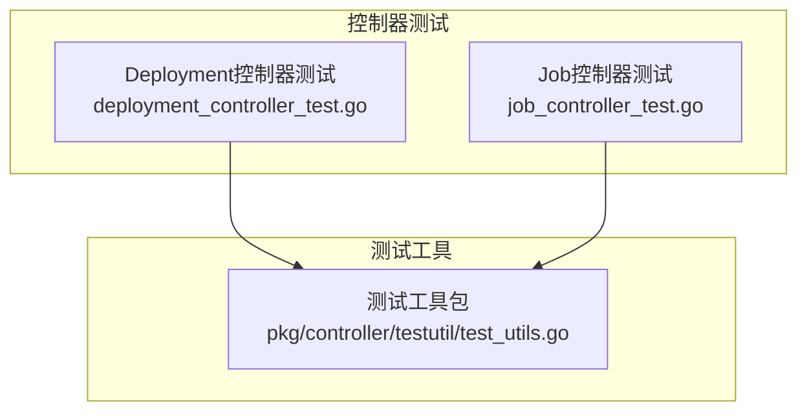
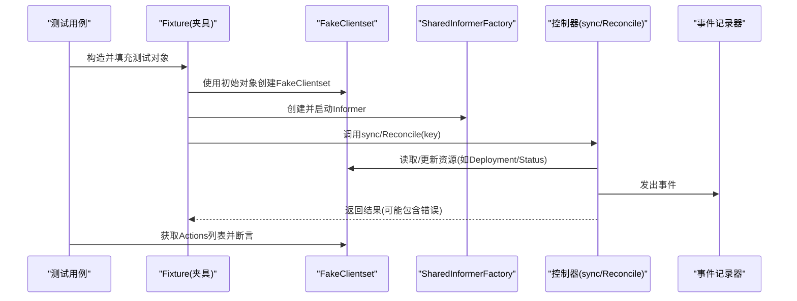
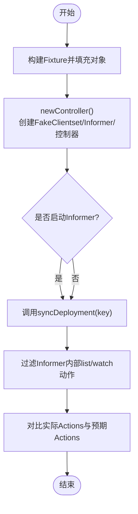
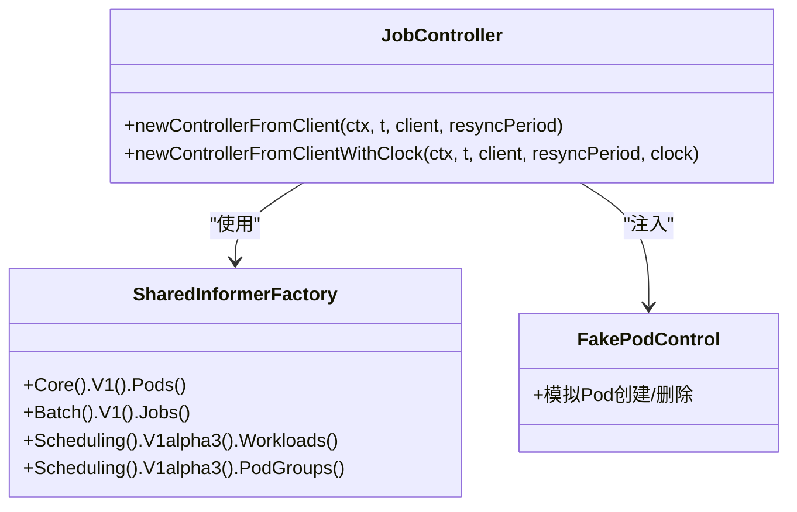
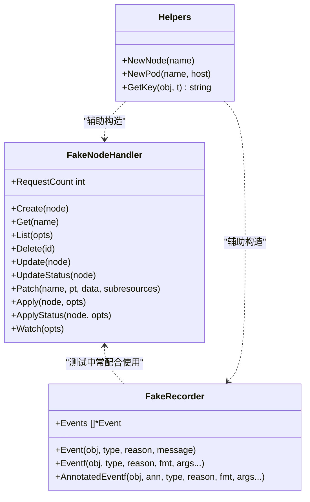
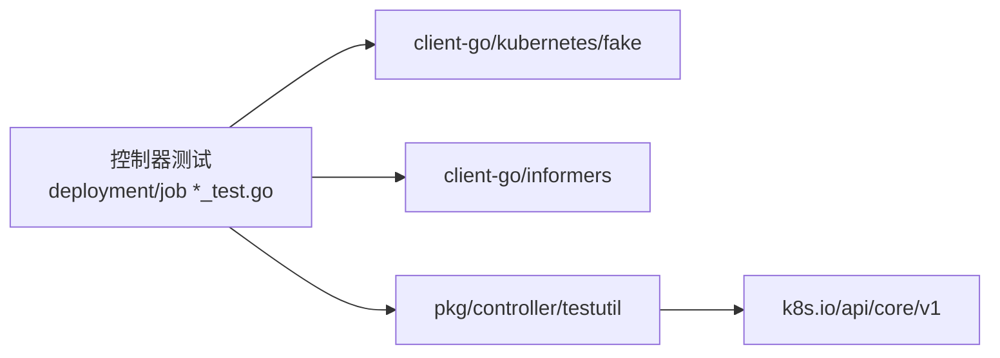

# 单元测试

<cite>
**本文引用的文件**   
- [deployment_controller_test.go](file://pkg/controller/deployment/deployment_controller_test.go)
- [job_controller_test.go](file://pkg/controller/job/job_controller_test.go)
- [test_utils.go](file://pkg/controller/testutil/test_utils.go)
</cite>

## 目录
1. [简介](#简介)
2. [项目结构](#项目结构)
3. [核心组件](#核心组件)
4. [架构总览](#架构总览)
5. [详细组件分析](#详细组件分析)
6. [依赖分析](#依赖分析)
7. [性能考虑](#性能考虑)
8. [故障排查指南](#故障排查指南)
9. [结论](#结论)
10. [附录](#附录)

## 简介
本文件面向Kubernetes控制器单元测试，聚焦以下目标：
- 如何编写控制器的单元测试：模拟API服务器客户端、Informer与FakeClient的使用
- 如何测试控制器的Reconcile逻辑：事件触发、状态更新与错误处理
- 测试数据准备与清理的最佳实践
- 如何使用pkg/controller/testutil包中的工具函数进行控制器测试
- 常见测试场景的完整示例（以代码片段路径形式给出）
- 断言库的使用与测试覆盖率要求说明

## 项目结构
围绕控制器单元测试，仓库中提供了丰富的参考实现与通用测试工具：
- 控制器测试样例：Deployment与Job控制器测试覆盖了从fixture构造、Informer初始化、动作断言到事件与状态验证的完整流程
- 通用测试工具：pkg/controller/testutil提供节点/事件等常用假对象与辅助方法，便于快速搭建测试环境

图表来源
- [deployment_controller_test.go:1-200](file://pkg/controller/deployment/deployment_controller_test.go#L1-L200)
- [job_controller_test.go:1-200](file://pkg/controller/job/job_controller_test.go#L1-L200)
- [test_utils.go:1-120](file://pkg/controller/testutil/test_utils.go#L1-L120)

章节来源
- [deployment_controller_test.go:1-200](file://pkg/controller/deployment/deployment_controller_test.go#L1-L200)
- [job_controller_test.go:1-200](file://pkg/controller/job/job_controller_test.go#L1-L200)
- [test_utils.go:1-120](file://pkg/controller/testutil/test_utils.go#L1-L120)

## 核心组件
本节概述在控制器单元测试中常用的关键组件与职责：
- FakeClientset：用于模拟API服务器的内存客户端，支持预设初始对象与动作断言
- SharedInformerFactory：为控制器提供Lister与Informer，测试中通常直接操作Indexer预置数据
- EventRecorder：用于捕获控制器产生的事件，测试中可用FakeRecorder或record.FakeRecorder
- testutil工具：提供FakeNodeHandler、FakeRecorder、NewPod/NewNode等便捷方法，简化测试数据构建与断言

章节来源
- [deployment_controller_test.go:178-206](file://pkg/controller/deployment/deployment_controller_test.go#L178-L206)
- [job_controller_test.go:131-150](file://pkg/controller/job/job_controller_test.go#L131-L150)
- [test_utils.go:398-476](file://pkg/controller/testutil/test_utils.go#L398-L476)

## 架构总览
下图展示了控制器单元测试的典型调用链：测试用例通过fixture创建FakeClientset与SharedInformerFactory，将测试对象注入Indexer，启动Informer后调用控制器的sync/Reconcile方法，最后对客户端Actions与状态变更进行断言。

图表来源
- [deployment_controller_test.go:178-251](file://pkg/controller/deployment/deployment_controller_test.go#L178-L251)
- [job_controller_test.go:131-150](file://pkg/controller/job/job_controller_test.go#L131-L150)

## 详细组件分析

### 组件A：Deployment控制器测试夹具与执行流
- 夹具职责
  - 维护fake.Clientset、Lister集合与预期Actions
  - 提供expect*Action方法声明期望的客户端调用
  - newController封装了FakeClientset、SharedInformerFactory与控制器的组装
  - run/run_负责启动Informer、调用sync并断言Actions
- 典型测试点
  - 正常创建ReplicaSet并更新Deployment状态
  - 删除时间戳冲突时的重入与重试
  - 空选择器时跳过同步
  - Pod删除触发Recreate策略的重排

图表来源
- [deployment_controller_test.go:178-269](file://pkg/controller/deployment/deployment_controller_test.go#L178-L269)

章节来源
- [deployment_controller_test.go:178-269](file://pkg/controller/deployment/deployment_controller_test.go#L178-L269)
- [deployment_controller_test.go:271-330](file://pkg/controller/deployment/deployment_controller_test.go#L271-L330)
- [deployment_controller_test.go:331-376](file://pkg/controller/deployment/deployment_controller_test.go#L331-L376)
- [deployment_controller_test.go:378-473](file://pkg/controller/deployment/deployment_controller_test.go#L378-L473)

### 组件B：Job控制器测试与时间控制
- 时间控制
  - 使用可替换时钟接口，便于控制任务完成时间与退避行为
- 控制器构造
  - 基于FakeClientset与SharedInformerFactory创建控制器，注入FakePodControl
- 测试要点
  - 并行度、完成数、BackoffLimit与CompletionMode的组合覆盖
  - Pod状态机推进与Job最终状态一致性

图表来源
- [job_controller_test.go:131-150](file://pkg/controller/job/job_controller_test.go#L131-L150)

章节来源
- [job_controller_test.go:131-150](file://pkg/controller/job/job_controller_test.go#L131-L150)
- [job_controller_test.go:81-129](file://pkg/controller/job/job_controller_test.go#L81-L129)

### 组件C：testutil工具包
- FakeNodeHandler
  - 提供Create/Get/List/Delete/Update/Patch/Apply等接口的内存实现
  - 支持并发安全、异步钩子、请求计数与等待通道
- FakeRecorder
  - 收集Event，便于断言控制器发出的事件
- 辅助方法
  - NewNode/NewPod：快速生成测试对象
  - GetKey：根据对象生成缓存键，便于队列入队测试

图表来源
- [test_utils.go:58-120](file://pkg/controller/testutil/test_utils.go#L58-L120)
- [test_utils.go:398-476](file://pkg/controller/testutil/test_utils.go#L398-L476)
- [test_utils.go:478-560](file://pkg/controller/testutil/test_utils.go#L478-L560)

章节来源
- [test_utils.go:58-120](file://pkg/controller/testutil/test_utils.go#L58-L120)
- [test_utils.go:398-476](file://pkg/controller/testutil/test_utils.go#L398-L476)
- [test_utils.go:478-560](file://pkg/controller/testutil/test_utils.go#L478-L560)

## 依赖分析
- 控制器测试对client-go fake与informer的依赖
  - FakeClientset用于模拟API服务器读写与动作断言
  - SharedInformerFactory提供Lister/Informer，测试中可直接操作Indexer预置数据
- testutil对core/v1资源的依赖
  - FakeNodeHandler/FakeRecorder等工具围绕Node/Event等核心资源构建

图表来源
- [deployment_controller_test.go:1-52](file://pkg/controller/deployment/deployment_controller_test.go#L1-L52)
- [job_controller_test.go:1-68](file://pkg/controller/job/job_controller_test.go#L1-L68)
- [test_utils.go:1-52](file://pkg/controller/testutil/test_utils.go#L1-L52)

章节来源
- [deployment_controller_test.go:1-52](file://pkg/controller/deployment/deployment_controller_test.go#L1-L52)
- [job_controller_test.go:1-68](file://pkg/controller/job/job_controller_test.go#L1-L68)
- [test_utils.go:1-52](file://pkg/controller/testutil/test_utils.go#L1-L52)

## 性能考虑
- 避免不必要的Informer启动：仅在需要监听事件时使用Start(stopCh)，否则直接操作Indexer更高效
- 减少Actions数量：过滤Informer内部的list/watch动作，仅断言业务相关调用
- 使用Fast Sync/Backoff常量：在Job等控制器测试中，缩短退避与重入周期以提升测试速度

[本节为通用建议，不直接分析具体文件]

## 故障排查指南
- 常见问题
  - 未启动Informer导致Lister为空：确保在需要时调用informers.Start(stopCh)
  - Actions断言失败：检查filterInformerActions是否正确过滤系统级list/watch
  - 删除时间戳竞态：当Lister与Client不一致时，应预期错误并重入
- 定位手段
  - 打印Actions与实际差异，核对Subresource与Resource匹配
  - 使用FakeRecorder.Events断言事件内容与来源

章节来源
- [deployment_controller_test.go:208-269](file://pkg/controller/deployment/deployment_controller_test.go#L208-L269)
- [deployment_controller_test.go:304-329](file://pkg/controller/deployment/deployment_controller_test.go#L304-L329)
- [test_utils.go:398-476](file://pkg/controller/testutil/test_utils.go#L398-L476)

## 结论
通过FakeClientset、SharedInformerFactory与testutil工具，可以高效地编写稳定且可维护的控制器单元测试。重点在于：
- 明确期望的客户端Actions与状态变化
- 合理设置Informer生命周期与Indexer数据
- 利用FakeRecorder与工具函数简化事件与对象断言
- 针对边界条件（删除竞态、空选择器、部分拥有关系）设计用例

[本节为总结性内容，不直接分析具体文件]

## 附录

### 常见测试场景与代码片段路径
- 创建ReplicaSet并更新Deployment状态
  - [deployment_controller_test.go:271-287](file://pkg/controller/deployment/deployment_controller_test.go#L271-L287)
- 删除时间戳冲突与重入
  - [deployment_controller_test.go:304-329](file://pkg/controller/deployment/deployment_controller_test.go#L304-L329)
- 空选择器跳过同步
  - [deployment_controller_test.go:331-347](file://pkg/controller/deployment/deployment_controller_test.go#L331-L347)
- Reentrant回滚
  - [deployment_controller_test.go:349-376](file://pkg/controller/deployment/deployment_controller_test.go#L349-L376)
- Pod删除触发Recreate重排
  - [deployment_controller_test.go:378-435](file://pkg/controller/deployment/deployment_controller_test.go#L378-L435)
- 部分拥有关系的Pod删除重排
  - [deployment_controller_test.go:437-473](file://pkg/controller/deployment/deployment_controller_test.go#L437-L473)
- 获取Deployment关联的ReplicaSets（含adopt/release）
  - [deployment_controller_test.go:475-565](file://pkg/controller/deployment/deployment_controller_test.go#L475-L565)
- Job控制器构造与时间控制
  - [job_controller_test.go:131-150](file://pkg/controller/job/job_controller_test.go#L131-L150)
  - [job_controller_test.go:81-129](file://pkg/controller/job/job_controller_test.go#L81-L129)

### 断言库与覆盖率
- 断言库
  - go-cmp：在Job控制器测试中使用cmp/cmpopts进行结构化比较
    - [job_controller_test.go:30-32](file://pkg/controller/job/job_controller_test.go#L30-L32)
  - 标准testing.T：在Deployment控制器测试中使用t.Errorf/t.Fatalf进行断言
    - [deployment_controller_test.go:227-251](file://pkg/controller/deployment/deployment_controller_test.go#L227-L251)
- 覆盖率
  - 仓库未在本节文件中定义统一的覆盖率阈值；建议在本地或CI中按模块配置覆盖率统计与阈值校验

章节来源
- [job_controller_test.go:30-32](file://pkg/controller/job/job_controller_test.go#L30-L32)
- [deployment_controller_test.go:227-251](file://pkg/controller/deployment/deployment_controller_test.go#L227-L251)