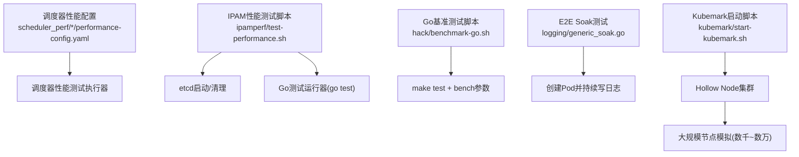
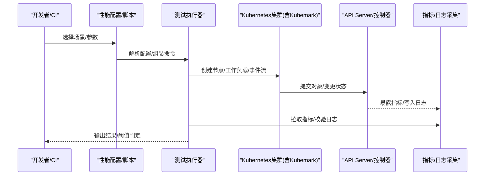
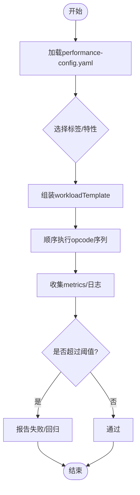
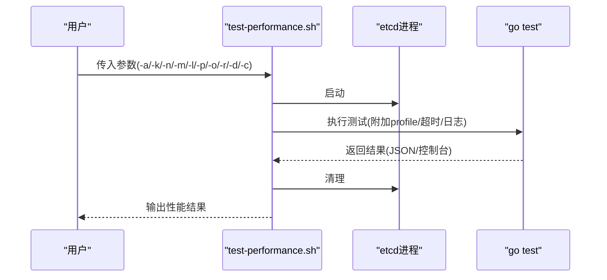
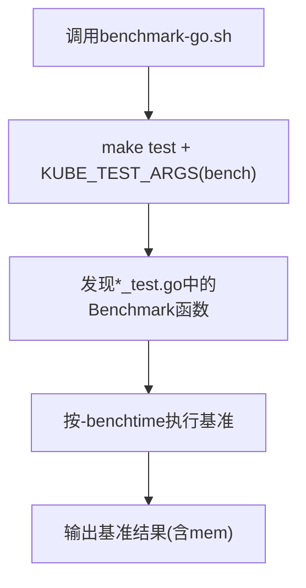
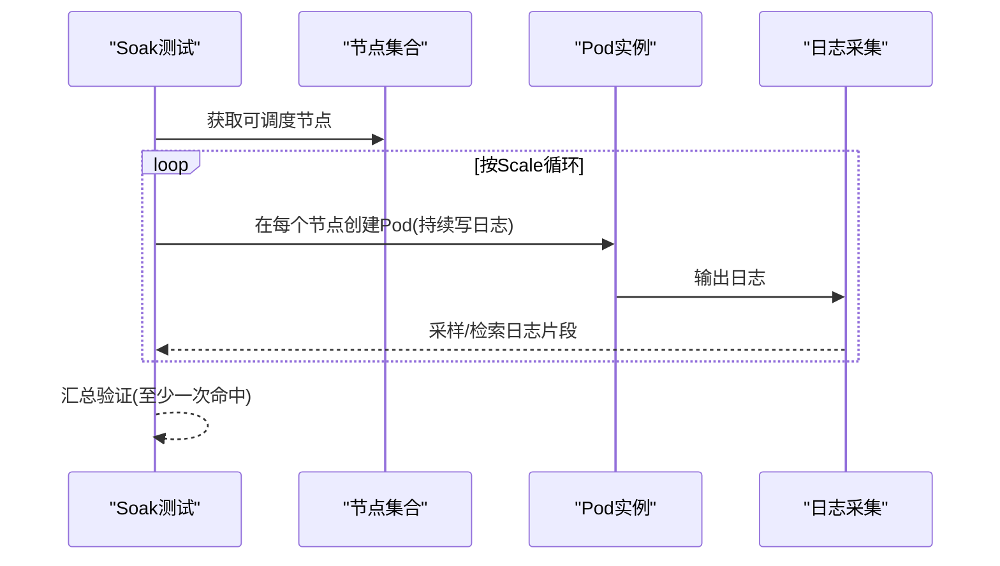
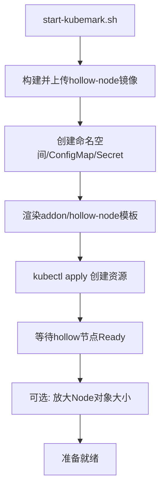
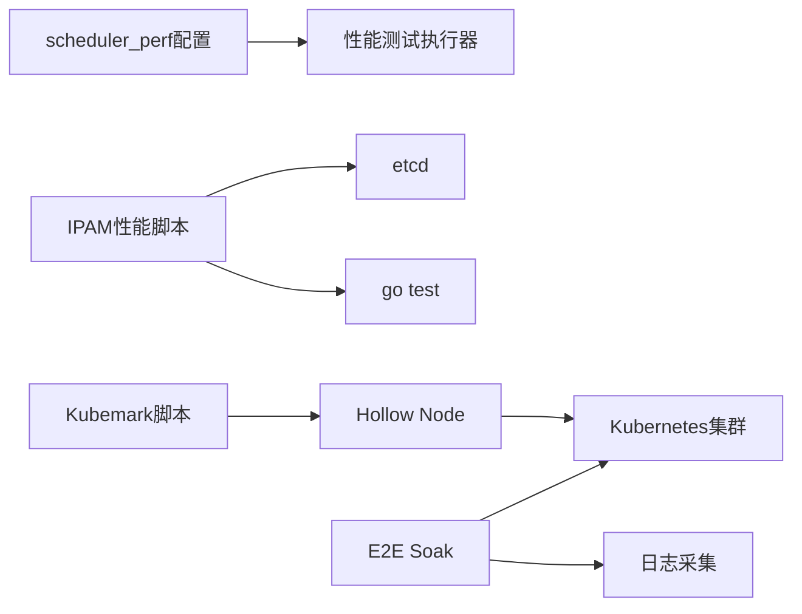

# 性能测试

<cite>
**本文引用的文件**   
- [test-performance.sh](file://test/integration/ipamperf/test-performance.sh)
- [benchmark-go.sh](file://hack/benchmark-go.sh)
- [generic_soak.go](file://test/e2e/instrumentation/logging/generic_soak.go)
- [start-kubemark.sh](file://test/kubemark/start-kubemark.sh)
- [performance-config.yaml](file://test/integration/scheduler_perf/misc/performance-config.yaml)
</cite>

## 目录
1. [引言](#引言)
2. [项目结构](#项目结构)
3. [核心组件](#核心组件)
4. [架构总览](#架构总览)
5. [详细组件分析](#详细组件分析)
6. [依赖分析](#依赖分析)
7. [性能考量](#性能考量)
8. [故障排查指南](#故障排查指南)
9. [结论](#结论)
10. [附录](#附录)

## 引言
本文件面向Kubernetes性能测试，系统化阐述设计原则、指标定义（响应时间、吞吐量、资源利用率）、基准与压力测试的编写与执行方法、负载生成与结果收集策略、回归检测与趋势分析方法、环境搭建与资源配置要求，以及框架使用与常见问题诊断。内容基于仓库中已有的脚本与测试实现进行归纳与提炼，确保可落地、可复现。

## 项目结构
仓库中与性能测试直接相关的代码与脚本主要分布在以下位置：
- 集成/性能配置与用例：test/integration/scheduler_perf/*/performance-config.yaml
- IPAM性能测试入口：test/integration/ipamperf/test-performance.sh
- Go基准测试运行器：hack/benchmark-go.sh
- E2E soak（长时间运行）示例：test/e2e/instrumentation/logging/generic_soak.go
- Kubemark大规模节点模拟：test/kubemark/start-kubemark.sh

图表来源
- [performance-config.yaml:1-493](file://test/integration/scheduler_perf/misc/performance-config.yaml#L1-L493)
- [test-performance.sh:1-92](file://test/integration/ipamperf/test-performance.sh#L1-L92)
- [benchmark-go.sh:1-34](file://hack/benchmark-go.sh#L1-L34)
- [generic_soak.go:1-140](file://test/e2e/instrumentation/logging/generic_soak.go#L1-L140)
- [start-kubemark.sh:1-256](file://test/kubemark/start-kubemark.sh#L1-L256)

章节来源
- [performance-config.yaml:1-493](file://test/integration/scheduler_perf/misc/performance-config.yaml#L1-L493)
- [test-performance.sh:1-92](file://test/integration/ipamperf/test-performance.sh#L1-L92)
- [benchmark-go.sh:1-34](file://hack/benchmark-go.sh#L1-L34)
- [generic_soak.go:1-140](file://test/e2e/instrumentation/logging/generic_soak.go#L1-L140)
- [start-kubemark.sh:1-256](file://test/kubemark/start-kubemark.sh#L1-L256)

## 核心组件
- 调度器性能测试配置与场景集：通过YAML描述工作负载模板、opcode序列、阈值与标签，支持不同规模与特性开关组合。
- IPAM性能测试：封装etcd生命周期管理、go test执行、可选CPU/内存profile输出与参数注入。
- Go基准测试工具链：统一调用make test并以bench模式运行指定包或全部包的基准用例。
- E2E Soak测试：在真实集群上按波次创建Pod，持续产生日志，验证kubelet采集能力与稳定性。
- Kubemark大规模节点模拟：构建hollow-node镜像并部署为虚拟节点，支撑超大规模集群的性能与压力测试。

章节来源
- [performance-config.yaml:1-493](file://test/integration/scheduler_perf/misc/performance-config.yaml#L1-L493)
- [test-performance.sh:1-92](file://test/integration/ipamperf/test-performance.sh#L1-L92)
- [benchmark-go.sh:1-34](file://hack/benchmark-go.sh#L1-L34)
- [generic_soak.go:1-140](file://test/e2e/instrumentation/logging/generic_soak.go#L1-L140)
- [start-kubemark.sh:1-256](file://test/kubemark/start-kubemark.sh#L1-L256)

## 架构总览
下图展示从“测试驱动”到“被测系统”的整体链路：配置/脚本驱动测试执行，测试在目标集群（含Kubemark虚拟节点）上施加负载，并通过API/指标/日志等通道收集结果。

图表来源
- [performance-config.yaml:1-493](file://test/integration/scheduler_perf/misc/performance-config.yaml#L1-L493)
- [test-performance.sh:1-92](file://test/integration/ipamperf/test-performance.sh#L1-L92)
- [generic_soak.go:1-140](file://test/e2e/instrumentation/logging/generic_soak.go#L1-L140)
- [start-kubemark.sh:1-256](file://test/kubemark/start-kubemark.sh#L1-L256)

## 详细组件分析

### 调度器性能测试（scheduler-perf）
- 设计要点
  - 以YAML声明式定义workloadTemplate与workloads，支持createNodes/createPods/churn/deletePods/barrier等操作码组合。
  - 通过labels区分integration-test、performance、short等执行域；threshold用于阈值断言。
  - 支持featureGates切换，便于对比开启/关闭异步API调用、异步抢占等特性的影响。
- 指标与断言
  - 吞吐：单位时间内完成调度的Pod数量（由collectMetrics=true的工作阶段产出）。
  - 延迟：Pod从入队到调度完成的时延分布（可通过测试框架埋点导出）。
  - 资源：节点CPU/内存占用、API Server QPS/延迟（结合外部监控）。
- 执行方式
  - 本地/CI根据标签筛选用例，按workload规模与阈值执行。
  - 典型场景包括基础调度、抢占、不可调度Pod干扰、混合 churn、被门控Pod下的调度、带终态删除Pod的调度、扩展资源调度等。

图表来源
- [performance-config.yaml:1-493](file://test/integration/scheduler_perf/misc/performance-config.yaml#L1-L493)

章节来源
- [performance-config.yaml:1-493](file://test/integration/scheduler_perf/misc/performance-config.yaml#L1-L493)

### IPAM性能测试
- 功能概述
  - 提供统一的命令行入口，支持调试级别、正则匹配测试、JSON结果输出、CPU/内存profile、自定义配置、分配器类型、API Server QPS、节点数、云端QPS等参数。
  - 自动启动/清理etcd，执行go test并输出性能结果。
- 关键流程
  - 解析参数 -> 初始化环境(etcd) -> 构造测试参数 -> 运行go test -> 清理。

图表来源
- [test-performance.sh:1-92](file://test/integration/ipamperf/test-performance.sh#L1-L92)

章节来源
- [test-performance.sh:1-92](file://test/integration/ipamperf/test-performance.sh#L1-L92)

### Go基准测试工具链
- 作用
  - 将make test与基准测试参数组合，支持限定WHAT目录、禁用竞态检测、设置benchtime与输出内存统计。
- 使用建议
  - 针对特定包或子目录运行基准，避免全量扫描带来的长耗时。
  - 结合CI缓存与并行度控制，缩短反馈周期。

图表来源
- [benchmark-go.sh:1-34](file://hack/benchmark-go.sh#L1-L34)

章节来源
- [benchmark-go.sh:1-34](file://hack/benchmark-go.sh#L1-L34)

### E2E Soak测试（日志高吞吐）
- 目标
  - 在多节点集群上按波次创建Pod，持续输出固定大小的日志，验证kubelet日志采集在高吞吐下的稳定性。
- 关键行为
  - 动态获取可调度节点，按Scale创建多波次Pod，每波间隔可控。
  - 使用LookForStringInLog验证至少一次成功采集。
  - 随集群规模放宽等待时间，提升鲁棒性。

图表来源
- [generic_soak.go:1-140](file://test/e2e/instrumentation/logging/generic_soak.go#L1-L140)

章节来源
- [generic_soak.go:1-140](file://test/e2e/instrumentation/logging/generic_soak.go#L1-L140)

### Kubemark大规模节点模拟
- 目标
  - 通过hollow-node在单Master上模拟数千至数万节点，支撑调度器、网络、存储等子系统的大规模性能与压力测试。
- 关键步骤
  - 构建并推送hollow-node镜像 -> 创建命名空间/ConfigMap/Secret -> 渲染并部署addon与hollow-node副本 -> 等待节点Ready -> 可选放大Node对象体积以贴近真实数据面。
- 注意事项
  - 合理估算addon资源（如Heapster/Cluster Autoscaler/Kube DNS）并按节点规模线性扩容。
  - 通过环境变量注入hollow组件参数，调整CPU/内存配额与测试参数。

图表来源
- [start-kubemark.sh:1-256](file://test/kubemark/start-kubemark.sh#L1-L256)

章节来源
- [start-kubemark.sh:1-256](file://test/kubemark/start-kubemark.sh#L1-L256)

## 依赖分析
- 组件耦合
  - scheduler-perf配置与工作负载模板强相关，修改模板需同步评估阈值与标签覆盖。
  - IPAM性能脚本依赖etcd生命周期与go test生态，profile与日志输出路径需一致。
  - E2E Soak依赖节点可用性、镜像拉取与日志采集链路。
  - Kubemark对容器镜像仓库、集群权限与addon资源有前置依赖。
- 外部依赖
  - etcd、容器运行时、镜像仓库、监控/日志后端（Prometheus/ELK等）。

图表来源
- [performance-config.yaml:1-493](file://test/integration/scheduler_perf/misc/performance-config.yaml#L1-L493)
- [test-performance.sh:1-92](file://test/integration/ipamperf/test-performance.sh#L1-L92)
- [generic_soak.go:1-140](file://test/e2e/instrumentation/logging/generic_soak.go#L1-L140)
- [start-kubemark.sh:1-256](file://test/kubemark/start-kubemark.sh#L1-L256)

章节来源
- [performance-config.yaml:1-493](file://test/integration/scheduler_perf/misc/performance-config.yaml#L1-L493)
- [test-performance.sh:1-92](file://test/integration/ipamperf/test-performance.sh#L1-L92)
- [generic_soak.go:1-140](file://test/e2e/instrumentation/logging/generic_soak.go#L1-L140)
- [start-kubemark.sh:1-256](file://test/kubemark/start-kubemark.sh#L1-L256)

## 性能考量
- 指标定义
  - 响应时间：端到端请求/操作时延（P50/P90/P99），关注尾延迟。
  - 吞吐量：单位时间完成的操作数（如调度Pod/s、API QPS）。
  - 资源利用率：CPU/内存/IO/网络带宽与饱和度，关注瓶颈组件。
- 实验设计
  - 基线先行：在稳定环境中建立基线，记录关键指标与阈值。
  - 变量隔离：每次仅改变一个变量（如并发度、对象大小、特性开关）。
  - 预热与稳态：剔除冷启动阶段，选取稳态窗口计算指标。
- 回归检测与趋势分析
  - 阈值告警：对关键指标设定上限/下限阈值，超出即标记回归。
  - 趋势对比：跨版本/分支对比吞吐与时延变化，识别退化。
  - 可视化：将时序指标入库，绘制趋势图辅助定位拐点。

[本节为通用指导，不直接分析具体文件]

## 故障排查指南
- 常见现象与定位
  - 测试超时/失败：检查集群健康、镜像拉取、RBAC权限、etcd可用性与资源配额。
  - 吞吐不达预期：确认节点规模、资源限制、网络/存储I/O、API Server限流与队列深度。
  - 日志缺失：验证kubelet日志采集、日志后端容量与查询条件。
- 快速定位手段
  - 启用更细粒度日志与profile（IPAM脚本支持-cpu/mem profile与-v=6）。
  - 缩小范围：用短用例与最小规模复现问题，逐步放大。
  - 分层观测：分别观察API Server、控制器、节点侧与外部依赖。

章节来源
- [test-performance.sh:1-92](file://test/integration/ipamperf/test-performance.sh#L1-L92)
- [generic_soak.go:1-140](file://test/e2e/instrumentation/logging/generic_soak.go#L1-L140)

## 结论
通过配置化工作负载、脚本化执行与规模化节点模拟，Kubernetes仓库提供了覆盖调度器、IPAM、日志采集等多维度的性能测试能力。建议以基线+阈值为核心，结合趋势分析与分层观测，形成闭环的性能保障体系。

[本节为总结性内容，不直接分析具体文件]

## 附录
- 常用命令参考
  - 运行Go基准测试：使用基准脚本限定目录与参数。
  - 运行IPAM性能测试：按需传入分配器、QPS、节点数、profile与输出路径。
  - 启动Kubemark：准备镜像仓库与集群权限后执行启动脚本。
- 最佳实践
  - 将性能用例纳入CI，定期跑回归。
  - 对关键场景保留历史数据，持续跟踪趋势。
  - 压测前做容量规划与资源预留，避免环境抖动影响结论。

[本节为补充说明，不直接分析具体文件]