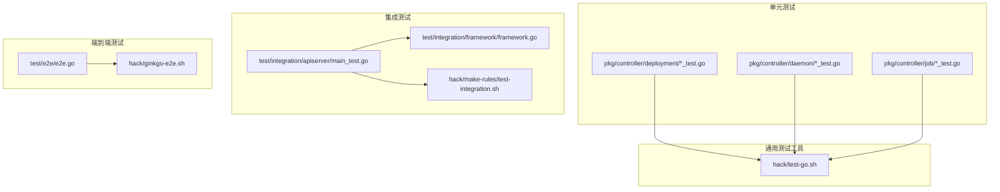
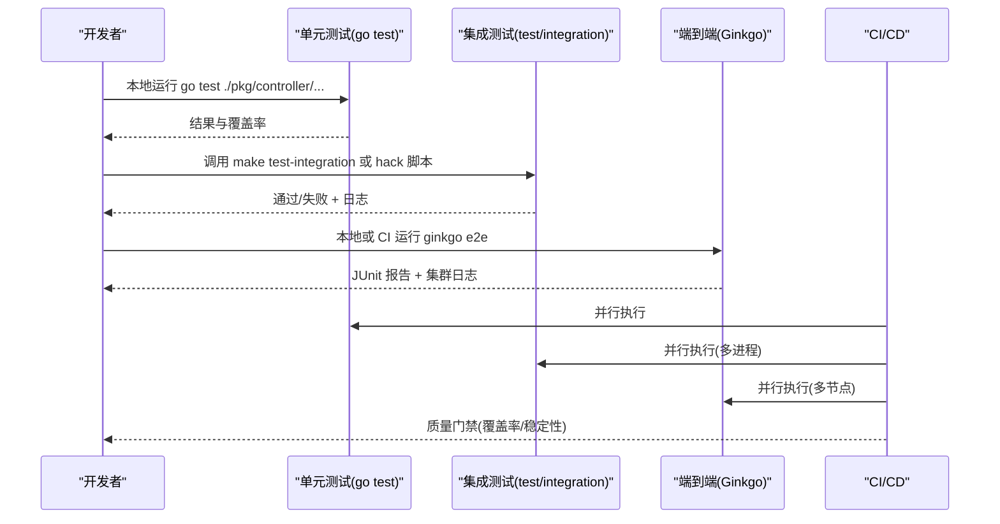
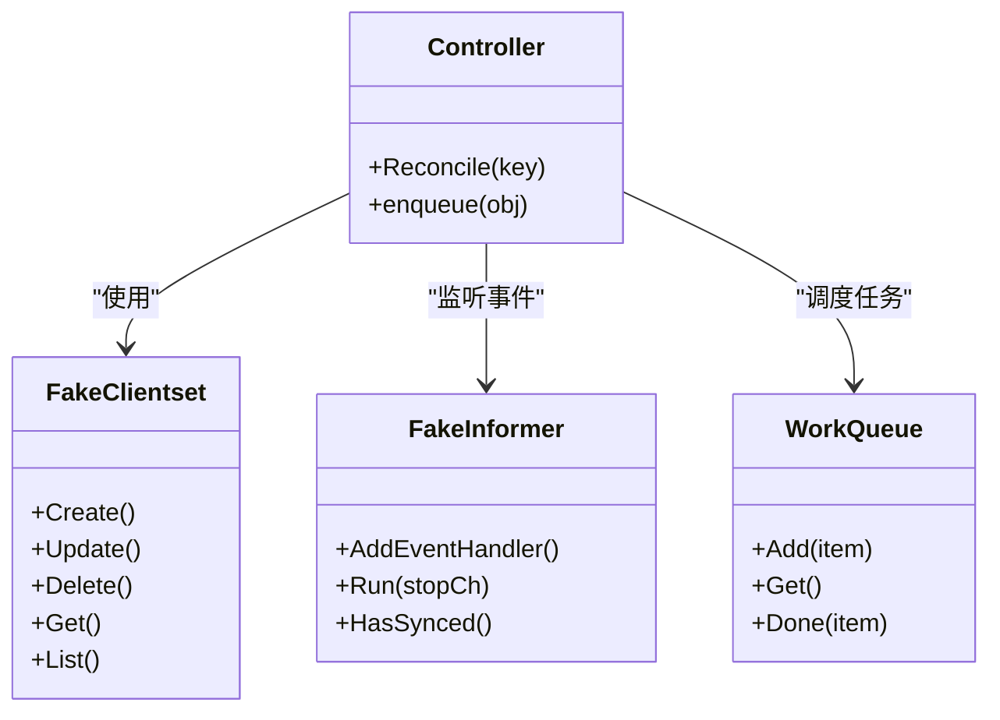
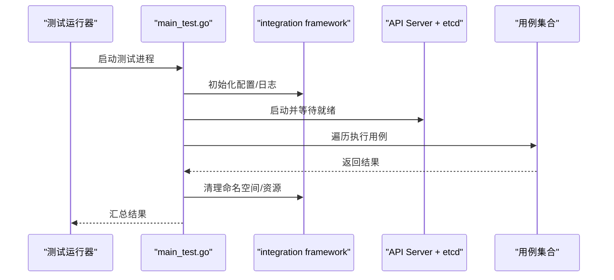
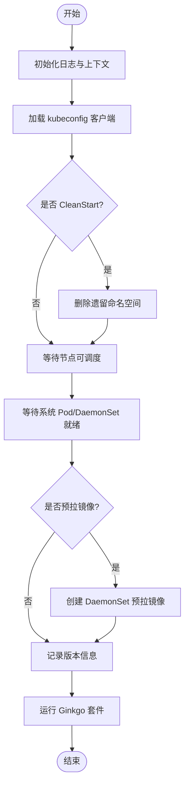
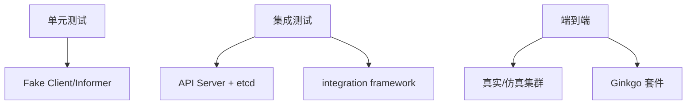

# 测试策略与实践

<cite>
**本文引用的文件**   
- [test/e2e/e2e.go](file://test/e2e/e2e.go)
- [hack/test-go.sh](file://hack/test-go.sh)
- [pkg/controller/deployment/deployment_controller_test.go](file://pkg/controller/deployment/deployment_controller_test.go)
- [pkg/controller/daemon/daemon_controller_test.go](file://pkg/controller/daemon/daemon_controller_test.go)
- [pkg/controller/job/job_controller_test.go](file://pkg/controller/job/job_controller_test.go)
- [test/integration/apiserver/main_test.go](file://test/integration/apiserver/main_test.go)
- [test/integration/framework/framework.go](file://test/integration/framework/framework.go)
- [hack/make-rules/test-integration.sh](file://hack/make-rules/test-integration.sh)
- [hack/ginkgo-e2e.sh](file://hack/ginkgo-e2e.sh)
</cite>

## 目录
1. [简介](#简介)
2. [项目结构](#项目结构)
3. [核心组件](#核心组件)
4. [架构总览](#架构总览)
5. [详细组件分析](#详细组件分析)
6. [依赖分析](#依赖分析)
7. [性能考虑](#性能考虑)
8. [故障排查指南](#故障排查指南)
9. [结论](#结论)
10. [附录](#附录)

## 简介
本文件面向在 Kubernetes 仓库中开发与维护控制器（Operator）的工程师，系统化阐述控制器的单元测试、集成测试与端到端（E2E）测试策略与实践。内容涵盖：
- 控制器的单元测试方法：如何模拟 API Server、Informer、队列与客户端，确保快速、稳定、可重复地验证控制器逻辑。
- 集成测试编写与执行：基于真实 API Server 和 etcd 的测试框架，覆盖关键路径与边界条件。
- 端到端测试设计与实现：在真实或仿真集群上运行 Ginkgo 套件，验证跨组件协作与系统行为。
- 测试数据管理与清理策略：命名空间隔离、资源生命周期管理、失败后残留清理。
- 覆盖率要求与度量：Go 原生覆盖率工具与报告聚合。
- 性能与压力测试：调度器、API Server、控制器等关键路径的性能基准与压测方法。
- 自动化与 CI/CD 集成：Makefile/hack 脚本驱动、并行化、产物归档与质量门禁。
- 常见测试场景与排障：超时、竞态、资源泄漏、网络/存储插件差异等。

## 项目结构
Kubernetes 仓库采用分层与按功能域组织的方式，测试代码分布在多个目录：
- 单元测试：位于各包同级 _test.go 文件中，例如 pkg/controller/*/..._test.go。
- 集成测试：位于 test/integration 下，按子系统划分，每个子目录包含 main_test.go 作为入口。
- 端到端测试：位于 test/e2e，使用 Ginkgo 组织套件，通过 hack/ginkgo-e2e.sh 启动。
- 构建与测试脚本：hack 与 hack/make-rules 提供统一的测试入口与参数传递。

图表来源
- [test/e2e/e2e.go:1-120](file://test/e2e/e2e.go#L1-L120)
- [test/integration/apiserver/main_test.go](file://test/integration/apiserver/main_test.go)
- [test/integration/framework/framework.go](file://test/integration/framework/framework.go)
- [hack/make-rules/test-integration.sh](file://hack/make-rules/test-integration.sh)
- [hack/ginkgo-e2e.sh](file://hack/ginkgo-e2e.sh)
- [hack/test-go.sh](file://hack/test-go.sh)

章节来源
- [test/e2e/e2e.go:1-120](file://test/e2e/e2e.go#L1-L120)
- [hack/test-go.sh](file://hack/test-go.sh)

## 核心组件
- 单元测试基础设施
  - 使用 go test 运行，结合 fake clientset、fake informer、内存存储与事件队列，构造最小可控环境。
  - 典型模式：创建 fake client/informer -> 注册控制器 -> 触发事件 -> 断言期望状态。
- 集成测试框架
  - 以 test/integration 为根，每个子系统有独立 main_test.go 启动 API Server + etcd，注入测试配置，运行用例。
  - framework 提供共享能力：等待资源就绪、清理命名空间、日志收集等。
- 端到端测试套件
  - 使用 Ginkgo v2 组织套件，SynchronizedBeforeSuite/AfterSuite 负责集群准备与清理。
  - 支持并行执行、进度上报、JUnit 报告输出、镜像预拉取、节点就绪检查等。

章节来源
- [test/e2e/e2e.go:69-111](file://test/e2e/e2e.go#L69-L111)
- [test/e2e/e2e.go:168-256](file://test/e2e/e2e.go#L168-L256)
- [test/integration/apiserver/main_test.go](file://test/integration/apiserver/main_test.go)
- [test/integration/framework/framework.go](file://test/integration/framework/framework.go)

## 架构总览
下图展示从开发到 CI 的测试流水线与组件交互：开发者提交代码后，触发单元测试；随后运行集成测试（带真实 API Server/etcd）；最后执行 E2E 套件（Ginkgo），产出 JUnit 报告与日志。

图表来源
- [hack/test-go.sh](file://hack/test-go.sh)
- [hack/make-rules/test-integration.sh](file://hack/make-rules/test-integration.sh)
- [hack/ginkgo-e2e.sh](file://hack/ginkgo-e2e.sh)
- [test/e2e/e2e.go:86-111](file://test/e2e/e2e.go#L86-L111)

## 详细组件分析

### 控制器单元测试方法与最佳实践
- 目标
  - 快速反馈、高覆盖率、无外部依赖、可重复。
- 常用手段
  - Fake Clientset：模拟 API 读写，避免真实集群。
  - Fake Informer/Indexer：模拟事件流与缓存，便于回放与断言。
  - Workqueue：控制处理节奏，验证重入与重试。
  - 时间/随机性：使用固定时钟与种子，保证确定性。
- 示例参考路径
  - 部署控制器测试：[deployment_controller_test.go](file://pkg/controller/deployment/deployment_controller_test.go)
  - DaemonSet 控制器测试：[daemon_controller_test.go](file://pkg/controller/daemon/daemon_controller_test.go)
  - Job 控制器测试：[job_controller_test.go](file://pkg/controller/job/job_controller_test.go)
- 建议
  - 将复杂业务逻辑拆分为纯函数，优先对纯函数进行单测。
  - 对副作用（API 调用、I/O）使用接口与 mock/fake。
  - 针对边缘情况（空列表、并发更新、删除保护）设计用例。

章节来源
- [pkg/controller/deployment/deployment_controller_test.go](file://pkg/controller/deployment/deployment_controller_test.go)
- [pkg/controller/daemon/daemon_controller_test.go](file://pkg/controller/daemon/daemon_controller_test.go)
- [pkg/controller/job/job_controller_test.go](file://pkg/controller/job/job_controller_test.go)

#### 类图：控制器测试常用对象关系

图表来源
- [pkg/controller/deployment/deployment_controller_test.go](file://pkg/controller/deployment/deployment_controller_test.go)
- [pkg/controller/daemon/daemon_controller_test.go](file://pkg/controller/daemon/daemon_controller_test.go)
- [pkg/controller/job/job_controller_test.go](file://pkg/controller/job/job_controller_test.go)

### 集成测试：编写与执行
- 目标
  - 在接近生产环境的 API Server + etcd 上验证关键路径，包括认证授权、CRD、字段校验、watch/list 行为等。
- 结构与入口
  - 每个子系统目录含 main_test.go，用于启动 API Server、注册资源、初始化测试上下文。
  - 共享框架位于 test/integration/framework，提供等待、清理、日志等能力。
- 执行方式
  - 通过 hack/make-rules/test-integration.sh 统一入口，支持过滤、并行、产物输出。
- 建议
  - 用例尽量短小聚焦，避免长时阻塞。
  - 使用命名空间隔离，测试结束后自动清理。
  - 记录关键指标与日志，便于定位问题。

章节来源
- [test/integration/apiserver/main_test.go](file://test/integration/apiserver/main_test.go)
- [test/integration/framework/framework.go](file://test/integration/framework/framework.go)
- [hack/make-rules/test-integration.sh](file://hack/make-rules/test-integration.sh)

#### 序列图：集成测试启动流程

图表来源
- [test/integration/apiserver/main_test.go](file://test/integration/apiserver/main_test.go)
- [test/integration/framework/framework.go](file://test/integration/framework/framework.go)

### 端到端测试：设计与实现
- 目标
  - 在真实或仿真集群上验证跨组件协作、用户可见行为与系统级特性。
- 套件组织
  - 使用 Ginkgo v2，通过 SynchronizedBeforeSuite/AfterSuite 完成全局准备与收尾。
  - RunE2ETests 负责日志初始化、失败处理器注册、Ginkgo 配置与运行。
- 集群准备与清理
  - 支持 CleanStart 清理非系统命名空间，等待所有节点可调度，等待系统 Pod/DaemonSet 就绪。
  - 可选预拉镜像，提升测试稳定性与速度。
- 并行与报告
  - 支持多进程并行，输出 JUnit 报告，记录进度与版本信息。
- 执行入口
  - 通过 hack/ginkgo-e2e.sh 启动，支持 Provider、ReportDir、ParallelProcess 等参数。

章节来源
- [test/e2e/e2e.go:69-111](file://test/e2e/e2e.go#L69-L111)
- [test/e2e/e2e.go:168-256](file://test/e2e/e2e.go#L168-L256)
- [test/e2e/e2e.go:363-379](file://test/e2e/e2e.go#L363-L379)
- [hack/ginkgo-e2e.sh](file://hack/ginkgo-e2e.sh)

#### 流程图：E2E 套件启动与准备

图表来源
- [test/e2e/e2e.go:86-111](file://test/e2e/e2e.go#L86-L111)
- [test/e2e/e2e.go:168-256](file://test/e2e/e2e.go#L168-L256)
- [test/e2e/e2e.go:381-418](file://test/e2e/e2e.go#L381-L418)

### 测试数据管理与清理策略
- 命名空间隔离
  - 每个测试用例使用独立命名空间，测试结束后统一删除。
- 资源生命周期
  - 使用 DeferCleanup 或 AfterSuite 钩子确保资源回收。
- 失败后清理
  - 即使用例失败，也需尽力清理命名空间与临时资源，避免污染后续用例。
- 大集群优化
  - 允许少量 NotReady 节点/Pod，避免偶发资源未就绪导致整体失败。

章节来源
- [test/e2e/e2e.go:188-204](file://test/e2e/e2e.go#L188-L204)
- [test/e2e/e2e.go:229-237](file://test/e2e/e2e.go#L229-L237)
- [test/e2e/e2e.go:381-418](file://test/e2e/e2e.go#L381-L418)

### 测试覆盖率要求与度量标准
- 工具链
  - Go 原生 go test -cover 生成覆盖率数据，配合 go tool cover 生成 HTML/文本报告。
- 范围
  - 建议对核心控制器逻辑与公共工具函数保持较高覆盖率（如 >80%）。
- 报告聚合
  - 在 CI 中聚合多模块覆盖率，设置阈值门禁。
- 注意
  - 覆盖率不等于质量，应结合用例有效性与边界覆盖评估。

章节来源
- [hack/test-go.sh](file://hack/test-go.sh)

### 性能测试与压力测试
- 目标
  - 评估 API Server、调度器、控制器在高负载下的吞吐、延迟与稳定性。
- 方法
  - 使用专用基准测试与压测脚本，构造大规模资源与并发请求。
  - 关注关键指标：QPS、P99 延迟、CPU/内存占用、GC 频率、etcd 写入放大。
- 执行
  - 在专用集群或 kubemark 环境中运行，避免与其他工作负载争用资源。
  - 记录环境与版本信息，便于回归对比。

章节来源
- [hack/ginkgo-e2e.sh](file://hack/ginkgo-e2e.sh)

### 测试自动化与 CI/CD 集成最佳实践
- 分层执行
  - 先跑单元测试，再跑集成测试，最后跑 E2E，逐级筛选问题。
- 并行化
  - 利用 Ginkgo 并行与 Makefile 并行，缩短反馈时间。
- 产物归档
  - 保存 JUnit 报告、覆盖率、日志与快照，便于回溯。
- 质量门禁
  - 覆盖率阈值、失败率阈值、性能回归检测。
- 可复现
  - 固定镜像版本、依赖版本与集群配置，减少噪声。

章节来源
- [hack/test-go.sh](file://hack/test-go.sh)
- [hack/make-rules/test-integration.sh](file://hack/make-rules/test-integration.sh)
- [hack/ginkgo-e2e.sh](file://hack/ginkgo-e2e.sh)

## 依赖分析
- 组件耦合
  - 控制器测试依赖 fake client/informer 与队列，降低对外部依赖的耦合度。
  - 集成测试依赖 API Server/etcd，但通过框架封装，屏蔽底层细节。
  - E2E 依赖真实集群，通过 Ginkgo 与框架抽象出稳定的测试接口。
- 外部依赖
  - Ginkgo/Gomega、kube-apiserver、etcd、kubectl、gcloud（特定云厂商）。
- 循环依赖
  - 测试代码应避免引入被测包的循环依赖，必要时通过接口解耦。

图表来源
- [test/integration/apiserver/main_test.go](file://test/integration/apiserver/main_test.go)
- [test/integration/framework/framework.go](file://test/integration/framework/framework.go)
- [test/e2e/e2e.go:69-111](file://test/e2e/e2e.go#L69-L111)

章节来源
- [test/integration/apiserver/main_test.go](file://test/integration/apiserver/main_test.go)
- [test/integration/framework/framework.go](file://test/integration/framework/framework.go)
- [test/e2e/e2e.go:69-111](file://test/e2e/e2e.go#L69-L111)

## 性能考虑
- 单元测试
  - 避免 I/O 与网络调用，使用内存与 fake 对象，确保毫秒级响应。
- 集成测试
  - 控制并发与数据规模，避免长时间阻塞；合理设置超时与重试。
- E2E 测试
  - 预拉镜像、限制并行度、选择合适集群规模，平衡速度与稳定性。
- 监控与诊断
  - 采集关键指标，记录慢查询与热点路径，持续优化。

## 故障排查指南
- 常见问题
  - 命名空间未清理导致资源冲突。
  - 节点或系统 Pod 未就绪导致用例不稳定。
  - 网络/存储插件差异引发平台相关失败。
  - 超时与竞态：需要增加等待与重试策略。
- 定位步骤
  - 查看 JUnit 报告与失败用例日志。
  - 检查系统命名空间中的 Pod/DaemonSet 状态。
  - 确认集群版本与镜像来源，排除环境差异。
- 修复建议
  - 完善清理逻辑，增加幂等性。
  - 细化等待条件，避免误判。
  - 对平台差异进行条件分支与跳过策略。

章节来源
- [test/e2e/e2e.go:188-204](file://test/e2e/e2e.go#L188-L204)
- [test/e2e/e2e.go:229-237](file://test/e2e/e2e.go#L229-L237)
- [test/e2e/e2e.go:244-256](file://test/e2e/e2e.go#L244-L256)

## 结论
通过在单元测试、集成测试与端到端测试三个层面建立完善的策略与实践，可以在保证质量的同时提升交付效率。关键在于：
- 明确每层测试的目标与边界，避免重叠与遗漏。
- 使用合适的模拟与框架，降低外部依赖带来的不稳定性。
- 强化数据清理与失败恢复，确保测试的可重复性。
- 在 CI/CD 中固化流程与质量门禁，形成闭环改进。

## 附录
- 常用命令
  - 运行单元测试：参考 [hack/test-go.sh](file://hack/test-go.sh)
  - 运行集成测试：参考 [hack/make-rules/test-integration.sh](file://hack/make-rules/test-integration.sh)
  - 运行 E2E 套件：参考 [hack/ginkgo-e2e.sh](file://hack/ginkgo-e2e.sh)
- 参考路径
  - E2E 套件入口与准备：[test/e2e/e2e.go](file://test/e2e/e2e.go)
  - 集成测试入口与框架：[test/integration/apiserver/main_test.go](file://test/integration/apiserver/main_test.go)、[test/integration/framework/framework.go](file://test/integration/framework/framework.go)
  - 控制器单测示例：[pkg/controller/deployment/deployment_controller_test.go](file://pkg/controller/deployment/deployment_controller_test.go)、[pkg/controller/daemon/daemon_controller_test.go](file://pkg/controller/daemon/daemon_controller_test.go)、[pkg/controller/job/job_controller_test.go](file://pkg/controller/job/job_controller_test.go)