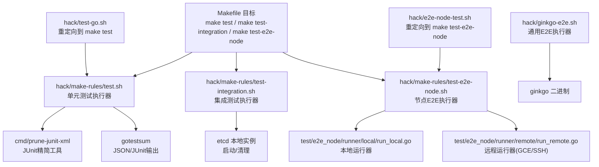
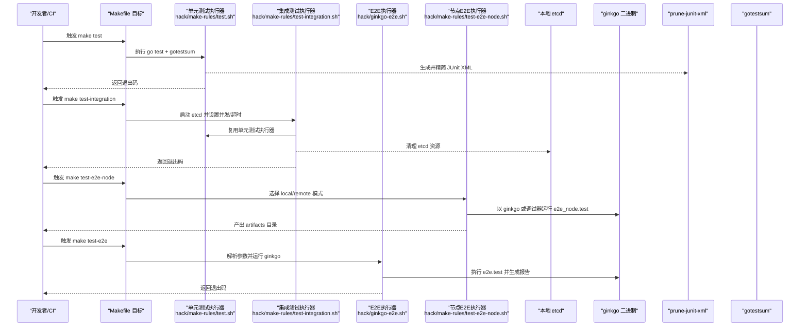
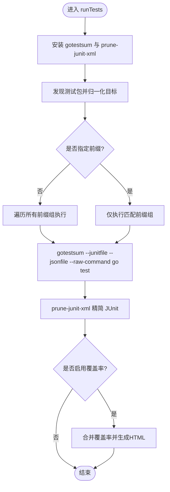
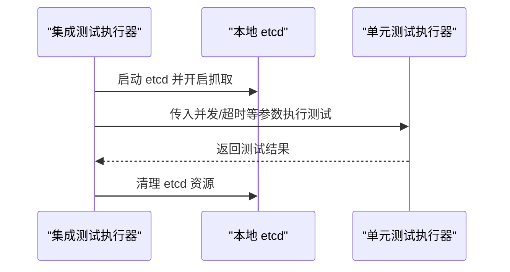
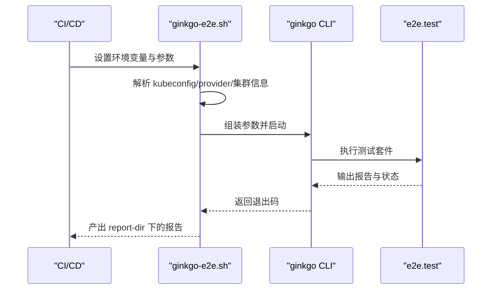
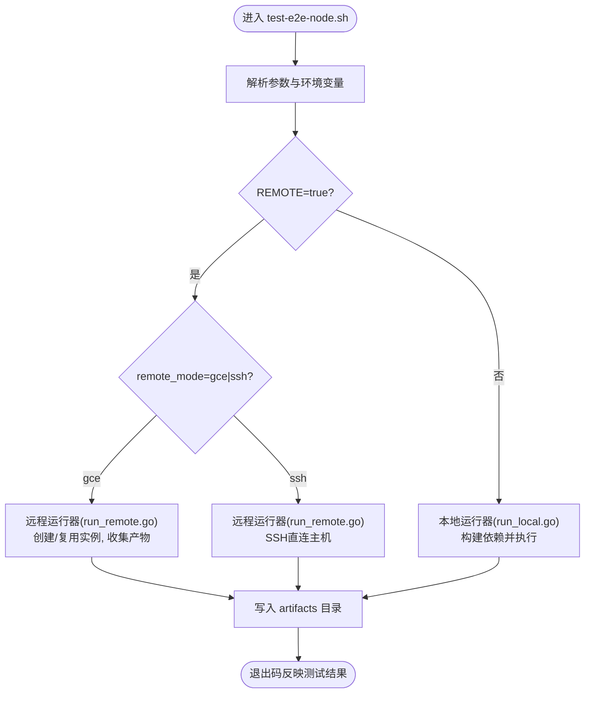
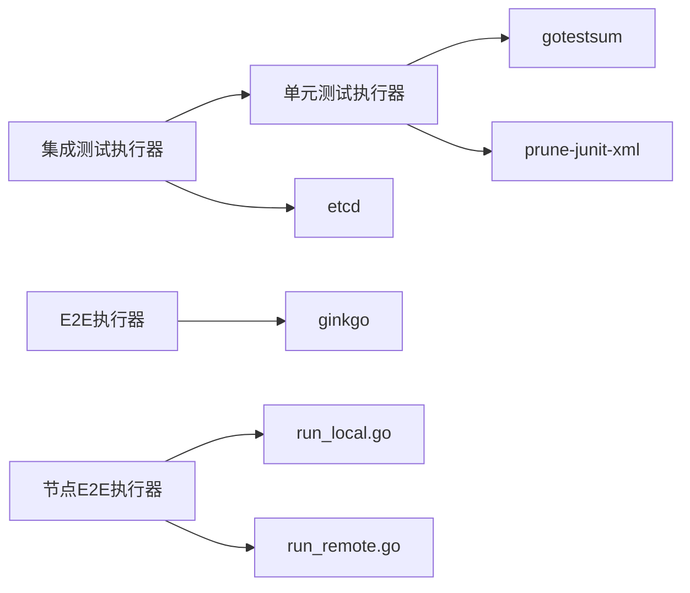

# 测试自动化与CI/CD

<cite>
**本文引用的文件**   
- [hack/test-go.sh](file://hack/test-go.sh)
- [hack/make-rules/test.sh](file://hack/make-rules/test.sh)
- [hack/make-rules/test-integration.sh](file://hack/make-rules/test-integration.sh)
- [hack/ginkgo-e2e.sh](file://hack/ginkgo-e2e.sh)
- [hack/make-rules/test-e2e-node.sh](file://hack/make-rules/test-e2e-node.sh)
- [hack/e2e-node-test.sh](file://hack/e2e-node-test.sh)
</cite>

## 目录
1. [简介](#简介)
2. [项目结构](#项目结构)
3. [核心组件](#核心组件)
4. [架构总览](#架构总览)
5. [详细组件分析](#详细组件分析)
6. [依赖关系分析](#依赖关系分析)
7. [性能考虑](#性能考虑)
8. [故障排查指南](#故障排查指南)
9. [结论](#结论)
10. [附录](#附录)

## 简介
本文件面向Kubernetes项目的测试自动化与CI/CD集成，系统性阐述以下方面：
- 测试自动化架构设计与流水线配置要点
- 单元测试、集成测试、E2E（端到端）与节点级E2E的触发条件与执行策略
- 测试结果收集与报告生成方法
- 测试失败处理机制与通知策略建议
- 测试环境的自动部署与管理方式
- CI/CD配置示例与最佳实践指南

## 项目结构
仓库中测试与CI相关的关键脚本集中在 hack 与 hack/make-rules 目录下，分别负责：
- 单元测试入口与执行编排
- 集成测试环境准备与执行
- E2E与节点级E2E的执行与产物收集
- 兼容性与便捷性重定向脚本

图表来源
- [hack/make-rules/test.sh:1-374](file://hack/make-rules/test.sh#L1-L374)
- [hack/make-rules/test-integration.sh:1-124](file://hack/make-rules/test-integration.sh#L1-L124)
- [hack/make-rules/test-e2e-node.sh:1-290](file://hack/make-rules/test-e2e-node.sh#L1-L290)
- [hack/ginkgo-e2e.sh:1-303](file://hack/ginkgo-e2e.sh#L1-L303)
- [hack/test-go.sh:1-40](file://hack/test-go.sh#L1-L40)
- [hack/e2e-node-test.sh:1-53](file://hack/e2e-node-test.sh#L1-L53)

章节来源
- [hack/make-rules/test.sh:1-374](file://hack/make-rules/test.sh#L1-L374)
- [hack/make-rules/test-integration.sh:1-124](file://hack/make-rules/test-integration.sh#L1-L124)
- [hack/make-rules/test-e2e-node.sh:1-290](file://hack/make-rules/test-e2e-node.sh#L1-L290)
- [hack/ginkgo-e2e.sh:1-303](file://hack/ginkgo-e2e.sh#L1-L303)
- [hack/test-go.sh:1-40](file://hack/test-go.sh#L1-L40)
- [hack/e2e-node-test.sh:1-53](file://hack/e2e-node-test.sh#L1-L53)

## 核心组件
- 单元测试执行器：统一发现Go包、并行执行、覆盖率收集、JUNIT输出与精简、可选race检测。
- 集成测试执行器：启动本地etcd、设置并发度与超时、调用单元测试执行器完成测试。
- E2E执行器：基于Ginkgo驱动，支持并行、进度轮询、颜色控制、调试模式、结果报告。
- 节点E2E执行器：支持本地与远程（GCE/SSH）两种模式，构建并分发测试工件，收集日志与报告。
- 便捷重定向脚本：保持向后兼容，将旧脚本调用转发至新的Makefile目标。

章节来源
- [hack/make-rules/test.sh:1-374](file://hack/make-rules/test.sh#L1-L374)
- [hack/make-rules/test-integration.sh:1-124](file://hack/make-rules/test-integration.sh#L1-L124)
- [hack/ginkgo-e2e.sh:1-303](file://hack/ginkgo-e2e.sh#L1-L303)
- [hack/make-rules/test-e2e-node.sh:1-290](file://hack/make-rules/test-e2e-node.sh#L1-L290)
- [hack/test-go.sh:1-40](file://hack/test-go.sh#L1-L40)
- [hack/e2e-node-test.sh:1-53](file://hack/e2e-node-test.sh#L1-L53)

## 架构总览
下图展示了从Makefile目标到具体执行器的调用链路与关键外部依赖。

图表来源
- [hack/make-rules/test.sh:1-374](file://hack/make-rules/test.sh#L1-L374)
- [hack/make-rules/test-integration.sh:1-124](file://hack/make-rules/test-integration.sh#L1-L124)
- [hack/ginkgo-e2e.sh:1-303](file://hack/ginkgo-e2e.sh#L1-L303)
- [hack/make-rules/test-e2e-node.sh:1-290](file://hack/make-rules/test-e2e-node.sh#L1-L290)

## 详细组件分析

### 单元测试执行器（hack/make-rules/test.sh）
- 功能要点
  - 自动发现工作区与工具模块中的测试包，过滤非单元类型路径
  - 通过 gotestsum 聚合 JSON 与 JUnit 输出，并调用 prune-junit-xml 精简顶层用例
  - 支持覆盖率开关与合并报告，可选 race 检测
  - 根据 ARTIFACTS/KUBE_JUNIT_REPORT_DIR 决定产物目录
- 关键流程
  - 安装必要工具（gotestsum、prune-junit-xml）
  - 按前缀分组执行（主工作区、vendor、hack/tools 子模块）
  - 生成 junit_*.xml 与可选 stdout 原始输出
  - 汇总覆盖率 HTML 报告
- 复杂度与性能
  - 包发现为 O(N) 扫描；并行度由 -p 控制
  - 大仓库下建议合理设置 PARALLEL 与 KUBE_TIMEOUT
- 错误处理
  - 任一子任务失败即返回非零退出码
  - 提供 ulimit 检查提示以避免因文件描述符不足导致的失败

图表来源
- [hack/make-rules/test.sh:1-374](file://hack/make-rules/test.sh#L1-L374)

章节来源
- [hack/make-rules/test.sh:1-374](file://hack/make-rules/test.sh#L1-L374)

### 集成测试执行器（hack/make-rules/test-integration.sh）
- 功能要点
  - 启动本地 etcd 实例并采集指标
  - 设置默认较长超时与最大并发度
  - 复用单元测试执行器完成实际测试
  - 在退出时清理 etcd 资源
- 关键流程
  - 校验 etcd 是否在 PATH
  - 启动 etcd 与抓取进程
  - 调用 make test 执行集成测试包
  - 捕获信号进行清理
- 适用场景
  - 需要真实存储后端（etcd）的组件测试

图表来源
- [hack/make-rules/test-integration.sh:1-124](file://hack/make-rules/test-integration.sh#L1-L124)

章节来源
- [hack/make-rules/test-integration.sh:1-124](file://hack/make-rules/test-integration.sh#L1-L124)

### E2E执行器（hack/ginkgo-e2e.sh）
- 功能要点
  - 解析集群上下文与云提供商参数
  - 组装 ginkgo 参数（并行、超时、进度轮询、颜色控制、跳过规则等）
  - 支持调试模式（delve/gdb），需以 DBG=1 编译 e2e.test
  - 生成完整 Ginkgo JSON 与 JUnit 报告
  - 在CI环境下对SIGTERM进行处理，尽量保留最后进度信息
- 关键流程
  - 探测 master URL 与认证配置
  - 根据调试工具选择执行器（ginkgo/dlv/gdb）
  - 传递 provider、节点组、网络、镜像预拉取等参数
  - 后台运行并等待退出码
- 适用场景
  - 跨组件端到端验证，覆盖多节点、多云环境

图表来源
- [hack/ginkgo-e2e.sh:1-303](file://hack/ginkgo-e2e.sh#L1-L303)

章节来源
- [hack/ginkgo-e2e.sh:1-303](file://hack/ginkgo-e2e.sh#L1-L303)

### 节点E2E执行器（hack/make-rules/test-e2e-node.sh）
- 功能要点
  - 支持本地与远程（GCE/SSH）两种运行模式
  - 可配置并行度、聚焦/跳过规则、标签过滤、直到失败重试
  - 自动生成 artifacts 目录，保存日志与 JUnit 报告
  - 远程模式下通过 runner 创建/复用实例、拉取镜像、收集产物
- 关键流程
  - 解析参数（FOCUS/SKIP/LABEL_FILTER/PARALLELISM/ARTIFACTS/REMOTE 等）
  - 本地模式：直接调用本地运行器
  - 远程模式：调用远程运行器，传入 zone/project/images/hosts 等
- 适用场景
  - 针对节点组件（如 kubelet）的稳定性与兼容性验证

图表来源
- [hack/make-rules/test-e2e-node.sh:1-290](file://hack/make-rules/test-e2e-node.sh#L1-L290)

章节来源
- [hack/make-rules/test-e2e-node.sh:1-290](file://hack/make-rules/test-e2e-node.sh#L1-L290)

### 便捷重定向脚本
- hack/test-go.sh：将调用转发至 make test，便于历史兼容
- hack/e2e-node-test.sh：将调用转发至 make test-e2e-node，便于历史兼容

章节来源
- [hack/test-go.sh:1-40](file://hack/test-go.sh#L1-L40)
- [hack/e2e-node-test.sh:1-53](file://hack/e2e-node-test.sh#L1-L53)

## 依赖关系分析
- 内部依赖
  - 单元测试执行器依赖 gotestsum 与 prune-junit-xml
  - 集成测试执行器依赖本地 etcd 二进制
  - E2E与节点E2E依赖 ginkgo 与对应测试二进制
- 外部依赖
  - 云平台CLI（如 gcloud）用于远程节点E2E
  - 容器运行时端点与镜像服务端点（节点E2E）
- 耦合与内聚
  - 各执行器职责清晰，通过环境变量与命令行参数解耦
  - 产物目录约定统一（ARTIFACTS/KUBE_JUNIT_REPORT_DIR/E2E_REPORT_DIR）

图表来源
- [hack/make-rules/test.sh:1-374](file://hack/make-rules/test.sh#L1-L374)
- [hack/make-rules/test-integration.sh:1-124](file://hack/make-rules/test-integration.sh#L1-L124)
- [hack/ginkgo-e2e.sh:1-303](file://hack/ginkgo-e2e.sh#L1-L303)
- [hack/make-rules/test-e2e-node.sh:1-290](file://hack/make-rules/test-e2e-node.sh#L1-L290)

章节来源
- [hack/make-rules/test.sh:1-374](file://hack/make-rules/test.sh#L1-L374)
- [hack/make-rules/test-integration.sh:1-124](file://hack/make-rules/test-integration.sh#L1-L124)
- [hack/ginkgo-e2e.sh:1-303](file://hack/ginkgo-e2e.sh#L1-L303)
- [hack/make-rules/test-e2e-node.sh:1-290](file://hack/make-rules/test-e2e-node.sh#L1-L290)

## 性能考虑
- 并行度
  - 单元测试：通过 -p 控制并行，结合仓库规模调整
  - 集成测试：通过 KUBE_INTEGRATION_TEST_MAX_CONCURRENCY 限制并发
  - E2E：通过 GINKGO_PARALLEL_NODES 控制并行，注意内存与OOM风险
- 超时与进度
  - 单元测试：KUBE_TIMEOUT 默认较长，避免复杂包超时
  - 集成测试：默认更长超时以适应etcd交互
  - E2E：默认24h，配合进度轮询参数提升长耗时任务的可见性
- 资源与I/O
  - 节点E2E：合理设置并行度与实例规格，避免资源争用
  - 产物目录：集中存放于 ARTIFACTS 以便CI归档与可视化

[本节为通用指导，不直接分析具体文件]

## 故障排查指南
- 常见失败原因
  - 文件描述符不足：单元测试执行器会发出警告，建议提高 ulimit -n
  - etcd未安装或未在PATH：集成测试执行器会给出安装指引
  - 远程节点E2E缺少gcloud配置：需正确设置 project/zone
  - 调试模式要求：E2E与节点E2E需在DBG=1下编译测试二进制
- 定位与取证
  - 查看 JUnit XML 与原始 stdout（当启用保留）
  - 使用 E2E_REPORT_DIR 与 E2E_REPORT_PREFIX 组织报告
  - 在CI环境中启用 GINKGO_PROGRESS_REPORT_ON_SIGTERM 获取中断时的最后进度
- 恢复策略
  - 针对不稳定用例：使用 SKIP/FOCUS/LABEL_FILTER 缩小范围
  - 针对资源问题：降低并行度或增大实例规格
  - 针对超时：适当增加超时参数或拆分测试集

章节来源
- [hack/make-rules/test.sh:1-374](file://hack/make-rules/test.sh#L1-L374)
- [hack/make-rules/test-integration.sh:1-124](file://hack/make-rules/test-integration.sh#L1-L124)
- [hack/ginkgo-e2e.sh:1-303](file://hack/ginkgo-e2e.sh#L1-L303)
- [hack/make-rules/test-e2e-node.sh:1-290](file://hack/make-rules/test-e2e-node.sh#L1-L290)

## 结论
Kubernetes仓库提供了完善的测试自动化基础设施，覆盖单元测试、集成测试、E2E与节点E2E。通过统一的Makefile目标与脚本，结合gotestsum、ginkgo与prune-junit-xml等工具，实现了高效的测试执行、产物收集与报告生成。建议在CI/CD中遵循并行度与超时的最佳实践，完善失败处理与通知策略，并持续优化测试环境与资源分配。

[本节为总结性内容，不直接分析具体文件]

## 附录

### 触发条件与执行策略建议
- 单元测试
  - 触发：代码变更、提交、PR
  - 策略：全量或增量（WHAT参数）、启用race检测、生成JUnit与覆盖率
- 集成测试
  - 触发：涉及API/控制器/存储层变更
  - 策略：本地etcd、适度并发、较长超时
- E2E
  - 触发：重大功能变更、兼容性验证
  - 策略：按需并行、严格超时、完整报告
- 节点E2E
  - 触发：节点组件变更、平台兼容性验证
  - 策略：本地快速回归，远程大规模验证

[本节为概念性说明，不直接分析具体文件]

### 测试结果收集与报告生成
- 单元测试：JUNIT 输出经 prune-junit-xml 精简，可选保留原始stdout
- E2E：Ginkgo JSON 与 JUnit 报告输出至 report-dir
- 节点E2E：artifacts 目录包含日志与报告

章节来源
- [hack/make-rules/test.sh:1-374](file://hack/make-rules/test.sh#L1-L374)
- [hack/ginkgo-e2e.sh:1-303](file://hack/ginkgo-e2e.sh#L1-L303)
- [hack/make-rules/test-e2e-node.sh:1-290](file://hack/make-rules/test-e2e-node.sh#L1-L290)

### 失败处理与通知策略
- 失败传播：脚本返回非零退出码，CI应据此标记失败
- 通知：结合CI平台能力发送邮件/IM通知，附带报告链接
- 重试与隔离：对已知不稳定用例实施隔离与限频重试

[本节为通用指导，不直接分析具体文件]

### 测试环境自动部署与管理
- 集成测试：脚本自动启动/清理本地etcd
- 节点E2E：远程模式自动创建/复用实例，拉取镜像，收集产物
- E2E：依据provider与kubeconfig连接现有集群

章节来源
- [hack/make-rules/test-integration.sh:1-124](file://hack/make-rules/test-integration.sh#L1-L124)
- [hack/make-rules/test-e2e-node.sh:1-290](file://hack/make-rules/test-e2e-node.sh#L1-L290)
- [hack/ginkgo-e2e.sh:1-303](file://hack/ginkgo-e2e.sh#L1-L303)

### CI/CD配置示例与最佳实践
- 推荐步骤
  - 缓存依赖与工具（gotestsum、ginkgo、etcd）
  - 分阶段执行：单元测试→集成测试→E2E→节点E2E
  - 统一产物目录（ARTIFACTS/KUBE_JUNIT_REPORT_DIR/E2E_REPORT_DIR）
  - 并行度与超时按阶段调优
  - 失败立即停止并通知，成功则归档报告
- 安全与稳定
  - 使用只读依赖与固定版本
  - 对敏感凭据使用CI密钥管理
  - 定期清理临时产物与实例

[本节为通用指导，不直接分析具体文件]