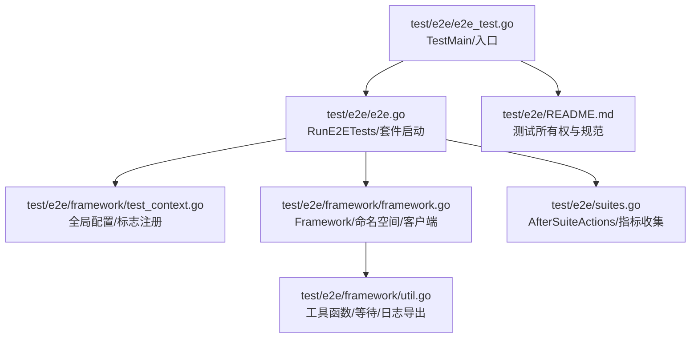
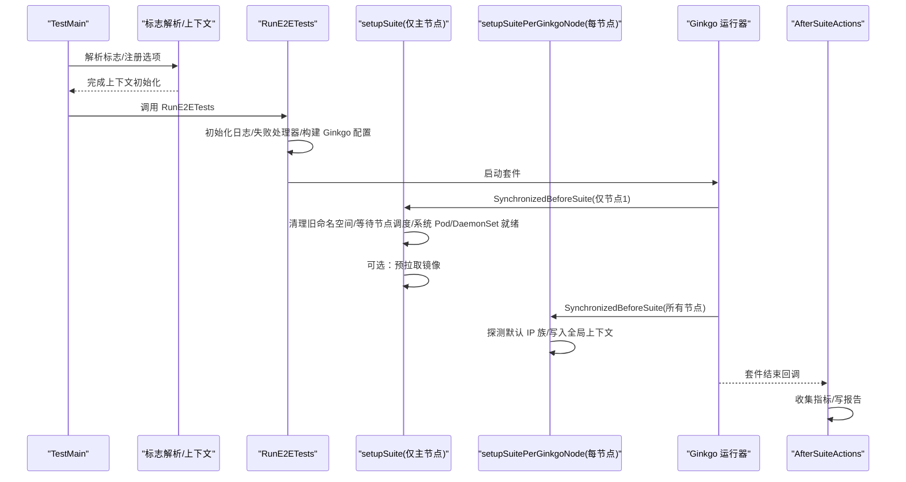
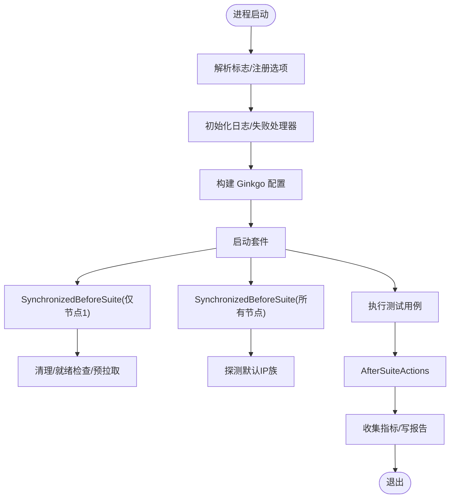
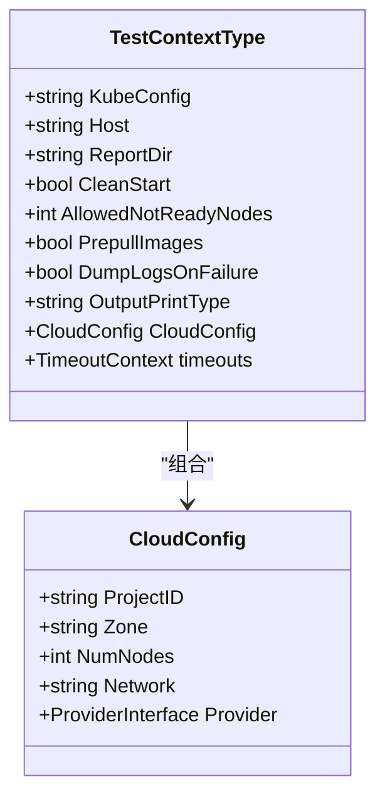
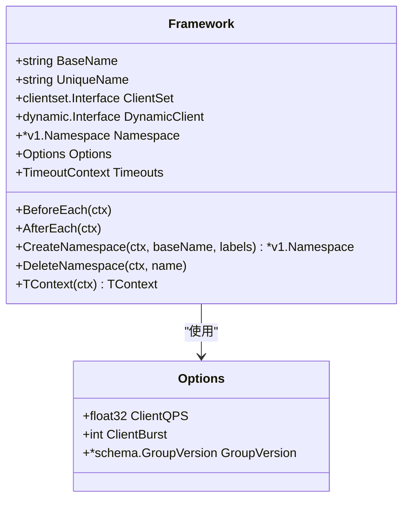
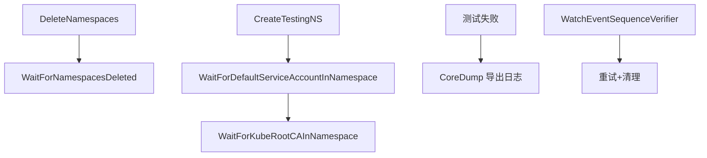
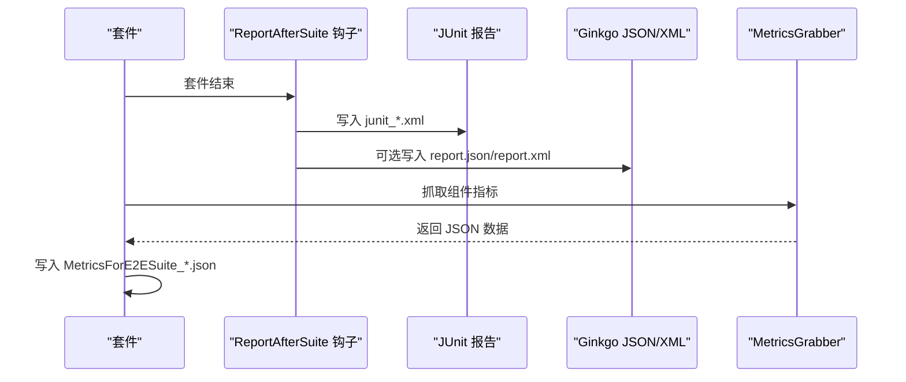
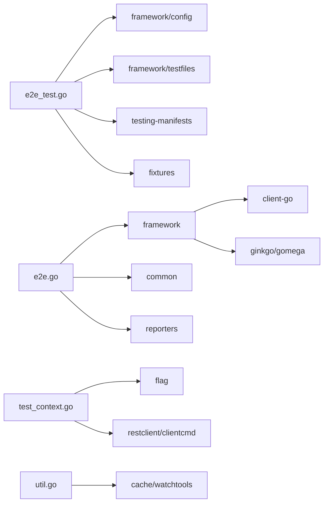

# 端到端测试

<cite>
**本文引用的文件**   
- [README.md](file://test/e2e/README.md)
- [e2e.go](file://test/e2e/e2e.go)
- [e2e_test.go](file://test/e2e/e2e_test.go)
- [suites.go](file://test/e2e/suites.go)
- [framework.go](file://test/e2e/framework/framework.go)
- [test_context.go](file://test/e2e/framework/test_context.go)
- [util.go](file://test/e2e/framework/util.go)
</cite>

## 目录
1. [简介](#简介)
2. [项目结构](#项目结构)
3. [核心组件](#核心组件)
4. [架构总览](#架构总览)
5. [详细组件分析](#详细组件分析)
6. [依赖关系分析](#依赖关系分析)
7. [性能与并行执行](#性能与并行执行)
8. [故障排查指南](#故障排查指南)
9. [结论](#结论)
10. [附录：常用场景与最佳实践](#附录常用场景与最佳实践)

## 简介
本文件面向 Kubernetes 仓库中的端到端（E2E）测试体系，系统性阐述其设计、实现与使用方式。内容覆盖真实集群环境下的测试编排、用例编写范式、资源生命周期管理、清理策略、并行执行与性能优化、报告生成与分析，以及常见 E2E 场景的实现要点。文档以源码为依据，提供可追溯的“章节来源”和“图示来源”，帮助读者快速定位到具体实现位置。

## 项目结构
Kubernetes 的 E2E 测试位于 test/e2e 目录，采用按功能域分层的组织方式，并通过 Ginkgo 套件聚合运行。顶层入口负责参数解析、框架初始化、套件启动与结果输出；各子目录（如 apps、auth、network、storage 等）承载具体业务场景测试。

**图示来源**
- [e2e_test.go:83-143](file://test/e2e/e2e_test.go#L83-L143)
- [e2e.go:86-111](file://test/e2e/e2e.go#L86-L111)
- [test_context.go:309-432](file://test/e2e/framework/test_context.go#L309-L432)
- [framework.go:277-394](file://test/e2e/framework/framework.go#L277-L394)
- [suites.go:31-81](file://test/e2e/suites.go#L31-L81)
- [util.go:520-545](file://test/e2e/framework/util.go#L520-L545)
- [README.md:1-79](file://test/e2e/README.md#L1-L79)

**章节来源**
- [README.md:1-79](file://test/e2e/README.md#L1-L79)
- [e2e_test.go:83-143](file://test/e2e/e2e_test.go#L83-L143)
- [e2e.go:86-111](file://test/e2e/e2e.go#L86-L111)

## 核心组件
- 测试入口与套件启动
  - TestMain 负责标志解析、内嵌清单加载、合规测试列表打印、Ginkgo 配置准备与退出处理。
  - RunE2ETests 初始化日志、失败处理器、Ginkgo 配置并启动套件。
- 全局上下文与标志
  - TestContextType 集中管理所有 E2E 运行期配置项，包括连接信息、报告路径、超时、节点容忍度、镜像预拉取、日志导出等。
  - RegisterCommonFlags/RegisterClusterFlags 将标志注册到命令行，支持通过环境变量或配置文件注入。
- 测试框架 Framework
  - 封装客户端创建、命名空间生命周期、Pod 状态验证、Flaky 记录、摘要输出等通用能力。
  - BeforeEach/AfterEach 保证每个测试拥有独立命名空间与客户端，并在失败时按需转储信息。
- 工具与辅助
  - util.go 提供命名空间批量删除与等待、ServiceAccount/ConfigMap 就绪等待、日志导出、命令执行、事件序列校验等。
- 套件收尾与指标
  - AfterSuiteActions 在套件结束后收集并持久化指标，便于回归分析与可视化。

**章节来源**
- [e2e_test.go:83-143](file://test/e2e/e2e_test.go#L83-L143)
- [e2e.go:86-111](file://test/e2e/e2e.go#L86-L111)
- [test_context.go:99-225](file://test/e2e/framework/test_context.go#L99-L225)
- [test_context.go:309-432](file://test/e2e/framework/test_context.go#L309-L432)
- [framework.go:108-153](file://test/e2e/framework/framework.go#L108-L153)
- [framework.go:277-394](file://test/e2e/framework/framework.go#L277-L394)
- [framework.go:452-519](file://test/e2e/framework/framework.go#L452-L519)
- [util.go:188-250](file://test/e2e/framework/util.go#L188-L250)
- [util.go:520-545](file://test/e2e/framework/util.go#L520-L545)
- [suites.go:31-81](file://test/e2e/suites.go#L31-L81)

## 架构总览
下图展示了从进程启动到测试执行的完整流程，包括标志解析、上下文初始化、Ginkgo 套件运行、命名空间与系统组件就绪检查、镜像预拉取、报告与指标输出。

**图示来源**
- [e2e_test.go:83-143](file://test/e2e/e2e_test.go#L83-L143)
- [e2e.go:69-84](file://test/e2e/e2e.go#L69-L84)
- [e2e.go:168-256](file://test/e2e/e2e.go#L168-L256)
- [e2e.go:363-379](file://test/e2e/e2e.go#L363-L379)
- [e2e.go:381-418](file://test/e2e/e2e.go#L381-L418)
- [suites.go:31-81](file://test/e2e/suites.go#L31-L81)

## 详细组件分析

### 测试入口与套件生命周期
- TestMain
  - 注册并解析标志，启用内嵌清单源，支持列出合规测试，完成后进入 m.Run()。
- RunE2ETests
  - 初始化 klog 上下文日志、设置失败处理器、构建 Ginkgo 配置并启动套件。
- SynchronizedBeforeSuite/AfterSuite
  - 仅在首个 Ginkgo 节点执行的全局前置/后置逻辑，用于一次性清理与准备。
- setupSuite
  - 加载客户端、可选清理旧命名空间、等待节点可调度、系统 Pod/DaemonSet 就绪、可选预拉取镜像、记录版本信息。
- setupSuitePerGinkgoNode
  - 在每个 Ginkgo 节点上执行，探测集群默认 IP 族并写入全局上下文。

**图示来源**
- [e2e_test.go:83-143](file://test/e2e/e2e_test.go#L83-L143)
- [e2e.go:86-111](file://test/e2e/e2e.go#L86-L111)
- [e2e.go:168-256](file://test/e2e/e2e.go#L168-L256)
- [e2e.go:363-379](file://test/e2e/e2e.go#L363-L379)
- [suites.go:31-81](file://test/e2e/suites.go#L31-L81)

**章节来源**
- [e2e_test.go:83-143](file://test/e2e/e2e_test.go#L83-L143)
- [e2e.go:69-84](file://test/e2e/e2e.go#L69-L84)
- [e2e.go:86-111](file://test/e2e/e2e.go#L86-L111)
- [e2e.go:168-256](file://test/e2e/e2e.go#L168-L256)
- [e2e.go:363-379](file://test/e2e/e2e.go#L363-L379)

### 全局上下文与标志
- TestContextType
  - 包含连接信息、报告路径、超时、节点容忍度、镜像预拉取、日志导出、指标采集、卷驱动开关等大量运行时选项。
- 标志注册
  - RegisterCommonFlags 注册通用标志（如报告、日志、容忍度、输出格式等）。
  - RegisterClusterFlags 注册集群相关标志（如 provider、节点数、网络、最小启动 Pod 数、etcd 升级参数等）。
- 读取后处理
  - AfterReadingAllFlags 调整 gomega 默认超时、生成临时 kubeconfig、设置默认 host、初始化 Provider、创建报告目录与 JUnit/Ginkgo 报告钩子。

**图示来源**
- [test_context.go:99-225](file://test/e2e/framework/test_context.go#L99-L225)
- [test_context.go:255-276](file://test/e2e/framework/test_context.go#L255-L276)
- [test_context.go:309-432](file://test/e2e/framework/test_context.go#L309-L432)
- [test_context.go:449-596](file://test/e2e/framework/test_context.go#L449-L596)

**章节来源**
- [test_context.go:99-225](file://test/e2e/framework/test_context.go#L99-L225)
- [test_context.go:309-432](file://test/e2e/framework/test_context.go#L309-L432)
- [test_context.go:449-596](file://test/e2e/framework/test_context.go#L449-L596)

### 测试框架 Framework
- 职责
  - 为每个测试提供独立的 ClientSet、DynamicClient、RESTMapper、ScaleGetter 与命名空间。
  - 管理命名空间生命周期（创建、删除、失败转储）、Flaky 记录、摘要输出。
- 关键方法
  - NewDefaultFramework/NewFramework：构造框架并注册 BeforeEach/DeferCleanup。
  - BeforeEach：加载配置、创建客户端、创建命名空间、等待 ServiceAccount/CA。
  - AfterEach：根据标志决定是否删除命名空间、汇总 Flaky 与摘要、清理引用。
  - CreateNamespace/DeleteNamespace：带重试与标签注入（含 Pod Security Admission 级别）。
  - TContext/ContextTODO：将框架与 context 结合，方便传递客户端与命名空间。

**图示来源**
- [framework.go:108-153](file://test/e2e/framework/framework.go#L108-L153)
- [framework.go:277-394](file://test/e2e/framework/framework.go#L277-L394)
- [framework.go:452-519](file://test/e2e/framework/framework.go#L452-L519)
- [framework.go:553-599](file://test/e2e/framework/framework.go#L553-L599)

**章节来源**
- [framework.go:108-153](file://test/e2e/framework/framework.go#L108-L153)
- [framework.go:277-394](file://test/e2e/framework/framework.go#L277-L394)
- [framework.go:452-519](file://test/e2e/framework/framework.go#L452-L519)
- [framework.go:553-599](file://test/e2e/framework/framework.go#L553-L599)

### 工具与辅助能力
- 命名空间批量删除与等待
  - DeleteNamespaces：按过滤规则并发删除命名空间。
  - WaitForNamespacesDeleted：轮询直至目标命名空间消失。
- 服务账户与 CA 就绪等待
  - WaitForDefaultServiceAccountInNamespace/WaitForKubeRootCAInNamespace：确保新命名空间具备必要对象。
- 日志导出
  - CoreDump：通过脚本导出 master 与节点日志至本地或 GCS。
- 事件序列校验
  - WatchEventSequenceVerifier：基于 watch 的事件顺序断言，支持重试与清理。

**图示来源**
- [util.go:188-250](file://test/e2e/framework/util.go#L188-L250)
- [util.go:307-319](file://test/e2e/framework/util.go#L307-L319)
- [util.go:520-545](file://test/e2e/framework/util.go#L520-L545)
- [util.go:654-708](file://test/e2e/framework/util.go#L654-L708)

**章节来源**
- [util.go:188-250](file://test/e2e/framework/util.go#L188-L250)
- [util.go:307-319](file://test/e2e/framework/util.go#L307-L319)
- [util.go:520-545](file://test/e2e/framework/util.go#L520-L545)
- [util.go:654-708](file://test/e2e/framework/util.go#L654-L708)

### 报告与指标
- JUnit/Ginkgo 报告
  - 通过 AfterReadingAllFlags 中注册的钩子，在套件结束后输出精简版 JUnit 与可选完整 Ginkgo JSON/XML。
- 套件级指标
  - AfterSuiteActions 调用 MetricsGrabber 抓取 apiserver、scheduler、controller-manager、kubelet 等组件指标，并写入 report-dir。

**图示来源**
- [test_context.go:553-596](file://test/e2e/framework/test_context.go#L553-L596)
- [suites.go:31-81](file://test/e2e/suites.go#L31-L81)

**章节来源**
- [test_context.go:553-596](file://test/e2e/framework/test_context.go#L553-L596)
- [suites.go:31-81](file://test/e2e/suites.go#L31-L81)

## 依赖关系分析
- 入口层
  - e2e_test.go 依赖 framework/config、framework/testfiles、testing-manifests、fixtures 等，完成清单与测试数据源的注册。
- 运行层
  - e2e.go 依赖 framework、common、reporters、daemonset/pod/node 等子框架，负责套件启动与系统就绪检查。
- 框架层
  - framework.go 依赖 client-go、ginkgo/gomega、admission API 等，提供通用能力。
  - test_context.go 依赖 flag、ginkgo/types、restclient、clientcmd 等，负责配置与标志。
  - util.go 依赖 cache/watchtools、exec、sets 等，提供工具函数。

**图示来源**
- [e2e_test.go:44-72](file://test/e2e/e2e_test.go#L44-L72)
- [e2e.go:19-57](file://test/e2e/e2e.go#L19-L57)
- [framework.go:24-56](file://test/e2e/framework/framework.go#L24-L56)
- [test_context.go:19-48](file://test/e2e/framework/test_context.go#L19-L48)
- [util.go:19-55](file://test/e2e/framework/util.go#L19-L55)

**章节来源**
- [e2e_test.go:44-72](file://test/e2e/e2e_test.go#L44-L72)
- [e2e.go:19-57](file://test/e2e/e2e.go#L19-L57)
- [framework.go:24-56](file://test/e2e/framework/framework.go#L24-L56)
- [test_context.go:19-48](file://test/e2e/framework/test_context.go#L19-L48)
- [util.go:19-55](file://test/e2e/framework/util.go#L19-L55)

## 性能与并行执行
- 并行执行
  - 通过 Ginkgo 多进程模式运行，RunE2ETests 会输出当前节点编号与 RunID，便于区分不同 worker 的输出与产物。
- 超时与轮询
  - AfterReadingAllFlags 统一设置 gomega 的默认轮询间隔与超时，避免过短导致的抖动失败。
- 资源就绪与容忍度
  - setupSuite 等待节点可调度、系统 Pod/DaemonSet 就绪，并允许一定数量的非就绪节点，提升大规模集群稳定性。
- 镜像预拉取
  - 通过 prepullImages 在各节点创建 DaemonSet 预拉取所需镜像，减少测试阶段因镜像拉取导致的抖动。
- 指标与日志
  - 支持在测试后收集组件指标与导出日志，有助于定位性能瓶颈与不稳定因素。

**章节来源**
- [e2e.go:109-111](file://test/e2e/e2e.go#L109-L111)
- [test_context.go:469-477](file://test/e2e/framework/test_context.go#L469-L477)
- [e2e.go:211-237](file://test/e2e/e2e.go#L211-L237)
- [e2e.go:381-418](file://test/e2e/e2e.go#L381-L418)
- [suites.go:31-81](file://test/e2e/suites.go#L31-L81)

## 故障排查指南
- 命名空间残留
  - 使用 CleanStart 在套件开始前清理历史命名空间；若仍残留，可使用 DeleteNamespaces/WaitForNamespacesDeleted 进行清理。
- 系统组件未就绪
  - 检查 setupSuite 中的等待逻辑与 AllowedNotReadyNodes 配置；必要时增大 SystemPodsStartup/SystemDaemonsetStartup 超时。
- 私有镜像拉取失败
  - 启用 --prepull-images 并使用 --e2e-docker-config-file 注入凭据；确认 ServiceAccount 已挂载 imagePullSecret。
- 日志与指标缺失
  - 确认 --report-dir 已设置；如需完整报告，开启 --report-complete-ginkgo/--report-complete-junit；套件结束后检查 MetricsForE2ESuite_*.json。
- 事件顺序问题
  - 使用 WatchEventSequenceVerifier 对关键事件序列进行断言，并配合重试与清理逻辑提高鲁棒性。

**章节来源**
- [e2e.go:190-204](file://test/e2e/e2e.go#L190-L204)
- [util.go:188-250](file://test/e2e/framework/util.go#L188-L250)
- [e2e.go:235-237](file://test/e2e/e2e.go#L235-L237)
- [e2e.go:381-418](file://test/e2e/e2e.go#L381-L418)
- [test_context.go:553-596](file://test/e2e/framework/test_context.go#L553-L596)
- [util.go:654-708](file://test/e2e/framework/util.go#L654-L708)

## 结论
Kubernetes E2E 测试体系以 Ginkgo 为核心，围绕全局上下文、框架抽象与丰富工具链构建，具备完善的资源生命周期管理、并行执行、报告与指标采集能力。通过遵循统一的测试所有权与组织规范，可在真实集群环境中稳定地覆盖复杂场景，并为持续集成与发布提供可靠保障。

## 附录：常用场景与最佳实践
- 编写测试用例
  - 使用 SIGDescribe 标注所属 SIG，并通过 ginkgo.It 定义具体场景；利用 Framework 提供的命名空间与客户端简化资源操作。
- 资源创建与状态验证
  - 借助框架的等待函数与自定义超时，确保资源达到期望状态；必要时使用 WatchEventSequenceVerifier 验证事件顺序。
- 故障恢复测试
  - 在测试中主动触发异常（如节点不可用、API 中断），验证控制器自愈与资源重建行为；结合日志导出与指标采集定位问题。
- 测试数据生命周期管理
  - 每个测试使用独立命名空间，AfterEach 自动清理；必要时手动 DeleteNamespace 并等待删除完成。
- 清理策略
  - 长驻集群建议启用 CleanStart；对于失败保留调试，可关闭 DeleteNamespaceOnFailure 以便后续分析。
- 并行与性能优化
  - 合理设置 AllowedNotReadyNodes 与各类超时；启用镜像预拉取；控制并发规模避免 API 限流。
- 报告与结果分析
  - 指定 --report-dir 并选择输出格式；结合 JUnit 与 Ginkgo 报告进行自动化分析；关注套件级指标变化趋势。

**章节来源**
- [README.md:1-79](file://test/e2e/README.md#L1-L79)
- [framework.go:277-394](file://test/e2e/framework/framework.go#L277-L394)
- [util.go:654-708](file://test/e2e/framework/util.go#L654-L708)
- [test_context.go:309-432](file://test/e2e/framework/test_context.go#L309-L432)
- [suites.go:31-81](file://test/e2e/suites.go#L31-L81)