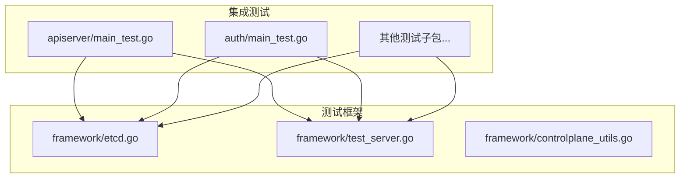
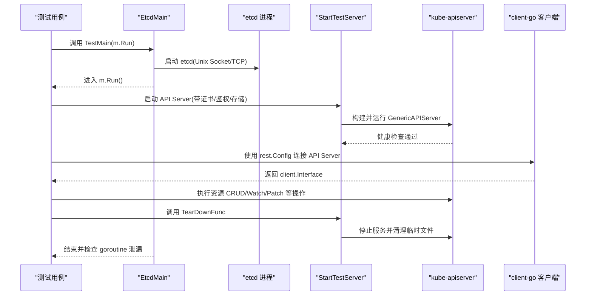
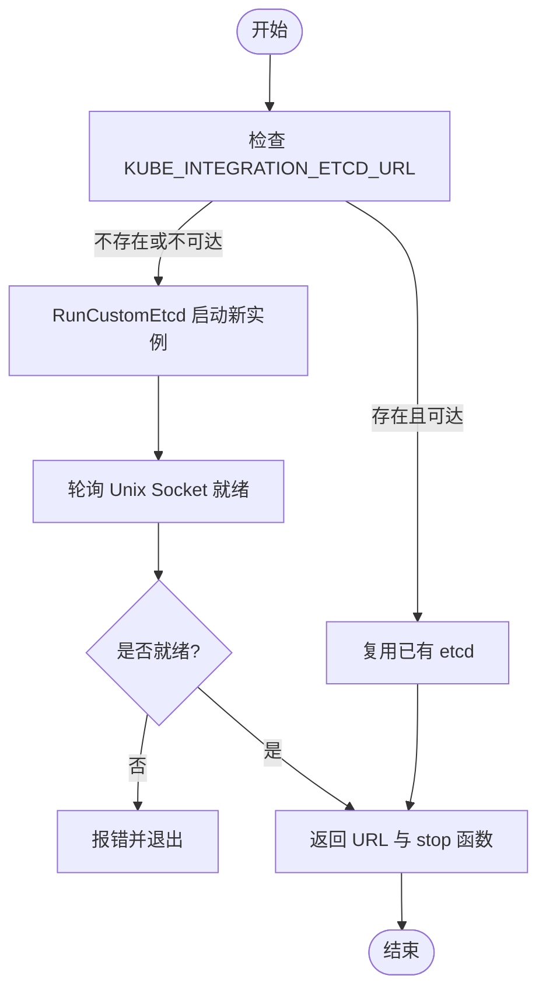
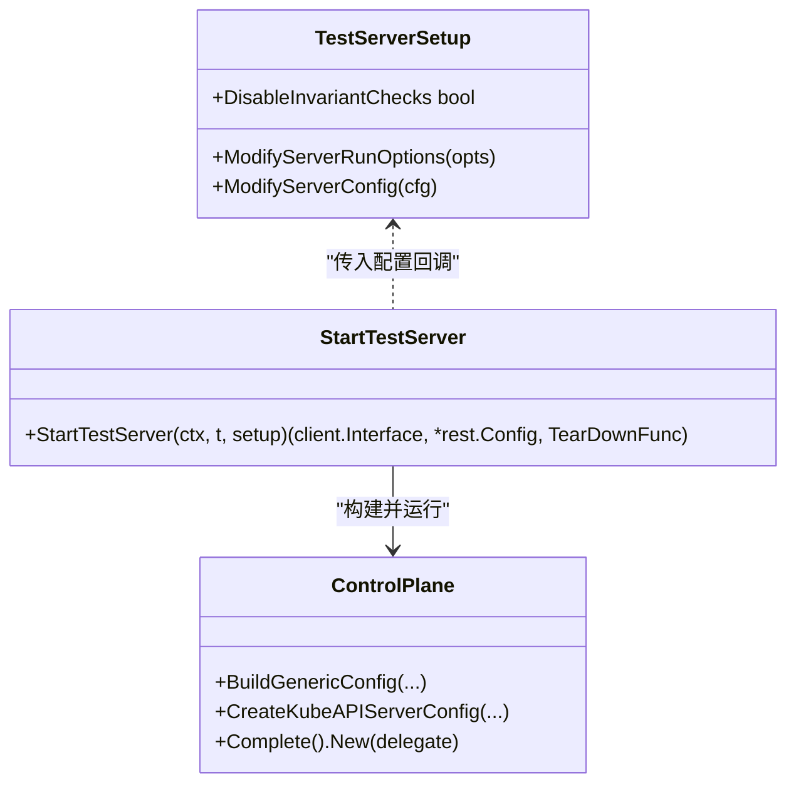
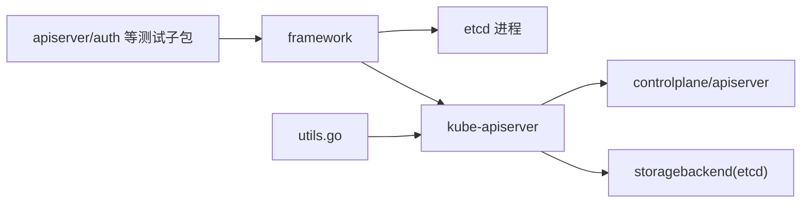

# 集成测试

<cite>
**本文引用的文件**   
- [test/integration/doc.go](file://test/integration/doc.go)
- [test/integration/utils.go](file://test/integration/utils.go)
- [test/integration/framework/etcd.go](file://test/integration/framework/etcd.go)
- [test/integration/framework/test_server.go](file://test/integration/framework/test_server.go)
- [test/integration/framework/controlplane_utils.go](file://test/integration/framework/controlplane_utils.go)
- [test/integration/apiserver/main_test.go](file://test/integration/apiserver/main_test.go)
- [test/integration/auth/main_test.go](file://test/integration/auth/main_test.go)
</cite>

## 目录
1. [简介](#简介)
2. [项目结构](#项目结构)
3. [核心组件](#核心组件)
4. [架构总览](#架构总览)
5. [详细组件分析](#详细组件分析)
6. [依赖关系分析](#依赖关系分析)
7. [性能与并发考量](#性能与并发考量)
8. [故障排查指南](#故障排查指南)
9. [结论](#结论)
10. [附录：常见场景与最佳实践](#附录常见场景与最佳实践)

## 简介
本文件面向在 Kubernetes 源码仓库中编写和运行“集成测试”的开发者，聚焦以下目标：
- 如何搭建测试集群环境（etcd、API 服务器、控制器）
- 如何编写与真实 API 服务器的交互测试及资源操作
- 测试数据的创建、验证与清理策略
- 并发测试的处理方法与资源竞争解决方案
- 测试环境的隔离与资源管理
- 完整框架使用指南与常见集成测试场景示例

Kubernetes 的集成测试位于 test/integration 目录，通过启动真实的 etcd 与 kube-apiserver，结合 client-go 客户端对资源进行读写与校验。

章节来源
- [test/integration/doc.go:17-19](file://test/integration/doc.go#L17-L19)

## 项目结构
- test/integration：集成测试根包，包含各功能域的测试子包（如 apiserver、auth、deployment 等）
- test/integration/framework：集成测试基础设施，提供 etcd 生命周期管理、API Server 启动与配置、默认选项等
- 每个测试子包通常包含 main_test.go 作为入口，调用 framework.EtcdMain 或 framework.StartEtcd 来管理 etcd 生命周期

图表来源
- [test/integration/apiserver/main_test.go:25-27](file://test/integration/apiserver/main_test.go#L25-L27)
- [test/integration/auth/main_test.go:27-29](file://test/integration/auth/main_test.go#L27-L29)
- [test/integration/framework/etcd.go:254-298](file://test/integration/framework/etcd.go#L254-L298)
- [test/integration/framework/test_server.go:76-296](file://test/integration/framework/test_server.go#L76-L296)
- [test/integration/framework/controlplane_utils.go:78-107](file://test/integration/framework/controlplane_utils.go#L78-L107)

章节来源
- [test/integration/doc.go:17-19](file://test/integration/doc.go#L17-L19)
- [test/integration/apiserver/main_test.go:25-27](file://test/integration/apiserver/main_test.go#L25-L27)
- [test/integration/auth/main_test.go:27-29](file://test/integration/auth/main_test.go#L27-L29)

## 核心组件
- etcd 管理
  - EtcdMain：测试进程入口，负责启动 etcd、运行测试、退出前检查 goroutine 泄漏并清理
  - StartEtcd：在单个测试内启动 etcd，自动注册 Cleanup 钩子
  - RunCustomEtcd：以 Unix Domain Socket 方式启动独立 etcd 实例，返回 URL 与停止函数
  - GetEtcdURL：获取当前使用的 etcd URL（环境变量优先）
- API Server 管理
  - StartTestServer：构建并启动一个最小化的 kube-apiserver，生成证书、配置认证授权、等待健康检查，返回 client.Interface 与 rest.Config，以及 TearDownFunc
  - DefaultOpenAPIConfig / DefaultOpenAPIV3Config：为 OpenAPI/OpenAPIv3 提供默认配置
  - DefaultEtcdOptions / SharedEtcd：为存储后端提供默认 etcd 选项与共享 etcd 配置
  - DefaultTestServerFlags：为测试 API Server 设置默认命令行标志
- 通用工具
  - DeletePodOrErrorf、WaitForPodToDisappear：常用资源操作辅助方法
  - GetEtcdClients：基于 storagebackend.TransportConfig 构造 etcd v3 客户端

章节来源
- [test/integration/framework/etcd.go:100-252](file://test/integration/framework/etcd.go#L100-L252)
- [test/integration/framework/etcd.go:254-298](file://test/integration/framework/etcd.go#L254-L298)
- [test/integration/framework/etcd.go:300-322](file://test/integration/framework/etcd.go#L300-L322)
- [test/integration/framework/test_server.go:76-296](file://test/integration/framework/test_server.go#L76-L296)
- [test/integration/framework/controlplane_utils.go:40-76](file://test/integration/framework/controlplane_utils.go#L40-L76)
- [test/integration/framework/controlplane_utils.go:78-107](file://test/integration/framework/controlplane_utils.go#L78-L107)
- [test/integration/utils.go:35-67](file://test/integration/utils.go#L35-L67)
- [test/integration/utils.go:69-72](file://test/integration/utils.go#L69-L72)

## 架构总览
下图展示了集成测试的典型启动流程：测试入口通过 framework.EtcdMain 启动 etcd；随后在测试用例中通过 framework.StartTestServer 启动 kube-apiserver；测试使用 client-go 客户端访问 API 并进行断言；最后由 TearDownFunc 完成指标校验与资源清理。

图表来源
- [test/integration/apiserver/main_test.go:25-27](file://test/integration/apiserver/main_test.go#L25-L27)
- [test/integration/framework/etcd.go:254-298](file://test/integration/framework/etcd.go#L254-L298)
- [test/integration/framework/test_server.go:76-296](file://test/integration/framework/test_server.go#L76-L296)

## 详细组件分析

### etcd 生命周期管理
- 启动策略
  - 若环境变量 KUBE_INTEGRATION_ETCD_URL 指向可连接的 etcd，则复用现有实例
  - 否则通过 RunCustomEtcd 启动独立 etcd，数据目录与监听地址均使用临时路径，避免冲突
- 日志与健壮性
  - 过滤已知无害消息，结构化输出 etcd 日志
  - 优雅关闭：先 SIGTERM，超时后强制终止，确保数据目录清理
- 进程级入口
  - EtcdMain：统一入口，支持 goleak 泄漏检测，并在退出前停止 klog flush 守护协程

图表来源
- [test/integration/framework/etcd.go:61-81](file://test/integration/framework/etcd.go#L61-L81)
- [test/integration/framework/etcd.go:100-252](file://test/integration/framework/etcd.go#L100-L252)
- [test/integration/framework/etcd.go:254-298](file://test/integration/framework/etcd.go#L254-L298)

章节来源
- [test/integration/framework/etcd.go:61-81](file://test/integration/framework/etcd.go#L61-L81)
- [test/integration/framework/etcd.go:100-252](file://test/integration/framework/etcd.go#L100-L252)
- [test/integration/framework/etcd.go:254-298](file://test/integration/framework/etcd.go#L254-L298)

### API Server 启动与配置
- 证书与监听
  - 自动生成临时证书目录，绑定本地回环地址与随机端口
- 认证与授权
  - 启用 Node + RBAC 模式，配置请求头认证、Client CA、ServiceAccount 签发密钥
- 存储后端
  - 使用独立的 etcd 前缀，避免不同测试间数据污染
- 健康检查与就绪
  - 轮询 /healthz 与命名空间资源可用性，确保 API Server 完全就绪
- 清理与不变量检查
  - 停止前抓取指标并执行不变量检查，随后取消上下文、等待进程退出并删除临时文件

图表来源
- [test/integration/framework/test_server.go:66-72](file://test/integration/framework/test_server.go#L66-L72)
- [test/integration/framework/test_server.go:76-296](file://test/integration/framework/test_server.go#L76-L296)

章节来源
- [test/integration/framework/test_server.go:76-296](file://test/integration/framework/test_server.go#L76-L296)
- [test/integration/framework/controlplane_utils.go:78-107](file://test/integration/framework/controlplane_utils.go#L78-L107)

### 测试入口与组织
- 每个测试子包的 main_test.go 通常调用 framework.EtcdMain 作为进程入口，保证 etcd 生命周期与泄漏检测
- 测试用例内部可使用 framework.StartTestServer 启动 API Server，并使用返回的 client.Interface 与 rest.Config 发起请求

章节来源
- [test/integration/apiserver/main_test.go:25-27](file://test/integration/apiserver/main_test.go#L25-L27)
- [test/integration/auth/main_test.go:27-29](file://test/integration/auth/main_test.go#L27-L29)

## 依赖关系分析
- 测试子包依赖 framework 提供的 etcd 与 API Server 管理能力
- API Server 依赖 controlplane 与 apiserver 组件，使用 storagebackend 配置 etcd 存储
- 测试工具 utils 提供常用资源操作与 etcd 客户端构造

图表来源
- [test/integration/apiserver/main_test.go:25-27](file://test/integration/apiserver/main_test.go#L25-L27)
- [test/integration/framework/etcd.go:254-298](file://test/integration/framework/etcd.go#L254-L298)
- [test/integration/framework/test_server.go:76-296](file://test/integration/framework/test_server.go#L76-L296)
- [test/integration/utils.go:35-67](file://test/integration/utils.go#L35-L67)

章节来源
- [test/integration/framework/etcd.go:254-298](file://test/integration/framework/etcd.go#L254-L298)
- [test/integration/framework/test_server.go:76-296](file://test/integration/framework/test_server.go#L76-L296)
- [test/integration/utils.go:35-67](file://test/integration/utils.go#L35-L67)

## 性能与并发考量
- 并发隔离
  - 每个测试使用独立的 etcd 前缀与临时证书目录，避免状态交叉
  - 使用随机端口与 Unix Socket 减少端口冲突
- 资源竞争
  - 通过唯一前缀与临时目录实现强隔离；必要时可在 ModifyServerRunOptions 中进一步调整参数
- 指标与不变量
  - 测试结束时执行指标不变量检查，有助于发现潜在的资源泄露或异常行为
- 建议
  - 合理设置超时与重试间隔，避免长时阻塞
  - 对于需要多控制器的复杂场景，考虑扩展 StartTestServer 的回调以启用更多控制器

章节来源
- [test/integration/framework/test_server.go:144-156](file://test/integration/framework/test_server.go#L144-L156)
- [test/integration/framework/test_server.go:267-293](file://test/integration/framework/test_server.go#L267-L293)

## 故障排查指南
- etcd 未安装或不可用
  - 现象：无法找到 etcd 或连接失败
  - 处理：安装 etcd 或通过 hack/install-etcd.sh 安装到 third_party；或设置 KUBE_INTEGRATION_ETCD_URL 指向可用实例
- API Server 启动失败
  - 现象：健康检查不通过或证书相关错误
  - 处理：检查临时目录权限、端口占用；确认认证与授权配置正确
- 资源删除或等待超时
  - 现象：DeletePodOrErrorf 报错或 WaitForPodToDisappear 超时
  - 处理：确认命名空间与资源名称正确；适当增加超时时间；查看 API Server 日志定位问题
- goroutine 泄漏
  - 现象：EtcdMain 退出时报 goroutine leak
  - 处理：根据堆栈定位未退出的协程；必要时在测试中显式释放资源或忽略已知无害泄漏

章节来源
- [test/integration/framework/etcd.go:100-111](file://test/integration/framework/etcd.go#L100-L111)
- [test/integration/framework/etcd.go:254-298](file://test/integration/framework/etcd.go#L254-L298)
- [test/integration/utils.go:35-67](file://test/integration/utils.go#L35-L67)

## 结论
Kubernetes 集成测试通过 framework 提供了稳定的 etcd 与 API Server 生命周期管理，配合 client-go 实现对真实控制平面的端到端验证。遵循本文档的搭建步骤、隔离策略与并发处理方法，可以高效地编写与维护高质量的集成测试。

## 附录：常见场景与最佳实践
- 快速上手
  - 在每个测试子包中添加 main_test.go，调用 framework.EtcdMain 作为入口
  - 在测试中使用 framework.StartTestServer 启动 API Server，获取 client.Interface 与 rest.Config
- 与真实 API 服务器交互
  - 使用 client-go 的 typed/dynamic 客户端进行资源的 Create/Get/List/Update/Delete/Patch/Watch
  - 利用 utils.WaitForPodToDisappear 等工具进行异步状态等待
- 测试数据策略
  - 创建：在测试前置阶段创建必要的命名空间与资源
  - 验证：使用断言库对比期望状态与实际状态
  - 清理：在 defer 或 t.Cleanup 中删除资源，确保幂等与容错
- 并发测试
  - 使用独立前缀与临时目录，避免共享状态
  - 对可能竞态的操作增加重试与超时保护
- 控制器集成
  - 如需控制器参与，可通过 ModifyServerRunOptions 启用相应控制器或注入自定义逻辑
- 参考入口
  - apiserver 与 auth 子包的 main_test.go 展示了标准入口用法

章节来源
- [test/integration/apiserver/main_test.go:25-27](file://test/integration/apiserver/main_test.go#L25-L27)
- [test/integration/auth/main_test.go:27-29](file://test/integration/auth/main_test.go#L27-L29)
- [test/integration/framework/test_server.go:76-296](file://test/integration/framework/test_server.go#L76-L296)
- [test/integration/utils.go:35-67](file://test/integration/utils.go#L35-L67)