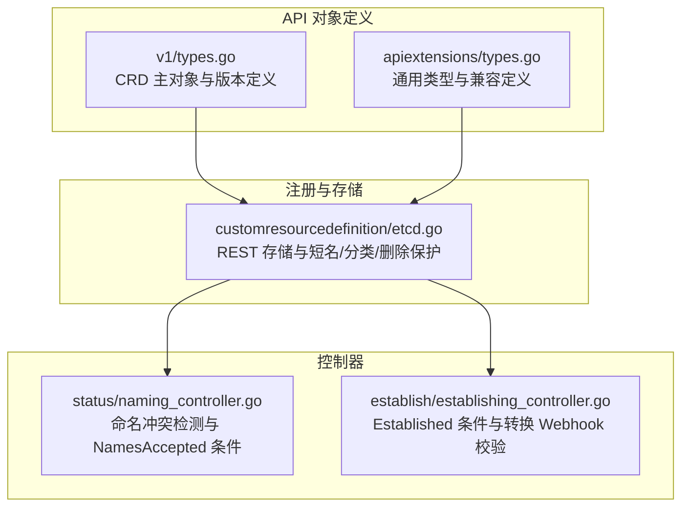
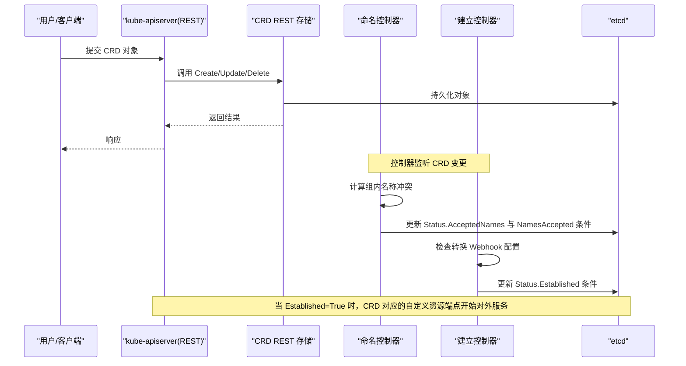
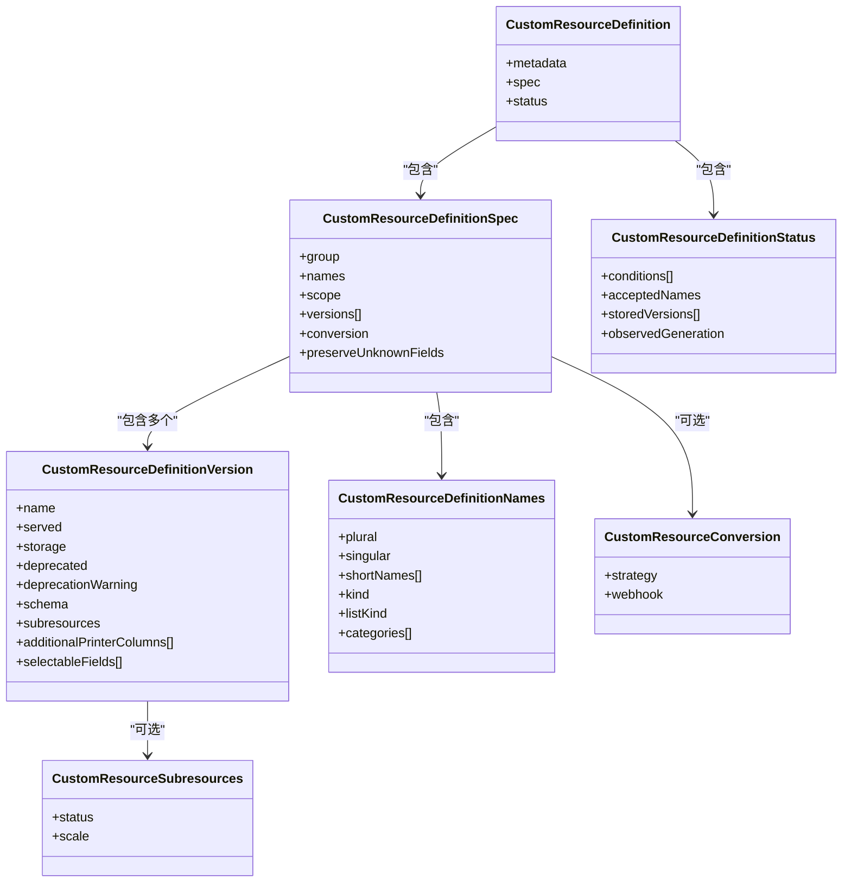
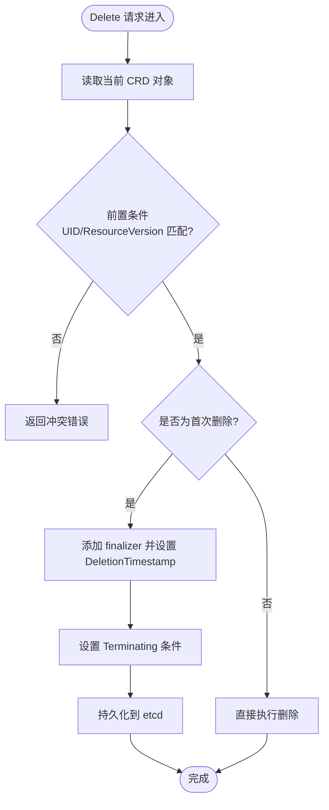
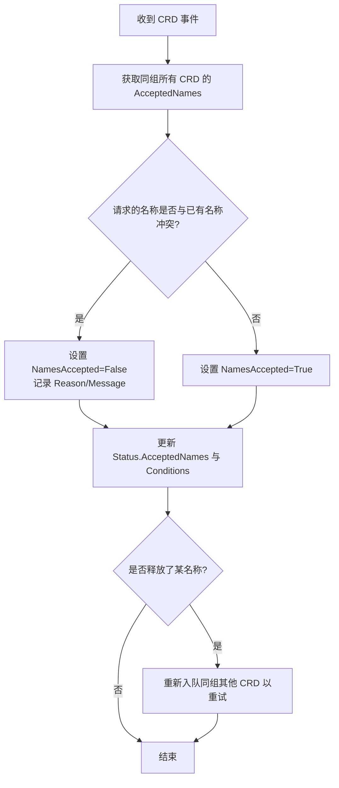
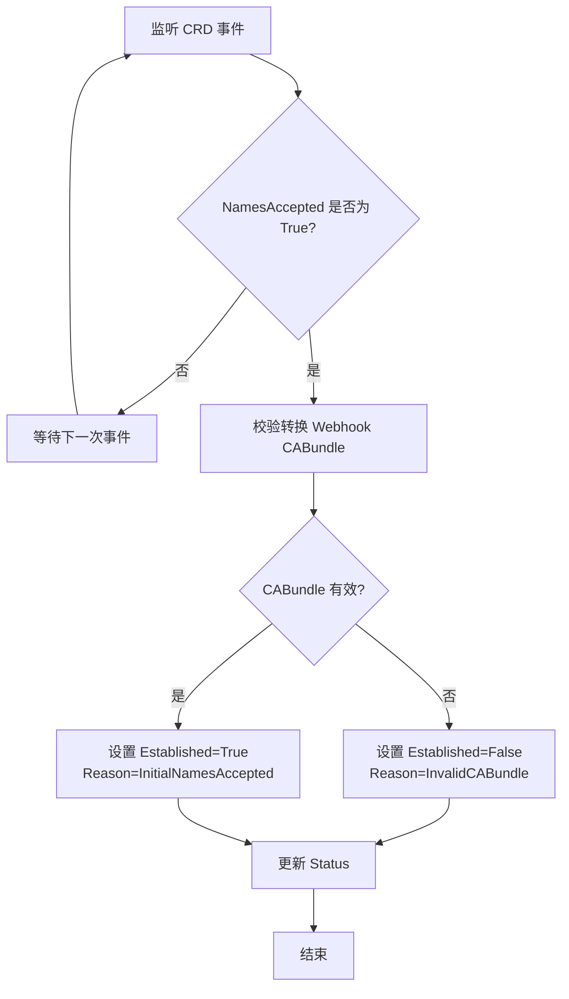
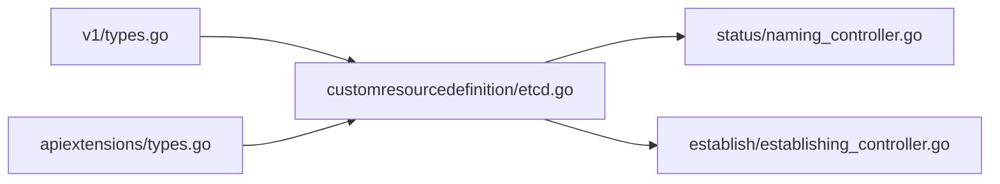

# CRD基础概念

<cite>
**本文引用的文件**   
- [staging/src/k8s.io/apiextensions-apiserver/pkg/apis/apiextensions/v1/types.go](file://staging/src/k8s.io/apiextensions-apiserver/pkg/apis/apiextensions/v1/types.go)
- [staging/src/k8s.io/apiextensions-apiserver/pkg/apis/apiextensions/types.go](file://staging/src/k8s.io/apiextensions-apiserver/pkg/apis/apiextensions/types.go)
- [staging/src/k8s.io/apiextensions-apiserver/pkg/registry/customresourcedefinition/etcd.go](file://staging/src/k8s.io/apiextensions-apiserver/pkg/registry/customresourcedefinition/etcd.go)
- [staging/src/k8s.io/apiextensions-apiserver/pkg/controller/status/naming_controller.go](file://staging/src/k8s.io/apiextensions-apiserver/pkg/controller/status/naming_controller.go)
- [staging/src/k8s.io/apiextensions-apiserver/pkg/controller/establish/establishing_controller.go](file://staging/src/k8s.io/apiextensions-apiserver/pkg/controller/establish/establishing_controller.go)
</cite>

## 目录
1. [简介](#简介)
2. [项目结构](#项目结构)
3. [核心组件](#核心组件)
4. [架构总览](#架构总览)
5. [详细组件分析](#详细组件分析)
6. [依赖关系分析](#依赖关系分析)
7. [性能与可扩展性](#性能与可扩展性)
8. [故障排查指南](#故障排查指南)
9. [结论](#结论)
10. [附录：CRD语法与关键字段速查](#附录crd语法与关键字段速查)

## 简介
自定义资源定义（CustomResourceDefinition，简称 CRD）是 Kubernetes 扩展 API 的核心机制。通过 CRD，用户可以在不修改 kube-apiserver 源码的情况下，向集群注册新的资源类型，使其具备与内置资源一致的生命周期、发现、鉴权、存储与工具链支持。CRD 的价值在于：
- 将领域模型以“资源”的形式纳入 Kubernetes 生态，便于声明式管理、版本化演进和自动化编排。
- 借助 OpenAPI v3 Schema 提供强类型校验、默认值与裁剪能力，提升稳定性与可维护性。
- 配合控制器模式，实现业务逻辑的自治与自愈。

本章节为初学者提供清晰的概念入门，后续章节深入解析 CRD 的数据模型、注册流程、状态机与关键实现要点。

## 项目结构
围绕 CRD 的关键代码主要位于 apiextensions-apiserver 模块中，分为三层：
- API 对象定义层：描述 CRD 的 JSON/YAML 结构与字段语义。
- 注册与存储层：提供 REST 接口、短名、分类、删除保护等。
- 控制器层：负责名称冲突检测、命名接受、建立服务、最终清理等。

图示来源
- [staging/src/k8s.io/apiextensions-apiserver/pkg/apis/apiextensions/v1/types.go:40-432](file://staging/src/k8s.io/apiextensions-apiserver/pkg/apis/apiextensions/v1/types.go#L40-L432)
- [staging/src/k8s.io/apiextensions-apiserver/pkg/apis/apiextensions/types.go:33-411](file://staging/src/k8s.io/apiextensions-apiserver/pkg/apis/apiextensions/types.go#L33-L411)
- [staging/src/k8s.io/apiextensions-apiserver/pkg/registry/customresourcedefinition/etcd.go:37-81](file://staging/src/k8s.io/apiextensions-apiserver/pkg/registry/customresourcedefinition/etcd.go#L37-L81)
- [staging/src/k8s.io/apiextensions-apiserver/pkg/controller/status/naming_controller.go:46-95](file://staging/src/k8s.io/apiextensions-apiserver/pkg/controller/status/naming_controller.go#L46-L95)
- [staging/src/k8s.io/apiextensions-apiserver/pkg/controller/establish/establishing_controller.go:41-69](file://staging/src/k8s.io/apiextensions-apiserver/pkg/controller/establish/establishing_controller.go#L41-L69)

章节来源
- [staging/src/k8s.io/apiextensions-apiserver/pkg/apis/apiextensions/v1/types.go:40-432](file://staging/src/k8s.io/apiextensions-apiserver/pkg/apis/apiextensions/v1/types.go#L40-L432)
- [staging/src/k8s.io/apiextensions-apiserver/pkg/apis/apiextensions/types.go:33-411](file://staging/src/k8s.io/apiextensions-apiserver/pkg/apis/apiextensions/types.go#L33-L411)
- [staging/src/k8s.io/apiextensions-apiserver/pkg/registry/customresourcedefinition/etcd.go:37-81](file://staging/src/k8s.io/apiextensions-apiserver/pkg/registry/customresourcedefinition/etcd.go#L37-L81)
- [staging/src/k8s.io/apiextensions-apiserver/pkg/controller/status/naming_controller.go:46-95](file://staging/src/k8s.io/apiextensions-apiserver/pkg/controller/status/naming_controller.go#L46-L95)
- [staging/src/k8s.io/apiextensions-apiserver/pkg/controller/establish/establishing_controller.go:41-69](file://staging/src/k8s.io/apiextensions-apiserver/pkg/controller/establish/establishing_controller.go#L41-L69)

## 核心组件
- CustomResourceDefinition（CRD）对象：用于声明一个自定义资源类型的元数据、版本、作用域、名称、验证与子资源等。
- 版本（Version）：同一 CRD 可暴露多个 API 版本，其中仅一个作为存储版本，其余可通过转换策略进行互转。
- 名称（Names）：包括复数/单数形式、Kind、ListKind、短名与分组类别，决定 REST 路径与 kubectl 行为。
- 作用域（Scope）：Cluster 或 Namespaced，决定资源是否受命名空间隔离。
- 状态（Status）：包含条件（Conditions）、已接受的名称（AcceptedNames）、持久化过的版本列表（StoredVersions）等。
- 转换（Conversion）：None 或 Webhook，控制多版本间的数据转换方式。
- 子资源（Subresources）：如 status、scale，提供专用端点与语义。

章节来源
- [staging/src/k8s.io/apiextensions-apiserver/pkg/apis/apiextensions/v1/types.go:40-432](file://staging/src/k8s.io/apiextensions-apiserver/pkg/apis/apiextensions/v1/types.go#L40-L432)
- [staging/src/k8s.io/apiextensions-apiserver/pkg/apis/apiextensions/types.go:33-411](file://staging/src/k8s.io/apiextensions-apiserver/pkg/apis/apiextensions/types.go#L33-L411)

## 架构总览
CRD 的注册与服务化由“REST 存储 + 控制器”协同完成：
- REST 存储负责创建、更新、删除、短名与分类、以及删除时的最终器保护。
- 命名控制器负责在组内检测名称冲突，设置 NamesAccepted 条件并写入 AcceptedNames。
- 建立控制器在名称被接受后，校验转换 Webhook 配置并设置 Established 条件，使该 CRD 真正对外提供服务。

图示来源
- [staging/src/k8s.io/apiextensions-apiserver/pkg/registry/customresourcedefinition/etcd.go:37-81](file://staging/src/k8s.io/apiextensions-apiserver/pkg/registry/customresourcedefinition/etcd.go#L37-L81)
- [staging/src/k8s.io/apiextensions-apiserver/pkg/controller/status/naming_controller.go:131-229](file://staging/src/k8s.io/apiextensions-apiserver/pkg/controller/status/naming_controller.go#L131-L229)
- [staging/src/k8s.io/apiextensions-apiserver/pkg/controller/establish/establishing_controller.go:126-177](file://staging/src/k8s.io/apiextensions-apiserver/pkg/controller/establish/establishing_controller.go#L126-L177)

## 详细组件分析

### 对象模型与关键字段
- 顶层对象：CustomResourceDefinition
  - metadata：标准元信息
  - spec：期望的资源形态（group、names、scope、versions、conversion、preserveUnknownFields 等）
  - status：实际运行态（conditions、acceptedNames、storedVersions 等）
- 版本数组 versions：每个版本包含 name、served、storage、schema、subresources、additionalPrinterColumns、selectableFields 等
- 名称 names：plural、singular、shortNames、kind、listKind、categories
- 作用域 scope：Cluster 或 Namespaced
- 转换 conversion：strategy（None/Webhook）与 webhook 客户端配置
- 子资源 subresources：status、scale

图示来源
- [staging/src/k8s.io/apiextensions-apiserver/pkg/apis/apiextensions/v1/types.go:40-432](file://staging/src/k8s.io/apiextensions-apiserver/pkg/apis/apiextensions/v1/types.go#L40-L432)

章节来源
- [staging/src/k8s.io/apiextensions-apiserver/pkg/apis/apiextensions/v1/types.go:40-432](file://staging/src/k8s.io/apiextensions-apiserver/pkg/apis/apiextensions/v1/types.go#L40-L432)

### 注册与存储（REST）
- 提供短名 crd/crds 与分类 api-extensions，便于 kubectl 使用。
- Delete 操作在首次删除时注入 finalizer 并标记 Terminating 条件，确保实例清理有序进行。
- 基于 genericregistry.Store 对接 etcd，统一处理 CRUD、表转换等。

图示来源
- [staging/src/k8s.io/apiextensions-apiserver/pkg/registry/customresourcedefinition/etcd.go:84-175](file://staging/src/k8s.io/apiextensions-apiserver/pkg/registry/customresourcedefinition/etcd.go#L84-L175)

章节来源
- [staging/src/k8s.io/apiextensions-apiserver/pkg/registry/customresourcedefinition/etcd.go:37-81](file://staging/src/k8s.io/apiextensions-apiserver/pkg/registry/customresourcedefinition/etcd.go#L37-L81)
- [staging/src/k8s.io/apiextensions-apiserver/pkg/registry/customresourcedefinition/etcd.go:84-175](file://staging/src/k8s.io/apiextensions-apiserver/pkg/registry/customresourcedefinition/etcd.go#L84-L175)

### 命名冲突检测与 NamesAccepted 条件
- 控制器遍历同 group 下所有 CRD，收集已被接受的名称集合。
- 对 plural/singular/shortNames/kind/listKind 逐一比对，若冲突则设置 NamesAccepted=False 并给出原因；否则设置为 True。
- 同步更新 Status.AcceptedNames 与 Conditions，并在必要时重新入队同组其他 CRD 以释放名称。

图示来源
- [staging/src/k8s.io/apiextensions-apiserver/pkg/controller/status/naming_controller.go:131-229](file://staging/src/k8s.io/apiextensions-apiserver/pkg/controller/status/naming_controller.go#L131-L229)
- [staging/src/k8s.io/apiextensions-apiserver/pkg/controller/status/naming_controller.go:383-395](file://staging/src/k8s.io/apiextensions-apiserver/pkg/controller/status/naming_controller.go#L383-L395)

章节来源
- [staging/src/k8s.io/apiextensions-apiserver/pkg/controller/status/naming_controller.go:131-229](file://staging/src/k8s.io/apiextensions-apiserver/pkg/controller/status/naming_controller.go#L131-L229)
- [staging/src/k8s.io/apiextensions-apiserver/pkg/controller/status/naming_controller.go:383-395](file://staging/src/k8s.io/apiextensions-apiserver/pkg/controller/status/naming_controller.go#L383-L395)

### 建立服务与 Established 条件
- 当 NamesAccepted=True 后，建立控制器介入，校验转换 Webhook 的 CA Bundle 是否有效。
- 若无效，设置 Established=False 并给出 InvalidCABundle 原因；否则设置 Established=True，表示该 CRD 已准备好对外服务。
- 该过程避免在名称未完全接受前就暴露端点，防止竞态。

图示来源
- [staging/src/k8s.io/apiextensions-apiserver/pkg/controller/establish/establishing_controller.go:126-177](file://staging/src/k8s.io/apiextensions-apiserver/pkg/controller/establish/establishing_controller.go#L126-L177)

章节来源
- [staging/src/k8s.io/apiextensions-apiserver/pkg/controller/establish/establishing_controller.go:126-177](file://staging/src/k8s.io/apiextensions-apiserver/pkg/controller/establish/establishing_controller.go#L126-L177)

### 与传统内置资源的区别与联系
- 相同点：
  - 均通过统一的 API Server 暴露，遵循相同的鉴权、审计、存储与发现机制。
  - 均可使用 kubectl、RBAC、Admission、Webhook 等生态能力。
- 不同点：
  - 内置资源由 kube-apiserver 硬编码实现，CRD 通过 API 扩展机制动态注册。
  - CRD 需要控制器来驱动业务逻辑，而部分内置资源由内置控制器驱动。
  - CRD 的版本管理与转换策略更灵活，支持多版本共存与外部转换。

[本节为概念性说明，不直接分析具体文件]

## 依赖关系分析
- API 对象定义（v1/types.go、types.go）为上层 REST 与控制器提供数据结构契约。
- REST 存储（etcd.go）依赖 API 对象与通用存储库，提供短名、分类与删除保护。
- 控制器（naming_controller.go、establishing_controller.go）通过 Informer/Lister 观察 CRD 变化，并回写 Status。

图示来源
- [staging/src/k8s.io/apiextensions-apiserver/pkg/apis/apiextensions/v1/types.go:40-432](file://staging/src/k8s.io/apiextensions-apiserver/pkg/apis/apiextensions/v1/types.go#L40-L432)
- [staging/src/k8s.io/apiextensions-apiserver/pkg/apis/apiextensions/types.go:33-411](file://staging/src/k8s.io/apiextensions-apiserver/pkg/apis/apiextensions/types.go#L33-L411)
- [staging/src/k8s.io/apiextensions-apiserver/pkg/registry/customresourcedefinition/etcd.go:37-81](file://staging/src/k8s.io/apiextensions-apiserver/pkg/registry/customresourcedefinition/etcd.go#L37-L81)
- [staging/src/k8s.io/apiextensions-apiserver/pkg/controller/status/naming_controller.go:46-95](file://staging/src/k8s.io/apiextensions-apiserver/pkg/controller/status/naming_controller.go#L46-L95)
- [staging/src/k8s.io/apiextensions-apiserver/pkg/controller/establish/establishing_controller.go:41-69](file://staging/src/k8s.io/apiextensions-apiserver/pkg/controller/establish/establishing_controller.go#L41-L69)

章节来源
- [staging/src/k8s.io/apiextensions-apiserver/pkg/apis/apiextensions/v1/types.go:40-432](file://staging/src/k8s.io/apiextensions-apiserver/pkg/apis/apiextensions/v1/types.go#L40-L432)
- [staging/src/k8s.io/apiextensions-apiserver/pkg/apis/apiextensions/types.go:33-411](file://staging/src/k8s.io/apiextensions-apiserver/pkg/apis/apiextensions/types.go#L33-L411)
- [staging/src/k8s.io/apiextensions-apiserver/pkg/registry/customresourcedefinition/etcd.go:37-81](file://staging/src/k8s.io/apiextensions-apiserver/pkg/registry/customresourcedefinition/etcd.go#L37-L81)
- [staging/src/k8s.io/apiextensions-apiserver/pkg/controller/status/naming_controller.go:46-95](file://staging/src/k8s.io/apiextensions-apiserver/pkg/controller/status/naming_controller.go#L46-L95)
- [staging/src/k8s.io/apiextensions-apiserver/pkg/controller/establish/establishing_controller.go:41-69](file://staging/src/k8s.io/apiextensions-apiserver/pkg/controller/establish/establishing_controller.go#L41-L69)

## 性能与可扩展性
- 名称冲突检测在同一 group 内进行，控制器采用单工作线程以避免竞态，适合低频但关键的命名协调场景。
- 建立控制器仅在 NamesAccepted 满足后参与，减少不必要的校验开销。
- 建议：
  - 合理设计 group 与 names，避免大规模同名竞争。
  - 谨慎使用 Webhook 转换，确保高可用与低延迟。
  - 利用 additionalPrinterColumns 与 selectableFields 优化查询与展示体验。

[本节为一般性指导，不直接分析具体文件]

## 故障排查指南
- 常见症状与定位：
  - CRD 长期处于 NamesAccepted=False：检查同 group 是否存在名称冲突（复数/单数/短名/Kind/ListKind）。
  - CRD 无法达到 Established：检查转换 Webhook 的 CABundle 是否有效，或 Webhook 可达性与证书配置。
  - 删除卡住：确认 finalizer 是否被正确清理，查看 Terminating 条件与相关实例是否已删除。
- 建议步骤：
  - 使用 kubectl get crd <name> -o yaml 查看 status.conditions 与 acceptedNames。
  - 关注控制器日志，定位冲突原因与转换失败详情。
  - 逐步缩小范围：先修复命名冲突，再处理转换配置，最后验证实例清理。

章节来源
- [staging/src/k8s.io/apiextensions-apiserver/pkg/controller/status/naming_controller.go:131-229](file://staging/src/k8s.io/apiextensions-apiserver/pkg/controller/status/naming_controller.go#L131-L229)
- [staging/src/k8s.io/apiextensions-apiserver/pkg/controller/establish/establishing_controller.go:126-177](file://staging/src/k8s.io/apiextensions-apiserver/pkg/controller/establish/establishing_controller.go#L126-L177)
- [staging/src/k8s.io/apiextensions-apiserver/pkg/registry/customresourcedefinition/etcd.go:84-175](file://staging/src/k8s.io/apiextensions-apiserver/pkg/registry/customresourcedefinition/etcd.go#L84-L175)

## 结论
CRD 为 Kubernetes 提供了强大的扩展能力，使领域模型能以原生资源的方式被统一管理。理解其对象模型、注册流程与状态机，有助于在设计自定义资源时做出稳健的决策。建议从简单的单版本、Namespaced 资源起步，逐步引入多版本、转换与子资源等高级特性。

[本节为总结性内容，不直接分析具体文件]

## 附录：CRD语法与关键字段速查
- 基本结构
  - apiVersion: apiextensions.k8s.io/v1
  - kind: CustomResourceDefinition
  - metadata.name: <plural>.<group>
  - spec.group: 自定义 API 组名
  - spec.names.plural: 复数形式（小写），决定 REST 路径
  - spec.scope: Cluster 或 Namespaced
  - spec.versions[].name: 版本号（如 v1）
  - spec.versions[].served: 是否对外服务
  - spec.versions[].storage: 是否作为存储版本（必须且唯一）
  - spec.versions[].schema.openAPIV3Schema: 强类型校验与默认值
  - spec.conversion.strategy: None 或 Webhook
  - spec.preserveUnknownFields: 是否保留未知字段（推荐在 schema 中使用 x-preserve-unknown-fields）
- 常用状态字段
  - status.conditions[].type: NamesAccepted / Established / Terminating 等
  - status.acceptedNames: 实际被接受的名称集合
  - status.storedVersions: 曾经持久化的版本列表
- 示例参考路径
  - 参见以下文件中的类型定义与注释，了解各字段的含义与约束：
    - [staging/src/k8s.io/apiextensions-apiserver/pkg/apis/apiextensions/v1/types.go:40-432](file://staging/src/k8s.io/apiextensions-apiserver/pkg/apis/apiextensions/v1/types.go#L40-L432)
    - [staging/src/k8s.io/apiextensions-apiserver/pkg/apis/apiextensions/types.go:33-411](file://staging/src/k8s.io/apiextensions-apiserver/pkg/apis/apiextensions/types.go#L33-L411)

章节来源
- [staging/src/k8s.io/apiextensions-apiserver/pkg/apis/apiextensions/v1/types.go:40-432](file://staging/src/k8s.io/apiextensions-apiserver/pkg/apis/apiextensions/v1/types.go#L40-L432)
- [staging/src/k8s.io/apiextensions-apiserver/pkg/apis/apiextensions/types.go:33-411](file://staging/src/k8s.io/apiextensions-apiserver/pkg/apis/apiextensions/types.go#L33-L411)