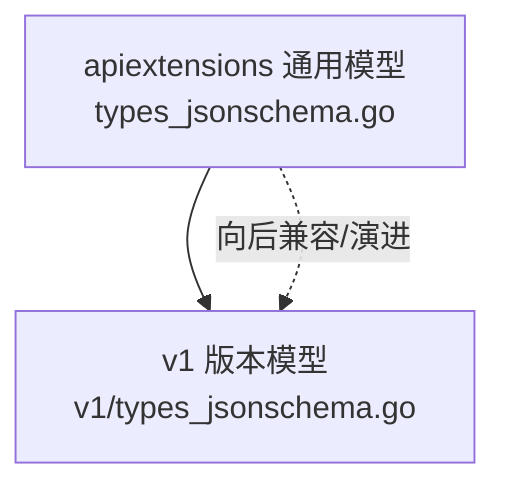
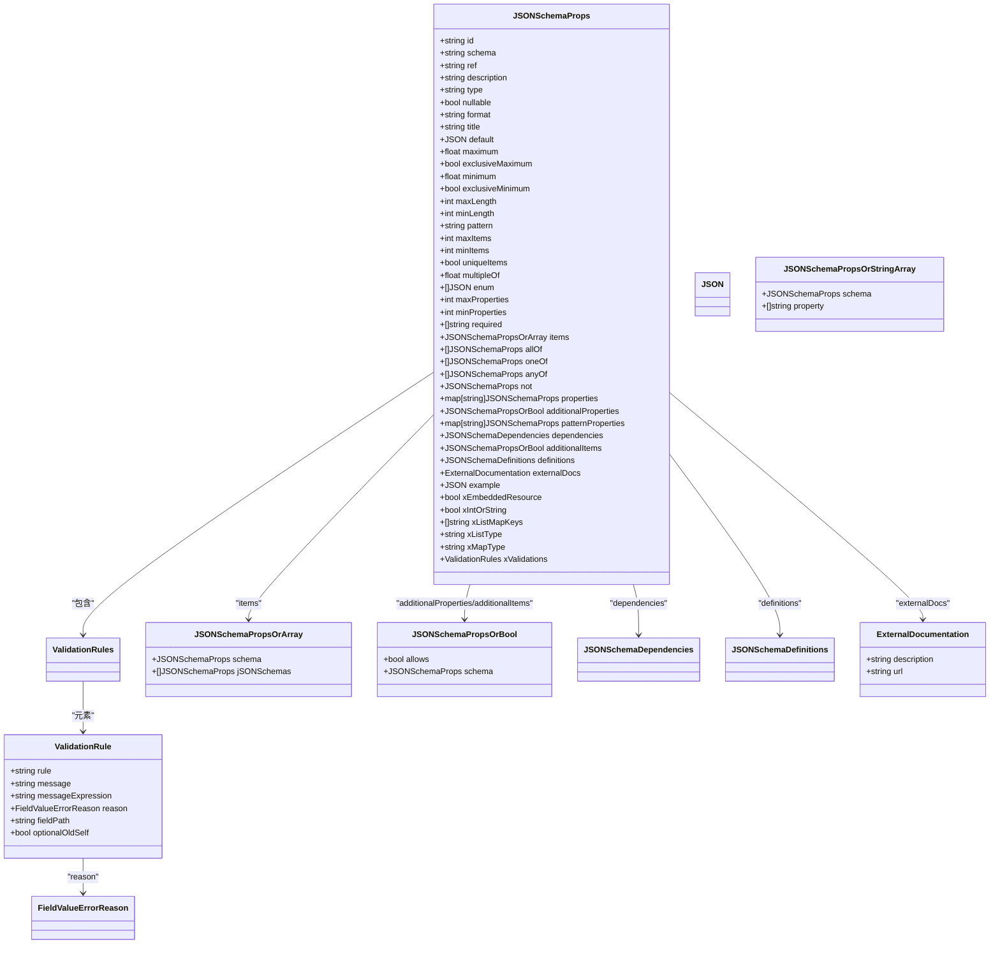
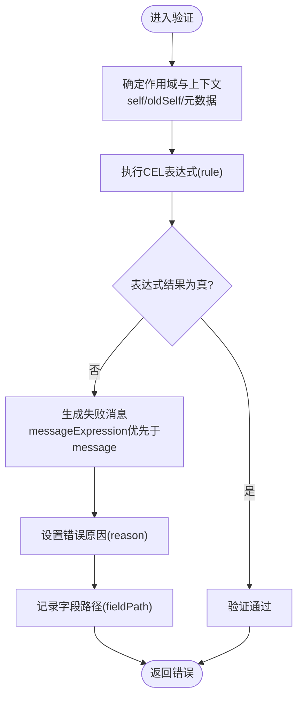
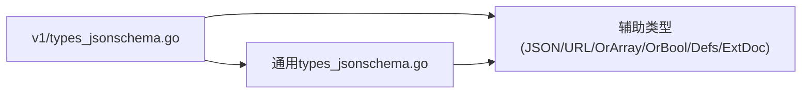

# Schema定义与验证

<cite>
**本文引用的文件**   
- [staging/src/k8s.io/apiextensions-apiserver/pkg/apis/apiextensions/types_jsonschema.go](file://staging/src/k8s.io/apiextensions-apiserver/pkg/apis/apiextensions/types_jsonschema.go)
- [staging/src/k8s.io/apiextensions-apiserver/pkg/apis/apiextensions/v1/types_jsonschema.go](file://staging/src/k8s.io/apiextensions-apiserver/pkg/apis/apiextensions/v1/types_jsonschema.go)
</cite>

## 目录
1. [简介](#简介)
2. [项目结构](#项目结构)
3. [核心组件](#核心组件)
4. [架构总览](#架构总览)
5. [详细组件分析](#详细组件分析)
6. [依赖关系分析](#依赖关系分析)
7. [性能考量](#性能考量)
8. [故障排查指南](#故障排查指南)
9. [结论](#结论)
10. [附录](#附录)

## 简介
本文件面向Kubernetes CRD（自定义资源定义）的OpenAPI v3 Schema设计与验证，系统性阐述字段类型、必填项、默认值、格式校验、数值范围、枚举约束、复杂数据结构（嵌套对象、数组、映射）、以及基于CEL的表达式验证。同时提供错误处理与用户友好消息设计建议，并给出Schema设计的性能优化要点。

## 项目结构
围绕CRD Schema的核心定义位于apiextensions模块中，主要包含：
- 通用JSON Schema属性模型（兼容v1beta1等历史版本）
- v1版本的JSON Schema属性模型（当前推荐使用的稳定版本）

图表来源
- [staging/src/k8s.io/apiextensions-apiserver/pkg/apis/apiextensions/types_jsonschema.go:1-319](file://staging/src/k8s.io/apiextensions-apiserver/pkg/apis/apiextensions/types_jsonschema.go#L1-L319)
- [staging/src/k8s.io/apiextensions-apiserver/pkg/apis/apiextensions/v1/types_jsonschema.go:1-420](file://staging/src/k8s.io/apiextensions-apiserver/pkg/apis/apiextensions/v1/types_jsonschema.go#L1-L420)

章节来源
- [staging/src/k8s.io/apiextensions-apiserver/pkg/apis/apiextensions/types_jsonschema.go:1-319](file://staging/src/k8s.io/apiextensions-apiserver/pkg/apis/apiextensions/types_jsonschema.go#L1-L319)
- [staging/src/k8s.io/apiextensions-apiserver/pkg/apis/apiextensions/v1/types_jsonschema.go:1-420](file://staging/src/k8s.io/apiextensions-apiserver/pkg/apis/apiextensions/v1/types_jsonschema.go#L1-L420)

## 核心组件
- JSONSchemaProps：描述一个字段的OpenAPI v3 Schema属性集合，包括类型、格式、默认值、范围、长度、正则、枚举、组合逻辑（allOf/oneOf/anyOf/not）、子属性、附加属性、模式匹配属性、依赖、定义引用、外部文档、示例、可空性，以及Kubernetes扩展能力（如保留未知字段、嵌入资源、int-or-string、列表/映射拓扑标注、CEL验证规则）。
- ValidationRule/x-kubernetes-validations：使用CEL表达式进行高级验证，支持静态与过渡规则、动态失败消息、原因码、字段路径定位等。
- 辅助类型：JSON、JSONSchemaURL、JSONSchemaPropsOrArray、JSONSchemaPropsOrBool、JSONSchemaDependencies、JSONSchemaPropsOrStringArray、JSONSchemaDefinitions、ExternalDocumentation等。

章节来源
- [staging/src/k8s.io/apiextensions-apiserver/pkg/apis/apiextensions/v1/types_jsonschema.go:39-197](file://staging/src/k8s.io/apiextensions-apiserver/pkg/apis/apiextensions/v1/types_jsonschema.go#L39-L197)
- [staging/src/k8s.io/apiextensions-apiserver/pkg/apis/apiextensions/v1/types_jsonschema.go:199-324](file://staging/src/k8s.io/apiextensions-apiserver/pkg/apis/apiextensions/v1/types_jsonschema.go#L199-L324)
- [staging/src/k8s.io/apiextensions-apiserver/pkg/apis/apiextensions/v1/types_jsonschema.go:326-420](file://staging/src/k8s.io/apiextensions-apiserver/pkg/apis/apiextensions/v1/types_jsonschema.go#L326-L420)

## 架构总览
下图展示了CRD Schema在Kubernetes中的关键概念与数据模型关系，聚焦于字段定义、验证规则与扩展能力。

图表来源
- [staging/src/k8s.io/apiextensions-apiserver/pkg/apis/apiextensions/v1/types_jsonschema.go:39-197](file://staging/src/k8s.io/apiextensions-apiserver/pkg/apis/apiextensions/v1/types_jsonschema.go#L39-L197)
- [staging/src/k8s.io/apiextensions-apiserver/pkg/apis/apiextensions/v1/types_jsonschema.go:199-324](file://staging/src/k8s.io/apiextensions-apiserver/pkg/apis/apiextensions/v1/types_jsonschema.go#L199-L324)
- [staging/src/k8s.io/apiextensions-apiserver/pkg/apis/apiextensions/v1/types_jsonschema.go:326-420](file://staging/src/k8s.io/apiextensions-apiserver/pkg/apis/apiextensions/v1/types_jsonschema.go#L326-L420)

## 详细组件分析

### 字段类型与基础约束
- 类型声明：type字段用于指定基本类型（如字符串、整数、布尔、对象、数组等），结合format可实现更严格的语义化校验（例如日期时间、邮箱、IP、UUID、颜色等）。
- 必填字段：required列出必须存在的属性名；缺失将触发“必需”类错误。
- 默认值：default为未提供的字段设置默认值；注意默认值生效需满足特定条件（例如preserveUnknownFields=false）。
- 可空性：nullable允许值为null。
- 长度与数量限制：minLength/maxLength控制字符串长度；minItems/maxItems控制数组长度；uniqueItems确保数组元素唯一。
- 数值范围与倍数：minimum/maximum/exclusiveMinimum/exclusiveMaximum限定数值区间；multipleOf要求数值为某值的倍数。
- 正则表达式：pattern对字符串进行正则匹配。
- 枚举约束：enum限定取值集合。
- 属性数量限制：minProperties/maxProperties限制对象键的数量。

章节来源
- [staging/src/k8s.io/apiextensions-apiserver/pkg/apis/apiextensions/v1/types_jsonschema.go:47-96](file://staging/src/k8s.io/apiextensions-apiserver/pkg/apis/apiextensions/v1/types_jsonschema.go#L47-L96)

### 复杂数据结构
- 嵌套对象：通过properties定义子属性，每个子属性又是一个JSONSchemaProps实例，形成树形结构。
- 数组：items定义数组元素的Schema；可配合x-kubernetes-list-type与x-kubernetes-list-map-keys表达集合语义（atomic/set/map）。
- 映射：additionalProperties定义额外键值对的Schema；patternProperties支持按正则键名匹配；x-kubernetes-map-type可标注对象拓扑（granular/atomic）。
- 组合逻辑：allOf/oneOf/anyOf/not实现复合约束，便于表达复杂的业务规则。
- 依赖与定义：dependencies用于字段间依赖；definitions用于复用公共Schema片段。

章节来源
- [staging/src/k8s.io/apiextensions-apiserver/pkg/apis/apiextensions/v1/types_jsonschema.go:97-112](file://staging/src/k8s.io/apiextensions-apiserver/pkg/apis/apiextensions/v1/types_jsonschema.go#L97-L112)
- [staging/src/k8s.io/apiextensions-apiserver/pkg/apis/apiextensions/v1/types_jsonschema.go:147-189](file://staging/src/k8s.io/apiextensions-apiserver/pkg/apis/apiextensions/v1/types_jsonschema.go#L147-L189)

### 特殊扩展能力
- 保留未知字段：x-kubernetes-preserve-unknown-fields=true时，API服务器不会修剪未在Schema中定义的字段，适用于需要向后兼容或开放扩展的场景。
- 嵌入资源：x-kubernetes-embedded-resource表示该对象是一个内嵌的Kubernetes运行时对象，具备TypeMeta与ObjectMeta，且会进行自动校验。
- int-or-string：x-kubernetes-int-or-string允许字段接受整数或字符串两种类型，常用于兼容旧版配置。
- 列表/映射拓扑：x-kubernetes-list-type与x-kubernetes-map-type帮助API服务器高效处理合并与更新策略。

章节来源
- [staging/src/k8s.io/apiextensions-apiserver/pkg/apis/apiextensions/v1/types_jsonschema.go:115-145](file://staging/src/k8s.io/apiextensions-apiserver/pkg/apis/apiextensions/v1/types_jsonschema.go#L115-L145)
- [staging/src/k8s.io/apiextensions-apiserver/pkg/apis/apiextensions/v1/types_jsonschema.go:161-189](file://staging/src/k8s.io/apiextensions-apiserver/pkg/apis/apiextensions/v1/types_jsonschema.go#L161-L189)

### CEL表达式验证（x-kubernetes-validations）
- 规则作用域：rule表达式在Schema所在位置的作用域内执行，self绑定到当前值；对象可通过self.field访问属性，has(self.field)检查存在性；map可通过self[key]访问，in操作符检查包含；数组可通过索引与宏函数遍历。
- 根级变量：apiVersion、kind、metadata.name、metadata.generateName在根对象及嵌入资源中始终可用。
- 未知数据不可见：通过x-kubernetes-preserve-unknown-fields保留的未知数据在CEL中不可访问。
- 字段命名与转义：仅支持特定格式的字段名；特殊字符与保留关键字在表达式中需转义。
- 列表类型语义：set/map类型的相等比较忽略顺序；拼接遵循各自语义。
- 过渡规则：若rule使用oldSelf则隐式为过渡规则；optionalOldSelf可将规则提升为无条件评估（首次创建或缺少旧值时仍执行）。
- 失败消息：message为固定文本；messageExpression为CEL表达式，动态生成失败消息；当两者并存时优先使用messageExpression。
- 原因码：reason返回机器可读的错误原因（如无效、禁止、必需、重复）。
- 字段路径：fieldPath指向引发失败的相对JSON路径，便于客户端精确定位。

图表来源
- [staging/src/k8s.io/apiextensions-apiserver/pkg/apis/apiextensions/v1/types_jsonschema.go:199-324](file://staging/src/k8s.io/apiextensions-apiserver/pkg/apis/apiextensions/v1/types_jsonschema.go#L199-L324)

章节来源
- [staging/src/k8s.io/apiextensions-apiserver/pkg/apis/apiextensions/v1/types_jsonschema.go:199-324](file://staging/src/k8s.io/apiextensions-apiserver/pkg/apis/apiextensions/v1/types_jsonschema.go#L199-L324)

### 错误处理与用户友好消息
- 错误原因分类：必需、重复、无效、禁止四类原因码，便于客户端统一处理。
- 动态消息：messageExpression支持根据上下文生成个性化提示，提高用户体验。
- 字段定位：fieldPath帮助快速定位问题字段，减少排障成本。
- 兼容性：未知原因码应被客户端视为无效，保证向前兼容。

章节来源
- [staging/src/k8s.io/apiextensions-apiserver/pkg/apis/apiextensions/v1/types_jsonschema.go:288-305](file://staging/src/k8s.io/apiextensions-apiserver/pkg/apis/apiextensions/v1/types_jsonschema.go#L288-L305)
- [staging/src/k8s.io/apiextensions-apiserver/pkg/apis/apiextensions/types_jsonschema.go:19-37](file://staging/src/k8s.io/apiextensions-apiserver/pkg/apis/apiextensions/types_jsonschema.go#L19-L37)

### 最佳实践：字段描述与文档化
- 使用description/title/externalDocs为字段提供清晰说明与外部参考。
- 使用example展示典型值，帮助使用者理解期望格式。
- 合理组织definitions，复用公共片段，保持Schema简洁一致。
- 对敏感或易错字段增加message/messageExpression，提供明确指引。

章节来源
- [staging/src/k8s.io/apiextensions-apiserver/pkg/apis/apiextensions/v1/types_jsonschema.go:44-75](file://staging/src/k8s.io/apiextensions-apiserver/pkg/apis/apiextensions/v1/types_jsonschema.go#L44-L75)
- [staging/src/k8s.io/apiextensions-apiserver/pkg/apis/apiextensions/v1/types_jsonschema.go:110-112](file://staging/src/k8s.io/apiextensions-apiserver/pkg/apis/apiextensions/v1/types_jsonschema.go#L110-L112)

### 完整示例场景（以路径代替代码）
- 字符串格式与长度限制：参见[staging/src/k8s.io/apiextensions-apiserver/pkg/apis/apiextensions/v1/types_jsonschema.go:47-86](file://staging/src/k8s.io/apiextensions-apiserver/pkg/apis/apiextensions/v1/types_jsonschema.go#L47-L86)
- 数值范围与倍数：参见[staging/src/k8s.io/apiextensions-apiserver/pkg/apis/apiextensions/v1/types_jsonschema.go:80-90](file://staging/src/k8s.io/apiextensions-apiserver/pkg/apis/apiextensions/v1/types_jsonschema.go#L80-L90)
- 枚举约束：参见[staging/src/k8s.io/apiextensions-apiserver/pkg/apis/apiextensions/v1/types_jsonschema.go:91-92](file://staging/src/k8s.io/apiextensions-apiserver/pkg/apis/apiextensions/v1/types_jsonschema.go#L91-L92)
- 嵌套对象与数组：参见[staging/src/k8s.io/apiextensions-apiserver/pkg/apis/apiextensions/v1/types_jsonschema.go:97-112](file://staging/src/k8s.io/apiextensions-apiserver/pkg/apis/apiextensions/v1/types_jsonschema.go#L97-L112)
- 映射与模式匹配属性：参见[staging/src/k8s.io/apiextensions-apiserver/pkg/apis/apiextensions/v1/types_jsonschema.go:106-108](file://staging/src/k8s.io/apiextensions-apiserver/pkg/apis/apiextensions/v1/types_jsonschema.go#L106-L108)
- 组合逻辑（allOf/oneOf/anyOf/not）：参见[staging/src/k8s.io/apiextensions-apiserver/pkg/apis/apiextensions/v1/types_jsonschema.go:98-104](file://staging/src/k8s.io/apiextensions-apiserver/pkg/apis/apiextensions/v1/types_jsonschema.go#L98-L104)
- 列表/映射拓扑与键映射：参见[staging/src/k8s.io/apiextensions-apiserver/pkg/apis/apiextensions/v1/types_jsonschema.go:147-189](file://staging/src/k8s.io/apiextensions-apiserver/pkg/apis/apiextensions/v1/types_jsonschema.go#L147-L189)
- CEL验证规则与动态消息：参见[staging/src/k8s.io/apiextensions-apiserver/pkg/apis/apiextensions/v1/types_jsonschema.go:191-324](file://staging/src/k8s.io/apiextensions-apiserver/pkg/apis/apiextensions/v1/types_jsonschema.go#L191-L324)

## 依赖关系分析
- v1版本模型是对通用模型的增强与规范化，新增更多结构化标签与CEL验证能力。
- 辅助类型之间相互组合，形成完整的Schema描述体系。

图表来源
- [staging/src/k8s.io/apiextensions-apiserver/pkg/apis/apiextensions/v1/types_jsonschema.go:326-420](file://staging/src/k8s.io/apiextensions-apiserver/pkg/apis/apiextensions/v1/types_jsonschema.go#L326-L420)
- [staging/src/k8s.io/apiextensions-apiserver/pkg/apis/apiextensions/types_jsonschema.go:281-319](file://staging/src/k8s.io/apiextensions-apiserver/pkg/apis/apiextensions/types_jsonschema.go#L281-L319)

章节来源
- [staging/src/k8s.io/apiextensions-apiserver/pkg/apis/apiextensions/v1/types_jsonschema.go:326-420](file://staging/src/k8s.io/apiextensions-apiserver/pkg/apis/apiextensions/v1/types_jsonschema.go#L326-L420)
- [staging/src/k8s.io/apiextensions-apiserver/pkg/apis/apiextensions/types_jsonschema.go:281-319](file://staging/src/k8s.io/apiextensions-apiserver/pkg/apis/apiextensions/types_jsonschema.go#L281-L319)

## 性能考量
- 避免过度使用任意未知字段保留：x-kubernetes-preserve-unknown-fields=true会增加解码与存储开销，仅在必要时启用。
- 谨慎使用复杂CEL规则：高复杂度或深层嵌套的表达式可能影响验证性能，尽量简化逻辑、复用公共片段。
- 合理使用列表/映射拓扑：atomic/set/map能显著提升合并与更新效率，但需确保Schema正确标注。
- 控制枚举与正则规模：过大的枚举集或复杂正则可能带来解析与匹配成本，建议拆分或分层校验。
- 利用definitions复用：减少重复定义，降低Schema体积与解析负担。

## 故障排查指南
- 常见错误原因：
  - 必需字段缺失：检查required与字段是否提供。
  - 值无效：核对pattern、format、范围、倍数等约束。
  - 重复值：确认uniqueItems或集合语义是否正确。
  - 禁止值：检查业务规则或安全策略导致的拒绝。
- 定位问题：
  - 使用fieldPath快速定位具体字段。
  - 查看message或messageExpression生成的提示信息。
- 兼容性与升级：
  - 未知原因码应被视为无效，客户端需具备容错能力。
  - 过渡规则在首次创建或缺少旧值时的行为由optionalOldSelf控制。

章节来源
- [staging/src/k8s.io/apiextensions-apiserver/pkg/apis/apiextensions/v1/types_jsonschema.go:288-324](file://staging/src/k8s.io/apiextensions-apiserver/pkg/apis/apiextensions/v1/types_jsonschema.go#L288-L324)
- [staging/src/k8s.io/apiextensions-apiserver/pkg/apis/apiextensions/types_jsonschema.go:19-37](file://staging/src/k8s.io/apiextensions-apiserver/pkg/apis/apiextensions/types_jsonschema.go#L19-L37)

## 结论
通过OpenAPI v3 Schema与CEL表达式，Kubernetes为CRD提供了强大而灵活的字段定义与验证能力。合理运用类型、格式、范围、枚举、组合逻辑与拓扑标注，并结合CEL进行复杂业务校验，可在保证数据质量的同时兼顾可扩展性与性能。良好的错误消息与字段路径有助于提升用户体验与排障效率。

## 附录
- 术语速查：
  - 必填字段：required
  - 默认值：default
  - 格式校验：format
  - 正则：pattern
  - 数值范围：minimum/maximum/exclusiveMinimum/exclusiveMaximum
  - 倍数：multipleOf
  - 数组约束：minItems/maxItems/uniqueItems/items
  - 对象约束：minProperties/maxProperties/properties/additionalProperties/patternProperties
  - 组合逻辑：allOf/oneOf/anyOf/not
  - 拓扑标注：x-kubernetes-list-type/x-kubernetes-map-type/x-kubernetes-list-map-keys
  - 扩展能力：x-kubernetes-preserve-unknown-fields/x-kubernetes-embedded-resource/x-kubernetes-int-or-string
  - 表达式验证：x-kubernetes-validations（rule/message/messageExpression/reason/fieldPath/optionalOldSelf）