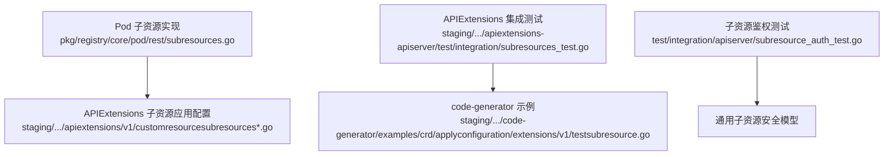
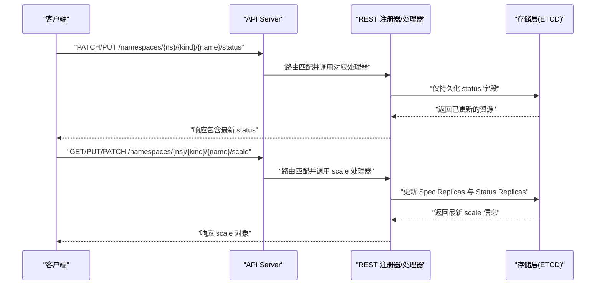
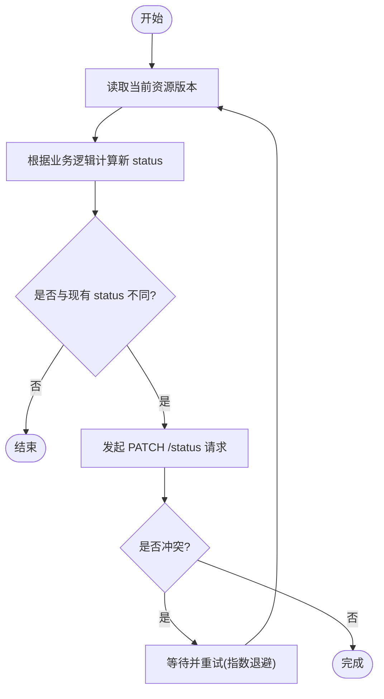
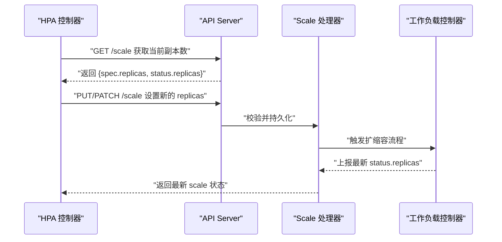
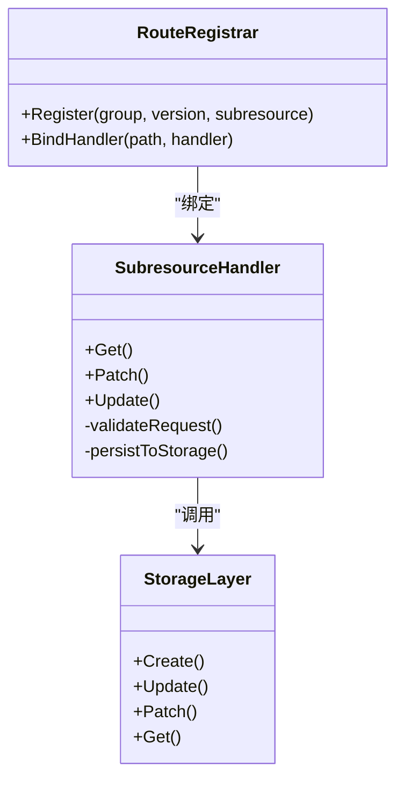
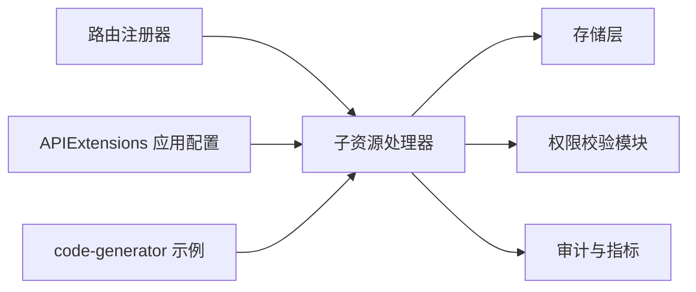

# 子资源实现

<cite>
**本文引用的文件**   
- [subresources.go](file://pkg/registry/core/pod/rest/subresources.go)
- [subresources_test.go](file://pkg/registry/core/pod/rest/subresources_test.go)
- [customresourcesubresources.go](file://staging/src/k8s.io/apiextensions-apiserver/pkg/client/applyconfiguration/apiextensions/v1/customresourcesubresources.go)
- [customresourcesubresourcescale.go](file://staging/src/k8s.io/apiextensions-apiserver/pkg/client/applyconfiguration/apiextensions/v1/customresourcesubresourcescale.go)
- [subresources_test.go](file://staging/src/k8s.io/apiextensions-apiserver/test/integration/subresources_test.go)
- [testsubresource.go](file://staging/src/k8s.io/code-generator/examples/crd/applyconfiguration/extensions/v1/testsubresource.go)
- [subresource_auth_test.go](file://test/integration/apiserver/subresource_auth_test.go)
</cite>

## 目录
1. [简介](#简介)
2. [项目结构](#项目结构)
3. [核心组件](#核心组件)
4. [架构总览](#架构总览)
5. [详细组件分析](#详细组件分析)
6. [依赖关系分析](#依赖关系分析)
7. [性能考虑](#性能考虑)
8. [故障排查指南](#故障排查指南)
9. [结论](#结论)
10. [附录](#附录)

## 简介
本文件面向在 Kubernetes 中为自定义资源定义（CRD）实现子资源的开发者与平台工程师，聚焦以下目标：
- 深入解释 /status 子资源的实现、状态更新机制与同步策略
- 详细说明 /scale 子资源的实现、水平扩展控制与副本数管理
- 讲解如何注册自定义子资源的 REST 路由与处理逻辑
- 提供权限控制与安全注意事项
- 给出完整的实现示例与常见业务场景
- 总结性能优化与资源使用模式
- 提供测试方法与调试技巧
- 汇总最佳实践与常见陷阱

## 项目结构
围绕 CRD 子资源，仓库中与“子资源”直接相关的代码主要分布在如下位置：
- Pod 内置子资源实现参考：pkg/registry/core/pod/rest/subresources.go
- APIExtensions 的 CRD 子资源客户端与应用配置对象：staging/src/k8s.io/apiextensions-apiserver/pkg/client/applyconfiguration/apiextensions/v1/customresourcesubresources*.go
- APIExtensions 集成测试用例：staging/src/k8s.io/apiextensions-apiserver/test/integration/subresources_test.go
- code-generator 示例中的子资源应用配置：staging/src/k8s.io/code-generator/examples/crd/applyconfiguration/extensions/v1/testsubresource.go
- 子资源鉴权集成测试：test/integration/apiserver/subresource_auth_test.go

图表来源
- [subresources.go](file://pkg/registry/core/pod/rest/subresources.go)
- [customresourcesubresources.go](file://staging/src/k8s.io/apiextensions-apiserver/pkg/client/applyconfiguration/apiextensions/v1/customresourcesubresources.go)
- [customresourcesubresourcescale.go](file://staging/src/k8s.io/apiextensions-apiserver/pkg/client/applyconfiguration/apiextensions/v1/customresourcesubresourcescale.go)
- [subresources_test.go](file://staging/src/k8s.io/apiextensions-apiserver/test/integration/subresources_test.go)
- [testsubresource.go](file://staging/src/k8s.io/code-generator/examples/crd/applyconfiguration/extensions/v1/testsubresource.go)
- [subresource_auth_test.go](file://test/integration/apiserver/subresource_auth_test.go)

章节来源
- [subresources.go](file://pkg/registry/core/pod/rest/subresources.go)
- [customresourcesubresources.go](file://staging/src/k8s.io/apiextensions-apiserver/pkg/client/applyconfiguration/apiextensions/v1/customresourcesubresources.go)
- [customresourcesubresourcescale.go](file://staging/src/k8s.io/apiextensions-apiserver/pkg/client/applyconfiguration/apiextensions/v1/customresourcesubresourcescale.go)
- [subresources_test.go](file://staging/src/k8s.io/apiextensions-apiserver/test/integration/subresources_test.go)
- [testsubresource.go](file://staging/src/k8s.io/code-generator/examples/crd/applyconfiguration/extensions/v1/testsubresource.go)
- [subresource_auth_test.go](file://test/integration/apiserver/subresource_auth_test.go)

## 核心组件
- /status 子资源
  - 作用：承载只读或控制器可写的运行时状态，避免与用户声明式 spec 混写
  - 典型能力：Patch/Update 仅作用于 status 字段；读取时返回完整资源但通常忽略对 status 的写入权限
- /scale 子资源
  - 作用：暴露水平扩缩容接口，供 HPA 等控制器修改副本数
  - 典型能力：GET/PUT/PATCH 到 scale，读写 Spec.Replicas 与 Status.Replicas
- 自定义子资源
  - 通过 REST 路由注册与 Handler 实现，遵循 Kube API 规范
  - 需要配合 RBAC 授权策略与可选的 Admission 插件进行校验与审计

章节来源
- [subresources.go](file://pkg/registry/core/pod/rest/subresources.go)
- [customresourcesubresources.go](file://staging/src/k8s.io/apiextensions-apiserver/pkg/client/applyconfiguration/apiextensions/v1/customresourcesubresources.go)
- [customresourcesubresourcescale.go](file://staging/src/k8s.io/apiextensions-apiserver/pkg/client/applyconfiguration/apiextensions/v1/customresourcesubresourcescale.go)

## 架构总览
下图展示了从客户端到存储层的请求路径，以及 /status 与 /scale 的关键交互点。

图表来源
- [subresources.go](file://pkg/registry/core/pod/rest/subresources.go)
- [customresourcesubresources.go](file://staging/src/k8s.io/apiextensions-apiserver/pkg/client/applyconfiguration/apiextensions/v1/customresourcesubresources.go)
- [customresourcesubresourcescale.go](file://staging/src/k8s.io/apiextensions-apiserver/pkg/client/applyconfiguration/apiextensions/v1/customresourcesubresourcescale.go)

## 详细组件分析

### /status 子资源
- 设计要点
  - 将“期望状态(spec)”与“实际状态(status)”解耦，便于控制器异步更新
  - 限制写入权限：普通用户通常只能读取 status，由受控服务账号执行写入
- 更新机制
  - 支持 Patch/Update 操作，仅允许变更 status 字段
  - 控制器侧建议采用乐观锁与重试，避免并发覆盖
- 同步策略
  - 推荐事件驱动：监听资源变更，增量计算后批量提交
  - 去抖动与合并：高频状态变化应合并提交，降低 etcd 压力
  - 幂等性：确保多次提交同一状态不会产生副作用

图表来源
- [subresources.go](file://pkg/registry/core/pod/rest/subresources.go)

章节来源
- [subresources.go](file://pkg/registry/core/pod/rest/subresources.go)

### /scale 子资源
- 设计要点
  - 标准化水平扩缩容接口，适配 HPA 与 CLI 工具
  - 明确区分 Spec.Replicas（期望副本数）与 Status.Replicas（当前副本数）
- 副本数管理
  - 接收 PUT/PATCH 请求，校验范围与约束（如最小/最大副本数）
  - 更新后触发下游控制器（如 Deployment/ReplicaSet）协调实际工作负载
- 与 HPA 协作
  - HPA 定期 GET/PUT /scale，依据指标动态调整副本数
  - 控制器需保证最终一致性，并在异常时回滚或告警

图表来源
- [customresourcesubresourcescale.go](file://staging/src/k8s.io/apiextensions-apiserver/pkg/client/applyconfiguration/apiextensions/v1/customresourcesubresourcescale.go)

章节来源
- [customresourcesubresourcescale.go](file://staging/src/k8s.io/apiextensions-apiserver/pkg/client/applyconfiguration/apiextensions/v1/customresourcesubresourcescale.go)

### 自定义子资源开发方法
- REST 路由注册
  - 在 API 组版本下注册子资源路径，例如 /{group}/{version}/namespaces/{ns}/{kind}/{name}/status
  - 为每个子资源绑定对应的 REST 处理器，实现 Get/Patch/Update 等方法
- 处理逻辑
  - 解析请求体，校验字段与权限
  - 调用存储层进行持久化，返回标准响应
  - 记录审计日志与指标，便于排障
- 示例参考
  - 内置 Pod 子资源实现可作为模板
  - APIExtensions 的 applyconfiguration 对象展示了子资源结构的生成方式
  - code-generator 示例提供了最小可用子资源样例

图表来源
- [subresources.go](file://pkg/registry/core/pod/rest/subresources.go)
- [customresourcesubresources.go](file://staging/src/k8s.io/apiextensions-apiserver/pkg/client/applyconfiguration/apiextensions/v1/customresourcesubresources.go)
- [testsubresource.go](file://staging/src/k8s.io/code-generator/examples/crd/applyconfiguration/extensions/v1/testsubresource.go)

章节来源
- [subresources.go](file://pkg/registry/core/pod/rest/subresources.go)
- [customresourcesubresources.go](file://staging/src/k8s.io/apiextensions-apiserver/pkg/client/applyconfiguration/apiextensions/v1/customresourcesubresources.go)
- [testsubresource.go](file://staging/src/k8s.io/code-generator/examples/crd/applyconfiguration/extensions/v1/testsubresource.go)

### 权限控制与安全考虑
- RBAC 策略
  - 为 /status 与 /scale 分别创建 Role/ClusterRole，限定命名空间与动词
  - 将 ServiceAccount 绑定到最小必要权限，遵循最小权限原则
- 审计与准入
  - 启用审计日志，记录所有子资源访问
  - 使用 Admission Webhook 或内置插件进行二次校验（如范围检查、配额限制）
- 数据隔离
  - 严格校验命名空间与资源归属，防止越权访问
  - 对敏感字段进行脱敏或加密存储

章节来源
- [subresource_auth_test.go](file://test/integration/apiserver/subresource_auth_test.go)

### 完整实现示例与常见业务场景
- 示例一：任务队列的状态上报
  - 使用 /status 上报任务进度、错误信息与耗时统计
  - 控制器周期性聚合多实例状态，对外暴露统一视图
- 示例二：微服务的弹性伸缩
  - 使用 /scale 暴露副本数接口，HPA 基于 CPU/内存/自定义指标自动扩缩容
  - 结合滚动更新策略，保障扩缩容期间的可用性
- 示例三：批处理作业的生命周期
  - 使用 /status 跟踪作业阶段（排队、运行、完成、失败）
  - 使用 /scale 控制并行度，按资源池容量动态调整

章节来源
- [subresources_test.go](file://staging/src/k8s.io/apiextensions-apiserver/test/integration/subresources_test.go)
- [testsubresource.go](file://staging/src/k8s.io/code-generator/examples/crd/applyconfiguration/extensions/v1/testsubresource.go)

## 依赖关系分析
- 组件耦合
  - 子资源处理器与存储层松耦合，便于替换后端或引入缓存
  - 路由注册与处理器分离，提升可测试性与复用性
- 外部依赖
  - APIExtensions 的 applyconfiguration 用于自动生成客户端代码
  - code-generator 示例帮助快速搭建最小可用子资源
- 潜在循环依赖
  - 避免处理器直接依赖上层控制器，改用事件总线或消息队列解耦

图表来源
- [subresources.go](file://pkg/registry/core/pod/rest/subresources.go)
- [customresourcesubresources.go](file://staging/src/k8s.io/apiextensions-apiserver/pkg/client/applyconfiguration/apiextensions/v1/customresourcesubresources.go)
- [customresourcesubresourcescale.go](file://staging/src/k8s.io/apiextensions-apiserver/pkg/client/applyconfiguration/apiextensions/v1/customresourcesubresourcescale.go)
- [testsubresource.go](file://staging/src/k8s.io/code-generator/examples/crd/applyconfiguration/extensions/v1/testsubresource.go)

章节来源
- [subresources.go](file://pkg/registry/core/pod/rest/subresources.go)
- [customresourcesubresources.go](file://staging/src/k8s.io/apiextensions-apiserver/pkg/client/applyconfiguration/apiextensions/v1/customresourcesubresources.go)
- [customresourcesubresourcescale.go](file://staging/src/k8s.io/apiextensions-apiserver/pkg/client/applyconfiguration/apiextensions/v1/customresourcesubresourcescale.go)
- [testsubresource.go](file://staging/src/k8s.io/code-generator/examples/crd/applyconfiguration/extensions/v1/testsubresource.go)

## 性能考虑
- 减少不必要的全量更新
  - 仅在 status 字段发生变化时发起 Patch，避免无意义写入
- 批量与合并
  - 合并高频状态更新，降低 etcd 写入压力
- 并发与限流
  - 使用令牌桶或滑动窗口限制写入速率，保护后端存储
- 缓存与只读路径
  - 对频繁读取的子资源（如 /status）引入本地缓存或只读副本
- 监控与观测
  - 采集关键指标：QPS、延迟、错误率、重试次数
  - 建立告警阈值，及时发现性能退化

[本节为通用指导，不直接分析具体文件]

## 故障排查指南
- 常见问题
  - 权限不足：确认 RBAC 是否正确授予 /status 与 /scale 的访问权限
  - 版本冲突：遇到 409 冲突时，实施重试与指数退避
  - 状态不一致：核对控制器日志与审计日志，定位写入顺序问题
- 调试技巧
  - 开启详细日志与审计输出，捕获请求与响应
  - 使用集成测试用例复现问题，逐步缩小范围
  - 借助 code-generator 示例验证最小可行路径

章节来源
- [subresources_test.go](file://staging/src/k8s.io/apiextensions-apiserver/test/integration/subresources_test.go)
- [subresource_auth_test.go](file://test/integration/apiserver/subresource_auth_test.go)

## 结论
- /status 与 /scale 是 CRD 子资源的核心能力，分别承担状态管理与水平扩缩容职责
- 通过清晰的权限控制、稳健的同步策略与完善的测试，可实现高可用的子资源服务
- 借助 APIExtensions 与 code-generator，可以快速构建与演进自定义子资源

[本节为总结性内容，不直接分析具体文件]

## 附录
- 最佳实践
  - 将 spec 与 status 严格分离，避免混写
  - 为每个子资源制定明确的权限矩阵与审计策略
  - 使用事件驱动与幂等更新，确保最终一致性
- 常见陷阱
  - 未处理版本冲突导致状态覆盖
  - 过度频繁的状态更新造成存储压力
  - 忽视命名空间隔离引发越权访问

[本节为通用指导，不直接分析具体文件]