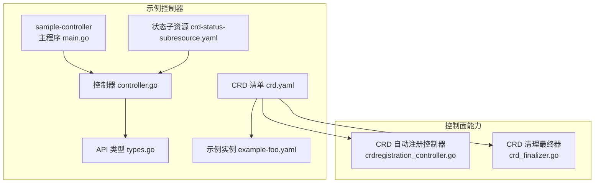
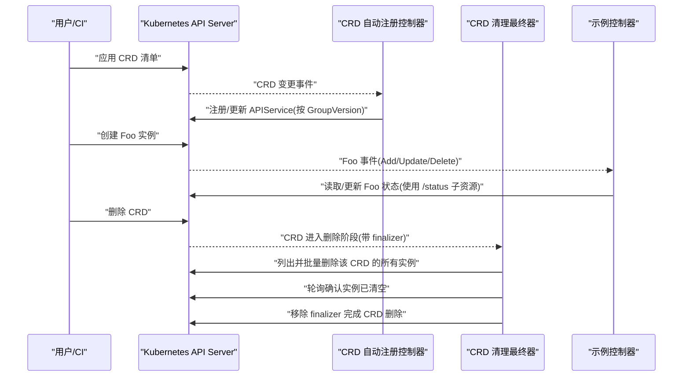
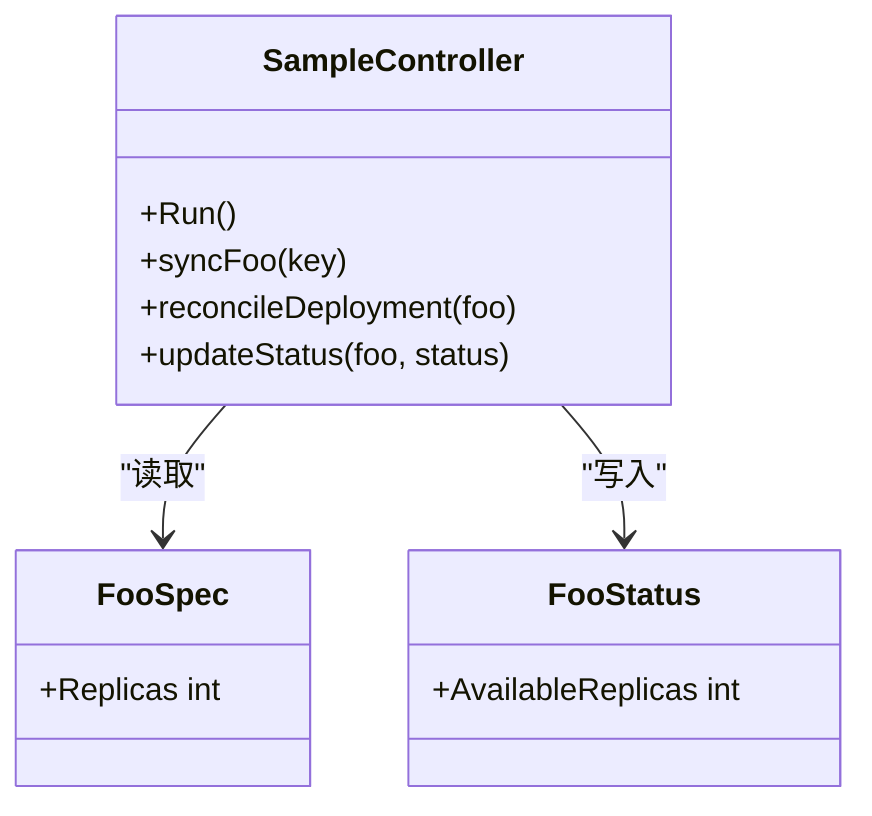
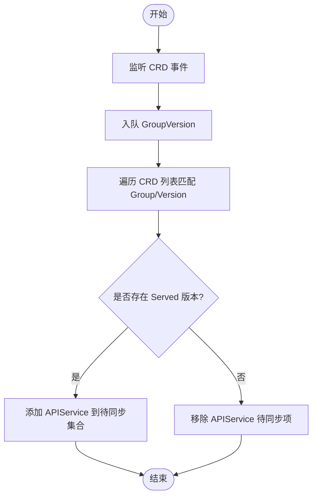
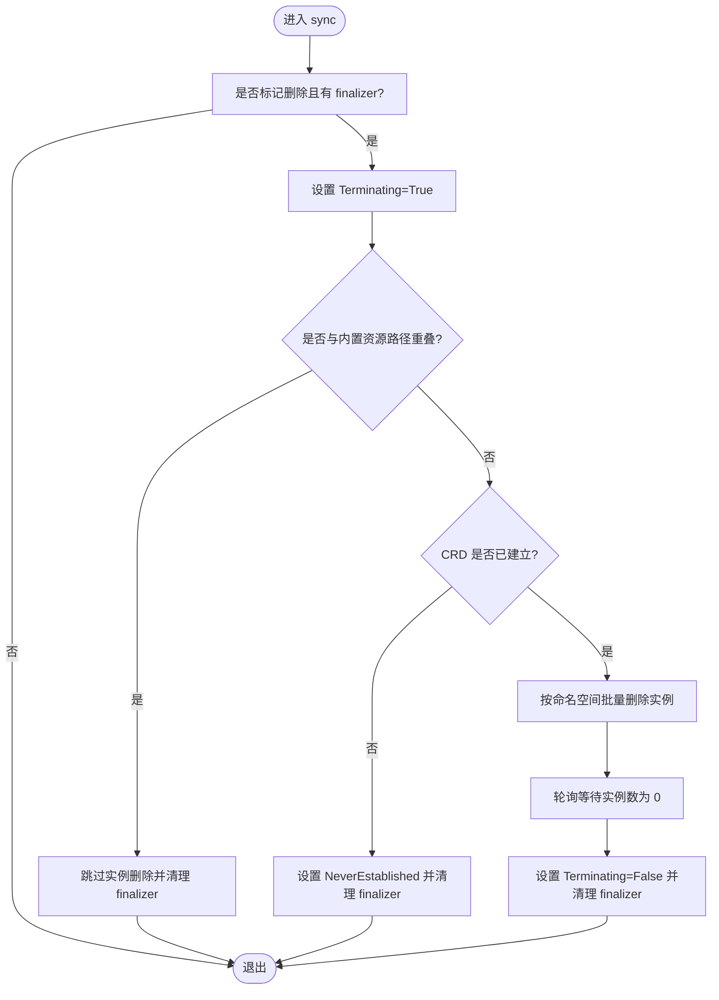
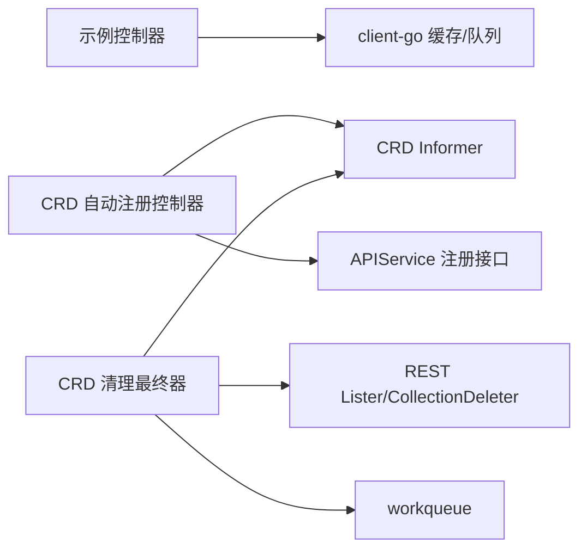

# 实战案例与最佳实践

<cite>
**本文引用的文件**   
- [crd_finalizer.go](file://staging/src/k8s.io/apiextensions-apiserver/pkg/controller/finalizer/crd_finalizer.go)
- [crdregistration_controller.go](file://pkg/controlplane/controller/crdregistration/crdregistration_controller.go)
- [README.md](file://staging/src/k8s.io/sample-controller/README.md)
- [controller.go](file://staging/src/k8s.io/sample-controller/controller.go)
- [main.go](file://staging/src/k8s.io/sample-controller/main.go)
- [types.go](file://staging/src/k8s.io/sample-controller/pkg/apis/samplecontroller/v1alpha1/types.go)
- [crd.yaml](file://staging/src/k8s.io/sample-controller/artifacts/examples/crd.yaml)
- [crd-status-subresource.yaml](file://staging/src/k8s.io/sample-controller/artifacts/examples/crd-status-subresource.yaml)
- [example-foo.yaml](file://staging/src/k8s.io/sample-controller/artifacts/examples/example-foo.yaml)
</cite>

## 目录
1. [引言](#引言)
2. [项目结构](#项目结构)
3. [核心组件](#核心组件)
4. [架构总览](#架构总览)
5. [详细组件分析](#详细组件分析)
6. [依赖关系分析](#依赖关系分析)
7. [性能考虑](#性能考虑)
8. [故障排查指南](#故障排查指南)
9. [结论](#结论)
10. [附录](#附录)

## 引言
本文件面向在 Kubernetes 上基于 CRD（CustomResourceDefinition）构建复杂业务系统的工程师，提供从需求分析、CRD 设计、Operator 模式落地、测试策略、监控告警、备份恢复到生产调优的完整实战指南。文档以仓库中的示例控制器 sample-controller 为核心案例，结合 apiextensions-apiserver 中 CRD 生命周期管理的关键实现，给出可落地的最佳实践与常见问题解决方案。

## 项目结构
围绕 CRD 与 Operator 的核心代码主要分布在以下位置：
- 示例控制器与资源定义：staging/src/k8s.io/sample-controller
- CRD 清理与注册控制面逻辑：staging/src/k8s.io/apiextensions-apiserver 与 pkg/controlplane

图表来源
- [main.go](file://staging/src/k8s.io/sample-controller/main.go)
- [controller.go](file://staging/src/k8s.io/sample-controller/controller.go)
- [types.go](file://staging/src/k8s.io/sample-controller/pkg/apis/samplecontroller/v1alpha1/types.go)
- [crd.yaml](file://staging/src/k8s.io/sample-controller/artifacts/examples/crd.yaml)
- [crd-status-subresource.yaml](file://staging/src/k8s.io/sample-controller/artifacts/examples/crd-status-subresource.yaml)
- [example-foo.yaml](file://staging/src/k8s.io/sample-controller/artifacts/examples/example-foo.yaml)
- [crdregistration_controller.go](file://pkg/controlplane/controller/crdregistration/crdregistration_controller.go)
- [crd_finalizer.go](file://staging/src/k8s.io/apiextensions-apiserver/pkg/controller/finalizer/crd_finalizer.go)

章节来源
- [README.md](file://staging/src/k8s.io/sample-controller/README.md)

## 核心组件
- 自定义资源类型定义：通过 API 包声明 Spec/Status 等字段，配合 code-generator 生成 deepcopy、register 等辅助代码。
- CRD 清单：描述资源的 group、version、名称、验证规则、子资源等。
- 示例实例：演示如何创建 Foo 资源并触发控制器行为。
- 控制器：监听 Foo 事件，协调底层 Deployment 等资源，体现 Operator 模式。
- 控制面能力：
  - CRD 自动注册：将 CRD 暴露的 GroupVersion 自动注册为 APIService，便于聚合 API 发现。
  - CRD 清理最终器：在删除 CRD 时安全清理其所有实例，避免残留数据。

章节来源
- [types.go](file://staging/src/k8s.io/sample-controller/pkg/apis/samplecontroller/v1alpha1/types.go)
- [crd.yaml](file://staging/src/k8s.io/sample-controller/artifacts/examples/crd.yaml)
- [example-foo.yaml](file://staging/src/k8s.io/sample-controller/artifacts/examples/example-foo.yaml)
- [controller.go](file://staging/src/k8s.io/sample-controller/controller.go)
- [crdregistration_controller.go](file://pkg/controlplane/controller/crdregistration/crdregistration_controller.go)
- [crd_finalizer.go](file://staging/src/k8s.io/apiextensions-apiserver/pkg/controller/finalizer/crd_finalizer.go)

## 架构总览
下图展示了“用户提交 CRD → 控制面处理 → 示例控制器运行”的整体流程，以及 CRD 生命周期关键路径。

图表来源
- [crdregistration_controller.go](file://pkg/controlplane/controller/crdregistration/crdregistration_controller.go)
- [crd_finalizer.go](file://staging/src/k8s.io/apiextensions-apiserver/pkg/controller/finalizer/crd_finalizer.go)
- [controller.go](file://staging/src/k8s.io/sample-controller/controller.go)

## 详细组件分析

### 组件A：示例控制器（Operator 模式）
- 职责：监听 Foo 资源，根据 spec 协调底层 Deployment，维护 Foo.status，体现“声明式 + 期望状态收敛”的 Operator 模式。
- 关键点：
  - 使用 Informer/Lister 缓存减少 API 压力。
  - 使用 status 子资源仅更新状态，避免不必要的冲突。
  - 错误重试与退避由工作队列负责。

图表来源
- [controller.go](file://staging/src/k8s.io/sample-controller/controller.go)
- [types.go](file://staging/src/k8s.io/sample-controller/pkg/apis/samplecontroller/v1alpha1/types.go)

章节来源
- [controller.go](file://staging/src/k8s.io/sample-controller/controller.go)
- [types.go](file://staging/src/k8s.io/sample-controller/pkg/apis/samplecontroller/v1alpha1/types.go)
- [README.md](file://staging/src/k8s.io/sample-controller/README.md)

### 组件B：CRD 自动注册控制器
- 职责：监听 CRD 变更，将满足条件的 GroupVersion 自动注册为 APIService，使外部可通过聚合 API 访问。
- 关键点：
  - 基于 informer 监听 CRD Add/Update/Delete。
  - 对每个 Served 版本计算 API 服务名并调用注册接口。
  - 初始同步后启动 worker 循环处理队列。

图表来源
- [crdregistration_controller.go](file://pkg/controlplane/controller/crdregistration/crdregistration_controller.go)

章节来源
- [crdregistration_controller.go](file://pkg/controlplane/controller/crdregistration/crdregistration_controller.go)

### 组件C：CRD 清理最终器
- 职责：当 CRD 被删除且带有清理 finalizer 时，确保其所有实例被安全删除后再移除 finalizer。
- 关键点：
  - 检测 DeletionTimestamp 与 finalizer。
  - 跳过与内置资源存储路径重叠的资源。
  - 若 CRD 从未建立则直接清理。
  - 否则按命名空间批量删除实例，轮询直至为空。
  - 更新 CRD 条件以反映终止状态。

图表来源
- [crd_finalizer.go](file://staging/src/k8s.io/apiextensions-apiserver/pkg/controller/finalizer/crd_finalizer.go)

章节来源
- [crd_finalizer.go](file://staging/src/k8s.io/apiextensions-apiserver/pkg/controller/finalizer/crd_finalizer.go)

### 组件D：CRD 清单与示例实例
- CRD 清单：定义 group、version、名称、验证规则、子资源等。
- 示例实例：展示如何创建 Foo 资源，驱动控制器行为。
- 状态子资源：启用 /status 子资源，允许控制器只更新状态部分。

章节来源
- [crd.yaml](file://staging/src/k8s.io/sample-controller/artifacts/examples/crd.yaml)
- [crd-status-subresource.yaml](file://staging/src/k8s.io/sample-controller/artifacts/examples/crd-status-subresource.yaml)
- [example-foo.yaml](file://staging/src/k8s.io/sample-controller/artifacts/examples/example-foo.yaml)

## 依赖关系分析
- 示例控制器依赖 client-go 的 informer/listers 与工作队列，遵循标准控制器模式。
- CRD 自动注册控制器依赖 CRD informer 与 APIService 注册接口。
- CRD 清理最终器依赖 CRD informer、REST Lister/CollectionDeleter 抽象与 workqueue。

图表来源
- [controller.go](file://staging/src/k8s.io/sample-controller/controller.go)
- [crdregistration_controller.go](file://pkg/controlplane/controller/crdregistration/crdregistration_controller.go)
- [crd_finalizer.go](file://staging/src/k8s.io/apiextensions-apiserver/pkg/controller/finalizer/crd_finalizer.go)

章节来源
- [controller.go](file://staging/src/k8s.io/sample-controller/controller.go)
- [crdregistration_controller.go](file://pkg/controlplane/controller/crdregistration/crdregistration_controller.go)
- [crd_finalizer.go](file://staging/src/k8s.io/apiextensions-apiserver/pkg/controller/finalizer/crd_finalizer.go)

## 性能考虑
- 控制器侧
  - 合理使用 Informer/Lister 缓存，避免频繁直连 API Server。
  - 利用工作队列的速率限制与去重机制，降低热点资源抖动带来的风暴。
  - 使用 status 子资源减少写放大与冲突概率。
- 控制面侧
  - CRD 自动注册仅在 GroupVersion 变化时触发，注意版本数量与优先级配置。
  - CRD 清理最终器采用批量删除与轮询等待，建议关注集群规模与实例总量，必要时调整轮询间隔与超时。
- 资源模型
  - 合理拆分 CRD，避免单资源承载过多关联对象；必要时引入多资源协作。
  - 使用选择性字段与索引化标签提升查询效率。

[本节为通用指导，不直接分析具体文件]

## 故障排查指南
- CRD 无法删除或长时间处于 Terminating
  - 检查是否仍有实例未删除，查看 CRD 条件与日志。
  - 确认是否存在与内置资源路径重叠导致跳过删除的情况。
  - 参考清理最终器的处理流程定位问题点。
- CRD 未被自动注册
  - 检查 CRD 版本是否标记为 served。
  - 确认自动注册控制器是否正常运行且具备权限。
- 控制器未响应资源变更
  - 检查 informer 是否同步成功。
  - 检查工作队列是否有大量失败重试。
  - 确认 RBAC 权限与资源选择器是否正确。

章节来源
- [crd_finalizer.go](file://staging/src/k8s.io/apiextensions-apiserver/pkg/controller/finalizer/crd_finalizer.go)
- [crdregistration_controller.go](file://pkg/controlplane/controller/crdregistration/crdregistration_controller.go)
- [controller.go](file://staging/src/k8s.io/sample-controller/controller.go)

## 结论
通过 sample-controller 这一最小可行案例，结合 apiextensions-apiserver 提供的 CRD 自动注册与清理最终器能力，可以构建出高可用、可扩展的 Operator 系统。在生产环境中，应重视资源模型设计、控制器性能与稳定性、自动化测试与可观测性，并制定完善的备份与灾难恢复方案。

[本节为总结性内容，不直接分析具体文件]

## 附录

### 开发流程与最佳实践
- 需求分析与建模
  - 明确业务边界与期望状态，识别需要编排的外部系统与内部资源。
  - 将复杂场景拆分为多个 CRD，并通过引用与事件协同。
- CRD 设计与演进
  - 使用结构化 schema 与验证规则保障输入正确性。
  - 谨慎进行版本演进，保持向后兼容，必要时使用转换 webhook。
- Operator 模式落地
  - 使用 Informer/Lister 与工作队列实现高效事件处理。
  - 使用 status 子资源分离期望与实际状态。
  - 幂等性与重试策略要完善，避免重复操作与竞态。
- 测试策略
  - 单元测试：覆盖核心 reconcile 逻辑与边界条件。
  - 集成测试：基于真实 API Server 与 etcd 的最小环境验证端到端流程。
  - E2E 测试：模拟用户操作与异常注入，验证自愈与回滚。
- 监控与告警
  - 指标：控制器 reconcile 耗时、队列长度、错误率、资源差异收敛时间。
  - 日志：结构化输出关键步骤与上下文，便于追踪。
  - 告警：针对长时间不一致、反复失败、资源泄漏等设定阈值。
- 备份与恢复
  - 定期导出 CRD 与实例快照，保留版本元数据。
  - 演练恢复流程，确保 RTO/RPO 目标可达。
- 代码规范与协作
  - 统一 API 命名与注释规范，严格使用 code-generator。
  - PR 审查关注兼容性、安全性与性能影响。
  - 变更需附带测试用例与升级说明。

[本节为通用指导，不直接分析具体文件]