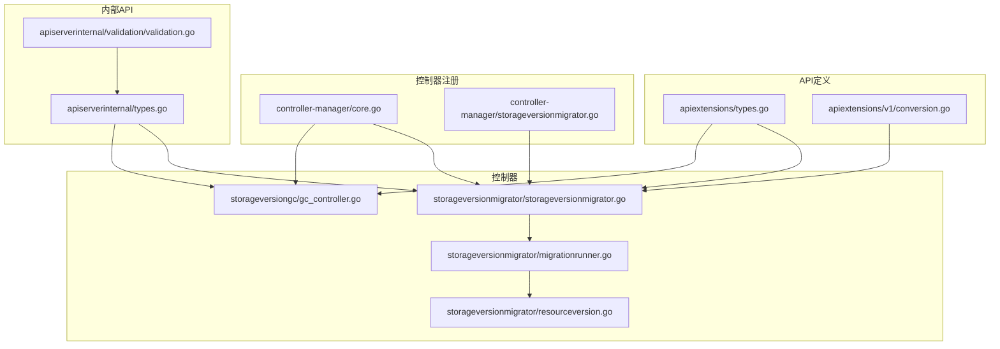
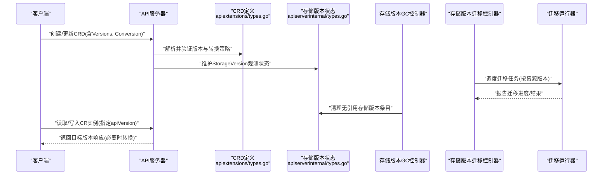
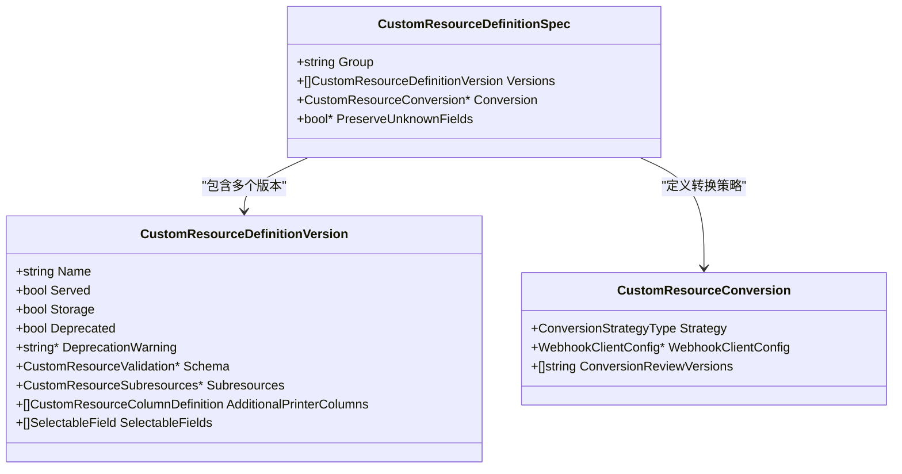
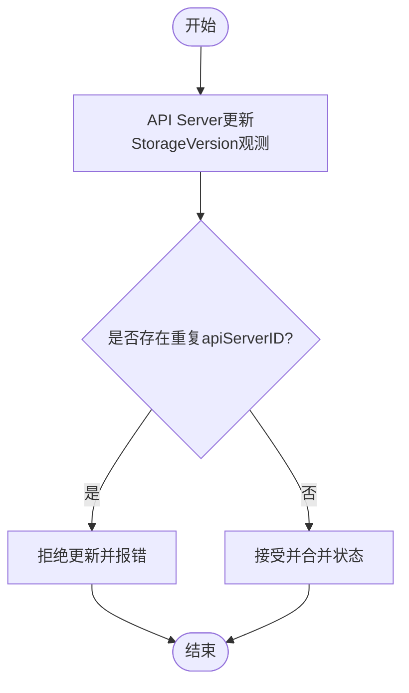
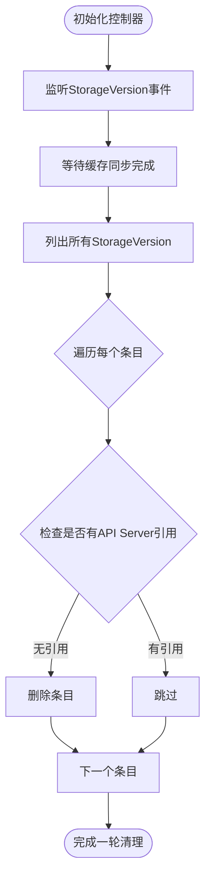
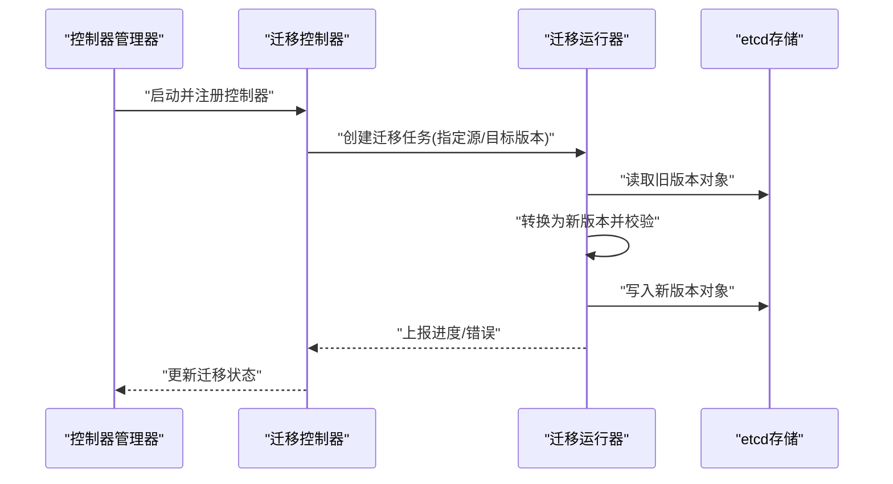
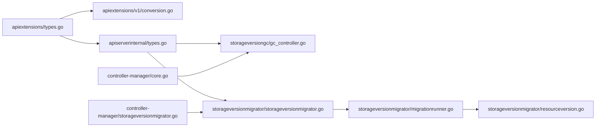

# 版本管理策略

<cite>
**本文引用的文件**   
- [types.go](file://staging/src/k8s.io/apiextensions-apiserver/pkg/apis/apiextensions/types.go)
- [conversion.go](file://staging/src/k8s.io/apiextensions-apiserver/pkg/apis/apiextensions/v1/conversion.go)
- [gc_controller.go](file://pkg/controller/storageversiongc/gc_controller.go)
- [storageversionmigrator.go](file://pkg/controller/storageversionmigrator/storageversionmigrator.go)
- [migrationrunner.go](file://pkg/controller/storageversionmigrator/migrationrunner.go)
- [resourceversion.go](file://pkg/controller/storageversionmigrator/resourceversion.go)
- [controllermanager core.go](file://cmd/kube-controller-manager/app/core.go)
- [controllermanager storageversionmigrator.go](file://cmd/kube-controller-manager/app/storageversionmigrator.go)
- [apiserverinternal types.go](file://pkg/apis/apiserverinternal/types.go)
- [apiserverinternal validation.go](file://pkg/apis/apiserverinternal/validation/validation.go)
- [CHANGELOG-1.15.md](file://CHANGELOG/CHANGELOG-1.15.md)
</cite>

## 目录
1. [引言](#引言)
2. [项目结构](#项目结构)
3. [核心组件](#核心组件)
4. [架构总览](#架构总览)
5. [详细组件分析](#详细组件分析)
6. [依赖关系分析](#依赖关系分析)
7. [性能考量](#性能考量)
8. [故障排查指南](#故障排查指南)
9. [结论](#结论)
10. [附录](#附录)

## 引言
本文件面向Kubernetes CRD（CustomResourceDefinition）版本管理的生产实践，系统性阐述多版本支持机制、存储版本与服务版本的区分、版本迁移与兼容性保证、升级与回滚最佳实践、弃用与清理策略、客户端版本选择算法、监控与诊断方法，以及复杂演进场景的实战案例。文档内容基于仓库中apiextensions-apiserver、控制器与内部API类型等源码实现进行提炼与归纳，确保与实际行为一致。

## 项目结构
围绕CRD版本管理的关键代码分布在以下模块：
- API定义与转换：apiextensions-apiserver中的类型定义与v1转换逻辑
- 存储版本治理：存储版本垃圾回收控制器
- 存储版本迁移：存储版本迁移控制器与运行器
- 控制器注册：kube-controller-manager中对相关控制器的启用与构造
- 内部API：apiserverinternal中StorageVersion类型与校验

图表来源
- [types.go:34-88](file://staging/src/k8s.io/apiextensions-apiserver/pkg/apis/apiextensions/types.go#L34-L88)
- [conversion.go:73-125](file://staging/src/k8s.io/apiextensions-apiserver/pkg/apis/apiextensions/v1/conversion.go#L73-L125)
- [gc_controller.go:59-110](file://pkg/controller/storageversiongc/gc_controller.go#L59-L110)
- [storageversionmigrator.go:1-120](file://pkg/controller/storageversionmigrator/storageversionmigrator.go#L1-L120)
- [migrationrunner.go:1-120](file://pkg/controller/storageversionmigrator/migrationrunner.go#L1-L120)
- [resourceversion.go:1-120](file://pkg/controller/storageversionmigrator/resourceversion.go#L1-L120)
- [controllermanager core.go:966-988](file://cmd/kube-controller-manager/app/core.go#L966-L988)
- [controllermanager storageversionmigrator.go:33-70](file://cmd/kube-controller-manager/app/storageversionmigrator.go#L33-L70)
- [apiserverinternal types.go:24-120](file://pkg/apis/apiserverinternal/types.go#L24-L120)
- [apiserverinternal validation.go:73-77](file://pkg/apis/apiserverinternal/validation/validation.go#L73-L77)

章节来源
- [types.go:34-88](file://staging/src/k8s.io/apiextensions-apiserver/pkg/apis/apiextensions/types.go#L34-L88)
- [conversion.go:73-125](file://staging/src/k8s.io/apiextensions-apiserver/pkg/apis/apiextensions/v1/conversion.go#L73-L125)
- [gc_controller.go:59-110](file://pkg/controller/storageversiongc/gc_controller.go#L59-L110)
- [storageversionmigrator.go:1-120](file://pkg/controller/storageversionmigrator/storageversionmigrator.go#L1-L120)
- [migrationrunner.go:1-120](file://pkg/controller/storageversionmigrator/migrationrunner.go#L1-L120)
- [resourceversion.go:1-120](file://pkg/controller/storageversionmigrator/resourceversion.go#L1-L120)
- [controllermanager core.go:966-988](file://cmd/kube-controller-manager/app/core.go#L966-L988)
- [controllermanager storageversionmigrator.go:33-70](file://cmd/kube-controller-manager/app/storageversionmigrator.go#L33-L70)
- [apiserverinternal types.go:24-120](file://pkg/apis/apiserverinternal/types.go#L24-L120)
- [apiserverinternal validation.go:73-77](file://pkg/apis/apiserverinternal/validation/validation.go#L73-L77)

## 核心组件
- CRD版本模型与转换策略
  - CustomResourceDefinitionSpec包含Versions列表，每个版本可配置Served与Storage标志；同时提供Conversion策略（None或Webhook），用于跨版本数据转换。
  - v1转换逻辑负责将顶层字段（如Validation、Subresources、AdditionalPrinterColumns、SelectableFields）在“顶层”和“每版本”之间智能迁移，保持向后兼容。
- 存储版本状态与观察
  - apiserverinternal.StorageVersion描述集群内各API Server对某资源存储版本的观测状态与条件，用于协调多副本APIServer的存储版本一致性。
- 存储版本垃圾回收控制器
  - 监听StorageVersion事件，清理不再被任何API Server使用的存储版本条目，避免元数据膨胀。
- 存储版本迁移控制器与运行器
  - 通过StorageVersionMigration对象驱动实际的数据迁移任务，按资源版本分批迁移，保障渐进式升级与可回滚。

章节来源
- [types.go:34-88](file://staging/src/k8s.io/apiextensions-apiserver/pkg/apis/apiextensions/types.go#L34-L88)
- [types.go:90-109](file://staging/src/k8s.io/apiextensions-apiserver/pkg/apis/apiextensions/types.go#L90-L109)
- [types.go:177-222](file://staging/src/k8s.io/apiextensions-apiserver/pkg/apis/apiextensions/types.go#L177-L222)
- [conversion.go:73-125](file://staging/src/k8s.io/apiextensions-apiserver/pkg/apis/apiextensions/v1/conversion.go#L73-L125)
- [apiserverinternal types.go:24-120](file://pkg/apis/apiserverinternal/types.go#L24-L120)
- [gc_controller.go:59-110](file://pkg/controller/storageversiongc/gc_controller.go#L59-L110)
- [storageversionmigrator.go:1-120](file://pkg/controller/storageversionmigrator/storageversionmigrator.go#L1-L120)
- [migrationrunner.go:1-120](file://pkg/controller/storageversionmigrator/migrationrunner.go#L1-L120)

## 架构总览
下图展示了CRD版本管理在集群中的关键交互：CRD定义与转换策略由API层承载；存储版本状态由apiserverinternal暴露；控制器负责迁移与清理；客户端根据服务版本与存储版本进行读写。

图表来源
- [types.go:34-88](file://staging/src/k8s.io/apiextensions-apiserver/pkg/apis/apiextensions/types.go#L34-L88)
- [apiserverinternal types.go:24-120](file://pkg/apis/apiserverinternal/types.go#L24-L120)
- [gc_controller.go:59-110](file://pkg/controller/storageversiongc/gc_controller.go#L59-L110)
- [storageversionmigrator.go:1-120](file://pkg/controller/storageversionmigrator/storageversionmigrator.go#L1-L120)
- [migrationrunner.go:1-120](file://pkg/controller/storageversionmigrator/migrationrunner.go#L1-L120)

## 详细组件分析

### CRD版本模型与转换策略
- 版本声明与排序
  - Versions列表决定可用版本集合；版本名遵循“类Kubernetes版本”排序规则，GA优先于beta/alpha，主版本号优先于次版本号。
- 服务版本与存储版本
  - Served表示该版本是否对外提供服务；Storage表示该版本是否为持久化存储版本（必须且仅有一个）。
- 转换策略
  - None：仅修改apiVersion，不触碰其他字段。
  - Webhook：调用外部Webhook执行转换，要求preserveUnknownFields为false。
- 兼容性与默认值
  - v1转换逻辑会将顶层字段（Validation、Subresources、AdditionalPrinterColumns、SelectableFields）智能下沉到所有版本或从相同版本字段提升为顶层，以维持向后兼容与简洁性。

图表来源
- [types.go:34-88](file://staging/src/k8s.io/apiextensions-apiserver/pkg/apis/apiextensions/types.go#L34-L88)
- [types.go:90-109](file://staging/src/k8s.io/apiextensions-apiserver/pkg/apis/apiextensions/types.go#L90-L109)
- [types.go:177-222](file://staging/src/k8s.io/apiextensions-apiserver/pkg/apis/apiextensions/types.go#L177-L222)

章节来源
- [types.go:34-88](file://staging/src/k8s.io/apiextensions-apiserver/pkg/apis/apiextensions/types.go#L34-L88)
- [types.go:90-109](file://staging/src/k8s.io/apiextensions-apiserver/pkg/apis/apiextensions/types.go#L90-L109)
- [types.go:177-222](file://staging/src/k8s.io/apiextensions-apiserver/pkg/apis/apiextensions/types.go#L177-L222)
- [conversion.go:73-125](file://staging/src/k8s.io/apiextensions-apiserver/pkg/apis/apiextensions/v1/conversion.go#L73-L125)

### 存储版本状态与观察
- StorageVersion类型记录每个API Server对某资源的存储版本观测情况，包括条件与最新观测时间戳。
- 校验逻辑确保同一集群中不会出现重复的apiServerID条目，避免状态冲突。

图表来源
- [apiserverinternal types.go:24-120](file://pkg/apis/apiserverinternal/types.go#L24-L120)
- [apiserverinternal validation.go:73-77](file://pkg/apis/apiserverinternal/validation/validation.go#L73-L77)

章节来源
- [apiserverinternal types.go:24-120](file://pkg/apis/apiserverinternal/types.go#L24-L120)
- [apiserverinternal validation.go:73-77](file://pkg/apis/apiserverinternal/validation/validation.go#L73-L77)

### 存储版本垃圾回收控制器
- 职责：监听StorageVersion事件，识别不再被任何API Server使用的存储版本条目并进行清理。
- 队列与同步：使用带速率限制的队列处理事件，等待缓存同步后批量处理。

图表来源
- [gc_controller.go:59-110](file://pkg/controller/storageversiongc/gc_controller.go#L59-L110)
- [gc_controller.go:158-200](file://pkg/controller/storageversiongc/gc_controller.go#L158-L200)

章节来源
- [gc_controller.go:59-110](file://pkg/controller/storageversiongc/gc_controller.go#L59-L110)
- [gc_controller.go:158-200](file://pkg/controller/storageversiongc/gc_controller.go#L158-L200)

### 存储版本迁移控制器与运行器
- 控制器：根据StorageVersionMigration对象调度迁移任务，跟踪进度与状态。
- 运行器：按资源版本分批次迁移，支持增量与重试，确保迁移过程可观测与可回滚。
- 资源版本抽象：封装单个资源对象的版本信息，便于迁移过程中定位与对比。

图表来源
- [controllermanager core.go:966-988](file://cmd/kube-controller-manager/app/core.go#L966-L988)
- [controllermanager storageversionmigrator.go:33-70](file://cmd/kube-controller-manager/app/storageversionmigrator.go#L33-L70)
- [storageversionmigrator.go:1-120](file://pkg/controller/storageversionmigrator/storageversionmigrator.go#L1-L120)
- [migrationrunner.go:1-120](file://pkg/controller/storageversionmigrator/migrationrunner.go#L1-L120)
- [resourceversion.go:1-120](file://pkg/controller/storageversionmigrator/resourceversion.go#L1-L120)

章节来源
- [controllermanager core.go:966-988](file://cmd/kube-controller-manager/app/core.go#L966-L988)
- [controllermanager storageversionmigrator.go:33-70](file://cmd/kube-controller-manager/app/storageversionmigrator.go#L33-L70)
- [storageversionmigrator.go:1-120](file://pkg/controller/storageversionmigrator/storageversionmigrator.go#L1-L120)
- [migrationrunner.go:1-120](file://pkg/controller/storageversionmigrator/migrationrunner.go#L1-L120)
- [resourceversion.go:1-120](file://pkg/controller/storageversionmigrator/resourceversion.go#L1-L120)

### 版本选择算法与客户端行为
- 服务端侧：
  - 当请求未显式指定apiVersion时，API Server会根据CRD的Versions列表与排序规则选择最合适的服务版本。
  - 若存在Webhook转换策略，则在读取/写入时触发转换流程，确保客户端看到的版本与存储版本一致。
- 客户端侧：
  - 客户端应优先使用稳定的GA版本；对于beta/alpha版本需关注弃用警告与兼容性变更。
  - 使用kubectl或动态客户端时，可通过发现接口获取可用版本与转换能力。

章节来源
- [types.go:34-88](file://staging/src/k8s.io/apiextensions-apiserver/pkg/apis/apiextensions/types.go#L34-L88)
- [types.go:90-109](file://staging/src/k8s.io/apiextensions-apiserver/pkg/apis/apiextensions/types.go#L90-L109)

### 版本弃用与清理的管理方法
- 弃用标记：
  - 在版本级别设置Deprecated与DeprecationWarning，客户端收到请求时会得到警告头，提示迁移至更稳定版本。
- 清理策略：
  - 通过StoredVersions追踪历史存储版本，待迁移完成后移除不再需要的版本。
  - 结合StorageVersion GC控制器清理无引用的存储版本条目，避免元数据膨胀。

章节来源
- [types.go:177-222](file://staging/src/k8s.io/apiextensions-apiserver/pkg/apis/apiextensions/types.go#L177-L222)
- [types.go:357-380](file://staging/src/k8s.io/apiextensions-apiserver/pkg/apis/apiextensions/types.go#L357-L380)
- [gc_controller.go:59-110](file://pkg/controller/storageversiongc/gc_controller.go#L59-L110)

### 版本迁移的最佳实践
- 渐进式升级：
  - 先引入新服务版本并保持旧版本仍为存储版本，逐步将部分对象迁移到新存储版本。
  - 使用迁移控制器与运行器分批处理，监控进度与错误，必要时暂停或回滚。
- 回滚策略：
  - 保留旧存储版本直至确认全部对象已迁移成功。
  - 若出现严重问题，可将存储版本切换回旧版本，并确保转换逻辑具备双向兼容或可逆性。

章节来源
- [storageversionmigrator.go:1-120](file://pkg/controller/storageversionmigrator/storageversionmigrator.go#L1-L120)
- [migrationrunner.go:1-120](file://pkg/controller/storageversionmigrator/migrationrunner.go#L1-L120)

### 复杂版本演进场景案例
- 场景一：从v1beta1到v1的平滑迁移
  - 步骤：
    1) 在CRD中添加v1版本并设为Served=true，保持v1beta1为Storage=true。
    2) 配置Webhook转换策略，实现字段映射与默认值填充。
    3) 启动迁移控制器，分批将v1beta1对象迁移到v1存储版本。
    4) 监控迁移进度，确认无误后将v1设为Storage=true，并弃用v1beta1。
- 场景二：新增可选字段与向后兼容
  - 步骤：
    1) 在v1中新增可选字段，保持v1beta1不变。
    2) 使用v1转换逻辑将顶层Schema应用到所有版本，确保旧客户端仍可忽略新字段。
    3) 逐步引导客户端升级到v1，并在v1beta1上设置弃用警告。

[本节为概念性说明，不直接分析具体文件]

## 依赖关系分析
- apiextensions-apiserver类型与转换逻辑为上层控制器与APIServer提供基础数据结构与转换能力。
- apiserverinternal.StorageVersion作为全局状态源，供GC与迁移控制器共同消费。
- kube-controller-manager负责注册并启动GC与迁移控制器，确保功能按特性门控启用。

图表来源
- [types.go:34-88](file://staging/src/k8s.io/apiextensions-apiserver/pkg/apis/apiextensions/types.go#L34-L88)
- [conversion.go:73-125](file://staging/src/k8s.io/apiextensions-apiserver/pkg/apis/apiextensions/v1/conversion.go#L73-L125)
- [apiserverinternal types.go:24-120](file://pkg/apis/apiserverinternal/types.go#L24-L120)
- [gc_controller.go:59-110](file://pkg/controller/storageversiongc/gc_controller.go#L59-L110)
- [storageversionmigrator.go:1-120](file://pkg/controller/storageversionmigrator/storageversionmigrator.go#L1-L120)
- [migrationrunner.go:1-120](file://pkg/controller/storageversionmigrator/migrationrunner.go#L1-L120)
- [resourceversion.go:1-120](file://pkg/controller/storageversionmigrator/resourceversion.go#L1-L120)
- [controllermanager core.go:966-988](file://cmd/kube-controller-manager/app/core.go#L966-L988)
- [controllermanager storageversionmigrator.go:33-70](file://cmd/kube-controller-manager/app/storageversionmigrator.go#L33-L70)

章节来源
- [types.go:34-88](file://staging/src/k8s.io/apiextensions-apiserver/pkg/apis/apiextensions/types.go#L34-L88)
- [conversion.go:73-125](file://staging/src/k8s.io/apiextensions-apiserver/pkg/apis/apiextensions/v1/conversion.go#L73-L125)
- [apiserverinternal types.go:24-120](file://pkg/apis/apiserverinternal/types.go#L24-L120)
- [gc_controller.go:59-110](file://pkg/controller/storageversiongc/gc_controller.go#L59-L110)
- [storageversionmigrator.go:1-120](file://pkg/controller/storageversionmigrator/storageversionmigrator.go#L1-L120)
- [migrationrunner.go:1-120](file://pkg/controller/storageversionmigrator/migrationrunner.go#L1-L120)
- [resourceversion.go:1-120](file://pkg/controller/storageversionmigrator/resourceversion.go#L1-L120)
- [controllermanager core.go:966-988](file://cmd/kube-controller-manager/app/core.go#L966-L988)
- [controllermanager storageversionmigrator.go:33-70](file://cmd/kube-controller-manager/app/storageversionmigrator.go#L33-L70)

## 性能考量
- 转换开销：Webhook转换会增加网络往返与序列化成本，建议仅在必要场景启用，并确保Webhook高可用与低延迟。
- 迁移批大小：合理设置迁移批大小，避免一次性处理过多对象导致etcd压力过大。
- 缓存与队列：控制器使用缓存与带速率限制队列，注意队列积压与重试退避策略，防止雪崩。
- 存储版本条目清理：定期运行GC，减少apiserverinternal中StorageVersion条目数量，降低内存占用。

[本节提供一般性指导，不直接分析具体文件]

## 故障排查指南
- 常见问题
  - 转换失败：检查Webhook可达性与证书配置，确认ConversionReviewVersions与APIServer支持的版本匹配。
  - 迁移停滞：查看迁移控制器日志与状态，确认批处理进度与错误原因；必要时调整并发与重试策略。
  - 存储版本不一致：核对apiserverinternal.StorageVersion观测状态，确保各APIServer已完成状态更新。
- 诊断手段
  - 使用kubectl describe查看CRD与StorageVersion状态。
  - 检查控制器日志与指标，定位异常点。
  - 针对Webhook转换，抓包或添加详细日志以定位网络与序列化问题。

章节来源
- [apiserverinternal types.go:24-120](file://pkg/apis/apiserverinternal/types.go#L24-L120)
- [gc_controller.go:59-110](file://pkg/controller/storageversiongc/gc_controller.go#L59-L110)
- [storageversionmigrator.go:1-120](file://pkg/controller/storageversionmigrator/storageversionmigrator.go#L1-L120)

## 结论
CRD版本管理在Kubernetes中通过明确的版本模型、灵活的转换策略、完善的存储版本治理与迁移机制，实现了平滑演进与高可用性。生产环境中应遵循渐进式升级、严格兼容性测试与完善的监控回滚策略，确保业务连续性与数据安全。

[本节为总结性内容，不直接分析具体文件]

## 附录
- 相关增强与特性
  - CRD默认值与OpenAPI发布：自1.15起支持结构化Schema下的默认值与OpenAPI发布，有助于客户端侧验证与文档生成。
  - 字段修剪：通过preserveUnknownFields=false启用未知字段修剪，提升数据一致性与安全性。

章节来源
- [CHANGELOG-1.15.md:1011-1032](file://CHANGELOG/CHANGELOG-1.15.md#L1011-L1032)