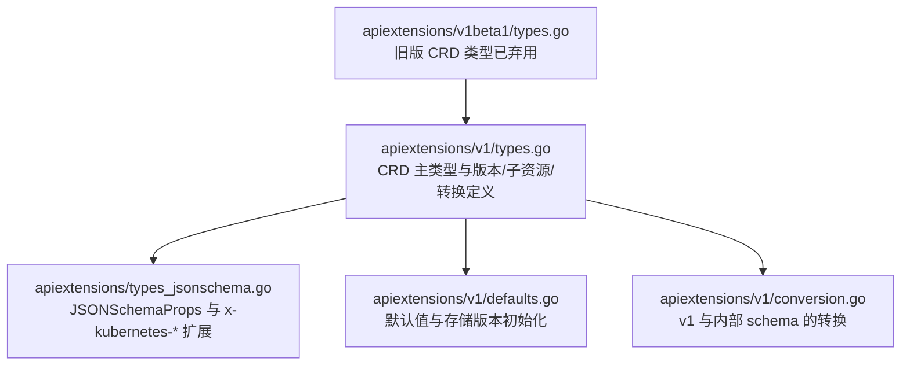
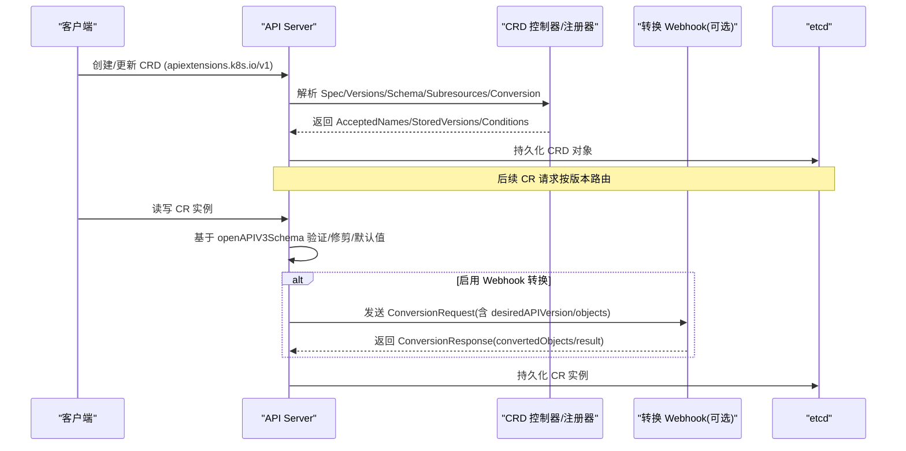
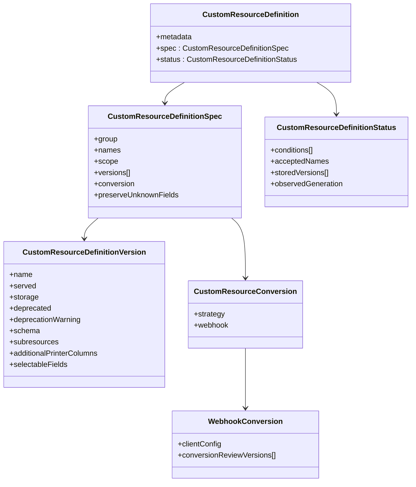
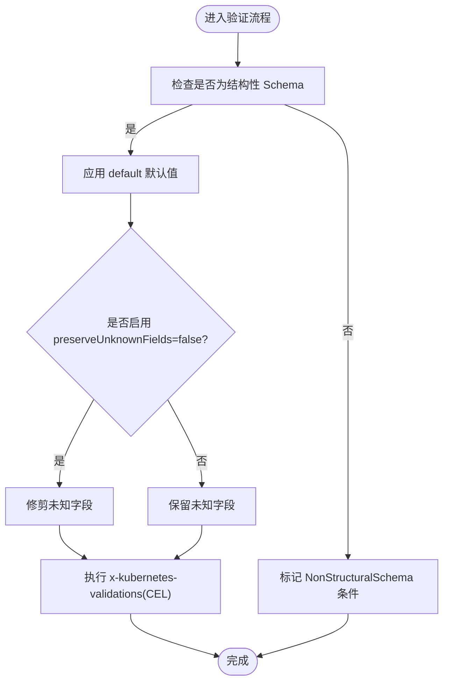
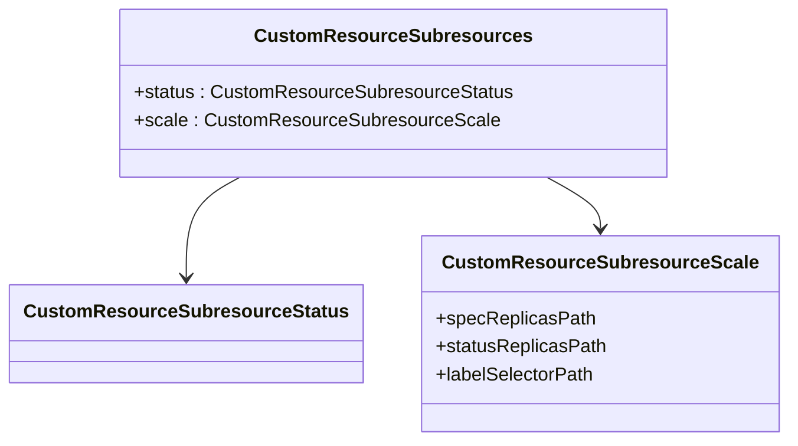
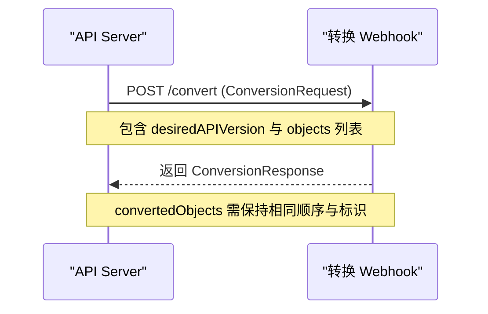
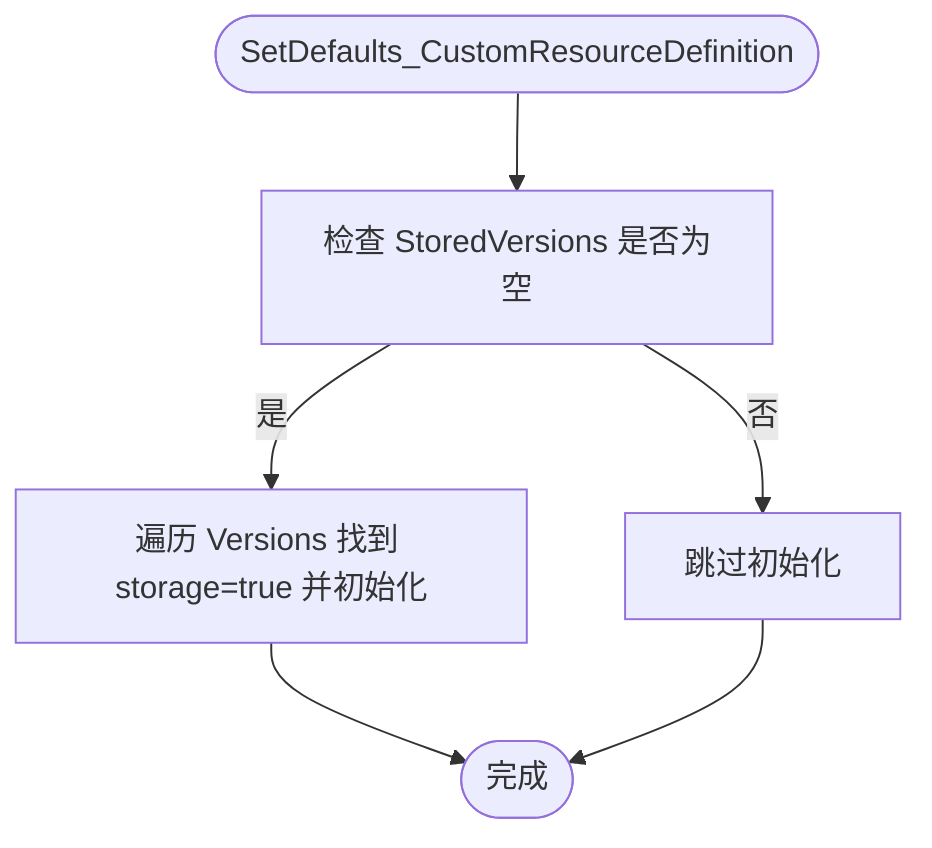
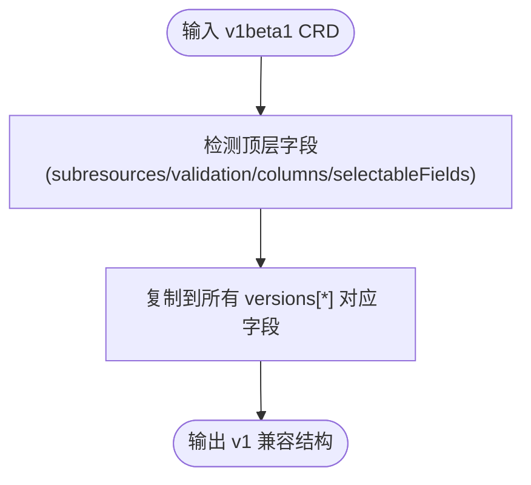
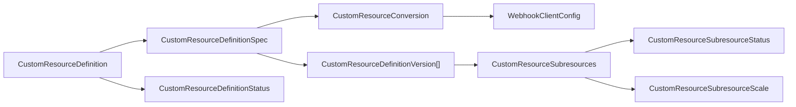

# 自定义资源定义

<cite>
**本文引用的文件**   
- [staging/src/k8s.io/apiextensions-apiserver/pkg/apis/apiextensions/v1/types.go](file://staging/src/k8s.io/apiextensions-apiserver/pkg/apis/apiextensions/v1/types.go)
- [staging/src/k8s.io/apiextensions-apiserver/pkg/apis/apiextensions/v1beta1/types.go](file://staging/src/k8s.io/apiextensions-apiserver/pkg/apis/apiextensions/v1beta1/types.go)
- [staging/src/k8s.io/apiextensions-apiserver/pkg/apis/apiextensions/types_jsonschema.go](file://staging/src/k8s.io/apiextensions-apiserver/pkg/apis/apiextensions/types_jsonschema.go)
- [staging/src/k8s.io/apiextensions-apiserver/pkg/apis/apiextensions/v1/defaults.go](file://staging/src/k8s.io/apiextensions-apiserver/pkg/apis/apiextensions/v1/defaults.go)
- [staging/src/k8s.io/apiextensions-apiserver/pkg/apis/apiextensions/v1/conversion.go](file://staging/src/k8s.io/apiextensions-apiserver/pkg/apis/apiextensions/v1/conversion.go)
- [CHANGELOG/CHANGELOG-1.15.md](file://CHANGELOG/CHANGELOG-1.15.md)
</cite>

## 目录
1. [简介](#简介)
2. [项目结构](#项目结构)
3. [核心组件](#核心组件)
4. [架构总览](#架构总览)
5. [详细组件分析](#详细组件分析)
6. [依赖关系分析](#依赖关系分析)
7. [性能考虑](#性能考虑)
8. [故障排查指南](#故障排查指南)
9. [结论](#结论)
10. [附录](#附录)

## 简介
本文件面向在 Kubernetes 中开发和使用自定义资源定义（CRD）的工程师与平台团队，系统性阐述 CRD 的概念、架构设计、Schema 定义与验证、版本管理与迁移策略、子资源（/status 与 /scale）实现方式、OpenAPI v3 Schema 与 CEL 验证规则编写、生命周期管理要点，以及最佳实践与生产部署建议。文档内容基于 apiextensions-apiserver 中的类型定义与默认值/转换逻辑，并结合变更日志对功能演进进行说明。

## 项目结构
围绕 CRD 的核心代码位于 staging 模块的 apiextensions-apiserver 包中，主要包含：
- v1 与 v1beta1 API 类型的定义（CustomResourceDefinition、Spec、Version、Subresources、Conversion 等）
- JSON Schema 扩展字段与 CEL 验证规则定义
- v1 版本的默认值填充与存储版本初始化
- v1 与内部 schema 之间的转换逻辑

图表来源
- [staging/src/k8s.io/apiextensions-apiserver/pkg/apis/apiextensions/v1/types.go:1-533](file://staging/src/k8s.io/apiextensions-apiserver/pkg/apis/apiextensions/v1/types.go#L1-L533)
- [staging/src/k8s.io/apiextensions-apiserver/pkg/apis/apiextensions/types_jsonschema.go:1-319](file://staging/src/k8s.io/apiextensions-apiserver/pkg/apis/apiextensions/types_jsonschema.go#L1-L319)
- [staging/src/k8s.io/apiextensions-apiserver/pkg/apis/apiextensions/v1/defaults.go:1-62](file://staging/src/k8s.io/apiextensions-apiserver/pkg/apis/apiextensions/v1/defaults.go#L1-L62)
- [staging/src/k8s.io/apiextensions-apiserver/pkg/apis/apiextensions/v1/conversion.go:1-238](file://staging/src/k8s.io/apiextensions-apiserver/pkg/apis/apiextensions/v1/conversion.go#L1-L238)
- [staging/src/k8s.io/apiextensions-apiserver/pkg/apis/apiextensions/v1beta1/types.go:1-580](file://staging/src/k8s.io/apiextensions-apiserver/pkg/apis/apiextensions/v1beta1/types.go#L1-L580)

章节来源
- [staging/src/k8s.io/apiextensions-apiserver/pkg/apis/apiextensions/v1/types.go:1-533](file://staging/src/k8s.io/apiextensions-apiserver/pkg/apis/apiextensions/v1/types.go#L1-L533)
- [staging/src/k8s.io/apiextensions-apiserver/pkg/apis/apiextensions/v1beta1/types.go:1-580](file://staging/src/k8s.io/apiextensions-apiserver/pkg/apis/apiextensions/v1beta1/types.go#L1-L580)
- [staging/src/k8s.io/apiextensions-apiserver/pkg/apis/apiextensions/types_jsonschema.go:1-319](file://staging/src/k8s.io/apiextensions-apiserver/pkg/apis/apiextensions/types_jsonschema.go#L1-L319)
- [staging/src/k8s.io/apiextensions-apiserver/pkg/apis/apiextensions/v1/defaults.go:1-62](file://staging/src/k8s.io/apiextensions-apiserver/pkg/apis/apiextensions/v1/defaults.go#L1-L62)
- [staging/src/k8s.io/apiextensions-apiserver/pkg/apis/apiextensions/v1/conversion.go:1-238](file://staging/src/k8s.io/apiextensions-apiserver/pkg/apis/apiextensions/v1/conversion.go#L1-L238)

## 核心组件
- CustomResourceDefinition 对象模型
  - 顶层对象：包含元数据、spec 与 status
  - spec：定义 group、names、scope、versions、conversion、preserveUnknownFields 等
  - versions：多版本列表，每个版本包含 served/storage/schema/subresources/additionalPrinterColumns/selectableFields 等
  - conversion：None/Webhook 两种策略；Webhook 需要 ClientConfig 与 ConversionReviewVersions
  - status：conditions、acceptedNames、storedVersions、observedGeneration 等

- OpenAPI v3 Schema 与验证
  - 通过 openAPIV3Schema 提供结构化 Schema
  - 支持 x-kubernetes-preserve-unknown-fields、x-kubernetes-int-or-string、list/map 拓扑标注等
  - 支持 x-kubernetes-validations 使用 CEL 表达式进行复杂校验

- 子资源
  - /status：启用后，主端点忽略 .status 变更，/status 子端点仅允许更新 .status
  - /scale：映射 spec.replicas 与 status.replicas，并可选 labelSelectorPath 以配合 HPA

- 默认值与存储版本
  - 若未显式设置 storedVersions，将自动从 storage=true 的版本初始化
  - 部分字段存在默认值（如 ServiceReference.Port 默认 443）

章节来源
- [staging/src/k8s.io/apiextensions-apiserver/pkg/apis/apiextensions/v1/types.go:40-439](file://staging/src/k8s.io/apiextensions-apiserver/pkg/apis/apiextensions/v1/types.go#L40-L439)
- [staging/src/k8s.io/apiextensions-apiserver/pkg/apis/apiextensions/v1/types.go:441-485](file://staging/src/k8s.io/apiextensions-apiserver/pkg/apis/apiextensions/v1/types.go#L441-L485)
- [staging/src/k8s.io/apiextensions-apiserver/pkg/apis/apiextensions/types_jsonschema.go:39-152](file://staging/src/k8s.io/apiextensions-apiserver/pkg/apis/apiextensions/types_jsonschema.go#L39-L152)
- [staging/src/k8s.io/apiextensions-apiserver/pkg/apis/apiextensions/types_jsonschema.go:146-279](file://staging/src/k8s.io/apiextensions-apiserver/pkg/apis/apiextensions/types_jsonschema.go#L146-L279)
- [staging/src/k8s.io/apiextensions-apiserver/pkg/apis/apiextensions/v1/defaults.go:30-61](file://staging/src/k8s.io/apiextensions-apiserver/pkg/apis/apiextensions/v1/defaults.go#L30-L61)

## 架构总览
下图展示了 CRD 在 API Server 侧的关键交互：用户提交 CRD 与 CR 实例，API Server 依据 Schema 执行验证、修剪与默认值填充；当启用 Webhook 转换时，会在版本间调用外部 Webhook 完成转换；/status 与 /scale 子资源由 API Server 路由到对应处理逻辑。

图表来源
- [staging/src/k8s.io/apiextensions-apiserver/pkg/apis/apiextensions/v1/types.go:75-147](file://staging/src/k8s.io/apiextensions-apiserver/pkg/apis/apiextensions/v1/types.go#L75-L147)
- [staging/src/k8s.io/apiextensions-apiserver/pkg/apis/apiextensions/v1/types.go:434-439](file://staging/src/k8s.io/apiextensions-apiserver/pkg/apis/apiextensions/v1/types.go#L434-L439)
- [staging/src/k8s.io/apiextensions-apiserver/pkg/apis/apiextensions/v1/types.go:490-532](file://staging/src/k8s.io/apiextensions-apiserver/pkg/apis/apiextensions/v1/types.go#L490-L532)

## 详细组件分析

### CRD 类型与版本管理
- 版本列表排序与选择
  - 版本名用于发现顺序；“kube-like”版本优先，随后按主次版本排序
  - 必须且只能有一个 version.storage=true
- 废弃与兼容性
  - v1beta1 已标记为弃用并在后续版本移除，应迁移至 v1
  - v1 引入更多能力（结构性 Schema、默认值、OpenAPI 发布、Webhook 转换等）

图表来源
- [staging/src/k8s.io/apiextensions-apiserver/pkg/apis/apiextensions/v1/types.go:40-73](file://staging/src/k8s.io/apiextensions-apiserver/pkg/apis/apiextensions/v1/types.go#L40-L73)
- [staging/src/k8s.io/apiextensions-apiserver/pkg/apis/apiextensions/v1/types.go:169-211](file://staging/src/k8s.io/apiextensions-apiserver/pkg/apis/apiextensions/v1/types.go#L169-L211)
- [staging/src/k8s.io/apiextensions-apiserver/pkg/apis/apiextensions/v1/types.go:75-147](file://staging/src/k8s.io/apiextensions-apiserver/pkg/apis/apiextensions/v1/types.go#L75-L147)
- [staging/src/k8s.io/apiextensions-apiserver/pkg/apis/apiextensions/v1/types.go:364-391](file://staging/src/k8s.io/apiextensions-apiserver/pkg/apis/apiextensions/v1/types.go#L364-L391)

章节来源
- [staging/src/k8s.io/apiextensions-apiserver/pkg/apis/apiextensions/v1/types.go:40-73](file://staging/src/k8s.io/apiextensions-apiserver/pkg/apis/apiextensions/v1/types.go#L40-L73)
- [staging/src/k8s.io/apiextensions-apiserver/pkg/apis/apiextensions/v1/types.go:169-211](file://staging/src/k8s.io/apiextensions-apiserver/pkg/apis/apiextensions/v1/types.go#L169-L211)
- [staging/src/k8s.io/apiextensions-apiserver/pkg/apis/apiextensions/v1/types.go:364-391](file://staging/src/k8s.io/apiextensions-apiserver/pkg/apis/apiextensions/v1/types.go#L364-L391)
- [staging/src/k8s.io/apiextensions-apiserver/pkg/apis/apiextensions/v1beta1/types.go:433-475](file://staging/src/k8s.io/apiextensions-apiserver/pkg/apis/apiextensions/v1beta1/types.go#L433-L475)

### Schema 定义与验证（OpenAPI v3 与 CEL）
- 基础验证
  - 使用 openAPIV3Schema 声明数据结构、必填项、范围、枚举、正则等
  - 结构性 Schema 是启用默认值、字段修剪、只读字段、OpenAPI 发布与 Webhook 转换的前提
- 高级特性
  - x-kubernetes-preserve-unknown-fields：保留未知字段（递归生效，除非嵌套 properties/additionalProperties）
  - x-kubernetes-int-or-string：兼容整数或字符串
  - list/map 拓扑：x-kubernetes-list-type（atomic/set/map）、x-kubernetes-map-type（granular/atomic）
  - x-kubernetes-validations：CEL 表达式，支持 oldSelf 与 optionalOldSelf 的过渡规则
- 默认值
  - 在 v1.15 起作为 alpha 引入，要求结构性 Schema
  - 对未指定字段在写入与读取时应用默认值

图表来源
- [staging/src/k8s.io/apiextensions-apiserver/pkg/apis/apiextensions/types_jsonschema.go:79-152](file://staging/src/k8s.io/apiextensions-apiserver/pkg/apis/apiextensions/types_jsonschema.go#L79-L152)
- [staging/src/k8s.io/apiextensions-apiserver/pkg/apis/apiextensions/types_jsonschema.go:146-279](file://staging/src/k8s.io/apiextensions-apiserver/pkg/apis/apiextensions/types_jsonschema.go#L146-L279)
- [CHANGELOG/CHANGELOG-1.15.md:1011-1032](file://CHANGELOG/CHANGELOG-1.15.md#L1011-L1032)

章节来源
- [staging/src/k8s.io/apiextensions-apiserver/pkg/apis/apiextensions/types_jsonschema.go:39-152](file://staging/src/k8s.io/apiextensions-apiserver/pkg/apis/apiextensions/types_jsonschema.go#L39-L152)
- [staging/src/k8s.io/apiextensions-apiserver/pkg/apis/apiextensions/types_jsonschema.go:146-279](file://staging/src/k8s.io/apiextensions-apiserver/pkg/apis/apiextensions/types_jsonschema.go#L146-L279)
- [CHANGELOG/CHANGELOG-1.15.md:1011-1032](file://CHANGELOG/CHANGELOG-1.15.md#L1011-L1032)

### 子资源：/status 与 /scale
- /status
  - 启用后，主端点 PUT/POST/PATCH 忽略 .status 变更；/status 子端点仅接受 .status 变更
- /scale
  - 通过 specReplicasPath 与 statusReplicasPath 映射副本数
  - 可选 labelSelectorPath 指向字符串形式的标签选择器，便于 HPA 集成

图表来源
- [staging/src/k8s.io/apiextensions-apiserver/pkg/apis/apiextensions/v1/types.go:441-485](file://staging/src/k8s.io/apiextensions-apiserver/pkg/apis/apiextensions/v1/types.go#L441-L485)

章节来源
- [staging/src/k8s.io/apiextensions-apiserver/pkg/apis/apiextensions/v1/types.go:441-485](file://staging/src/k8s.io/apiextensions-apiserver/pkg/apis/apiextensions/v1/types.go#L441-L485)

### 版本迁移与转换（Webhook 与 None）
- 转换策略
  - None：仅修改 apiVersion，不触碰其他字段
  - Webhook：API Server 调用外部 Webhook 进行版本间转换
- Webhook 配置
  - clientConfig：URL 或 service 引用，支持 CA 证书
  - conversionReviewVersions：期望的 ConversionReview 版本列表
- 转换请求/响应
  - ConversionRequest：uid、desiredAPIVersion、objects
  - ConversionResponse：convertedObjects、result（Success/Failure）

图表来源
- [staging/src/k8s.io/apiextensions-apiserver/pkg/apis/apiextensions/v1/types.go:75-147](file://staging/src/k8s.io/apiextensions-apiserver/pkg/apis/apiextensions/v1/types.go#L75-L147)
- [staging/src/k8s.io/apiextensions-apiserver/pkg/apis/apiextensions/v1/types.go:490-532](file://staging/src/k8s.io/apiextensions-apiserver/pkg/apis/apiextensions/v1/types.go#L490-L532)

章节来源
- [staging/src/k8s.io/apiextensions-apiserver/pkg/apis/apiextensions/v1/types.go:75-147](file://staging/src/k8s.io/apiextensions-apiserver/pkg/apis/apiextensions/v1/types.go#L75-L147)
- [staging/src/k8s.io/apiextensions-apiserver/pkg/apis/apiextensions/v1/types.go:490-532](file://staging/src/k8s.io/apiextensions-apiserver/pkg/apis/apiextensions/v1/types.go#L490-L532)

### 默认值与存储版本初始化
- 默认值
  - 若未设置 Names.Singular/ListKind，则根据 Kind 推导
  - 若未设置 Conversion，则默认为 NoneConverter
  - ServiceReference.Port 默认 443
- 存储版本
  - 若 Status.StoredVersions 为空，将从 spec.versions 中 storage=true 的版本初始化

图表来源
- [staging/src/k8s.io/apiextensions-apiserver/pkg/apis/apiextensions/v1/defaults.go:30-61](file://staging/src/k8s.io/apiextensions-apiserver/pkg/apis/apiextensions/v1/defaults.go#L30-L61)

章节来源
- [staging/src/k8s.io/apiextensions-apiserver/pkg/apis/apiextensions/v1/defaults.go:30-61](file://staging/src/k8s.io/apiextensions-apiserver/pkg/apis/apiextensions/v1/defaults.go#L30-L61)

### 向后兼容与 v1beta1 迁移
- v1beta1 已弃用，建议在 v1.16+ 集群中使用 v1
- v1 的 Spec 不再支持顶层 version 字段，统一使用 versions 列表
- 转换逻辑会将 v1beta1 的顶层 subresources/validation/columns/selectableFields 下推到各版本

图表来源
- [staging/src/k8s.io/apiextensions-apiserver/pkg/apis/apiextensions/v1/conversion.go:73-125](file://staging/src/k8s.io/apiextensions-apiserver/pkg/apis/apiextensions/v1/conversion.go#L73-L125)

章节来源
- [staging/src/k8s.io/apiextensions-apiserver/pkg/apis/apiextensions/v1/conversion.go:73-125](file://staging/src/k8s.io/apiextensions-apiserver/pkg/apis/apiextensions/v1/conversion.go#L73-L125)
- [staging/src/k8s.io/apiextensions-apiserver/pkg/apis/apiextensions/v1beta1/types.go:40-112](file://staging/src/k8s.io/apiextensions-apiserver/pkg/apis/apiextensions/v1beta1/types.go#L40-L112)

## 依赖关系分析
- 类型耦合
  - CustomResourceDefinition 强依赖 Spec/Status 与 Version 列表
  - Conversion 依赖 WebhookClientConfig 与 ConversionReviewVersions
  - Subresources 依赖 Status/Scale 子资源定义
- 外部依赖
  - 转换 Webhook 通过 service/url 访问，需 TLS 与 CA 配置
  - OpenAPI v3 Schema 驱动验证、默认值与字段修剪

图表来源
- [staging/src/k8s.io/apiextensions-apiserver/pkg/apis/apiextensions/v1/types.go:40-73](file://staging/src/k8s.io/apiextensions-apiserver/pkg/apis/apiextensions/v1/types.go#L40-L73)
- [staging/src/k8s.io/apiextensions-apiserver/pkg/apis/apiextensions/v1/types.go:169-211](file://staging/src/k8s.io/apiextensions-apiserver/pkg/apis/apiextensions/v1/types.go#L169-L211)
- [staging/src/k8s.io/apiextensions-apiserver/pkg/apis/apiextensions/v1/types.go:441-485](file://staging/src/k8s.io/apiextensions-apiserver/pkg/apis/apiextensions/v1/types.go#L441-L485)
- [staging/src/k8s.io/apiextensions-apiserver/pkg/apis/apiextensions/v1/types.go:364-391](file://staging/src/k8s.io/apiextensions-apiserver/pkg/apis/apiextensions/v1/types.go#L364-L391)

## 性能考虑
- 结构性 Schema 与字段修剪
  - 启用结构性 Schema 可显著减少无效字段落盘，降低 etcd 负载
  - 谨慎使用 preserveUnknownFields，避免不必要的数据膨胀
- 列表与 Map 拓扑
  - 合理设置 x-kubernetes-list-type 与 x-kubernetes-map-type，有助于高效合并与冲突解决
- CEL 验证
  - 复杂 CEL 规则可能带来 CPU 开销，建议控制规则数量与复杂度，必要时拆分验证阶段
- 转换 Webhook
  - Webhook 转换会增加网络与序列化开销，应确保高可用与低延迟，并缓存必要状态

[本节为通用指导，无需源码引用]

## 故障排查指南
- CRD 条件与状态
  - Established/NamesAccepted/Terminating：反映名称冲突、建立与清理状态
  - NonStructuralSchema：非结构性 Schema 会限制功能（默认值、修剪、只读、OpenAPI 发布、Webhook 转换）
  - StorageMigrating：存储版本迁移进行中
- 常见错误
  - 多个版本同时 storage=true：违反唯一存储版本约束
  - Webhook 不可达或证书问题：导致转换失败
  - CEL 表达式语法错误或运行时异常：导致验证失败
- 定位方法
  - 查看 CRD 的 status.conditions 与 acceptedNames/storedVersions
  - 检查 Webhook 的日志与连通性
  - 使用 kubectl explain 与 OpenAPI 文档辅助调试

章节来源
- [staging/src/k8s.io/apiextensions-apiserver/pkg/apis/apiextensions/v1/types.go:301-391](file://staging/src/k8s.io/apiextensions-apiserver/pkg/apis/apiextensions/v1/types.go#L301-L391)

## 结论
CRD 为 Kubernetes 提供了强大的可扩展能力。通过结构性 Schema、默认值、字段修剪、OpenAPI 发布与 Webhook 转换，开发者可以构建稳定、可演进且易于维护的自定义 API。在生产环境中，应优先采用 v1 API、严格定义 Schema、合理使用子资源与转换策略，并结合监控与日志完善排障体系。

[本节为总结性内容，无需源码引用]

## 附录
- 最佳实践清单
  - 使用 apiextensions.k8s.io/v1 替代 v1beta1
  - 始终提供结构性 Schema，并明确 required/enum/pattern 等约束
  - 仅在必要时启用 preserveUnknownFields
  - 为 /status 与 /scale 子资源提供清晰的路径映射
  - 谨慎设计 Webhook 转换逻辑，保证幂等与健壮性
  - 利用 additionalPrinterColumns 提升可观测性与易用性
  - 使用 selectableFields 限定字段选择器，提高查询效率
- 参考路径
  - CRD 类型定义：[v1/types.go](file://staging/src/k8s.io/apiextensions-apiserver/pkg/apis/apiextensions/v1/types.go)
  - JSON Schema 扩展与 CEL：[types_jsonschema.go](file://staging/src/k8s.io/apiextensions-apiserver/pkg/apis/apiextensions/types_jsonschema.go)
  - 默认值与存储版本：[v1/defaults.go](file://staging/src/k8s.io/apiextensions-apiserver/pkg/apis/apiextensions/v1/defaults.go)
  - 转换逻辑：[v1/conversion.go](file://staging/src/k8s.io/apiextensions-apiserver/pkg/apis/apiextensions/v1/conversion.go)
  - 功能演进（默认值/修剪/OpenAPI 发布）：[CHANGELOG-1.15.md](file://CHANGELOG/CHANGELOG-1.15.md)