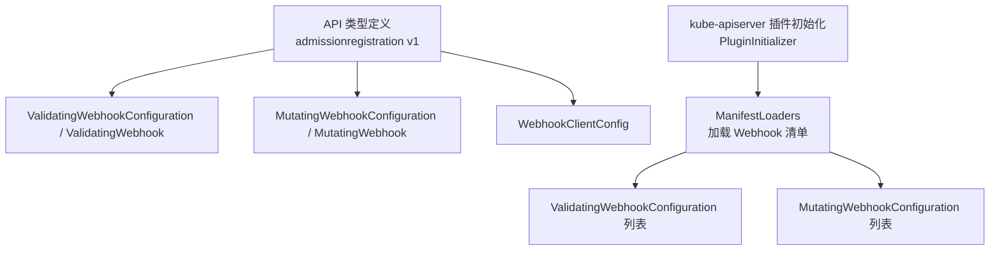
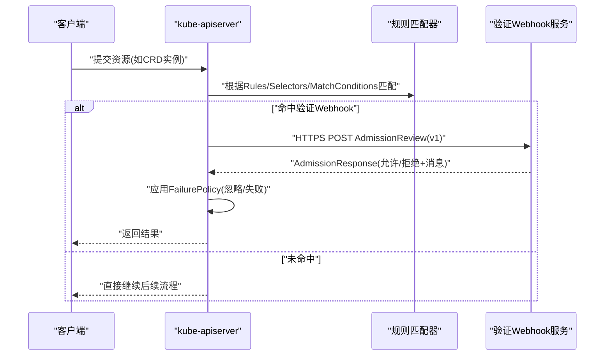
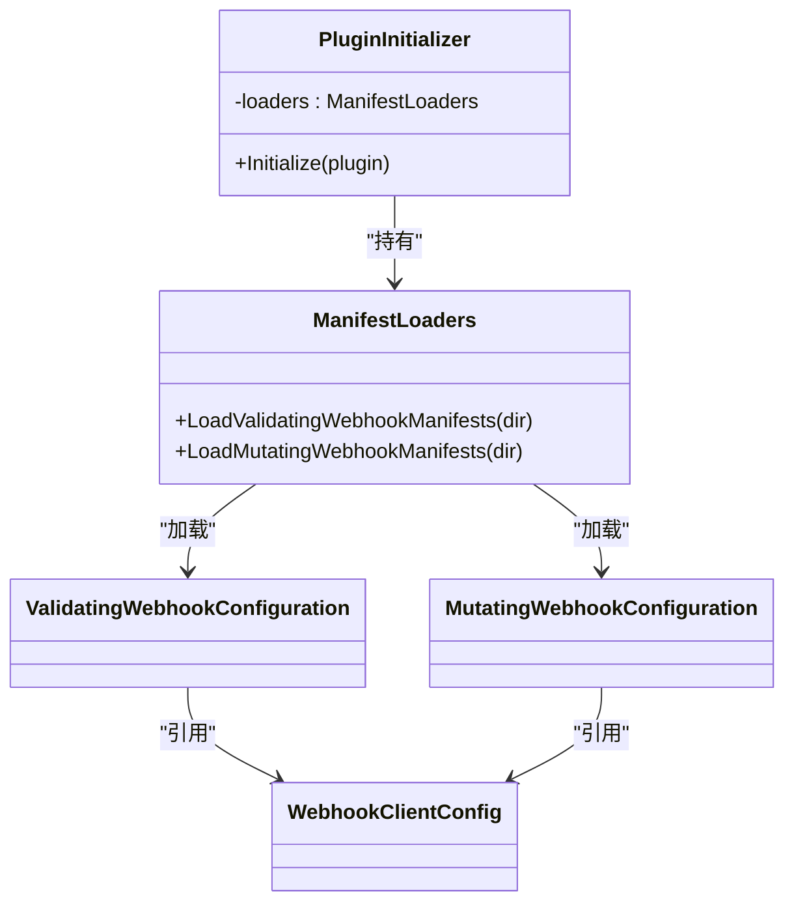

# 验证Webhook

<cite>
**本文引用的文件**   
- [pkg/apis/admissionregistration/types.go](file://pkg/apis/admissionregistration/types.go)
- [staging/src/k8s.io/api/admissionregistration/v1/types.go](file://staging/src/k8s.io/api/admissionregistration/v1/types.go)
- [pkg/kubeapiserver/admission/initializer.go](file://pkg/kubeapiserver/admission/initializer.go)
</cite>

## 目录
1. [简介](#简介)
2. [项目结构](#项目结构)
3. [核心组件](#核心组件)
4. [架构总览](#架构总览)
5. [详细组件分析](#详细组件分析)
6. [依赖关系分析](#依赖关系分析)
7. [性能考虑](#性能考虑)
8. [故障排查指南](#故障排查指南)
9. [结论](#结论)
10. [附录](#附录)

## 简介
本文件面向在 Kubernetes 中实现与配置 CRD 验证 Webhook 的工程师，系统性阐述 ValidatingAdmissionWebhook 的工作原理、调用时机、与 MutatingAdmissionWebhook 的差异与适用场景；并给出 Webhook 的配置方法（证书管理、超时设置、重试策略）、处理逻辑开发指南（请求解析与响应构造）、复杂业务验证示例思路、高可用部署与性能优化建议，以及调试监控与安全最佳实践。

## 项目结构
围绕验证 Webhook 的关键代码位于 API 类型定义与 kube-apiserver 插件初始化路径：
- API 类型定义：ValidatingWebhookConfiguration、ValidatingWebhook、MutatingWebhookConfiguration、MutatingWebhook、WebhookClientConfig 等
- 插件初始化：kube-apiserver 通过 ManifestLoaders 加载 Webhook 清单（当启用相应特性门控时）

图表来源
- [staging/src/k8s.io/api/admissionregistration/v1/types.go:729-756](file://staging/src/k8s.io/api/admissionregistration/v1/types.go#L729-L756)
- [staging/src/k8s.io/api/admissionregistration/v1/types.go:763-790](file://staging/src/k8s.io/api/admissionregistration/v1/types.go#L763-L790)
- [staging/src/k8s.io/api/admissionregistration/v1/types.go:1482-1525](file://staging/src/k8s.io/api/admissionregistration/v1/types.go#L1482-L1525)
- [pkg/kubeapiserver/admission/initializer.go:53-87](file://pkg/kubeapiserver/admission/initializer.go#L53-L87)

章节来源
- [staging/src/k8s.io/api/admissionregistration/v1/types.go:729-756](file://staging/src/k8s.io/api/admissionregistration/v1/types.go#L729-L756)
- [staging/src/k8s.io/api/admissionregistration/v1/types.go:763-790](file://staging/src/k8s.io/api/admissionregistration/v1/types.go#L763-L790)
- [staging/src/k8s.io/api/admissionregistration/v1/types.go:1482-1525](file://staging/src/k8s.io/api/admissionregistration/v1/types.go#L1482-L1525)
- [pkg/kubeapiserver/admission/initializer.go:53-87](file://pkg/kubeapiserver/admission/initializer.go#L53-L87)

## 核心组件
- ValidatingWebhookConfiguration：声明一组 ValidatingWebhook，指定要校验的资源、操作、匹配条件及客户端连接信息
- ValidatingWebhook：单个验证规则，包含 ClientConfig、Rules、FailurePolicy、MatchPolicy、SideEffects、TimeoutSeconds、AdmissionReviewVersions、MatchConditions 等
- MutatingWebhookConfiguration/MutatingWebhook：用于变更对象的 Webhook，支持 ReinvocationPolicy 等额外能力
- WebhookClientConfig：指向 Webhook 服务或 URL，包含 CA 证书（CABundle），用于 TLS 校验

关键要点
- 验证 Webhook 仅做“接受/拒绝”，不修改对象
- 变更 Webhook 可修改对象，且支持按需重入（ReinvocationPolicy=IfNeeded）
- 两者均通过 AdmissionReview 协议通信，使用 HTTPS 与 CABundle 进行服务端证书校验

章节来源
- [staging/src/k8s.io/api/admissionregistration/v1/types.go:729-756](file://staging/src/k8s.io/api/admissionregistration/v1/types.go#L729-L756)
- [staging/src/k8s.io/api/admissionregistration/v1/types.go:792-940](file://staging/src/k8s.io/api/admissionregistration/v1/types.go#L792-L940)
- [staging/src/k8s.io/api/admissionregistration/v1/types.go:763-790](file://staging/src/k8s.io/api/admissionregistration/v1/types.go#L763-L790)
- [staging/src/k8s.io/api/admissionregistration/v1/types.go:942-1108](file://staging/src/k8s.io/api/admissionregistration/v1/types.go#L942-L1108)
- [staging/src/k8s.io/api/admissionregistration/v1/types.go:1482-1525](file://staging/src/k8s.io/api/admissionregistration/v1/types.go#L1482-L1525)

## 架构总览
下图展示 API Server 对 admission 请求的处理流程，包括匹配规则、调用验证 Webhook、根据 FailurePolicy 决定最终结果。

图表来源
- [staging/src/k8s.io/api/admissionregistration/v1/types.go:792-940](file://staging/src/k8s.io/api/admissionregistration/v1/types.go#L792-L940)
- [staging/src/k8s.io/api/admissionregistration/v1/types.go:1482-1525](file://staging/src/k8s.io/api/admissionregistration/v1/types.go#L1482-L1525)

## 详细组件分析

### 验证 Webhook 工作原理与调用时机
- 触发时机：在 API 请求进入持久化之前，若匹配到 ValidatingWebhookConfiguration 中的 Rules/Selectors/MatchConditions，则发起 HTTP 调用
- 匹配顺序：先按 Rules（APIGroup/Version/Resources/Operations/Scope），再按 NamespaceSelector/ObjectSelector，最后按 MatchConditions（CEL）
- 版本协商：AdmissionReviewVersions 指定期望的版本，API Server 选择首个双方都支持的版本
- 失败策略：FailurePolicy=Ignore 表示网络错误/超时等被忽略；Fail 表示视为拒绝
- 副作用控制：SideEffects 必须声明为 None/NoneOnDryRun，避免 dry-run 产生副作用
- 超时控制：TimeoutSeconds 限制单次调用耗时，超出后按 FailurePolicy 处理

章节来源
- [staging/src/k8s.io/api/admissionregistration/v1/types.go:792-940](file://staging/src/k8s.io/api/admissionregistration/v1/types.go#L792-L940)

### 变更 Webhook vs 验证 Webhook
- 行为差异
  - 验证：只返回允许/拒绝，不改变对象
  - 变更：可对对象进行修改，支持 ReinvocationPolicy=IfNeeded 以在其他插件修改后再次调用
- 适用场景
  - 验证：合规检查、配额/命名规范、字段范围约束、跨资源一致性校验
  - 变更：注入默认值、标签/注解补全、安全上下文标准化、镜像仓库白名单替换
- 安全性
  - 变更 Webhook 需幂等设计（尤其是 IfNeeded），避免重复修改导致不一致

章节来源
- [staging/src/k8s.io/api/admissionregistration/v1/types.go:942-1108](file://staging/src/k8s.io/api/admissionregistration/v1/types.go#L942-L1108)

### Webhook 配置方法
- 客户端连接
  - ServiceReference：指向集群内 Service（推荐），含 namespace/name/path/port
  - URL：外部地址（https://...），host 可为 IP 或域名
  - CABundle：PEM 编码的 CA 证书，用于校验 Webhook 服务器证书
- 超时与重试
  - TimeoutSeconds：1~30 秒，默认 10 秒
  - 重试策略：由 FailurePolicy 控制（Ignore/Fail），非指数退避式重试
- 匹配与过滤
  - Rules：APIGroups/APIVersions/Resources/Operations/Scope
  - NamespaceSelector/ObjectSelector：基于标签选择
  - MatchConditions：CEL 表达式进一步过滤
- 版本兼容
  - AdmissionReviewVersions：声明支持的版本，API Server 选择第一个共同版本

章节来源
- [staging/src/k8s.io/api/admissionregistration/v1/types.go:1482-1525](file://staging/src/k8s.io/api/admissionregistration/v1/types.go#L1482-L1525)
- [staging/src/k8s.io/api/admissionregistration/v1/types.go:792-940](file://staging/src/k8s.io/api/admissionregistration/v1/types.go#L792-L940)

### 证书管理与安全配置
- 证书链
  - 生成自签 CA 或采用企业 CA，将 CA 证书放入 CABundle
  - Webhook 服务使用由该 CA 签发的证书，确保主机名与 SAN 正确
- 传输安全
  - 强制 https，禁止 localhost/127.0.0.1 作为 host（除非特殊场景）
  - 避免在 URL 中使用用户/密码、片段或查询参数
- 访问控制
  - 结合 RBAC 限制 Webhook 服务读取必要资源的权限
  - 使用 NetworkPolicy 限制 API Server 到 Webhook 服务的访问源

章节来源
- [staging/src/k8s.io/api/admissionregistration/v1/types.go:1482-1525](file://staging/src/k8s.io/api/admissionregistration/v1/types.go#L1482-L1525)

### 处理逻辑开发指南（请求解析与响应构造）
- 请求体
  - 标准 AdmissionReview 对象，包含 request.object/request.oldObject/request.resource/request.namespace 等
- 响应体
  - AdmissionResponse：允许/拒绝、拒绝原因与消息、补丁（仅变更 Webhook）
- 开发建议
  - 快速失败：优先进行轻量级校验，复杂逻辑异步或缓存
  - 幂等性：尤其变更 Webhook 在 IfNeeded 下可能被多次调用
  - 日志与指标：记录匹配结果、耗时、错误码，便于排障
  - 错误处理：区分业务拒绝与系统错误，配合 FailurePolicy 合理配置

章节来源
- [staging/src/k8s.io/api/admissionregistration/v1/types.go:792-940](file://staging/src/k8s.io/api/admissionregistration/v1/types.go#L792-L940)

### 复杂业务验证示例（思路）
- 多资源一致性：创建 Pod 前校验对应 Deployment/Service 存在且状态正常
- 命名与标签规范：名称符合正则、必需标签存在且取值在白名单
- 配额与容量：计算资源总和不超过命名空间配额上限
- 合规策略：镜像仓库白名单、安全上下文最小权限、存储类合规
- 动态参数：结合参数资源（ParamRef）与 CEL 变量进行策略下发与组合评估

[本节为概念性说明，不直接分析具体源码文件]

### 高可用部署与性能优化
- 高可用
  - Webhook 服务以 Deployment 多副本运行，配合 Service 负载均衡
  - 健康检查：就绪探针确保流量只路由到健康实例
  - 亲和性与拓扑：尽量与 API Server 同节点池以降低延迟
- 性能
  - 减少 I/O：本地缓存热点数据，避免频繁远端调用
  - 并行与批处理：批量校验合并请求，降低 RTT
  - 超时与熔断：合理设置 TimeoutSeconds，必要时引入熔断保护
  - 资源隔离：为 Webhook 服务设置 CPU/内存限制与 QoS 等级

[本节为通用指导，不直接分析具体源码文件]

### 调试与监控
- 调试
  - 查看 API Server 日志定位匹配与调用链路
  - 抓包或代理层日志确认 TLS 握手与证书链
  - 使用 kubectl 模拟 dry-run 验证匹配与响应
- 监控
  - 暴露 Prometheus 指标：调用次数、成功率、P95/P99 延迟、错误分类
  - 告警：超时率、拒绝率突增、证书过期、服务不可用

[本节为通用指导，不直接分析具体源码文件]

## 依赖关系分析
- API 类型与插件初始化
  - PluginInitializer 提供 ManifestLoaders，在启用特性门控时从目录加载 Validating/Mutating Webhook 清单
  - 加载结果映射为 admissionregistration v1 类型的 Configuration 列表，供 API Server 使用

图表来源
- [pkg/kubeapiserver/admission/initializer.go:53-87](file://pkg/kubeapiserver/admission/initializer.go#L53-L87)
- [staging/src/k8s.io/api/admissionregistration/v1/types.go:729-756](file://staging/src/k8s.io/api/admissionregistration/v1/types.go#L729-L756)
- [staging/src/k8s.io/api/admissionregistration/v1/types.go:763-790](file://staging/src/k8s.io/api/admissionregistration/v1/types.go#L763-L790)
- [staging/src/k8s.io/api/admissionregistration/v1/types.go:1482-1525](file://staging/src/k8s.io/api/admissionregistration/v1/types.go#L1482-L1525)

章节来源
- [pkg/kubeapiserver/admission/initializer.go:53-87](file://pkg/kubeapiserver/admission/initializer.go#L53-L87)
- [staging/src/k8s.io/api/admissionregistration/v1/types.go:729-756](file://staging/src/k8s.io/api/admissionregistration/v1/types.go#L729-L756)
- [staging/src/k8s.io/api/admissionregistration/v1/types.go:763-790](file://staging/src/k8s.io/api/admissionregistration/v1/types.go#L763-L790)
- [staging/src/k8s.io/api/admissionregistration/v1/types.go:1482-1525](file://staging/src/k8s.io/api/admissionregistration/v1/types.go#L1482-L1525)

## 性能考虑
- 匹配阶段开销：尽量缩小 Rules 与 Selector 范围，减少不必要的 Webhook 调用
- 调用阶段开销：控制 TimeoutSeconds，避免长尾请求阻塞主流程
- 失败策略权衡：生产环境谨慎使用 Fail，避免因外部依赖抖动影响整体可用性
- 资源隔离：为 Webhook 服务设置合理的资源限额与优先级，防止抢占 API Server 资源

[本节为通用指导，不直接分析具体源码文件]

## 故障排查指南
- 常见症状
  - 请求被拒绝：检查 Webhook 返回的拒绝原因与消息
  - 请求被忽略：FailurePolicy=Ignore 时网络错误不会阻断流程
  - 超时：确认 TimeoutSeconds 与服务端处理能力是否匹配
- 排查步骤
  - 核对 Webhook 配置：URL/Service、CABundle、AdmissionReviewVersions
  - 检查证书链：CA 是否正确、主机名/SAN 是否匹配
  - 观察 API Server 日志与 Webhook 服务日志，定位错误堆栈
  - 使用 dry-run 与最小化规则复现问题

章节来源
- [staging/src/k8s.io/api/admissionregistration/v1/types.go:792-940](file://staging/src/k8s.io/api/admissionregistration/v1/types.go#L792-L940)
- [staging/src/k8s.io/api/admissionregistration/v1/types.go:1482-1525](file://staging/src/k8s.io/api/admissionregistration/v1/types.go#L1482-L1525)

## 结论
验证 Webhook 是扩展 Kubernetes 准入控制的重要机制。通过精确的规则匹配、严格的证书校验与合理的超时/失败策略，可在保障集群稳定性的同时实现复杂的业务校验。结合变更 Webhook 可实现更灵活的自动化与治理。在生产环境中，应重视高可用、性能优化、监控告警与安全加固，确保 Webhook 成为可靠的基础设施能力。

[本节为总结性内容，不直接分析具体源码文件]

## 附录
- 术语
  - AdmissionReview：Webhook 请求/响应的标准格式
  - CABundle：用于校验 Webhook 服务器证书的 CA 证书集合
  - FailurePolicy：Webhook 调用失败的处置策略
  - SideEffects：声明 Webhook 是否有副作用
  - ReinvocationPolicy：变更 Webhook 的重入策略

[本节为概念性说明，不直接分析具体源码文件]