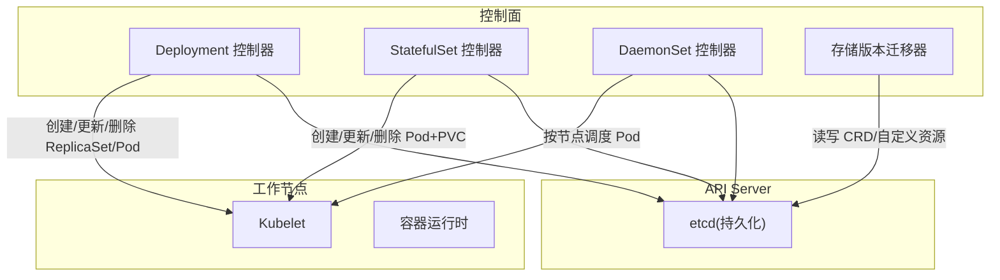
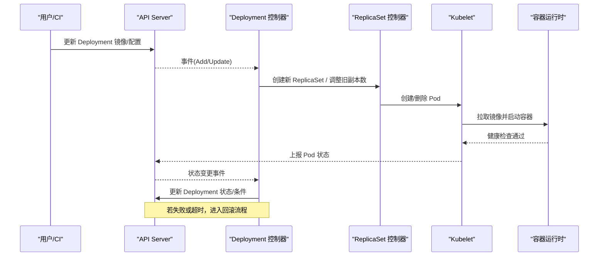
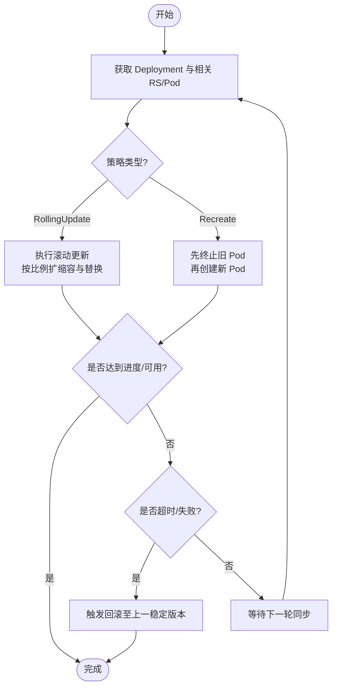
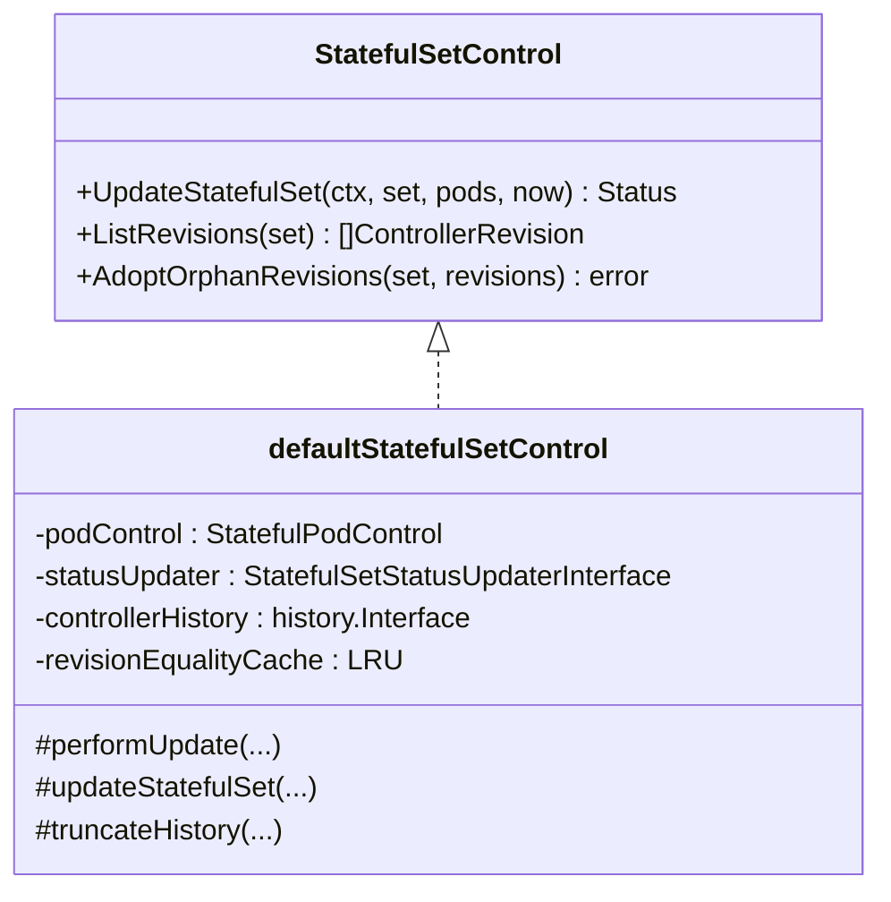
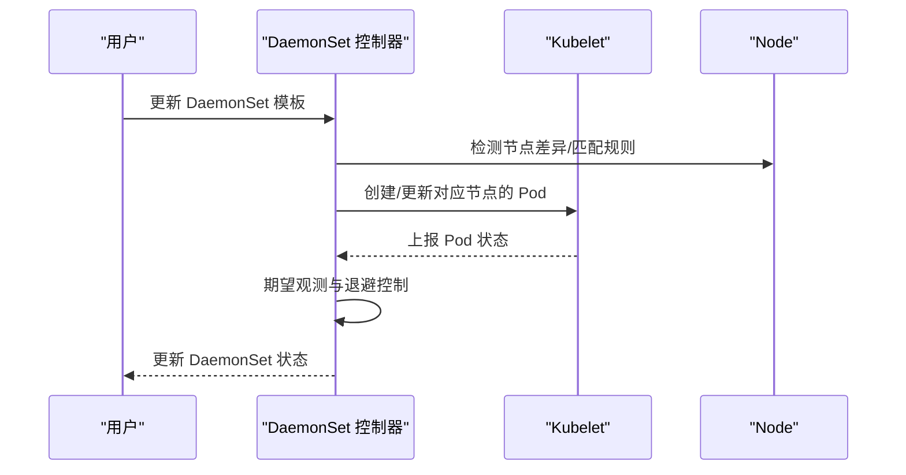
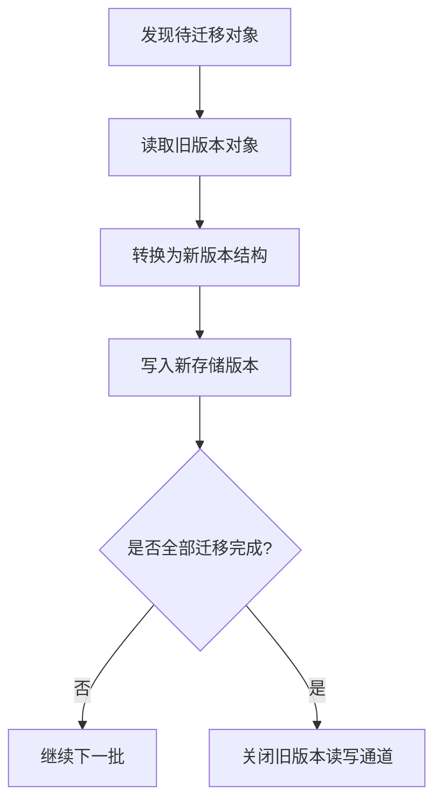
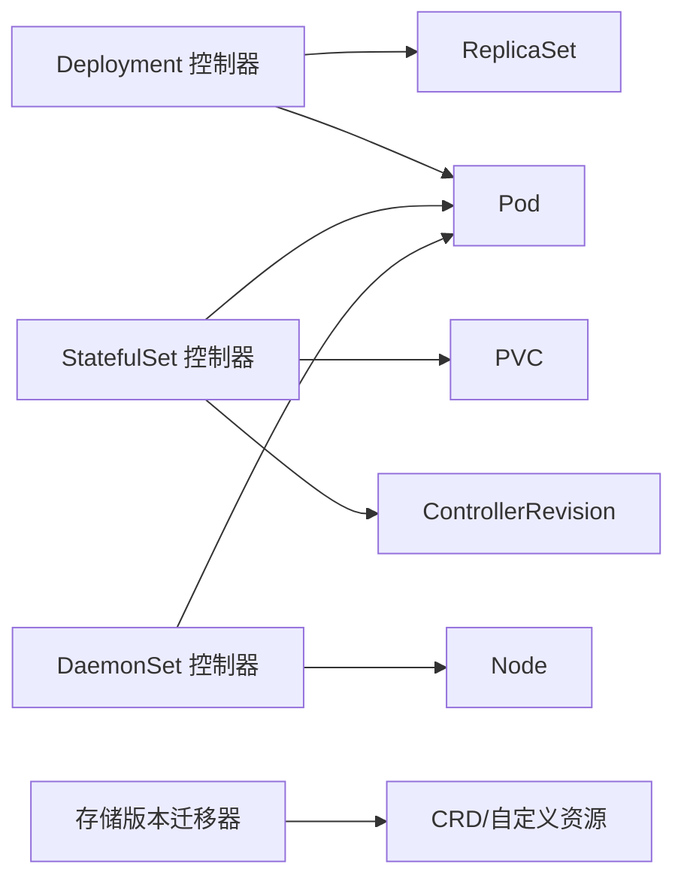

# 升级与回滚

<cite>
**本文引用的文件**   
- [deployment_controller.go](file://pkg/controller/deployment/deployment_controller.go)
- [stateful_set_control.go](file://pkg/controller/statefulset/stateful_set_control.go)
- [daemon_controller.go](file://pkg/controller/daemon/daemon_controller.go)
- [storageversionmigrator.go](file://cmd/kube-controller-manager/app/storageversionmigrator.go)
- [storageversionmigrator.go](file://pkg/controller/storageversionmigrator/storageversionmigrator.go)
</cite>

## 目录
1. [简介](#简介)
2. [项目结构](#项目结构)
3. [核心组件](#核心组件)
4. [架构总览](#架构总览)
5. [详细组件分析](#详细组件分析)
6. [依赖关系分析](#依赖关系分析)
7. [性能考量](#性能考量)
8. [故障排查指南](#故障排查指南)
9. [结论](#结论)
10. [附录](#附录)

## 简介
本技术文档聚焦于在 Kubernetes 集群中为“Operator”工作负载的升级与回滚提供系统化方案，覆盖滚动更新、蓝绿部署、灰度/金丝雀发布、数据迁移与版本兼容、停机与零停机策略对比、预检与验证流程、失败处理与应急恢复等关键主题。文档以控制器实现为依据，结合 Deployment、StatefulSet、DaemonSet 以及存储版本迁移机制，给出可落地的工程实践与排障指引。

## 项目结构
围绕升级与回滚的关键代码位于控制器层：
- Deployment 控制器：负责无状态应用的滚动/重建式更新与回滚。
- StatefulSet 控制器：负责有状态应用的可预测顺序更新、分区滚动与历史版本管理。
- DaemonSet 控制器：负责节点级守护进程的滚动更新。
- 存储版本迁移器：负责 API 对象存储版本的渐进式迁移，保障跨版本兼容性。

图表来源
- [deployment_controller.go:170-200](file://pkg/controller/deployment/deployment_controller.go#L170-L200)
- [stateful_set_control.go:90-111](file://pkg/controller/statefulset/stateful_set_control.go#L90-L111)
- [daemon_controller.go:356-390](file://pkg/controller/daemon/daemon_controller.go#L356-L390)
- [storageversionmigrator.go](file://cmd/kube-controller-manager/app/storageversionmigrator.go)
- [storageversionmigrator.go](file://pkg/controller/storageversionmigrator/storageversionmigrator.go)

章节来源
- [deployment_controller.go:170-200](file://pkg/controller/deployment/deployment_controller.go#L170-L200)
- [stateful_set_control.go:90-111](file://pkg/controller/statefulset/stateful_set_control.go#L90-L111)
- [daemon_controller.go:356-390](file://pkg/controller/daemon/daemon_controller.go#L356-L390)

## 核心组件
- Deployment 控制器
  - 支持 RollingUpdate 与 Recreate 两种策略；内置回滚能力（基于历史副本集）。
  - 通过事件驱动与队列重入保护，确保同一对象并发安全。
- StatefulSet 控制器
  - 默认单调递增更新策略，支持 Partition 分区滚动、Recreate 策略（需特性开关）、最小就绪时间 MinReadySeconds。
  - 使用 ControllerRevision 记录版本历史，支持历史裁剪与回滚。
- DaemonSet 控制器
  - 按节点滚动更新，支持期望观测与退避重试，保证每节点仅一个 Pod 实例。
- 存储版本迁移器
  - 渐进式迁移自定义资源的存储版本，避免一次性全量切换导致的不兼容。

章节来源
- [deployment_controller.go:647-660](file://pkg/controller/deployment/deployment_controller.go#L647-L660)
- [stateful_set_control.go:564-770](file://pkg/controller/statefulset/stateful_set_control.go#L564-L770)
- [daemon_controller.go:356-390](file://pkg/controller/daemon/daemon_controller.go#L356-L390)
- [storageversionmigrator.go](file://cmd/kube-controller-manager/app/storageversionmigrator.go)
- [storageversionmigrator.go](file://pkg/controller/storageversionmigrator/storageversionmigrator.go)

## 架构总览
下图展示从用户触发升级到控制器协调、节点执行、状态回写与回滚路径的整体流程。

图表来源
- [deployment_controller.go:170-200](file://pkg/controller/deployment/deployment_controller.go#L170-L200)
- [deployment_controller.go:647-660](file://pkg/controller/deployment/deployment_controller.go#L647-L660)

## 详细组件分析

### Deployment 控制器：滚动更新与回滚
- 滚动更新策略
  - RollingUpdate：逐步替换旧 Pod，受 MaxUnavailable/MaxSurge 控制，保证可用性与容量弹性。
  - Recreate：先全部终止旧 Pod，再批量创建新 Pod，适用于需要严格串行更新的场景。
- 回滚机制
  - 基于历史 ReplicaSet 快照，支持一键回滚到上一稳定版本；控制器会清理中间态并重新收敛。
- 进度与暂停
  - 支持 Progressing/Available 条件与 progressDeadlineSeconds；支持暂停/恢复以配合外部校验。

图表来源
- [deployment_controller.go:647-660](file://pkg/controller/deployment/deployment_controller.go#L647-L660)
- [deployment_controller.go:635-637](file://pkg/controller/deployment/deployment_controller.go#L635-L637)

章节来源
- [deployment_controller.go:170-200](file://pkg/controller/deployment/deployment_controller.go#L170-L200)
- [deployment_controller.go:647-660](file://pkg/controller/deployment/deployment_controller.go#L647-L660)
- [deployment_controller.go:635-637](file://pkg/controller/deployment/deployment_controller.go#L635-L637)

### StatefulSet 控制器：有状态应用的有序更新与回滚
- 更新策略
  - RollingUpdate：默认单调递增顺序更新，支持 Partition 分区滚动；可配置 MinReadySeconds。
  - Recreate：需开启特性开关，先删后建，适合强一致场景。
- 版本历史与回滚
  - 使用 ControllerRevision 保存每次变更快照；支持历史裁剪与回滚到指定版本。
- 一致性约束
  - 在单调模式下，必须满足前序 Pod 就绪/可用后才继续后续操作，避免不一致。

图表来源
- [stateful_set_control.go:47-82](file://pkg/controller/statefulset/stateful_set_control.go#L47-L82)
- [stateful_set_control.go:90-111](file://pkg/controller/statefulset/stateful_set_control.go#L90-L111)
- [stateful_set_control.go:177-219](file://pkg/controller/statefulset/stateful_set_control.go#L177-L219)

章节来源
- [stateful_set_control.go:90-111](file://pkg/controller/statefulset/stateful_set_control.go#L90-L111)
- [stateful_set_control.go:564-770](file://pkg/controller/statefulset/stateful_set_control.go#L564-L770)
- [stateful_set_control.go:177-219](file://pkg/controller/statefulset/stateful_set_control.go#L177-L219)

### DaemonSet 控制器：节点级守护进程滚动更新
- 更新方式
  - 每个节点最多一个 Pod，按节点滚动更新；支持期望观测与退避重试，避免风暴。
- 节点变更响应
  - 监听节点标签/污点变化，按需重新调度与更新。

图表来源
- [daemon_controller.go:356-390](file://pkg/controller/daemon/daemon_controller.go#L356-L390)
- [daemon_controller.go:727-755](file://pkg/controller/daemon/daemon_controller.go#L727-L755)

章节来源
- [daemon_controller.go:356-390](file://pkg/controller/daemon/daemon_controller.go#L356-L390)
- [daemon_controller.go:727-755](file://pkg/controller/daemon/daemon_controller.go#L727-L755)

### 存储版本迁移器：跨版本兼容与数据迁移
- 目标
  - 将自定义资源从旧存储版本渐进迁移到新存储版本，避免一次性切换带来的不兼容风险。
- 工作方式
  - 控制器周期性扫描并分批迁移对象，保留旧版本可读性直至完全迁移完成。
- 与 Operator 的关系
  - Operator 应同时兼容新旧存储版本，并在迁移期间保持向后兼容逻辑。

图表来源
- [storageversionmigrator.go](file://cmd/kube-controller-manager/app/storageversionmigrator.go)
- [storageversionmigrator.go](file://pkg/controller/storageversionmigrator/storageversionmigrator.go)

章节来源
- [storageversionmigrator.go](file://cmd/kube-controller-manager/app/storageversionmigrator.go)
- [storageversionmigrator.go](file://pkg/controller/storageversionmigrator/storageversionmigrator.go)

## 依赖关系分析
- 控制器间耦合
  - Deployment 与 ReplicaSet/Pod 存在强依赖；StatefulSet 与 Pod/PVC/ControllerRevision 紧密耦合；DaemonSet 与 Node/Pod 关联。
- 外部依赖
  - API Server 与 etcd 作为唯一事实源；Kubelet 与容器运行时负责实际执行。
- 潜在循环依赖
  - 控制器通过 Informer/Lister 解耦，避免直接循环调用；通过事件与队列异步协作。

图表来源
- [deployment_controller.go:170-200](file://pkg/controller/deployment/deployment_controller.go#L170-L200)
- [stateful_set_control.go:90-111](file://pkg/controller/statefulset/stateful_set_control.go#L90-L111)
- [daemon_controller.go:356-390](file://pkg/controller/daemon/daemon_controller.go#L356-L390)
- [storageversionmigrator.go](file://cmd/kube-controller-manager/app/storageversionmigrator.go)

章节来源
- [deployment_controller.go:170-200](file://pkg/controller/deployment/deployment_controller.go#L170-L200)
- [stateful_set_control.go:90-111](file://pkg/controller/statefulset/stateful_set_control.go#L90-L111)
- [daemon_controller.go:356-390](file://pkg/controller/daemon/daemon_controller.go#L356-L390)

## 性能考量
- 速率限制与退避
  - 控制器普遍采用带速率限制的队列与指数退避，避免 API 风暴与雪崩。
- 批量与并行
  - StatefulSet 支持慢启动批量与最大并发上限，兼顾吞吐与稳定性。
- 缓存与索引
  - 使用共享 Informer 与 Indexer 减少 API 压力，提升查询效率。
- 历史裁剪
  - StatefulSet 自动裁剪非活跃历史，控制 etcd 增长。

[本节为通用指导，无需特定文件引用]

## 故障排查指南
- 常见问题定位
  - 查看控制器日志与事件，确认是否因选择器冲突、镜像拉取失败、健康检查未通过导致更新停滞。
  - 关注 Progressing/Available 条件与 progressDeadlineSeconds 超时。
- 回滚触发与验证
  - 当更新失败或超时，Deployment 可自动回滚；验证回滚后的副本与 Pod 状态是否收敛。
- 有状态服务异常
  - 检查 PVC 绑定与 RetentionPolicy 是否匹配；确认单调模式下的前置 Pod 是否就绪。
- 守护进程异常
  - 核对节点标签/污点变化是否引发不必要的滚动；观察期望观测与退避行为。
- 存储版本迁移问题
  - 确认迁移器是否正常运行，对象是否被正确转换；必要时回退到旧版本并修复数据。

章节来源
- [deployment_controller.go:499-519](file://pkg/controller/deployment/deployment_controller.go#L499-L519)
- [stateful_set_control.go:564-770](file://pkg/controller/statefulset/stateful_set_control.go#L564-L770)
- [daemon_controller.go:398-415](file://pkg/controller/daemon/daemon_controller.go#L398-L415)

## 结论
- 对于无状态服务，优先采用 Deployment 的滚动更新，并结合暂停/恢复与自动化验证实现零停机升级。
- 对有状态服务，使用 StatefulSet 的分区滚动与单调模式，确保数据一致性与可回滚性。
- 对节点级守护进程，DaemonSet 的滚动更新需关注节点差异与期望观测，避免抖动。
- 存储版本迁移应与 Operator 的兼容性策略协同，分阶段推进，降低风险。
- 建立完善的预检与验证流程，明确停机与零停机的适用场景与切换标准，制定失败回滚与应急预案。

[本节为总结性内容，无需特定文件引用]

## 附录

### 升级前预检清单
- 版本兼容性
  - 确认 API 对象结构与字段兼容；必要时启用存储版本迁移。
- 资源配额与容量
  - 评估集群 CPU/内存/存储配额，确保滚动期间具备足够容量。
- 依赖服务
  - 数据库、消息队列、第三方服务等外部依赖的版本与连接参数。
- 备份与快照
  - 对关键数据与配置进行快照，便于快速回滚。
- 监控与告警
  - 准备关键指标与告警阈值，便于实时观测升级过程。

[本节为通用指导，无需特定文件引用]

### 升级后验证流程
- 基础健康
  - 检查 Pod/Service/Endpoint 状态与连通性。
- 业务健康
  - 运行端到端冒烟测试与关键路径用例。
- 性能回归
  - 对比关键指标（延迟、吞吐、错误率）基线。
- 数据一致性
  - 对有状态服务进行数据校验与一致性检查。
- 回滚决策
  - 若未达标，立即触发回滚并复盘。

[本节为通用指导，无需特定文件引用]

### 停机升级 vs 零停机升级
- 停机升级
  - 优点：简单可控，适合强一致与复杂数据迁移。
  - 缺点：影响可用性，需窗口规划与用户通知。
- 零停机升级
  - 优点：持续可用，用户体验好。
  - 缺点：复杂度较高，需完善的前置/后置校验与回滚预案。

[本节为通用指导，无需特定文件引用]

### 灰度与金丝雀发布实施方法
- 灰度发布
  - 通过 Service 权重或 Ingress 流量切分，逐步放量新版本。
- 金丝雀发布
  - 小比例流量先行验证，结合自动化验证与人工审批决定是否全量。
- 与控制器联动
  - 借助 Deployment 的滚动更新与暂停/恢复，配合外部流量网关实现灰度/金丝雀。

[本节为通用指导，无需特定文件引用]

### 蓝绿部署模式
- 双环境并行
  - 维护两套相同规格的环境（蓝/绿），通过路由切换实现快速回滚。
- 数据迁移
  - 在切换前完成数据迁移与校验，确保双向兼容或单向迁移策略清晰。
- 适用场景
  - 大型系统重构、重大版本升级、需要快速回滚的高风险变更。

[本节为通用指导，无需特定文件引用]

### 回滚策略与状态恢复
- 无状态服务
  - 基于 Deployment 历史版本一键回滚；确保镜像与配置可逆。
- 有状态服务
  - 基于 StatefulSet 的历史版本与 PVC 快照恢复；注意数据一致性。
- 守护进程
  - 回滚到上一 DaemonSet 模板，逐节点滚动恢复。
- 存储版本
  - 如迁移失败，回退到旧存储版本并修复数据后再试。

[本节为通用指导，无需特定文件引用]

### 升级失败处理与应急恢复预案
- 自动回滚
  - 设置合理的进度超时与失败阈值，触发自动回滚。
- 手动干预
  - 提供回滚命令与脚本，缩短 MTTR。
- 数据恢复
  - 基于快照与备份快速恢复数据，确保业务连续性。
- 复盘与改进
  - 记录失败原因与处置过程，优化预检与验证流程。

[本节为通用指导，无需特定文件引用]