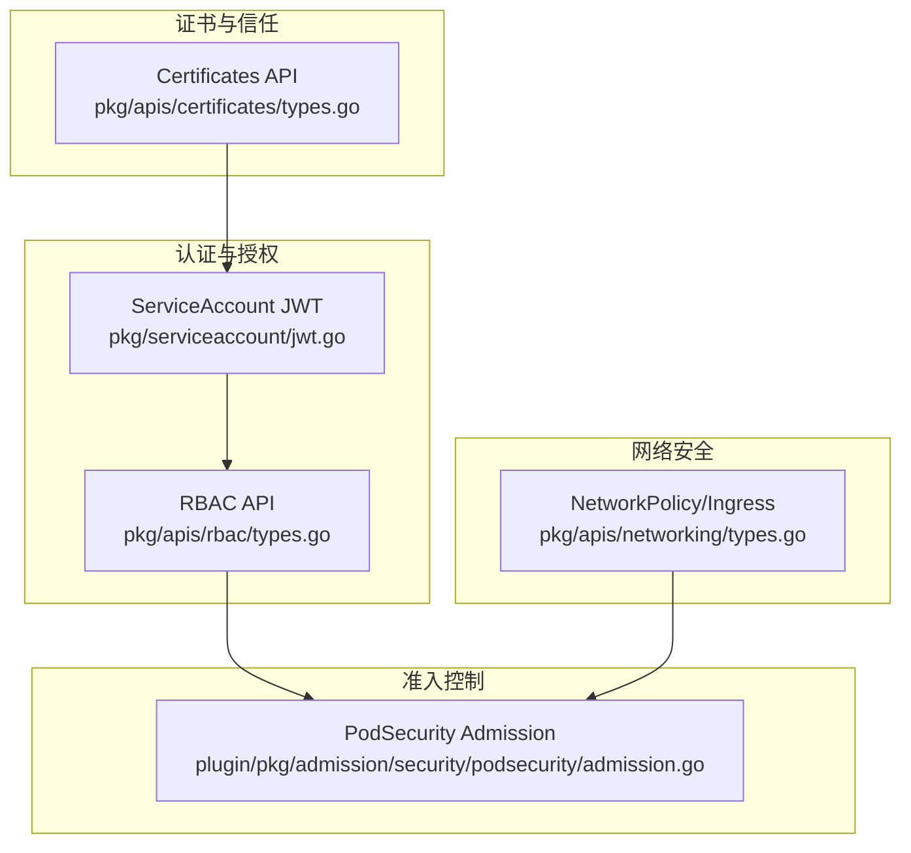
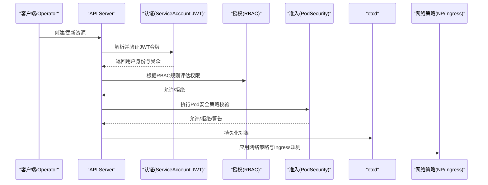
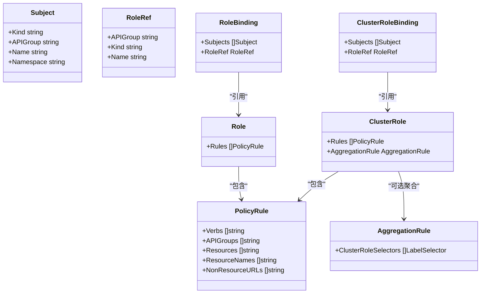
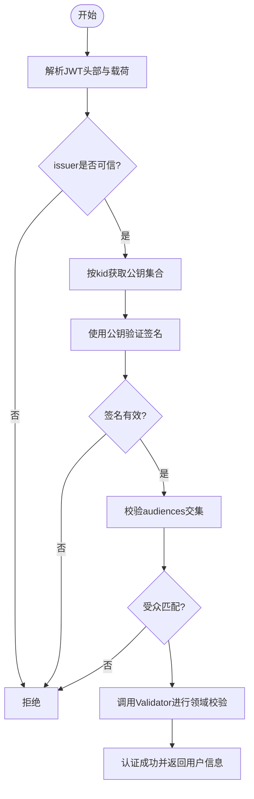
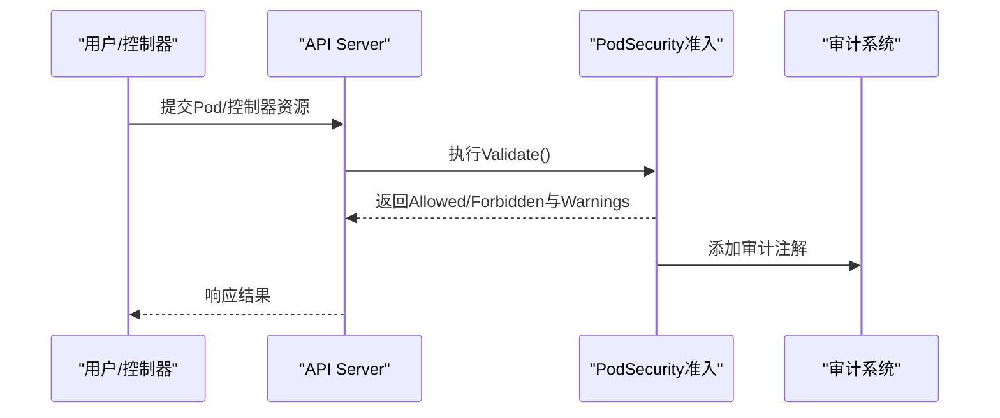
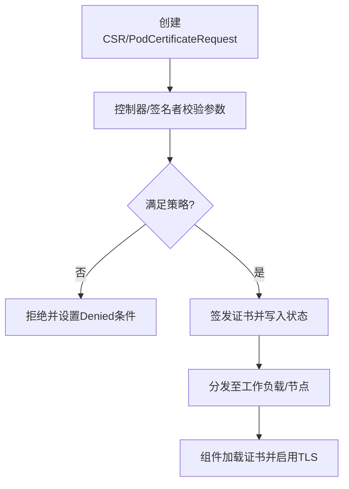
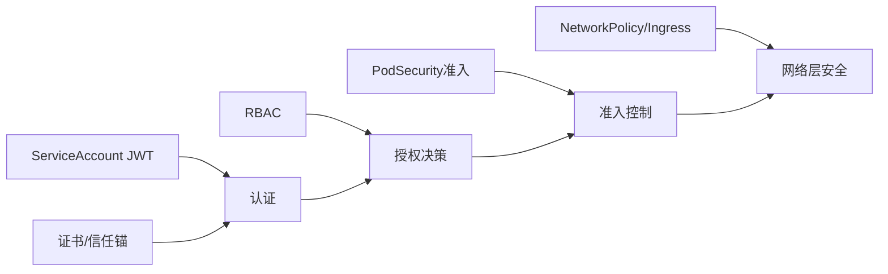

# 安全加固

<cite>
**本文引用的文件**   
- [pkg/apis/rbac/types.go](file://pkg/apis/rbac/types.go)
- [plugin/pkg/admission/security/podsecurity/admission.go](file://plugin/pkg/admission/security/podsecurity/admission.go)
- [pkg/apis/certificates/types.go](file://pkg/apis/certificates/types.go)
- [pkg/serviceaccount/jwt.go](file://pkg/serviceaccount/jwt.go)
- [pkg/apis/networking/types.go](file://pkg/apis/networking/types.go)
</cite>

## 目录
1. [简介](#简介)
2. [项目结构](#项目结构)
3. [核心组件](#核心组件)
4. [架构总览](#架构总览)
5. [详细组件分析](#详细组件分析)
6. [依赖关系分析](#依赖关系分析)
7. [性能考虑](#性能考虑)
8. [故障排查指南](#故障排查指南)
9. [结论](#结论)
10. [附录](#附录)

## 简介
本技术文档面向Kubernetes Operator的安全加固，围绕以下关键主题展开：
- RBAC权限最小化原则与角色配置
- ServiceAccount安全配置与令牌管理
- 网络策略与Pod安全标准的实施
- 证书管理与TLS通信安全
- 敏感信息加密存储与传输保护
- 安全审计与合规性检查
- 安全漏洞扫描与修复最佳实践

文档基于仓库中的API定义、准入控制插件、服务账户令牌处理、证书模型等源码进行解读，并提供可视化图示帮助理解。

## 项目结构
与安全相关的核心代码分布在如下位置：
- RBAC API类型定义：pkg/apis/rbac/types.go
- Pod安全标准准入插件：plugin/pkg/admission/security/podsecurity/admission.go
- 证书相关API（CSR、ClusterTrustBundle、PodCertificateRequest）：pkg/apis/certificates/types.go
- 服务账户JWT令牌生成与验证：pkg/serviceaccount/jwt.go
- 网络策略API（NetworkPolicy、Ingress等）：pkg/apis/networking/types.go

**图表来源** 
- [pkg/apis/rbac/types.go:1-211](file://pkg/apis/rbac/types.go#L1-L211)
- [plugin/pkg/admission/security/podsecurity/admission.go:1-300](file://plugin/pkg/admission/security/podsecurity/admission.go#L1-L300)
- [pkg/apis/certificates/types.go:1-549](file://pkg/apis/certificates/types.go#L1-L549)
- [pkg/serviceaccount/jwt.go:1-453](file://pkg/serviceaccount/jwt.go#L1-L453)
- [pkg/apis/networking/types.go:1-696](file://pkg/apis/networking/types.go#L1-L696)

**章节来源**
- [pkg/apis/rbac/types.go:1-211](file://pkg/apis/rbac/types.go#L1-L211)
- [plugin/pkg/admission/security/podsecurity/admission.go:1-300](file://plugin/pkg/admission/security/podsecurity/admission.go#L1-L300)
- [pkg/apis/certificates/types.go:1-549](file://pkg/apis/certificates/types.go#L1-L549)
- [pkg/serviceaccount/jwt.go:1-453](file://pkg/serviceaccount/jwt.go#L1-L453)
- [pkg/apis/networking/types.go:1-696](file://pkg/apis/networking/types.go#L1-L696)

## 核心组件
- RBAC模型：Role、ClusterRole、RoleBinding、ClusterRoleBinding、PolicyRule、Subject、RoleRef等，用于实现细粒度访问控制。
- Pod安全准入：通过准入插件对Pod及相关控制器资源执行安全策略校验，支持命名空间级默认策略与警告/拒绝行为。
- 证书体系：支持CSR、ClusterTrustBundle、PodCertificateRequest等，提供受控的证书签发与信任锚分发。
- ServiceAccount令牌：基于JWT的令牌生成与验证，支持多算法签名、密钥轮换、受众校验与审计标注。
- 网络策略：NetworkPolicy与Ingress定义入站/出站流量控制与外部入口路由，结合TLS终止实现传输层安全。

**章节来源**
- [pkg/apis/rbac/types.go:43-211](file://pkg/apis/rbac/types.go#L43-L211)
- [plugin/pkg/admission/security/podsecurity/admission.go:68-233](file://plugin/pkg/admission/security/podsecurity/admission.go#L68-L233)
- [pkg/apis/certificates/types.go:28-549](file://pkg/apis/certificates/types.go#L28-L549)
- [pkg/serviceaccount/jwt.go:41-453](file://pkg/serviceaccount/jwt.go#L41-L453)
- [pkg/apis/networking/types.go:27-696](file://pkg/apis/networking/types.go#L27-L696)

## 架构总览
下图展示Operator在集群中涉及的关键安全路径：从用户或工作负载发起请求，经过认证（ServiceAccount JWT）、授权（RBAC）、准入控制（PodSecurity），再到存储与网络策略的执行。

**图表来源** 
- [pkg/serviceaccount/jwt.go:227-412](file://pkg/serviceaccount/jwt.go#L227-L412)
- [pkg/apis/rbac/types.go:94-211](file://pkg/apis/rbac/types.go#L94-L211)
- [plugin/pkg/admission/security/podsecurity/admission.go:193-233](file://plugin/pkg/admission/security/podsecurity/admission.go#L193-L233)
- [pkg/apis/networking/types.go:27-209](file://pkg/apis/networking/types.go#L27-L209)

## 详细组件分析

### RBAC权限最小化与角色配置
- 最小权限原则：为每个Operator组件或服务账户仅授予必要的API组、资源与动词；避免使用通配符“*”。
- 作用域控制：优先使用命名空间级别的Role与RoleBinding，仅在必要时使用ClusterRole与ClusterRoleBinding。
- 聚合能力：利用AggregationRule将多个ClusterRole的规则聚合到单一ClusterRole，便于集中治理与审计。
- 非资源URL：对于非资源URL路径，仅在ClusterRoleBinding中使用NonResourceURLs字段精确限定。

**图表来源** 
- [pkg/apis/rbac/types.go:43-211](file://pkg/apis/rbac/types.go#L43-L211)

**章节来源**
- [pkg/apis/rbac/types.go:43-211](file://pkg/apis/rbac/types.go#L43-L211)

### ServiceAccount安全配置与令牌管理
- 令牌生成：支持RSA与ECDSA签名算法，通过JWK封装私钥并生成Key ID，便于多密钥轮换与快速选择。
- 令牌验证：按kid匹配公钥集合，校验issuer与audiences，支持隐式受众兼容旧令牌，并在审计中标注legacy-token。
- 受众控制：严格限制token audiences与目标受众交集，防止跨受众越权访问。
- 密钥管理：建议将私钥置于受控HSM或外部签名器，公开密钥通过OIDC发现端点动态获取，缩短缓存时间以加速轮换。

**图表来源** 
- [pkg/serviceaccount/jwt.go:227-412](file://pkg/serviceaccount/jwt.go#L227-L412)

**章节来源**
- [pkg/serviceaccount/jwt.go:59-213](file://pkg/serviceaccount/jwt.go#L59-L213)
- [pkg/serviceaccount/jwt.go:227-412](file://pkg/serviceaccount/jwt.go#L227-L412)

### 网络策略与Pod安全标准
- 网络策略：通过NetworkPolicy的Ingress/Egress规则限制Pod间通信，结合IPBlock与端口范围实现精细化控制。
- Ingress与TLS：Ingress可配置TLS Secret，由Ingress Controller终止TLS并按SNI路由，确保外部访问加密。
- Pod安全准入：PodSecurity准入插件对Pod及控制器资源执行策略校验，支持命名空间级默认策略与警告/拒绝行为，并将审计注解附加到请求上下文。

**图表来源** 
- [plugin/pkg/admission/security/podsecurity/admission.go:193-233](file://plugin/pkg/admission/security/podsecurity/admission.go#L193-L233)
- [pkg/apis/networking/types.go:27-209](file://pkg/apis/networking/types.go#L27-L209)

**章节来源**
- [plugin/pkg/admission/security/podsecurity/admission.go:100-233](file://plugin/pkg/admission/security/podsecurity/admission.go#L100-L233)
- [pkg/apis/networking/types.go:27-209](file://pkg/apis/networking/types.go#L27-L209)

### 证书管理与TLS通信
- CSR流程：通过CertificateSigningRequest指定signerName、usages与expirationSeconds，控制器自动审批或人工审批后签发证书。
- 信任锚分发：ClusterTrustBundle承载X.509信任锚，供Kubelet等组件消费，支持按signerName关联多套信任锚。
- Pod证书：PodCertificateRequest支持短生命周期证书，kubelet负责证明拥有私钥并请求证书，适合微服务mTLS场景。

**图表来源** 
- [pkg/apis/certificates/types.go:28-183](file://pkg/apis/certificates/types.go#L28-L183)
- [pkg/apis/certificates/types.go:231-283](file://pkg/apis/certificates/types.go#L231-L283)
- [pkg/apis/certificates/types.go:287-487](file://pkg/apis/certificates/types.go#L287-L487)

**章节来源**
- [pkg/apis/certificates/types.go:28-183](file://pkg/apis/certificates/types.go#L28-L183)
- [pkg/apis/certificates/types.go:231-283](file://pkg/apis/certificates/types.go#L231-L283)
- [pkg/apis/certificates/types.go:287-487](file://pkg/apis/certificates/types.go#L287-L487)

### 敏感信息加密存储与传输保护
- 存储加密：Secret对象应配合etcd静态加密与KMS集成，确保敏感数据落盘加密。
- 传输加密：所有API Server与组件间通信强制TLS，Ingress使用TLS Secret终止外部HTTPS。
- 令牌与证书：ServiceAccount令牌采用强签名算法与短期有效期；证书通过CSR与PodCertificateRequest受控签发，避免硬编码密钥。

[本节为通用指导，不直接分析具体文件]

### 安全审计与合规性检查
- 审计注解：PodSecurity准入插件将审计注解注入请求上下文，便于后续审计日志采集与分析。
- 受众与受众交集：JWT验证阶段记录legacy-token审计注解，辅助识别旧令牌使用情况。
- 策略告警：PodSecurity准入支持Warning模式，在不阻断业务的前提下提示潜在风险。

**章节来源**
- [plugin/pkg/admission/security/podsecurity/admission.go:203-211](file://plugin/pkg/admission/security/podsecurity/admission.go#L203-L211)
- [pkg/serviceaccount/jwt.go:382-388](file://pkg/serviceaccount/jwt.go#L382-L388)

### 安全漏洞扫描与修复最佳实践
- 镜像与依赖：定期扫描容器镜像与Go依赖，修复已知CVE；固定版本并建立白名单。
- 配置基线：遵循PodSecurity标准与NetworkPolicy默认拒绝策略，逐步放宽。
- 密钥轮换：定期轮换ServiceAccount签名私钥与证书CA，缩短缓存时间，确保快速生效。
- 变更评审：所有RBAC与准入策略变更需经安全评审与回归测试，保留审计轨迹。

[本节为通用指导，不直接分析具体文件]

## 依赖关系分析
- RBAC与准入：RBAC决定API访问权限，准入插件进一步约束资源形态与安全性。
- 令牌与证书：ServiceAccount令牌与证书共同构成身份与信任基础，影响认证与授权链路。
- 网络策略与Ingress：在网络层保障工作负载隔离与外部访问安全，与准入策略形成纵深防御。

**图表来源** 
- [pkg/apis/rbac/types.go:94-211](file://pkg/apis/rbac/types.go#L94-L211)
- [pkg/serviceaccount/jwt.go:227-412](file://pkg/serviceaccount/jwt.go#L227-L412)
- [pkg/apis/certificates/types.go:28-549](file://pkg/apis/certificates/types.go#L28-L549)
- [plugin/pkg/admission/security/podsecurity/admission.go:193-233](file://plugin/pkg/admission/security/podsecurity/admission.go#L193-L233)
- [pkg/apis/networking/types.go:27-209](file://pkg/apis/networking/types.go#L27-L209)

**章节来源**
- [pkg/apis/rbac/types.go:94-211](file://pkg/apis/rbac/types.go#L94-L211)
- [pkg/serviceaccount/jwt.go:227-412](file://pkg/serviceaccount/jwt.go#L227-L412)
- [pkg/apis/certificates/types.go:28-549](file://pkg/apis/certificates/types.go#L28-L549)
- [plugin/pkg/admission/security/podsecurity/admission.go:193-233](file://plugin/pkg/admission/security/podsecurity/admission.go#L193-L233)
- [pkg/apis/networking/types.go:27-209](file://pkg/apis/networking/types.go#L27-L209)

## 性能考虑
- 令牌验证：合理设置公钥缓存时间与过期策略，减少频繁密钥拉取开销。
- 准入控制：PodSecurity策略评估应避免过度复杂的自定义逻辑，保持高效判定。
- 网络策略：精简NP规则数量与作用域，降低iptables/IPVS规则膨胀带来的性能影响。

[本节为通用指导，不直接分析具体文件]

## 故障排查指南
- 认证失败：检查JWT issuer、audiences与签名有效性，确认公钥可用且kid匹配。
- 授权拒绝：核对RBAC规则是否覆盖所需API组、资源与动词，避免通配符滥用导致误判。
- 准入拦截：查看PodSecurity准入返回的警告与错误信息，调整命名空间策略或资源规格。
- 证书问题：确认CSR参数与signerName策略一致，检查ClusterTrustBundle是否正确分发。

**章节来源**
- [pkg/serviceaccount/jwt.go:334-412](file://pkg/serviceaccount/jwt.go#L334-L412)
- [plugin/pkg/admission/security/podsecurity/admission.go:212-233](file://plugin/pkg/admission/security/podsecurity/admission.go#L212-L233)
- [pkg/apis/certificates/types.go:144-183](file://pkg/apis/certificates/types.go#L144-L183)

## 结论
通过对RBAC、ServiceAccount令牌、Pod安全准入、证书与网络策略的系统性分析与实践建议，Operator可在认证、授权、准入与网络层面构建纵深防御体系。结合严格的密钥与证书管理、持续的审计与合规检查以及常态化的漏洞扫描与修复，可有效提升集群整体安全水位。

[本节为总结，不直接分析具体文件]

## 附录
- 术语说明：
  - RBAC：基于角色的访问控制
  - PSA：Pod安全准入
  - CSR：证书签名请求
  - CTB：集群信任束
  - JWT：JSON Web Token

[本节为补充说明，不直接分析具体文件]