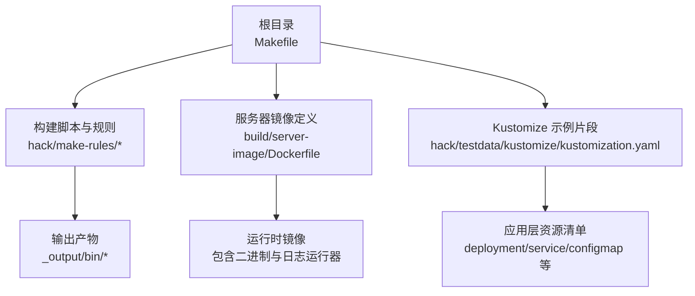
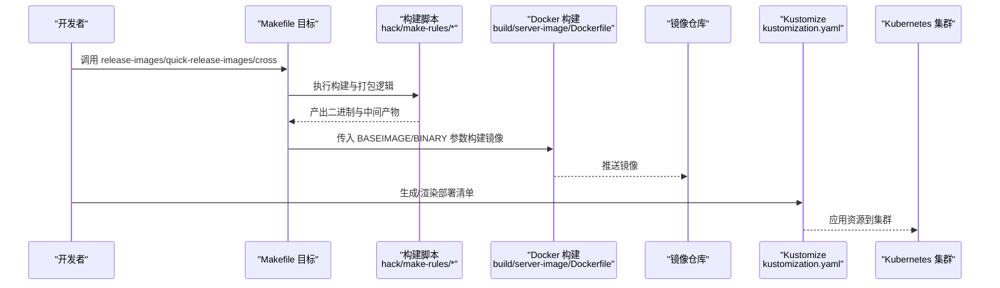
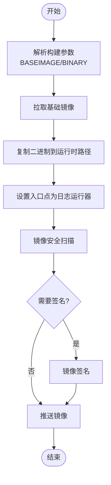
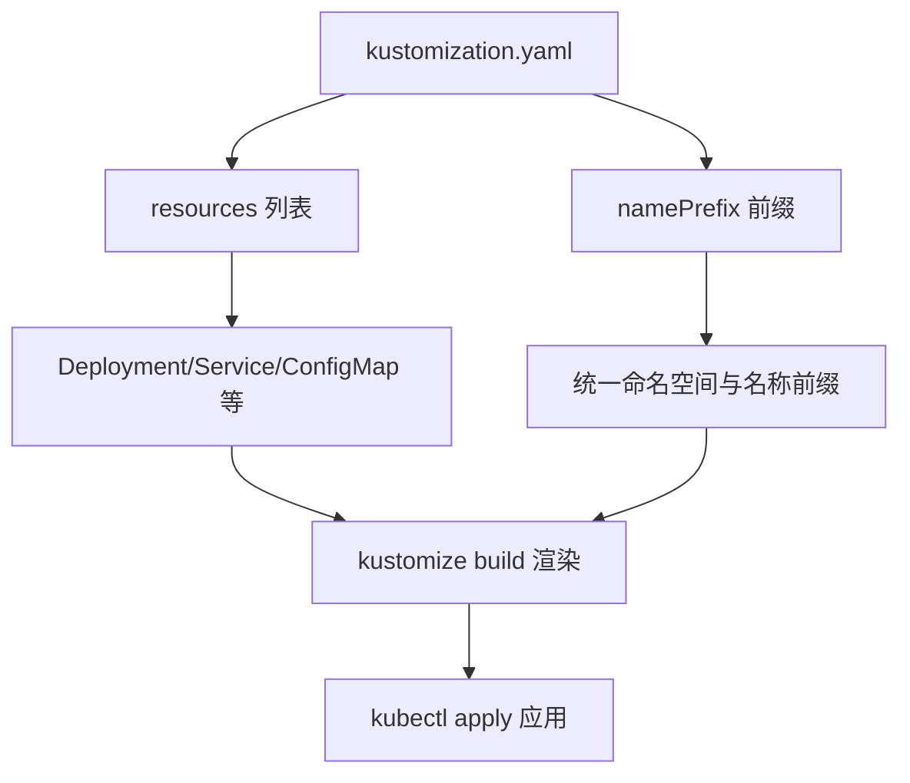
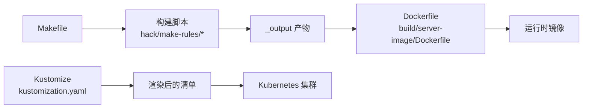

# 容器化与打包

<cite>
**本文引用的文件**   
- [Makefile](file://Makefile)
- [server-image/Dockerfile](file://build/server-image/Dockerfile)
- [kustomization.yaml](file://hack/testdata/kustomize/kustomization.yaml)
</cite>

## 目录
1. [简介](#简介)
2. [项目结构](#项目结构)
3. [核心组件](#核心组件)
4. [架构总览](#架构总览)
5. [详细组件分析](#详细组件分析)
6. [依赖分析](#依赖分析)
7. [性能考虑](#性能考虑)
8. [故障排查指南](#故障排查指南)
9. [结论](#结论)
10. [附录](#附录) 

## 简介
本文件面向在 Kubernetes 生态中构建、打包与发布 Operator 的工程师，聚焦以下目标：
- 镜像构建流程与优化（多阶段构建、基础镜像选择、可执行产物注入）
- 镜像安全扫描与签名验证策略
- Helm Chart 编写规范（Chart.yaml、values 模板、依赖管理）
- Kustomize 配置管理方法
- 镜像推送与版本管理策略
- CI/CD 集成方案与最佳实践

说明：仓库未包含完整的 Operator 示例或 Helm/Kustomize 完整工程，但提供了镜像构建相关的关键工件与 Makefile 入口。本文基于仓库现有内容进行分析，并结合通用最佳实践给出可操作的指导。

## 项目结构
与容器化与打包直接相关的顶层工件包括：
- 根级 Makefile：统一构建、测试、发布等目标的入口
- build/server-image/Dockerfile：控制面二进制镜像的基础封装方式
- hack/testdata/kustomize/kustomization.yaml：Kustomize 示例片段，展示资源前缀与资源列表的组织方式

图示来源
- [Makefile:1-517](file://Makefile#L1-L517)
- [server-image/Dockerfile:1-26](file://build/server-image/Dockerfile#L1-L26)
- [kustomization.yaml:1-6](file://hack/testdata/kustomize/kustomization.yaml#L1-L6)

章节来源
- [Makefile:1-517](file://Makefile#L1-L517)
- [server-image/Dockerfile:1-26](file://build/server-image/Dockerfile#L1-L26)
- [kustomization.yaml:1-6](file://hack/testdata/kustomize/kustomization.yaml#L1-L6)

## 核心组件
- 构建入口与目标
  - 提供 all、release、release-images、quick-release-images、cross 等目标，用于编译、打包与跨平台构建
  - 通过环境变量控制是否构建 conformance 镜像、是否快速构建、是否跳过测试等
- 服务器镜像封装
  - 使用参数化基础镜像与二进制名称，将二进制复制到 /usr/local/bin，并设置入口点为日志运行器以兼容 go-runner
- Kustomize 组织
  - 通过 nameprefix 与 resources 声明资源列表，便于在不同环境进行命名空间与名称前缀的统一替换

章节来源
- [Makefile:345-438](file://Makefile#L345-L438)
- [server-image/Dockerfile:17-26](file://build/server-image/Dockerfile#L17-L26)
- [kustomization.yaml:1-6](file://hack/testdata/kustomize/kustomization.yaml#L1-L6)

## 架构总览
下图展示了从源码到镜像与部署产物的端到端流程，以及 Kustomize 在部署阶段的叠加与覆盖能力。

图示来源
- [Makefile:345-438](file://Makefile#L345-L438)
- [server-image/Dockerfile:17-26](file://build/server-image/Dockerfile#L17-L26)
- [kustomization.yaml:1-6](file://hack/testdata/kustomize/kustomization.yaml#L1-L6)

## 详细组件分析

### 镜像构建与多阶段优化
- 参数化基础镜像与二进制
  - 通过 ARG 注入 BASEIMAGE 与 BINARY，使同一 Dockerfile 可复用至不同组件
  - 将二进制拷贝至标准路径，并以日志运行器作为 ENTRYPOINT，保证日志采集与兼容性
- 多阶段构建建议
  - 建议在构建阶段完成依赖安装与二进制编译，在最终镜像仅保留运行时所需文件，从而减小镜像体积、降低攻击面
  - 结合只读文件系统与非 root 用户运行，提升安全性
- 镜像安全扫描
  - 在 CI 中集成漏洞扫描工具，对基础镜像与依赖进行定期扫描，阻断高危漏洞合并与发布
  - 建立基线策略，如禁止已知高危 CVE、限制包管理器缓存残留等

图示来源
- [server-image/Dockerfile:17-26](file://build/server-image/Dockerfile#L17-L26)

章节来源
- [server-image/Dockerfile:17-26](file://build/server-image/Dockerfile#L17-L26)

### Helm Chart 编写规范
- Chart.yaml
  - 必须字段：apiVersion、name、version；推荐添加 description、type、maintainers、sources、icon 等元数据
  - 版本策略：遵循语义化版本，变更类型对应主/次/补丁版本升级
- values 模板
  - 将可变配置抽离至 values.yaml，并在 templates 中使用变量引用
  - 提供默认值与环境覆盖机制，支持按环境拆分 values 文件
- 依赖管理
  - 使用 dependencies 声明子 Chart，并通过 requirements.yaml 或 Chart.yaml 的 dependencies 字段管理版本约束
  - 在 CI 中执行 helm dependency update 确保依赖锁定与可重现构建
- 安全与合规
  - 避免硬编码敏感信息，使用 Secret 或外部密钥管理服务
  - 启用 PodSecurityPolicy/SecurityContext 等安全上下文，最小权限原则

[本节为通用规范说明，不直接分析具体文件]

### Kustomize 配置管理方法
- 基本组织
  - 使用 kustomization.yaml 声明 resources、namePrefix、namespace、patchesStrategicMerge 等
  - 通过 overlays 对不同环境进行差异化配置
- 示例片段
  - 当前仓库中的示例展示了 nameprefix 与 resources 的使用方式，适合在多环境中统一前缀与资源集合

图示来源
- [kustomization.yaml:1-6](file://hack/testdata/kustomize/kustomization.yaml#L1-L6)

章节来源
- [kustomization.yaml:1-6](file://hack/testdata/kustomize/kustomization.yaml#L1-L6)

### 镜像推送与版本管理策略
- 版本标签
  - 使用语义化版本标签（vX.Y.Z），并为每个发行版打稳定标签
  - 开发分支使用 commit SHA 或短哈希作为唯一标识，便于追溯
- 推送策略
  - 在受控的 CI 流水线中执行镜像推送，避免本地直推
  - 使用镜像摘要（digest）记录精确版本，配合签名与校验链
- 签名与验证
  - 采用 cosign 或类似工具对镜像进行签名，并在节点侧或准入策略中校验签名
  - 将签名与 SBOM 一同归档，满足审计与合规要求

[本节为通用策略说明，不直接分析具体文件]

### CI/CD 集成方案
- 触发条件
  - 代码提交、Pull Request、Tag 事件分别触发不同的流水线（构建、扫描、发布）
- 关键步骤
  - 构建：调用 make release-images 或 quick-release-images
  - 扫描：执行镜像漏洞扫描与安全基线检查
  - 签名：对镜像进行签名并上传签名与 SBOM
  - 推送：推送至企业镜像仓库，并记录镜像 digest
  - 部署：使用 Kustomize 渲染清单并应用到目标集群
- 回滚与可观测性
  - 保留历史镜像与清单，支持一键回滚
  - 收集构建与部署指标，纳入监控告警体系

[本节为通用方案说明，不直接分析具体文件]

## 依赖分析
- 构建依赖
  - Makefile 通过 hack/make-rules 下的脚本组织构建、测试与发布流程
  - 镜像构建依赖基础镜像与二进制产物，二者由上游构建阶段产出
- 部署依赖
  - Kustomize 依赖资源清单与 overlay 配置，渲染后由 kubectl 应用

图示来源
- [Makefile:1-517](file://Makefile#L1-L517)
- [server-image/Dockerfile:17-26](file://build/server-image/Dockerfile#L17-L26)
- [kustomization.yaml:1-6](file://hack/testdata/kustomize/kustomization.yaml#L1-L6)

章节来源
- [Makefile:1-517](file://Makefile#L1-L517)
- [server-image/Dockerfile:17-26](file://build/server-image/Dockerfile#L17-L26)
- [kustomization.yaml:1-6](file://hack/testdata/kustomize/kustomization.yaml#L1-L6)

## 性能考虑
- 构建性能
  - 利用并行构建与增量缓存，减少重复编译时间
  - 合理划分构建阶段，避免在最终镜像中携带构建工具链
- 镜像体积
  - 精简基础镜像，移除不必要的包与缓存
  - 使用静态链接与裁剪调试符号，减小二进制体积
- 部署效率
  - 使用 Kustomize 的 overlays 与 patch 机制，避免重复定义
  - 预拉取常用镜像，缩短启动时延

[本节为通用指导，不直接分析具体文件]

## 故障排查指南
- 构建失败
  - 检查 Makefile 目标与参数是否正确传递
  - 确认基础镜像可达且版本兼容
- 镜像扫描失败
  - 查看扫描报告，定位高危漏洞并评估风险
  - 更新基础镜像或依赖版本，重新构建与扫描
- 部署异常
  - 使用 kustomize build 输出渲染结果，核对资源配置
  - 检查 RBAC、网络策略与存储类是否就绪

[本节为通用指导，不直接分析具体文件]

## 结论
通过对仓库中与容器化与打包相关的核心工件进行分析，可以形成一套从构建、扫描、签名到部署的完整闭环。结合 Helm 与 Kustomize 的配置管理能力，能够高效地实现 Operator 的多环境交付与版本治理。建议在 CI/CD 中固化这些流程，并持续改进安全与性能指标。

[本节为总结性内容，不直接分析具体文件]

## 附录
- 参考目标与变量
  - release-images、quick-release-images、cross 等目标用于镜像构建与跨平台构建
  - 环境变量如 DBG、KUBE_FASTBUILD、KUBE_BUILD_CONFORMANCE 影响构建行为
- 示例路径
  - 服务器镜像定义位于 build/server-image/Dockerfile
  - Kustomize 示例片段位于 hack/testdata/kustomize/kustomization.yaml

章节来源
- [Makefile:345-438](file://Makefile#L345-L438)
- [server-image/Dockerfile:17-26](file://build/server-image/Dockerfile#L17-L26)
- [kustomization.yaml:1-6](file://hack/testdata/kustomize/kustomization.yaml#L1-L6)