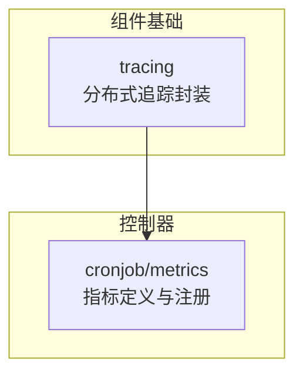
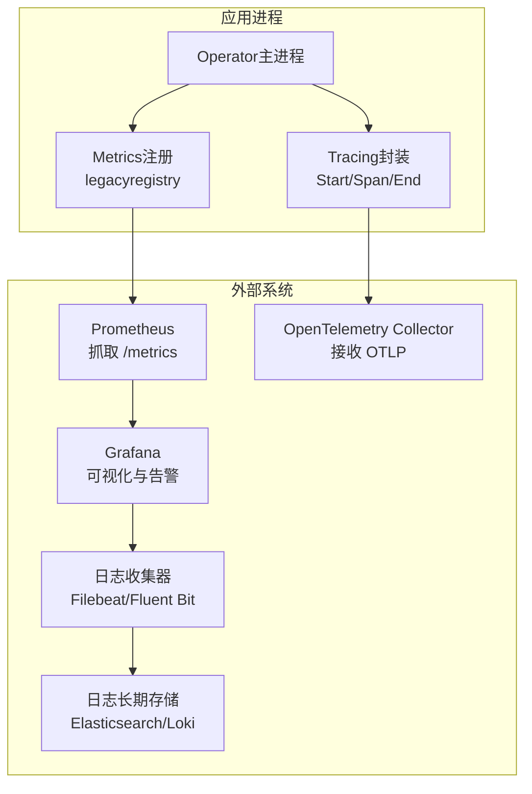
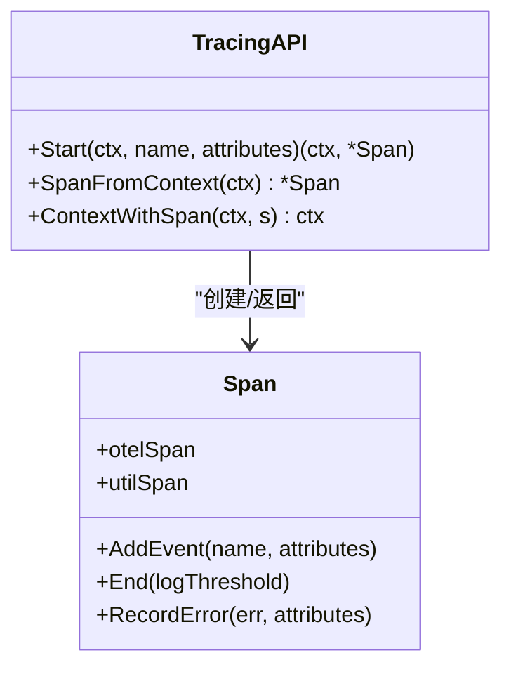
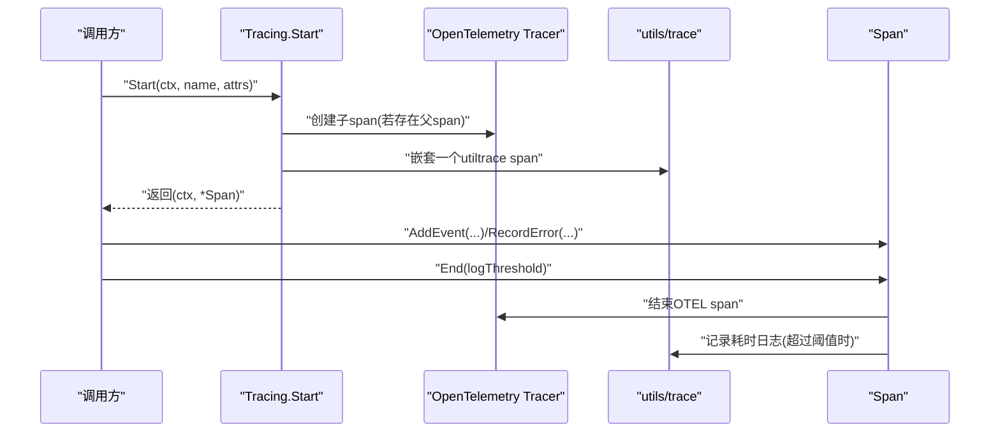
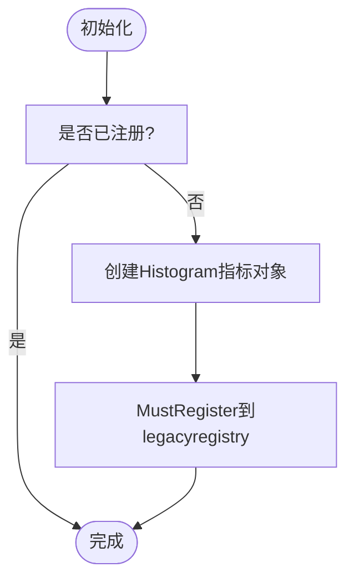
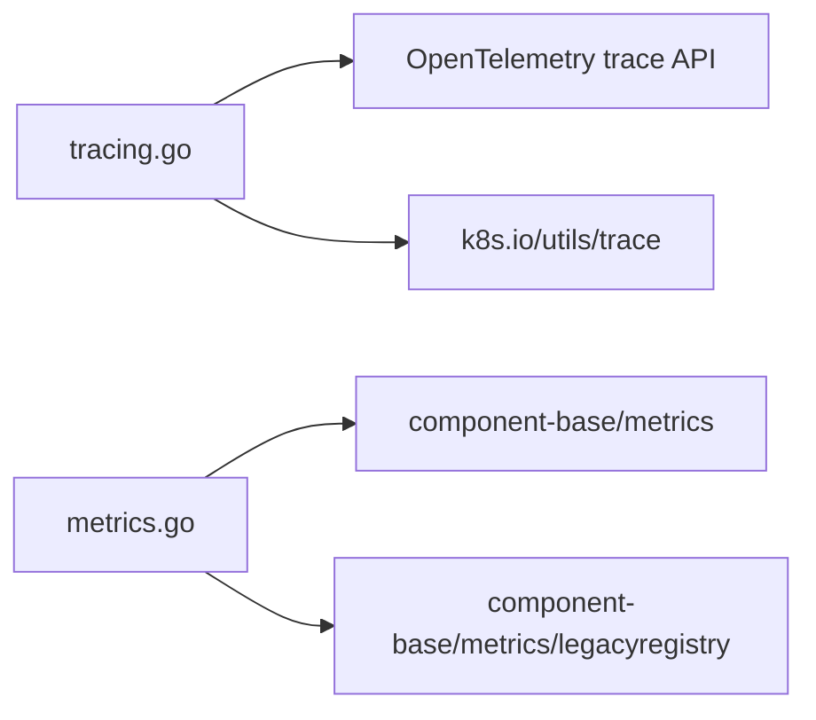

# 监控与日志

<cite>
**本文引用的文件**   
- [tracing.go](file://staging/src/k8s.io/component-base/tracing/tracing.go)
- [metrics.go](file://pkg/controller/cronjob/metrics/metrics.go)
</cite>

## 目录
1. [简介](#简介)
2. [项目结构](#项目结构)
3. [核心组件](#核心组件)
4. [架构总览](#架构总览)
5. [详细组件分析](#详细组件分析)
6. [依赖关系分析](#依赖关系分析)
7. [性能考量](#性能考量)
8. [故障诊断指南](#故障诊断指南)
9. [结论](#结论)
10. [附录](#附录)

## 简介
本文件面向Kubernetes Operator的“监控与日志”能力，聚焦以下目标：
- Prometheus指标暴露与自定义指标定义
- 结构化日志格式与日志级别控制
- 分布式追踪与性能分析工具集成
- Grafana仪表板配置与告警规则设置
- 日志收集、聚合与长期存储方案
- 关键业务指标的监控与告警策略
- 监控数据分析与故障诊断方法

说明：仓库中提供了分布式追踪的基础实现与控制器侧指标注册示例。本文将基于这些代码进行技术解读，并给出可落地的最佳实践建议。

## 项目结构
围绕监控与日志的相关代码主要分布在：
- 分布式追踪：staging/src/k8s.io/component-base/tracing
- 控制器指标示例：pkg/controller/cronjob/metrics

图表来源
- [tracing.go:1-99](file://staging/src/k8s.io/component-base/tracing/tracing.go#L1-L99)
- [metrics.go:1-48](file://pkg/controller/cronjob/metrics/metrics.go#L1-L48)

章节来源
- [tracing.go:1-99](file://staging/src/k8s.io/component-base/tracing/tracing.go#L1-L99)
- [metrics.go:1-48](file://pkg/controller/cronjob/metrics/metrics.go#L1-L48)

## 核心组件
- 分布式追踪封装
  - 提供统一的Start/Span/End接口，同时桥接OpenTelemetry与k8s.io/utils/trace，便于迁移与兼容。
  - 支持事件记录、错误上报、上下文传播等。
- 控制器指标
  - 通过component-base metrics库创建指标，并使用legacyregistry进行统一注册，供Prometheus抓取。

章节来源
- [tracing.go:1-99](file://staging/src/k8s.io/component-base/tracing/tracing.go#L1-L99)
- [metrics.go:1-48](file://pkg/controller/cronjob/metrics/metrics.go#L1-L48)

## 架构总览
下图展示了Operator在运行期如何暴露指标、采集追踪数据，并与外部系统交互的整体流程。

[此图为概念性架构图，不直接映射具体源码文件]

## 详细组件分析

### 分布式追踪组件（Tracing）
该组件为跨组件的链路追踪提供统一入口，既兼容OpenTelemetry，也兼容k8s.io/utils/trace，便于逐步迁移。

图表来源
- [tracing.go:31-99](file://staging/src/k8s.io/component-base/tracing/tracing.go#L31-L99)

时序：一次典型请求的追踪生命周期

图表来源
- [tracing.go:31-69](file://staging/src/k8s.io/component-base/tracing/tracing.go#L31-L69)

章节来源
- [tracing.go:1-99](file://staging/src/k8s.io/component-base/tracing/tracing.go#L1-L99)

### 控制器指标（CronJob Controller Metrics）
以CronJob控制器为例，展示如何定义与注册Prometheus指标。

图表来源
- [metrics.go:28-47](file://pkg/controller/cronjob/metrics/metrics.go#L28-L47)

章节来源
- [metrics.go:1-48](file://pkg/controller/cronjob/metrics/metrics.go#L1-L48)

## 依赖关系分析
- tracing.go
  - 依赖OpenTelemetry API（trace.Span、attribute.KeyValue）
  - 依赖k8s.io/utils/trace用于兼容层
- metrics.go
  - 依赖k8s.io/component-base/metrics定义指标类型
  - 依赖legacyregistry进行全局注册

图表来源
- [tracing.go:19-27](file://staging/src/k8s.io/component-base/tracing/tracing.go#L19-L27)
- [metrics.go:19-24](file://pkg/controller/cronjob/metrics/metrics.go#L19-L24)

章节来源
- [tracing.go:19-27](file://staging/src/k8s.io/component-base/tracing/tracing.go#L19-L27)
- [metrics.go:19-24](file://pkg/controller/cronjob/metrics/metrics.go#L19-L24)

## 性能考量
- 指标维度控制
  - 避免高基数标签；对高频路径使用直方图或计数器，减少内存与查询开销。
- 采样与阈值
  - 追踪端按需要开启采样；对长耗时操作设置logThreshold，仅在超限时输出，降低日志压力。
- 批量与异步
  - 将指标更新与日志写入尽量批量化、异步化，避免阻塞主流程。
- 资源隔离
  - 为监控与日志子系统预留资源配额，防止监控自身成为瓶颈。

[本节为通用指导，不直接分析具体文件]

## 故障诊断指南
- 指标异常定位
  - 确认指标是否已注册并被Prometheus抓取；检查指标命名、单位与标签是否符合规范。
  - 结合历史趋势与同比环比判断是否为瞬时抖动。
- 追踪断链排查
  - 检查上下文是否正确传递；确认Start/End成对出现，且未提前释放Span。
  - 利用AddEvent标记关键节点，辅助定位慢点与失败分支。
- 日志问题
  - 校验日志级别与过滤条件；确保结构化字段完整，便于检索与聚合。
  - 关注错误堆栈与关联ID，配合追踪ID快速串联多组件日志。

[本节为通用指导，不直接分析具体文件]

## 结论
- 通过统一的Tracing封装，可在保持兼容的同时平滑迁移至OpenTelemetry。
- 借助component-base metrics与legacyregistry，可标准化地暴露与控制指标。
- 结合Grafana与告警规则，可实现从指标到日志再到追踪的闭环观测。
- 建议在Operator中持续完善关键业务指标、结构化日志与分布式追踪，形成稳定可靠的运维体系。

[本节为总结性内容，不直接分析具体文件]

## 附录

### Prometheus指标暴露与自定义指标定义
- 指标类型选择
  - 计数器（Counter）：累计事件次数，如请求数、错误数。
  - 直方图（Histogram）：分布统计，如延迟分位、大小分布。
  - 摘要（Summary）：客户端计算分位数（谨慎使用，开销较高）。
  -  Gauge：当前值，如队列长度、缓存命中率。
- 命名与标签规范
  - 采用“子系统_名称”形式，明确单位与维度；避免高基数标签。
- 注册与抓取
  - 在组件初始化阶段完成注册；确保对外HTTP服务暴露/metrics端点。
- 参考实现
  - 控制器指标注册示例见：[metrics.go:28-47](file://pkg/controller/cronjob/metrics/metrics.go#L28-L47)

章节来源
- [metrics.go:28-47](file://pkg/controller/cronjob/metrics/metrics.go#L28-L47)

### 结构化日志格式与日志级别控制
- 结构化字段
  - 至少包含：时间戳、级别、消息、组件、实例、请求ID/追踪ID、关键业务键。
- 级别策略
  - 生产默认Info/Warn/Error；Debug仅用于排障开关。
- 输出与轮转
  - 输出JSON；按大小/时间轮转；保留周期与压缩策略需评估成本。
- 敏感信息
  - 脱敏处理，避免泄露密钥、令牌与个人信息。

[本节为通用指导，不直接分析具体文件]

### 分布式追踪与性能分析工具集成
- OpenTelemetry集成
  - 使用Tracing.Start创建Span，必要时添加事件与错误；End时根据阈值输出耗时日志。
  - 参考：[tracing.go:31-69](file://staging/src/k8s.io/component-base/tracing/tracing.go#L31-L69)
- 上下文传播
  - 使用ContextWithSpan/SpanFromContext在跨函数/跨进程边界传递追踪上下文。
  - 参考：[tracing.go:86-99](file://staging/src/k8s.io/component-base/tracing/tracing.go#L86-L99)
- 性能分析
  - 结合pprof/profile采集CPU/内存/阻塞等profile，定期导出与分析。

章节来源
- [tracing.go:31-69](file://staging/src/k8s.io/component-base/tracing/tracing.go#L31-L69)
- [tracing.go:86-99](file://staging/src/k8s.io/component-base/tracing/tracing.go#L86-L99)

### Grafana仪表板配置与告警规则设置
- 仪表板
  - 基于PromQL构建核心面板：QPS、错误率、P95/P99延迟、饱和度、资源使用率。
  - 增加追踪面板，关联Trace ID跳转至Jaeger/Tempo等后端。
- 告警规则
  - 错误率突增、延迟分位超标、资源饱和、背压信号等。
  - 合理设置静默窗口与抑制规则，避免告警风暴。
- 数据源
  - Prometheus作为指标数据源；可选接入日志与追踪数据源以便联动。

[本节为通用指导，不直接分析具体文件]

### 日志收集、聚合与长期存储方案
- 采集
  - DaemonSet方式在各节点采集容器stdout/stderr与应用日志文件。
- 传输
  - 使用轻量转发器（如Filebeat/Fluent Bit）汇聚到集中式存储或流式引擎。
- 存储
  - Elasticsearch/Loki等；按索引/标签分区，设置TTL与冷热分层。
- 治理
  - 限流与降级；大日志裁剪；关键字段抽取以提升查询效率。

[本节为通用指导，不直接分析具体文件]

### 关键业务指标的监控与告警策略
- 可用性
  - 健康检查成功率、重启次数、Pod就绪比例。
- 性能
  - 请求延迟分位、吞吐、队列积压、调度等待时长。
- 容量
  - CPU/内存/磁盘/网络使用率、配额剩余、节点资源碎片。
- 可靠性
  - 错误码分布、重试/退避触发次数、下游依赖超时。
- 告警分级
  - P0/P1/P2分级响应；结合Runbook与自动化处置。

[本节为通用指导，不直接分析具体文件]

### 监控数据的分析与故障诊断方法
- 指标分析
  - 对比基线与阈值；观察突变拐点与相关性；下钻到节点/副本/命名空间维度。
- 日志分析
  - 基于结构化字段检索；关联错误堆栈与上下文键；定位根因。
- 追踪分析
  - 沿Trace ID查看全链路耗时分布；识别热点与瓶颈；验证重试与熔断效果。
- 演练与复盘
  - 建立故障注入演练；沉淀常见模式与修复方案；持续优化指标与规则。

[本节为通用指导，不直接分析具体文件]