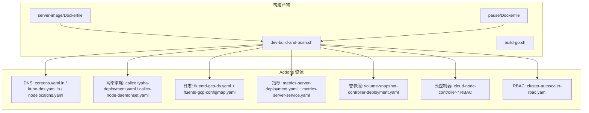
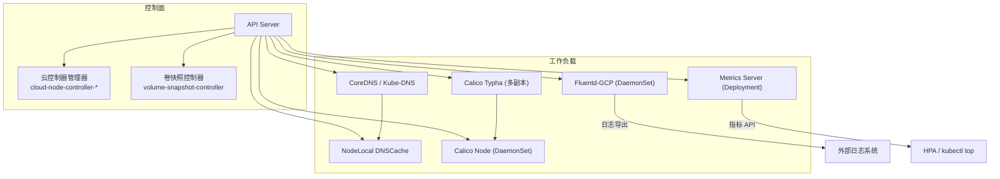
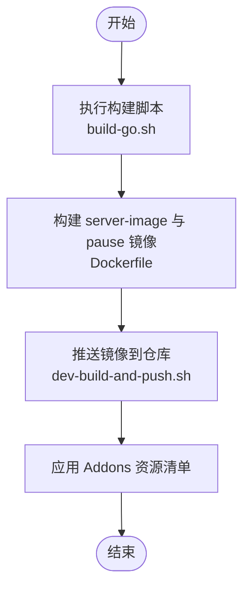
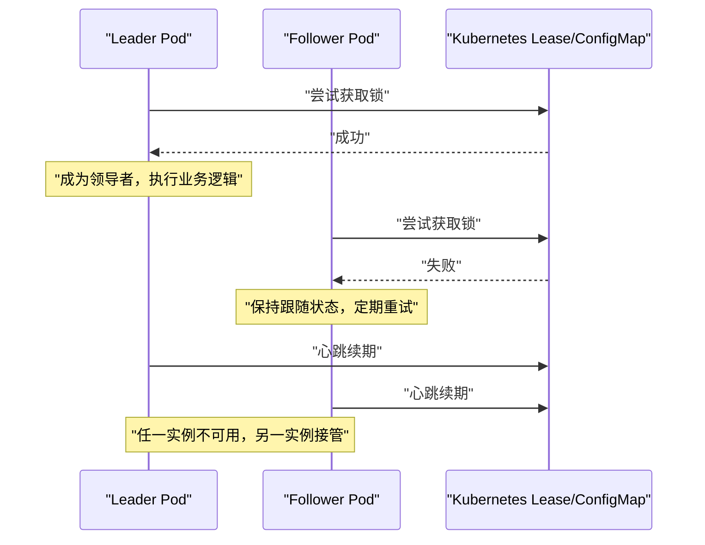
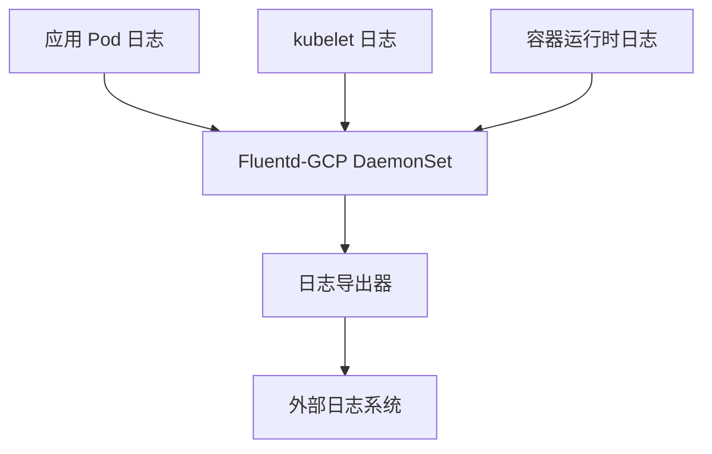
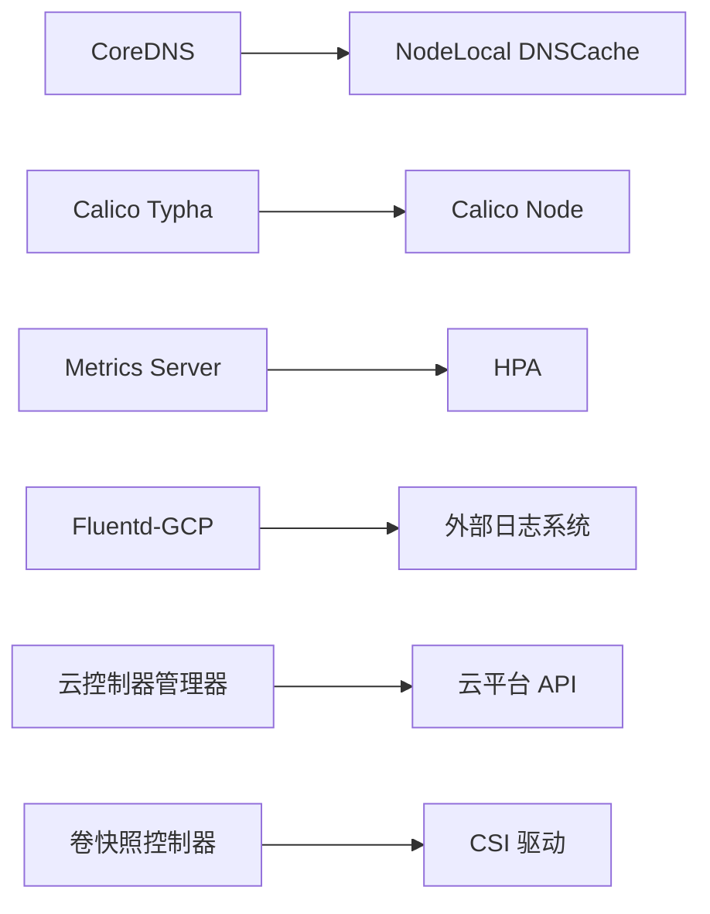

# 部署与管理

<cite>
**本文引用的文件**   
- [cluster/addons/README.md](file://cluster/addons/README.md)
- [cluster/addons/fluentd-gcp/README.md](file://cluster/addons/fluentd-gcp/README.md)
- [cluster/addons/metrics-server/README.md](file://cluster/addons/metrics-server/README.md)
- [cluster/addons/calico-policy-controller/typha-deployment.yaml](file://cluster/addons/calico-policy-controller/typha-deployment.yaml)
- [cluster/addons/calico-policy-controller/calico-node-daemonset.yaml](file://cluster/addons/calico-policy-controller/calico-node-daemonset.yaml)
- [cluster/addons/dns/coredns/coredns.yaml.in](file://cluster/addons/dns/coredns/coredns.yaml.in)
- [cluster/addons/dns/kube-dns/kube-dns.yaml.in](file://cluster/addons/dns/kube-dns/kube-dns.yaml.in)
- [cluster/addons/dns/nodelocaldns/nodelocaldns.yaml](file://cluster/addons/dns/nodelocaldns/nodelocaldns.yaml)
- [cluster/addons/fluentd-gcp/fluentd-gcp-ds.yaml](file://cluster/addons/fluentd-gcp/fluentd-gcp-ds.yaml)
- [cluster/addons/fluentd-gcp/fluentd-gcp-configmap.yaml](file://cluster/addons/fluentd-gcp/fluentd-gcp-configmap.yaml)
- [cluster/addons/metrics-server/metrics-server-deployment.yaml](file://cluster/addons/metrics-server/metrics-server-deployment.yaml)
- [cluster/addons/metrics-server/metrics-server-service.yaml](file://cluster/addons/metrics-server/metrics-server-service.yaml)
- [cluster/addons/volumesnapshots/volume-snapshot-controller/volume-snapshot-controller-deployment.yaml](file://cluster/addons/volumesnapshots/volume-snapshot-controller/volume-snapshot-controller-deployment.yaml)
- [cluster/addons/cloud-controller-manager/cloud-node-controller-binding.yaml](file://cluster/addons/cloud-controller-manager/cloud-node-controller-binding.yaml)
- [cluster/addons/cloud-controller-manager/cloud-node-controller-role.yaml](file://cluster/addons/cloud-controller-manager/cloud-node-controller-role.yaml)
- [cluster/addons/rbac/cluster-autoscaler/cluster-autoscaler-rbac.yaml](file://cluster/addons/rbac/cluster-autoscaler/cluster-autoscaler-rbac.yaml)
- [build/server-image/Dockerfile](file://build/server-image/Dockerfile)
- [build/pause/Dockerfile](file://build/pause/Dockerfile)
- [hack/dev-build-and-push.sh](file://hack/dev-build-and-push.sh)
- [hack/build-go.sh](file://hack/build-go.sh)
</cite>

## 目录
1. [简介](#简介)
2. [项目结构](#项目结构)
3. [核心组件](#核心组件)
4. [架构总览](#架构总览)
5. [详细组件分析](#详细组件分析)
6. [依赖关系分析](#依赖关系分析)
7. [性能考量](#性能考量)
8. [故障排查指南](#故障排查指南)
9. [结论](#结论)
10. [附录](#附录)

## 简介
本文件面向在 Kubernetes 集群中“以 Operator 模式”运行与运维控制面组件（如 DNS、网络策略控制器、卷快照控制器、云控制器管理器、指标采集等）的工程师，提供从容器化打包、镜像构建、Helm Chart 编写与发布策略、高可用与领导者选举、配置管理（ConfigMap/Secret）、日志与监控、升级回滚、安全加固到生产部署与运维监控的全链路技术文档。内容基于仓库内现有 Addons 资源定义与脚本进行归纳与提炼，确保可落地、可追溯。

## 项目结构
仓库中与“Operator 部署与管理”直接相关的资产主要位于 cluster/addons 与 build/hack 目录：
- cluster/addons：包含 DNS、网络策略控制器、日志采集、指标服务、卷快照控制器、云控制器管理等典型“类 Operator”组件的资源清单与说明。
- build：提供服务器镜像与 pause 镜像的 Dockerfile，用于构建控制面相关镜像。
- hack：提供本地开发构建与推送脚本，便于快速产出镜像并部署验证。

图表来源
- [build/server-image/Dockerfile](file://build/server-image/Dockerfile)
- [build/pause/Dockerfile](file://build/pause/Dockerfile)
- [hack/dev-build-and-push.sh](file://hack/dev-build-and-push.sh)
- [cluster/addons/dns/coredns/coredns.yaml.in](file://cluster/addons/dns/coredns/coredns.yaml.in)
- [cluster/addons/dns/kube-dns/kube-dns.yaml.in](file://cluster/addons/dns/kube-dns/kube-dns.yaml.in)
- [cluster/addons/dns/nodelocaldns/nodelocaldns.yaml](file://cluster/addons/dns/nodelocaldns/nodelocaldns.yaml)
- [cluster/addons/calico-policy-controller/typha-deployment.yaml](file://cluster/addons/calico-policy-controller/typha-deployment.yaml)
- [cluster/addons/calico-policy-controller/calico-node-daemonset.yaml](file://cluster/addons/calico-policy-controller/calico-node-daemonset.yaml)
- [cluster/addons/fluentd-gcp/fluentd-gcp-ds.yaml](file://cluster/addons/fluentd-gcp/fluentd-gcp-ds.yaml)
- [cluster/addons/fluentd-gcp/fluentd-gcp-configmap.yaml](file://cluster/addons/fluentd-gcp/fluentd-gcp-configmap.yaml)
- [cluster/addons/metrics-server/metrics-server-deployment.yaml](file://cluster/addons/metrics-server/metrics-server-deployment.yaml)
- [cluster/addons/metrics-server/metrics-server-service.yaml](file://cluster/addons/metrics-server/metrics-server-service.yaml)
- [cluster/addons/volumesnapshots/volume-snapshot-controller/volume-snapshot-controller-deployment.yaml](file://cluster/addons/volumesnapshots/volume-snapshot-controller/volume-snapshot-controller-deployment.yaml)
- [cluster/addons/cloud-controller-manager/cloud-node-controller-binding.yaml](file://cluster/addons/cloud-controller-manager/cloud-node-controller-binding.yaml)
- [cluster/addons/cloud-controller-manager/cloud-node-controller-role.yaml](file://cluster/addons/cloud-controller-manager/cloud-node-controller-role.yaml)
- [cluster/addons/rbac/cluster-autoscaler/cluster-autoscaler-rbac.yaml](file://cluster/addons/rbac/cluster-autoscaler/cluster-autoscaler-rbac.yaml)

章节来源
- [cluster/addons/README.md](file://cluster/addons/README.md)

## 核心组件
本节聚焦于“类 Operator”的关键组件及其在生产环境中的部署要点：
- DNS 子系统：CoreDNS/Kube-DNS 与 NodeLocal DNSCache，负责集群内部域名解析与延迟优化。
- 网络策略控制器：Calico Typha 与 Calico Node，实现大规模网络策略的高效处理。
- 日志采集：Fluentd-GCP DaemonSet，按节点采集 kubelet、容器运行时与应用日志。
- 指标服务：Metrics Server，暴露资源指标 API，支撑 HPA 与 kubectl top。
- 卷快照控制器：VolumeSnapshotController，协调 CSI 驱动完成快照生命周期。
- 云控制器管理器：Cloud Controller Manager，对接云平台能力（节点、负载均衡等）。
- 自动扩缩容：Cluster Autoscaler RBAC，为节点池自动扩缩容提供权限基础。

章节来源
- [cluster/addons/dns/coredns/coredns.yaml.in](file://cluster/addons/dns/coredns/coredns.yaml.in)
- [cluster/addons/dns/kube-dns/kube-dns.yaml.in](file://cluster/addons/dns/kube-dns/kube-dns.yaml.in)
- [cluster/addons/dns/nodelocaldns/nodelocaldns.yaml](file://cluster/addons/dns/nodelocaldns/nodelocaldns.yaml)
- [cluster/addons/calico-policy-controller/typha-deployment.yaml](file://cluster/addons/calico-policy-controller/typha-deployment.yaml)
- [cluster/addons/calico-policy-controller/calico-node-daemonset.yaml](file://cluster/addons/calico-policy-controller/calico-node-daemonset.yaml)
- [cluster/addons/fluentd-gcp/fluentd-gcp-ds.yaml](file://cluster/addons/fluentd-gcp/fluentd-gcp-ds.yaml)
- [cluster/addons/fluentd-gcp/fluentd-gcp-configmap.yaml](file://cluster/addons/fluentd-gcp/fluentd-gcp-configmap.yaml)
- [cluster/addons/metrics-server/metrics-server-deployment.yaml](file://cluster/addons/metrics-server/metrics-server-deployment.yaml)
- [cluster/addons/metrics-server/metrics-server-service.yaml](file://cluster/addons/metrics-server/metrics-server-service.yaml)
- [cluster/addons/volumesnapshots/volume-snapshot-controller/volume-snapshot-controller-deployment.yaml](file://cluster/addons/volumesnapshots/volume-snapshot-controller/volume-snapshot-controller-deployment.yaml)
- [cluster/addons/cloud-controller-manager/cloud-node-controller-binding.yaml](file://cluster/addons/cloud-controller-manager/cloud-node-controller-binding.yaml)
- [cluster/addons/cloud-controller-manager/cloud-node-controller-role.yaml](file://cluster/addons/cloud-controller-manager/cloud-node-controller-role.yaml)
- [cluster/addons/rbac/cluster-autoscaler/cluster-autoscaler-rbac.yaml](file://cluster/addons/rbac/cluster-autoscaler/cluster-autoscaler-rbac.yaml)

## 架构总览
下图展示“类 Operator”组件在集群中的整体交互关系：控制面组件通过 Deployment/DaemonSet 运行，访问 API Server；日志与指标组件分别将数据导出至外部系统或暴露 API；DNS 与网络策略控制器保障集群通信与安全隔离。

图表来源
- [cluster/addons/dns/coredns/coredns.yaml.in](file://cluster/addons/dns/coredns/coredns.yaml.in)
- [cluster/addons/dns/kube-dns/kube-dns.yaml.in](file://cluster/addons/dns/kube-dns/kube-dns.yaml.in)
- [cluster/addons/dns/nodelocaldns/nodelocaldns.yaml](file://cluster/addons/dns/nodelocaldns/nodelocaldns.yaml)
- [cluster/addons/calico-policy-controller/typha-deployment.yaml](file://cluster/addons/calico-policy-controller/typha-deployment.yaml)
- [cluster/addons/calico-policy-controller/calico-node-daemonset.yaml](file://cluster/addons/calico-policy-controller/calico-node-daemonset.yaml)
- [cluster/addons/fluentd-gcp/fluentd-gcp-ds.yaml](file://cluster/addons/fluentd-gcp/fluentd-gcp-ds.yaml)
- [cluster/addons/metrics-server/metrics-server-deployment.yaml](file://cluster/addons/metrics-server/metrics-server-deployment.yaml)
- [cluster/addons/metrics-server/metrics-server-service.yaml](file://cluster/addons/metrics-server/metrics-server-service.yaml)
- [cluster/addons/volumesnapshots/volume-snapshot-controller/volume-snapshot-controller-deployment.yaml](file://cluster/addons/volumesnapshots/volume-snapshot-controller/volume-snapshot-controller-deployment.yaml)
- [cluster/addons/cloud-controller-manager/cloud-node-controller-binding.yaml](file://cluster/addons/cloud-controller-manager/cloud-node-controller-binding.yaml)
- [cluster/addons/cloud-controller-manager/cloud-node-controller-role.yaml](file://cluster/addons/cloud-controller-manager/cloud-node-controller-role.yaml)

## 详细组件分析

### 容器化打包与镜像构建
- server-image 与 pause 镜像由对应 Dockerfile 定义，作为控制面与基础设施的基础镜像。
- 使用 dev-build-and-push.sh 与 build-go.sh 可在本地构建二进制并生成镜像，便于快速迭代与验证。

图表来源
- [build/server-image/Dockerfile](file://build/server-image/Dockerfile)
- [build/pause/Dockerfile](file://build/pause/Dockerfile)
- [hack/dev-build-and-push.sh](file://hack/dev-build-and-push.sh)
- [hack/build-go.sh](file://hack/build-go.sh)

章节来源
- [build/server-image/Dockerfile](file://build/server-image/Dockerfile)
- [build/pause/Dockerfile](file://build/pause/Dockerfile)
- [hack/dev-build-and-push.sh](file://hack/dev-build-and-push.sh)
- [hack/build-go.sh](file://hack/build-go.sh)

### Helm Chart 编写与发布策略
- 建议将 cluster/addons 下的 YAML 模板化，使用 Helm Values 管理不同环境的差异（命名空间、镜像版本、副本数、资源限制、RBAC 绑定等）。
- 发布策略推荐采用语义化版本与 GitOps 流程：变更进入分支后触发 CI 构建镜像与 Chart，发布稳定版本至 Chart 仓库，并通过 ArgoCD/Flux 同步到目标集群。
- 对关键组件（DNS、Calico、Metrics Server、Fluentd）应提供独立子 Chart，支持按需启用与参数覆盖。

[本节为通用实践指导，不直接分析具体文件]

### 高可用部署与领导者选举
- 多副本部署：
  - Calico Typha 使用 Deployment 多副本提升网络策略处理能力与可用性。
  - Metrics Server 使用 Deployment 多副本提升指标聚合稳定性。
- 领导者选举：
  - 对于需要单主协调的组件，通常通过 Kubernetes Lease 或 ConfigMap 锁实现领导者选举，避免脑裂。
  - 在自定义 Operator 中，建议使用 client-go 提供的 leader election 库，结合 PodDisruptionBudget 与亲和性/反亲和性策略提升鲁棒性。

[此图为概念序列图，未映射到具体源码文件]

### 配置管理（ConfigMap 与 Secret）
- ConfigMap：用于存放非敏感配置，如 Fluentd 采集规则、DNS 转发配置等。
- Secret：用于存放敏感信息，如云厂商凭证、证书私钥、认证令牌等。
- 最佳实践：
  - 使用环境变量或 Volume 挂载方式注入配置。
  - 对 Secret 启用加密存储（etcd EncryptionConfiguration），并结合 RBAC 最小权限原则。
  - 在 Helm Values 中区分环境与机密，避免硬编码。

章节来源
- [cluster/addons/fluentd-gcp/fluentd-gcp-configmap.yaml](file://cluster/addons/fluentd-gcp/fluentd-gcp-configmap.yaml)
- [cluster/addons/dns/coredns/coredns.yaml.in](file://cluster/addons/dns/coredns/coredns.yaml.in)
- [cluster/addons/dns/kube-dns/kube-dns.yaml.in](file://cluster/addons/dns/kube-dns/kube-dns.yaml.in)

### 日志收集与监控指标
- 日志收集：
  - Fluentd-GCP 以 DaemonSet 形式在每个节点采集 kubelet、容器运行时与应用日志，并导出至外部日志系统。
  - 可通过 ScalingPolicy 调整资源基线，应对高吞吐场景。
- 监控指标：
  - Metrics Server 暴露资源指标 API，支撑 HPA 与 kubectl top。
  - 注意在高密度节点上可能因资源不足被限流或 OOM，需合理设置资源请求与限制。

图表来源
- [cluster/addons/fluentd-gcp/fluentd-gcp-ds.yaml](file://cluster/addons/fluentd-gcp/fluentd-gcp-ds.yaml)
- [cluster/addons/fluentd-gcp/fluentd-gcp-configmap.yaml](file://cluster/addons/fluentd-gcp/fluentd-gcp-configmap.yaml)

章节来源
- [cluster/addons/fluentd-gcp/README.md](file://cluster/addons/fluentd-gcp/README.md)
- [cluster/addons/metrics-server/README.md](file://cluster/addons/metrics-server/README.md)
- [cluster/addons/metrics-server/metrics-server-deployment.yaml](file://cluster/addons/metrics-server/metrics-server-deployment.yaml)
- [cluster/addons/metrics-server/metrics-server-service.yaml](file://cluster/addons/metrics-server/metrics-server-service.yaml)

### 升级与回滚策略
- 滚动更新：
  - 使用 Deployment 的 rollingUpdate 策略，逐步替换旧 Pod，保证服务连续性。
  - 对关键组件（DNS、Calico、Metrics Server）设置合理的 maxUnavailable 与 minReadySeconds。
- 版本兼容：
  - 升级前检查 CRD 与 API 兼容性，必要时先升级 CRD 再升级控制器。
  - 利用 Helm 的 upgrade --dry-run 与 diff 工具预检变更。
- 回滚：
  - 使用 Helm rollback 或 kubectl rollout undo 快速回退到上一稳定版本。
  - 对重要变更保留多个历史版本，缩短 RTO。

[本节为通用实践指导，不直接分析具体文件]

### 安全加固与权限管理
- RBAC 最小权限：
  - 为每个组件创建独立的 ServiceAccount、Role/ClusterRole 与 Binding，仅授予必要权限。
  - 参考云控制器管理器与 Cluster Autoscaler 的 RBAC 清单。
- 网络策略：
  - 使用 Calico NetworkPolicy 限制组件间通信，遵循零信任原则。
- 镜像与供应链安全：
  - 使用签名镜像与镜像扫描，禁止使用 latest 标签。
  - 在 Pod 安全标准下运行，禁用特权容器与非必要 capabilities。

章节来源
- [cluster/addons/cloud-controller-manager/cloud-node-controller-binding.yaml](file://cluster/addons/cloud-controller-manager/cloud-node-controller-binding.yaml)
- [cluster/addons/cloud-controller-manager/cloud-node-controller-role.yaml](file://cluster/addons/cloud-controller-manager/cloud-node-controller-role.yaml)
- [cluster/addons/rbac/cluster-autoscaler/cluster-autoscaler-rbac.yaml](file://cluster/addons/rbac/cluster-autoscaler/cluster-autoscaler-rbac.yaml)
- [cluster/addons/calico-policy-controller/typha-deployment.yaml](file://cluster/addons/calico-policy-controller/typha-deployment.yaml)
- [cluster/addons/calico-policy-controller/calico-node-daemonset.yaml](file://cluster/addons/calico-policy-controller/calico-node-daemonset.yaml)

### 生产环境部署指南与运维监控方案
- 部署步骤：
  - 准备镜像仓库与 Helm Chart 仓库。
  - 安装 RBAC 与 CRD（如适用）。
  - 按环境 Values 部署各组件（DNS、Calico、Fluentd、Metrics Server、VSC、CCM）。
  - 验证核心功能：DNS 解析、网络策略生效、日志导出、指标 API 可用。
- 运维监控：
  - 建立 SLO/SLI：组件可用性、延迟、错误率。
  - 告警规则：Pod CrashLoopBackOff、OOMKilled、指标采集失败、日志导出延迟。
  - 容量规划：根据节点规模与日志量调整 Fluentd 与 Metrics Server 资源。

[本节为通用实践指导，不直接分析具体文件]

## 依赖关系分析
- 组件耦合：
  - DNS 与 NodeLocal DNSCache 存在上下游依赖，前者负责集群级解析，后者优化本地延迟。
  - Calico Typha 与 Calico Node 协同工作，前者集中处理策略计算，后者在节点侧执行。
  - Metrics Server 依赖 API Server 暴露指标，HPA 依赖 Metrics Server 进行扩缩容决策。
  - Fluentd 依赖 kubelet 与容器运行时日志路径，以及外部日志系统的可达性。
- 外部依赖：
  - 云控制器管理器依赖云平台 API。
  - 卷快照控制器依赖 CSI 驱动与底层存储后端。

图表来源
- [cluster/addons/dns/coredns/coredns.yaml.in](file://cluster/addons/dns/coredns/coredns.yaml.in)
- [cluster/addons/dns/nodelocaldns/nodelocaldns.yaml](file://cluster/addons/dns/nodelocaldns/nodelocaldns.yaml)
- [cluster/addons/calico-policy-controller/typha-deployment.yaml](file://cluster/addons/calico-policy-controller/typha-deployment.yaml)
- [cluster/addons/calico-policy-controller/calico-node-daemonset.yaml](file://cluster/addons/calico-policy-controller/calico-node-daemonset.yaml)
- [cluster/addons/metrics-server/metrics-server-deployment.yaml](file://cluster/addons/metrics-server/metrics-server-deployment.yaml)
- [cluster/addons/fluentd-gcp/fluentd-gcp-ds.yaml](file://cluster/addons/fluentd-gcp/fluentd-gcp-ds.yaml)
- [cluster/addons/cloud-controller-manager/cloud-node-controller-binding.yaml](file://cluster/addons/cloud-controller-manager/cloud-node-controller-binding.yaml)
- [cluster/addons/volumesnapshots/volume-snapshot-controller/volume-snapshot-controller-deployment.yaml](file://cluster/addons/volumesnapshots/volume-snapshot-controller/volume-snapshot-controller-deployment.yaml)

章节来源
- [cluster/addons/README.md](file://cluster/addons/README.md)

## 性能考量
- DNS：
  - 启用 NodeLocal DNSCache 降低跨节点解析延迟。
  - 根据集群规模调整 CoreDNS 副本与缓存大小。
- 网络策略：
  - 使用 Calico Typha 提升策略计算性能，合理设置副本数与资源。
- 日志采集：
  - 针对高吞吐日志场景，调整 Fluentd 资源基线与缓冲策略。
- 指标服务：
  - 在高密度节点上适当提高 Metrics Server 资源，避免限流或 OOM。

章节来源
- [cluster/addons/dns/nodelocaldns/nodelocaldns.yaml](file://cluster/addons/dns/nodelocaldns/nodelocaldns.yaml)
- [cluster/addons/calico-policy-controller/typha-deployment.yaml](file://cluster/addons/calico-policy-controller/typha-deployment.yaml)
- [cluster/addons/fluentd-gcp/README.md](file://cluster/addons/fluentd-gcp/README.md)
- [cluster/addons/metrics-server/README.md](file://cluster/addons/metrics-server/README.md)

## 故障排查指南
- DNS 解析失败：
  - 检查 CoreDNS/Kube-DNS Pod 状态与事件，确认 ConfigMap 配置正确。
  - 验证 NodeLocal DNSCache 是否就绪，查看节点日志。
- 网络策略不生效：
  - 检查 Calico Typha 与 Node 组件健康状态，确认策略对象已同步。
- 日志缺失：
  - 确认 Fluentd Pod 运行正常，检查输出通道连通性与配额。
- 指标不可用：
  - 检查 Metrics Server 资源限制与 API 端点可达性，关注限流与 OOM 事件。

章节来源
- [cluster/addons/dns/coredns/coredns.yaml.in](file://cluster/addons/dns/coredns/coredns.yaml.in)
- [cluster/addons/dns/kube-dns/kube-dns.yaml.in](file://cluster/addons/dns/kube-dns/kube-dns.yaml.in)
- [cluster/addons/dns/nodelocaldns/nodelocaldns.yaml](file://cluster/addons/dns/nodelocaldns/nodelocaldns.yaml)
- [cluster/addons/calico-policy-controller/typha-deployment.yaml](file://cluster/addons/calico-policy-controller/typha-deployment.yaml)
- [cluster/addons/calico-policy-controller/calico-node-daemonset.yaml](file://cluster/addons/calico-policy-controller/calico-node-daemonset.yaml)
- [cluster/addons/fluentd-gcp/fluentd-gcp-ds.yaml](file://cluster/addons/fluentd-gcp/fluentd-gcp-ds.yaml)
- [cluster/addons/metrics-server/metrics-server-deployment.yaml](file://cluster/addons/metrics-server/metrics-server-deployment.yaml)

## 结论
通过将仓库内的 Addons 资源与构建脚本系统化梳理，可以形成一套完整的“类 Operator”部署与管理方案。围绕容器化构建、Helm 模板化、高可用与领导者选举、配置管理、日志与监控、升级回滚、安全加固与生产运维，本文提供了从理论到落地的全链路指引。建议在团队内建立标准化流程与自动化流水线，确保一致性、可观测性与可恢复性。

## 附录
- 术语表：
  - Operator：以声明式方式管理应用生命周期的控制器。
  - Helm：Kubernetes 包管理工具，用于模板化与发布资源。
  - RBAC：基于角色的访问控制，用于权限最小化。
  - HPA：水平 Pod 自动扩缩容，依赖指标服务。
- 参考清单：
  - DNS、Calico、Fluentd、Metrics Server、VSC、CCM 的资源清单与说明均位于 cluster/addons 目录下，可按需裁剪与扩展。

[本节为补充信息，不直接分析具体文件]