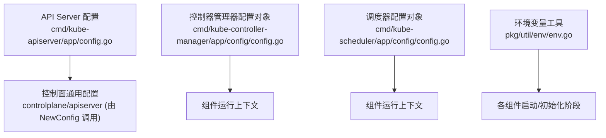
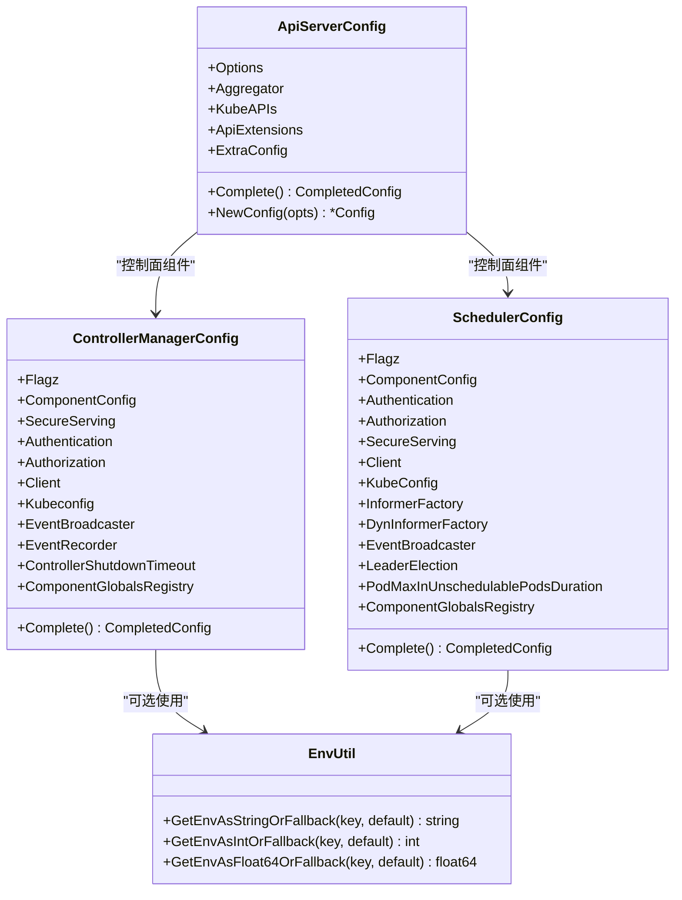
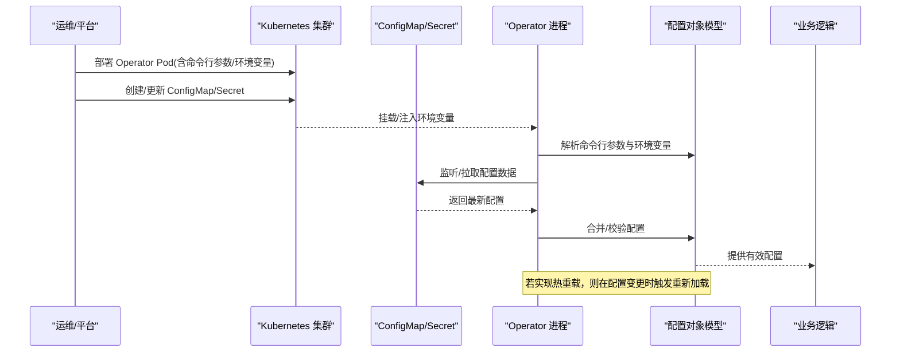
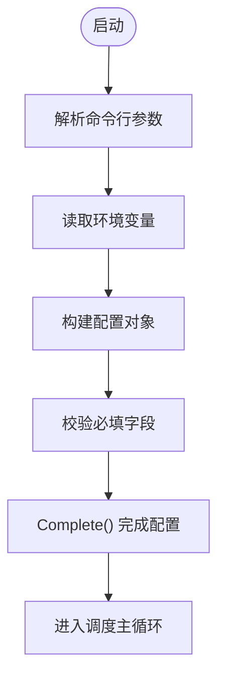
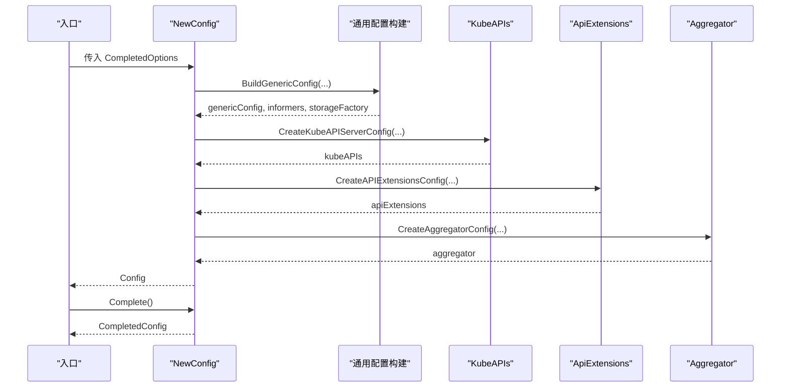
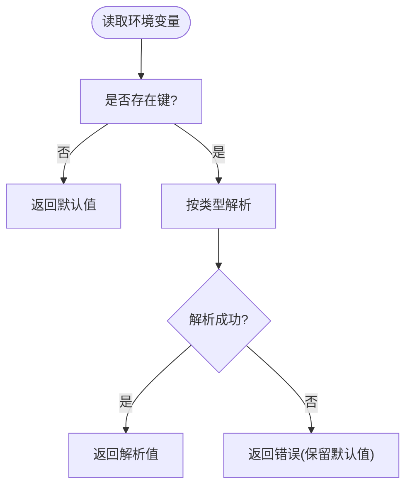
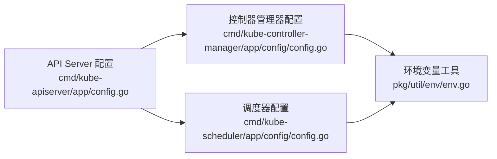

# 配置管理

<cite>
**本文引用的文件**   
- [cmd/kube-controller-manager/app/config/config.go](file://cmd/kube-controller-manager/app/config/config.go)
- [cmd/kube-scheduler/app/config/config.go](file://cmd/kube-scheduler/app/config/config.go)
- [cmd/kube-apiserver/app/config.go](file://cmd/kube-apiserver/app/config.go)
- [pkg/util/env/env.go](file://pkg/util/env/env.go)
</cite>

## 目录
1. [简介](#简介)
2. [项目结构](#项目结构)
3. [核心组件](#核心组件)
4. [架构总览](#架构总览)
5. [详细组件分析](#详细组件分析)
6. [依赖关系分析](#依赖关系分析)
7. [性能考量](#性能考量)
8. [故障排查指南](#故障排查指南)
9. [结论](#结论)
10. [附录](#附录)

## 简介
本文件面向在 Kubernetes 生态中构建与运维 Operator 的工程师，聚焦“配置管理”主题。内容涵盖：
- ConfigMap 与 Secret 的配置方式和使用模式
- Operator 的命令行参数与环境变量配置
- 配置热重载机制与配置验证策略
- 配置文件最佳实践与组织结构
- 配置迁移与版本兼容性处理方案
- 不同环境（开发、测试、生产）的配置管理策略
- 配置管理的自动化脚本与工具链建议

说明：
- 本文所有技术细节均基于仓库内现有实现进行归纳与提炼，避免臆造未出现的特性。
- 对于未在仓库中发现的具体实现（如通用热重载框架），将以概念性说明给出可落地的工程化建议，并明确标注为“概念性内容”。

## 项目结构
围绕配置管理，仓库中与“组件配置对象”和“环境变量读取”直接相关的代码主要位于以下位置：
- 控制器管理器配置对象定义：cmd/kube-controller-manager/app/config/config.go
- 调度器配置对象定义：cmd/kube-scheduler/app/config/config.go
- API Server 组装配置：cmd/kube-apiserver/app/config.go
- 环境变量读取工具：pkg/util/env/env.go

图表来源
- [cmd/kube-apiserver/app/config.go:73-111](file://cmd/kube-apiserver/app/config.go#L73-L111)
- [cmd/kube-controller-manager/app/config/config.go:30-55](file://cmd/kube-controller-manager/app/config/config.go#L30-L55)
- [cmd/kube-scheduler/app/config/config.go:34-65](file://cmd/kube-scheduler/app/config/config.go#L34-L65)
- [pkg/util/env/env.go:24-57](file://pkg/util/env/env.go#L24-L57)

章节来源
- [cmd/kube-controller-manager/app/config/config.go:30-55](file://cmd/kube-controller-manager/app/config/config.go#L30-L55)
- [cmd/kube-scheduler/app/config/config.go:34-65](file://cmd/kube-scheduler/app/config/config.go#L34-L65)
- [cmd/kube-apiserver/app/config.go:73-111](file://cmd/kube-apiserver/app/config.go#L73-L111)
- [pkg/util/env/env.go:24-57](file://pkg/util/env/env.go#L24-L57)

## 核心组件
本节从“配置对象模型”的角度，梳理关键组件如何承载配置，以及它们之间的关系。

- 控制器管理器配置对象
  - 包含 Flagz、ComponentConfig、认证/授权信息、SecureServing、Client、Kubeconfig、事件广播/记录器、关闭超时、组件全局注册表等字段。
  - 提供 Complete() 完成配置填充，返回 CompletedConfig 供后续使用。

- 调度器配置对象
  - 包含 Flagz、ComponentConfig、认证/授权、SecureServing、Client、KubeConfig、InformerFactory、动态 InformerFactory、事件适配器、LeaderElection、Pod 最大不可调度时长、组件全局注册表等字段。
  - 提供 Complete() 完成配置填充，返回 CompletedConfig。

- API Server 配置组装
  - 通过 NewConfig(opts) 构建 Aggregator、KubeAPIs、ApiExtensions 等子配置，并调用各自 Complete() 完成装配。

- 环境变量工具
  - 提供字符串、整数、浮点三类环境变量读取函数，支持默认值回退与解析错误处理。

图表来源
- [cmd/kube-controller-manager/app/config/config.go:30-72](file://cmd/kube-controller-manager/app/config/config.go#L30-L72)
- [cmd/kube-scheduler/app/config/config.go:34-82](file://cmd/kube-scheduler/app/config/config.go#L34-L82)
- [cmd/kube-apiserver/app/config.go:33-71](file://cmd/kube-apiserver/app/config.go#L33-L71)
- [pkg/util/env/env.go:24-57](file://pkg/util/env/env.go#L24-L57)

章节来源
- [cmd/kube-controller-manager/app/config/config.go:30-72](file://cmd/kube-controller-manager/app/config/config.go#L30-L72)
- [cmd/kube-scheduler/app/config/config.go:34-82](file://cmd/kube-scheduler/app/config/config.go#L34-L82)
- [cmd/kube-apiserver/app/config.go:33-71](file://cmd/kube-apiserver/app/config.go#L33-L71)
- [pkg/util/env/env.go:24-57](file://pkg/util/env/env.go#L24-L57)

## 架构总览
下图展示了一个典型 Operator 在 Kubernetes 中的配置来源与加载路径：
- 命令行参数与环境变量作为运行时注入
- ConfigMap/Secret 作为声明式配置源
- 组件内部通过配置对象模型聚合配置
- 启动时完成校验与合并，运行期按需热更新（若实现）

[此图为概念性流程示意，不直接映射具体源码文件]

## 详细组件分析

### 控制器管理器配置对象分析
- 职责
  - 承载控制器管理器的全部运行期配置，包括组件级配置、安全服务、认证/授权、客户端连接、事件系统、关闭超时、组件全局注册表等。
- 生命周期
  - 通过 Complete() 完成必要字段的填充，返回 CompletedConfig 供后续控制器初始化使用。
- 与外部配置的对接
  - ComponentConfig 通常来自组件配置文件或命令行参数；认证/授权与安全服务由控制面统一装配；Client/Kubeconfig 用于访问 API Server。

图表来源
- [cmd/kube-controller-manager/app/config/config.go:30-72](file://cmd/kube-controller-manager/app/config/config.go#L30-L72)

章节来源
- [cmd/kube-controller-manager/app/config/config.go:30-72](file://cmd/kube-controller-manager/app/config/config.go#L30-L72)

### 调度器配置对象分析
- 职责
  - 承载调度器的运行期配置，包括组件配置、安全服务、认证/授权、客户端连接、Informers、事件适配器、选举配置、不可调度队列时长、组件全局注册表等。
- 生命周期
  - 通过 Complete() 完成配置填充，返回 CompletedConfig 供调度器主循环使用。
- 与外部配置的对接
  - ComponentConfig 通常来自组件配置文件或命令行参数；LeaderElection 用于多副本高可用；PodMaxInUnschedulablePodsDuration 影响调度行为。

图表来源
- [cmd/kube-scheduler/app/config/config.go:34-82](file://cmd/kube-scheduler/app/config/config.go#L34-L82)

章节来源
- [cmd/kube-scheduler/app/config/config.go:34-82](file://cmd/kube-scheduler/app/config/config.go#L34-L82)

### API Server 配置组装分析
- 职责
  - 负责将 Options 转换为完整的控制面配置，包括通用配置、扩展 API、聚合器等子配置，并调用各自的 Complete()。
- 关键点
  - NewConfig(opts) 是入口，内部依次构建 KubeAPIs、ApiExtensions、Aggregator 等。
  - 最终返回 CompletedConfig，确保所有子配置均已就绪。

图表来源
- [cmd/kube-apiserver/app/config.go:73-111](file://cmd/kube-apiserver/app/config.go#L73-L111)
- [cmd/kube-apiserver/app/config.go:61-71](file://cmd/kube-apiserver/app/config.go#L61-L71)

章节来源
- [cmd/kube-apiserver/app/config.go:33-71](file://cmd/kube-apiserver/app/config.go#L33-L71)
- [cmd/kube-apiserver/app/config.go:73-111](file://cmd/kube-apiserver/app/config.go#L73-L111)

### 环境变量工具分析
- 职责
  - 提供类型安全的读取接口，支持默认值回退与解析错误处理。
- 适用场景
  - 在 Operator 启动早期读取运行时开关、调试参数、资源限制等。

图表来源
- [pkg/util/env/env.go:24-57](file://pkg/util/env/env.go#L24-L57)

章节来源
- [pkg/util/env/env.go:24-57](file://pkg/util/env/env.go#L24-L57)

## 依赖关系分析
- 组件间耦合
  - API Server 配置组装对控制面通用配置、扩展 API、聚合器存在强依赖。
  - 控制器管理器与调度器配置对象相对独立，但都依赖控制面提供的认证/授权与安全服务。
- 外部依赖
  - 通过 Client/Kubeconfig 访问 API Server。
  - 通过 EventBroadcaster/Recorder 发送事件。
  - 通过 LeaderElection 实现多副本高可用（调度器）。

图表来源
- [cmd/kube-apiserver/app/config.go:33-71](file://cmd/kube-apiserver/app/config.go#L33-L71)
- [cmd/kube-controller-manager/app/config/config.go:30-55](file://cmd/kube-controller-manager/app/config/config.go#L30-L55)
- [cmd/kube-scheduler/app/config/config.go:34-65](file://cmd/kube-scheduler/app/config/config.go#L34-L65)
- [pkg/util/env/env.go:24-57](file://pkg/util/env/env.go#L24-57)

章节来源
- [cmd/kube-apiserver/app/config.go:33-71](file://cmd/kube-apiserver/app/config.go#L33-L71)
- [cmd/kube-controller-manager/app/config/config.go:30-55](file://cmd/kube-controller-manager/app/config/config.go#L30-L55)
- [cmd/kube-scheduler/app/config/config.go:34-65](file://cmd/kube-scheduler/app/config/config.go#L34-L65)
- [pkg/util/env/env.go:24-57](file://pkg/util/env/env.go#L24-57)

## 性能考量
- 配置对象构造成本
  - Complete() 通常只做轻量填充，避免在热点路径执行重计算。
- 环境变量读取开销
  - 建议在启动阶段集中读取，避免在高频路径重复解析。
- 配置校验
  - 尽量在启动阶段完成校验，减少运行期分支判断带来的开销。
- 热重载
  - 若实现热重载，应使用增量更新与并发安全的数据结构，避免全量重建导致的抖动。

[本节为通用性能建议，不涉及具体源码分析]

## 故障排查指南
- 常见问题定位
  - 环境变量缺失或类型错误：检查读取函数的返回值与日志输出，确认是否触发了默认值回退或解析错误。
  - 配置对象未完成：确认 Complete() 是否被正确调用，相关必填字段是否已设置。
  - 认证/授权失败：核对 SecureServing、Authentication、Authorization 是否正确装配。
- 建议的排错步骤
  - 打印完整配置对象（脱敏后）以确认合并结果。
  - 逐步注释掉新增配置项，定位问题来源。
  - 使用最小可复现配置，逐步增加复杂度。

章节来源
- [cmd/kube-controller-manager/app/config/config.go:30-72](file://cmd/kube-controller-manager/app/config/config.go#L30-L72)
- [cmd/kube-scheduler/app/config/config.go:34-82](file://cmd/kube-scheduler/app/config/config.go#L34-L82)
- [cmd/kube-apiserver/app/config.go:61-71](file://cmd/kube-apiserver/app/config.go#L61-L71)
- [pkg/util/env/env.go:24-57](file://pkg/util/env/env.go#L24-57)

## 结论
- 配置对象模型提供了清晰的边界与生命周期管理，便于在不同组件间复用与演进。
- 环境变量工具为运行时注入提供了稳定接口，适合非敏感、易变参数的快速切换。
- 对于 ConfigMap/Secret 的使用，建议结合声明式配置与启动期校验，确保一致性。
- 在生产环境中，应重视配置的可观测性与可回滚能力，配合自动化脚本与工具链提升效率与可靠性。

[本节为总结性内容，不涉及具体源码分析]

## 附录

### ConfigMap 与 Secret 的使用模式（概念性建议）
- 使用模式
  - 将非敏感配置放入 ConfigMap，敏感信息放入 Secret。
  - 通过 Volume 或环境变量注入到 Pod，Operator 在启动时读取。
- 组织建议
  - 按功能域拆分多个 ConfigMap/Secret，避免单文件过大。
  - 使用命名空间隔离不同环境的配置。
- 版本兼容
  - 在 ConfigMap/Secret 中引入版本号字段，Operator 启动时校验版本并提示迁移。

[本节为概念性内容，不直接映射具体源码文件]

### 命令行参数与环境变量配置（概念性建议）
- 命令行参数
  - 用于静态、不可变的配置，如证书路径、端口、日志级别等。
- 环境变量
  - 用于运行时可变的开关，如调试标志、临时阈值等。
- 优先级
  - 建议采用“默认值 < 环境变量 < 配置文件 < 命令行参数”的合并策略，并在日志中记录生效来源。

[本节为概念性内容，不直接映射具体源码文件]

### 配置热重载机制（概念性建议）
- 触发方式
  - 监听 ConfigMap/Secret 变更事件，或在文件系统中监控文件变化。
- 更新策略
  - 增量更新：仅替换变更字段，保持其他配置不变。
  - 原子切换：准备新配置快照，切换成功后再释放旧配置。
- 并发安全
  - 使用读写锁或无锁数据结构保护共享配置。

[本节为概念性内容，不直接映射具体源码文件]

### 配置验证策略（概念性建议）
- 启动期校验
  - 必填字段、取值范围、格式校验。
- 运行期校验
  - 对关键阈值进行软校验，记录告警但不中断运行。
- 回归测试
  - 针对配置变更编写单元测试与集成测试，覆盖边界条件。

[本节为概念性内容，不直接映射具体源码文件]

### 配置文件最佳实践与组织结构（概念性建议）
- 分层组织
  - 基础配置（公共）、环境配置（dev/test/prod）、租户/实例配置。
- 命名规范
  - 使用语义化名称与标签，便于检索与审计。
- 文档化
  - 为每个配置项添加注释与示例，降低维护成本。

[本节为概念性内容，不直接映射具体源码文件]

### 配置迁移与版本兼容性处理（概念性建议）
- 向后兼容
  - 保留旧字段，提供迁移脚本自动转换。
- 向前兼容
  - 新版本忽略未知字段，记录警告。
- 灰度发布
  - 先在小流量环境验证配置变更，再逐步推广。

[本节为概念性内容，不直接映射具体源码文件]

### 不同环境的配置管理策略（概念性建议）
- 开发环境
  - 宽松校验，快速迭代，启用详细日志。
- 测试环境
  - 严格校验，模拟生产数据与网络拓扑。
- 生产环境
  - 最小权限、只读挂载、变更审批与审计。

[本节为概念性内容，不直接映射具体源码文件]

### 自动化脚本与工具链（概念性建议）
- 生成与校验
  - 使用代码生成工具生成配置模板与校验规则。
- 发布流水线
  - CI/CD 中集成配置扫描、合规检查与回滚预案。
- 监控与告警
  - 暴露配置相关指标，异常变更即时告警。

[本节为概念性内容，不直接映射具体源码文件]