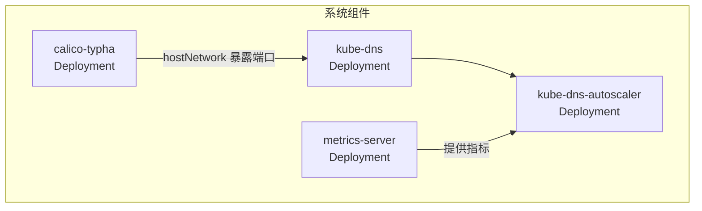
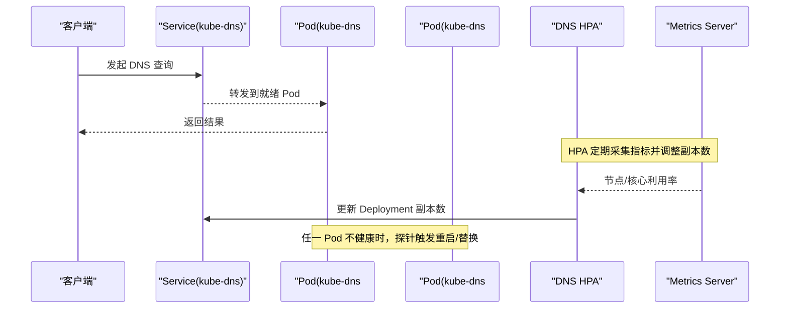
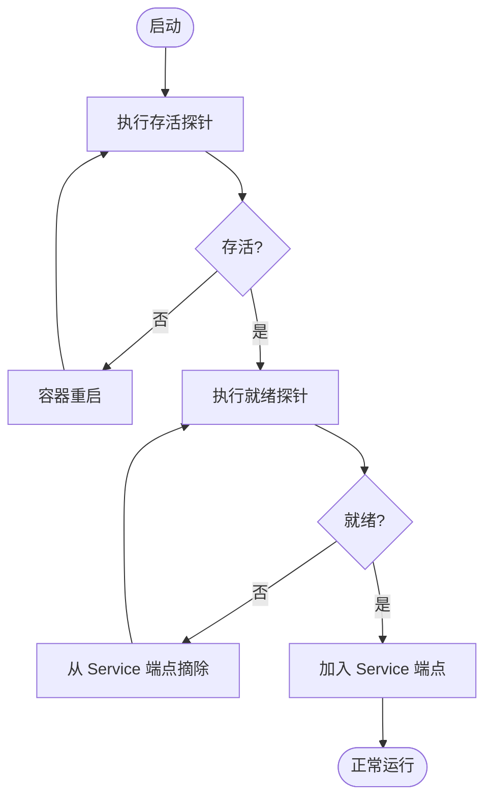
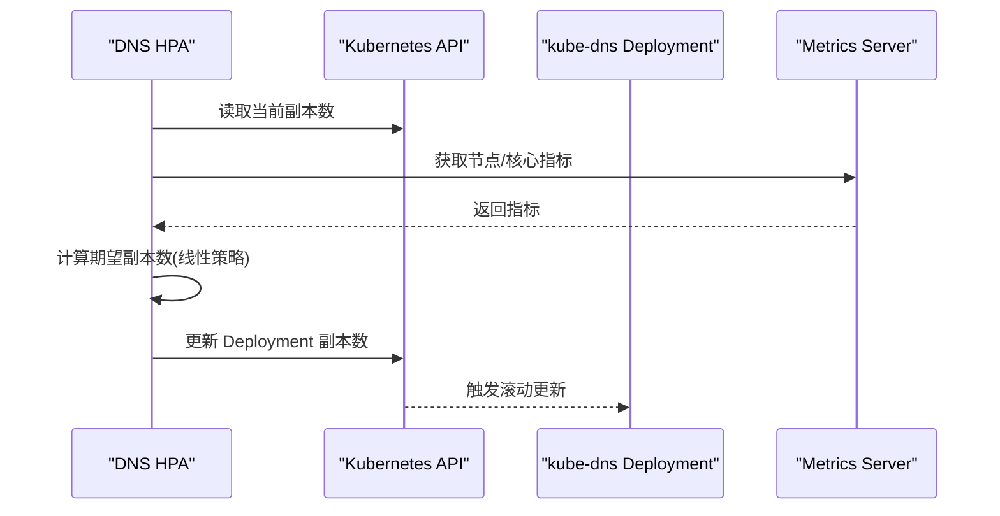
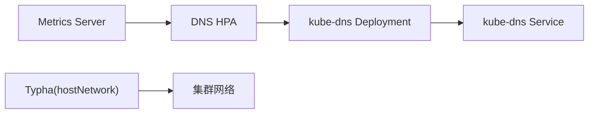
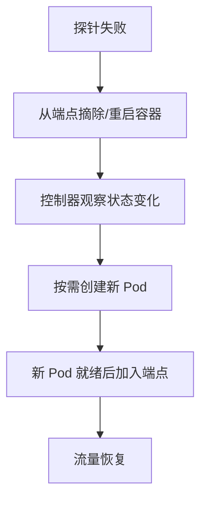

# 高可用部署

<cite>
**本文引用的文件**   
- [cluster/addons/dns/kube-dns/kube-dns.yaml.in](file://cluster/addons/dns/kube-dns/kube-dns.yaml.in)
- [cluster/addons/dns-horizontal-autoscaler/dns-horizontal-autoscaler.yaml](file://cluster/addons/dns-horizontal-autoscaler/dns-horizontal-autoscaler.yaml)
- [cluster/addons/metrics-server/metrics-server-deployment.yaml](file://cluster/addons/metrics-server/metrics-server-deployment.yaml)
- [cluster/addons/calico-policy-controller/typha-deployment.yaml](file://cluster/addons/calico-policy-controller/typha-deployment.yaml)
</cite>

## 目录
1. [简介](#简介)
2. [项目结构](#项目结构)
3. [核心组件](#核心组件)
4. [架构总览](#架构总览)
5. [详细组件分析](#详细组件分析)
6. [依赖关系分析](#依赖关系分析)
7. [性能与弹性伸缩](#性能与弹性伸缩)
8. [故障转移与自动恢复](#故障转移与自动恢复)
9. [跨可用区与网络分区处理](#跨可用区与网络分区处理)
10. [最佳实践](#最佳实践)
11. [结论](#结论)

## 简介
本技术文档面向在 Kubernetes 上以高可用方式部署 Operator（或任何需要领导者选举、多副本容错的关键控制面组件）的工程团队。文档基于仓库中已有的系统级组件示例，提炼出可复用的设计模式与配置策略，涵盖：
- 多副本部署与领导者选举机制
- Pod 反亲和性与节点拓扑分布
- 健康检查与就绪探针策略
- 故障转移与自动恢复
- 资源限制与弹性伸缩
- 跨可用区部署与网络分区处理
- 高可用架构的设计模式与最佳实践

## 项目结构
本节聚焦与高可用相关的系统组件清单及其作用：
- DNS 服务（kube-dns）：提供集群内域名解析，具备滚动更新、反亲和与探针等 HA 特性
- DNS 水平自动扩缩容（DNS HPA）：根据集群规模动态调整副本数，避免单点并提升可扩展性
- Metrics Server：为 HPA/VPA 提供指标数据源，自身具备就绪/存活探针
- Calico Typha：高性能连接聚合器，具备本地健康端点与 hostNetwork 能力

图表来源
- [cluster/addons/dns/kube-dns/kube-dns.yaml.in:59-104](file://cluster/addons/dns/kube-dns/kube-dns.yaml.in#L59-L104)
- [cluster/addons/dns-horizontal-autoscaler/dns-horizontal-autoscaler.yaml:61-109](file://cluster/addons/dns-horizontal-autoscaler/dns-horizontal-autoscaler.yaml#L61-L109)
- [cluster/addons/metrics-server/metrics-server-deployment.yaml:23-79](file://cluster/addons/metrics-server/metrics-server-deployment.yaml#L23-L79)
- [cluster/addons/calico-policy-controller/typha-deployment.yaml:1-76](file://cluster/addons/calico-policy-controller/typha-deployment.yaml#L1-L76)

章节来源
- [cluster/addons/dns/kube-dns/kube-dns.yaml.in:59-104](file://cluster/addons/dns/kube-dns/kube-dns.yaml.in#L59-L104)
- [cluster/addons/dns-horizontal-autoscaler/dns-horizontal-autoscaler.yaml:61-109](file://cluster/addons/dns-horizontal-autoscaler/dns-horizontal-autoscaler.yaml#L61-L109)
- [cluster/addons/metrics-server/metrics-server-deployment.yaml:23-79](file://cluster/addons/metrics-server/metrics-server-deployment.yaml#L23-L79)
- [cluster/addons/calico-policy-controller/typha-deployment.yaml:1-76](file://cluster/addons/calico-policy-controller/typha-deployment.yaml#L1-L76)

## 核心组件
- kube-dns
  - 使用 Deployment 管理多副本，支持滚动更新策略
  - 配置了 Pod 反亲和，降低同节点失败风险
  - 定义了 liveness 与 readiness 探针，保障自愈与服务可用性
- DNS 水平自动扩缩容
  - 通过 cluster-proportional-autoscaler 按节点/核心数线性扩容
  - 默认开启 preventSinglePointFailure，避免单点
- metrics-server
  - 提供 /readyz 与 /livez 探针
  - 作为 HPA/VPA 的指标来源，支撑上层弹性伸缩
- calico-typha
  - 使用 hostNetwork 暴露内部端口，减少网络栈开销
  - 提供 /liveness 与 /readiness 探针

章节来源
- [cluster/addons/dns/kube-dns/kube-dns.yaml.in:73-104](file://cluster/addons/dns/kube-dns/kube-dns.yaml.in#L73-L104)
- [cluster/addons/dns/kube-dns/kube-dns.yaml.in:128-146](file://cluster/addons/dns/kube-dns/kube-dns.yaml.in#L128-L146)
- [cluster/addons/dns-horizontal-autoscaler/dns-horizontal-autoscaler.yaml:94-103](file://cluster/addons/dns-horizontal-autoscaler/dns-horizontal-autoscaler.yaml#L94-L103)
- [cluster/addons/metrics-server/metrics-server-deployment.yaml:66-79](file://cluster/addons/metrics-server/metrics-server-deployment.yaml#L66-L79)
- [cluster/addons/calico-policy-controller/typha-deployment.yaml:23-71](file://cluster/addons/calico-policy-controller/typha-deployment.yaml#L23-L71)

## 架构总览
下图展示了关键组件之间的交互关系，以及它们如何共同实现高可用：
- DNS 服务由 Deployment 管理，受 HPA 驱动进行横向扩展
- Metrics Server 提供指标，供 HPA 决策
- Typha 通过 hostNetwork 暴露端口，优化大规模场景下的连接性能
- 各组件均配置探针，配合控制器完成自愈与流量摘除

图表来源
- [cluster/addons/dns/kube-dns/kube-dns.yaml.in:30-40](file://cluster/addons/dns/kube-dns/kube-dns.yaml.in#L30-L40)
- [cluster/addons/dns/kube-dns/kube-dns.yaml.in:128-146](file://cluster/addons/dns/kube-dns/kube-dns.yaml.in#L128-L146)
- [cluster/addons/dns-horizontal-autoscaler/dns-horizontal-autoscaler.yaml:94-103](file://cluster/addons/dns-horizontal-autoscaler/dns-horizontal-autoscaler.yaml#L94-L103)
- [cluster/addons/metrics-server/metrics-server-deployment.yaml:66-79](file://cluster/addons/metrics-server/metrics-server-deployment.yaml#L66-L79)

## 详细组件分析

### kube-dns 高可用配置要点
- 多副本与滚动更新
  - 使用 Deployment 管理，滚动更新策略保证零停机升级
- Pod 反亲和与拓扑分布
  - 配置 preferredDuringSchedulingIgnoredDuringExecution 的反亲和项，尽量将不同副本调度到不同主机，降低单节点故障影响
- 健康检查与就绪探针
  - livenessProbe 探测 kubedns 健康端点，失败阈值与超时时间合理设置，确保异常快速自愈
  - readinessProbe 探测 /readiness，确保只有真正可用的 Pod 接收流量
- 安全与优先级
  - 使用 system-cluster-critical 优先级类与最小权限运行用户，增强稳定性与安全性

图表来源
- [cluster/addons/dns/kube-dns/kube-dns.yaml.in:128-146](file://cluster/addons/dns/kube-dns/kube-dns.yaml.in#L128-L146)
- [cluster/addons/dns/kube-dns/kube-dns.yaml.in:94-104](file://cluster/addons/dns/kube-dns/kube-dns.yaml.in#L94-L104)

章节来源
- [cluster/addons/dns/kube-dns/kube-dns.yaml.in:73-104](file://cluster/addons/dns/kube-dns/kube-dns.yaml.in#L73-L104)
- [cluster/addons/dns/kube-dns/kube-dns.yaml.in:128-146](file://cluster/addons/dns/kube-dns/kube-dns.yaml.in#L128-L146)

### DNS 水平自动扩缩容（HPA）
- 目标与参数
  - 通过 --target 指定目标 Deployment
  - 使用 linear 策略，按 coresPerReplica 与 nodesPerReplica 线性计算副本数
  - 启用 preventSinglePointFailure，避免单点
- 指标来源
  - 结合 Metrics Server 提供的节点/核心指标，实现更精准的扩缩容

图表来源
- [cluster/addons/dns-horizontal-autoscaler/dns-horizontal-autoscaler.yaml:94-103](file://cluster/addons/dns-horizontal-autoscaler/dns-horizontal-autoscaler.yaml#L94-L103)
- [cluster/addons/metrics-server/metrics-server-deployment.yaml:66-79](file://cluster/addons/metrics-server/metrics-server-deployment.yaml#L66-L79)

章节来源
- [cluster/addons/dns-horizontal-autoscaler/dns-horizontal-autoscaler.yaml:61-109](file://cluster/addons/dns-horizontal-autoscaler/dns-horizontal-autoscaler.yaml#L61-L109)

### Metrics Server 高可用与指标供给
- 探针配置
  - /readyz 与 /livez 分别用于就绪与存活检测，周期与失败阈值合理设置
- 作为指标源
  - 为 HPA/VPA 提供指标，支撑上层弹性伸缩

章节来源
- [cluster/addons/metrics-server/metrics-server-deployment.yaml:66-79](file://cluster/addons/metrics-server/metrics-server-deployment.yaml#L66-L79)

### Calico Typha 的高可用与网络优化
- hostNetwork 与端口暴露
  - 使用 hostNetwork 直接暴露端口，减少网络栈开销，适合大规模场景
- 健康检查
  - 提供 /liveness 与 /readiness 端点，便于控制器监控与自愈

章节来源
- [cluster/addons/calico-policy-controller/typha-deployment.yaml:23-71](file://cluster/addons/calico-policy-controller/typha-deployment.yaml#L23-L71)

## 依赖关系分析
- DNS HPA 依赖 Metrics Server 提供的指标
- kube-dns 依赖 Service 端点分发流量，受探针影响是否被纳入端点
- Typha 通过 hostNetwork 暴露端口，对底层网络有更强依赖

图表来源
- [cluster/addons/metrics-server/metrics-server-deployment.yaml:66-79](file://cluster/addons/metrics-server/metrics-server-deployment.yaml#L66-L79)
- [cluster/addons/dns-horizontal-autoscaler/dns-horizontal-autoscaler.yaml:94-103](file://cluster/addons/dns-horizontal-autoscaler/dns-horizontal-autoscaler.yaml#L94-L103)
- [cluster/addons/dns/kube-dns/kube-dns.yaml.in:30-40](file://cluster/addons/dns/kube-dns/kube-dns.yaml.in#L30-L40)
- [cluster/addons/calico-policy-controller/typha-deployment.yaml:23-31](file://cluster/addons/calico-policy-controller/typha-deployment.yaml#L23-L31)

章节来源
- [cluster/addons/metrics-server/metrics-server-deployment.yaml:66-79](file://cluster/addons/metrics-server/metrics-server-deployment.yaml#L66-L79)
- [cluster/addons/dns-horizontal-autoscaler/dns-horizontal-autoscaler.yaml:94-103](file://cluster/addons/dns-horizontal-autoscaler/dns-horizontal-autoscaler.yaml#L94-L103)
- [cluster/addons/dns/kube-dns/kube-dns.yaml.in:30-40](file://cluster/addons/dns/kube-dns/kube-dns.yaml.in#L30-L40)
- [cluster/addons/calico-policy-controller/typha-deployment.yaml:23-31](file://cluster/addons/calico-policy-controller/typha-deployment.yaml#L23-L31)

## 性能与弹性伸缩
- 资源请求与限制
  - 为关键容器设置合理的 requests/limits，确保 QoS 等级与调度稳定性
- 弹性伸缩策略
  - 使用 HPA 按节点/核心数线性扩容，防止单点并确保容量随集群增长
- 滚动更新
  - 配置 maxSurge 与 maxUnavailable，平衡升级速度与可用性

章节来源
- [cluster/addons/dns/kube-dns/kube-dns.yaml.in:73-76](file://cluster/addons/dns/kube-dns/kube-dns.yaml.in#L73-L76)
- [cluster/addons/dns-horizontal-autoscaler/dns-horizontal-autoscaler.yaml:94-103](file://cluster/addons/dns-horizontal-autoscaler/dns-horizontal-autoscaler.yaml#L94-L103)

## 故障转移与自动恢复
- 健康检查与自愈
  - livenessProbe 失败触发容器重启；readinessProbe 失败从 Service 端点摘除，避免脏流量
- 反亲和与拓扑分布
  - 通过 podAntiAffinity 将副本分散到不同主机，降低单点失效影响
- 自动扩缩容
  - HPA 根据指标动态调整副本数，应对突发负载与节点故障导致的容量不足

图表来源
- [cluster/addons/dns/kube-dns/kube-dns.yaml.in:128-146](file://cluster/addons/dns/kube-dns/kube-dns.yaml.in#L128-L146)
- [cluster/addons/dns/kube-dns/kube-dns.yaml.in:94-104](file://cluster/addons/dns/kube-dns/kube-dns.yaml.in#L94-L104)

章节来源
- [cluster/addons/dns/kube-dns/kube-dns.yaml.in:128-146](file://cluster/addons/dns/kube-dns/kube-dns.yaml.in#L128-L146)
- [cluster/addons/dns/kube-dns/kube-dns.yaml.in:94-104](file://cluster/addons/dns/kube-dns/kube-dns.yaml.in#L94-L104)

## 跨可用区与网络分区处理
- 跨可用区部署建议
  - 使用 topologyKey 为 zone 的反亲和规则，将副本分布到多个可用区
  - 结合 NodeSelector/Tolerations 与污点容忍，确保关键组件优先调度到可用节点
- 网络分区处理
  - 使用 hostNetwork 的组件需评估网络隔离与端口冲突风险
  - 通过探针与端点治理，在网络抖动期间尽快剔除不可用实例

章节来源
- [cluster/addons/calico-policy-controller/typha-deployment.yaml:23-31](file://cluster/addons/calico-policy-controller/typha-deployment.yaml#L23-L31)

## 最佳实践
- 多副本与领导者选举
  - 对于无状态组件，采用多副本 + 反亲和 + 探针
  - 对有状态或需要领导者选举的组件，使用协调资源（如 Lease）实现 Leader Election，确保同一时刻仅一个活跃实例
- 健康检查与就绪探针
  - 区分存活与就绪语义：存活决定重启，就绪决定流量接入
  - 合理设置 initialDelaySeconds、periodSeconds、failureThreshold，避免误判
- 资源限制与弹性伸缩
  - 为关键组件设置 requests/limits，提高 QoS 等级
  - 使用 HPA/VPA 组合，实现 CPU/内存/自定义指标的弹性伸缩
- 跨可用区与拓扑分布
  - 使用 topologyKey=zone 的反亲和，确保跨 AZ 容灾
  - 结合 NodeSelector/Tolerations 与污点，精细化调度
- 网络与安全
  - 谨慎使用 hostNetwork，评估端口冲突与安全风险
  - 使用最小权限原则与只读根文件系统，降低攻击面

[本节为通用指导，不直接分析具体文件]

## 结论
通过在 Deployment 中配置多副本、反亲和与健康探针，并结合 HPA 与 Metrics Server 实现弹性伸缩，可以在 Kubernetes 上构建高可用的系统组件。对于需要领导者选举的场景，应引入协调资源（如 Lease）以确保全局唯一领导者。跨可用区部署与严格的网络分区处理策略，可进一步提升系统的韧性与业务连续性。