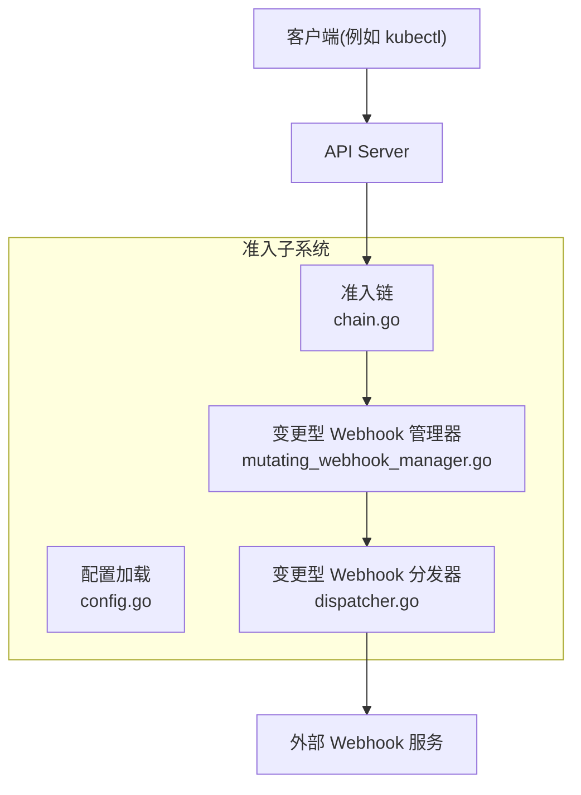
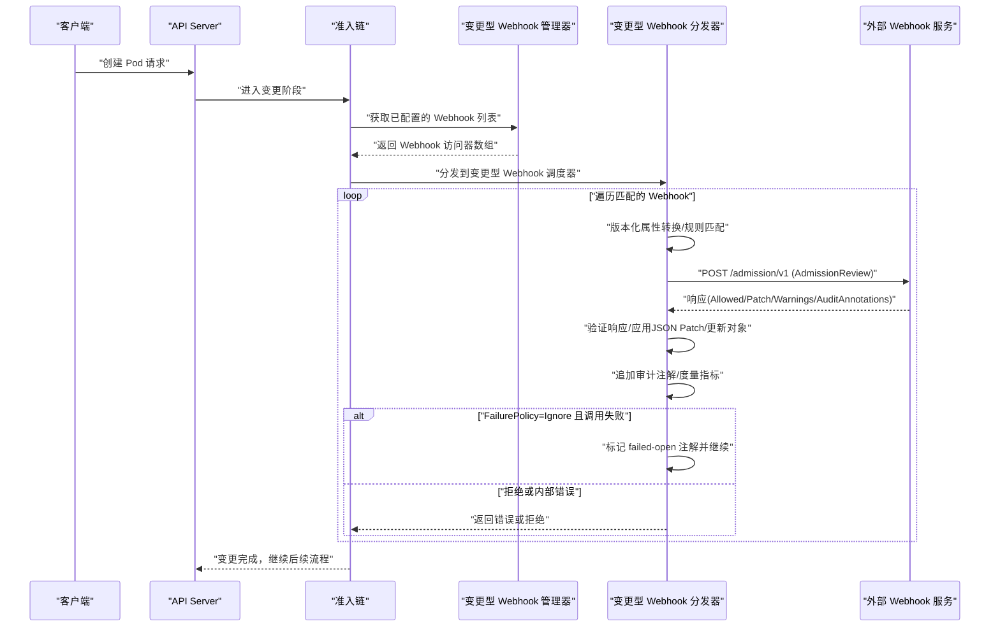
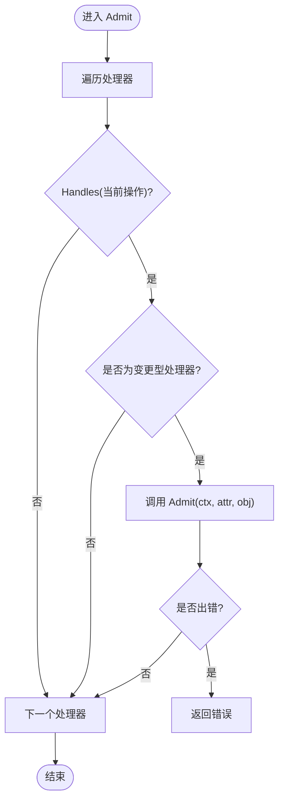
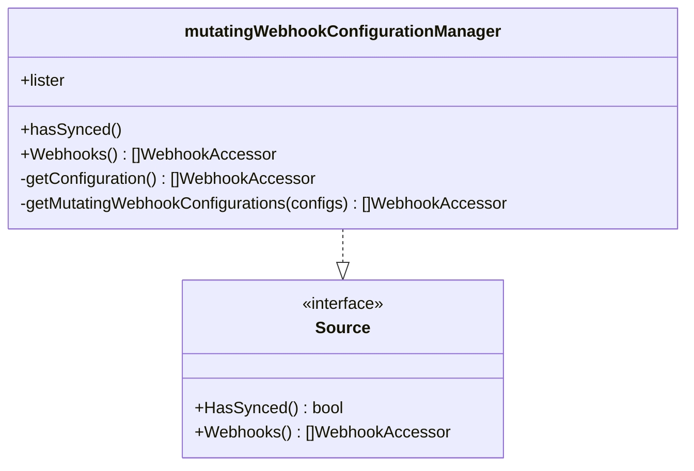
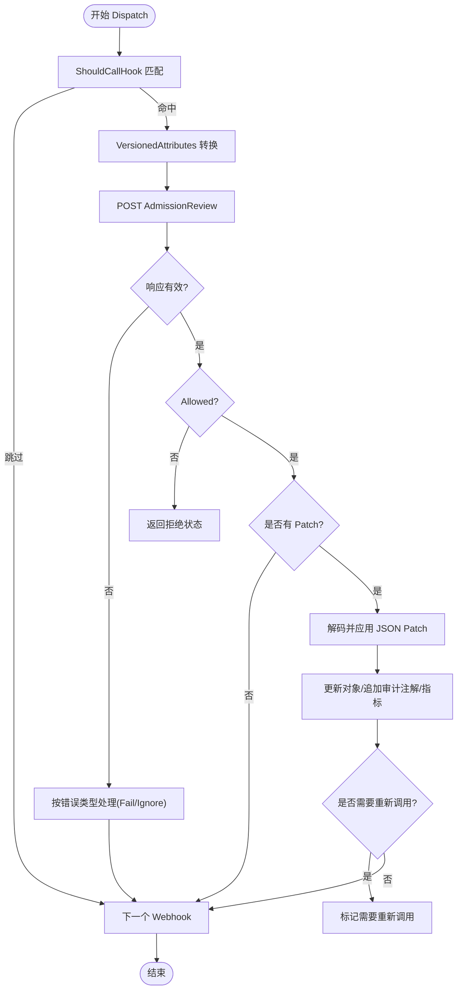
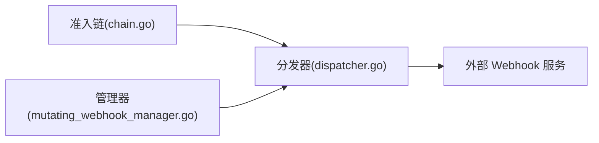

# Mutating Webhook

<cite>
**本文引用的文件**   
- [staging/src/k8s.io/apiserver/pkg/admission/chain.go](file://staging/src/k8s.io/apiserver/pkg/admission/chain.go)
- [staging/src/k8s.io/apiserver/pkg/admission/config.go](file://staging/src/k8s.io/apiserver/pkg/admission/config.go)
- [staging/src/k8s.io/apiserver/pkg/admission/configuration/mutating_webhook_manager.go](file://staging/src/k8s.io/apiserver/pkg/admission/configuration/mutating_webhook_manager.go)
- [staging/src/k8s.io/apiserver/pkg/admission/plugin/webhook/mutating/dispatcher.go](file://staging/src/k8s.io/apiserver/pkg/admission/plugin/webhook/mutating/dispatcher.go)
</cite>

## 目录
1. [简介](#简介)
2. [项目结构](#项目结构)
3. [核心组件](#核心组件)
4. [架构总览](#架构总览)
5. [详细组件分析](#详细组件分析)
6. [依赖关系分析](#依赖关系分析)
7. [性能考虑](#性能考虑)
8. [故障排查指南](#故障排查指南)
9. [结论](#结论)
10. [附录](#附录)

## 简介
本文件面向在 Kubernetes 中开发和使用“变更型准入 Webhook（Mutating Admission Webhook）”的工程师与平台团队，系统阐述其工作原理、执行时机、配置方法、请求处理逻辑与响应格式，并提供常见场景的实现思路（如 Pod 默认值设置、标签注入）、超时与重试策略、错误处理、性能优化建议、调试技巧以及测试方法与最佳实践。文档内容基于仓库内 apiserver 准入子系统源码进行解析，确保技术细节准确可追溯。

## 项目结构
Kubernetes 的变更型 Webhook 由 apiserver 的准入子系统驱动，关键路径位于 staging 模块下的 admission 相关包：
- 准入链与配置加载：负责将多个准入处理器串联并读取插件配置
- 动态配置管理：监听 MutatingWebhookConfiguration 资源，构建可执行的 Webhook 访问器集合
- 分发与调用：按规则匹配、构造请求、发送 HTTP 调用、应用补丁、审计标注与指标上报

图表来源
- [staging/src/k8s.io/apiserver/pkg/admission/chain.go:1-71](file://staging/src/k8s.io/apiserver/pkg/admission/chain.go#L1-L71)
- [staging/src/k8s.io/apiserver/pkg/admission/config.go:1-175](file://staging/src/k8s.io/apiserver/pkg/admission/config.go#L1-L175)
- [staging/src/k8s.io/apiserver/pkg/admission/configuration/mutating_webhook_manager.go:1-164](file://staging/src/k8s.io/apiserver/pkg/admission/configuration/mutating_webhook_manager.go#L1-L164)
- [staging/src/k8s.io/apiserver/pkg/admission/plugin/webhook/mutating/dispatcher.go:1-496](file://staging/src/k8s.io/apiserver/pkg/admission/plugin/webhook/mutating/dispatcher.go#L1-L496)

章节来源
- [staging/src/k8s.io/apiserver/pkg/admission/chain.go:1-71](file://staging/src/k8s.io/apiserver/pkg/admission/chain.go#L1-L71)
- [staging/src/k8s.io/apiserver/pkg/admission/config.go:1-175](file://staging/src/k8s.io/apiserver/pkg/admission/config.go#L1-L175)

## 核心组件
- 准入链（Admission Chain）
  - 作用：将多个准入处理器按顺序执行，遇到第一个错误即返回；对变更型处理器走 Admit 流程，校验型处理器走 Validate 流程
  - 关键点：Handles 判断是否支持当前操作；MutationInterface 用于变更型处理
- 配置加载（Admission Configuration）
  - 作用：从文件或内存对象中读取 AdmissionConfiguration，兼容旧版格式，提供每个插件的配置读取接口
- 变更型 Webhook 管理器（Mutating Webhook Configuration Manager）
  - 作用：通过 Informer 监听 MutatingWebhookConfiguration 变化，合并并缓存所有 Webhook 访问器，保证确定性排序与去重
- 变更型 Webhook 分发器（Mutating Dispatcher）
  - 作用：根据规则匹配、版本化属性转换、构造 AdmissionReview 请求、调用外部 Webhook、应用 JSON Patch、记录审计注解与指标、处理失败策略与重新调用

章节来源
- [staging/src/k8s.io/apiserver/pkg/admission/chain.go:1-71](file://staging/src/k8s.io/apiserver/pkg/admission/chain.go#L1-L71)
- [staging/src/k8s.io/apiserver/pkg/admission/config.go:1-175](file://staging/src/k8s.io/apiserver/pkg/admission/config.go#L1-L175)
- [staging/src/k8s.io/apiserver/pkg/admission/configuration/mutating_webhook_manager.go:1-164](file://staging/src/k8s.io/apiserver/pkg/admission/configuration/mutating_webhook_manager.go#L1-L164)
- [staging/src/k8s.io/apiserver/pkg/admission/plugin/webhook/mutating/dispatcher.go:1-496](file://staging/src/k8s.io/apiserver/pkg/admission/plugin/webhook/mutating/dispatcher.go#L1-L496)

## 架构总览
下图展示了从客户端发起创建 Pod 到变更型 Webhook 完成调用的完整时序，包括规则匹配、版本化属性、HTTP 调用、补丁应用与审计标注等关键步骤。

图表来源
- [staging/src/k8s.io/apiserver/pkg/admission/plugin/webhook/mutating/dispatcher.go:105-240](file://staging/src/k8s.io/apiserver/pkg/admission/plugin/webhook/mutating/dispatcher.go#L105-L240)
- [staging/src/k8s.io/apiserver/pkg/admission/configuration/mutating_webhook_manager.go:95-157](file://staging/src/k8s.io/apiserver/pkg/admission/configuration/mutating_webhook_manager.go#L95-L157)

## 详细组件分析

### 准入链（Admission Chain）
- 职责
  - 维护一组准入处理器，按 Handles 过滤后依次执行
  - 变更型处理器实现 MutationInterface，调用 Admit 完成修改
- 行为要点
  - 遇到首个错误立即返回
  - 仅对支持当前操作的处理器执行相应方法

图表来源
- [staging/src/k8s.io/apiserver/pkg/admission/chain.go:30-44](file://staging/src/k8s.io/apiserver/pkg/admission/chain.go#L30-L44)

章节来源
- [staging/src/k8s.io/apiserver/pkg/admission/chain.go:1-71](file://staging/src/k8s.io/apiserver/pkg/admission/chain.go#L1-L71)

### 配置加载（Admission Configuration）
- 职责
  - 读取 AdmissionConfiguration 文件，兼容旧版 ImagePolicy/PodNodeSelector 格式
  - 为各插件提供配置读取接口（嵌套对象或外部文件路径）
- 行为要点
  - 相对路径转换为绝对路径
  - 未找到匹配插件时返回空配置

章节来源
- [staging/src/k8s.io/apiserver/pkg/admission/config.go:51-175](file://staging/src/k8s.io/apiserver/pkg/admission/config.go#L51-L175)

### 变更型 Webhook 管理器（Mutating Webhook Configuration Manager）
- 职责
  - 通过 Informer 监听 MutatingWebhookConfiguration 增删改事件
  - 合并所有配置中的 Webhooks，生成 WebhookAccessor 列表
  - 使用 Lazy 计算与本地缓存避免重复编译 CEL 表达式等昂贵操作
  - 对同名 Webhook 自动加后缀以去重，并按名称稳定排序
- 行为要点
  - 删除事件清理对应缓存条目
  - 暴露 HasSynced 供上层等待初始同步完成

图表来源
- [staging/src/k8s.io/apiserver/pkg/admission/configuration/mutating_webhook_manager.go:41-164](file://staging/src/k8s.io/apiserver/pkg/admission/configuration/mutating_webhook_manager.go#L41-L164)

章节来源
- [staging/src/k8s.io/apiserver/pkg/admission/configuration/mutating_webhook_manager.go:1-164](file://staging/src/k8s.io/apiserver/pkg/admission/configuration/mutating_webhook_manager.go#L1-L164)

### 变更型 Webhook 分发器（Mutating Dispatcher）
- 职责
  - 根据规则匹配决定是否调用某个 Webhook
  - 构造 VersionedAttributes，适配不同 GVK
  - 发送 AdmissionReview 请求，接收响应并应用 JSON Patch
  - 记录审计注解（包含失败打开、变更存在性、补丁内容），上报指标
  - 处理 FailurePolicy（Fail/Ignore）、SideEffects、DryRun、ReinvocationPolicy
- 关键流程
  - 版本化属性转换：首次创建 VersionedAttributes，后续按需转换目标版本
  - 超时控制：若 Webhook 指定 TimeoutSeconds，则包装上下文；同时根据父上下文截止时间设置 HTTP 超时
  - 失败策略：
    - Fail：调用失败直接拒绝请求
    - Ignore：记录 failed-open 注解，继续后续 Webhook
  - 重新调用：当对象被其他插件修改时，按需重新触发符合条件的 Webhook
  - 补丁应用：仅支持 JSONPatch；对 Unstructured 与结构化对象分别处理；应用后调用默认器补全默认值

图表来源
- [staging/src/k8s.io/apiserver/pkg/admission/plugin/webhook/mutating/dispatcher.go:105-240](file://staging/src/k8s.io/apiserver/pkg/admission/plugin/webhook/mutating/dispatcher.go#L105-L240)
- [staging/src/k8s.io/apiserver/pkg/admission/plugin/webhook/mutating/dispatcher.go:244-391](file://staging/src/k8s.io/apiserver/pkg/admission/plugin/webhook/mutating/dispatcher.go#L244-L391)

章节来源
- [staging/src/k8s.io/apiserver/pkg/admission/plugin/webhook/mutating/dispatcher.go:1-496](file://staging/src/k8s.io/apiserver/pkg/admission/plugin/webhook/mutating/dispatcher.go#L1-L496)

## 依赖关系分析
- 组件耦合
  - 准入链依赖具体处理器实现（含变更型处理器）
  - 管理器依赖 Informer 与 Lister，生成 WebhookAccessor
  - 分发器依赖通用 Webhook 客户端管理器、请求构造与响应验证工具
- 外部依赖
  - 通过 RESTClient 向外部 Webhook 服务发起 HTTPS 请求
  - 使用审计框架写入审计注解，使用指标库上报延迟与拒绝计数
- 潜在循环依赖
  - 管理器与分发器之间通过接口解耦，未见直接循环引用

图表来源
- [staging/src/k8s.io/apiserver/pkg/admission/chain.go:1-71](file://staging/src/k8s.io/apiserver/pkg/admission/chain.go#L1-L71)
- [staging/src/k8s.io/apiserver/pkg/admission/configuration/mutating_webhook_manager.go:1-164](file://staging/src/k8s.io/apiserver/pkg/admission/configuration/mutating_webhook_manager.go#L1-L164)
- [staging/src/k8s.io/apiserver/pkg/admission/plugin/webhook/mutating/dispatcher.go:1-496](file://staging/src/k8s.io/apiserver/pkg/admission/plugin/webhook/mutating/dispatcher.go#L1-L496)

章节来源
- [staging/src/k8s.io/apiserver/pkg/admission/chain.go:1-71](file://staging/src/k8s.io/apiserver/pkg/admission/chain.go#L1-L71)
- [staging/src/k8s.io/apiserver/pkg/admission/configuration/mutating_webhook_manager.go:1-164](file://staging/src/k8s.io/apiserver/pkg/admission/configuration/mutating_webhook_manager.go#L1-L164)
- [staging/src/k8s.io/apiserver/pkg/admission/plugin/webhook/mutating/dispatcher.go:1-496](file://staging/src/k8s.io/apiserver/pkg/admission/plugin/webhook/mutating/dispatcher.go#L1-L496)

## 性能考虑
- 配置缓存与惰性计算
  - 管理器使用 Lazy 评估与本地缓存，避免频繁重建 WebhookAccessor 与重复编译 CEL 表达式
- 确定性排序与去重
  - 按配置名稳定排序，同名 Webhook 自动加索引后缀，减少冲突带来的额外开销
- 超时与连接复用
  - 支持 Webhook 级别 TimeoutSeconds；HTTP 层根据父上下文截止时间设置超时，避免长尾请求阻塞
- 审计与指标
  - 通过审计注解记录失败打开、变更存在性与补丁内容；指标统计延迟与拒绝原因，便于定位瓶颈
- 重新调用机制
  - 仅在对象实际发生变化时才标记需要重新调用，避免无谓的重放

[本节为通用性能指导，不直接分析具体文件]

## 故障排查指南
- 常见问题
  - Webhook 不可达或超时：检查网络连通性、证书与 TLS 配置、TimeoutSeconds 设置
  - 响应无效或无法解码：确认返回的 AdmissionReview 结构与 Patch 类型（仅支持 JSONPatch）
  - 拒绝请求：查看 Result.reason 与 Status，结合审计注解定位具体 Webhook
  - 失败打开：当 FailurePolicy=Ignore 且调用失败时，会记录 failed-open 注解，需关注业务影响
- 诊断手段
  - 启用 Request 级别审计，观察 patch.webhook.admission.k8s.io/* 与 mutation.webhook.admission.k8s.io/* 注解
  - 采集指标：webhook 调用耗时、拒绝计数、失败打开计数
  - 检查 Webhook 日志与后端服务健康状态

章节来源
- [staging/src/k8s.io/apiserver/pkg/admission/plugin/webhook/mutating/dispatcher.go:165-232](file://staging/src/k8s.io/apiserver/pkg/admission/plugin/webhook/mutating/dispatcher.go#L165-L232)
- [staging/src/k8s.io/apiserver/pkg/admission/plugin/webhook/mutating/dispatcher.go:314-391](file://staging/src/k8s.io/apiserver/pkg/admission/plugin/webhook/mutating/dispatcher.go#L314-L391)

## 结论
变更型 Webhook 通过 apiserver 准入链与动态配置管理，实现了灵活、可扩展的请求前置修改能力。开发者应重点关注规则匹配准确性、补丁安全性、超时与失败策略、审计与指标埋点，并结合重新调用机制保障多插件协作的一致性。在生产环境部署前，务必完善测试与回滚方案，确保集群稳定性。

[本节为总结性内容，不直接分析具体文件]

## 附录

### 开发与配置要点
- 注册与启用
  - 通过 AdmissionConfiguration 或命令行参数启用 MutatingAdmissionWebhook 插件
- 配置对象
  - 使用 MutatingWebhookConfiguration 定义规则、目标资源、回调 URL、超时、失败策略、SideEffects、ReinvocationPolicy 等
- 请求与响应
  - 请求体为 AdmissionReview，包含对象版本化信息与操作上下文
  - 响应体为 AdmissionReview，允许字段 Allowed、Patch、PatchType、Result、Warnings、AuditAnnotations
- 常见场景
  - Pod 默认值设置：在响应中返回 JSONPatch，补充缺失字段
  - 标签注入：根据命名空间或注解动态添加标签
  - 安全加固：注入安全相关的容器运行参数或环境变量
- 超时与重试
  - 合理设置 TimeoutSeconds；避免长时间 I/O；必要时引入异步预取与缓存
  - 不建议自行实现重试，交由 FailurePolicy 与上游重试策略控制
- 错误处理
  - 区分网络错误、服务端错误与业务拒绝；Fail 与 Ignore 策略对可用性影响不同
- 调试技巧
  - 开启审计日志，关注补丁与失败打开注解
  - 使用单元测试模拟 AdmissionReview 请求与响应，覆盖边界条件
- 最佳实践
  - 幂等设计：多次调用不应产生副作用
  - 最小权限：仅修改必要字段
  - 快速失败：尽早拒绝非法请求，降低后续成本
  - 可观测性：完备的指标与日志，便于问题定位

[本节为概念性指导，不直接分析具体文件]