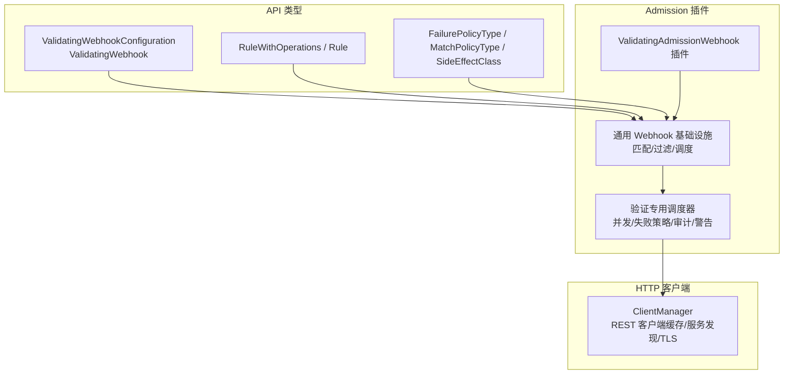
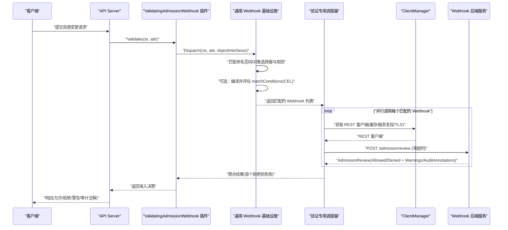
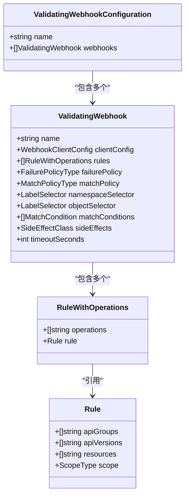
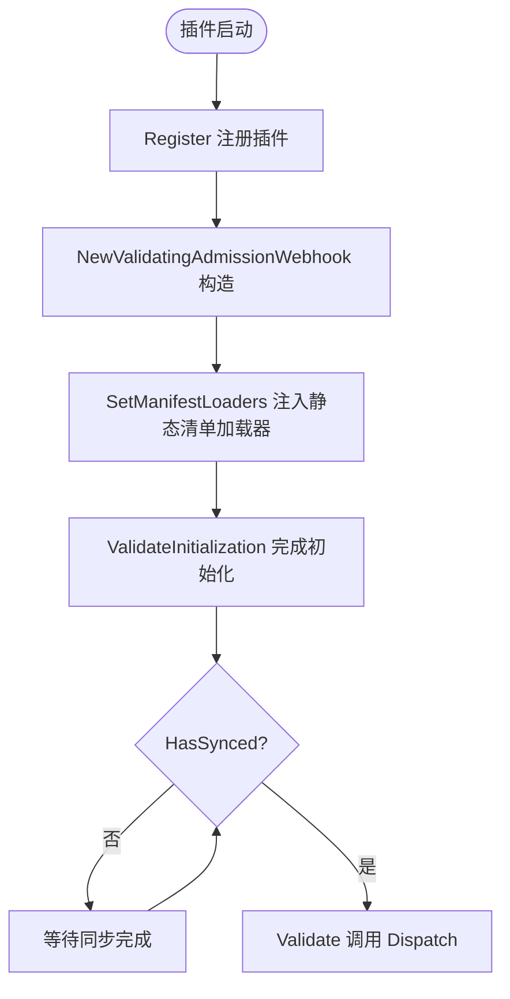
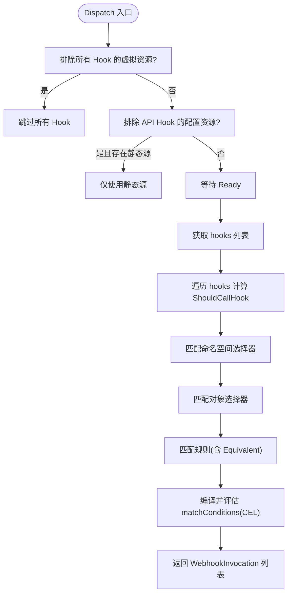
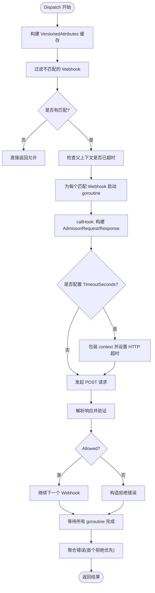
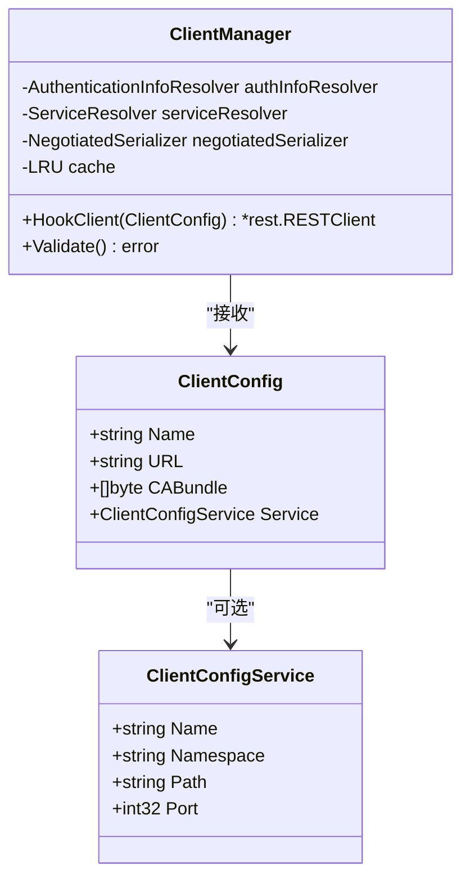
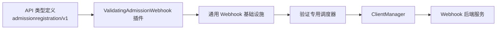

# Validating Webhook

<cite>
**本文引用的文件**   
- [pkg/apis/admissionregistration/types.go](file://pkg/apis/admissionregistration/types.go)
- [staging/src/k8s.io/api/admissionregistration/v1/types.go](file://staging/src/k8s.io/api/admissionregistration/v1/types.go)
- [staging/src/k8s.io/apiserver/pkg/admission/plugin/webhook/validating/plugin.go](file://staging/src/k8s.io/apiserver/pkg/admission/plugin/webhook/validating/plugin.go)
- [staging/src/k8s.io/apiserver/pkg/admission/plugin/webhook/generic/webhook.go](file://staging/src/k8s.io/apiserver/pkg/admission/plugin/webhook/generic/webhook.go)
- [staging/src/k8s.io/apiserver/pkg/admission/plugin/webhook/validating/dispatcher.go](file://staging/src/k8s.io/apiserver/pkg/admission/plugin/webhook/validating/dispatcher.go)
- [staging/src/k8s.io/apiserver/pkg/util/webhook/client.go](file://staging/src/k8s.io/apiserver/pkg/util/webhook/client.go)
</cite>

## 目录
1. [简介](#简介)
2. [项目结构](#项目结构)
3. [核心组件](#核心组件)
4. [架构总览](#架构总览)
5. [详细组件分析](#详细组件分析)
6. [依赖关系分析](#依赖关系分析)
7. [性能考虑](#性能考虑)
8. [故障排查指南](#故障排查指南)
9. [结论](#结论)
10. [附录](#附录)

## 简介
本文件面向在 Kubernetes 中开发和使用 Validating Webhook 的工程师，系统性阐述其工作原理、执行时机、配置方法、验证逻辑实现与错误响应格式，并提供认证授权、超时处理、错误处理策略、性能优化建议、调试技巧以及测试方法与最佳实践。文档内容基于仓库中的源码进行解析，确保技术细节准确可追溯。

## 项目结构
Validating Webhook 的核心实现位于 apiserver 的 admission 插件体系中，主要涉及以下模块：
- API 类型定义：ValidatingWebhookConfiguration、ValidatingWebhook、RuleWithOperations、FailurePolicyType、MatchPolicyType、SideEffectClass 等
- Admission 插件注册与入口：ValidatingAdmissionWebhook 插件
- 通用 Webhook 基础设施：匹配规则、命名空间/对象选择器、匹配条件（CEL）、静态与 API 源组合、调度分发
- 验证专用调度器：并发调用、失败策略、审计注解、警告头、指标上报
- HTTP 客户端管理：REST 客户端缓存、服务发现、TLS、负载均衡、超时控制

**图示来源** 
- [staging/src/k8s.io/apiserver/pkg/admission/plugin/webhook/validating/plugin.go:30-86](file://staging/src/k8s.io/apiserver/pkg/admission/plugin/webhook/validating/plugin.go#L30-L86)
- [staging/src/k8s.io/apiserver/pkg/admission/plugin/webhook/generic/webhook.go:52-94](file://staging/src/k8s.io/apiserver/pkg/admission/plugin/webhook/generic/webhook.go#L52-L94)
- [staging/src/k8s.io/apiserver/pkg/admission/plugin/webhook/validating/dispatcher.go:55-64](file://staging/src/k8s.io/apiserver/pkg/admission/plugin/webhook/validating/dispatcher.go#L55-L64)
- [staging/src/k8s.io/apiserver/pkg/util/webhook/client.go:62-86](file://staging/src/k8s.io/apiserver/pkg/util/webhook/client.go#L62-L86)
- [pkg/apis/admissionregistration/types.go:690-800](file://pkg/apis/admissionregistration/types.go#L690-L800)
- [staging/src/k8s.io/api/admissionregistration/v1/types.go:729-800](file://staging/src/k8s.io/api/admissionregistration/v1/types.go#L729-L800)

**章节来源**
- [pkg/apis/admissionregistration/types.go:690-800](file://pkg/apis/admissionregistration/types.go#L690-L800)
- [staging/src/k8s.io/api/admissionregistration/v1/types.go:729-800](file://staging/src/k8s.io/api/admissionregistration/v1/types.go#L729-L800)
- [staging/src/k8s.io/apiserver/pkg/admission/plugin/webhook/validating/plugin.go:30-86](file://staging/src/k8s.io/apiserver/pkg/admission/plugin/webhook/validating/plugin.go#L30-L86)
- [staging/src/k8s.io/apiserver/pkg/admission/plugin/webhook/generic/webhook.go:52-94](file://staging/src/k8s.io/apiserver/pkg/admission/plugin/webhook/generic/webhook.go#L52-L94)
- [staging/src/k8s.io/apiserver/pkg/admission/plugin/webhook/validating/dispatcher.go:55-64](file://staging/src/k8s.io/apiserver/pkg/admission/plugin/webhook/validating/dispatcher.go#L55-L64)
- [staging/src/k8s.io/apiserver/pkg/util/webhook/client.go:62-86](file://staging/src/k8s.io/apiserver/pkg/util/webhook/client.go#L62-L86)

## 核心组件
- ValidatingWebhookConfiguration 与 ValidatingWebhook：声明式配置，指定要拦截的资源、操作、匹配策略、失败策略、侧写行为、客户端连接方式等
- ValidatingAdmissionWebhook 插件：将通用 Webhook 能力封装为 admission 插件，提供 Validate 钩子
- 通用 Webhook 基础设施：负责从 API 或静态清单加载配置、构建 Source、匹配命名空间/对象选择器与规则、编译并评估 matchConditions（CEL）
- 验证专用调度器：并行调用匹配的 Webhook，统一处理错误、失败策略、审计注解、警告头、指标与追踪
- ClientManager：创建并缓存 REST 客户端，支持 Service 发现、TLS CA 合并、http/1.1 强制、负载均衡与超时传递

**章节来源**
- [pkg/apis/admissionregistration/types.go:690-800](file://pkg/apis/admissionregistration/types.go#L690-L800)
- [staging/src/k8s.io/api/admissionregistration/v1/types.go:729-800](file://staging/src/k8s.io/api/admissionregistration/v1/types.go#L729-L800)
- [staging/src/k8s.io/apiserver/pkg/admission/plugin/webhook/validating/plugin.go:30-86](file://staging/src/k8s.io/apiserver/pkg/admission/plugin/webhook/validating/plugin.go#L30-L86)
- [staging/src/k8s.io/apiserver/pkg/admission/plugin/webhook/generic/webhook.go:122-158](file://staging/src/k8s.io/apiserver/pkg/admission/plugin/webhook/generic/webhook.go#L122-L158)
- [staging/src/k8s.io/apiserver/pkg/admission/plugin/webhook/validating/dispatcher.go:88-116](file://staging/src/k8s.io/apiserver/pkg/admission/plugin/webhook/validating/dispatcher.go#L88-L116)
- [staging/src/k8s.io/apiserver/pkg/util/webhook/client.go:125-146](file://staging/src/k8s.io/apiserver/pkg/util/webhook/client.go#L125-L146)

## 架构总览
下图展示了请求进入 API Server 后，如何被 Validating Webhook 插件拦截、匹配、并发调用后端服务，并最终返回允许或拒绝结果的整体流程。

**图示来源** 
- [staging/src/k8s.io/apiserver/pkg/admission/plugin/webhook/validating/plugin.go:82-86](file://staging/src/k8s.io/apiserver/pkg/admission/plugin/webhook/validating/plugin.go#L82-L86)
- [staging/src/k8s.io/apiserver/pkg/admission/plugin/webhook/generic/webhook.go:296-385](file://staging/src/k8s.io/apiserver/pkg/admission/plugin/webhook/generic/webhook.go#L296-L385)
- [staging/src/k8s.io/apiserver/pkg/admission/plugin/webhook/validating/dispatcher.go:88-116](file://staging/src/k8s.io/apiserver/pkg/admission/plugin/webhook/validating/dispatcher.go#L88-L116)
- [staging/src/k8s.io/apiserver/pkg/util/webhook/client.go:125-146](file://staging/src/k8s.io/apiserver/pkg/util/webhook/client.go#L125-L146)

## 详细组件分析

### 组件一：ValidatingWebhookConfiguration 与 ValidatingWebhook（配置模型）
- 作用：声明哪些 API 组/版本/资源/操作需要被校验；定义失败策略、匹配策略、命名空间/对象选择器、matchConditions、SideEffects、客户端连接信息（Service 或 URL）
- 关键字段与语义：
  - Rules：资源与操作的匹配规则，支持通配符与子资源
  - FailurePolicy：Ignore/Fail，决定后端不可用时是否放行
  - MatchPolicy：Exact/Equivalent，决定是否对等价资源进行转换匹配
  - NamespaceSelector/ObjectSelector：按标签选择目标对象
  - MatchConditions：CEL 表达式，进一步过滤请求
  - SideEffectClass：Unknown/None/Some/NoneOnDryRun，控制 dry-run 场景下的行为
  - ClientConfig：Service 或 URL，CABundle，用于建立 TLS 连接与服务发现

**图示来源** 
- [pkg/apis/admissionregistration/types.go:690-800](file://pkg/apis/admissionregistration/types.go#L690-L800)
- [staging/src/k8s.io/api/admissionregistration/v1/types.go:729-800](file://staging/src/k8s.io/api/admissionregistration/v1/types.go#L729-L800)

**章节来源**
- [pkg/apis/admissionregistration/types.go:690-800](file://pkg/apis/admissionregistration/types.go#L690-L800)
- [staging/src/k8s.io/api/admissionregistration/v1/types.go:729-800](file://staging/src/k8s.io/api/admissionregistration/v1/types.go#L729-L800)

### 组件二：ValidatingAdmissionWebhook 插件（入口与生命周期）
- 注册与构造：通过 Register 注册插件名，NewValidatingAdmissionWebhook 创建实例并绑定 Handler
- 生命周期：SetManifestLoaders 注入静态清单加载器；SetExternalKubeInformerFactory 设置 Informer；ValidateInitialization 完成初始化与准备就绪检查
- 验证入口：Validate 委托给通用 Webhook 的 Dispatch

**图示来源** 
- [staging/src/k8s.io/apiserver/pkg/admission/plugin/webhook/validating/plugin.go:35-80](file://staging/src/k8s.io/apiserver/pkg/admission/plugin/webhook/validating/plugin.go#L35-L80)
- [staging/src/k8s.io/apiserver/pkg/admission/plugin/webhook/generic/webhook.go:231-294](file://staging/src/k8s.io/apiserver/pkg/admission/plugin/webhook/generic/webhook.go#L231-L294)

**章节来源**
- [staging/src/k8s.io/apiserver/pkg/admission/plugin/webhook/validating/plugin.go:35-80](file://staging/src/k8s.io/apiserver/pkg/admission/plugin/webhook/validating/plugin.go#L35-L80)
- [staging/src/k8s.io/apiserver/pkg/admission/plugin/webhook/generic/webhook.go:231-294](file://staging/src/k8s.io/apiserver/pkg/admission/plugin/webhook/generic/webhook.go#L231-L294)

### 组件三：通用 Webhook 基础设施（匹配与调度）
- 职责：
  - 从 API 或静态清单加载 Webhook 配置，构建 Source
  - 根据命名空间/对象选择器与规则进行匹配
  - 支持 Equivalent 模式，将请求转换为等价资源再匹配
  - 编译并评估 matchConditions（CEL），结合 authorizer 做权限判断
  - 排除虚拟资源与配置资源以避免循环依赖
- 关键方法：ShouldCallHook、Dispatch

**图示来源** 
- [staging/src/k8s.io/apiserver/pkg/admission/plugin/webhook/generic/webhook.go:296-385](file://staging/src/k8s.io/apiserver/pkg/admission/plugin/webhook/generic/webhook.go#L296-L385)
- [staging/src/k8s.io/apiserver/pkg/admission/plugin/webhook/generic/webhook.go:408-433](file://staging/src/k8s.io/apiserver/pkg/admission/plugin/webhook/generic/webhook.go#L408-L433)

**章节来源**
- [staging/src/k8s.io/apiserver/pkg/admission/plugin/webhook/generic/webhook.go:296-385](file://staging/src/k8s.io/apiserver/pkg/admission/plugin/webhook/generic/webhook.go#L296-L385)
- [staging/src/k8s.io/apiserver/pkg/admission/plugin/webhook/generic/webhook.go:408-433](file://staging/src/k8s.io/apiserver/pkg/admission/plugin/webhook/generic/webhook.go#L408-L433)

### 组件四：验证专用调度器（并发调用与错误处理）
- 并发模型：为每个匹配的 Webhook 启动 goroutine 并行调用，WaitGroup 汇总结果
- 失败策略：
  - Ignore：连接错误或内部错误时放行，记录审计注解与指标
  - Fail：连接错误或内部错误时拒绝请求
- 错误分类：
  - ErrCallingWebhook：调用失败（网络/超时/服务端错误）
  - ErrWebhookRejection：后端明确拒绝（Allowed=false）
- 审计与警告：
  - 将后端返回的 AuditAnnotations 写入请求属性
  - 将 Warnings 添加到上下文，供上层以 HTTP Warning 头返回
- 超时控制：
  - 若 Webhook 配置了 TimeoutSeconds，包装 context 并设置 HTTP 超时
  - 若父上下文有截止时间，向上取整到秒并传递给后端

**图示来源** 
- [staging/src/k8s.io/apiserver/pkg/admission/plugin/webhook/validating/dispatcher.go:88-116](file://staging/src/k8s.io/apiserver/pkg/admission/plugin/webhook/validating/dispatcher.go#L88-L116)
- [staging/src/k8s.io/apiserver/pkg/admission/plugin/webhook/validating/dispatcher.go:248-333](file://staging/src/k8s.io/apiserver/pkg/admission/plugin/webhook/validating/dispatcher.go#L248-L333)

**章节来源**
- [staging/src/k8s.io/apiserver/pkg/admission/plugin/webhook/validating/dispatcher.go:88-116](file://staging/src/k8s.io/apiserver/pkg/admission/plugin/webhook/validating/dispatcher.go#L88-L116)
- [staging/src/k8s.io/apiserver/pkg/admission/plugin/webhook/validating/dispatcher.go:248-333](file://staging/src/k8s.io/apiserver/pkg/admission/plugin/webhook/validating/dispatcher.go#L248-L333)

### 组件五：HTTP 客户端管理（认证、服务发现、TLS、负载均衡）
- 客户端缓存：按 ClientConfig 去重缓存 REST 客户端，避免重复创建
- 认证信息：通过 AuthenticationInfoResolver 生成证书/令牌等凭据
- 服务发现：
  - 支持 Service 模式：自动拼接 Host/Path，默认端口 443
  - 支持 URL 模式：解析 host/port/path
  - 可选择启用 RoundTrip 负载均衡（FeatureGate）
- TLS：
  - 合并 CABundle 与 rest.Config 中的 CAData
  - 非本地主机强制 http/1.1，规避 http/2 并发负载不均问题
- 超时传递：根据 context 截止时间计算并设置 HTTP 超时

**图示来源** 
- [staging/src/k8s.io/apiserver/pkg/util/webhook/client.go:62-86](file://staging/src/k8s.io/apiserver/pkg/util/webhook/client.go#L62-L86)
- [staging/src/k8s.io/apiserver/pkg/util/webhook/client.go:125-146](file://staging/src/k8s.io/apiserver/pkg/util/webhook/client.go#L125-L146)
- [staging/src/k8s.io/apiserver/pkg/util/webhook/client.go:148-263](file://staging/src/k8s.io/apiserver/pkg/util/webhook/client.go#L148-L263)

**章节来源**
- [staging/src/k8s.io/apiserver/pkg/util/webhook/client.go:62-86](file://staging/src/k8s.io/apiserver/pkg/util/webhook/client.go#L62-L86)
- [staging/src/k8s.io/apiserver/pkg/util/webhook/client.go:125-146](file://staging/src/k8s.io/apiserver/pkg/util/webhook/client.go#L125-L146)
- [staging/src/k8s.io/apiserver/pkg/util/webhook/client.go:148-263](file://staging/src/k8s.io/apiserver/pkg/util/webhook/client.go#L148-L263)

## 依赖关系分析
- 插件层依赖通用 Webhook 基础设施，后者依赖匹配器（命名空间/对象/规则）、CEL 编译器、Authorizer、Source 工厂与分发器
- 验证专用调度器依赖 ClientManager 获取 REST 客户端，并通过它访问后端服务
- API 类型定义作为配置模型的权威来源，贯穿整个链路

**图示来源** 
- [staging/src/k8s.io/api/admissionregistration/v1/types.go:729-800](file://staging/src/k8s.io/api/admissionregistration/v1/types.go#L729-L800)
- [staging/src/k8s.io/apiserver/pkg/admission/plugin/webhook/validating/plugin.go:35-80](file://staging/src/k8s.io/apiserver/pkg/admission/plugin/webhook/validating/plugin.go#L35-L80)
- [staging/src/k8s.io/apiserver/pkg/admission/plugin/webhook/generic/webhook.go:122-158](file://staging/src/k8s.io/apiserver/pkg/admission/plugin/webhook/generic/webhook.go#L122-L158)
- [staging/src/k8s.io/apiserver/pkg/admission/plugin/webhook/validating/dispatcher.go:88-116](file://staging/src/k8s.io/apiserver/pkg/admission/plugin/webhook/validating/dispatcher.go#L88-L116)
- [staging/src/k8s.io/apiserver/pkg/util/webhook/client.go:125-146](file://staging/src/k8s.io/apiserver/pkg/util/webhook/client.go#L125-L146)

**章节来源**
- [staging/src/k8s.io/api/admissionregistration/v1/types.go:729-800](file://staging/src/k8s.io/api/admissionregistration/v1/types.go#L729-L800)
- [staging/src/k8s.io/apiserver/pkg/admission/plugin/webhook/validating/plugin.go:35-80](file://staging/src/k8s.io/apiserver/pkg/admission/plugin/webhook/validating/plugin.go#L35-L80)
- [staging/src/k8s.io/apiserver/pkg/admission/plugin/webhook/generic/webhook.go:122-158](file://staging/src/k8s.io/apiserver/pkg/admission/plugin/webhook/generic/webhook.go#L122-L158)
- [staging/src/k8s.io/apiserver/pkg/admission/plugin/webhook/validating/dispatcher.go:88-116](file://staging/src/k8s.io/apiserver/pkg/admission/plugin/webhook/validating/dispatcher.go#L88-L116)
- [staging/src/k8s.io/apiserver/pkg/util/webhook/client.go:125-146](file://staging/src/k8s.io/apiserver/pkg/util/webhook/client.go#L125-L146)

## 性能考虑
- 并发调用：验证调度器并行调用匹配的 Webhook，减少端到端延迟
- 客户端缓存：ClientManager 缓存 REST 客户端，降低握手与序列化开销
- 超时控制：合理设置 TimeoutSeconds，避免长尾请求拖慢整体吞吐
- 失败策略：生产环境谨慎使用 Ignore，避免静默放行导致安全漏洞
- 匹配优化：精确配置 Rules 与选择器，减少不必要的 Webhook 调用
- 指标与追踪：利用内置指标与 OpenTelemetry 追踪定位瓶颈

[本节为通用指导，无需特定文件来源]

## 故障排查指南
- 常见错误类型：
  - 调用失败：ErrCallingWebhook（网络/超时/服务端错误）
  - 拒绝：ErrWebhookRejection（Allowed=false）
  - 内部错误：panic 或异常路径导致的 InternalError
- 失败策略影响：
  - Ignore：连接错误时放行，并记录审计注解与指标
  - Fail：连接错误时拒绝请求
- 调试要点：
  - 检查 Webhook 配置（Service/URL、CABundle、TimeoutSeconds、FailurePolicy、SideEffects）
  - 观察指标与日志（拒绝原因、调用耗时、失败次数）
  - 确认匹配条件（命名空间/对象选择器、规则、matchConditions）
  - 验证干跑行为（SideEffects 必须为 None 或 NoneOnDryRun）

**章节来源**
- [staging/src/k8s.io/apiserver/pkg/admission/plugin/webhook/validating/dispatcher.go:170-227](file://staging/src/k8s.io/apiserver/pkg/admission/plugin/webhook/validating/dispatcher.go#L170-L227)
- [staging/src/k8s.io/apiserver/pkg/admission/plugin/webhook/validating/dispatcher.go:248-333](file://staging/src/k8s.io/apiserver/pkg/admission/plugin/webhook/validating/dispatcher.go#L248-L333)

## 结论
Validating Webhook 提供了强大而灵活的集群级校验能力。通过合理的配置与实现，可以在保证安全与合规的同时，兼顾性能与稳定性。建议在开发阶段充分使用单元测试与集成测试，在生产环境谨慎配置失败策略与超时参数，并结合指标与日志持续优化。

[本节为总结性内容，无需特定文件来源]

## 附录

### 开发与部署步骤（概念性流程）
- 编写 Webhook 后端服务，实现 /admissionreview 接口，返回 AdmissionReview
- 生成证书与密钥，配置 CABundle
- 创建 ValidatingWebhookConfiguration，声明匹配规则与客户端连接信息
- 部署后端服务，并确保可达性与证书正确
- 验证匹配与拒绝行为，收集指标与日志

[本节为概念性说明，无需特定文件来源]

### 认证与授权
- 认证：ClientManager 通过 AuthenticationInfoResolver 为 Webhook 请求注入凭据（如证书/令牌）
- 授权：matchConditions 可使用 authorizer 变量进行二次授权检查

**章节来源**
- [staging/src/k8s.io/apiserver/pkg/util/webhook/client.go:148-263](file://staging/src/k8s.io/apiserver/pkg/util/webhook/client.go#L148-L263)
- [staging/src/k8s.io/apiserver/pkg/admission/plugin/webhook/generic/webhook.go:364-382](file://staging/src/k8s.io/apiserver/pkg/admission/plugin/webhook/generic/webhook.go#L364-L382)

### 超时处理与错误响应格式
- 超时：
  - Webhook 配置 TimeoutSeconds 会包装 context 并设置 HTTP 超时
  - 父上下文截止时间会被上取整到秒并传递给后端
- 错误响应：
  - 拒绝：Allowed=false，附带 StatusReason 与消息
  - 调用失败：ErrCallingWebhook，根据 FailurePolicy 决定放行或拒绝
  - 警告：Warnings 通过 HTTP Warning 头返回

**章节来源**
- [staging/src/k8s.io/apiserver/pkg/admission/plugin/webhook/validating/dispatcher.go:276-296](file://staging/src/k8s.io/apiserver/pkg/admission/plugin/webhook/validating/dispatcher.go#L276-L296)
- [staging/src/k8s.io/apiserver/pkg/admission/plugin/webhook/validating/dispatcher.go:315-333](file://staging/src/k8s.io/apiserver/pkg/admission/plugin/webhook/validating/dispatcher.go#L315-L333)

### 测试方法与最佳实践
- 单元测试：模拟 AdmissionReview 请求与响应，覆盖允许、拒绝、错误分支
- 集成测试：使用测试证书与最小化集群，验证完整链路
- 最佳实践：
  - 精确匹配规则，避免过度拦截
  - 合理设置 FailurePolicy 与 TimeoutSeconds
  - 使用 SideEffectClass=None/NoneOnDryRun 保障干跑一致性
  - 输出清晰的拒绝消息与审计注解，便于排障

[本节为通用指导，无需特定文件来源]