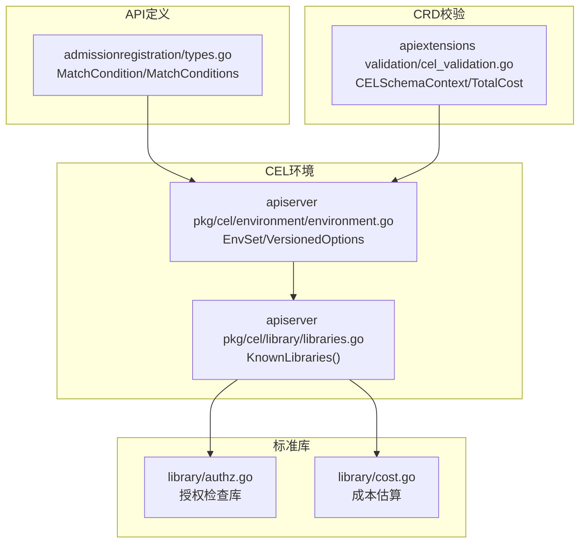
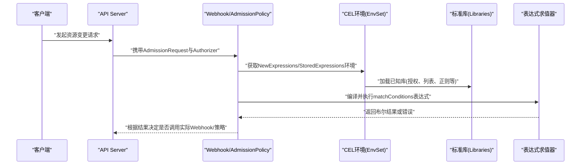
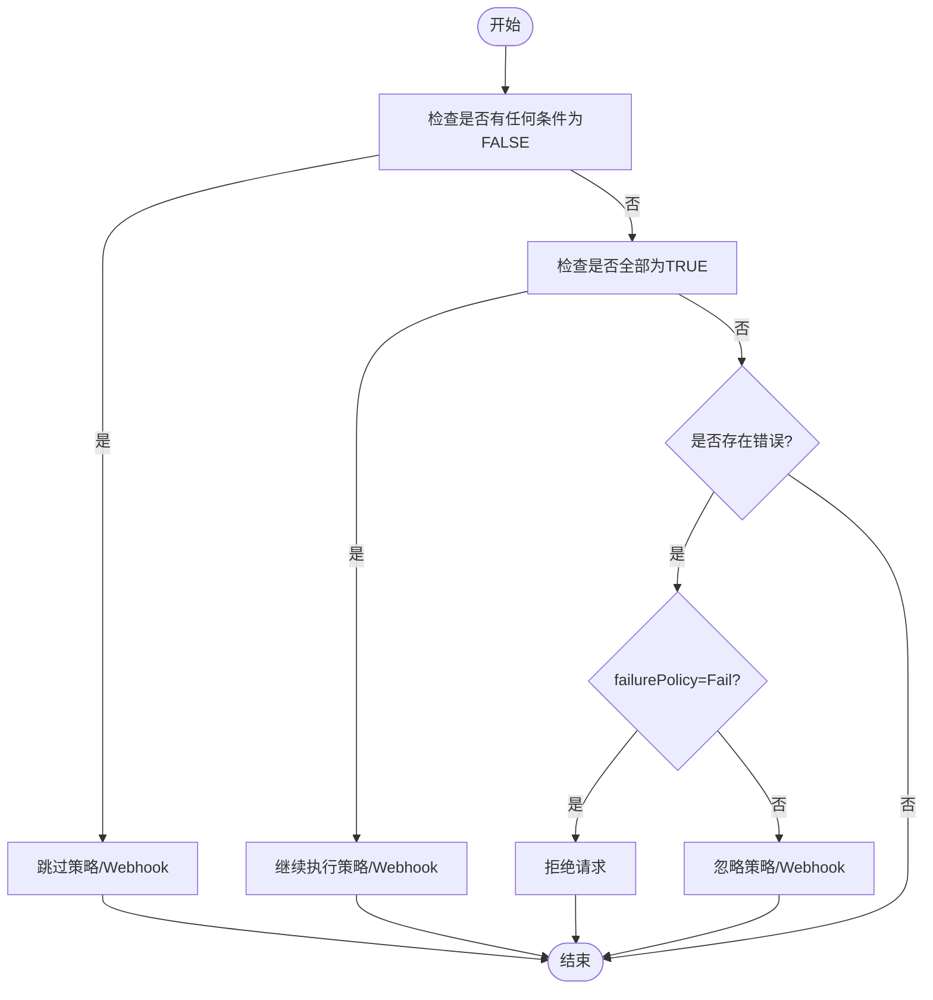
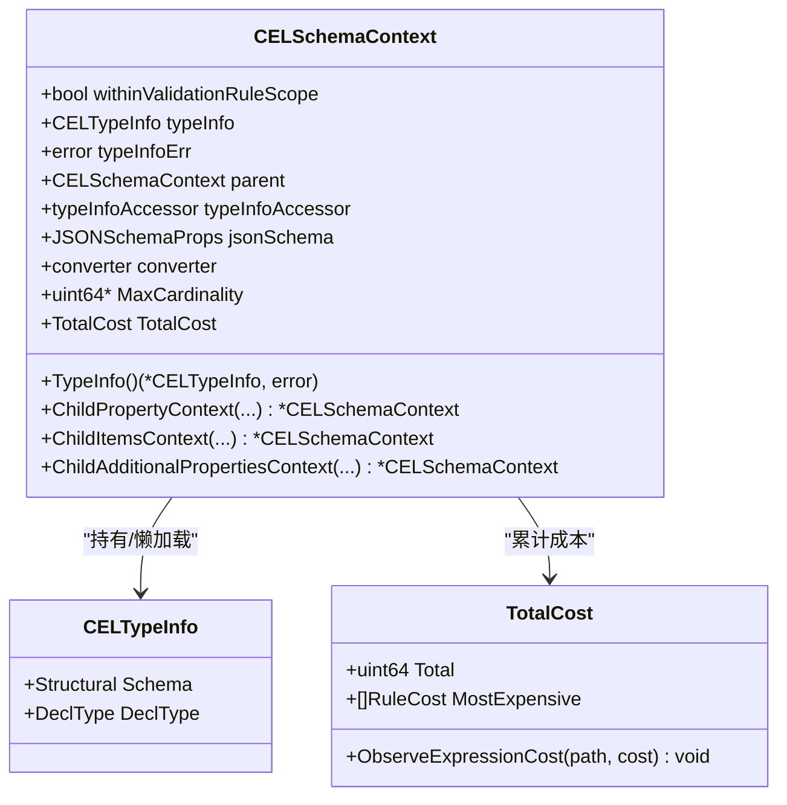
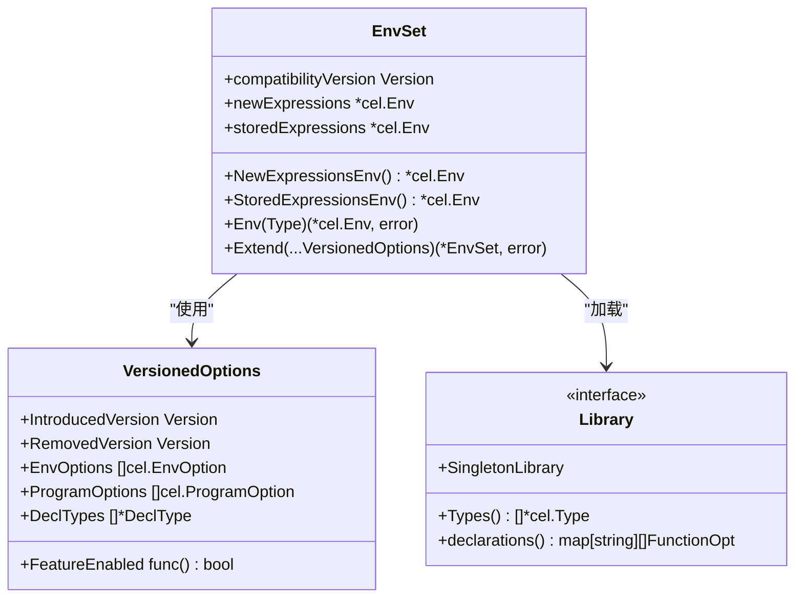
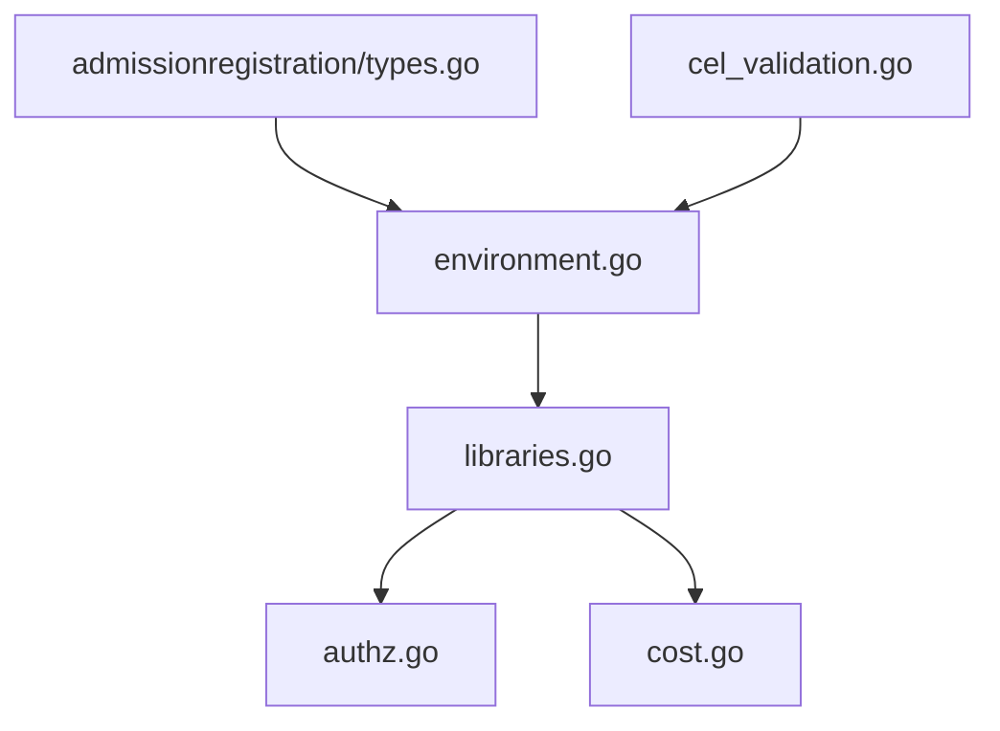

# CEL表达式引擎

<cite>
**本文引用的文件**   
- [types.go](file://pkg/apis/admissionregistration/types.go)
- [cel_validation.go](file://staging/src/k8s.io/apiextensions-apiserver/pkg/apis/apiextensions/validation/cel_validation.go)
- [environment.go](file://staging/src/k8s.io/apiserver/pkg/cel/environment/environment.go)
- [libraries.go](file://staging/src/k8s.io/apiserver/pkg/cel/library/libraries.go)
- [authz.go](file://staging/src/k8s.io/apiserver/pkg/cel/library/authz.go)
- [cost.go](file://staging/src/k8s.io/apiserver/pkg/cel/library/cost.go)
</cite>

## 目录
1. [简介](#简介)
2. [项目结构](#项目结构)
3. [核心组件](#核心组件)
4. [架构总览](#架构总览)
5. [详细组件分析](#详细组件分析)
6. [依赖关系分析](#依赖关系分析)
7. [性能考虑](#性能考虑)
8. [故障排查指南](#故障排查指南)
9. [结论](#结论)
10. [附录](#附录) 

## 简介
本技术文档聚焦于Kubernetes中CEL（Common Expression Language）表达式引擎在Webhook与准入策略中的应用，围绕以下目标展开：
- 解释CEL在Webhook中的角色、变量模型与扩展机制
- 深入说明matchConditions的语义、匹配顺序与错误处理
- 提供CEL表达式开发指南：变量访问、条件判断、复杂逻辑构建
- 给出性能优化技巧与表达式缓存机制建议
- 提供调试工具与测试方法指引

## 项目结构
与CEL相关的核心代码分布在如下模块：
- API定义层：admissionregistration包定义了MatchCondition等类型，用于Webhook和AdmissionPolicy的匹配条件
- CRD校验层：apiextensions-apiserver的CEL校验上下文与成本统计，支撑x-kubernetes-validations规则
- apiserver CEL环境：EnvSet管理不同版本的CEL环境、库与类型声明
- 标准库：authz、lists、regex、quantity、ip、cidr、format、semver、jsonpatch等函数库

图示来源 
- [types.go:1140-1280](file://pkg/apis/admissionregistration/types.go#L1140-L1280)
- [cel_validation.go:35-145](file://staging/src/k8s.io/apiextensions-apiserver/pkg/apis/apiextensions/validation/cel_validation.go#L35-L145)
- [environment.go:63-124](file://staging/src/k8s.io/apiserver/pkg/cel/environment/environment.go#L63-L124)
- [libraries.go:35-50](file://staging/src/k8s.io/apiserver/pkg/cel/library/libraries.go#L35-L50)
- [authz.go:1-200](file://staging/src/k8s.io/apiserver/pkg/cel/library/authz.go#L1-L200)
- [cost.go:1-200](file://staging/src/k8s.io/apiserver/pkg/cel/library/cost.go#L1-L200)

章节来源
- [types.go:1140-1280](file://pkg/apis/admissionregistration/types.go#L1140-L1280)
- [cel_validation.go:35-145](file://staging/src/k8s.io/apiextensions-apiserver/pkg/apis/apiextensions/validation/cel_validation.go#L35-L145)
- [environment.go:63-124](file://staging/src/k8s.io/apiserver/pkg/cel/environment/environment.go#L63-L124)
- [libraries.go:35-50](file://staging/src/k8s.io/apiserver/pkg/cel/library/libraries.go#L35-L50)

## 核心组件
- MatchCondition与MatchConditions
  - 用于Webhook与AdmissionPolicy的请求过滤。每个条件包含Name与Expression，Expression必须返回布尔值
  - 匹配顺序与结果：
    - 若任意条件为FALSE，则跳过该策略/Webhook
    - 若全部为TRUE，则执行后续逻辑
    - 若存在错误且无FALSE：根据failurePolicy决定拒绝或忽略
- CELSchemaContext与TotalCost
  - CELSchemaContext维护CRD x-kubernetes-validations规则的上下文与类型信息
  - TotalCost累计所有规则的估计成本，并记录最昂贵的若干条规则，便于定位瓶颈
- EnvSet与VersionedOptions
  - 管理NewExpressions与StoredExpressions两类环境，支持按版本与特性门控启用/移除库与类型
  - 通过Extend组合多个VersionedOptions，注册DeclTypes、环境变量与程序选项
- 标准库集合
  - KnownLibraries列出所有内置库，如授权检查、列表操作、正则、数量、IP/CIDR、格式化、语义化版本、JSON Patch等

章节来源
- [types.go:1140-1280](file://pkg/apis/admissionregistration/types.go#L1140-L1280)
- [cel_validation.go:260-294](file://staging/src/k8s.io/apiextensions-apiserver/pkg/apis/apiextensions/validation/cel_validation.go#L260-L294)
- [environment.go:63-124](file://staging/src/k8s.io/apiserver/pkg/cel/environment/environment.go#L63-L124)
- [libraries.go:35-50](file://staging/src/k8s.io/apiserver/pkg/cel/library/libraries.go#L35-L50)

## 架构总览
下图展示了从请求进入至CEL表达式评估的整体流程，包括变量注入、库加载、编译与执行路径。

图示来源 
- [types.go:1140-1280](file://pkg/apis/admissionregistration/types.go#L1140-L1280)
- [environment.go:63-124](file://staging/src/k8s.io/apiserver/pkg/cel/environment/environment.go#L63-L124)
- [libraries.go:35-50](file://staging/src/k8s.io/apiserver/pkg/cel/library/libraries.go#L35-L50)

## 详细组件分析

### MatchCondition与匹配语义
- 字段与约束
  - Name：用于合并与日志标识，需符合限定名规范
  - Expression：CEL表达式，必须返回布尔值；可访问object、oldObject、request、authorizer、variables等变量
- 匹配顺序与错误处理
  - ANY为FALSE则跳过
  - ALL为TRUE则继续
  - 存在错误且无FALSE时，依据failurePolicy决定拒绝或忽略

图示来源 
- [types.go:1140-1280](file://pkg/apis/admissionregistration/types.go#L1140-L1280)

章节来源
- [types.go:1140-1280](file://pkg/apis/admissionregistration/types.go#L1140-L1280)

### CELSchemaContext与类型信息
- 作用
  - 维护当前schema节点是否在验证规则作用域内
  - 懒加载CEL类型信息，优先从父级TypeInfoAccessor提取，否则转换JSONSchema为Structural与DeclType
- 关键方法
  - TypeInfo：返回CEL类型信息或错误
  - ChildPropertyContext/ChildItemsContext/ChildAdditionalPropertiesContext：构造子节点上下文
- 复杂度
  - 从父级提取TypeInfo为O(1)
  - 从JSONSchema转换为Structural与DeclType为昂贵操作，应避免频繁触发

图示来源 
- [cel_validation.go:35-145](file://staging/src/k8s.io/apiextensions-apiserver/pkg/apis/apiextensions/validation/cel_validation.go#L35-L145)
- [cel_validation.go:260-294](file://staging/src/k8s.io/apiextensions-apiserver/pkg/apis/apiextensions/validation/cel_validation.go#L260-L294)

章节来源
- [cel_validation.go:35-145](file://staging/src/k8s.io/apiextensions-apiserver/pkg/apis/apiextensions/validation/cel_validation.go#L35-L145)
- [cel_validation.go:260-294](file://staging/src/k8s.io/apiextensions-apiserver/pkg/apis/apiextensions/validation/cel_validation.go#L260-L294)

### CEL环境与库管理
- EnvSet
  - 维护NewExpressions与StoredExpressions两种环境
  - NewExpressions用于新写入表达式的校验，受兼容版本与特性门控限制
  - StoredExpressions用于运行已持久化的表达式，尽可能向后兼容
- VersionedOptions
  - 控制引入/移除版本、特性门控、EnvOption、ProgramOption与DeclTypes
  - Extend将多个选项组合到环境中，避免重复创建
- 标准库
  - KnownLibraries返回所有内置库，包括授权检查、列表、正则、数量、IP/CIDR、格式、语义化版本、JSON Patch等

图示来源 
- [environment.go:63-124](file://staging/src/k8s.io/apiserver/pkg/cel/environment/environment.go#L63-L124)
- [environment.go:126-201](file://staging/src/k8s.io/apiserver/pkg/cel/environment/environment.go#L126-L201)
- [libraries.go:23-50](file://staging/src/k8s.io/apiserver/pkg/cel/library/libraries.go#L23-L50)

章节来源
- [environment.go:63-124](file://staging/src/k8s.io/apiserver/pkg/cel/environment/environment.go#L63-L124)
- [environment.go:126-201](file://staging/src/k8s.io/apiserver/pkg/cel/environment/environment.go#L126-L201)
- [libraries.go:23-50](file://staging/src/k8s.io/apiserver/pkg/cel/library/libraries.go#L23-L50)

### 变量模型与扩展机制
- 内置变量
  - object：入站请求对象（DELETE时为null）
  - oldObject：现有对象（CREATE时为null）
  - request：AdmissionRequest属性
  - authorizer：授权检查器，支持authorizer.requestResource进行资源级授权检查
  - variables：组合变量映射，按需惰性求值
- 扩展方式
  - 通过VersionedOptions注册DeclTypes与cel.Variable，使自定义类型与变量可用
  - 通过KnownLibraries扩展函数库，新增类型与函数

章节来源
- [types.go:1140-1280](file://pkg/apis/admissionregistration/types.go#L1140-L1280)
- [environment.go:126-201](file://staging/src/k8s.io/apiserver/pkg/cel/environment/environment.go#L126-L201)
- [libraries.go:35-50](file://staging/src/k8s.io/apiserver/pkg/cel/library/libraries.go#L35-L50)

### 表达式开发指南与实践要点
- 变量访问
  - 直接访问object、oldObject、request、authorizer、variables.*
  - 使用authorizer.requestResource进行细粒度授权检查
- 条件判断与复杂逻辑
  - 使用布尔表达式组合AND/OR/NOT
  - 利用标准库函数（列表、正则、数量、IP/CIDR、格式、语义化版本、JSON Patch）增强表达能力
- 示例思路（以路径引用代替具体代码）
  - 基于命名空间与对象标签的匹配：参考[types.go:1140-1280](file://pkg/apis/admissionregistration/types.go#L1140-L1280)
  - 使用授权库进行权限判定：参考[authz.go:1-200](file://staging/src/k8s.io/apiserver/pkg/cel/library/authz.go#L1-L200)
  - 使用列表与正则进行模式匹配：参考[libraries.go:35-50](file://staging/src/k8s.io/apiserver/pkg/cel/library/libraries.go#L35-L50)

章节来源
- [types.go:1140-1280](file://pkg/apis/admissionregistration/types.go#L1140-L1280)
- [authz.go:1-200](file://staging/src/k8s.io/apiserver/pkg/cel/library/authz.go#L1-L200)
- [libraries.go:35-50](file://staging/src/k8s.io/apiserver/pkg/cel/library/libraries.go#L35-L50)

## 依赖关系分析
- 组件耦合
  - admissionregistration/types.go定义MatchCondition，被Webhook与AdmissionPolicy消费
  - apiextensions-apiserver的CEL校验上下文与成本统计服务于CRD规则，与EnvSet交互
  - EnvSet聚合VersionedOptions与标准库，统一暴露NewExpressions与StoredExpressions环境
- 外部依赖
  - google/cel-go作为底层表达式引擎
  - Kubernetes内部类型与OpenAPI声明驱动DeclType生成

图示来源 
- [types.go:1140-1280](file://pkg/apis/admissionregistration/types.go#L1140-L1280)
- [environment.go:63-124](file://staging/src/k8s.io/apiserver/pkg/cel/environment/environment.go#L63-L124)
- [libraries.go:35-50](file://staging/src/k8s.io/apiserver/pkg/cel/library/libraries.go#L35-L50)
- [authz.go:1-200](file://staging/src/k8s.io/apiserver/pkg/cel/library/authz.go#L1-L200)
- [cost.go:1-200](file://staging/src/k8s.io/apiserver/pkg/cel/library/cost.go#L1-L200)
- [cel_validation.go:35-145](file://staging/src/k8s.io/apiextensions-apiserver/pkg/apis/apiextensions/validation/cel_validation.go#L35-L145)

章节来源
- [types.go:1140-1280](file://pkg/apis/admissionregistration/types.go#L1140-L1280)
- [environment.go:63-124](file://staging/src/k8s.io/apiserver/pkg/cel/environment/environment.go#L63-L124)
- [libraries.go:35-50](file://staging/src/k8s.io/apiserver/pkg/cel/library/libraries.go#L35-L50)
- [authz.go:1-200](file://staging/src/k8s.io/apiserver/pkg/cel/library/authz.go#L1-L200)
- [cost.go:1-200](file://staging/src/k8s.io/apiserver/pkg/cel/library/cost.go#L1-L200)
- [cel_validation.go:35-145](file://staging/src/k8s.io/apiextensions-apiserver/pkg/apis/apiextensions/validation/cel_validation.go#L35-L145)

## 性能考虑
- 表达式成本估算
  - TotalCost累计所有规则的估计成本，并记录最昂贵的若干条规则，便于定位瓶颈
  - 建议在编写复杂表达式时关注成本贡献，避免高开销操作
- 环境复用与缓存
  - EnvSet.Extend为昂贵操作，应在初始化阶段完成，避免在请求路径中频繁调用
  - 重用EnvSet编译的CEL程序，减少重复编译开销
- 类型信息懒加载
  - CELSchemaContext优先从父级TypeInfoAccessor提取类型信息，避免昂贵的JSONSchema转换
- 库选择与最小化
  - 仅注册必要的DeclTypes与库，降低环境体积与解析时间

章节来源
- [cel_validation.go:260-294](file://staging/src/k8s.io/apiextensions-apiserver/pkg/apis/apiextensions/validation/cel_validation.go#L260-L294)
- [environment.go:203-240](file://staging/src/k8s.io/apiserver/pkg/cel/environment/environment.go#L203-L240)
- [cel_validation.go:80-107](file://staging/src/k8s.io/apiextensions-apiserver/pkg/apis/apiextensions/validation/cel_validation.go#L80-L107)

## 故障排查指南
- 常见错误来源
  - 表达式语法错误、类型检查错误、运行时错误
  - 策略或绑定配置错误（例如paramKind指向不存在的Kind）
- 诊断步骤
  - 检查MatchConditions的Name与Expression是否符合规范
  - 确认变量object、oldObject、request、authorizer、variables是否正确访问
  - 查看TotalCost.MostExpensive定位最昂贵的规则，优化表达式
  - 使用StoredExpressions环境确保向后兼容，避免在新环境中引入破坏性变更
- 错误处理策略
  - failurePolicy=Fail：遇到错误拒绝请求
  - failurePolicy=Ignore：遇到错误忽略策略/Webhook

章节来源
- [types.go:1140-1280](file://pkg/apis/admissionregistration/types.go#L1140-L1280)
- [cel_validation.go:260-294](file://staging/src/k8s.io/apiextensions-apiserver/pkg/apis/apiextensions/validation/cel_validation.go#L260-L294)

## 结论
Kubernetes的CEL表达式引擎通过EnvSet统一管理环境、库与类型声明，结合MatchCondition实现灵活的Webhook与AdmissionPolicy过滤。借助CELSchemaContext与TotalCost，系统能够在保证功能的同时兼顾性能与可观测性。遵循本文的开发指南与性能建议，可有效提升表达式质量与集群稳定性。

## 附录
- 术语
  - CEL：通用表达式语言
  - Webhook：准入Webhook
  - AdmissionPolicy：准入策略
  - DeclType：OpenAPI类型声明
- 参考路径
  - MatchCondition定义与变量说明：[types.go:1140-1280](file://pkg/apis/admissionregistration/types.go#L1140-L1280)
  - CEL环境与环境扩展：[environment.go:63-124](file://staging/src/k8s.io/apiserver/pkg/cel/environment/environment.go#L63-L124)
  - 标准库集合：[libraries.go:35-50](file://staging/src/k8s.io/apiserver/pkg/cel/library/libraries.go#L35-L50)
  - 授权库：[authz.go:1-200](file://staging/src/k8s.io/apiserver/pkg/cel/library/authz.go#L1-L200)
  - 成本统计：[cel_validation.go:260-294](file://staging/src/k8s.io/apiextensions-apiserver/pkg/apis/apiextensions/validation/cel_validation.go#L260-L294)