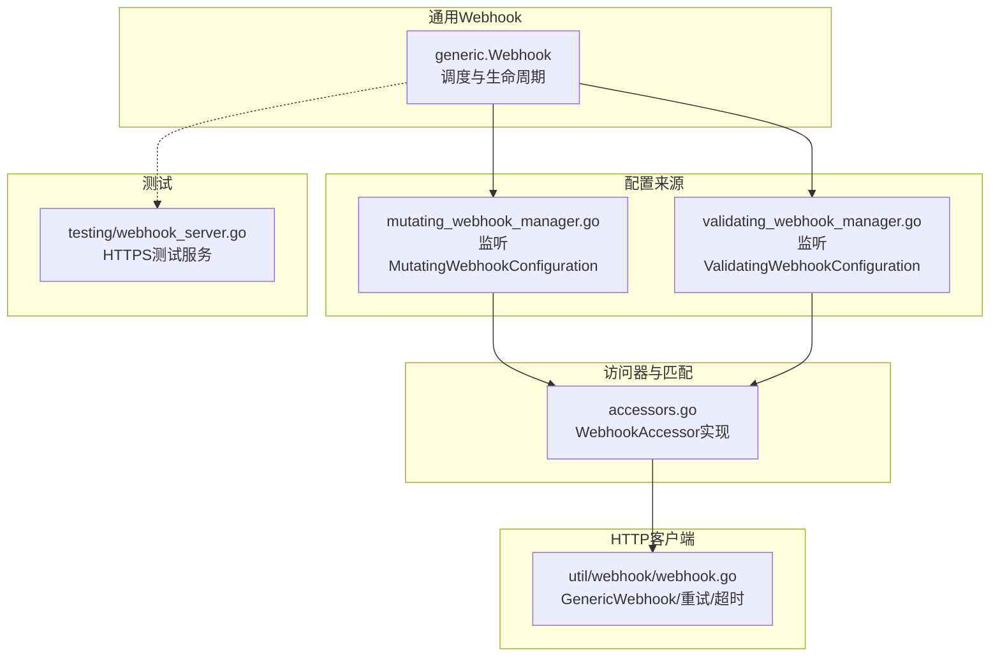
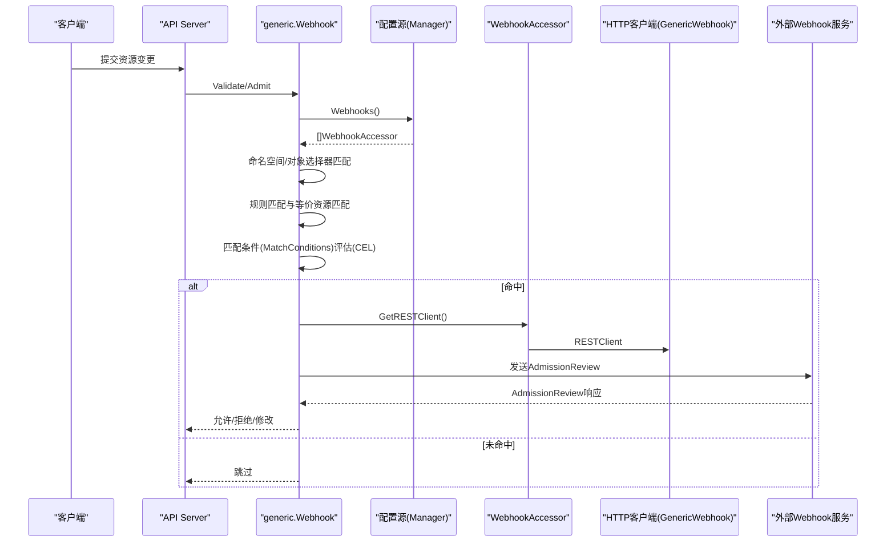
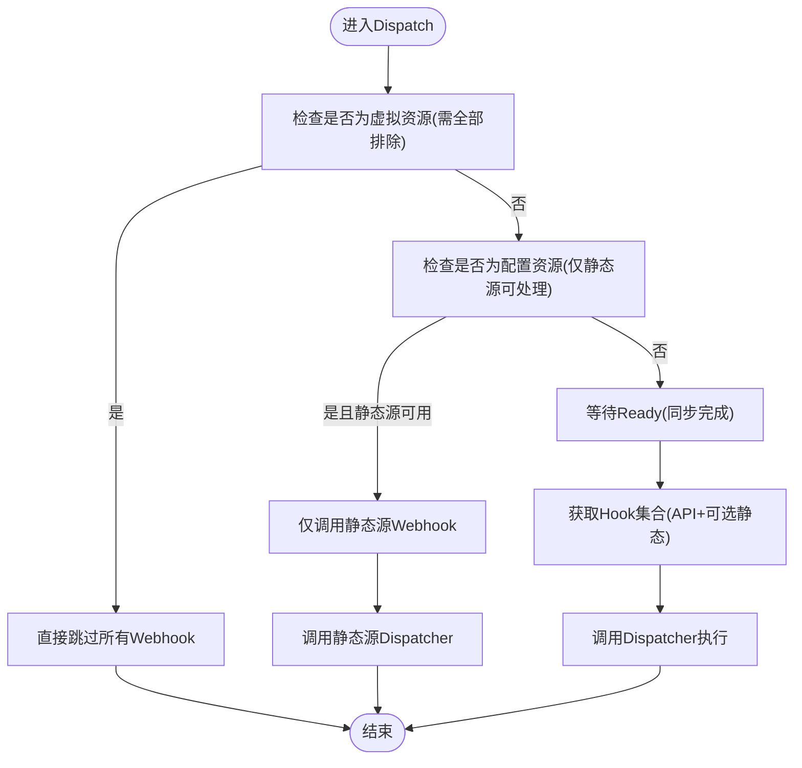
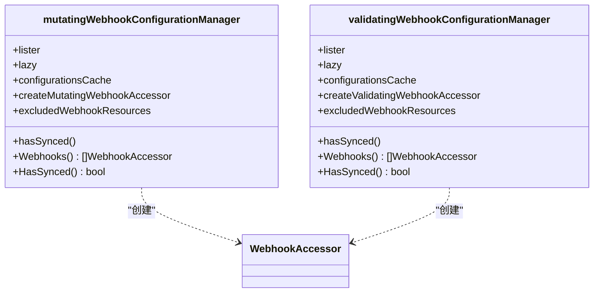
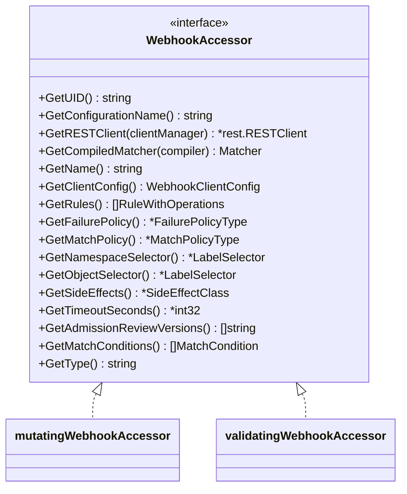
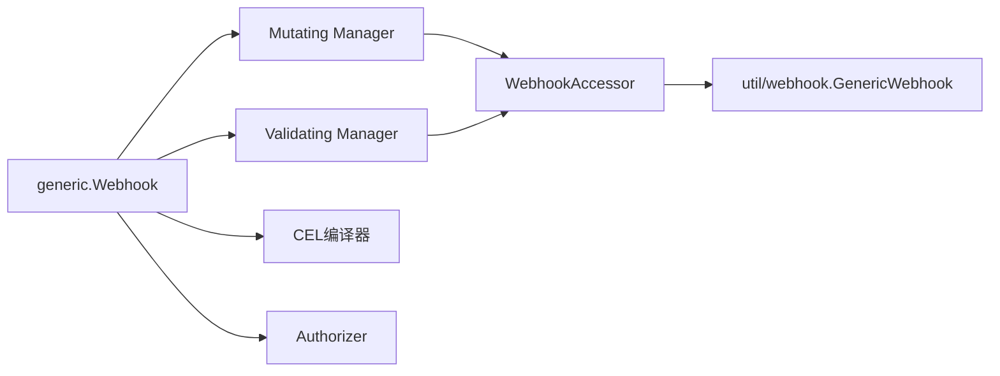

# Webhook开发框架

<cite>
**本文引用的文件**   
- [staging/src/k8s.io/apiserver/pkg/admission/plugin/webhook/generic/webhook.go](file://staging/src/k8s.io/apiserver/pkg/admission/plugin/webhook/generic/webhook.go)
- [staging/src/k8s.io/apiserver/pkg/util/webhook/webhook.go](file://staging/src/k8s.io/apiserver/pkg/util/webhook/webhook.go)
- [staging/src/k8s.io/apiserver/pkg/admission/configuration/mutating_webhook_manager.go](file://staging/src/k8s.io/apiserver/pkg/admission/configuration/mutating_webhook_manager.go)
- [staging/src/k8s.io/apiserver/pkg/admission/configuration/validating_webhook_manager.go](file://staging/src/k8s.io/apiserver/pkg/admission/configuration/validating_webhook_manager.go)
- [staging/src/k8s.io/apiserver/pkg/admission/plugin/webhook/accessors.go](file://staging/src/k8s.io/apiserver/pkg/admission/plugin/webhook/accessors.go)
- [staging/src/k8s.io/apiserver/pkg/admission/plugin/webhook/testing/webhook_server.go](file://staging/src/k8s.io/apiserver/pkg/admission/plugin/webhook/testing/webhook_server.go)
</cite>

## 目录
1. [简介](#简介)
2. [项目结构](#项目结构)
3. [核心组件](#核心组件)
4. [架构总览](#架构总览)
5. [详细组件分析](#详细组件分析)
6. [依赖关系分析](#依赖关系分析)
7. [性能与内存管理](#性能与内存管理)
8. [故障排查指南](#故障排查指南)
9. [结论](#结论)
10. [附录：开发与部署全流程](#附录开发与部署全流程)

## 简介
本技术文档面向在Kubernetes中基于Webhook扩展API服务器行为的开发者，聚焦于通用Webhook框架的架构设计、核心接口、插件注册与生命周期管理、错误处理策略、CEL表达式引擎使用方式、测试与模拟工具，以及性能优化与内存管理最佳实践。文档以源码为依据，提供从项目初始化到上线的全流程指导，并辅以架构图、时序图与流程图帮助理解。

## 项目结构
围绕Webhook框架的关键代码主要分布在以下模块：
- 通用Webhook入口与调度：generic.Webhook
- 配置来源与缓存：Mutating/Validating Webhook Configuration Manager
- Webhook访问器与匹配条件编译：WebhookAccessor及match conditions
- HTTP客户端与重试：util/webhook.GenericWebhook
- 测试服务端：testing.NewTestServer

图表来源
- [staging/src/k8s.io/apiserver/pkg/admission/plugin/webhook/generic/webhook.go:122-294](file://staging/src/k8s.io/apiserver/pkg/admission/plugin/webhook/generic/webhook.go#L122-L294)
- [staging/src/k8s.io/apiserver/pkg/admission/configuration/mutating_webhook_manager.go:56-106](file://staging/src/k8s.io/apiserver/pkg/admission/configuration/mutating_webhook_manager.go#L56-L106)
- [staging/src/k8s.io/apiserver/pkg/admission/configuration/validating_webhook_manager.go:56-106](file://staging/src/k8s.io/apiserver/pkg/admission/configuration/validating_webhook_manager.go#L56-L106)
- [staging/src/k8s.io/apiserver/pkg/admission/plugin/webhook/accessors.go:34-86](file://staging/src/k8s.io/apiserver/pkg/admission/plugin/webhook/accessors.go#L34-L86)
- [staging/src/k8s.io/apiserver/pkg/util/webhook/webhook.go:75-117](file://staging/src/k8s.io/apiserver/pkg/util/webhook/webhook.go#L75-L117)
- [staging/src/k8s.io/apiserver/pkg/admission/plugin/webhook/testing/webhook_server.go:37-60](file://staging/src/k8s.io/apiserver/pkg/admission/plugin/webhook/testing/webhook_server.go#L37-L60)

章节来源
- [staging/src/k8s.io/apiserver/pkg/admission/plugin/webhook/generic/webhook.go:122-294](file://staging/src/k8s.io/apiserver/pkg/admission/plugin/webhook/generic/webhook.go#L122-L294)
- [staging/src/k8s.io/apiserver/pkg/admission/configuration/mutating_webhook_manager.go:56-106](file://staging/src/k8s.io/apiserver/pkg/admission/configuration/mutating_webhook_manager.go#L56-L106)
- [staging/src/k8s.io/apiserver/pkg/admission/configuration/validating_webhook_manager.go:56-106](file://staging/src/k8s.io/apiserver/pkg/admission/configuration/validating_webhook_manager.go#L56-L106)
- [staging/src/k8s.io/apiserver/pkg/admission/plugin/webhook/accessors.go:34-86](file://staging/src/k8s.io/apiserver/pkg/admission/plugin/webhook/accessors.go#L34-L86)
- [staging/src/k8s.io/apiserver/pkg/util/webhook/webhook.go:75-117](file://staging/src/k8s.io/apiserver/pkg/util/webhook/webhook.go#L75-L117)
- [staging/src/k8s.io/apiserver/pkg/admission/plugin/webhook/testing/webhook_server.go:37-60](file://staging/src/k8s.io/apiserver/pkg/admission/plugin/webhook/testing/webhook_server.go#L37-L60)

## 核心组件
- generic.Webhook：通用准入Webhook的抽象与调度中心，负责组合静态清单与API源、构建匹配条件编译器、选择调用哪些Webhook、以及统一的生命周期管理（就绪、停止）。
- Mutating/Validating Webhook Configuration Manager：基于Informer监听Mutating/ValidatingWebhookConfiguration，合并、排序、缓存生成WebhookAccessor列表，支持增量更新。
- WebhookAccessor：对Mutating/Validating Webhook的统一访问接口，封装命名、规则、失败策略、匹配策略、选择器、侧写副作用、超时、版本、匹配条件等元数据，并提供RESTClient获取与匹配条件编译。
- util/webhook.GenericWebhook：通用HTTP客户端，封装认证、编解码、证书指标、指数退避重试、默认超时与QPS控制。
- testing.NewTestServer：提供带TLS与多种响应路径的测试Webhook服务，便于单元测试与集成测试。

章节来源
- [staging/src/k8s.io/apiserver/pkg/admission/plugin/webhook/generic/webhook.go:52-94](file://staging/src/k8s.io/apiserver/pkg/admission/plugin/webhook/generic/webhook.go#L52-L94)
- [staging/src/k8s.io/apiserver/pkg/admission/configuration/mutating_webhook_manager.go:41-54](file://staging/src/k8s.io/apiserver/pkg/admission/configuration/mutating_webhook_manager.go#L41-L54)
- [staging/src/k8s.io/apiserver/pkg/admission/configuration/validating_webhook_manager.go:41-54](file://staging/src/k8s.io/apiserver/pkg/admission/configuration/validating_webhook_manager.go#L41-L54)
- [staging/src/k8s.io/apiserver/pkg/admission/plugin/webhook/accessors.go:34-86](file://staging/src/k8s.io/apiserver/pkg/admission/plugin/webhook/accessors.go#L34-L86)
- [staging/src/k8s.io/apiserver/pkg/util/webhook/webhook.go:51-73](file://staging/src/k8s.io/apiserver/pkg/util/webhook/webhook.go#L51-L73)
- [staging/src/k8s.io/apiserver/pkg/admission/plugin/webhook/testing/webhook_server.go:37-60](file://staging/src/k8s.io/apiserver/pkg/admission/plugin/webhook/testing/webhook_server.go#L37-L60)

## 架构总览
下图展示了请求进入API Server后，如何经由generic.Webhook进行匹配与分发，最终通过WebhookAccessor与HTTP客户端调用外部Webhook服务的整体流程。

图表来源
- [staging/src/k8s.io/apiserver/pkg/admission/plugin/webhook/generic/webhook.go:296-385](file://staging/src/k8s.io/apiserver/pkg/admission/plugin/webhook/generic/webhook.go#L296-L385)
- [staging/src/k8s.io/apiserver/pkg/admission/plugin/webhook/accessors.go:122-127](file://staging/src/k8s.io/apiserver/pkg/admission/plugin/webhook/accessors.go#L122-L127)
- [staging/src/k8s.io/apiserver/pkg/util/webhook/webhook.go:106-117](file://staging/src/k8s.io/apiserver/pkg/util/webhook/webhook.go#L106-L117)

## 详细组件分析

### 通用Webhook(generic.Webhook)
- 职责
  - 组合静态清单与API源，提供统一的Webhook集合。
  - 维护命名空间/对象选择器匹配器、匹配条件编译器、Authorizer等运行时依赖。
  - 提供ShouldCallHook与Dispatch方法，完成“是否调用”和“实际调用”两大阶段。
- 关键流程
  - 初始化：加载配置、创建ClientManager、设置认证与服务解析、准备过滤编译器。
  - 验证初始化：根据特性开关决定是否启用静态清单；若启用则启动文件监听与ReloadLoop，并将静态源与API源组合为Composite源。
  - 匹配：先做命名空间与对象选择器快速过滤，再按规则匹配；当MatchPolicy为Equivalent时，尝试等价资源匹配。
  - 匹配条件：若存在MatchConditions，使用CEL编译后的Matcher进行评估；错误或不匹配将导致跳过或拒绝。
  - 调度：根据是否被排除（虚拟资源或配置资源）决定走静态源还是API源，最终调用Dispatcher执行。
- 生命周期
  - SetDrainedNotification注入停止通道，用于关闭静态清单监听。
  - SetReadyFunc确保Namespace Informer与Hook Source均同步完成后才接受请求。

图表来源
- [staging/src/k8s.io/apiserver/pkg/admission/plugin/webhook/generic/webhook.go:408-433](file://staging/src/k8s.io/apiserver/pkg/admission/plugin/webhook/generic/webhook.go#L408-L433)
- [staging/src/k8s.io/apiserver/pkg/admission/plugin/webhook/generic/webhook.go:234-294](file://staging/src/k8s.io/apiserver/pkg/admission/plugin/webhook/generic/webhook.go#L234-L294)

章节来源
- [staging/src/k8s.io/apiserver/pkg/admission/plugin/webhook/generic/webhook.go:122-158](file://staging/src/k8s.io/apiserver/pkg/admission/plugin/webhook/generic/webhook.go#L122-L158)
- [staging/src/k8s.io/apiserver/pkg/admission/plugin/webhook/generic/webhook.go:234-294](file://staging/src/k8s.io/apiserver/pkg/admission/plugin/webhook/generic/webhook.go#L234-L294)
- [staging/src/k8s.io/apiserver/pkg/admission/plugin/webhook/generic/webhook.go:296-385](file://staging/src/k8s.io/apiserver/pkg/admission/plugin/webhook/generic/webhook.go#L296-L385)
- [staging/src/k8s.io/apiserver/pkg/admission/plugin/webhook/generic/webhook.go:408-433](file://staging/src/k8s.io/apiserver/pkg/admission/plugin/webhook/generic/webhook.go#L408-L433)

### 配置管理器(Mutating/Validating)
- 职责
  - 通过Informer监听对应Configuration对象的增删改事件。
  - 合并多个Configuration中的Webhook，按名称稳定排序，去重并生成唯一UID。
  - 缓存每个Configuration对应的WebhookAccessor列表，避免重复编译CEL表达式。
- 关键点
  - 懒加载：首次需要时才计算，后续变更触发Notify重建。
  - 删除事件处理：清理配置缓存，保证一致性。
  - 排除资源：记录并打印被排除的资源，便于审计与排障。

图表来源
- [staging/src/k8s.io/apiserver/pkg/admission/configuration/mutating_webhook_manager.go:41-54](file://staging/src/k8s.io/apiserver/pkg/admission/configuration/mutating_webhook_manager.go#L41-L54)
- [staging/src/k8s.io/apiserver/pkg/admission/configuration/validating_webhook_manager.go:41-54](file://staging/src/k8s.io/apiserver/pkg/admission/configuration/validating_webhook_manager.go#L41-L54)

章节来源
- [staging/src/k8s.io/apiserver/pkg/admission/configuration/mutating_webhook_manager.go:56-106](file://staging/src/k8s.io/apiserver/pkg/admission/configuration/mutating_webhook_manager.go#L56-L106)
- [staging/src/k8s.io/apiserver/pkg/admission/configuration/mutating_webhook_manager.go:121-157](file://staging/src/k8s.io/apiserver/pkg/admission/configuration/mutating_webhook_manager.go#L121-L157)
- [staging/src/k8s.io/apiserver/pkg/admission/configuration/validating_webhook_manager.go:56-106](file://staging/src/k8s.io/apiserver/pkg/admission/configuration/validating_webhook_manager.go#L56-L106)
- [staging/src/k8s.io/apiserver/pkg/admission/configuration/validating_webhook_manager.go:121-155](file://staging/src/k8s.io/apiserver/pkg/admission/configuration/validating_webhook_manager.go#L121-L155)

### WebhookAccessor与匹配条件
- 统一接口
  - 提供GetUID、GetName、GetClientConfig、GetRules、GetFailurePolicy、GetMatchPolicy、GetNamespaceSelector、GetObjectSelector、GetSideEffects、GetTimeoutSeconds、GetAdmissionReviewVersions、GetMatchConditions等方法。
  - 提供GetCompiledMatcher，基于传入的CEL编译器编译匹配条件，返回Matcher供运行时评估。
- 实现细节
  - 使用sync.Once延迟初始化选择器、RESTClient与匹配条件，避免重复开销。
  - 根据类型(admit/validate)区分类型标识，便于度量与日志。
  - 构造HookClient配置时，兼容URL与Service两种目标形式，并处理端口默认值。

图表来源
- [staging/src/k8s.io/apiserver/pkg/admission/plugin/webhook/accessors.go:34-86](file://staging/src/k8s.io/apiserver/pkg/admission/plugin/webhook/accessors.go#L34-L86)
- [staging/src/k8s.io/apiserver/pkg/admission/plugin/webhook/accessors.go:88-112](file://staging/src/k8s.io/apiserver/pkg/admission/plugin/webhook/accessors.go#L88-L112)
- [staging/src/k8s.io/apiserver/pkg/admission/plugin/webhook/accessors.go:220-244](file://staging/src/k8s.io/apiserver/pkg/admission/plugin/webhook/accessors.go#L220-L244)

章节来源
- [staging/src/k8s.io/apiserver/pkg/admission/plugin/webhook/accessors.go:122-127](file://staging/src/k8s.io/apiserver/pkg/admission/plugin/webhook/accessors.go#L122-L127)
- [staging/src/k8s.io/apiserver/pkg/admission/plugin/webhook/accessors.go:133-152](file://staging/src/k8s.io/apiserver/pkg/admission/plugin/webhook/accessors.go#L133-L152)
- [staging/src/k8s.io/apiserver/pkg/admission/plugin/webhook/accessors.go:254-259](file://staging/src/k8s.io/apiserver/pkg/admission/plugin/webhook/accessors.go#L254-L259)
- [staging/src/k8s.io/apiserver/pkg/admission/plugin/webhook/accessors.go:261-280](file://staging/src/k8s.io/apiserver/pkg/admission/plugin/webhook/accessors.go#L261-L280)
- [staging/src/k8s.io/apiserver/pkg/admission/plugin/webhook/accessors.go:352-376](file://staging/src/k8s.io/apiserver/pkg/admission/plugin/webhook/accessors.go#L352-L376)

### HTTP客户端与重试策略
- 功能要点
  - 默认请求超时：所有Webhook请求设置绝对超时，防止挂起。
  - 指数退避重试：对网络异常、5xx、429、SuggestsClientDelay等场景自动重试。
  - QPS限制：禁用客户端侧限流，由上游决策并发度。
  - 证书指标：包装RoundTripper收集证书SAN缺失与SHA1告警指标。
- 使用建议
  - 合理设置超时与重试次数，避免雪崩。
  - 结合业务幂等性设计，确保重试安全。

章节来源
- [staging/src/k8s.io/apiserver/pkg/util/webhook/webhook.go:36-49](file://staging/src/k8s.io/apiserver/pkg/util/webhook/webhook.go#L36-L49)
- [staging/src/k8s.io/apiserver/pkg/util/webhook/webhook.go:59-73](file://staging/src/k8s.io/apiserver/pkg/util/webhook/webhook.go#L59-L73)
- [staging/src/k8s.io/apiserver/pkg/util/webhook/webhook.go:75-100](file://staging/src/k8s.io/apiserver/pkg/util/webhook/webhook.go#L75-L100)
- [staging/src/k8s.io/apiserver/pkg/util/webhook/webhook.go:106-145](file://staging/src/k8s.io/apiserver/pkg/util/webhook/webhook.go#L106-L145)
- [staging/src/k8s.io/apiserver/pkg/util/webhook/webhook.go:147-171](file://staging/src/k8s.io/apiserver/pkg/util/webhook/webhook.go#L147-L171)

### 测试与模拟
- 测试服务
  - NewTestServer/NewTestServerWithHandler：提供HTTPS测试服务，内置多种响应路径（允许、拒绝、无效响应、补丁、内部错误等），便于覆盖边界情况。
  - ClockSteppingWebhookHandler：配合FakeClock，用于验证超时与重试行为。
- 使用建议
  - 针对匹配条件、选择器、失败策略、重试路径编写用例。
  - 利用不同路径模拟后端不稳定、超时、非法响应等场景。

章节来源
- [staging/src/k8s.io/apiserver/pkg/admission/plugin/webhook/testing/webhook_server.go:37-60](file://staging/src/k8s.io/apiserver/pkg/admission/plugin/webhook/testing/webhook_server.go#L37-L60)
- [staging/src/k8s.io/apiserver/pkg/admission/plugin/webhook/testing/webhook_server.go:62-188](file://staging/src/k8s.io/apiserver/pkg/admission/plugin/webhook/testing/webhook_server.go#L62-L188)
- [staging/src/k8s.io/apiserver/pkg/admission/plugin/webhook/testing/webhook_server.go:190-227](file://staging/src/k8s.io/apiserver/pkg/admission/plugin/webhook/testing/webhook_server.go#L190-L227)

## 依赖关系分析
- 组件耦合
  - generic.Webhook依赖配置源(Manager)、命名空间/对象选择器匹配器、匹配条件编译器、Authorizer与Dispatcher。
  - Manager依赖Informer与Listers，并通过WebhookAccessor暴露给上层。
  - WebhookAccessor依赖ClientManager与CEL编译器。
  - HTTP客户端独立封装，提供重试与超时能力。
- 外部依赖
  - Informer机制用于动态配置热更新。
  - CEL环境用于匹配条件编译与执行。
  - TLS与x509指标用于安全与观测。

图表来源
- [staging/src/k8s.io/apiserver/pkg/admission/plugin/webhook/generic/webhook.go:122-158](file://staging/src/k8s.io/apiserver/pkg/admission/plugin/webhook/generic/webhook.go#L122-L158)
- [staging/src/k8s.io/apiserver/pkg/admission/plugin/webhook/accessors.go:122-127](file://staging/src/k8s.io/apiserver/pkg/admission/plugin/webhook/accessors.go#L122-L127)
- [staging/src/k8s.io/apiserver/pkg/util/webhook/webhook.go:75-100](file://staging/src/k8s.io/apiserver/pkg/util/webhook/webhook.go#L75-L100)

章节来源
- [staging/src/k8s.io/apiserver/pkg/admission/plugin/webhook/generic/webhook.go:122-158](file://staging/src/k8s.io/apiserver/pkg/admission/plugin/webhook/generic/webhook.go#L122-L158)
- [staging/src/k8s.io/apiserver/pkg/admission/plugin/webhook/accessors.go:122-127](file://staging/src/k8s.io/apiserver/pkg/admission/plugin/webhook/accessors.go#L122-L127)
- [staging/src/k8s.io/apiserver/pkg/util/webhook/webhook.go:75-100](file://staging/src/k8s.io/apiserver/pkg/util/webhook/webhook.go#L75-L100)

## 性能与内存管理
- 配置缓存
  - Manager对每个Configuration的WebhookAccessor列表进行缓存，避免重复编译CEL表达式与构建选择器。
- 延迟初始化
  - WebhookAccessor使用sync.Once延迟初始化选择器、RESTClient与匹配条件，减少冷启动与频繁请求的开销。
- 超时与重试
  - 默认请求超时避免长尾阻塞；指数退避重试提升稳定性，但需结合业务幂等性与熔断策略。
- 并发与限流
  - 客户端侧禁用QPS限制，由上游控制并发；建议在网关或调度层实施限流与背压。
- 内存管理
  - 避免在Webhook中持有大对象引用；及时释放临时缓冲；谨慎使用全局缓存，注意键空间与过期策略。
- 指标与观测
  - 关注证书指标、匹配条件排除指标、Webhook耗时指标，定位热点与瓶颈。

[本节为通用性能建议，无需特定文件引用]

## 故障排查指南
- 常见问题
  - 未就绪：等待Namespace Informer与Hook Source同步完成后再接受请求。
  - 循环依赖：配置资源被排除出API源Webhook，仅静态源可处理，避免自引用死锁。
  - 虚拟资源拦截：开启特性后，auth/authz相关虚拟资源将被所有Webhook排除，防止集群自拒。
  - 匹配条件错误：CEL编译或运行错误会导致“失败关闭”，请求被拒绝。
  - 超时与重试：确认后端超时设置与重试策略，避免级联失败。
- 定位步骤
  - 检查Webhook配置是否正确、选择器与规则是否命中。
  - 查看匹配条件表达式语法与语义，必要时简化调试。
  - 观察HTTP状态码与错误信息，结合重试策略判断是否为瞬态错误。
  - 使用测试服务模拟各种响应，复现问题路径。

章节来源
- [staging/src/k8s.io/apiserver/pkg/admission/plugin/webhook/generic/webhook.go:234-294](file://staging/src/k8s.io/apiserver/pkg/admission/plugin/webhook/generic/webhook.go#L234-L294)
- [staging/src/k8s.io/apiserver/pkg/admission/plugin/webhook/generic/webhook.go:296-385](file://staging/src/k8s.io/apiserver/pkg/admission/plugin/webhook/generic/webhook.go#L296-L385)
- [staging/src/k8s.io/apiserver/pkg/util/webhook/webhook.go:59-73](file://staging/src/k8s.io/apiserver/pkg/util/webhook/webhook.go#L59-L73)
- [staging/src/k8s.io/apiserver/pkg/admission/plugin/webhook/testing/webhook_server.go:62-188](file://staging/src/k8s.io/apiserver/pkg/admission/plugin/webhook/testing/webhook_server.go#L62-L188)

## 结论
Kubernetes Webhook框架通过generic.Webhook实现了统一的匹配、调度与生命周期管理，借助Manager与Accessor解耦了配置来源与运行时逻辑，并以CEL表达式增强了灵活的条件控制。配合HTTP客户端的重试与超时机制，以及完善的测试工具，开发者可以高效构建稳定可靠的自定义Webhook插件。在生产环境中，应重点关注性能与内存管理、错误处理与可观测性，确保系统在高负载下的健壮性。

[本节为总结性内容，无需特定文件引用]

## 附录：开发与部署全流程
- 项目初始化
  - 定义CRD与Webhook配置（Mutating/ValidatingWebhookConfiguration）。
  - 实现Webhook服务，遵循AdmissionReview协议，确保幂等与超时控制。
- 本地开发
  - 使用testing.NewTestServer搭建HTTPS测试服务，覆盖允许、拒绝、补丁、错误等路径。
  - 编写单元测试，验证选择器、规则与匹配条件的命中逻辑。
- 集成测试
  - 在测试集群中部署Webhook服务与配置，验证端到端流程。
  - 使用ClockSteppingWebhookHandler验证超时与重试行为。
- 上线部署
  - 配置证书与CA，确保TLS双向认证。
  - 设置合理的超时与重试参数，结合业务幂等性。
  - 监控指标与日志，建立告警与回滚策略。
- 运维与优化
  - 定期审查匹配条件复杂度与CEL成本，避免高开销表达式。
  - 调整并发与限流策略，平衡吞吐与稳定性。
  - 持续优化内存占用，避免泄漏与大对象驻留。

[本节为流程性指导，无需特定文件引用]