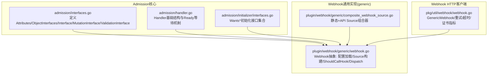
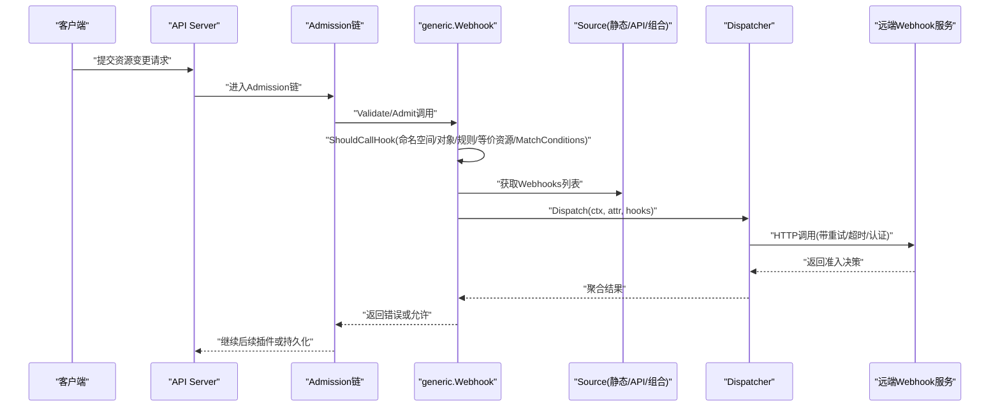
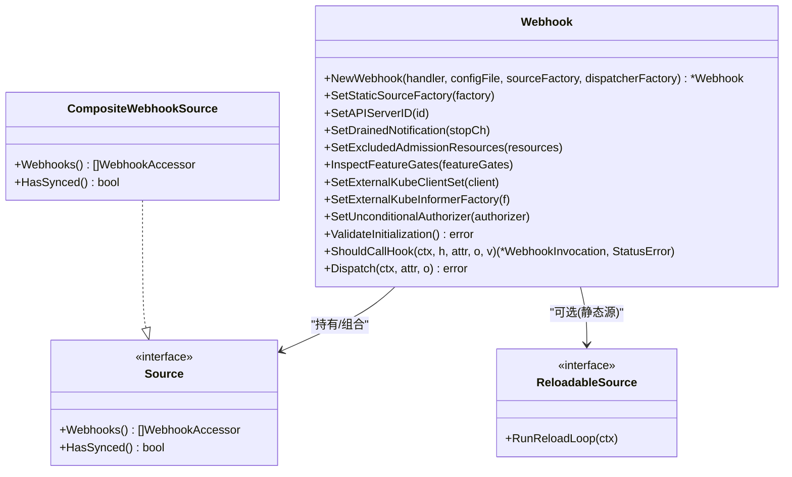
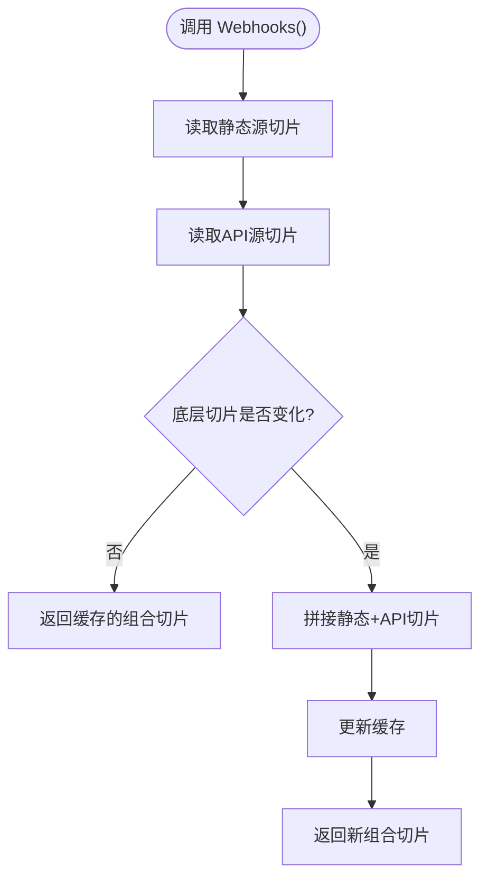
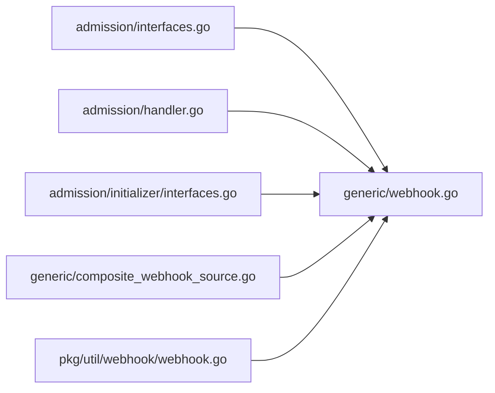

# Webhook框架核心

<cite>
**本文引用的文件**   
- [webhook.go](file://staging/src/k8s.io/apiserver/pkg/admission/plugin/webhook/generic/webhook.go)
- [composite_webhook_source.go](file://staging/src/k8s.io/apiserver/pkg/admission/plugin/webhook/generic/composite_webhook_source.go)
- [interfaces.go](file://staging/src/k8s.io/apiserver/pkg/admission/interfaces.go)
- [handler.go](file://staging/src/k8s.io/apiserver/pkg/admission/handler.go)
- [initializer_interfaces.go](file://staging/src/k8s.io/apiserver/pkg/admission/initializer/interfaces.go)
- [util_webhook.go](file://staging/src/k8s.io/apiserver/pkg/util/webhook/webhook.go)
</cite>

## 目录
1. [简介](#简介)
2. [项目结构](#项目结构)
3. [核心组件](#核心组件)
4. [架构总览](#架构总览)
5. [详细组件分析](#详细组件分析)
6. [依赖关系分析](#依赖关系分析)
7. [性能考量](#性能考量)
8. [故障排查指南](#故障排查指南)
9. [结论](#结论)
10. [附录](#附录)

## 简介
本文件聚焦Kubernetes Admission Webhook框架的通用实现与核心抽象，围绕generic包中的Webhook抽象、Source组合器、初始化接口、以及HTTP客户端重试等关键能力展开。文档旨在帮助读者理解：
- 通用接口定义与插件生命周期管理
- 基于API与静态清单的Webhook配置来源与合并策略
- 请求匹配、条件编译与调用链
- 错误处理、配置管理与依赖注入模式
- 与Admission框架的集成方式与调用时序

## 项目结构
以下图示展示了与Webhook通用框架相关的核心文件及其职责边界：

图表来源
- [interfaces.go:1-175](file://staging/src/k8s.io/apiserver/pkg/admission/interfaces.go#L1-L175)
- [handler.go:1-80](file://staging/src/k8s.io/apiserver/pkg/admission/handler.go#L1-L80)
- [initializer_interfaces.go:1-146](file://staging/src/k8s.io/apiserver/pkg/admission/initializer/interfaces.go#L1-L146)
- [webhook.go:1-434](file://staging/src/k8s.io/apiserver/pkg/admission/plugin/webhook/generic/webhook.go#L1-L434)
- [composite_webhook_source.go:1-100](file://staging/src/k8s.io/apiserver/pkg/admission/plugin/webhook/generic/composite_webhook_source.go#L1-L100)
- [util_webhook.go:1-172](file://staging/src/k8s.io/apiserver/pkg/util/webhook/webhook.go#L1-L172)

章节来源
- [webhook.go:1-434](file://staging/src/k8s.io/apiserver/pkg/admission/plugin/webhook/generic/webhook.go#L1-L434)
- [composite_webhook_source.go:1-100](file://staging/src/k8s.io/apiserver/pkg/admission/plugin/webhook/generic/composite_webhook_source.go#L1-L100)
- [interfaces.go:1-175](file://staging/src/k8s.io/apiserver/pkg/admission/interfaces.go#L1-L175)
- [handler.go:1-80](file://staging/src/k8s.io/apiserver/pkg/admission/handler.go#L1-L80)
- [initializer_interfaces.go:1-146](file://staging/src/k8s.io/apiserver/pkg/admission/initializer/interfaces.go#L1-L146)
- [util_webhook.go:1-172](file://staging/src/k8s.io/apiserver/pkg/util/webhook/webhook.go#L1-L172)

## 核心组件
- 通用Webhook抽象（generic.Webhook）
  - 负责从配置文件加载参数、构造ClientManager、设置命名空间与对象匹配器、编译CEL条件、选择并组合Source、执行请求匹配与分发。
  - 提供ValidateInitialization完成最终装配与就绪判定；通过Dispatch将请求路由到具体Webhook。
- Source与ReloadableSource
  - Source用于在运行时提供一组Webhook访问器；ReloadableSource扩展了RunReloadLoop以支持热更新。
  - compositeWebhookSource将“静态清单”和“API源”合并，保证静态优先、API在后，并对结果进行缓存以减少分配。
- 初始化接口族（Wants*）
  - 通过WantsExternalKubeInformerFactory、WantsDrainedNotification、WantsAPIServerID、WantsExcludedAdmissionResources、WantsFeatures等接口，将外部依赖与特性开关注入到插件中。
- Handler基础结构
  - 提供Handles操作集与WaitForReady就绪等待机制，避免冷启动期间的请求风暴。
- HTTP客户端与重试
  - GenericWebhook封装REST客户端、指数退避重试、默认重试判断、证书指标包装与超时控制。

章节来源
- [webhook.go:52-158](file://staging/src/k8s.io/apiserver/pkg/admission/plugin/webhook/generic/webhook.go#L52-L158)
- [composite_webhook_source.go:25-100](file://staging/src/k8s.io/apiserver/pkg/admission/plugin/webhook/generic/composite_webhook_source.go#L25-L100)
- [initializer_interfaces.go:34-146](file://staging/src/k8s.io/apiserver/pkg/admission/initializer/interfaces.go#L34-L146)
- [handler.go:31-80](file://staging/src/k8s.io/apiserver/pkg/admission/handler.go#L31-L80)
- [util_webhook.go:51-172](file://staging/src/k8s.io/apiserver/pkg/util/webhook/webhook.go#L51-L172)

## 架构总览
下图展示Webhook通用框架在Admission链路中的位置与交互：

图表来源
- [webhook.go:296-434](file://staging/src/k8s.io/apiserver/pkg/admission/plugin/webhook/generic/webhook.go#L296-L434)
- [composite_webhook_source.go:52-100](file://staging/src/k8s.io/apiserver/pkg/admission/plugin/webhook/generic/composite_webhook_source.go#L52-L100)
- [util_webhook.go:102-145](file://staging/src/k8s.io/apiserver/pkg/util/webhook/webhook.go#L102-L145)

## 详细组件分析

### generic.Webhook：通用Webhook抽象
- 职责
  - 配置加载与校验：从Reader解析配置，创建ClientManager与认证/服务解析器。
  - 依赖注入：通过Wants*接口注入外部ClientSet、InformerFactory、停止信号、API Server ID、排除资源集、特性开关等。
  - Source构建：根据是否启用静态清单，构建apiSource、staticSource或组合Source。
  - 请求匹配：ShouldCallHook按命名空间选择器、对象选择器、规则匹配、等价资源映射、MatchConditions（CEL）决定是否调用。
  - 分发调度：Dispatch在准备就绪后，从Source取Webhooks并交由Dispatcher执行。
- 关键流程
  - ValidateInitialization：确保Informer可用、ClientManager有效、静态清单路径与特性门控一致、启动静态源热更循环、设置HasSynced就绪函数。
  - ShouldCallHook：依次评估命名空间/对象选择器、规则匹配、等价资源、MatchConditions，必要时返回内部错误或禁止状态。
  - Dispatch：对虚拟资源与Admission配置资源做特殊豁免，未就绪时拒绝请求，否则统一走dispatcher。
- 设计要点
  - 延迟构建：在ValidateInitialization阶段才真正构建Source，规避初始化顺序不确定性。
  - 组合优先：静态清单优先于API源，便于离线/灰度部署。
  - 条件编译：使用CEL编译器编译matchConditions，结合authorizer进行权限检查。

图表来源
- [webhook.go:52-158](file://staging/src/k8s.io/apiserver/pkg/admission/plugin/webhook/generic/webhook.go#L52-L158)
- [composite_webhook_source.go:25-100](file://staging/src/k8s.io/apiserver/pkg/admission/plugin/webhook/generic/composite_webhook_source.go#L25-L100)

章节来源
- [webhook.go:121-294](file://staging/src/k8s.io/apiserver/pkg/admission/plugin/webhook/generic/webhook.go#L121-L294)
- [webhook.go:296-434](file://staging/src/k8s.io/apiserver/pkg/admission/plugin/webhook/generic/webhook.go#L296-L434)

### Source组合器：静态与API源的合并
- 目标
  - 将静态清单源与API源合并为单一Source，保证静态在前、API在后，且具备HasSynced语义。
- 实现要点
  - 缓存合并结果：当底层切片未变化时复用已合并数组，减少GC压力。
  - 并发安全：读写锁保护lastCombined缓存。
  - 空源兼容：任一源为空时直接返回另一源。

图表来源
- [composite_webhook_source.go:52-87](file://staging/src/k8s.io/apiserver/pkg/admission/plugin/webhook/generic/composite_webhook_source.go#L52-L87)

章节来源
- [composite_webhook_source.go:25-100](file://staging/src/k8s.io/apiserver/pkg/admission/plugin/webhook/generic/composite_webhook_source.go#L25-L100)

### 初始化接口族：依赖注入与生命周期
- 注入项
  - 外部Kubernetes ClientSet与InformerFactory
  - 服务器排空通知（停止信号）
  - API Server ID（用于HA场景指标标签）
  - 被排除的Admission资源集合
  - 特性开关（如ExcludeAdmissionWebhookVirtualResources）
  - 静态清单加载器（ManifestLoaders）
- 生命周期
  - 先调用各Set*方法注入依赖
  - 再调用ValidateInitialization完成最终校验与启动后台任务
  - 通过SetReadyFunc注册就绪判定，由Handler.WaitForReady统一等待

章节来源
- [initializer_interfaces.go:34-146](file://staging/src/k8s.io/apiserver/pkg/admission/initializer/interfaces.go#L34-L146)
- [webhook.go:179-294](file://staging/src/k8s.io/apiserver/pkg/admission/plugin/webhook/generic/webhook.go#L179-L294)

### Handler基础结构与就绪等待
- 作用
  - 声明支持的Operation集合
  - 提供WaitForReady等待逻辑，避免冷启动期间请求失败
- 行为
  - 若未注册ReadyFunc则立即返回true
  - 否则轮询readyFunc直至超时或返回true

章节来源
- [handler.go:31-80](file://staging/src/k8s.io/apiserver/pkg/admission/handler.go#L31-L80)

### HTTP客户端与重试：GenericWebhook
- 能力
  - 基于rest.RESTClient封装Webhook调用
  - 指数退避重试，可自定义ShouldRetry策略
  - 默认重试策略覆盖网络异常、服务端5xx/429、Retry-After头
  - 统一超时与QPS限制关闭，避免客户端侧限流影响吞吐
  - 证书指标包装，便于监控缺失SAN/弱算法等问题

章节来源
- [util_webhook.go:51-172](file://staging/src/k8s.io/apiserver/pkg/util/webhook/webhook.go#L51-L172)

## 依赖关系分析
- 组件耦合
  - generic.Webhook依赖admission基础接口与初始化接口族，解耦了具体业务逻辑与平台能力注入。
  - Source组合器仅依赖Source接口，屏蔽静态与API差异。
  - HTTP层通过GenericWebhook与rest生态对接，保持通用性。
- 外部依赖
  - InformerFactory、ClientSet、FeatureGate、Authorizer等通过Wants*注入，避免强耦合。
- 潜在循环
  - 针对Admission配置资源（如WebhookConfiguration）做了API源豁免，防止自引用导致的死循环。

图表来源
- [interfaces.go:1-175](file://staging/src/k8s.io/apiserver/pkg/admission/interfaces.go#L1-L175)
- [handler.go:1-80](file://staging/src/k8s.io/apiserver/pkg/admission/handler.go#L1-L80)
- [initializer_interfaces.go:1-146](file://staging/src/k8s.io/apiserver/pkg/admission/initializer/interfaces.go#L1-L146)
- [webhook.go:1-434](file://staging/src/k8s.io/apiserver/pkg/admission/plugin/webhook/generic/webhook.go#L1-L434)
- [composite_webhook_source.go:1-100](file://staging/src/k8s.io/apiserver/pkg/admission/plugin/webhook/generic/composite_webhook_source.go#L1-L100)
- [util_webhook.go:1-172](file://staging/src/k8s.io/apiserver/pkg/util/webhook/webhook.go#L1-L172)

章节来源
- [webhook.go:231-294](file://staging/src/k8s.io/apiserver/pkg/admission/plugin/webhook/generic/webhook.go#L231-L294)
- [composite_webhook_source.go:94-100](file://staging/src/k8s.io/apiserver/pkg/admission/plugin/webhook/generic/composite_webhook_source.go#L94-L100)

## 性能考量
- 组合源缓存：compositeWebhookSource对合并结果进行缓存，避免频繁分配与拷贝。
- 就绪等待：Handler.WaitForReady避免冷启动期大量重试与拥塞。
- 重试策略：GenericWebhook默认指数退避与可插拔ShouldRetry，兼顾稳定性与吞吐。
- 条件编译：MatchConditions使用CEL编译器，提前编译表达式，降低运行时开销。
- 资源豁免：对Admission配置资源的API源豁免，避免不必要的远程调用。

[本节为通用指导，不直接分析具体文件]

## 故障排查指南
- 未就绪导致请求被拒
  - 现象：返回“尚未准备好处理请求”的错误。
  - 排查：确认Namespace Informer与Source HasSynced均已就绪；检查StopChannel是否正确传入。
  - 参考路径：[webhook.go:289-294](file://staging/src/k8s.io/apiserver/pkg/admission/plugin/webhook/generic/webhook.go#L289-L294), [webhook.go:428-430](file://staging/src/k8s.io/apiserver/pkg/admission/plugin/webhook/generic/webhook.go#L428-L430)
- 静态清单目录未启用特性门控
  - 现象：配置了静态清单目录但报错提示特性未开启。
  - 排查：启用对应特性门控后再启动。
  - 参考路径：[webhook.go:254-257](file://staging/src/k8s.io/apiserver/pkg/admission/plugin/webhook/generic/webhook.go#L254-L257)
- MatchConditions评估失败
  - 现象：因条件编译或授权问题导致Forbidden。
  - 排查：检查CEL表达式与Authorizer权限；关注日志告警。
  - 参考路径：[webhook.go:364-382](file://staging/src/k8s.io/apiserver/pkg/admission/plugin/webhook/generic/webhook.go#L364-L382)
- 虚拟资源被拦截
  - 现象：auth/authz相关虚拟资源不应被任何Webhook拦截。
  - 排查：确认ExcludeAdmissionWebhookVirtualResources特性与排除资源集配置正确。
  - 参考路径：[webhook.go:397-399](file://staging/src/k8s.io/apiserver/pkg/admission/plugin/webhook/generic/webhook.go#L397-L399)
- 远端Webhook不稳定
  - 现象：偶发超时或5xx。
  - 排查：观察重试次数与退避策略；调整ShouldRetry或后端可用性。
  - 参考路径：[util_webhook.go:102-145](file://staging/src/k8s.io/apiserver/pkg/util/webhook/webhook.go#L102-L145)

章节来源
- [webhook.go:254-294](file://staging/src/k8s.io/apiserver/pkg/admission/plugin/webhook/generic/webhook.go#L254-L294)
- [webhook.go:364-382](file://staging/src/k8s.io/apiserver/pkg/admission/plugin/webhook/generic/webhook.go#L364-L382)
- [webhook.go:397-399](file://staging/src/k8s.io/apiserver/pkg/admission/plugin/webhook/generic/webhook.go#L397-L399)
- [util_webhook.go:102-145](file://staging/src/k8s.io/apiserver/pkg/util/webhook/webhook.go#L102-L145)

## 结论
generic.Webhook为Kubernetes Admission Webhook提供了高内聚、低耦合的通用实现：通过Source抽象与组合器屏蔽静态与API差异，借助Wants*接口完成依赖注入，配合Handler就绪等待与GenericWebhook重试机制，形成稳定可扩展的Webhook接入方案。对于需要实现自定义Webhook的场景，建议遵循该抽象，复用其匹配、条件编译与分发能力，以获得一致的体验与运维能力。

[本节为总结性内容，不直接分析具体文件]

## 附录

### 如何基于通用接口实现自定义Webhook插件（步骤指引）
- 步骤概览
  - 实现你的业务Webhook类型，嵌入admission.Handler以复用操作集与就绪等待。
  - 通过Wants*接口接收外部依赖（InformerFactory、ClientSet、停止信号、特性开关等）。
  - 在ValidateInitialization中完成Source构建与HasSynced就绪函数注册。
  - 实现ShouldCallHook与Dispatch逻辑（或直接复用generic.Webhook提供的实现）。
  - 在应用启动时，将实例加入Admission链。
- 关键参考路径
  - 基础接口与对象接口：[interfaces.go:30-94](file://staging/src/k8s.io/apiserver/pkg/admission/interfaces.go#L30-L94)
  - 初始化接口族：[initializer_interfaces.go:34-146](file://staging/src/k8s.io/apiserver/pkg/admission/initializer/interfaces.go#L34-L146)
  - 通用Webhook构造与验证：[webhook.go:121-158](file://staging/src/k8s.io/apiserver/pkg/admission/plugin/webhook/generic/webhook.go#L121-L158), [webhook.go:231-294](file://staging/src/k8s.io/apiserver/pkg/admission/plugin/webhook/generic/webhook.go#L231-L294)
  - 组合源与HasSynced：[composite_webhook_source.go:94-100](file://staging/src/k8s.io/apiserver/pkg/admission/plugin/webhook/generic/composite_webhook_source.go#L94-L100)
  - 就绪等待：[handler.go:58-80](file://staging/src/k8s.io/apiserver/pkg/admission/handler.go#L58-L80)
  - HTTP重试与超时：[util_webhook.go:102-145](file://staging/src/k8s.io/apiserver/pkg/util/webhook/webhook.go#L102-L145)

[本节为概念性指引，不直接分析具体文件]