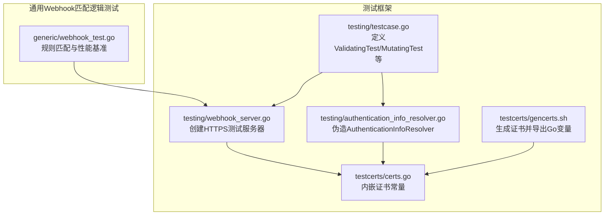
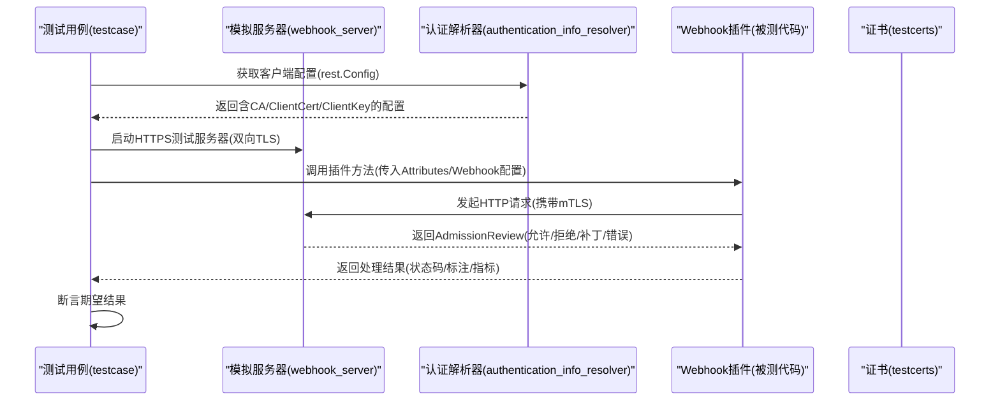
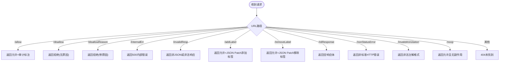
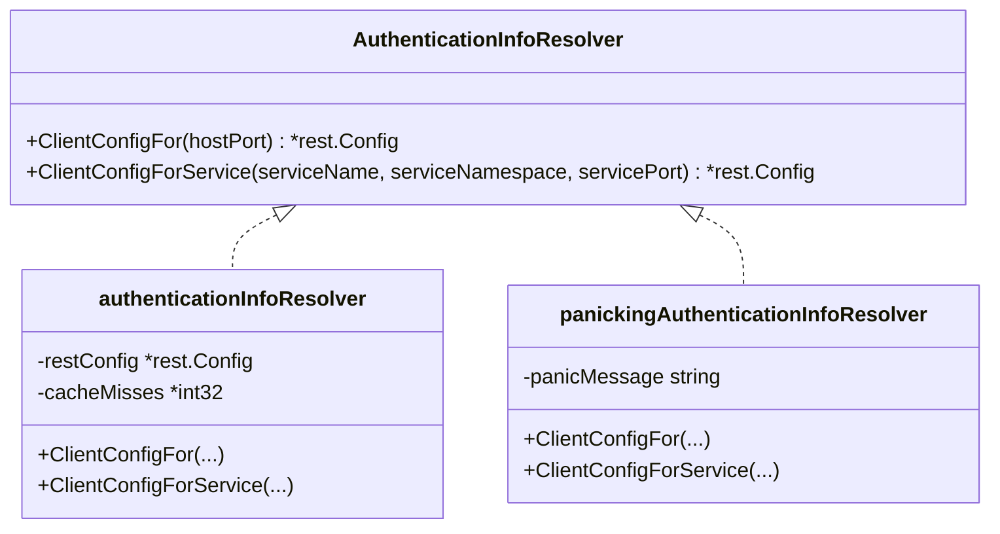
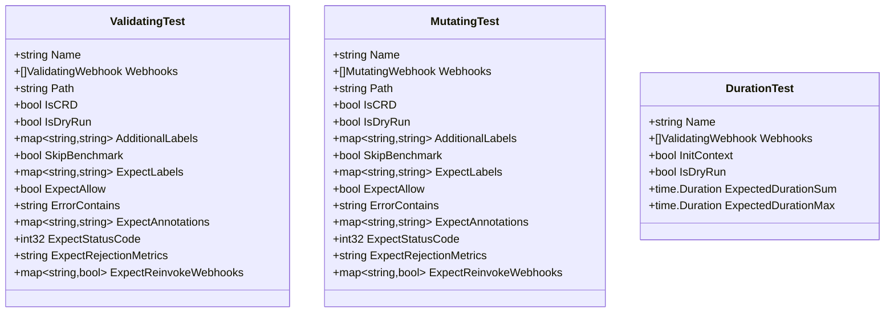
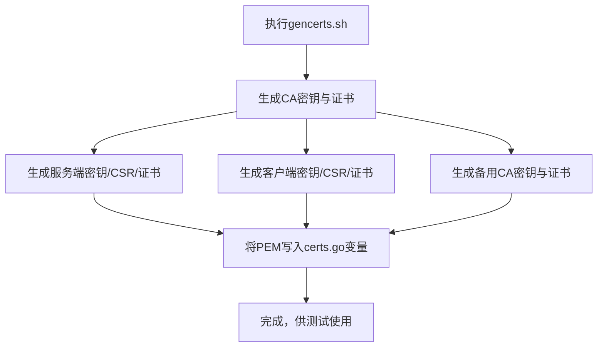
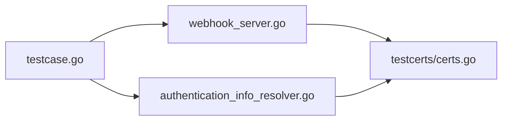

# Webhook测试框架

<cite>
**本文引用的文件**   
- [webhook_server.go](file://staging/src/k8s.io/apiserver/pkg/admission/plugin/webhook/testing/webhook_server.go)
- [testcase.go](file://staging/src/k8s.io/apiserver/pkg/admission/plugin/webhook/testing/testcase.go)
- [authentication_info_resolver.go](file://staging/src/k8s.io/apiserver/pkg/admission/plugin/webhook/testing/authentication_info_resolver.go)
- [certs.go](file://staging/src/k8s.io/apiserver/pkg/admission/plugin/webhook/testcerts/certs.go)
- [gencerts.sh](file://staging/src/k8s.io/apiserver/pkg/admission/plugin/webhook/testcerts/gencerts.sh)
- [webhook_test.go](file://staging/src/k8s.io/apiserver/pkg/admission/plugin/webhook/generic/webhook_test.go)
</cite>

## 目录
1. [简介](#简介)
2. [项目结构](#项目结构)
3. [核心组件](#核心组件)
4. [架构总览](#架构总览)
5. [详细组件分析](#详细组件分析)
6. [依赖关系分析](#依赖关系分析)
7. [性能与压力测试指南](#性能与压力测试指南)
8. [故障排查指南](#故障排查指南)
9. [结论](#结论)
10. [附录：测试开发指南](#附录测试开发指南)

## 简介
本文件面向Kubernetes Webhook测试框架，聚焦于apiserver通用Webhook插件的测试能力。文档深入解释测试框架的设计理念与核心组件，包括：
- 模拟HTTPS服务器（用于承载Webhook服务端逻辑）
- 认证解析器（为客户端配置提供证书与TLS信息）
- 测试用例结构（验证型/变更型Webhook的统一测试模型）
并给出完整的测试开发指南、丰富的测试示例路径、证书生成与管理工具说明，以及性能与压力测试最佳实践。

## 项目结构
测试相关代码位于staging模块下的通用Webhook插件testing包中，主要包含：
- testing子包：提供测试服务器、测试用例模型、认证解析器封装等
- testcerts子包：提供测试用CA、服务端与客户端证书及生成脚本

图表来源
- [webhook_server.go:37-55](file://staging/src/k8s.io/apiserver/pkg/admission/plugin/webhook/testing/webhook_server.go#L37-L55)
- [testcase.go:214-248](file://staging/src/k8s.io/apiserver/pkg/admission/plugin/webhook/testing/testcase.go#L214-L248)
- [authentication_info_resolver.go:35-48](file://staging/src/k8s.io/apiserver/pkg/admission/plugin/webhook/testing/authentication_info_resolver.go#L35-L48)
- [certs.go:22-69](file://staging/src/k8s.io/apiserver/pkg/admission/plugin/webhook/testcerts/certs.go#L22-L69)
- [gencerts.sh:56-72](file://staging/src/k8s.io/apiserver/pkg/admission/plugin/webhook/testcerts/gencerts.sh#L56-L72)
- [webhook_test.go:94-125](file://staging/src/k8s.io/apiserver/pkg/admission/plugin/webhook/generic/webhook_test.go#L94-L125)

章节来源
- [webhook_server.go:37-55](file://staging/src/k8s.io/apiserver/pkg/admission/plugin/webhook/testing/webhook_server.go#L37-L55)
- [testcase.go:214-248](file://staging/src/k8s.io/apiserver/pkg/admission/plugin/webhook/testing/testcase.go#L214-L248)
- [authentication_info_resolver.go:35-48](file://staging/src/k8s.io/apiserver/pkg/admission/plugin/webhook/testing/authentication_info_resolver.go#L35-L48)
- [certs.go:22-69](file://staging/src/k8s.io/apiserver/pkg/admission/plugin/webhook/testcerts/certs.go#L22-L69)
- [gencerts.sh:56-72](file://staging/src/k8s.io/apiserver/pkg/admission/plugin/webhook/testcerts/gencerts.sh#L56-L72)
- [webhook_test.go:94-125](file://staging/src/k8s.io/apiserver/pkg/admission/plugin/webhook/generic/webhook_test.go#L94-L125)

## 核心组件
- 模拟服务器（NewTestServerWithHandler/NewTestServer）
  - 基于httptest构建HTTPS服务，使用内置测试证书，强制双向TLS校验
  - 提供多种路由以模拟不同响应（允许、拒绝、内部错误、无效响应、补丁等）
- 认证解析器（NewAuthenticationInfoResolver/Wapper/Panicking版本）
  - 返回固定rest.Config（含CA/ClientCert/ClientKey），支持统计缓存未命中次数
  - 提供“抛错”版本用于异常路径覆盖
- 测试用例结构（ValidatingTest/MutatingTest/DurationTest）
  - 统一描述Webhook配置、期望结果、标注、状态码、指标等
  - 提供从验证型到变更型的转换工具，便于复用测试数据
- 证书与生成工具（testcerts）
  - 内嵌CA、服务端、客户端证书常量
  - gencerts.sh通过openssl生成证书并输出Go源码变量

章节来源
- [webhook_server.go:37-55](file://staging/src/k8s.io/apiserver/pkg/admission/plugin/webhook/testing/webhook_server.go#L37-L55)
- [webhook_server.go:62-188](file://staging/src/k8s.io/apiserver/pkg/admission/plugin/webhook/testing/webhook_server.go#L62-L188)
- [authentication_info_resolver.go:35-48](file://staging/src/k8s.io/apiserver/pkg/admission/plugin/webhook/testing/authentication_info_resolver.go#L35-L48)
- [authentication_info_resolver.go:65-82](file://staging/src/k8s.io/apiserver/pkg/admission/plugin/webhook/testing/authentication_info_resolver.go#L65-L82)
- [testcase.go:214-248](file://staging/src/k8s.io/apiserver/pkg/admission/plugin/webhook/testing/testcase.go#L214-L248)
- [testcase.go:261-318](file://staging/src/k8s.io/apiserver/pkg/admission/plugin/webhook/testing/testcase.go#L261-L318)
- [certs.go:22-69](file://staging/src/k8s.io/apiserver/pkg/admission/plugin/webhook/testcerts/certs.go#L22-L69)
- [gencerts.sh:56-72](file://staging/src/k8s.io/apiserver/pkg/admission/plugin/webhook/testcerts/gencerts.sh#L56-L72)

## 架构总览
下图展示了测试框架在单元测试中的交互流程：测试驱动构造测试服务器与认证解析器，并通过测试用例驱动Webhook插件执行，最终断言响应、标注、状态码与指标。

图表来源
- [webhook_server.go:37-55](file://staging/src/k8s.io/apiserver/pkg/admission/plugin/webhook/testing/webhook_server.go#L37-L55)
- [authentication_info_resolver.go:55-63](file://staging/src/k8s.io/apiserver/pkg/admission/plugin/webhook/testing/authentication_info_resolver.go#L55-L63)
- [testcase.go:214-248](file://staging/src/k8s.io/apiserver/pkg/admission/plugin/webhook/testing/testcase.go#L214-L248)
- [certs.go:22-69](file://staging/src/k8s.io/apiserver/pkg/admission/plugin/webhook/testcerts/certs.go#L22-L69)

## 详细组件分析

### 模拟服务器（webhook_server）
- 功能要点
  - 使用内置测试证书建立HTTPS服务，启用双向TLS
  - 提供多路由以覆盖常见场景：允许、拒绝、内部错误、无效响应、JSON Patch、审计标注、空响应等
  - 支持时间步进处理器，便于控制延迟与时序
- 关键用法
  - NewTestServerWithHandler：自定义处理器
  - NewTestServer：默认处理器
  - ClockSteppingWebhookHandler：结合FakeClock推进时间

图表来源
- [webhook_server.go:62-188](file://staging/src/k8s.io/apiserver/pkg/admission/plugin/webhook/testing/webhook_server.go#L62-L188)

章节来源
- [webhook_server.go:37-55](file://staging/src/k8s.io/apiserver/pkg/admission/plugin/webhook/testing/webhook_server.go#L37-L55)
- [webhook_server.go:62-188](file://staging/src/k8s.io/apiserver/pkg/admission/plugin/webhook/testing/webhook_server.go#L62-L188)
- [webhook_server.go:190-226](file://staging/src/k8s.io/apiserver/pkg/admission/plugin/webhook/testing/webhook_server.go#L190-L226)

### 认证解析器（authentication_info_resolver）
- 功能要点
  - 返回固定rest.Config，包含CA、客户端证书与私钥
  - 支持统计缓存未命中次数，便于评估缓存策略
  - 提供“抛错”实现，用于异常路径覆盖
- 关键用法
  - NewAuthenticationInfoResolver：正常路径
  - Wrapper：包装已有解析器
  - NewPanickingAuthenticationInfoResolver：异常路径

图表来源
- [authentication_info_resolver.go:35-48](file://staging/src/k8s.io/apiserver/pkg/admission/plugin/webhook/testing/authentication_info_resolver.go#L35-L48)
- [authentication_info_resolver.go:65-82](file://staging/src/k8s.io/apiserver/pkg/admission/plugin/webhook/testing/authentication_info_resolver.go#L65-L82)

章节来源
- [authentication_info_resolver.go:35-48](file://staging/src/k8s.io/apiserver/pkg/admission/plugin/webhook/testing/authentication_info_resolver.go#L35-L48)
- [authentication_info_resolver.go:55-63](file://staging/src/k8s.io/apiserver/pkg/admission/plugin/webhook/testing/authentication_info_resolver.go#L55-L63)
- [authentication_info_resolver.go:65-82](file://staging/src/k8s.io/apiserver/pkg/admission/plugin/webhook/testing/authentication_info_resolver.go#L65-L82)

### 测试用例结构（testcase）
- 数据结构
  - ValidatingTest：验证型Webhook测试用例
  - MutatingTest：变更型Webhook测试用例
  - DurationTest：时长测试用例
- 辅助能力
  - ConvertToMutatingTestCases：将验证型用例转换为变更型用例
  - ConvertToMutatingWebhooks：将验证型Webhook配置转换为变更型
  - NewNonMutatingTestCases：生成一组通用的非变更型测试用例
- 设计意图
  - 通过声明式字段表达期望行为（允许/拒绝、状态码、错误信息、标注、指标等）
  - 复用同一组用例在不同Webhook类型下运行，提升覆盖率与可维护性

图表来源
- [testcase.go:214-248](file://staging/src/k8s.io/apiserver/pkg/admission/plugin/webhook/testing/testcase.go#L214-L248)
- [testcase.go:250-259](file://staging/src/k8s.io/apiserver/pkg/admission/plugin/webhook/testing/testcase.go#L250-L259)

章节来源
- [testcase.go:214-248](file://staging/src/k8s.io/apiserver/pkg/admission/plugin/webhook/testing/testcase.go#L214-L248)
- [testcase.go:261-318](file://staging/src/k8s.io/apiserver/pkg/admission/plugin/webhook/testing/testcase.go#L261-L318)
- [testcase.go:320-735](file://staging/src/k8s.io/apiserver/pkg/admission/plugin/webhook/testing/testcase.go#L320-L735)

### 证书生成与管理（testcerts）
- 内容
  - 内嵌CA、服务端、客户端证书与私钥常量
  - 提供BadCA/BadCACert用于不信任根证书的场景
- 生成方式
  - gencerts.sh通过openssl生成证书，并将PEM内容嵌入Go变量
- 使用建议
  - 测试环境直接使用内嵌常量，避免外部依赖
  - 需要扩展时，重新运行脚本生成新的Go变量

图表来源
- [gencerts.sh:56-72](file://staging/src/k8s.io/apiserver/pkg/admission/plugin/webhook/testcerts/gencerts.sh#L56-L72)
- [gencerts.sh:74-103](file://staging/src/k8s.io/apiserver/pkg/admission/plugin/webhook/testcerts/gencerts.sh#L74-L103)
- [certs.go:22-69](file://staging/src/k8s.io/apiserver/pkg/admission/plugin/webhook/testcerts/certs.go#L22-L69)

章节来源
- [certs.go:22-69](file://staging/src/k8s.io/apiserver/pkg/admission/plugin/webhook/testcerts/certs.go#L22-L69)
- [gencerts.sh:56-72](file://staging/src/k8s.io/apiserver/pkg/admission/plugin/webhook/testcerts/gencerts.sh#L56-L72)
- [gencerts.sh:74-103](file://staging/src/k8s.io/apiserver/pkg/admission/plugin/webhook/testcerts/gencerts.sh#L74-L103)

## 依赖关系分析
- 组件耦合
  - webhook_server依赖testcerts提供的证书常量
  - authentication_info_resolver依赖testcerts提供的证书常量
  - testcase组合上述组件，构造端到端测试场景
- 外部依赖
  - httptest、crypto/tls、encoding/json、net/http
  - k8s.io/api/admissionregistration/v1、k8s.io/client-go/kubernetes/fake、k8s.io/utils/ptr等

图表来源
- [webhook_server.go:37-55](file://staging/src/k8s.io/apiserver/pkg/admission/plugin/webhook/testing/webhook_server.go#L37-L55)
- [authentication_info_resolver.go:35-48](file://staging/src/k8s.io/apiserver/pkg/admission/plugin/webhook/testing/authentication_info_resolver.go#L35-L48)
- [testcase.go:214-248](file://staging/src/k8s.io/apiserver/pkg/admission/plugin/webhook/testing/testcase.go#L214-L248)
- [certs.go:22-69](file://staging/src/k8s.io/apiserver/pkg/admission/plugin/webhook/testcerts/certs.go#L22-L69)

章节来源
- [webhook_server.go:37-55](file://staging/src/k8s.io/apiserver/pkg/admission/plugin/webhook/testing/webhook_server.go#L37-L55)
- [authentication_info_resolver.go:35-48](file://staging/src/k8s.io/apiserver/pkg/admission/plugin/webhook/testing/authentication_info_resolver.go#L35-L48)
- [testcase.go:214-248](file://staging/src/k8s.io/apiserver/pkg/admission/plugin/webhook/testing/testcase.go#L214-L248)
- [certs.go:22-69](file://staging/src/k8s.io/apiserver/pkg/admission/plugin/webhook/testcerts/certs.go#L22-L69)

## 性能与压力测试指南
- 规则匹配性能
  - generic/webhook_test.go中包含复杂选择器与规则的基准测试，可用于评估ShouldCallHook的性能表现
  - 建议关注命名空间选择器复杂度、对象选择器复杂度、规则数量对匹配开销的影响
- 基准测试建议
  - 使用Benchmarks进行回归对比，确保新增规则或选择器不会显著降低性能
  - 针对大规模集群场景，增加选择器键值对数量与规则条目数以逼近真实负载
- 压力测试建议
  - 并发调用模拟服务器，观察Webhook插件在高QPS下的稳定性
  - 结合失败策略（FailOpen/FailClose）与超时设置，评估极端情况下的系统韧性

章节来源
- [webhook_test.go:499-569](file://staging/src/k8s.io/apiserver/pkg/admission/plugin/webhook/generic/webhook_test.go#L499-L569)
- [webhook_test.go:571-640](file://staging/src/k8s.io/apiserver/pkg/admission/plugin/webhook/generic/webhook_test.go#L571-L640)
- [webhook_test.go:642-716](file://staging/src/k8s.io/apiserver/pkg/admission/plugin/webhook/generic/webhook_test.go#L642-L716)

## 故障排查指南
- 常见问题定位
  - 连接失败：检查认证解析器返回的rest.Config是否包含正确的CA/ClientCert/ClientKey
  - TLS握手失败：确认模拟服务器启用了双向TLS，且客户端证书与服务器期望一致
  - 响应解析错误：检查模拟服务器的响应是否为合法JSON，且符合AdmissionReview结构
  - 失败策略影响：根据FailurePolicy（Ignore/Fail）判断是放行还是拒绝
- 调试技巧
  - 使用ClockSteppingWebhookHandler配合FakeClock，精确控制时序与延迟
  - 利用ExpectAnnotations与ExpectRejectionMetrics断言中间状态与指标
  - 通过InvalidAnnotation/InvalidPatch等路由快速复现边界问题

章节来源
- [webhook_server.go:62-188](file://staging/src/k8s.io/apiserver/pkg/admission/plugin/webhook/testing/webhook_server.go#L62-L188)
- [webhook_server.go:190-226](file://staging/src/k8s.io/apiserver/pkg/admission/plugin/webhook/testing/webhook_server.go#L190-L226)
- [testcase.go:320-735](file://staging/src/k8s.io/apiserver/pkg/admission/plugin/webhook/testing/testcase.go#L320-L735)

## 结论
该测试框架通过统一的测试用例模型、灵活的模拟服务器与认证解析器，以及完善的证书管理工具，为Webhook插件提供了高覆盖、易维护、可扩展的测试能力。借助基准与压力测试建议，可在保证正确性的同时兼顾性能与稳定性。

## 附录：测试开发指南
- 环境搭建
  - 使用NewTestServerWithHandler或NewTestServer启动HTTPS测试服务器
  - 使用NewAuthenticationInfoResolver提供客户端配置
  - 使用testcerts内嵌证书常量，无需外部依赖
- 模拟数据准备
  - 使用NewAttribute/NewAttributeUnstructured构造Attributes
  - 使用NewFakeValidatingDataSource/NewFakeMutatingDataSource注入Webhook配置
- 断言编写
  - 通过ExpectAllow/ExpectStatusCode/ErrorContains/ExpectAnnotations/ExpectRejectionMetrics进行断言
  - 对于变更型Webhook，可使用ConvertToMutatingTestCases复用验证型用例
- 丰富示例
  - 参考testcase.go中的NewNonMutatingTestCases，覆盖允许、拒绝、失败策略、干跑、对象选择器、注解格式等场景
  - 参考generic/webhook_test.go中的ShouldCallHook与基准测试，理解匹配逻辑与性能考量

章节来源
- [testcase.go:214-248](file://staging/src/k8s.io/apiserver/pkg/admission/plugin/webhook/testing/testcase.go#L214-L248)
- [testcase.go:320-735](file://staging/src/k8s.io/apiserver/pkg/admission/plugin/webhook/testing/testcase.go#L320-L735)
- [webhook_test.go:94-125](file://staging/src/k8s.io/apiserver/pkg/admission/plugin/webhook/generic/webhook_test.go#L94-L125)