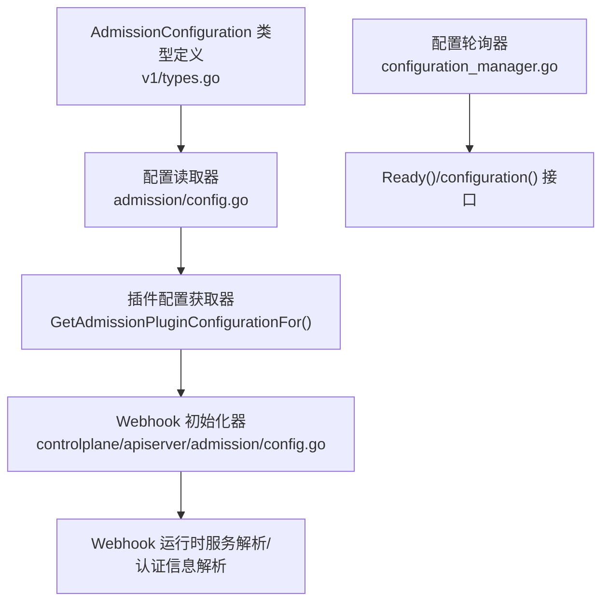
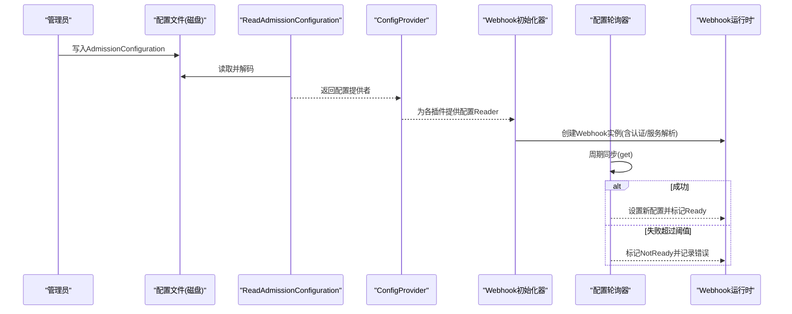
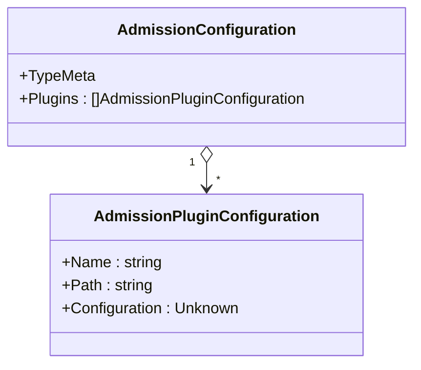
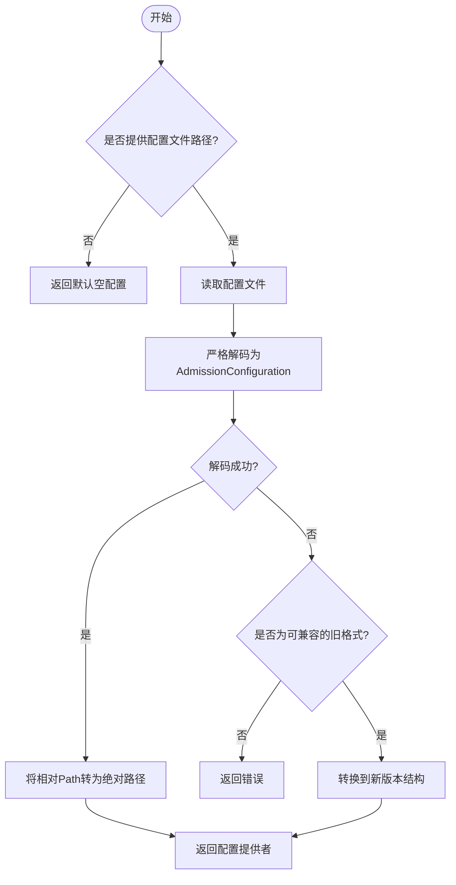
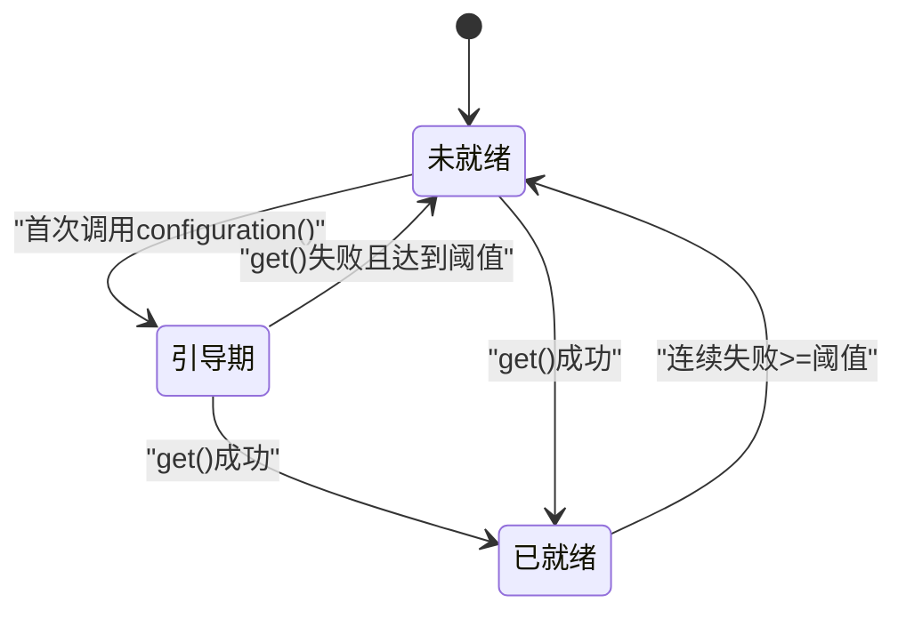
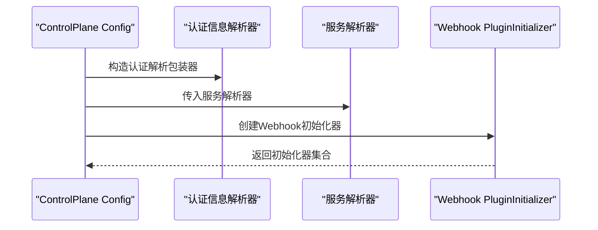
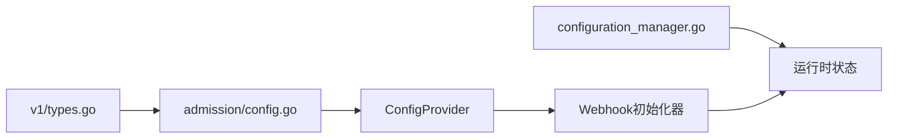

# Webhook配置管理

<cite>
**本文引用的文件**   
- [staging/src/k8s.io/apiserver/pkg/admission/config.go](file://staging/src/k8s.io/apiserver/pkg/admission/config.go)
- [staging/src/k8s.io/apiserver/pkg/admission/configuration/configuration_manager.go](file://staging/src/k8s.io/apiserver/pkg/admission/configuration/configuration_manager.go)
- [staging/src/k8s.io/apiserver/pkg/apis/apiserver/v1/types.go](file://staging/src/k8s.io/apiserver/pkg/apis/apiserver/v1/types.go)
- [pkg/controlplane/apiserver/admission/config.go](file://pkg/controlplane/apiserver/admission/config.go)
- [pkg/kubeapiserver/admission/config.go](file://pkg/kubeapiserver/admission/config.go)
</cite>

## 目录
1. [简介](#简介)
2. [项目结构](#项目结构)
3. [核心组件](#核心组件)
4. [架构总览](#架构总览)
5. [详细组件分析](#详细组件分析)
6. [依赖关系分析](#依赖关系分析)
7. [性能与可用性考虑](#性能与可用性考虑)
8. [故障排查指南](#故障排查指南)
9. [结论](#结论)
10. [附录：配置开发指南与示例](#附录：配置开发指南与示例)

## 简介
本技术文档聚焦于Kubernetes中Webhook（准入控制）的配置管理与加载机制，围绕以下目标展开：
- 解释Webhook配置的结构、版本化类型定义与加载流程
- 说明配置验证、动态更新与错误恢复策略
- 梳理config包中的类型定义与安装初始化过程
- 提供kubeconfig处理逻辑的说明与最佳实践
- 给出配置开发指南（结构设计、版本迁移、兼容性处理）
- 提供实际配置文件示例与不同部署场景的配置方法
- 说明配置热更新机制与调试工具使用方法

## 项目结构
与Webhook配置管理相关的核心代码位于apiserver的admission子系统及其API定义中。关键路径包括：
- 配置读取与解析：staging/src/k8s.io/apiserver/pkg/admission/config.go
- 配置轮询与就绪状态：staging/src/k8s.io/apiserver/pkg/admission/configuration/configuration_manager.go
- 版本化配置类型定义：staging/src/k8s.io/apiserver/pkg/apis/apiserver/v1/types.go
- 控制面/集群内Webhook初始化入口：pkg/controlplane/apiserver/admission/config.go、pkg/kubeapiserver/admission/config.go

图表来源
- [staging/src/k8s.io/apiserver/pkg/apis/apiserver/v1/types.go:27-51](file://staging/src/k8s.io/apiserver/pkg/apis/apiserver/v1/types.go#L27-L51)
- [staging/src/k8s.io/apiserver/pkg/admission/config.go:51-175](file://staging/src/k8s.io/apiserver/pkg/admission/config.go#L51-L175)
- [pkg/controlplane/apiserver/admission/config.go:35-57](file://pkg/controlplane/apiserver/admission/config.go#L35-L57)
- [staging/src/k8s.io/apiserver/pkg/admission/configuration/configuration_manager.go:40-167](file://staging/src/k8s.io/apiserver/pkg/admission/configuration/configuration_manager.go#L40-L167)

章节来源
- [staging/src/k8s.io/apiserver/pkg/apis/apiserver/v1/types.go:27-51](file://staging/src/k8s.io/apiserver/pkg/apis/apiserver/v1/types.go#L27-L51)
- [staging/src/k8s.io/apiserver/pkg/admission/config.go:51-175](file://staging/src/k8s.io/apiserver/pkg/admission/config.go#L51-L175)
- [pkg/controlplane/apiserver/admission/config.go:35-57](file://pkg/controlplane/apiserver/admission/config.go#L35-L57)
- [staging/src/k8s.io/apiserver/pkg/admission/configuration/configuration_manager.go:40-167](file://staging/src/k8s.io/apiserver/pkg/admission/configuration/configuration_manager.go#L40-L167)

## 核心组件
- AdmissionConfiguration 与 AdmissionPluginConfiguration
  - 用于声明式地配置每个准入插件（含Webhook）的名称、外部配置路径或内嵌配置对象
  - 支持向后兼容旧版非版本化配置格式
- 配置读取器 ReadAdmissionConfiguration
  - 负责从指定路径读取并解码配置，将相对路径转换为绝对路径
  - 对缺失版本/Kind等错误进行容错，尝试以旧格式兼容解析
- 插件配置获取 GetAdmissionPluginConfigurationFor
  - 优先使用内嵌配置；否则按Path读取外部文件；若无则返回空
- 配置轮询器 poller
  - 周期性拉取最新配置，维护ready状态与最近错误
  - 启动阶段提供bootstrap重试与宽限期，避免瞬时失败导致不可用
- Webhook初始化入口
  - controlplane/apiserver/admission/config.go 构建Webhook PluginInitializer，集成认证信息解析与服务解析
  - kubeapiserver/admission/config.go 提供最小化初始化入口

章节来源
- [staging/src/k8s.io/apiserver/pkg/apis/apiserver/v1/types.go:27-51](file://staging/src/k8s.io/apiserver/pkg/apis/apiserver/v1/types.go#L27-L51)
- [staging/src/k8s.io/apiserver/pkg/admission/config.go:51-175](file://staging/src/k8s.io/apiserver/pkg/admission/config.go#L51-L175)
- [staging/src/k8s.io/apiserver/pkg/admission/configuration/configuration_manager.go:40-167](file://staging/src/k8s.io/apiserver/pkg/admission/configuration/configuration_manager.go#L40-L167)
- [pkg/controlplane/apiserver/admission/config.go:35-57](file://pkg/controlplane/apiserver/admission/config.go#L35-L57)
- [pkg/kubeapiserver/admission/config.go:23-29](file://pkg/kubeapiserver/admission/config.go#L23-L29)

## 架构总览
下图展示了从配置到Webhook运行时的整体流程：

图表来源
- [staging/src/k8s.io/apiserver/pkg/admission/config.go:51-175](file://staging/src/k8s.io/apiserver/pkg/admission/config.go#L51-L175)
- [staging/src/k8s.io/apiserver/pkg/admission/configuration/configuration_manager.go:150-167](file://staging/src/k8s.io/apiserver/pkg/admission/configuration/configuration_manager.go#L150-L167)
- [pkg/controlplane/apiserver/admission/config.go:42-57](file://pkg/controlplane/apiserver/admission/config.go#L42-L57)

## 详细组件分析

### 配置类型与版本管理
- AdmissionConfiguration
  - 字段：Plugins[]AdmissionPluginConfiguration
  - 作用：集中声明所有准入插件的配置项
- AdmissionPluginConfiguration
  - Name：插件名，必须与注册名一致
  - Path：外部配置文件路径（支持相对路径，会被转换为绝对路径）
  - Configuration：内嵌配置对象（优先级高于Path）
- 版本兼容
  - 当解码失败且错误属于“缺少版本/Kind/未注册”时，会尝试以旧格式兼容（如ImagePolicyWebhook、PodNodeSelector），将其映射到当前版本结构

图表来源
- [staging/src/k8s.io/apiserver/pkg/apis/apiserver/v1/types.go:27-51](file://staging/src/k8s.io/apiserver/pkg/apis/apiserver/v1/types.go#L27-L51)

章节来源
- [staging/src/k8s.io/apiserver/pkg/apis/apiserver/v1/types.go:27-51](file://staging/src/k8s.io/apiserver/pkg/apis/apiserver/v1/types.go#L27-L51)

### 配置读取与解析流程
- 读取与解码
  - 若未提供路径，返回默认空配置
  - 读取文件后使用Strict编解码器解码为AdmissionConfiguration
  - 遍历Plugins，将相对Path基于配置文件所在目录转为绝对路径
- 兼容旧格式
  - 若解码失败且错误类型允许，尝试将旧格式（imagePolicy/podNodeSelector）转换为新版本结构
- 插件配置获取
  - 优先返回内嵌Configuration.Raw
  - 否则读取Path指向的外部文件
  - 若均无，返回空Reader

图表来源
- [staging/src/k8s.io/apiserver/pkg/admission/config.go:51-129](file://staging/src/k8s.io/apiserver/pkg/admission/config.go#L51-L129)
- [staging/src/k8s.io/apiserver/pkg/admission/config.go:135-175](file://staging/src/k8s.io/apiserver/pkg/admission/config.go#L135-L175)

章节来源
- [staging/src/k8s.io/apiserver/pkg/admission/config.go:51-175](file://staging/src/k8s.io/apiserver/pkg/admission/config.go#L51-L175)

### 配置动态更新与就绪状态
- 轮询器poller
  - 周期性调用get函数获取最新配置
  - 成功：重置失败计数，设置mergedConfiguration并标记Ready
  - 失败：累计失败次数，超过阈值标记NotReady，并记录lastErr
  - 启动阶段：首次调用configuration()时进入bootstrap宽限期，期间允许有限次重试
- Ready与configuration接口
  - configuration()在未bootstrapped时允许多次重试
  - 若仍未就绪，返回ErrNotReady

图表来源
- [staging/src/k8s.io/apiserver/pkg/admission/configuration/configuration_manager.go:115-167](file://staging/src/k8s.io/apiserver/pkg/admission/configuration/configuration_manager.go#L115-L167)

章节来源
- [staging/src/k8s.io/apiserver/pkg/admission/configuration/configuration_manager.go:40-167](file://staging/src/k8s.io/apiserver/pkg/admission/configuration/configuration_manager.go#L40-L167)

### Webhook初始化与集成点
- controlplane/apiserver/admission/config.go
  - 构建Webhook PluginInitializer，注入认证信息解析器与服务解析器
  - 结合配额配置与排除规则，完成插件初始化
- kubeapiserver/admission/config.go
  - 提供最小化初始化入口，返回包含Webhook在内的插件初始化器列表

图表来源
- [pkg/controlplane/apiserver/admission/config.go:42-57](file://pkg/controlplane/apiserver/admission/config.go#L42-L57)

章节来源
- [pkg/controlplane/apiserver/admission/config.go:35-57](file://pkg/controlplane/apiserver/admission/config.go#L35-L57)
- [pkg/kubeapiserver/admission/config.go:23-29](file://pkg/kubeapiserver/admission/config.go#L23-L29)

## 依赖关系分析
- 配置类型定义与读取器解耦
  - v1/types.go仅定义数据结构
  - admission/config.go负责读取、兼容与路径处理
- 动态更新与业务逻辑解耦
  - configuration_manager.go提供通用轮询与就绪状态管理
  - 上层组件通过Run(stopCh)驱动同步循环
- Webhook初始化依赖外部能力
  - 需要认证信息解析器（代理传输、出口选择、loopback配置）
  - 需要服务解析器（ServiceResolver）定位远端Webhook服务

图表来源
- [staging/src/k8s.io/apiserver/pkg/apis/apiserver/v1/types.go:27-51](file://staging/src/k8s.io/apiserver/pkg/apis/apiserver/v1/types.go#L27-L51)
- [staging/src/k8s.io/apiserver/pkg/admission/config.go:51-175](file://staging/src/k8s.io/apiserver/pkg/admission/config.go#L51-L175)
- [staging/src/k8s.io/apiserver/pkg/admission/configuration/configuration_manager.go:150-167](file://staging/src/k8s.io/apiserver/pkg/admission/configuration/configuration_manager.go#L150-L167)
- [pkg/controlplane/apiserver/admission/config.go:42-57](file://pkg/controlplane/apiserver/admission/config.go#L42-L57)

章节来源
- [staging/src/k8s.io/apiserver/pkg/apis/apiserver/v1/types.go:27-51](file://staging/src/k8s.io/apiserver/pkg/apis/apiserver/v1/types.go#L27-L51)
- [staging/src/k8s.io/apiserver/pkg/admission/config.go:51-175](file://staging/src/k8s.io/apiserver/pkg/admission/config.go#L51-L175)
- [staging/src/k8s.io/apiserver/pkg/admission/configuration/configuration_manager.go:150-167](file://staging/src/k8s.io/apiserver/pkg/admission/configuration/configuration_manager.go#L150-L167)
- [pkg/controlplane/apiserver/admission/config.go:42-57](file://pkg/controlplane/apiserver/admission/config.go#L42-L57)

## 性能与可用性考虑
- 轮询间隔与失败阈值
  - 默认轮询间隔较短，适合快速发现配置变更
  - 失败阈值用于在HA环境中避免频繁抖动导致的反复切换
- Bootstrap宽限期与重试
  - 启动阶段允许有限次重试，降低冷启动期间的瞬时失败影响
- 配置大小与I/O
  - 外部配置文件过大可能增加读取与解析开销，建议拆分与精简
- 并发与锁
  - poller内部使用读写锁保护状态，确保高并发访问下的正确性

[本节为通用指导，不直接分析具体文件]

## 故障排查指南
- 常见错误与定位
  - 配置文件不存在或权限不足：检查路径与文件系统权限
  - 解码失败（缺少版本/Kind/未注册）：确认apiVersion与kind是否正确，或是否为旧格式需兼容
  - 插件名称不匹配：确保Name与注册的插件名一致
  - 路径解析错误：确认相对路径基准目录与文件存在性
- 动态更新问题
  - NotReady状态持续：查看轮询器失败计数与lastErr
  - 配置未生效：确认get函数返回的是最新合并后的配置
- 日志与指标
  - 关注klog输出与系统监控，定位IO与网络错误
  - 结合服务解析与认证解析链路，排查远端Webhook可达性与证书问题

章节来源
- [staging/src/k8s.io/apiserver/pkg/admission/config.go:51-175](file://staging/src/k8s.io/apiserver/pkg/admission/config.go#L51-L175)
- [staging/src/k8s.io/apiserver/pkg/admission/configuration/configuration_manager.go:115-167](file://staging/src/k8s.io/apiserver/pkg/admission/configuration/configuration_manager.go#L115-L167)

## 结论
Kubernetes Webhook配置管理通过版本化的AdmissionConfiguration类型、严格的解码与兼容策略、以及通用的配置轮询器，实现了稳定可靠的配置加载与动态更新。配合认证与服务解析能力，Webhook能够在复杂环境中安全、高效地工作。遵循本文的开发指南与最佳实践，可有效提升配置的健壮性与可维护性。

[本节为总结性内容，不直接分析具体文件]

## 附录：配置开发指南与示例

### 配置结构设计
- 顶层结构
  - apiVersion: apiserver.k8s.io/v1
  - kind: AdmissionConfiguration
  - plugins: 数组，每项对应一个插件
- 插件项
  - name: 插件名（必须与注册名一致）
  - path: 外部配置文件路径（支持相对路径）
  - configuration: 内嵌配置对象（优先级高于path）

章节来源
- [staging/src/k8s.io/apiserver/pkg/apis/apiserver/v1/types.go:27-51](file://staging/src/k8s.io/apiserver/pkg/apis/apiserver/v1/types.go#L27-L51)

### 版本迁移与兼容性处理
- 旧格式兼容
  - 当解码失败且错误类型为缺失版本/Kind/未注册时，系统会尝试将旧格式（如imagePolicy、podNodeSelector）转换为新版本结构
- 迁移建议
  - 逐步将旧格式迁移至AdmissionConfiguration.plugins
  - 使用内嵌configuration减少外部文件依赖，便于版本化管理

章节来源
- [staging/src/k8s.io/apiserver/pkg/admission/config.go:91-129](file://staging/src/k8s.io/apiserver/pkg/admission/config.go#L91-L129)

### 实际配置文件示例（描述性）
- 基础示例
  - 定义AdmissionConfiguration，plugins中包含一个Webhook插件，name为Webhook插件名，path指向其外部配置
- 多插件示例
  - 多个插件分别配置不同的path或内嵌configuration
- 内嵌配置示例
  - 使用configuration字段直接嵌入插件配置，避免外部文件依赖

[本节为概念性示例，不直接分析具体文件]

### 不同部署场景的配置方法
- 本地开发
  - 使用内嵌configuration，简化路径与权限问题
- 生产环境
  - 使用外部配置文件，结合配置管理系统进行版本化与灰度发布
  - 合理设置轮询间隔与失败阈值，平衡响应速度与稳定性

[本节为概念性指导，不直接分析具体文件]

### 配置热更新机制与错误恢复策略
- 热更新
  - 通过轮询器周期拉取最新配置，成功后立即生效
- 错误恢复
  - 连续失败超过阈值标记NotReady，避免传播错误配置
  - bootstrap宽限期与重试机制缓解启动阶段的瞬时失败

章节来源
- [staging/src/k8s.io/apiserver/pkg/admission/configuration/configuration_manager.go:115-167](file://staging/src/k8s.io/apiserver/pkg/admission/configuration/configuration_manager.go#L115-L167)

### 配置验证与调试工具使用方法
- 验证
  - 使用Strict编解码器进行强校验，提前发现结构错误
  - 检查插件名称与注册名一致性
- 调试
  - 启用klog日志，观察读取、解码与轮询过程
  - 检查服务解析与认证解析链路，确认远端可达性与证书有效性

章节来源
- [staging/src/k8s.io/apiserver/pkg/admission/config.go:66-74](file://staging/src/k8s.io/apiserver/pkg/admission/config.go#L66-L74)
- [pkg/controlplane/apiserver/admission/config.go:42-57](file://pkg/controlplane/apiserver/admission/config.go#L42-L57)