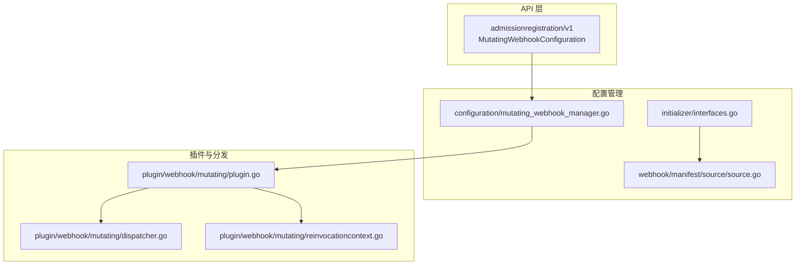
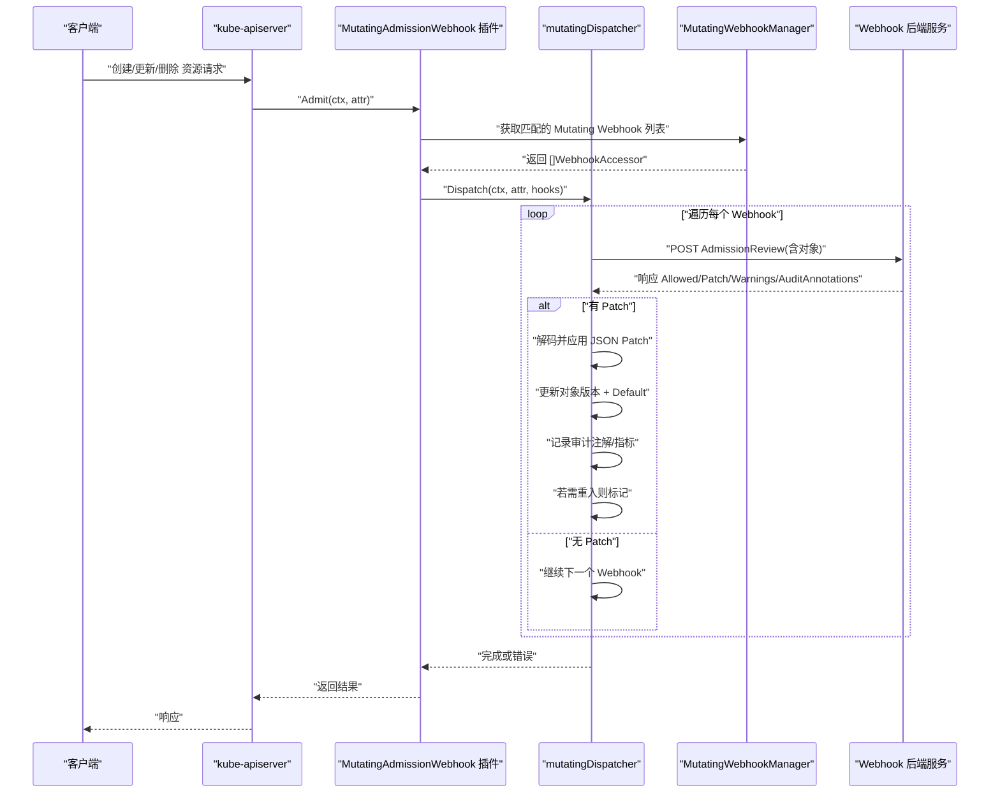
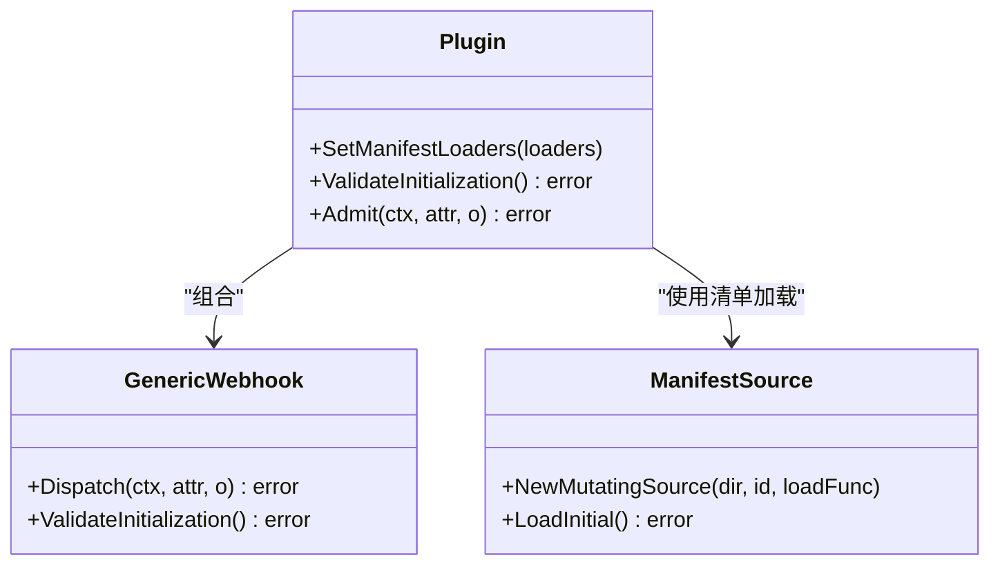
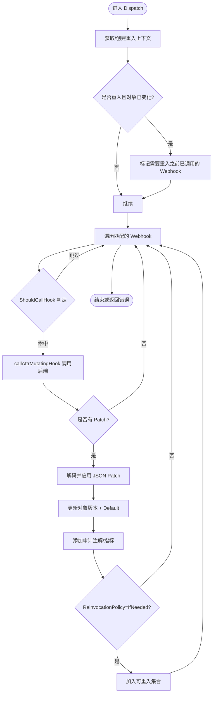
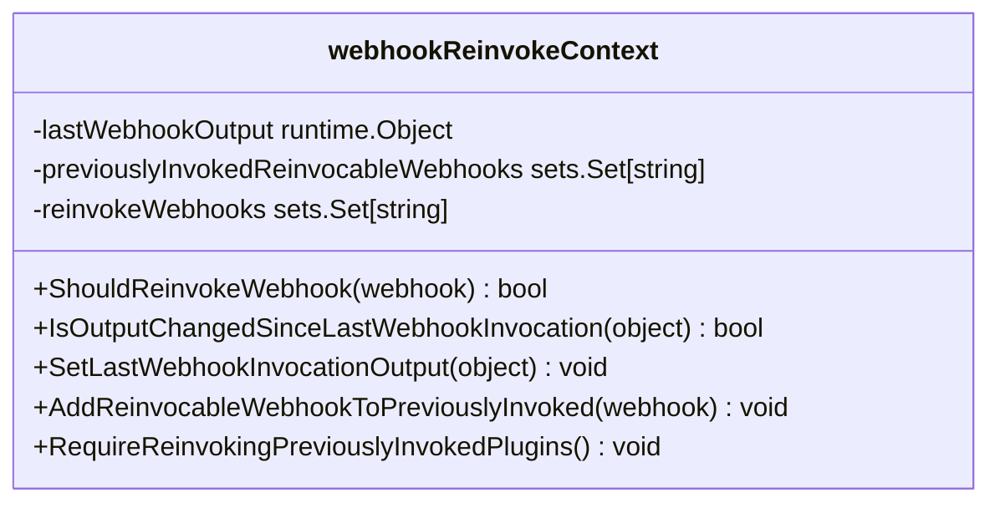
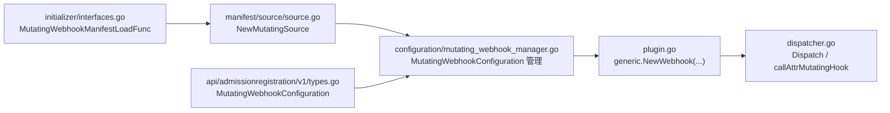

# 变更Webhook开发

<cite>
**本文引用的文件**   
- [staging/src/k8s.io/apiserver/pkg/admission/plugin/webhook/mutating/dispatcher.go](file://staging/src/k8s.io/apiserver/pkg/admission/plugin/webhook/mutating/dispatcher.go)
- [staging/src/k8s.io/apiserver/pkg/admission/plugin/webhook/mutating/plugin.go](file://staging/src/k8s.io/apiserver/pkg/admission/plugin/webhook/mutating/plugin.go)
- [staging/src/k8s.io/apiserver/pkg/admission/plugin/webhook/mutating/reinvocationcontext.go](file://staging/src/k8s.io/apiserver/pkg/admission/plugin/webhook/mutating/reinvocationcontext.go)
- [staging/src/k8s.io/apiserver/pkg/admission/configuration/mutating_webhook_manager.go](file://staging/src/k8s.io/apiserver/pkg/admission/configuration/mutating_webhook_manager.go)
- [staging/src/k8s.io/apiserver/pkg/admission/initializer/interfaces.go](file://staging/src/k8s.io/apiserver/pkg/admission/initializer/interfaces.go)
- [staging/src/k8s.io/apiserver/pkg/admission/plugin/webhook/manifest/source/source.go](file://staging/src/k8s.io/apiserver/pkg/admission/plugin/webhook/manifest/source/source.go)
- [staging/src/k8s.io/api/admissionregistration/v1/types.go](file://staging/src/k8s.io/api/admissionregistration/v1/types.go)
</cite>

## 目录
1. [简介](#简介)
2. [项目结构](#项目结构)
3. [核心组件](#核心组件)
4. [架构总览](#架构总览)
5. [详细组件分析](#详细组件分析)
6. [依赖关系分析](#依赖关系分析)
7. [性能与内存管理](#性能与内存管理)
8. [开发与配置指南](#开发与配置指南)
9. [故障排查](#故障排查)
10. [结论](#结论)

## 简介
本文件面向在 Kubernetes 中开发“变更型（Mutating）Admission Webhook”的工程师，聚焦于 kube-apiserver 内部对 Mutating Webhook 的处理机制，重点解析 mutating 包中的 dispatcher、plugin 与 reinvocationContext 的实现细节，并给出匹配规则、权限与安全建议、以及性能优化与内存管理的最佳实践。文档同时提供代码级时序图与流程图，帮助读者理解请求拦截、对象修改与重新调用逻辑。

## 项目结构
Kubernetes 对 Mutating Webhook 的核心实现位于 apiserver 的 admission 插件体系中：
- plugin/webhook/mutating：包含插件入口、分发器与重入上下文
- configuration：负责加载与管理 MutatingWebhookConfiguration
- initializer：提供清单加载接口，支持从静态清单目录加载配置
- api/admissionregistration/v1：定义 MutatingWebhookConfiguration 等 API 类型

图表来源
- [staging/src/k8s.io/apiserver/pkg/admission/configuration/mutating_webhook_manager.go:158-158](file://staging/src/k8s.io/apiserver/pkg/admission/configuration/mutating_webhook_manager.go#L158-L158)
- [staging/src/k8s.io/apiserver/pkg/admission/initializer/interfaces.go:119-119](file://staging/src/k8s.io/apiserver/pkg/admission/initializer/interfaces.go#L119-L119)
- [staging/src/k8s.io/apiserver/pkg/admission/plugin/webhook/manifest/source/source.go:53-53](file://staging/src/k8s.io/apiserver/pkg/admission/plugin/webhook/manifest/source/source.go#L53-L53)
- [staging/src/k8s.io/apiserver/pkg/admission/plugin/webhook/mutating/plugin.go:30-45](file://staging/src/k8s.io/apiserver/pkg/admission/plugin/webhook/mutating/plugin.go#L30-L45)
- [staging/src/k8s.io/apiserver/pkg/admission/plugin/webhook/mutating/dispatcher.go:68-77](file://staging/src/k8s.io/apiserver/pkg/admission/plugin/webhook/mutating/dispatcher.go#L68-L77)
- [staging/src/k8s.io/apiserver/pkg/admission/plugin/webhook/mutating/reinvocationcontext.go:25-33](file://staging/src/k8s.io/apiserver/pkg/admission/plugin/webhook/mutating/reinvocationcontext.go#L25-L33)
- [staging/src/k8s.io/api/admissionregistration/v1/types.go:763-781](file://staging/src/k8s.io/api/admissionregistration/v1/types.go#L763-L781)

章节来源
- [staging/src/k8s.io/apiserver/pkg/admission/plugin/webhook/mutating/plugin.go:30-45](file://staging/src/k8s.io/apiserver/pkg/admission/plugin/webhook/mutating/plugin.go#L30-L45)
- [staging/src/k8s.io/apiserver/pkg/admission/plugin/webhook/mutating/dispatcher.go:68-77](file://staging/src/k8s.io/apiserver/pkg/admission/plugin/webhook/mutating/dispatcher.go#L68-L77)
- [staging/src/k8s.io/apiserver/pkg/admission/plugin/webhook/mutating/reinvocationcontext.go:25-33](file://staging/src/k8s.io/apiserver/pkg/admission/plugin/webhook/mutating/reinvocationcontext.go#L25-L33)
- [staging/src/k8s.io/apiserver/pkg/admission/configuration/mutating_webhook_manager.go:158-158](file://staging/src/k8s.io/apiserver/pkg/admission/configuration/mutating_webhook_manager.go#L158-L158)
- [staging/src/k8s.io/apiserver/pkg/admission/initializer/interfaces.go:119-119](file://staging/src/k8s.io/apiserver/pkg/admission/initializer/interfaces.go#L119-L119)
- [staging/src/k8s.io/apiserver/pkg/admission/plugin/webhook/manifest/source/source.go:53-53](file://staging/src/k8s.io/apiserver/pkg/admission/plugin/webhook/manifest/source/source.go#L53-L53)
- [staging/src/k8s.io/api/admissionregistration/v1/types.go:763-781](file://staging/src/k8s.io/api/admissionregistration/v1/types.go#L763-L781)

## 核心组件
- Plugin（插件入口）
  - 注册名为“MutatingAdmissionWebhook”的 admission 插件
  - 通过 generic.Webhook 封装通用能力，并注入 Mutating 专用分发器
  - 暴露 Admit 方法，将请求交给 Webhook.Dispatch 处理
- Dispatcher（分发器）
  - 遍历匹配的 Mutating Webhook，构造 AdmissionReview 请求并调用后端
  - 应用 JSON Patch，更新对象版本，触发默认值填充
  - 维护审计注解与失败开放标记，统计指标
  - 根据 ReinvocationPolicy 决定是否重新调用已执行的 Webhook
- ReinvokeContext（重入上下文）
  - 记录上次 Webhook 输出、可重入的 Webhook 集合、需要重入的 Webhook 集合
  - 比较对象是否变化，决定是否需要要求之前已调用的 Webhook 再次执行

章节来源
- [staging/src/k8s.io/apiserver/pkg/admission/plugin/webhook/mutating/plugin.go:30-45](file://staging/src/k8s.io/apiserver/pkg/admission/plugin/webhook/mutating/plugin.go#L30-L45)
- [staging/src/k8s.io/apiserver/pkg/admission/plugin/webhook/mutating/plugin.go:70-94](file://staging/src/k8s.io/apiserver/pkg/admission/plugin/webhook/mutating/plugin.go#L70-L94)
- [staging/src/k8s.io/apiserver/pkg/admission/plugin/webhook/mutating/dispatcher.go:105-240](file://staging/src/k8s.io/apiserver/pkg/admission/plugin/webhook/mutating/dispatcher.go#L105-L240)
- [staging/src/k8s.io/apiserver/pkg/admission/plugin/webhook/mutating/dispatcher.go:244-391](file://staging/src/k8s.io/apiserver/pkg/admission/plugin/webhook/mutating/dispatcher.go#L244-L391)
- [staging/src/k8s.io/apiserver/pkg/admission/plugin/webhook/mutating/reinvocationcontext.go:25-69](file://staging/src/k8s.io/apiserver/pkg/admission/plugin/webhook/mutating/reinvocationcontext.go#L25-L69)

## 架构总览
下图展示了从 API 请求进入，到匹配、调用、补丁应用与可能的重入流程。

图表来源
- [staging/src/k8s.io/apiserver/pkg/admission/plugin/webhook/mutating/plugin.go:90-94](file://staging/src/k8s.io/apiserver/pkg/admission/plugin/webhook/mutating/plugin.go#L90-L94)
- [staging/src/k8s.io/apiserver/pkg/admission/plugin/webhook/mutating/dispatcher.go:105-240](file://staging/src/k8s.io/apiserver/pkg/admission/plugin/webhook/mutating/dispatcher.go#L105-L240)
- [staging/src/k8s.io/apiserver/pkg/admission/plugin/webhook/mutating/dispatcher.go:244-391](file://staging/src/k8s.io/apiserver/pkg/admission/plugin/webhook/mutating/dispatcher.go#L244-L391)
- [staging/src/k8s.io/apiserver/pkg/admission/configuration/mutating_webhook_manager.go:158-158](file://staging/src/k8s.io/apiserver/pkg/admission/configuration/mutating_webhook_manager.go#L158-L158)

## 详细组件分析

### 插件入口（Plugin）
- 职责
  - 注册插件名与构造函数
  - 设置静态清单加载器（用于从目录加载 MutatingWebhookConfiguration）
  - 实现 Admit，委托给 generic.Webhook.Dispatch
- 关键点
  - SetManifestLoaders 将清单加载函数注入到 Webhook 的静态源工厂
  - NewMutatingWebhook 初始化 handler 与 generic.Webhook，并传入 newMutatingDispatcher

图表来源
- [staging/src/k8s.io/apiserver/pkg/admission/plugin/webhook/mutating/plugin.go:30-45](file://staging/src/k8s.io/apiserver/pkg/admission/plugin/webhook/mutating/plugin.go#L30-L45)
- [staging/src/k8s.io/apiserver/pkg/admission/plugin/webhook/mutating/plugin.go:55-68](file://staging/src/k8s.io/apiserver/pkg/admission/plugin/webhook/mutating/plugin.go#L55-L68)
- [staging/src/k8s.io/apiserver/pkg/admission/plugin/webhook/mutating/plugin.go:70-94](file://staging/src/k8s.io/apiserver/pkg/admission/plugin/webhook/mutating/plugin.go#L70-L94)
- [staging/src/k8s.io/apiserver/pkg/admission/plugin/webhook/manifest/source/source.go:53-53](file://staging/src/k8s.io/apiserver/pkg/admission/plugin/webhook/manifest/source/source.go#L53-L53)
- [staging/src/k8s.io/apiserver/pkg/admission/initializer/interfaces.go:119-119](file://staging/src/k8s.io/apiserver/pkg/admission/initializer/interfaces.go#L119-L119)

章节来源
- [staging/src/k8s.io/apiserver/pkg/admission/plugin/webhook/mutating/plugin.go:30-45](file://staging/src/k8s.io/apiserver/pkg/admission/plugin/webhook/mutating/plugin.go#L30-L45)
- [staging/src/k8s.io/apiserver/pkg/admission/plugin/webhook/mutating/plugin.go:55-68](file://staging/src/k8s.io/apiserver/pkg/admission/plugin/webhook/mutating/plugin.go#L55-L68)
- [staging/src/k8s.io/apiserver/pkg/admission/plugin/webhook/mutating/plugin.go:70-94](file://staging/src/k8s.io/apiserver/pkg/admission/plugin/webhook/mutating/plugin.go#L70-L94)
- [staging/src/k8s.io/apiserver/pkg/admission/initializer/interfaces.go:119-119](file://staging/src/k8s.io/apiserver/pkg/admission/initializer/interfaces.go#L119-L119)
- [staging/src/k8s.io/apiserver/pkg/admission/plugin/webhook/manifest/source/source.go:53-53](file://staging/src/k8s.io/apiserver/pkg/admission/plugin/webhook/manifest/source/source.go#L53-L53)

### 分发器（Dispatcher）
- 职责
  - 为每个匹配的 Webhook 构建 AdmissionReview 请求并调用后端
  - 校验 SideEffects、DryRun、超时、重试策略
  - 应用 JSON Patch，更新对象版本，触发默认值填充
  - 记录审计注解（包括失败开放标记、Patch 内容摘要）、指标
  - 根据 ReinvocationPolicy 与对象变化决定是否重入
- 关键流程
  - 首次调用与重入分支：当对象被其他插件或后续 Webhook 修改时，可能触发之前已调用的 Webhook 再次执行
  - 错误处理：区分调用失败、拒绝、内部错误；按 FailurePolicy 决定 fail-open/fail-closed
  - 版本转换：将 VersionedObject 转回内部版本以写入 Attributes

图表来源
- [staging/src/k8s.io/apiserver/pkg/admission/plugin/webhook/mutating/dispatcher.go:105-240](file://staging/src/k8s.io/apiserver/pkg/admission/plugin/webhook/mutating/dispatcher.go#L105-L240)
- [staging/src/k8s.io/apiserver/pkg/admission/plugin/webhook/mutating/dispatcher.go:244-391](file://staging/src/k8s.io/apiserver/pkg/admission/plugin/webhook/mutating/dispatcher.go#L244-L391)

章节来源
- [staging/src/k8s.io/apiserver/pkg/admission/plugin/webhook/mutating/dispatcher.go:105-240](file://staging/src/k8s.io/apiserver/pkg/admission/plugin/webhook/mutating/dispatcher.go#L105-L240)
- [staging/src/k8s.io/apiserver/pkg/admission/plugin/webhook/mutating/dispatcher.go:244-391](file://staging/src/k8s.io/apiserver/pkg/admission/plugin/webhook/mutating/dispatcher.go#L244-L391)

### 重入上下文（ReinvokeContext）
- 职责
  - 保存上一次 Webhook 输出快照
  - 维护“已调用且可重入”的 Webhook 集合
  - 维护“本轮需要重入”的 Webhook 集合
  - 比较对象是否变化，驱动重入决策
- 关键方法
  - IsOutputChangedSinceLastWebhookInvocation：语义相等比较
  - RequireReinvokingPreviouslyInvokedPlugins：将“已调用且可重入”的集合迁移到“需要重入”集合
  - ShouldReinvokeWebhook：判断某个 Webhook 是否在本轮需要再次调用

图表来源
- [staging/src/k8s.io/apiserver/pkg/admission/plugin/webhook/mutating/reinvocationcontext.go:25-69](file://staging/src/k8s.io/apiserver/pkg/admission/plugin/webhook/mutating/reinvocationcontext.go#L25-L69)

章节来源
- [staging/src/k8s.io/apiserver/pkg/admission/plugin/webhook/mutating/reinvocationcontext.go:25-69](file://staging/src/k8s.io/apiserver/pkg/admission/plugin/webhook/mutating/reinvocationcontext.go#L25-L69)

## 依赖关系分析
- 配置加载链
  - initializer/interfaces.go 提供 MutatingWebhookManifestLoadFunc 接口
  - plugin/webhook/manifest/source/source.go 基于该接口创建 MutatingWebhook 清单源
  - configuration/mutating_webhook_manager.go 管理 MutatingWebhookConfiguration 列表与排序
- 插件与分发
  - plugin.go 通过 generic.NewWebhook 组装 Webhook 生命周期与分发器
  - dispatcher.go 实现具体调用、补丁应用与重入逻辑
- API 类型
  - api/admissionregistration/v1/types.go 定义 MutatingWebhookConfiguration 及字段（如 matchPolicy、sideEffects、failurePolicy、reinvocationPolicy、timeoutSeconds 等）

图表来源
- [staging/src/k8s.io/apiserver/pkg/admission/initializer/interfaces.go:119-119](file://staging/src/k8s.io/apiserver/pkg/admission/initializer/interfaces.go#L119-L119)
- [staging/src/k8s.io/apiserver/pkg/admission/plugin/webhook/manifest/source/source.go:53-53](file://staging/src/k8s.io/apiserver/pkg/admission/plugin/webhook/manifest/source/source.go#L53-L53)
- [staging/src/k8s.io/apiserver/pkg/admission/configuration/mutating_webhook_manager.go:158-158](file://staging/src/k8s.io/apiserver/pkg/admission/configuration/mutating_webhook_manager.go#L158-L158)
- [staging/src/k8s.io/apiserver/pkg/admission/plugin/webhook/mutating/plugin.go:70-94](file://staging/src/k8s.io/apiserver/pkg/admission/plugin/webhook/mutating/plugin.go#L70-L94)
- [staging/src/k8s.io/apiserver/pkg/admission/plugin/webhook/mutating/dispatcher.go:105-240](file://staging/src/k8s.io/apiserver/pkg/admission/plugin/webhook/mutating/dispatcher.go#L105-L240)
- [staging/src/k8s.io/api/admissionregistration/v1/types.go:763-781](file://staging/src/k8s.io/api/admissionregistration/v1/types.go#L763-L781)

章节来源
- [staging/src/k8s.io/apiserver/pkg/admission/initializer/interfaces.go:119-119](file://staging/src/k8s.io/apiserver/pkg/admission/initializer/interfaces.go#L119-L119)
- [staging/src/k8s.io/apiserver/pkg/admission/plugin/webhook/manifest/source/source.go:53-53](file://staging/src/k8s.io/apiserver/pkg/admission/plugin/webhook/manifest/source/source.go#L53-L53)
- [staging/src/k8s.io/apiserver/pkg/admission/configuration/mutating_webhook_manager.go:158-158](file://staging/src/k8s.io/apiserver/pkg/admission/configuration/mutating_webhook_manager.go#L158-L158)
- [staging/src/k8s.io/apiserver/pkg/admission/plugin/webhook/mutating/plugin.go:70-94](file://staging/src/k8s.io/apiserver/pkg/admission/plugin/webhook/mutating/plugin.go#L70-L94)
- [staging/src/k8s.io/apiserver/pkg/admission/plugin/webhook/mutating/dispatcher.go:105-240](file://staging/src/k8s.io/apiserver/pkg/admission/plugin/webhook/mutating/dispatcher.go#L105-L240)
- [staging/src/k8s.io/api/admissionregistration/v1/types.go:763-781](file://staging/src/k8s.io/api/admissionregistration/v1/types.go#L763-L781)

## 性能与内存管理
- 避免不必要的编解码
  - 分发器在应用 Patch 后会将对象转换为新版本，并在结束时转回内部版本。尽量合并多个 Webhook 的 Patch 以减少重复编解码（当前实现逐条应用）。
- 控制重入范围
  - 仅对配置为 IfNeededReinvocationPolicy 的 Webhook 进行重入，且仅在对象实际发生变化时触发。合理划分 Webhook 职责，减少跨模块耦合导致的连锁重入。
- 超时与限流
  - 利用 TimeoutSeconds 限制单个 Webhook 调用时间；结合父上下文 deadline 传递剩余超时，避免长时间阻塞。
- 指标与审计
  - 合理使用审计注解与指标，避免过大负载；注意审计级别与敏感信息泄露风险。
- 内存拷贝
  - 重入上下文会深拷贝上次输出对象，确保对象较大时应谨慎评估开销。

[本节为通用指导，不直接分析具体文件]

## 开发与配置指南

### 匹配规则配置
- 使用 MutatingWebhookConfiguration 指定目标资源、子资源、操作类型（Create/Update/Delete/Connect）与命名空间选择器、标签选择器等
- 参考 API 类型定义以了解字段含义与约束

章节来源
- [staging/src/k8s.io/api/admissionregistration/v1/types.go:763-781](file://staging/src/k8s.io/api/admissionregistration/v1/types.go#L763-L781)

### 权限设置
- Webhook 后端服务需要具备访问集群资源的必要 RBAC 权限（例如读取 ConfigMap/Secret、更新 Pod 等），请依据最小权限原则配置 ServiceAccount 与 Role/ClusterRole
- 若使用证书认证，确保 CA 与证书轮换策略正确

[本节为通用指导，不直接分析具体文件]

### 安全考虑
- SideEffects 必须明确声明，DryRun 场景下仅允许 None 或 NoneOnDryRun
- FailurePolicy 需谨慎选择：Ignore 会导致 fail-open，可能导致未预期的副作用；Fail 更严格但会影响可用性
- 审计注解中包含 Patch 内容，需确保审计级别与数据脱敏策略符合合规要求

章节来源
- [staging/src/k8s.io/apiserver/pkg/admission/plugin/webhook/mutating/dispatcher.go:244-391](file://staging/src/k8s.io/apiserver/pkg/admission/plugin/webhook/mutating/dispatcher.go#L244-L391)

### 复杂对象修改示例（路径指引）
- 在 Webhook 后端实现中，返回 JSON Patch 以修改对象字段。可在以下位置参考补丁应用与对象更新的流程：
  - 补丁解码与应用：[staging/src/k8s.io/apiserver/pkg/admission/plugin/webhook/mutating/dispatcher.go:333-391](file://staging/src/k8s.io/apiserver/pkg/admission/plugin/webhook/mutating/dispatcher.go#L333-L391)
  - 对象版本转换与默认值填充：[staging/src/k8s.io/apiserver/pkg/admission/plugin/webhook/mutating/dispatcher.go:234-240](file://staging/src/k8s.io/apiserver/pkg/admission/plugin/webhook/mutating/dispatcher.go#L234-L240)

章节来源
- [staging/src/k8s.io/apiserver/pkg/admission/plugin/webhook/mutating/dispatcher.go:333-391](file://staging/src/k8s.io/apiserver/pkg/admission/plugin/webhook/mutating/dispatcher.go#L333-L391)
- [staging/src/k8s.io/apiserver/pkg/admission/plugin/webhook/mutating/dispatcher.go:234-240](file://staging/src/k8s.io/apiserver/pkg/admission/plugin/webhook/mutating/dispatcher.go#L234-L240)

## 故障排查
- 常见错误类型
  - 调用失败：ErrCallingWebhook（网络/超时/服务端错误）
  - 拒绝：ErrWebhookRejection（Allowed=false）
  - 内部错误：非上述类型的错误
- 失败开放（Fail Open）
  - 当 FailurePolicy=Ignore 且发生调用失败时，会记录失败开放注解并继续处理
- DryRun 不支持
  - 若 SideEffects 未设置为 None/NoneOnDryRun，DryRun 请求将被拒绝
- 调试建议
  - 检查审计注解（包含失败开放标记、Patch 摘要）
  - 查看指标（调用耗时、拒绝原因、失败开放计数）
  - 确认超时配置与后端健康状态

章节来源
- [staging/src/k8s.io/apiserver/pkg/admission/plugin/webhook/mutating/dispatcher.go:169-232](file://staging/src/k8s.io/apiserver/pkg/admission/plugin/webhook/mutating/dispatcher.go#L169-L232)
- [staging/src/k8s.io/apiserver/pkg/admission/plugin/webhook/mutating/dispatcher.go:244-391](file://staging/src/k8s.io/apiserver/pkg/admission/plugin/webhook/mutating/dispatcher.go#L244-L391)

## 结论
Mutating Webhook 在 Kubernetes 中提供了强大的请求拦截与对象修改能力。通过理解插件入口、分发器与重入上下文的协作机制，开发者可以构建稳定、高效且安全的自定义逻辑。在生产环境中，应重点关注匹配规则的精确定义、权限的最小化、SideEffects/FailurePolicy 的安全选择，以及性能与内存占用的优化。