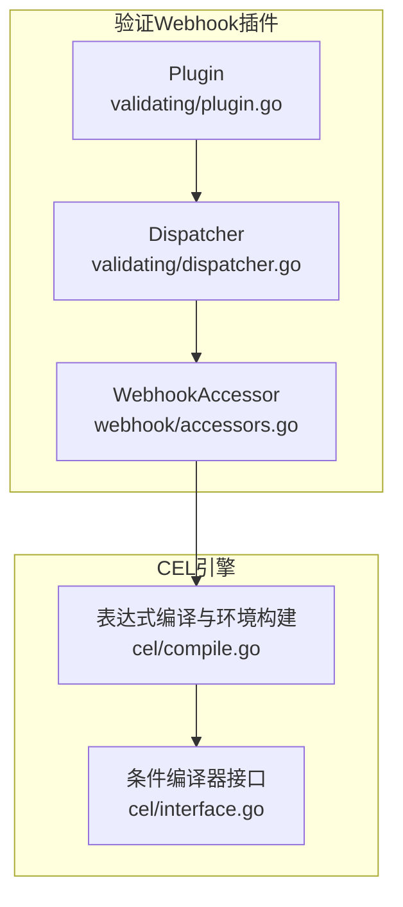
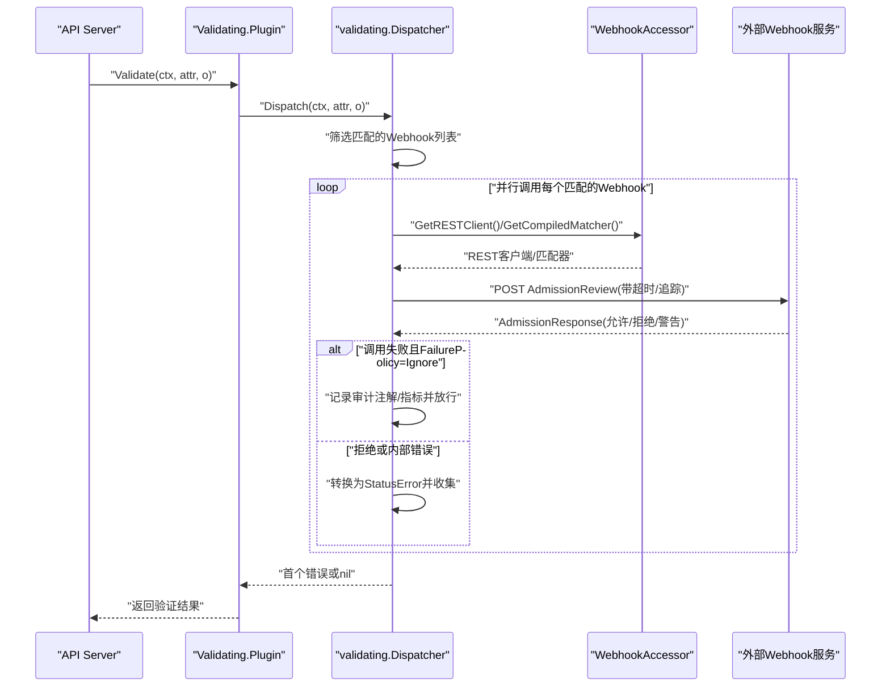
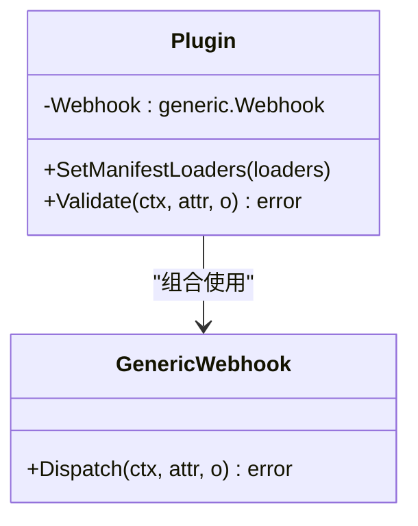
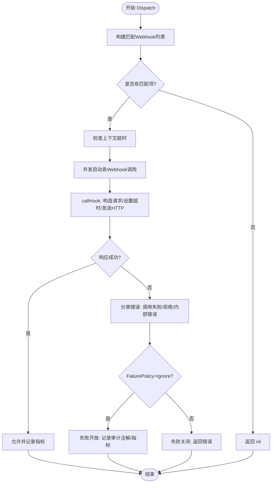
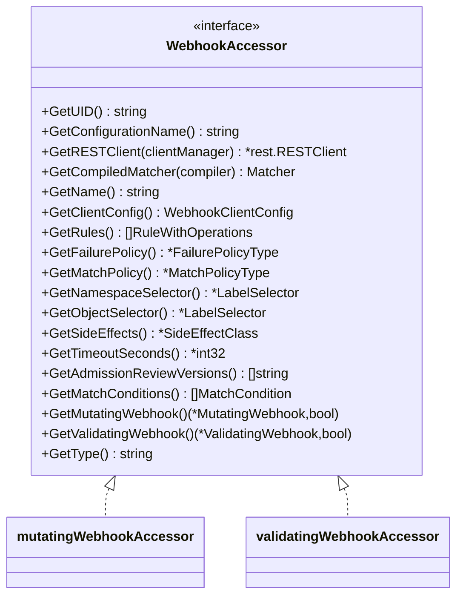
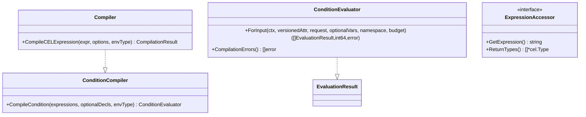
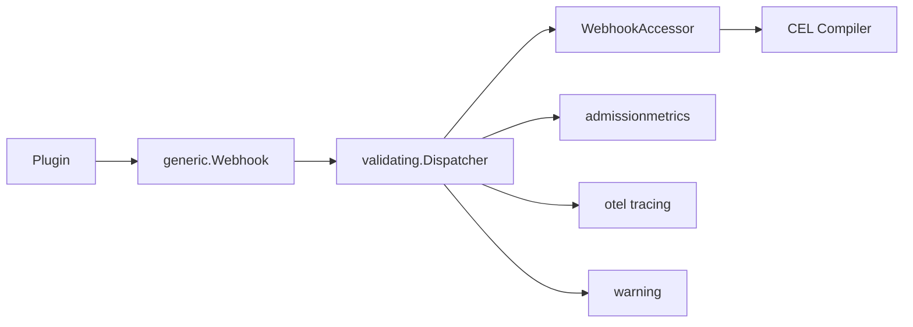

# 验证Webhook开发

<cite>
**本文引用的文件**   
- [accessors.go](file://staging/src/k8s.io/apiserver/pkg/admission/plugin/webhook/accessors.go)
- [dispatcher.go](file://staging/src/k8s.io/apiserver/pkg/admission/plugin/webhook/validating/dispatcher.go)
- [plugin.go](file://staging/src/k8s.io/apiserver/pkg/admission/plugin/webhook/validating/plugin.go)
- [compile.go](file://staging/src/k8s.io/apiserver/pkg/admission/plugin/cel/compile.go)
- [interface.go](file://staging/src/k8s.io/apiserver/pkg/admission/plugin/cel/interface.go)
</cite>

## 目录
1. [简介](#简介)
2. [项目结构](#项目结构)
3. [核心组件](#核心组件)
4. [架构总览](#架构总览)
5. [详细组件分析](#详细组件分析)
6. [依赖关系分析](#依赖关系分析)
7. [性能考虑](#性能考虑)
8. [故障排查指南](#故障排查指南)
9. [结论](#结论)
10. [附录：开发实践与示例路径](#附录开发实践与示例路径)

## 简介
本文件面向Kubernetes验证Webhook开发者，系统性阐述验证Webhook的工作机制、请求匹配与错误返回策略，深入解析 validating 包中的核心组件（dispatcher 与 plugin），并给出CEL表达式集成、规则编写、错误消息定制与性能优化的实战指南。文档同时提供代码级图示与可追溯的源码定位，帮助读者快速上手与排障。

## 项目结构
围绕验证Webhook的关键实现位于 apiserver 的 admission webhook 插件体系中，核心目录与职责如下：
- webhook/accessors.go：定义 WebhookAccessor 接口及其对 Mutating/Validating Webhook 的统一访问封装，负责选择器解析、REST客户端获取、MatchConditions编译等。
- validating/plugin.go：注册 ValidatingAdmissionWebhook 插件，创建通用 Webhook 调度入口，将 Validate 调用委托给 generic.Webhook.Dispatch。
- validating/dispatcher.go：实现具体分发逻辑，包括并行调用、失败策略处理、审计注解注入、指标上报、响应校验与拒绝转换。
- cel/compile.go 与 cel/interface.go：提供CEL表达式编译与评估接口，声明变量环境（object、oldObject、namespaceObject、request、authorizer 等）与可选绑定（params、authorizer）。

图表来源
- [plugin.go:70-86](file://staging/src/k8s.io/apiserver/pkg/admission/plugin/webhook/validating/plugin.go#L70-L86)
- [dispatcher.go:55-86](file://staging/src/k8s.io/apiserver/pkg/admission/plugin/webhook/validating/dispatcher.go#L55-L86)
- [accessors.go:34-86](file://staging/src/k8s.io/apiserver/pkg/admission/plugin/webhook/accessors.go#L34-L86)
- [compile.go:149-161](file://staging/src/k8s.io/apiserver/pkg/admission/plugin/cel/compile.go#L149-L161)
- [interface.go:69-99](file://staging/src/k8s.io/apiserver/pkg/admission/plugin/cel/interface.go#L69-L99)

章节来源
- [plugin.go:30-86](file://staging/src/k8s.io/apiserver/pkg/admission/plugin/webhook/validating/plugin.go#L30-L86)
- [dispatcher.go:55-116](file://staging/src/k8s.io/apiserver/pkg/admission/plugin/webhook/validating/dispatcher.go#L55-L116)
- [accessors.go:34-86](file://staging/src/k8s.io/apiserver/pkg/admission/plugin/webhook/accessors.go#L34-L86)
- [compile.go:149-161](file://staging/src/k8s.io/apiserver/pkg/admission/plugin/cel/compile.go#L149-L161)
- [interface.go:34-99](file://staging/src/k8s.io/apiserver/pkg/admission/plugin/cel/interface.go#L34-L99)

## 核心组件
- Plugin（验证Webhook插件）
  - 职责：注册插件名、构造通用 Webhook、暴露 Validate 方法，将请求派发至 Dispatcher。
  - 关键点：通过 SetManifestLoaders 支持从清单加载配置；Validate 直接调用 a.Webhook.Dispatch。
- Dispatcher（验证分发器）
  - 职责：根据规则与选择器筛选匹配的 Webhook，并行发起HTTP调用，统一处理超时、失败策略、拒绝与警告、审计注解与指标。
  - 关键点：并发安全、panic恢复、ErrCallingWebhook/ErrWebhookRejection 分类处理、SideEffects/DryRun 检查。
- WebhookAccessor（Webhook访问器）
  - 职责：为 Mutating/Validating Webhook 提供统一访问能力，包括名称、UID、ClientConfig、Rules、FailurePolicy、MatchPolicy、选择器、TimeoutSeconds、AdmissionReviewVersions、MatchConditions 等。
  - 关键点：懒初始化 REST 客户端与选择器；GetCompiledMatcher 基于 CEL 编译 MatchConditions。
- CEL 编译器与接口
  - 职责：提供表达式编译、类型声明（AdmissionRequest、Namespace）、可选变量绑定（params、authorizer）与程序实例化。
  - 关键点：预构建不同变量组合的环境；严格成本优化；支持 JSONPatch 等扩展库。

章节来源
- [plugin.go:47-86](file://staging/src/k8s.io/apiserver/pkg/admission/plugin/webhook/validating/plugin.go#L47-L86)
- [dispatcher.go:86-116](file://staging/src/k8s.io/apiserver/pkg/admission/plugin/webhook/validating/dispatcher.go#L86-L116)
- [accessors.go:34-86](file://staging/src/k8s.io/apiserver/pkg/admission/plugin/webhook/accessors.go#L34-L86)
- [compile.go:149-161](file://staging/src/k8s.io/apiserver/pkg/admission/plugin/cel/compile.go#L149-L161)
- [interface.go:69-99](file://staging/src/k8s.io/apiserver/pkg/admission/plugin/cel/interface.go#L69-L99)

## 架构总览
下图展示了从 API Server 进入验证Webhook插件到最终返回结果的完整流程，包括匹配、并行调用、错误处理与结果聚合。

图表来源
- [plugin.go:82-86](file://staging/src/k8s.io/apiserver/pkg/admission/plugin/webhook/validating/plugin.go#L82-L86)
- [dispatcher.go:88-116](file://staging/src/k8s.io/apiserver/pkg/admission/plugin/webhook/validating/dispatcher.go#L88-L116)
- [dispatcher.go:248-333](file://staging/src/k8s.io/apiserver/pkg/admission/plugin/webhook/validating/dispatcher.go#L248-L333)
- [accessors.go:122-127](file://staging/src/k8s.io/apiserver/pkg/admission/plugin/webhook/accessors.go#L122-L127)
- [accessors.go:254-259](file://staging/src/k8s.io/apiserver/pkg/admission/plugin/webhook/accessors.go#L254-L259)

## 详细组件分析

### 验证插件（Plugin）
- 注册与生命周期
  - 通过 Register 将插件名“ValidatingAdmissionWebhook”注册到 admission.Plugins。
  - NewValidatingAdmissionWebhook 创建 Handler 并组装 generic.Webhook，设置配置文件与 Dispatcher 工厂。
- 清单加载
  - SetManifestLoaders 接收清单加载函数，构造 source.NewValidatingSource 并执行初始加载。
- 验证入口
  - Validate 直接委托 a.Webhook.Dispatch，由上层 generic.Webhook 完成匹配与调度。

图表来源
- [plugin.go:35-45](file://staging/src/k8s.io/apiserver/pkg/admission/plugin/webhook/validating/plugin.go#L35-L45)
- [plugin.go:55-68](file://staging/src/k8s.io/apiserver/pkg/admission/plugin/webhook/validating/plugin.go#L55-L68)
- [plugin.go:70-86](file://staging/src/k8s.io/apiserver/pkg/admission/plugin/webhook/validating/plugin.go#L70-L86)

章节来源
- [plugin.go:30-86](file://staging/src/k8s.io/apiserver/pkg/admission/plugin/webhook/validating/plugin.go#L30-L86)

### 验证分发器（Dispatcher）
- 匹配与版本化属性缓存
  - 遍历 hooks，调用 ShouldCallHook 判断是否匹配；缓存 VersionedAttributes 避免重复转换。
- 并发与容错
  - 使用 WaitGroup 与 errCh 并行调用；defer utilruntime.HandleCrash 捕获 panic，按 FailurePolicy 决定是否失败开放。
- 调用细节
  - callHook 中检查 DryRun 与 SideEffects；构造 AdmissionRequest/Response；根据 TimeoutSeconds 包装上下文；设置 HTTP 超时；记录追踪与指标；校验响应并转换为拒绝或允许。
- 错误与审计
  - ErrCallingWebhook：连接/网络错误，按 Ignore/Abort 策略处理；ErrWebhookRejection：业务拒绝；注入审计注解与告警。

图表来源
- [dispatcher.go:88-116](file://staging/src/k8s.io/apiserver/pkg/admission/plugin/webhook/validating/dispatcher.go#L88-L116)
- [dispatcher.go:126-228](file://staging/src/k8s.io/apiserver/pkg/admission/plugin/webhook/validating/dispatcher.go#L126-L228)
- [dispatcher.go:248-333](file://staging/src/k8s.io/apiserver/pkg/admission/plugin/webhook/validating/dispatcher.go#L248-L333)

章节来源
- [dispatcher.go:86-116](file://staging/src/k8s.io/apiserver/pkg/admission/plugin/webhook/validating/dispatcher.go#L86-L116)
- [dispatcher.go:126-228](file://staging/src/k8s.io/apiserver/pkg/admission/plugin/webhook/validating/dispatcher.go#L126-L228)
- [dispatcher.go:248-333](file://staging/src/k8s.io/apiserver/pkg/admission/plugin/webhook/validating/dispatcher.go#L248-L333)

### WebhookAccessor（访问器）
- 统一接口
  - 提供 GetUID、GetConfigurationName、GetRESTClient、GetCompiledMatcher、GetName、GetClientConfig、GetRules、GetFailurePolicy、GetMatchPolicy、GetNamespaceSelector、GetObjectSelector、GetSideEffects、GetTimeoutSeconds、GetAdmissionReviewVersions、GetMatchConditions、GetMutatingWebhook、GetValidatingWebhook、GetType。
- 懒初始化
  - 使用 sync.Once 延迟初始化对象/命名空间选择器、REST 客户端与 MatchConditions 匹配器，提升性能与稳定性。
- CEL 集成
  - GetCompiledMatcher 将 MatchConditions 表达式交由 CEL 编译器编译，生成 Matcher，用于后续条件匹配。

图表来源
- [accessors.go:34-86](file://staging/src/k8s.io/apiserver/pkg/admission/plugin/webhook/accessors.go#L34-L86)
- [accessors.go:88-112](file://staging/src/k8s.io/apiserver/pkg/admission/plugin/webhook/accessors.go#L88-L112)
- [accessors.go:220-244](file://staging/src/k8s.io/apiserver/pkg/admission/plugin/webhook/accessors.go#L220-L244)

章节来源
- [accessors.go:34-86](file://staging/src/k8s.io/apiserver/pkg/admission/plugin/webhook/accessors.go#L34-L86)
- [accessors.go:122-127](file://staging/src/k8s.io/apiserver/pkg/admission/plugin/webhook/accessors.go#L122-L127)
- [accessors.go:133-152](file://staging/src/k8s.io/apiserver/pkg/admission/plugin/webhook/accessors.go#L133-L152)
- [accessors.go:254-259](file://staging/src/k8s.io/apiserver/pkg/admission/plugin/webhook/accessors.go#L254-L259)
- [accessors.go:261-280](file://staging/src/k8s.io/apiserver/pkg/admission/plugin/webhook/accessors.go#L261-L280)

### CEL 表达式引擎集成
- 变量与环境
  - 内置变量：object、oldObject、namespaceObject、request；可选变量：params、authorizer、authorizer.requestResource。
  - 类型声明：kubernetes.AdmissionRequest、kubernetes.Namespace 等。
- 编译与评估
  - Compiler.CompileCELExpression 根据 OptionalVariableDeclarations 选择合适的环境，进行编译、类型检查与程序实例化。
  - ConditionCompiler/ConditionEvaluator 提供条件编译与运行时评估接口，支持成本预算与错误收集。
- 在匹配中的应用
  - WebhookAccessor.GetCompiledMatcher 将 MatchConditions 表达式交给编译器，生成 Matcher，用于在 ShouldCallHook 阶段进行条件匹配。

图表来源
- [compile.go:149-161](file://staging/src/k8s.io/apiserver/pkg/admission/plugin/cel/compile.go#L149-L161)
- [compile.go:165-223](file://staging/src/k8s.io/apiserver/pkg/admission/plugin/cel/compile.go#L165-L223)
- [interface.go:69-99](file://staging/src/k8s.io/apiserver/pkg/admission/plugin/cel/interface.go#L69-L99)
- [interface.go:34-44](file://staging/src/k8s.io/apiserver/pkg/admission/plugin/cel/interface.go#L34-L44)

章节来源
- [compile.go:149-161](file://staging/src/k8s.io/apiserver/pkg/admission/plugin/cel/compile.go#L149-L161)
- [compile.go:165-223](file://staging/src/k8s.io/apiserver/pkg/admission/plugin/cel/compile.go#L165-L223)
- [interface.go:69-99](file://staging/src/k8s.io/apiserver/pkg/admission/plugin/cel/interface.go#L69-L99)
- [interface.go:34-44](file://staging/src/k8s.io/apiserver/pkg/admission/plugin/cel/interface.go#L34-L44)

## 依赖关系分析
- 组件耦合
  - Plugin 仅依赖 generic.Webhook 与 manifest loader，保持高内聚低耦合。
  - Dispatcher 依赖 WebhookAccessor 获取客户端与匹配器，依赖 metrics/tracing/warning 等基础设施。
  - WebhookAccessor 依赖 CEL 编译器与 matchconditions 模块，屏蔽底层差异。
- 外部依赖
  - REST 客户端由 webhookutil.ClientManager 管理；HTTP 调用受超时控制；指标与追踪由 apiserver 层提供。
- 潜在循环
  - 当前结构无循环依赖，插件与分发器通过接口解耦。

图表来源
- [plugin.go:70-86](file://staging/src/k8s.io/apiserver/pkg/admission/plugin/webhook/validating/plugin.go#L70-L86)
- [dispatcher.go:86-116](file://staging/src/k8s.io/apiserver/pkg/admission/plugin/webhook/validating/dispatcher.go#L86-L116)
- [accessors.go:133-152](file://staging/src/k8s.io/apiserver/pkg/admission/plugin/webhook/accessors.go#L133-L152)

章节来源
- [plugin.go:70-86](file://staging/src/k8s.io/apiserver/pkg/admission/plugin/webhook/validating/plugin.go#L70-L86)
- [dispatcher.go:86-116](file://staging/src/k8s.io/apiserver/pkg/admission/plugin/webhook/validating/dispatcher.go#L86-L116)
- [accessors.go:133-152](file://staging/src/k8s.io/apiserver/pkg/admission/plugin/webhook/accessors.go#L133-L152)

## 性能考虑
- 并发调用
  - Dispatcher 对匹配的 Webhook 并行调用，显著降低端到端延迟；注意 errCh 容量与 panic 恢复开销。
- 懒初始化
  - WebhookAccessor 对选择器、REST 客户端与匹配器使用 sync.Once 延迟初始化，减少冷启动与重复计算。
- 版本化属性缓存
  - versionedAttributeAccessor 缓存 VersionedAttributes，避免多次转换同一 GVK 的对象。
- 超时与成本
  - 支持单个 Webhook 的 TimeoutSeconds；CEL 编译启用严格成本优化与中断频率，防止表达式执行过长。
- 指标与追踪
  - 合理开启指标与追踪有助于定位瓶颈，但需权衡额外开销。

[本节为通用指导，不直接分析具体文件]

## 故障排查指南
- 常见错误类型
  - ErrCallingWebhook：调用失败（网络/超时/服务端错误），依据 FailurePolicy 决定失败开放或关闭。
  - ErrWebhookRejection：业务拒绝，转换为 StatusError 返回。
  - 内部错误：未分类异常，默认拒绝并记录日志。
- 关键检查点
  - SideEffects 与 DryRun：DryRun 模式下要求 SideEffects 为 None 或 NoneOnDryRun，否则返回不支持错误。
  - 审计注解：失败开放时注入 failed-open.* 注解，便于审计与观测。
  - 指标与追踪：ObserveWebhook/ObserveWebhookRejection/ObserveWebhookFailOpen 可用于定位问题。
- 调试建议
  - 查看 AdmissionAudit 注解与告警信息；确认 Webhook 返回的 Result 字段；核对 TimeoutSeconds 与上下文超时。
  - 使用 klog 输出与 OpenTelemetry span 跟踪调用链。

章节来源
- [dispatcher.go:126-228](file://staging/src/k8s.io/apiserver/pkg/admission/plugin/webhook/validating/dispatcher.go#L126-L228)
- [dispatcher.go:248-333](file://staging/src/k8s.io/apiserver/pkg/admission/plugin/webhook/validating/dispatcher.go#L248-L333)

## 结论
验证Webhook通过插件化与通用分发器实现了高可扩展性与高性能的准入控制。WebhookAccessor 统一了配置访问与匹配器编译，Dispatcher 负责并发调用与错误处理，CEL 引擎提供强大的条件表达与匹配能力。遵循本文的开发指南与最佳实践，可有效提升验证规则的可靠性与性能。

[本节为总结性内容，不直接分析具体文件]

## 附录：开发实践与示例路径
- 编写验证规则
  - 使用 MatchConditions 与 CEL 表达式进行前置匹配与条件判断；参考：
    - [accessors.go:133-152](file://staging/src/k8s.io/apiserver/pkg/admission/plugin/webhook/accessors.go#L133-L152)
    - [compile.go:165-223](file://staging/src/k8s.io/apiserver/pkg/admission/plugin/cel/compile.go#L165-L223)
- 错误消息定制
  - 在 Webhook 服务端返回 Result 字段，包含 message 与 code；参考：
    - [dispatcher.go:315-333](file://staging/src/k8s.io/apiserver/pkg/admission/plugin/webhook/validating/dispatcher.go#L315-L333)
- 性能优化
  - 合理设置 TimeoutSeconds；避免复杂 CEL 表达式；利用懒初始化与缓存；参考：
    - [dispatcher.go:276-296](file://staging/src/k8s.io/apiserver/pkg/admission/plugin/webhook/validating/dispatcher.go#L276-L296)
    - [accessors.go:122-127](file://staging/src/k8s.io/apiserver/pkg/admission/plugin/webhook/accessors.go#L122-L127)
- CEL 集成要点
  - 变量与类型：object、oldObject、namespaceObject、request、authorizer；参考：
    - [compile.go:44-89](file://staging/src/k8s.io/apiserver/pkg/admission/plugin/cel/compile.go#L44-89)
    - [compile.go:91-139](file://staging/src/k8s.io/apiserver/pkg/admission/plugin/cel/compile.go#L91-139)
  - 可选绑定：params、authorizer；参考：
    - [interface.go:54-84](file://staging/src/k8s.io/apiserver/pkg/admission/plugin/cel/interface.go#L54-84)