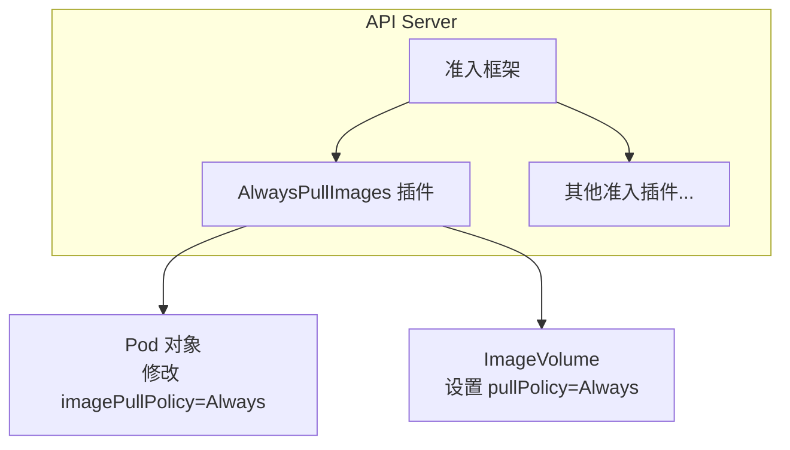
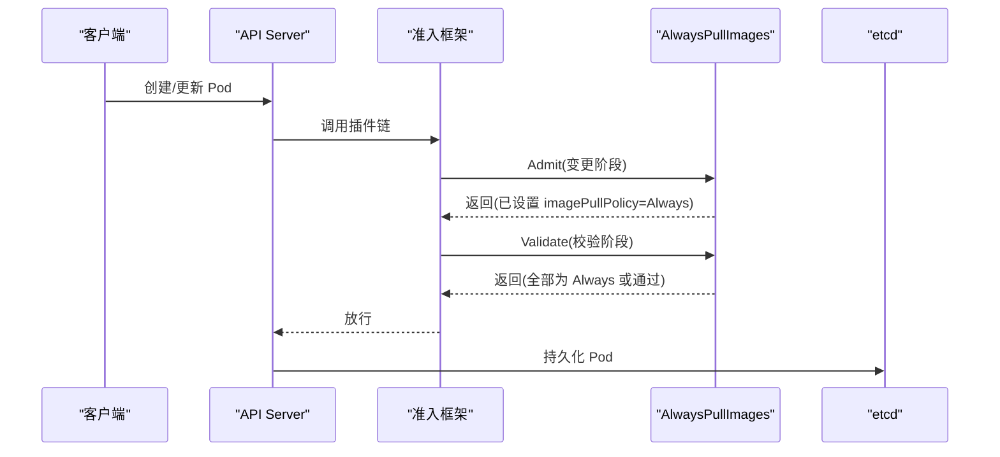
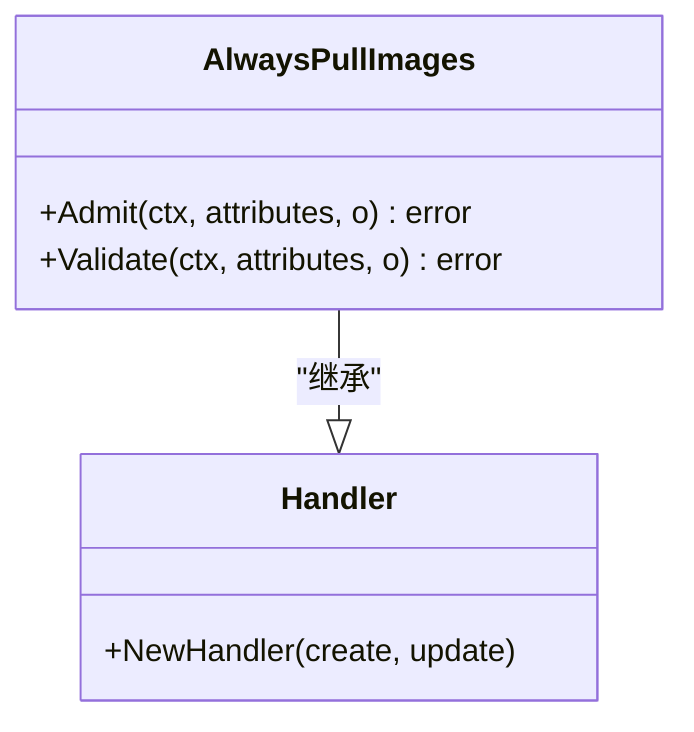
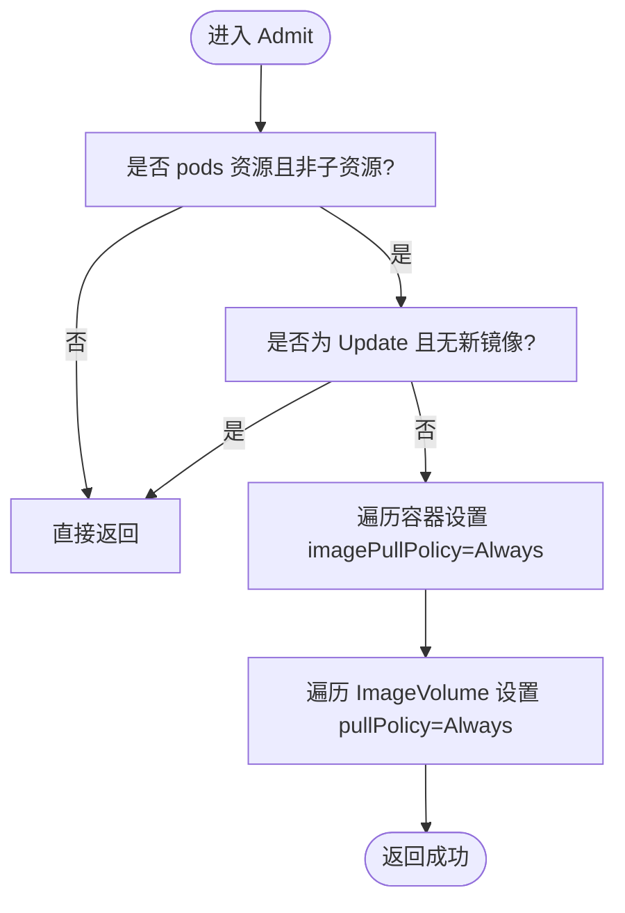
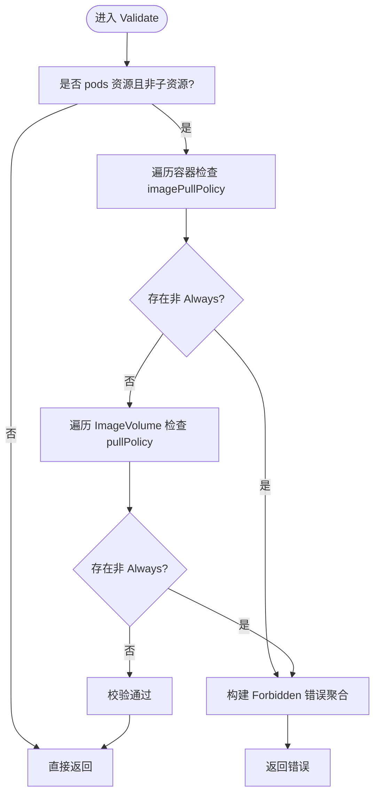
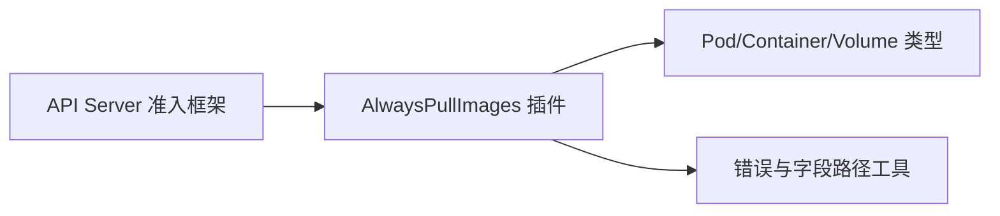

# AlwaysPullImages插件

<cite>
**本文引用的文件**   
- [plugin/pkg/admission/alwayspullimages/admission.go](file://plugin/pkg/admission/alwayspullimages/admission.go)
- [plugin/pkg/admission/alwayspullimages/admission_test.go](file://plugin/pkg/admission/alwayspullimages/admission_test.go)
- [pkg/kubeapiserver/options/plugins.go](file://pkg/kubeapiserver/options/plugins.go)
</cite>

## 目录
1. [简介](#简介)
2. [项目结构](#项目结构)
3. [核心组件](#核心组件)
4. [架构总览](#架构总览)
5. [详细组件分析](#详细组件分析)
6. [依赖关系分析](#依赖关系分析)
7. [性能考量](#性能考量)
8. [故障排查指南](#故障排查指南)
9. [结论](#结论)
10. [附录](#附录)

## 简介
AlwaysPullImages 是 Kubernetes API Server 的一个准入控制插件，用于在多租户或安全敏感环境中强制 Pod 每次启动时从镜像仓库拉取最新镜像。其核心行为包括：
- 在创建和更新 Pod 的变更路径中，将每个容器与 ImageVolume 的镜像拉取策略统一设置为“始终拉取”。
- 在验证阶段拒绝任何未满足“始终拉取”的策略配置，确保一致性。

该插件适用于需要保证镜像实时性与访问控制的场景，例如多租户集群、严格合规环境等。启用后，所有 Pod 的镜像拉取都会经过认证检查，避免节点本地缓存被任意用户复用。

## 项目结构
本插件位于 admission 插件体系下，由 API Server 在启动时注册并参与请求处理链。关键位置如下：
- 插件实现：plugin/pkg/admission/alwayspullimages/admission.go
- 单元测试：plugin/pkg/admission/alwayspullimages/admission_test.go
- 插件注册与执行顺序：pkg/kubeapiserver/options/plugins.go

图表来源
- [plugin/pkg/admission/alwayspullimages/admission.go:41-49](file://plugin/pkg/admission/alwayspullimages/admission.go#L41-L49)
- [plugin/pkg/admission/alwayspullimages/admission.go:60-84](file://plugin/pkg/admission/alwayspullimages/admission.go#L60-L84)
- [plugin/pkg/admission/alwayspullimages/admission.go:86-125](file://plugin/pkg/admission/alwayspullimages/admission.go#L86-L125)
- [pkg/kubeapiserver/options/plugins.go:72-118](file://pkg/kubeapiserver/options/plugins.go#L72-L118)

章节来源
- [plugin/pkg/admission/alwayspullimages/admission.go:1-179](file://plugin/pkg/admission/alwayspullimages/admission.go#L1-L179)
- [plugin/pkg/admission/alwayspullimages/admission_test.go:1-289](file://plugin/pkg/admission/alwayspullimages/admission_test.go#L1-L289)
- [pkg/kubeapiserver/options/plugins.go:1-199](file://pkg/kubeapiserver/options/plugins.go#L1-L199)

## 核心组件
- 插件名称与注册
  - 插件名为固定常量，通过 Register 函数向准入框架注册。
- 处理器类型
  - 实现 MutationInterface 与 ValidationInterface，分别负责“修改默认值”和“校验策略”。
- 生命周期钩子
  - Admit：对 Create/Update 的 Pod 进行变更，将所有容器的 imagePullPolicy 设为 Always，并对 ImageVolume 的 pullPolicy 做同样处理。
  - Validate：对所有容器与 ImageVolume 的拉取策略进行校验，非 Always 则拒绝。
- 忽略逻辑
  - 仅作用于 pods 资源且非子资源；当为 Update 且未引入新镜像时跳过处理，以减少不必要的开销。

章节来源
- [plugin/pkg/admission/alwayspullimages/admission.go:41-49](file://plugin/pkg/admission/alwayspullimages/admission.go#L41-L49)
- [plugin/pkg/admission/alwayspullimages/admission.go:51-58](file://plugin/pkg/admission/alwayspullimages/admission.go#L51-L58)
- [plugin/pkg/admission/alwayspullimages/admission.go:60-84](file://plugin/pkg/admission/alwayspullimages/admission.go#L60-L84)
- [plugin/pkg/admission/alwayspullimages/admission.go:86-125](file://plugin/pkg/admission/alwayspullimages/admission.go#L86-L125)
- [plugin/pkg/admission/alwayspullimages/admission.go:127-171](file://plugin/pkg/admission/alwayspullimages/admission.go#L127-L171)

## 架构总览
AlwaysPullImages 作为 API Server 的准入插件，处于请求进入存储层之前的处理链中。其执行顺序在 AllOrderedPlugins 列表中定义，位于多个基础插件之后、Webhook 之前。

图表来源
- [plugin/pkg/admission/alwayspullimages/admission.go:60-84](file://plugin/pkg/admission/alwayspullimages/admission.go#L60-L84)
- [plugin/pkg/admission/alwayspullimages/admission.go:86-125](file://plugin/pkg/admission/alwayspullimages/admission.go#L86-L125)
- [pkg/kubeapiserver/options/plugins.go:72-118](file://pkg/kubeapiserver/options/plugins.go#L72-L118)

## 详细组件分析

### 类图（代码级）

图表来源
- [plugin/pkg/admission/alwayspullimages/admission.go:51-58](file://plugin/pkg/admission/alwayspullimages/admission.go#L51-L58)
- [plugin/pkg/admission/alwayspullimages/admission.go:173-178](file://plugin/pkg/admission/alwayspullimages/admission.go#L173-L178)

### 变更流程（Admit）
- 过滤条件：仅处理 pods 资源且非子资源的请求。
- 遍历容器：将每个容器（含 InitContainers）的 imagePullPolicy 设置为 Always。
- 遍历 Volume：对 ImageVolume 的 pullPolicy 也设置为 Always。
- 优化：若为 Update 且未引入新镜像，直接忽略，避免重复处理。

图表来源
- [plugin/pkg/admission/alwayspullimages/admission.go:60-84](file://plugin/pkg/admission/alwayspullimages/admission.go#L60-L84)
- [plugin/pkg/admission/alwayspullimages/admission.go:127-171](file://plugin/pkg/admission/alwayspullimages/admission.go#L127-L171)

### 校验流程（Validate）
- 过滤条件：同 Admit。
- 遍历容器：若任一容器的 imagePullPolicy 不为 Always，则拒绝并返回错误聚合。
- 遍历 Volume：若任一 ImageVolume 的 pullPolicy 不为 Always，则拒绝并返回错误聚合。

图表来源
- [plugin/pkg/admission/alwayspullimages/admission.go:86-125](file://plugin/pkg/admission/alwayspullimages/admission.go#L86-L125)

### 使用与配置
- 启用方式：在 API Server 的准入插件列表中包含 AlwaysPullImages。
- 执行顺序：在 AllOrderedPlugins 中定义，位于多个基础插件之后、Webhook 之前。
- 注意：该插件无需外部配置文件，行为完全由源码逻辑决定。

章节来源
- [pkg/kubeapiserver/options/plugins.go:72-118](file://pkg/kubeapiserver/options/plugins.go#L72-L118)
- [plugin/pkg/admission/alwayspullimages/admission.go:41-49](file://plugin/pkg/admission/alwayspullimages/admission.go#L41-L49)

### 测试要点（来自单元测试）
- 创建 Pod：所有容器与 ImageVolume 的拉取策略均被设置为 Always。
- 校验失败：若存在非 Always 的策略，会返回包含具体字段路径的错误聚合。
- 其他资源与子资源：不生效。
- 更新 Pod：若无新镜像引入，则忽略处理；若引入新镜像，则按规则处理。

章节来源
- [plugin/pkg/admission/alwayspullimages/admission_test.go:30-76](file://plugin/pkg/admission/alwayspullimages/admission_test.go#L30-L76)
- [plugin/pkg/admission/alwayspullimages/admission_test.go:78-122](file://plugin/pkg/admission/alwayspullimages/admission_test.go#L78-L122)
- [plugin/pkg/admission/alwayspullimages/admission_test.go:124-189](file://plugin/pkg/admission/alwayspullimages/admission_test.go#L124-L189)
- [plugin/pkg/admission/alwayspullimages/admission_test.go:191-289](file://plugin/pkg/admission/alwayspullimages/admission_test.go#L191-L289)

## 依赖关系分析
- 内部依赖
  - 使用通用准入框架接口（admission.Interface、MutationInterface、ValidationInterface）。
  - 使用 Pod 对象模型与容器/卷访问工具进行遍历与修改。
- 外部依赖
  - 错误处理与字段路径工具用于构造清晰的拒绝信息。
- 耦合与内聚
  - 插件职责单一，仅关注镜像拉取策略的统一与校验，内聚性高。
  - 与其他插件解耦，通过标准接口接入。

图表来源
- [plugin/pkg/admission/alwayspullimages/admission.go:27-39](file://plugin/pkg/admission/alwayspullimages/admission.go#L27-L39)
- [plugin/pkg/admission/alwayspullimages/admission.go:51-58](file://plugin/pkg/admission/alwayspullimages/admission.go#L51-L58)

章节来源
- [plugin/pkg/admission/alwayspullimages/admission.go:27-39](file://plugin/pkg/admission/alwayspullimages/admission.go#L27-L39)

## 性能考量
- 优点
  - 仅在 Create/Update 路径上运行，且对 Update 做了“无新镜像即忽略”的优化，减少不必要开销。
  - 操作为内存中的对象遍历与赋值，复杂度与容器/卷数量线性相关，通常开销较小。
- 潜在影响
  - 每次 Pod 创建/更新都会触发镜像拉取，可能增加镜像仓库压力与网络带宽消耗。
  - 在高并发 Pod 创建场景下，镜像拉取的 I/O 与鉴权开销可能成为瓶颈。
- 建议
  - 在大规模批量部署时，结合镜像预热、镜像缓存与仓库限流策略。
  - 对只读静态镜像可考虑禁用该插件或使用更细粒度的策略（如基于命名空间或标签的准入策略）。

[本节为通用指导，不涉及具体文件分析]

## 故障排查指南
- 现象：Pod 创建被拒绝，提示 imagePullPolicy 不支持的值。
  - 原因：Validate 阶段发现容器或 ImageVolume 的拉取策略不是 Always。
  - 处理：修正 Pod 模板，确保所有容器与 ImageVolume 的拉取策略为 Always。
- 现象：更新 Pod 未生效。
  - 原因：若为 Update 且未引入新镜像，插件会忽略处理。
  - 处理：确认是否确实引入了新镜像；如需强制重新拉取，请变更镜像引用。
- 现象：非 Pod 资源不受影响。
  - 原因：插件仅作用于 pods 资源且非子资源。
  - 处理：确认请求的资源类型与子资源是否符合预期。
- 日志定位
  - 在转换失败时会记录警告日志，便于快速定位问题对象。

章节来源
- [plugin/pkg/admission/alwayspullimages/admission.go:86-125](file://plugin/pkg/admission/alwayspullimages/admission.go#L86-L125)
- [plugin/pkg/admission/alwayspullimages/admission.go:127-171](file://plugin/pkg/admission/alwayspullimages/admission.go#L127-L171)
- [plugin/pkg/admission/alwayspullimages/admission_test.go:78-122](file://plugin/pkg/admission/alwayspullimages/admission_test.go#L78-L122)

## 结论
AlwaysPullImages 插件以最小侵入的方式，确保集群中所有 Pod 的镜像拉取策略一致为“始终拉取”，从而提升多租户环境下的安全性与镜像实时性。其实现简洁、职责清晰，并通过忽略无变更的更新请求来降低性能影响。在生产环境中，应结合业务特性与镜像仓库能力评估启用范围，必要时配合更精细的准入策略与镜像管理方案。

[本节为总结，不涉及具体文件分析]

## 附录
- 最佳实践
  - 在开发/测试环境谨慎启用，避免频繁拉取带来的延迟。
  - 生产环境建议配合私有镜像仓库与凭证管理，确保拉取鉴权有效。
  - 对大型镜像或高频更新的镜像，建议采用分层缓存与镜像预热策略。
- 适用场景
  - 多租户共享集群，需防止镜像缓存被未授权用户复用。
  - 强合规要求，需保证每次启动都拉取最新镜像版本。
- 不适用场景
  - 离线或弱网环境，频繁拉取可能导致启动缓慢。
  - 对启动时延极度敏感的工作负载，需谨慎评估。

[本节为通用指导，不涉及具体文件分析]