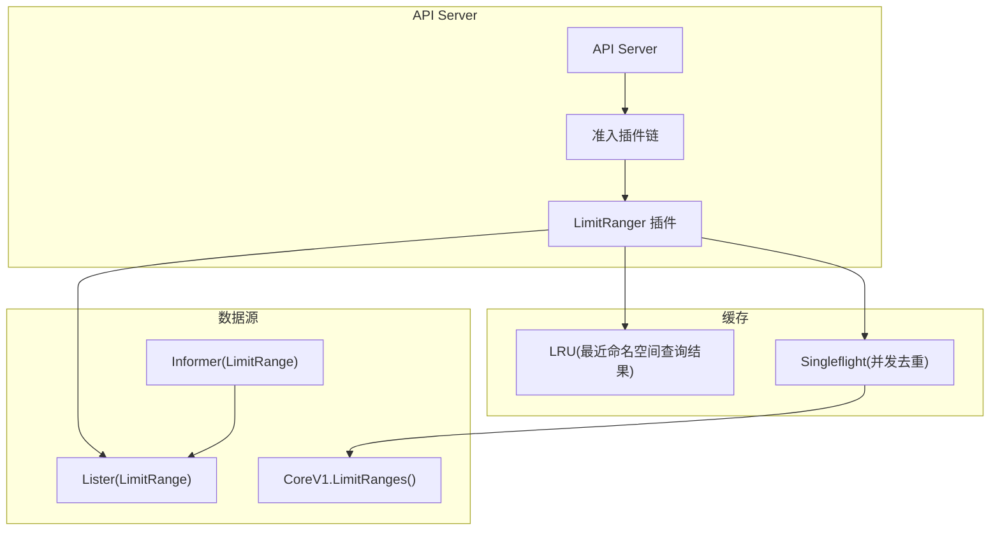
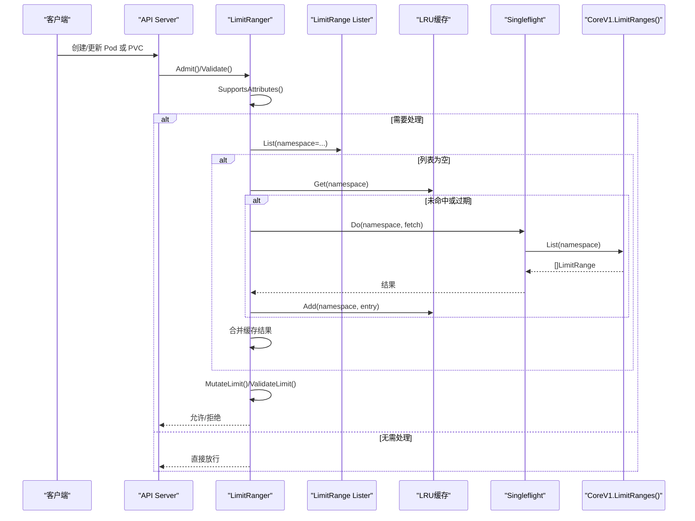
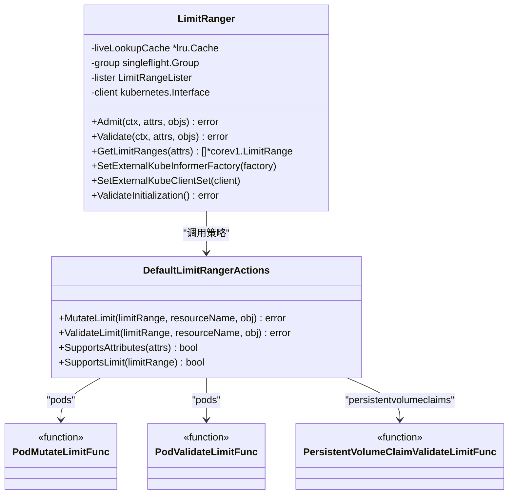
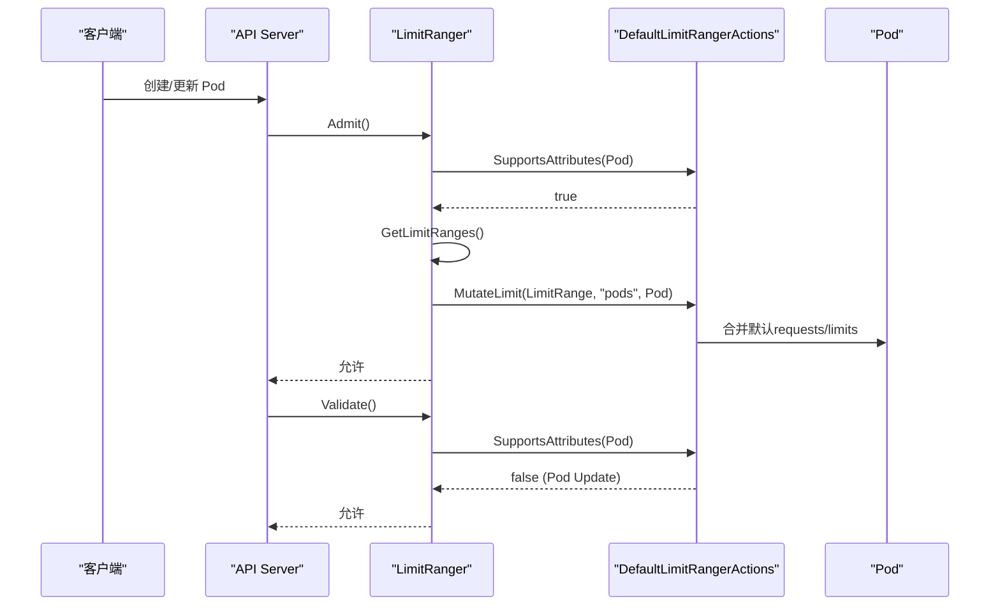
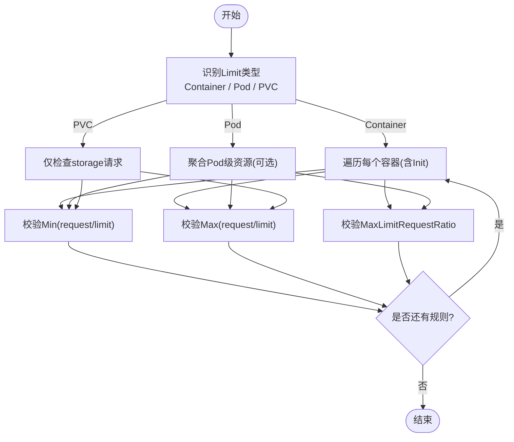
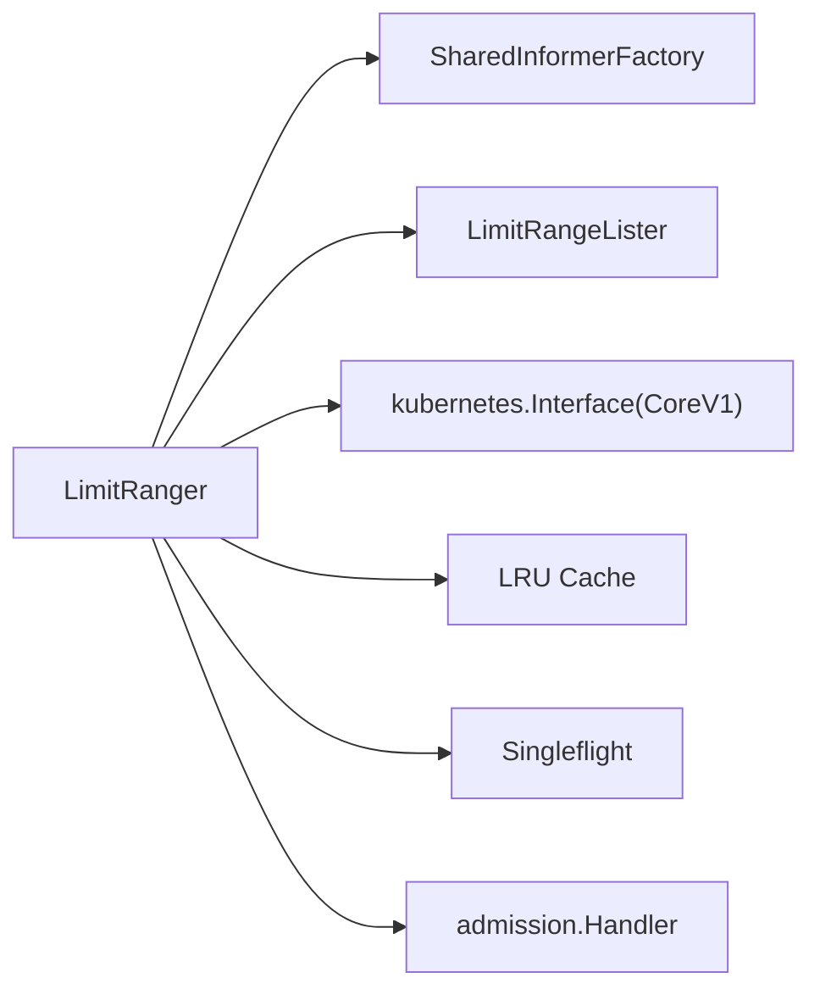

# LimitRanger插件

<cite>
**本文引用的文件**   
- [admission.go](file://plugin/pkg/admission/limitranger/admission.go)
- [types.go](file://staging/src/k8s.io/api/core/v1/types.go)
</cite>

## 目录
1. [简介](#简介)
2. [项目结构](#项目结构)
3. [核心组件](#核心组件)
4. [架构总览](#架构总览)
5. [详细组件分析](#详细组件分析)
6. [依赖关系分析](#依赖关系分析)
7. [性能考虑](#性能考虑)
8. [故障排查指南](#故障排查指南)
9. [结论](#结论)
10. [附录](#附录)

## 简介
LimitRanger是Kubernetes API Server的准入控制插件，用于在命名空间级别为资源设置默认的资源请求与限制，并对提交对象的资源使用进行校验。其核心能力包括：
- 为Pod中的容器（含Init Containers）自动补全缺失的requests/limits
- 对Pod和PVC的资源请求/限制进行最小值、最大值以及最大limit-to-request比率约束校验
- 支持Pod级别资源（在启用相应特性门控时）参与聚合计算与校验
- 通过注解记录由插件注入的默认值，便于审计与排障

该插件在API请求进入阶段执行，属于“变更+验证”型插件，既会修改对象（Admit），也会拒绝不合规对象（Validate）。

## 项目结构
本插件位于kube-apiserver的准入插件体系中，主要实现集中在单一文件中，并通过标准注册机制接入API Server的插件链。

图表来源
- [admission.go:55-58](file://plugin/pkg/admission/limitranger/admission.go#L55-L58)
- [admission.go:87-97](file://plugin/pkg/admission/limitranger/admission.go#L87-L97)
- [admission.go:160-195](file://plugin/pkg/admission/limitranger/admission.go#L160-L195)

章节来源
- [admission.go:55-58](file://plugin/pkg/admission/limitranger/admission.go#L55-L58)
- [admission.go:87-97](file://plugin/pkg/admission/limitranger/admission.go#L87-L97)

## 核心组件
- 插件入口与生命周期
  - 注册：提供插件名与构造器，返回LimitRanger实例
  - 初始化：注入外部InformerFactory与ClientSet，并设置ReadyFunc
  - 校验初始化：确保lister与client已就绪
- 准入钩子
  - Admit：对创建/更新请求执行变更逻辑（填充默认值）
  - Validate：对创建/更新请求执行校验逻辑（最小/最大/比率）
- 数据获取与缓存
  - GetLimitRanges：优先从本地Lister读取；若为空则走LRU缓存；未命中则经singleflight去重后直连API拉取，并回填缓存
- 动作策略
  - DefaultLimitRangerActions：定义MutateLimit/ValidateLimit/SupportsAttributes/SupportsLimit等策略
- Pod/PVC处理
  - Pod：合并默认资源、校验Min/Max/MaxLimitRequestRatio，聚合Pod级资源（当特性开启）
  - PVC：仅校验storage请求的Min/Max

章节来源
- [admission.go:55-58](file://plugin/pkg/admission/limitranger/admission.go#L55-L58)
- [admission.go:87-108](file://plugin/pkg/admission/limitranger/admission.go#L87-L108)
- [admission.go:110-156](file://plugin/pkg/admission/limitranger/admission.go#L110-L156)
- [admission.go:160-195](file://plugin/pkg/admission/limitranger/admission.go#L160-L195)
- [admission.go:387-445](file://plugin/pkg/admission/limitranger/admission.go#L387-L445)
- [admission.go:475-557](file://plugin/pkg/admission/limitranger/admission.go#L475-L557)
- [admission.go:447-473](file://plugin/pkg/admission/limitranger/admission.go#L447-L473)

## 架构总览
下图展示了LimitRanger在API请求路径中的位置及关键交互。

图表来源
- [admission.go:110-156](file://plugin/pkg/admission/limitranger/admission.go#L110-L156)
- [admission.go:160-195](file://plugin/pkg/admission/limitranger/admission.go#L160-L195)
- [admission.go:387-445](file://plugin/pkg/admission/limitranger/admission.go#L387-L445)

## 详细组件分析

### 类与职责图

图表来源
- [admission.go:61-74](file://plugin/pkg/admission/limitranger/admission.go#L61-L74)
- [admission.go:387-445](file://plugin/pkg/admission/limitranger/admission.go#L387-L445)
- [admission.go:475-557](file://plugin/pkg/admission/limitranger/admission.go#L475-L557)
- [admission.go:447-473](file://plugin/pkg/admission/limitranger/admission.go#L447-L473)

章节来源
- [admission.go:61-74](file://plugin/pkg/admission/limitranger/admission.go#L61-L74)
- [admission.go:387-445](file://plugin/pkg/admission/limitranger/admission.go#L387-L445)
- [admission.go:475-557](file://plugin/pkg/admission/limitranger/admission.go#L475-L557)
- [admission.go:447-473](file://plugin/pkg/admission/limitranger/admission.go#L447-L473)

### 准入流程时序（以Pod为例）

图表来源
- [admission.go:110-156](file://plugin/pkg/admission/limitranger/admission.go#L110-L156)
- [admission.go:418-440](file://plugin/pkg/admission/limitranger/admission.go#L418-L440)
- [admission.go:475-482](file://plugin/pkg/admission/limitranger/admission.go#L475-L482)

章节来源
- [admission.go:110-156](file://plugin/pkg/admission/limitranger/admission.go#L110-L156)
- [admission.go:418-440](file://plugin/pkg/admission/limitranger/admission.go#L418-L440)
- [admission.go:475-482](file://plugin/pkg/admission/limitranger/admission.go#L475-L482)

### 校验算法流程图（Container/Pod/PVC）

图表来源
- [admission.go:484-557](file://plugin/pkg/admission/limitranger/admission.go#L484-L557)
- [admission.go:447-473](file://plugin/pkg/admission/limitranger/admission.go#L447-L473)

章节来源
- [admission.go:484-557](file://plugin/pkg/admission/limitranger/admission.go#L484-L557)
- [admission.go:447-473](file://plugin/pkg/admission/limitranger/admission.go#L447-L473)

### 支持的资源类型与行为
- Pod
  - 变更：为所有容器（含Init）合并默认requests/limits；写入注解记录变更来源
  - 校验：按Min/Max/MaxLimitRequestRatio逐项校验；支持Pod级资源聚合（特性开启时）
- PersistentVolumeClaim
  - 变更：不支持默认值注入
  - 校验：仅对storage请求进行Min/Max校验

章节来源
- [admission.go:475-557](file://plugin/pkg/admission/limitranger/admission.go#L475-L557)
- [admission.go:447-473](file://plugin/pkg/admission/limitranger/admission.go#L447-L473)

### 配置选项与工作原理要点
- 插件名：LimitRanger
- 触发操作：Create、Update（Pod更新时跳过变更，仅部分场景如resize子资源除外）
- 数据源：Namespace级别的LimitRange列表
- 缓存策略：LRU缓存最近命名空间的LimitRange结果，TTL约30秒；并发重复请求经singleflight去重
- 特性门控：PodLevelResources开启时，Pod级CPU/Memory将覆盖容器聚合值参与校验

章节来源
- [admission.go:48-52](file://plugin/pkg/admission/limitranger/admission.go#L48-L52)
- [admission.go:110-156](file://plugin/pkg/admission/limitranger/admission.go#L110-L156)
- [admission.go:160-195](file://plugin/pkg/admission/limitranger/admission.go#L160-L195)
- [admission.go:559-689](file://plugin/pkg/admission/limitranger/admission.go#L559-L689)

## 依赖关系分析
- 外部依赖
  - Informer/Lister：用于高效获取LimitRange列表
  - CoreV1客户端：在缓存未命中时直连API Server拉取
  - LRU缓存与Singleflight：降低缓存穿透与并发风暴风险
- 内部依赖
  - admission框架：提供插件生命周期与钩子
  - 资源模型：corev1.LimitRange、Pod、PersistentVolumeClaim

图表来源
- [admission.go:87-97](file://plugin/pkg/admission/limitranger/admission.go#L87-L97)
- [admission.go:160-195](file://plugin/pkg/admission/limitranger/admission.go#L160-L195)
- [admission.go:198-211](file://plugin/pkg/admission/limitranger/admission.go#L198-L211)

章节来源
- [admission.go:87-97](file://plugin/pkg/admission/limitranger/admission.go#L87-L97)
- [admission.go:160-195](file://plugin/pkg/admission/limitranger/admission.go#L160-L195)
- [admission.go:198-211](file://plugin/pkg/admission/limitranger/admission.go#L198-L211)

## 性能考虑
- 缓存命中优先：通过LRU避免频繁访问API；TTL可平衡一致性与性能
- 并发保护：singleflight避免同一命名空间的高并发直连API导致的雪崩
- 过滤优化：SupportsAttributes快速排除无关请求（非Pod/PVC、带子资源的请求、Pod更新等）
- 资源聚合简化：Pod级资源仅在特性开启时生效，减少不必要的计算

[本节为通用性能建议，不直接分析具体文件]

## 故障排查指南
- 常见错误信息
  - 缺少request/limit：提示最小值要求但未指定对应字段
  - 超出最大限制：提示超过LimitRange定义的Max
  - 比率超限：提示limit/request比值超过MaxLimitRequestRatio
- 定位步骤
  - 查看Pod注解中由LimitRanger注入的变更记录，确认默认值来源
  - 检查命名空间内是否存在LimitRange，且类型匹配（Container/Pod/PVC）
  - 关注API Server日志中关于“enforcing limit ranges”的错误信息
- 典型问题
  - 缓存未命中导致延迟：观察LRU命中率与singleflight次数
  - Pod更新被忽略变更：确认是否为Pod Update场景（通常跳过变更）

章节来源
- [admission.go:274-292](file://plugin/pkg/admission/limitranger/admission.go#L274-L292)
- [admission.go:309-385](file://plugin/pkg/admission/limitranger/admission.go#L309-L385)
- [admission.go:160-195](file://plugin/pkg/admission/limitranger/admission.go#L160-L195)

## 结论
LimitRanger通过“默认值注入+严格校验”的组合，帮助团队在命名空间层面统一资源管理策略，提升集群资源利用的可控性与可预测性。配合ResourceQuota可实现“单资源粒度”与“命名空间总量”的双重治理。在高吞吐场景下，其内置的缓存与并发保护机制能有效降低对API Server的压力。

[本节为总结性内容，不直接分析具体文件]

## 附录

### 配置示例（说明性）
- 为命名空间设置容器默认requests/limits与最小/最大约束
- 为命名空间设置PVC storage的最小/最大请求
- 与ResourceQuota配合：LimitRanger保证单个资源合理，ResourceQuota保证命名空间总量可控

[本节为概念性说明，不直接分析具体文件]

### 相关API类型参考
- LimitRange、LimitRangeSpec、ResourceQuota、ResourceQuotaSpec等类型定义参见core v1 API。

章节来源
- [types.go:7750-7778](file://staging/src/k8s.io/api/core/v1/types.go#L7750-L7778)
- [types.go:7923-7941](file://staging/src/k8s.io/api/core/v1/types.go#L7923-L7941)
- [types.go:7950-7957](file://staging/src/k8s.io/api/core/v1/types.go#L7950-L7957)