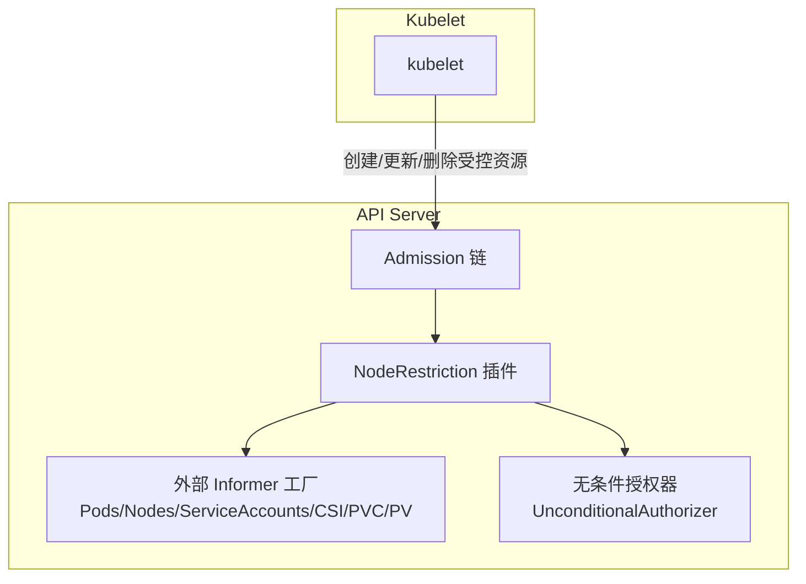
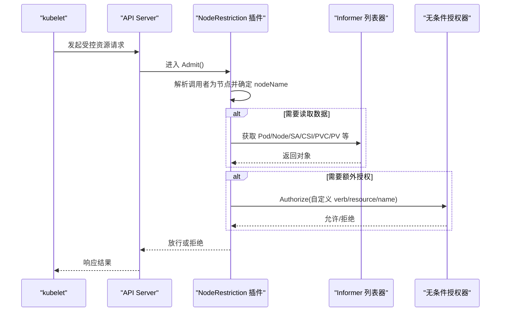
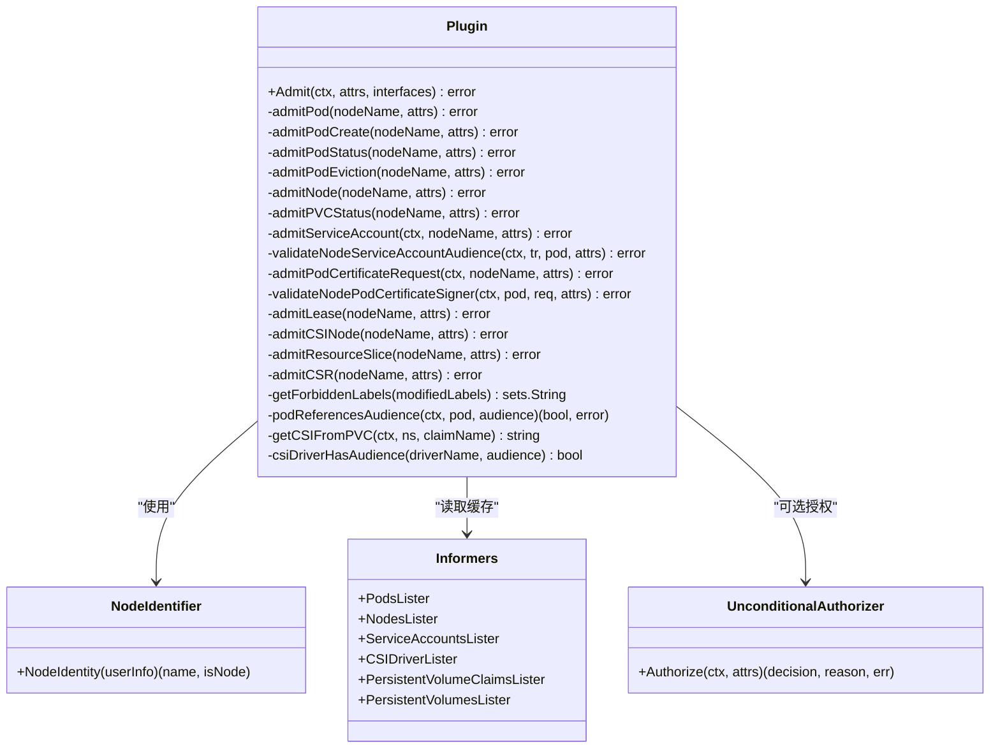
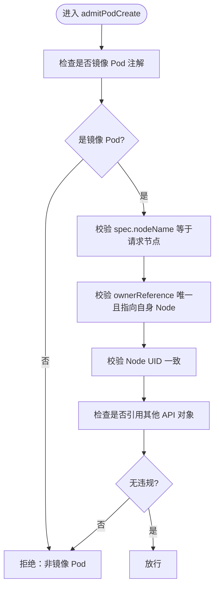
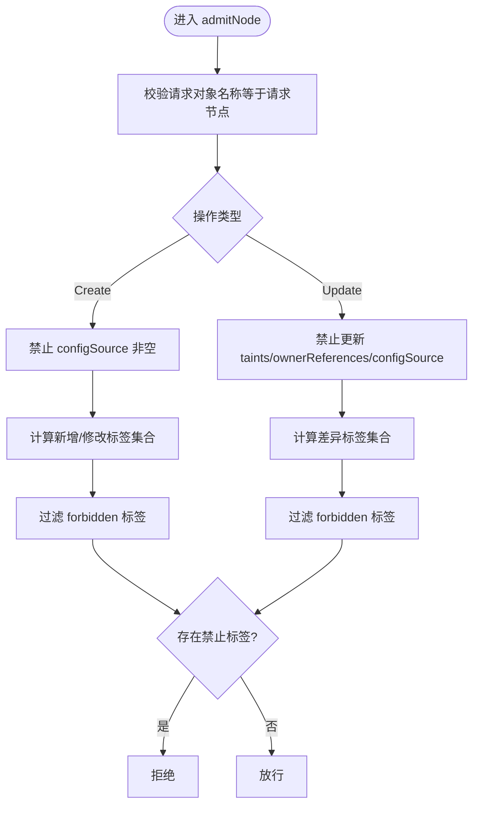
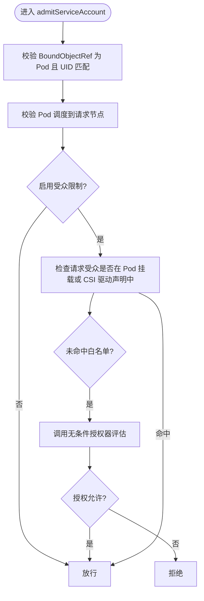
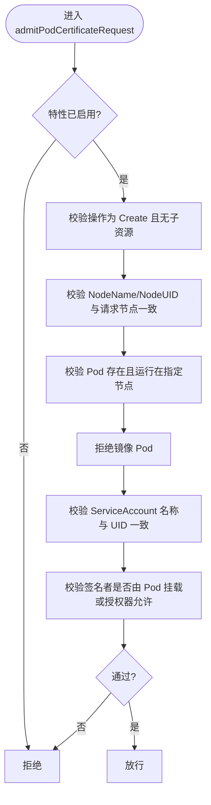
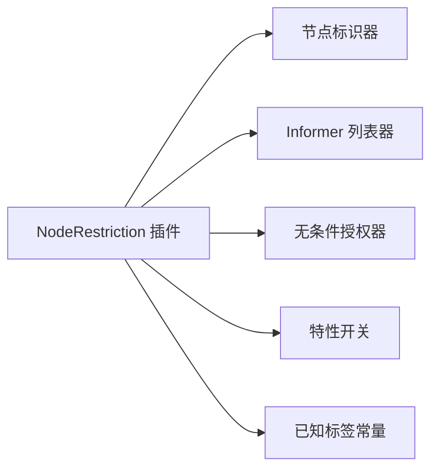

# NodeRestriction插件

<cite>
**本文引用的文件**   
- [admission.go](file://plugin/pkg/admission/noderestriction/admission.go)
- [admission_test.go](file://plugin/pkg/admission/noderestriction/admission_test.go)
- [well_known_labels.go](file://staging/src/k8s.io/api/core/v1/well_known_labels.go)
- [node_authorizer.go](file://plugin/pkg/auth/authorizer/node/node_authorizer.go)
- [manifests.go](file://cmd/kubeadm/app/phases/controlplane/manifests.go)
</cite>

## 目录
1. [简介](#简介)
2. [项目结构](#项目结构)
3. [核心组件](#核心组件)
4. [架构总览](#架构总览)
5. [详细组件分析](#详细组件分析)
6. [依赖关系分析](#依赖关系分析)
7. [性能考虑](#性能考虑)
8. [故障排查指南](#故障排查指南)
9. [结论](#结论)
10. [附录](#附录)

## 简介
NodeRestriction 是 kube-apiserver 的准入控制插件，用于在请求到达存储层之前对来自节点（kubelet）的请求进行细粒度访问控制。其核心目标是：限制 kubelet 仅能操作与其自身相关的资源对象，防止越权修改其他节点或全局资源，从而增强集群安全性。该插件与 RBAC、认证授权子系统协同工作，形成“最小权限”的安全模型。

## 项目结构
NodeRestriction 插件位于 apiserver 的 admission 插件体系内，通过注册机制启用，并在初始化阶段注入必要的列表器与特征开关。

图表来源
- [admission.go:62-75](file://plugin/pkg/admission/noderestriction/admission.go#L62-L75)
- [admission.go:116-127](file://plugin/pkg/admission/noderestriction/admission.go#L116-L127)
- [admission.go:168-173](file://plugin/pkg/admission/noderestriction/admission.go#L168-L173)

章节来源
- [admission.go:62-75](file://plugin/pkg/admission/noderestriction/admission.go#L62-L75)
- [admission.go:116-127](file://plugin/pkg/admission/noderestriction/admission.go#L116-L127)
- [admission.go:168-173](file://plugin/pkg/admission/noderestriction/admission.go#L168-L173)

## 核心组件
- 插件注册与构造
  - 提供插件名与构造函数，支持传入节点标识器以识别调用者是否为节点。
- 插件状态与依赖
  - 持有 Pods、Nodes、ServiceAccounts、CSIDriver、PVC、PV 等 Listers，以及可选的无条件授权器。
  - 根据特性开关决定是否启用更严格的校验（如 SA Token 受众限制、Pod 证书请求）。
- 准入入口 Admit
  - 基于资源类型与子资源路由到具体校验逻辑，包括 Pod、Node、PVC Status、ServiceAccount Token、CSR、Lease、CSINode、ResourceSlice 等。
- 关键校验点
  - 镜像 Pod 创建/删除/状态更新/驱逐
  - Node 对象创建/更新时的标签、污点、ownerReferences、configSource 保护
  - PVC status 字段白名单
  - ServiceAccount Token 绑定 Pod 与受众校验
  - PodCertificateRequest 签名者与 SA 一致性校验
  - Lease/CSINode/ResourceSlice 名称与归属校验
  - CSR CN 与节点身份匹配

章节来源
- [admission.go:58-97](file://plugin/pkg/admission/noderestriction/admission.go#L58-L97)
- [admission.go:106-114](file://plugin/pkg/admission/noderestriction/admission.go#L106-L114)
- [admission.go:116-127](file://plugin/pkg/admission/noderestriction/admission.go#L116-L127)
- [admission.go:168-173](file://plugin/pkg/admission/noderestriction/admission.go#L168-L173)
- [admission.go:187-253](file://plugin/pkg/admission/noderestriction/admission.go#L187-L253)

## 架构总览
NodeRestriction 插件处于 API Server 的准入链中，拦截来自节点的请求，结合本地缓存（Informer）和授权器进行决策。

图表来源
- [admission.go:187-253](file://plugin/pkg/admission/noderestriction/admission.go#L187-L253)
- [admission.go:116-127](file://plugin/pkg/admission/noderestriction/admission.go#L116-L127)
- [admission.go:168-173](file://plugin/pkg/admission/noderestriction/admission.go#L168-L173)

## 详细组件分析

### 安全模型与权限边界
- 节点身份识别
  - 通过节点标识器将用户身份映射为 nodeName；无法映射则直接拒绝。
- 资源级最小权限
  - 仅允许节点对自身相关资源执行受限操作，跨节点或全局资源一律拒绝。
- 标签与元数据保护
  - 禁止节点设置 node-restriction 命名空间下的标签；禁止在更新时设置未知 kubernetes.io/k8s.io 标签；禁止修改 taints、ownerReferences、configSource 等敏感字段。
- 镜像 Pod 严格约束
  - 仅允许创建/删除/更新状态属于自身的镜像 Pod；要求 ownerReference 指向自身且为 controller，UID 必须与当前 Node 一致；禁止引用其他 API 对象。
- 资源切片与租约
  - Lease/CSINode/ResourceSlice 必须与请求节点同名或 NodeName 一致。
- 证书与令牌
  - CSR 的 CN 必须为 system:node:<nodeName>；PodCertificateRequest 需与真实 Pod/Node/SA 信息一致，并通过签名者授权检查；ServiceAccount Token 必须绑定到本节点上的 Pod，并可按受众白名单或显式授权放行。

章节来源
- [admission.go:187-253](file://plugin/pkg/admission/noderestriction/admission.go#L187-L253)
- [admission.go:539-603](file://plugin/pkg/admission/noderestriction/admission.go#L539-L603)
- [admission.go:639-659](file://plugin/pkg/admission/noderestriction/admission.go#L639-L659)
- [admission.go:282-341](file://plugin/pkg/admission/noderestriction/admission.go#L282-L341)
- [admission.go:995-1018](file://plugin/pkg/admission/noderestriction/admission.go#L995-L1018)
- [admission.go:1020-1038](file://plugin/pkg/admission/noderestriction/admission.go#L1020-L1038)
- [admission.go:1040-1070](file://plugin/pkg/admission/noderestriction/admission.go#L1040-L1070)
- [admission.go:1072-1098](file://plugin/pkg/admission/noderestriction/admission.go#L1072-L1098)
- [admission.go:661-712](file://plugin/pkg/admission/noderestriction/admission.go#L661-L712)
- [admission.go:853-934](file://plugin/pkg/admission/noderestriction/admission.go#L853-L934)

#### 类图（代码结构）

图表来源
- [admission.go:77-97](file://plugin/pkg/admission/noderestriction/admission.go#L77-L97)
- [admission.go:187-253](file://plugin/pkg/admission/noderestriction/admission.go#L187-L253)
- [admission.go:116-127](file://plugin/pkg/admission/noderestriction/admission.go#L116-L127)
- [admission.go:168-173](file://plugin/pkg/admission/noderestriction/admission.go#L168-L173)

### 与 RBAC 集成与权限继承
- 默认情况下，NodeRestriction 在准入层做内容级强校验，RBAC 作为通用授权层配合。
- 当启用特定功能（如 ServiceAccount 受众限制、Pod 证书请求）时，插件会调用无条件授权器进行二次授权判断，遵循“默认拒绝”原则：若授权器返回错误或未明确允许，则拒绝。
- 节点作者器（Node Authorizer）在部分路径上也会参考 NodeRestriction 的策略，形成纵深防御。

章节来源
- [admission.go:699-752](file://plugin/pkg/admission/noderestriction/admission.go#L699-L752)
- [admission.go:936-965](file://plugin/pkg/admission/noderestriction/admission.go#L936-L965)
- [node_authorizer.go:417-486](file://plugin/pkg/auth/authorizer/node/node_authorizer.go#L417-L486)

### 配置示例与安全加固指南
- 启用插件
  - 在控制平面清单中将 NodeRestriction 加入启用插件列表。
- 推荐开启的功能门
  - ServiceAccountNodeAudienceRestriction：限制 SA Token 受众，仅允许 Pod 挂载的 projected token 或 CSI driver 声明的受众。
  - PodCertificateRequest：限制节点仅能为自身 Pod 申请证书，并与 SA/签名者绑定。
- 标签策略
  - 避免在节点上设置 node-restriction 命名空间下的标签；谨慎使用 kubernetes.io/k8s.io 前缀标签，仅允许 kubelet 已知标签。
- 审计与监控
  - 开启 API Server 审计日志，关注被 NodeRestriction 拒绝的请求，定位违规来源。
- 最小化权限
  - 为 kubelet 服务账户分配最小必要 RBAC 权限，结合 NodeRestriction 实现双重保障。

章节来源
- [manifests.go:187](file://cmd/kubeadm/app/phases/controlplane/manifests.go#L187)
- [admission.go:106-114](file://plugin/pkg/admission/noderestriction/admission.go#L106-L114)
- [admission.go:639-659](file://plugin/pkg/admission/noderestriction/admission.go#L639-L659)
- [well_known_labels.go:57-58](file://staging/src/k8s.io/api/core/v1/well_known_labels.go#L57-L58)

### 安全威胁分析与防护策略
- 威胁面
  - 节点越权：尝试修改其他节点或全局资源。
  - 标签注入：通过标签影响调度或流量策略。
  - 证书滥用：伪造节点身份或为任意 Pod 申请证书。
  - 令牌泄露：跨节点或跨命名空间滥用 SA Token。
- 防护策略
  - 准入层强校验：NodeRestriction 对资源归属、字段变更范围、身份一致性进行严格验证。
  - 授权层兜底：必要时调用无条件授权器进行二次授权。
  - 特性开关精细化控制：按需启用受众限制与 Pod 证书请求校验。
  - 标签白名单：仅允许 kubelet 可设置的标签集合。

章节来源
- [admission.go:282-341](file://plugin/pkg/admission/noderestriction/admission.go#L282-L341)
- [admission.go:539-603](file://plugin/pkg/admission/noderestriction/admission.go#L539-L603)
- [admission.go:639-659](file://plugin/pkg/admission/noderestriction/admission.go#L639-L659)
- [admission.go:661-712](file://plugin/pkg/admission/noderestriction/admission.go#L661-L712)
- [admission.go:853-934](file://plugin/pkg/admission/noderestriction/admission.go#L853-L934)

### 处理流程与算法要点

#### Pod 镜像 Pod 创建流程

图表来源
- [admission.go:282-341](file://plugin/pkg/admission/noderestriction/admission.go#L282-L341)

#### Node 标签与元数据保护流程

图表来源
- [admission.go:539-603](file://plugin/pkg/admission/noderestriction/admission.go#L539-L603)
- [admission.go:639-659](file://plugin/pkg/admission/noderestriction/admission.go#L639-L659)

#### ServiceAccount Token 受众校验流程

图表来源
- [admission.go:661-712](file://plugin/pkg/admission/noderestriction/admission.go#L661-L712)
- [admission.go:714-752](file://plugin/pkg/admission/noderestriction/admission.go#L714-L752)
- [admission.go:754-809](file://plugin/pkg/admission/noderestriction/admission.go#L754-L809)
- [admission.go:811-851](file://plugin/pkg/admission/noderestriction/admission.go#L811-L851)

#### PodCertificateRequest 校验流程

图表来源
- [admission.go:853-934](file://plugin/pkg/admission/noderestriction/admission.go#L853-L934)
- [admission.go:936-965](file://plugin/pkg/admission/noderestriction/admission.go#L936-L965)

## 依赖关系分析
- 内部依赖
  - 节点标识器：用于从用户身份提取 nodeName。
  - Informer 列表器：Pods、Nodes、ServiceAccounts、CSIDriver、PVC、PV。
  - 无条件授权器：在启用受众限制与 Pod 证书请求时进行二次授权。
- 外部依赖
  - 特性开关：RecoverVolumeExpansionFailure、DynamicResourceAllocation、AllowInsecureKubeletCertificateSigningRequests、ServiceAccountNodeAudienceRestriction、PodCertificateRequest。
  - 常量定义：node-restriction.kubernetes.io 命名空间。

图表来源
- [admission.go:77-97](file://plugin/pkg/admission/noderestriction/admission.go#L77-L97)
- [admission.go:106-114](file://plugin/pkg/admission/noderestriction/admission.go#L106-L114)
- [admission.go:116-127](file://plugin/pkg/admission/noderestriction/admission.go#L116-L127)
- [well_known_labels.go:57-58](file://staging/src/k8s.io/api/core/v1/well_known_labels.go#L57-L58)

章节来源
- [admission.go:77-97](file://plugin/pkg/admission/noderestriction/admission.go#L77-L97)
- [admission.go:106-114](file://plugin/pkg/admission/noderestriction/admission.go#L106-L114)
- [admission.go:116-127](file://plugin/pkg/admission/noderestriction/admission.go#L116-L127)
- [well_known_labels.go:57-58](file://staging/src/k8s.io/api/core/v1/well_known_labels.go#L57-L58)

## 性能考虑
- 列表器缓存：通过 Informer 缓存减少实时查询开销。
- 条件加载：仅在启用受众限制时加载 CSI/PVC/PV 列表器，降低不必要依赖。
- 短路径优化：对于非节点用户或非受控资源快速放行，避免复杂计算。
- 错误聚合：在受众校验过程中聚合多个错误，减少多次往返。

[本节为通用指导，不直接分析具体文件]

## 故障排查指南
- 常见拒绝原因
  - 非镜像 Pod 创建：缺少镜像注解或 ownerReference 不合法。
  - 跨节点操作：spec.nodeName 与请求节点不一致。
  - 标签违规：设置了 node-restriction 命名空间或未知 kubernetes.io/k8s.io 标签。
  - 证书/令牌异常：CN 不匹配、Pod/Node/SA 信息不一致、受众不在白名单且未获授权。
- 定位方法
  - 查看 API Server 审计日志，筛选 NodeRestriction 拒绝记录。
  - 核对节点身份与 nodeName 映射是否正确。
  - 检查 Pod 的 ownerReference、镜像注解、挂载的 projected token 与 CSI driver 的 TokenRequests。
  - 确认特性开关是否按预期启用。

章节来源
- [admission.go:282-341](file://plugin/pkg/admission/noderestriction/admission.go#L282-L341)
- [admission.go:539-603](file://plugin/pkg/admission/noderestriction/admission.go#L539-L603)
- [admission.go:639-659](file://plugin/pkg/admission/noderestriction/admission.go#L639-L659)
- [admission.go:661-712](file://plugin/pkg/admission/noderestriction/admission.go#L661-L712)
- [admission.go:853-934](file://plugin/pkg/admission/noderestriction/admission.go#L853-L934)

## 结论
NodeRestriction 插件通过严格的准入规则与可选的二次授权，确保 kubelet 仅能操作与其自身相关的资源，有效防止越权与标签注入等安全风险。结合 RBAC 与特性开关，可在保证功能可用性的同时最大化安全基线。建议在生产环境默认启用该插件，并根据业务需求逐步启用受众限制与 Pod 证书请求校验，辅以审计与监控，持续发现与处置违规行为。

[本节为总结性内容，不直接分析具体文件]

## 附录
- 启用方式参考
  - 在控制平面清单中添加 NodeRestriction 到启用插件列表。
- 测试用例参考
  - 单元测试覆盖镜像 Pod、Node 标签、Token 受众、Pod 证书请求等场景，可作为行为契约参考。

章节来源
- [manifests.go:187](file://cmd/kubeadm/app/phases/controlplane/manifests.go#L187)
- [admission_test.go:686-800](file://plugin/pkg/admission/noderestriction/admission_test.go#L686-L800)