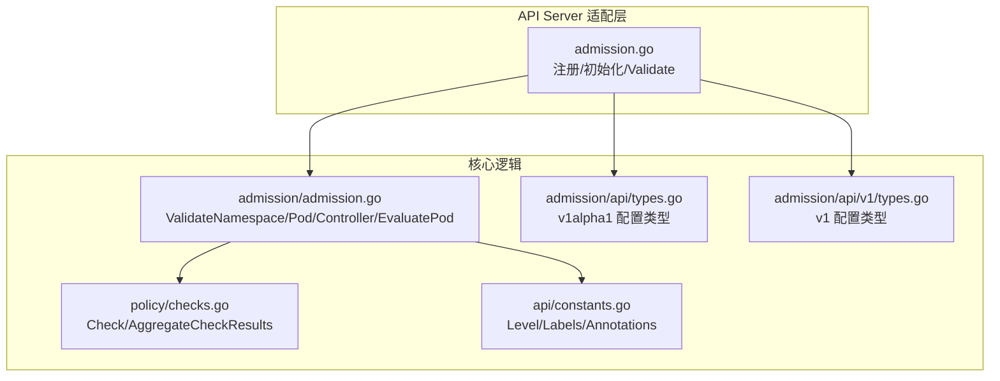
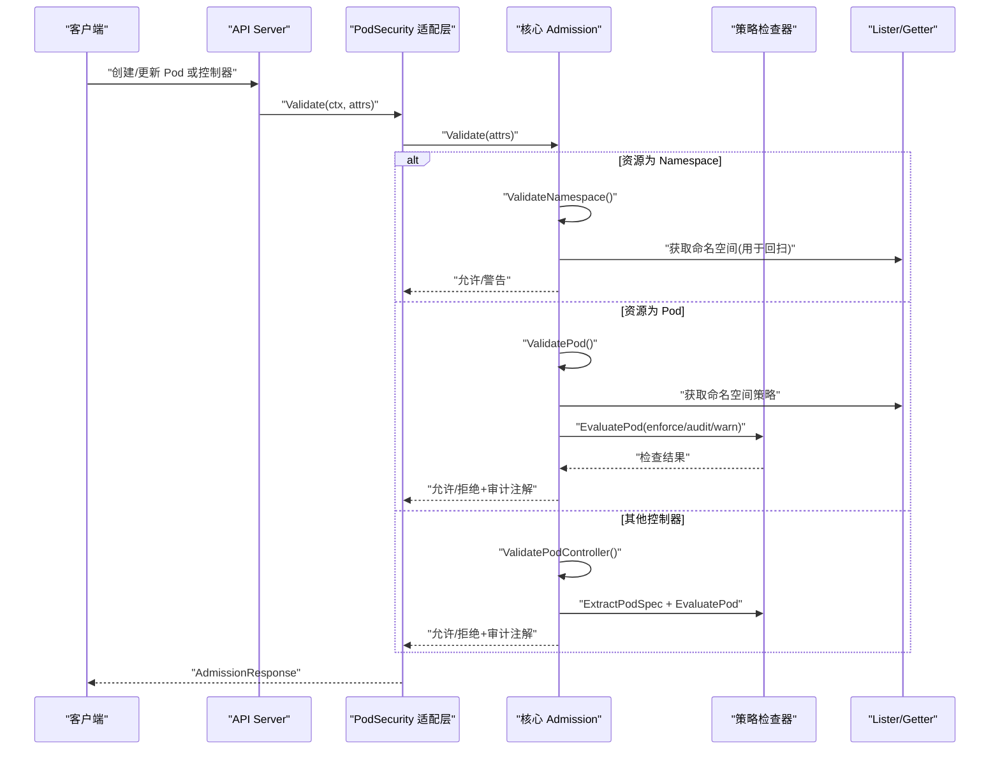
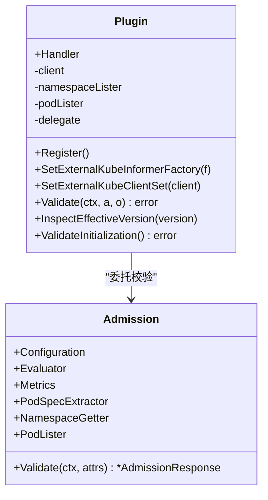
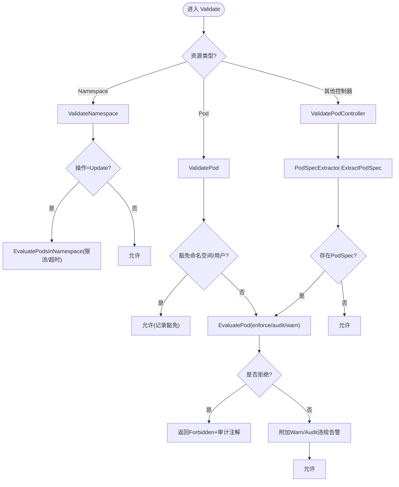
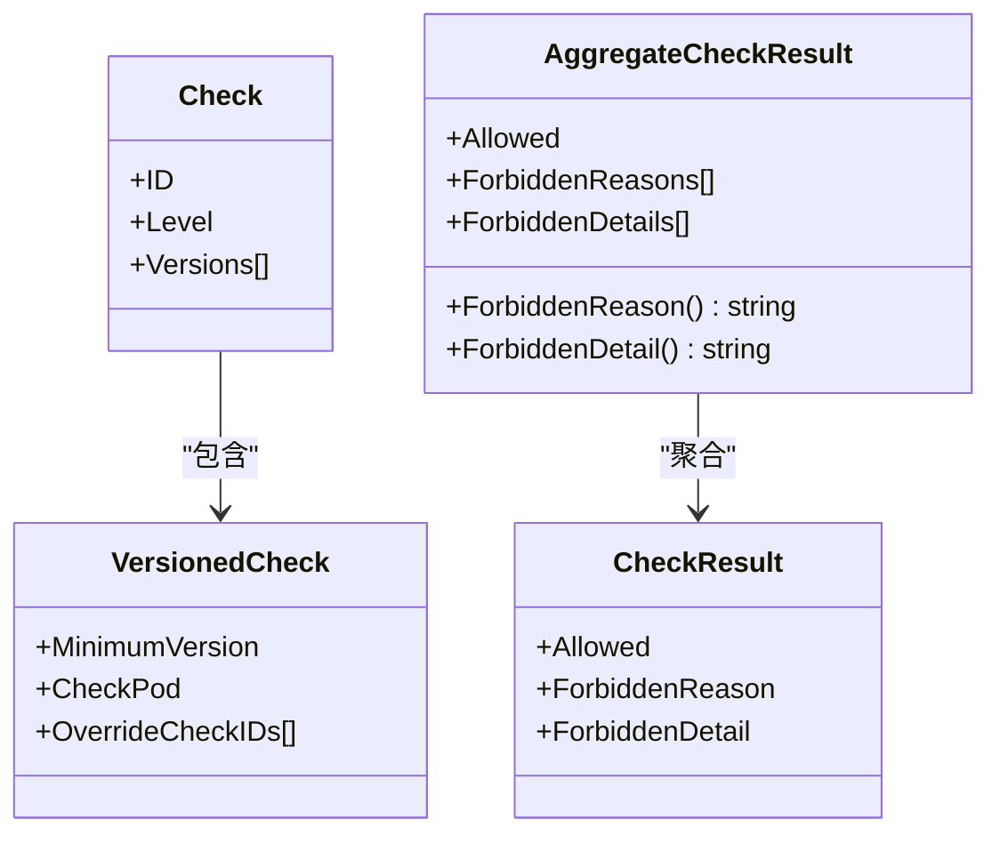
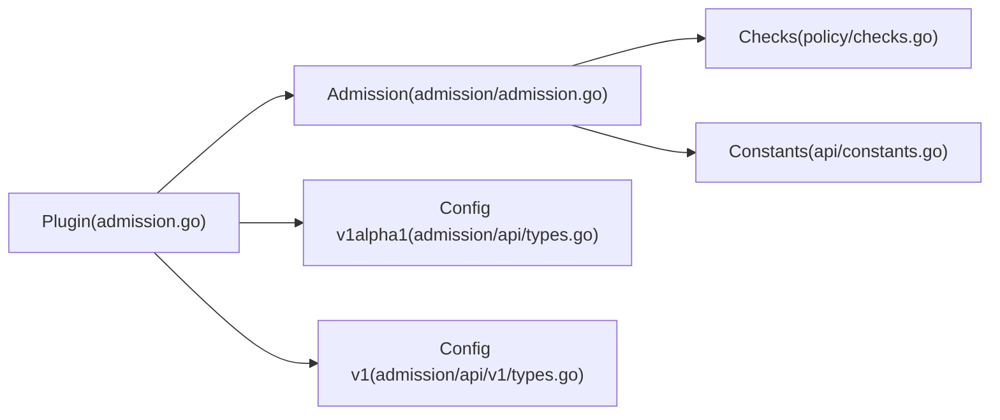

# PodSecurity插件

<cite>
**本文引用的文件**   
- [plugin/pkg/admission/security/podsecurity/admission.go](file://plugin/pkg/admission/security/podsecurity/admission.go)
- [staging/src/k8s.io/pod-security-admission/admission/admission.go](file://staging/src/k8s.io/pod-security-admission/admission/admission.go)
- [staging/src/k8s.io/pod-security-admission/admission/api/types.go](file://staging/src/k8s.io/pod-security-admission/admission/api/types.go)
- [staging/src/k8s.io/pod-security-admission/admission/api/v1/types.go](file://staging/src/k8s.io/pod-security-admission/admission/api/v1/types.go)
- [staging/src/k8s.io/pod-security-admission/api/constants.go](file://staging/src/k8s.io/pod-security-admission/api/constants.go)
- [staging/src/k8s.io/pod-security-admission/policy/checks.go](file://staging/src/k8s.io/pod-security-admission/policy/checks.go)
</cite>

## 目录
1. [简介](#简介)
2. [项目结构](#项目结构)
3. [核心组件](#核心组件)
4. [架构总览](#架构总览)
5. [详细组件分析](#详细组件分析)
6. [依赖关系分析](#依赖关系分析)
7. [性能与可扩展性](#性能与可扩展性)
8. [配置与策略](#配置与策略)
9. [迁移指南（PodSecurityPolicy → PodSecurity）](#迁移指南podsecuritypolicy--podsecurity)
10. [安全最佳实践与合规检查](#安全最佳实践与合规检查)
11. [故障排查](#故障排查)
12. [结论](#结论)

## 简介
本技术文档围绕 Kubernetes 的 PodSecurity 准入控制插件，系统性阐述其基于 Pod 安全标准（PSS）对 Pod 进行安全策略检查的能力。内容涵盖：
- 三种安全级别（Privileged、Baseline、Restricted）的要求与适用场景
- 插件在 API Server 中的集成方式与请求处理流程
- 命名空间级策略标签与默认策略的配置方法
- 与旧版 PodSecurityPolicy（PSP）的关系及迁移路径
- 安全最佳实践、合规性检查方法与常见漏洞修复建议

## 项目结构
PodSecurity 插件由两部分组成：
- 适配层：位于 plugin/pkg/admission/security/podsecurity，负责将 API Server 的 Admission 请求转换为内部可处理的 Attributes，并调用核心逻辑。
- 核心逻辑：位于 staging/src/k8s.io/pod-security-admission，包含策略解析、评估器、指标记录、豁免机制等。

图示来源
- [plugin/pkg/admission/security/podsecurity/admission.go:62-115](file://plugin/pkg/admission/security/podsecurity/admission.go#L62-L115)
- [staging/src/k8s.io/pod-security-admission/admission/admission.go:210-224](file://staging/src/k8s.io/pod-security-admission/admission/admission.go#L210-L224)
- [staging/src/k8s.io/pod-security-admission/policy/checks.go:125-147](file://staging/src/k8s.io/pod-security-admission/policy/checks.go#L125-L147)
- [staging/src/k8s.io/pod-security-admission/api/constants.go:37-50](file://staging/src/k8s.io/pod-security-admission/api/constants.go#L37-L50)
- [staging/src/k8s.io/pod-security-admission/admission/api/types.go:25-44](file://staging/src/k8s.io/pod-security-admission/admission/api/types.go#L25-L44)
- [staging/src/k8s.io/pod-security-admission/admission/api/v1/types.go:25-45](file://staging/src/k8s.io/pod-security-admission/admission/api/v1/types.go#L25-L45)

章节来源
- [plugin/pkg/admission/security/podsecurity/admission.go:62-115](file://plugin/pkg/admission/security/podsecurity/admission.go#L62-L115)
- [staging/src/k8s.io/pod-security-admission/admission/admission.go:210-224](file://staging/src/k8s.io/pod-security-admission/admission/admission.go#L210-L224)

## 核心组件
- 适配层插件（Plugin）
  - 职责：注册到 API Server 的 Admission 链；读取配置文件；设置 Informer/Lister；将外部 v1 对象转换为内部版本；调用核心 Admission 逻辑；将结果映射为 Forbidden/Allowed 响应，并注入审计注解与告警。
- 核心 Admission
  - 职责：根据资源类型路由到 ValidateNamespace/ValidatePod/ValidatePodController；解析命名空间策略标签；执行 EvaluatePod；聚合 Enforce/Audit/Warn 三类结果；记录指标与审计注解；支持豁免（命名空间、用户、RuntimeClass）。
- 策略检查（Checks）
  - 职责：定义 Check/VersionedCheck/CheckResult/AggregateCheckResult；提供 DefaultChecks/ExperimentalChecks；聚合多条检查的结果并生成人类可读的拒绝原因与细节。
- 配置类型
  - 职责：定义 PodSecurityConfiguration（Defaults/Exemptions），支持 v1alpha1 与 v1 两种版本。

章节来源
- [plugin/pkg/admission/security/podsecurity/admission.go:68-115](file://plugin/pkg/admission/security/podsecurity/admission.go#L68-L115)
- [staging/src/k8s.io/pod-security-admission/admission/admission.go:51-73](file://staging/src/k8s.io/pod-security-admission/admission/admission.go#L51-L73)
- [staging/src/k8s.io/pod-security-admission/policy/checks.go:27-95](file://staging/src/k8s.io/pod-security-admission/policy/checks.go#L27-L95)
- [staging/src/k8s.io/pod-security-admission/admission/api/types.go:25-44](file://staging/src/k8s.io/pod-security-admission/admission/api/types.go#L25-L44)
- [staging/src/k8s.io/pod-security-admission/admission/api/v1/types.go:25-45](file://staging/src/k8s.io/pod-security-admission/admission/api/v1/types.go#L25-L45)

## 架构总览
PodSecurity 插件在 API Server 的 Admission 阶段拦截创建/更新请求，依据命名空间上的 PSS 标签计算有效策略，并对 Pod 或 Pod 控制器模板执行安全检查。

图示来源
- [plugin/pkg/admission/security/podsecurity/admission.go:193-233](file://plugin/pkg/admission/security/podsecurity/admission.go#L193-L233)
- [staging/src/k8s.io/pod-security-admission/admission/admission.go:210-224](file://staging/src/k8s.io/pod-security-admission/admission/admission.go#L210-L224)
- [staging/src/k8s.io/pod-security-admission/admission/admission.go:327-389](file://staging/src/k8s.io/pod-security-admission/admission/admission.go#L327-L389)
- [staging/src/k8s.io/pod-security-admission/admission/admission.go:391-450](file://staging/src/k8s.io/pod-security-admission/admission/admission.go#L391-L450)
- [staging/src/k8s.io/pod-security-admission/admission/admission.go:452-528](file://staging/src/k8s.io/pod-security-admission/admission/admission.go#L452-L528)

## 详细组件分析

### 适配层插件（Plugin）
- 注册与初始化
  - 通过 Register 注册到 Admission 插件链；newPlugin 从 Reader 加载配置，构造核心 Admission 实例。
- 外部依赖注入
  - SetExternalKubeInformerFactory 注入 Namespace/Pod Listers；SetExternalKubeClientSet 注入 client；updateDelegate 按需填充 Delegate 的 PodLister/NamespaceGetter/Evaluator。
- 版本感知
  - InspectEffectiveVersion 记录二进制与模拟版本差异，必要时设置 emulationVersion。
- 验证入口
  - Validate 过滤非目标资源，委托核心 Admission.Validate，并将警告与审计注解写入上下文；若拒绝则返回 Forbidden 状态。

图示来源
- [plugin/pkg/admission/security/podsecurity/admission.go:62-115](file://plugin/pkg/admission/security/podsecurity/admission.go#L62-L115)
- [plugin/pkg/admission/security/podsecurity/admission.go:117-159](file://plugin/pkg/admission/security/podsecurity/admission.go#L117-L159)
- [plugin/pkg/admission/security/podsecurity/admission.go:193-233](file://plugin/pkg/admission/security/podsecurity/admission.go#L193-L233)
- [staging/src/k8s.io/pod-security-admission/admission/admission.go:51-73](file://staging/src/k8s.io/pod-security-admission/admission/admission.go#L51-L73)

章节来源
- [plugin/pkg/admission/security/podsecurity/admission.go:62-115](file://plugin/pkg/admission/security/podsecurity/admission.go#L62-L115)
- [plugin/pkg/admission/security/podsecurity/admission.go:117-159](file://plugin/pkg/admission/security/podsecurity/admission.go#L117-L159)
- [plugin/pkg/admission/security/podsecurity/admission.go:193-233](file://plugin/pkg/admission/security/podsecurity/admission.go#L193-L233)

### 核心 Admission 逻辑
- 资源路由
  - Validate 根据 GroupResource 分发至 ValidateNamespace/ValidatePod/ValidatePodController。
- 命名空间策略解析
  - PolicyToEvaluate 基于命名空间标签与默认策略计算有效策略（Enforce/Audit/Warn 及其版本）。
- Pod 校验
  - ValidatePod：忽略子资源；快速短路豁免命名空间/用户/完全 Privileged；解析 Pod；对 Update 仅对“显著变更”重新评估；调用 EvaluatePod。
- 控制器模板校验
  - ValidatePodController：通过 PodSpecExtractor 提取 PodSpec；同样支持豁免与短路；调用 EvaluatePod。
- 评估与结果聚合
  - EvaluatePod：按 Enforce/Audit/Warn 分别评估，复用缓存结果；将违规信息写入审计注解与告警；记录指标。
- 命名空间更新时的存量 Pod 扫描
  - ValidateNamespace（Update）：当 enforce 收紧时，对命名空间内现有 Pod 进行有限数量的扫描，返回警告提示。

图示来源
- [staging/src/k8s.io/pod-security-admission/admission/admission.go:210-224](file://staging/src/k8s.io/pod-security-admission/admission/admission.go#L210-L224)
- [staging/src/k8s.io/pod-security-admission/admission/admission.go:226-311](file://staging/src/k8s.io/pod-security-admission/admission/admission.go#L226-L311)
- [staging/src/k8s.io/pod-security-admission/admission/admission.go:327-389](file://staging/src/k8s.io/pod-security-admission/admission/admission.go#L327-L389)
- [staging/src/k8s.io/pod-security-admission/admission/admission.go:391-450](file://staging/src/k8s.io/pod-security-admission/admission/admission.go#L391-L450)
- [staging/src/k8s.io/pod-security-admission/admission/admission.go:452-528](file://staging/src/k8s.io/pod-security-admission/admission/admission.go#L452-L528)
- [staging/src/k8s.io/pod-security-admission/admission/admission.go:539-606](file://staging/src/k8s.io/pod-security-admission/admission/admission.go#L539-L606)

章节来源
- [staging/src/k8s.io/pod-security-admission/admission/admission.go:210-224](file://staging/src/k8s.io/pod-security-admission/admission/admission.go#L210-L224)
- [staging/src/k8s.io/pod-security-admission/admission/admission.go:226-311](file://staging/src/k8s.io/pod-security-admission/admission/admission.go#L226-L311)
- [staging/src/k8s.io/pod-security-admission/admission/admission.go:327-389](file://staging/src/k8s.io/pod-security-admission/admission/admission.go#L327-L389)
- [staging/src/k8s.io/pod-security-admission/admission/admission.go:391-450](file://staging/src/k8s.io/pod-security-admission/admission/admission.go#L391-L450)
- [staging/src/k8s.io/pod-security-admission/admission/admission.go:452-528](file://staging/src/k8s.io/pod-security-admission/admission/admission.go#L452-L528)
- [staging/src/k8s.io/pod-security-admission/admission/admission.go:539-606](file://staging/src/k8s.io/pod-security-admission/admission/admission.go#L539-L606)

### 策略检查与结果聚合
- 检查模型
  - Check：包含 ID、所属 Level（Baseline/Restricted）、Versions（多版本修订）。
  - VersionedCheck：MinimumVersion 指定生效版本范围；CheckPod 函数实现具体规则；OverrideCheckIDs 可在 Restricted 中覆盖部分 Baseline 检查。
  - CheckResult：单条检查的允许/拒绝原因与细节。
  - AggregateCheckResult：聚合多条检查的拒绝原因与细节，并提供格式化输出。
- 默认与实验性检查
  - DefaultChecks/ExperimentalChecks 分别返回默认启用与实验性检查集合。

图示来源
- [staging/src/k8s.io/pod-security-admission/policy/checks.go:27-95](file://staging/src/k8s.io/pod-security-admission/policy/checks.go#L27-L95)
- [staging/src/k8s.io/pod-security-admission/policy/checks.go:125-147](file://staging/src/k8s.io/pod-security-admission/policy/checks.go#L125-L147)

章节来源
- [staging/src/k8s.io/pod-security-admission/policy/checks.go:27-95](file://staging/src/k8s.io/pod-security-admission/policy/checks.go#L27-L95)
- [staging/src/k8s.io/pod-security-admission/policy/checks.go:125-147](file://staging/src/k8s.io/pod-security-admission/policy/checks.go#L125-L147)

## 依赖关系分析
- 适配层依赖
  - 依赖 core/apps/batch 的 Scheme 转换；使用 informers/listers 获取命名空间与 Pod；使用 metrics 记录指标；使用 audit/warning 注入审计注解与告警。
- 核心逻辑依赖
  - 依赖 policy.Evaluator 执行检查；依赖 NamespaceGetter/PodLister 获取数据；依赖 metrics.Recorder 记录指标；依赖 api 常量定义标签与注解键。
- 配置类型
  - 同时支持 v1alpha1 与 v1 的 PodSecurityConfiguration 结构体，字段语义一致。

图示来源
- [plugin/pkg/admission/security/podsecurity/admission.go:19-56](file://plugin/pkg/admission/security/podsecurity/admission.go#L19-L56)
- [staging/src/k8s.io/pod-security-admission/admission/admission.go:19-44](file://staging/src/k8s.io/pod-security-admission/admission/admission.go#L19-44)
- [staging/src/k8s.io/pod-security-admission/api/constants.go:37-50](file://staging/src/k8s.io/pod-security-admission/api/constants.go#L37-L50)
- [staging/src/k8s.io/pod-security-admission/admission/api/types.go:25-44](file://staging/src/k8s.io/pod-security-admission/admission/api/types.go#L25-L44)
- [staging/src/k8s.io/pod-security-admission/admission/api/v1/types.go:25-45](file://staging/src/k8s.io/pod-security-admission/admission/api/v1/types.go#L25-L45)

章节来源
- [plugin/pkg/admission/security/podsecurity/admission.go:19-56](file://plugin/pkg/admission/security/podsecurity/admission.go#L19-L56)
- [staging/src/k8s.io/pod-security-admission/admission/admission.go:19-44](file://staging/src/k8s.io/pod-security-admission/admission/admission.go#L19-44)

## 性能与可扩展性
- 显著变更优化：Pod Update 仅对影响安全的“显著变更”触发评估（如容器镜像变化、容器数量变化、EphemeralContainers 新增等），减少不必要的评估开销。
- 命名空间存量扫描限流：当收紧 enforce 级别时，对命名空间内 Pod 的扫描具备最大数量限制与超时控制，避免阻塞 API 请求。
- 结果复用：同一请求中对相同 level+version 的评估结果会被缓存复用，降低重复计算。
- 可扩展点：PodSpecExtractor 接口允许扩展自定义控制器资源的 PodSpec 提取能力。

章节来源
- [staging/src/k8s.io/pod-security-admission/admission/admission.go:629-671](file://staging/src/k8s.io/pod-security-admission/admission/admission.go#L629-L671)
- [staging/src/k8s.io/pod-security-admission/admission/admission.go:539-606](file://staging/src/k8s.io/pod-security-admission/admission/admission.go#L539-L606)
- [staging/src/k8s.io/pod-security-admission/admission/admission.go:452-528](file://staging/src/k8s.io/pod-security-admission/admission/admission.go#L452-L528)
- [staging/src/k8s.io/pod-security-admission/admission/admission.go:83-92](file://staging/src/k8s.io/pod-security-admission/admission/admission.go#L83-L92)

## 配置与策略
- 命名空间标签（PSS）
  - 支持的级别：privileged、baseline、restricted
  - 关键标签键：
    - pod-security.kubernetes.io/enforce
    - pod-security.kubernetes.io/enforce-version
    - pod-security.kubernetes.io/audit
    - pod-security.kubernetes.io/audit-version
    - pod-security.kubernetes.io/warn
    - pod-security.kubernetes.io/warn-version
- 默认策略与豁免
  - 默认策略：通过 PodSecurityConfiguration.Defaults 设置全局默认级别与版本。
  - 豁免：支持按命名空间、用户名、RuntimeClass 豁免。
- 审计注解
  - 被拒绝的请求会携带审计注解，包括实际执行的策略与违规摘要，便于审计与排障。

章节来源
- [staging/src/k8s.io/pod-security-admission/api/constants.go:19-50](file://staging/src/k8s.io/pod-security-admission/api/constants.go#L19-L50)
- [staging/src/k8s.io/pod-security-admission/admission/api/types.go:25-44](file://staging/src/k8s.io/pod-security-admission/admission/api/types.go#L25-L44)
- [staging/src/k8s.io/pod-security-admission/admission/api/v1/types.go:25-45](file://staging/src/k8s.io/pod-security-admission/admission/api/v1/types.go#L25-L45)
- [plugin/pkg/admission/security/podsecurity/admission.go:203-231](file://plugin/pkg/admission/security/podsecurity/admission.go#L203-L231)

## 迁移指南（PodSecurityPolicy → PodSecurity）
- 背景与关系
  - PSP 已被弃用，PSS 作为新的 Pod 安全策略机制，以命名空间标签形式声明级别与版本，并通过准入控制进行强制、审计与告警。
- 迁移步骤
  - 识别当前 PSP 规则：梳理特权容器、主机命名空间、卷类型、Capabilities、SELinux、Seccomp、Sysctls、HostPorts 等限制。
  - 选择目标级别：
    - privileged：无限制（不建议生产使用）
    - baseline：最小化内核功能暴露，适合大多数工作负载
    - restricted：最严格，要求非 root、最小权限、只读根文件系统、禁止 host 网络/端口等
  - 在命名空间上设置 PSS 标签：
    - 先以 warn/audit 模式运行，观察告警与审计注解，逐步收敛策略
    - 最终切换为 enforce 模式
  - 调整工作负载：
    - 移除特权容器、hostPath、hostNetwork/hostPID/hostIPC、危险 Capabilities、敏感 Sysctls、hostPorts 等
    - 使用安全上下文（runAsNonRoot、readOnlyRootFilesystem、allowPrivilegeEscalation=false 等）
  - 利用豁免与过渡期：
    - 对系统命名空间或特定用户/运行时类设置豁免，确保平稳过渡
- 验证与回归
  - 结合集群日志与审计日志，确认无新的违规
  - 在测试环境先行验证，再灰度推广

章节来源
- [staging/src/k8s.io/pod-security-admission/admission/admission.go:226-311](file://staging/src/k8s.io/pod-security-admission/admission/admission.go#L226-L311)
- [staging/src/k8s.io/pod-security-admission/admission/admission.go:452-528](file://staging/src/k8s.io/pod-security-admission/admission/admission.go#L452-L528)
- [plugin/pkg/admission/security/podsecurity/admission.go:203-231](file://plugin/pkg/admission/security/podsecurity/admission.go#L203-L231)

## 安全最佳实践与合规检查
- 推荐策略
  - 生产默认使用 restricted；对需要较少特权的系统组件使用 baseline；仅在必要且受控的场景使用 privileged。
  - 明确设置版本（如 v1.x），避免 latest 带来的不可预期变更。
- 最小权限原则
  - 容器以非 root 用户运行；禁用特权提升；挂载只读根文件系统；仅添加必要的 Capabilities。
  - 避免 host 命名空间共享（network/pid/ipc）与 hostPath 卷；如需访问宿主机资源，优先使用 CSI 或专用服务账户。
- 网络与存储
  - 使用 NetworkPolicy 限制入出站流量；谨慎使用 hostPorts，优先 Service/Ingress。
  - 使用 PVC 而非 hostPath；对敏感数据使用 Secret/ConfigMap 并限制访问。
- 运行时安全
  - 使用 Seccomp/AppArmor/SELinux 强化隔离；合理配置 sysctl 白名单。
- 合规检查方法
  - 开启 audit 与 warn 模式，收集审计注解与告警，定期巡检
  - 结合集群监控与日志平台，建立违规告警与工单流转
  - 在 CI/CD 中加入静态检查（如 kubectl 校验、策略扫描工具）

[本节为通用指导，不直接分析具体文件]

## 故障排查
- 常见问题
  - 命名空间标签无效：检查标签键值是否正确，版本是否受支持
  - 请求被拒绝：查看 Forbidden 消息与审计注解中的 enforced-policy 与 audit-violations
  - 存量 Pod 未立即生效：enforce 收紧时会进行有限扫描并返回警告，需等待滚动更新或手动修正
- 定位手段
  - 查看 API Server 审计日志中的注解字段
  - 检查命名空间标签与默认策略配置
  - 针对特定工作负载，缩小范围复现并对比 baseline/restricted 的差异

章节来源
- [plugin/pkg/admission/security/podsecurity/admission.go:203-231](file://plugin/pkg/admission/security/podsecurity/admission.go#L203-L231)
- [staging/src/k8s.io/pod-security-admission/admission/admission.go:452-528](file://staging/src/k8s.io/pod-security-admission/admission/admission.go#L452-L528)
- [staging/src/k8s.io/pod-security-admission/admission/admission.go:539-606](file://staging/src/k8s.io/pod-security-admission/admission/admission.go#L539-L606)

## 结论
PodSecurity 插件通过命名空间级别的 PSS 标签实现了灵活、可演进的安全策略治理。借助 Enforce/Audit/Warn 三阶段策略与豁免机制，团队可以在保障安全的同时平滑迁移。配合严格的默认策略、完善的审计与告警体系，以及持续的工作负载加固，可有效降低安全风险并满足合规要求。