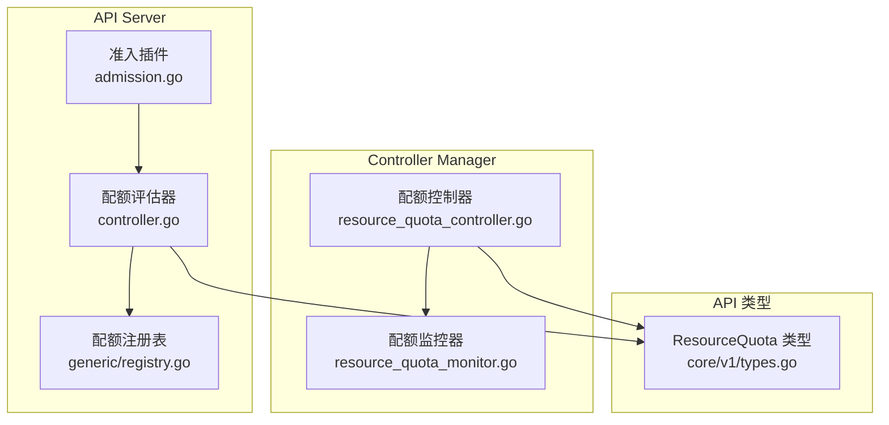
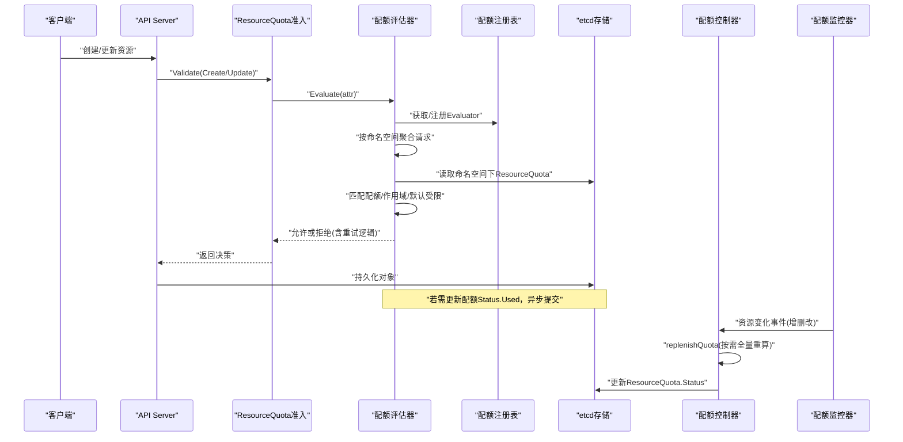
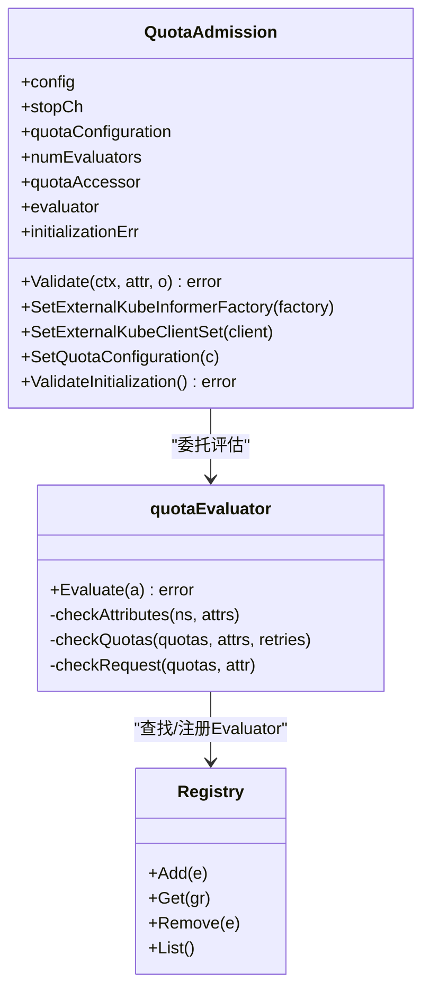
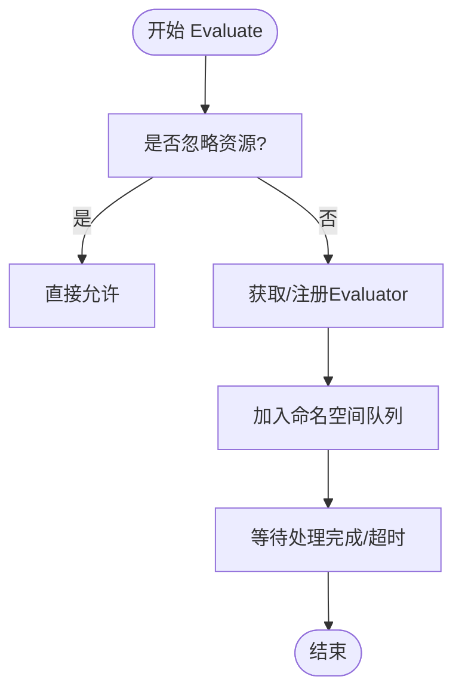
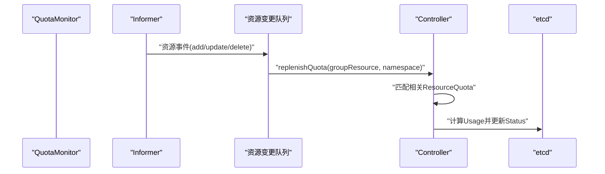
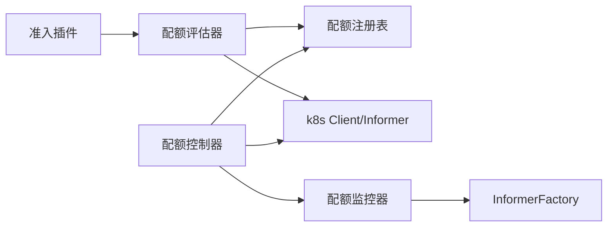

# ResourceQuota插件

<cite>
**本文引用的文件**   
- [admission.go](file://staging/src/k8s.io/apiserver/pkg/admission/plugin/resourcequota/admission.go)
- [controller.go](file://staging/src/k8s.io/apiserver/pkg/admission/plugin/resourcequota/controller.go)
- [types.go](file://staging/src/k8s.io/apiserver/pkg/admission/plugin/resourcequota/apis/resourcequota/types.go)
- [registry.go](file://staging/src/k8s.io/apiserver/pkg/quota/v1/generic/registry.go)
- [resource_quota_controller.go](file://pkg/controller/resourcequota/resource_quota_controller.go)
- [resource_quota_monitor.go](file://pkg/controller/resourcequota/resource_quota_monitor.go)
- [types.go](file://staging/src/k8s.io/api/core/v1/types.go)
</cite>

## 目录
1. [简介](#简介)
2. [项目结构](#项目结构)
3. [核心组件](#核心组件)
4. [架构总览](#架构总览)
5. [详细组件分析](#详细组件分析)
6. [依赖关系分析](#依赖关系分析)
7. [性能与扩展性](#性能与扩展性)
8. [故障排查指南](#故障排查指南)
9. [结论](#结论)
10. [附录](#附录)

## 简介
ResourceQuota准入控制插件在API Server的创建/更新路径上，对命名空间内的资源使用进行配额校验与用量统计。其职责包括：
- 在请求进入存储前，依据命名空间中已存在的ResourceQuota对象，判断是否允许该操作。
- 计算并维护ResourceQuota的Status.Used字段，确保配额限制与实际消耗一致。
- 支持“默认受限”策略：当某些资源的消耗被标记为默认受限时，必须存在覆盖的配额才能允许使用。
- 提供按作用域（Scope）和匹配表达式（MatchExpressions）的细粒度配额能力。

本技术文档面向平台工程师、SRE与Kubernetes使用者，从实现原理、数据流、配置模式到监控告警与调优，给出系统化说明。

## 项目结构
围绕ResourceQuota的关键代码分布在以下位置：
- 准入控制器注册与入口：staging/src/k8s.io/apiserver/pkg/admission/plugin/resourcequota/admission.go
- 配额评估器与批处理队列：staging/src/k8s.io/apiserver/pkg/admission/plugin/resourcequota/controller.go
- 准入配置模型（LimitedResources等）：staging/src/k8s.io/apiserver/pkg/admission/plugin/resourcequota/apis/resourcequota/types.go
- 通用配额评估器注册表：staging/src/k8s.io/apiserver/pkg/quota/v1/generic/registry.go
- 配额状态同步控制器与监控：pkg/controller/resourcequota/resource_quota_controller.go、resource_quota_monitor.go
- API类型定义（ResourceQuota等）：staging/src/k8s.io/api/core/v1/types.go

图表来源
- [admission.go:44-102](file://staging/src/k8s.io/apiserver/pkg/admission/plugin/resourcequota/admission.go#L44-L102)
- [controller.go:109-144](file://staging/src/k8s.io/apiserver/pkg/admission/plugin/resourcequota/controller.go#L109-L144)
- [registry.go:33-56](file://staging/src/k8s.io/apiserver/pkg/quota/v1/generic/registry.go#L33-L56)
- [resource_quota_controller.go:105-191](file://pkg/controller/resourcequota/resource_quota_controller.go#L105-L191)
- [resource_quota_monitor.go:108-123](file://pkg/controller/resourcequota/resource_quota_monitor.go#L108-L123)
- [types.go:7920-7941](file://staging/src/k8s.io/api/core/v1/types.go#L7920-L7941)

章节来源
- [admission.go:44-102](file://staging/src/k8s.io/apiserver/pkg/admission/plugin/resourcequota/admission.go#L44-L102)
- [controller.go:109-144](file://staging/src/k8s.io/apiserver/pkg/admission/plugin/resourcequota/controller.go#L109-L144)
- [registry.go:33-56](file://staging/src/k8s.io/apiserver/pkg/quota/v1/generic/registry.go#L33-L56)
- [resource_quota_controller.go:105-191](file://pkg/controller/resourcequota/resource_quota_controller.go#L105-L191)
- [resource_quota_monitor.go:108-123](file://pkg/controller/resourcequota/resource_quota_monitor.go#L108-L123)
- [types.go:7920-7941](file://staging/src/k8s.io/api/core/v1/types.go#L7920-L7941)

## 核心组件
- 准入插件 QuotaAdmission
  - 负责拦截Create/Update请求，调用Evaluator进行配额校验。
  - 通过WantsExternalKubeInformerFactory/WantsExternalKubeClientSet注入informer与client。
  - 通过SetQuotaConfiguration初始化Evaluator与忽略资源集合。
- 配额评估器 quotaEvaluator
  - 基于工作队列按命名空间聚合请求，批量检查与更新配额。
  - 支持重试机制以处理并发更新冲突。
  - 支持“默认受限”与“作用域覆盖”策略。
- 配额注册表 generic.Registry
  - 管理各GroupResource对应的Usage/Evaluator，动态添加对象计数评估器。
- 配额控制器 Controller
  - 监听ResourceQuota变更，周期性全量重算Usage，并通过监控器触发增量补算。
- 配额监控器 QuotaMonitor
  - 根据Discovery结果启动对应资源的Informer，过滤关键事件，回调控制器触发补算。

章节来源
- [admission.go:63-167](file://staging/src/k8s.io/apiserver/pkg/admission/plugin/resourcequota/admission.go#L63-L167)
- [controller.go:43-144](file://staging/src/k8s.io/apiserver/pkg/admission/plugin/resourcequota/controller.go#L43-L144)
- [registry.go:26-56](file://staging/src/k8s.io/apiserver/pkg/quota/v1/generic/registry.go#L26-L56)
- [resource_quota_controller.go:79-191](file://pkg/controller/resourcequota/resource_quota_controller.go#L79-L191)
- [resource_quota_monitor.go:68-123](file://pkg/controller/resourcequota/resource_quota_monitor.go#L68-L123)

## 架构总览
ResourceQuota由两部分协作完成：
- 准入侧（API Server）：在请求写入前做“预检+增量扣减”，避免超配额写入。
- 控制器侧（Controller Manager）：定期全量重算与事件驱动的增量补算，保证Status.Used最终一致。

图表来源
- [admission.go:160-167](file://staging/src/k8s.io/apiserver/pkg/admission/plugin/resourcequota/admission.go#L160-L167)
- [controller.go:650-686](file://staging/src/k8s.io/apiserver/pkg/admission/plugin/resourcequota/controller.go#L650-L686)
- [controller.go:227-342](file://staging/src/k8s.io/apiserver/pkg/admission/plugin/resourcequota/controller.go#L227-L342)
- [resource_quota_controller.go:417-450](file://pkg/controller/resourcequota/resource_quota_controller.go#L417-L450)
- [resource_quota_monitor.go:354-382](file://pkg/controller/resourcequota/resource_quota_monitor.go#L354-L382)

## 详细组件分析

### 准入插件 QuotaAdmission
- 注册与生命周期
  - Register中加载并验证配置，构造NewResourceQuota。
  - SetExternalKubeInformerFactory/SetExternalKubeClientSet注入依赖。
  - SetQuotaConfiguration初始化Evaluator与忽略资源集合。
- 校验流程
  - Validate仅对非空命名空间的非Namespace创建请求生效。
  - 委托Evaluator.Evaluate执行实际判定。

图表来源
- [admission.go:44-102](file://staging/src/k8s.io/apiserver/pkg/admission/plugin/resourcequota/admission.go#L44-L102)
- [admission.go:121-167](file://staging/src/k8s.io/apiserver/pkg/admission/plugin/resourcequota/admission.go#L121-L167)
- [controller.go:109-144](file://staging/src/k8s.io/apiserver/pkg/admission/plugin/resourcequota/controller.go#L109-L144)
- [registry.go:33-56](file://staging/src/k8s.io/apiserver/pkg/quota/v1/generic/registry.go#L33-L56)

章节来源
- [admission.go:44-102](file://staging/src/k8s.io/apiserver/pkg/admission/plugin/resourcequota/admission.go#L44-L102)
- [admission.go:121-167](file://staging/src/k8s.io/apiserver/pkg/admission/plugin/resourcequota/admission.go#L121-L167)

### 配额评估器 quotaEvaluator
- 批处理与并发
  - 按命名空间将等待中的请求聚合，减少重复查询与锁竞争。
  - 多worker轮询队列，超时保护（默认10秒）。
- 校验与更新
  - checkRequest：匹配配额与作用域，计算delta usage，比较Hard限制，必要时拒绝。
  - checkQuotas：批量更新Status.Used，遇到冲突错误时最多重试若干次。
- 默认受限与覆盖
  - LimitedResources：若某资源被标记为默认受限，则必须有覆盖的配额才允许使用。
  - MatchScopes：基于作用域匹配表达式，要求有覆盖的作用域配额。

图表来源
- [controller.go:650-686](file://staging/src/k8s.io/apiserver/pkg/admission/plugin/resourcequota/controller.go#L650-L686)

章节来源
- [controller.go:109-144](file://staging/src/k8s.io/apiserver/pkg/admission/plugin/resourcequota/controller.go#L109-L144)
- [controller.go:227-342](file://staging/src/k8s.io/apiserver/pkg/admission/plugin/resourcequota/controller.go#L227-L342)
- [controller.go:401-635](file://staging/src/k8s.io/apiserver/pkg/admission/plugin/resourcequota/controller.go#L401-L635)

### 配额注册表 generic.Registry
- 线程安全的Map维护Evaluator列表，支持按GroupResource检索、添加、删除与列举。
- 准入侧在未找到特定Evaluator时，可动态注册对象计数评估器，简化扩展。

章节来源
- [registry.go:26-56](file://staging/src/k8s.io/apiserver/pkg/quota/v1/generic/registry.go#L26-L56)

### 配额控制器 Controller 与监控器 QuotaMonitor
- Controller
  - 监听ResourceQuota的Spec.Hard变更，周期全量重算Usage，并写回Status。
  - 接收监控器的Replenishment回调，针对受影响命名空间触发重算。
- QuotaMonitor
  - 基于Discovery发现可配额资源，为每个资源建立Informer。
  - 过滤update事件（可选），对add/delete/update事件统一入队，回调控制器。

图表来源
- [resource_quota_monitor.go:145-184](file://pkg/controller/resourcequota/resource_quota_monitor.go#L145-L184)
- [resource_quota_monitor.go:354-382](file://pkg/controller/resourcequota/resource_quota_monitor.go#L354-L382)
- [resource_quota_controller.go:417-450](file://pkg/controller/resourcequota/resource_quota_controller.go#L417-L450)
- [resource_quota_controller.go:366-415](file://pkg/controller/resourcequota/resource_quota_controller.go#L366-L415)

章节来源
- [resource_quota_controller.go:105-191](file://pkg/controller/resourcequota/resource_quota_controller.go#L105-L191)
- [resource_quota_controller.go:366-415](file://pkg/controller/resourcequota/resource_quota_controller.go#L366-L415)
- [resource_quota_controller.go:417-450](file://pkg/controller/resourcequota/resource_quota_controller.go#L417-L450)
- [resource_quota_monitor.go:108-123](file://pkg/controller/resourcequota/resource_quota_monitor.go#L108-L123)
- [resource_quota_monitor.go:186-247](file://pkg/controller/resourcequota/resource_quota_monitor.go#L186-L247)
- [resource_quota_monitor.go:305-352](file://pkg/controller/resourcequota/resource_quota_monitor.go#L305-L352)

### API类型 ResourceQuota
- Spec：定义硬限制（Hard）、作用域（Scopes）与作用域选择器（ScopeSelector）。
- Status：记录当前已用（Used）与硬限制快照（Hard）。

章节来源
- [types.go:7920-7941](file://staging/src/k8s.io/api/core/v1/types.go#L7920-L7941)

## 依赖关系分析
- 准入插件依赖：
  - admission框架接口（ValidationInterface、Wants*系列）
  - 外部k8s client/informer工厂
  - 配额配置与注册表
- 评估器依赖：
  - 配额注册表（用于获取/注册Evaluator）
  - 工作队列（按命名空间聚合）
  - etcd（读取/更新ResourceQuota）
- 控制器依赖：
  - Discovery（发现可配额资源）
  - InformerFactory（为资源建立Informer）
  - 配额注册表（计算Usage）

图表来源
- [admission.go:114-129](file://staging/src/k8s.io/apiserver/pkg/admission/plugin/resourcequota/admission.go#L114-L129)
- [controller.go:109-144](file://staging/src/k8s.io/apiserver/pkg/admission/plugin/resourcequota/controller.go#L109-L144)
- [resource_quota_controller.go:159-191](file://pkg/controller/resourcequota/resource_quota_controller.go#L159-L191)
- [resource_quota_monitor.go:108-123](file://pkg/controller/resourcequota/resource_quota_monitor.go#L108-L123)

章节来源
- [admission.go:114-129](file://staging/src/k8s.io/apiserver/pkg/admission/plugin/resourcequota/admission.go#L114-L129)
- [controller.go:109-144](file://staging/src/k8s.io/apiserver/pkg/admission/plugin/resourcequota/controller.go#L109-L144)
- [resource_quota_controller.go:159-191](file://pkg/controller/resourcequota/resource_quota_controller.go#L159-L191)
- [resource_quota_monitor.go:108-123](file://pkg/controller/resourcequota/resource_quota_monitor.go#L108-L123)

## 性能与扩展性
- 批处理与去抖
  - 按命名空间聚合请求，降低重复查询与锁竞争。
  - 工作队列带速率限制与退避，避免雪崩。
- 并发与超时
  - 多worker并行处理；单次评估设置超时保护，防止阻塞API Server。
- 冲突重试
  - 更新配额Status.Used失败时，拉取最新版本并重试，提升一致性。
- 可扩展性
  - 通过注册表动态注册Evaluator，新增资源类型的配额计算无需修改核心流程。
  - 监控器基于Discovery自动发现资源，减少人工维护成本。

[本节为通用指导，不直接分析具体文件]

## 故障排查指南
- 常见现象
  - 请求被拒绝且提示超出配额：检查命名空间下ResourceQuota的Hard与Used，确认是否存在覆盖的配额。
  - 状态不一致（Used滞后）：控制器可能尚未完成全量重算或监控器未就绪，等待周期重算或手动触发。
  - 默认受限资源被拒：确认LimitedResources配置与匹配表达式，确保存在覆盖配额。
- 定位步骤
  - 查看准入日志：关注“exceeded quota”、“status unknown for quota”等关键字。
  - 检查控制器日志：观察“syncing resource quota controller with updated resources from discovery”、“Timed out waiting for quota monitor sync”。
  - 核对Informer同步：确认监控器IsSynced为true。
- 恢复建议
  - 调整配额Hard值或清理无用资源。
  - 修正LimitedResources与MatchScopes配置。
  - 增加控制器worker数量或缩短重算周期（谨慎评估影响）。

章节来源
- [controller.go:401-635](file://staging/src/k8s.io/apiserver/pkg/admission/plugin/resourcequota/controller.go#L401-L635)
- [resource_quota_controller.go:452-521](file://pkg/controller/resourcequota/resource_quota_controller.go#L452-L521)

## 结论
ResourceQuota准入控制插件通过“准入预检+控制器重算”的双轨机制，实现了命名空间级别的资源配额治理。其设计兼顾了高吞吐与一致性，具备良好扩展性与可观测性。合理配置LimitedResources与MatchScopes，配合监控告警与扩容策略，可在保障集群稳定性的同时满足多租户隔离需求。

[本节为总结，不直接分析具体文件]

## 附录

### 支持的资源类型与配额计算方式
- 内置支持
  - 对象计数：当未注册特定Evaluator时，准入侧会动态注册对象计数评估器。
  - 自定义Evaluator：通过注册表注册，实现复杂资源（如GPU、存储类）的用量计算。
- 计算要点
  - Create：累加新对象的usage。
  - Update：计算新旧对象usage差值，仅对匹配的配额生效。
  - Delete：减去旧对象usage。
  - 子资源：通常不计入配额（例如status子资源）。

章节来源
- [controller.go:660-668](file://staging/src/k8s.io/apiserver/pkg/admission/plugin/resourcequota/controller.go#L660-L668)
- [controller.go:515-552](file://staging/src/k8s.io/apiserver/pkg/admission/plugin/resourcequota/controller.go#L515-L552)

### 配置示例与策略设计模式
- 准入配置（AdmissionConfiguration）
  - LimitedResources：指定默认受限的资源族与匹配规则（包含字符串匹配与作用域匹配）。
- 配额策略模式
  - 基础配额：按CPU/内存/对象数设定上限。
  - 作用域配额：结合Scopes与ScopeSelector，对不同优先级/标签的对象分别限额。
  - 默认受限：开启后，任何默认受限资源的消耗都必须有覆盖配额，否则拒绝。

章节来源
- [types.go:26-72](file://staging/src/k8s.io/apiserver/pkg/admission/plugin/resourcequota/apis/resourcequota/types.go#L26-L72)

### 监控、告警与扩容策略
- 监控指标
  - 配额控制器重算耗时、队列长度、监控器同步状态。
  - 准入评估超时次数、冲突重试次数。
- 告警建议
  - 接近配额阈值（如Used/Hard > 80%）。
  - 监控器长时间未同步。
  - 准入评估频繁超时或被拒绝。
- 扩容策略
  - 增加配额控制器worker数量。
  - 缩短周期重算间隔（权衡API压力）。
  - 优化Evaluator计算复杂度，避免长尾。

[本节为通用指导，不直接分析具体文件]

### 配额冲突解决
- 冲突场景
  - 多个请求同时更新同一ResourceQuota的Status.Used导致版本冲突。
- 解决机制
  - 准入侧在更新失败时拉取最新版本并重试，直至成功或达到最大重试次数。
  - 控制器侧周期性全量重算，确保最终一致。

章节来源
- [controller.go:278-342](file://staging/src/k8s.io/apiserver/pkg/admission/plugin/resourcequota/controller.go#L278-L342)
- [resource_quota_controller.go:366-415](file://pkg/controller/resourcequota/resource_quota_controller.go#L366-L415)