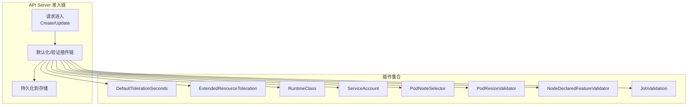
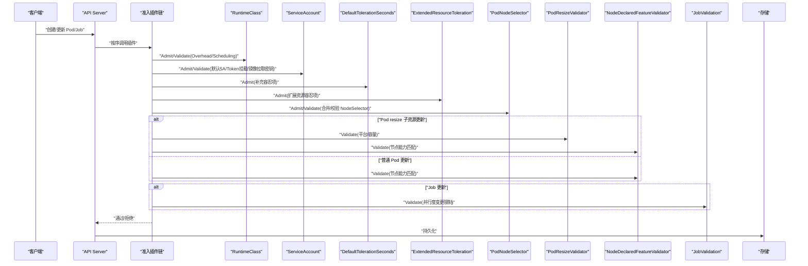
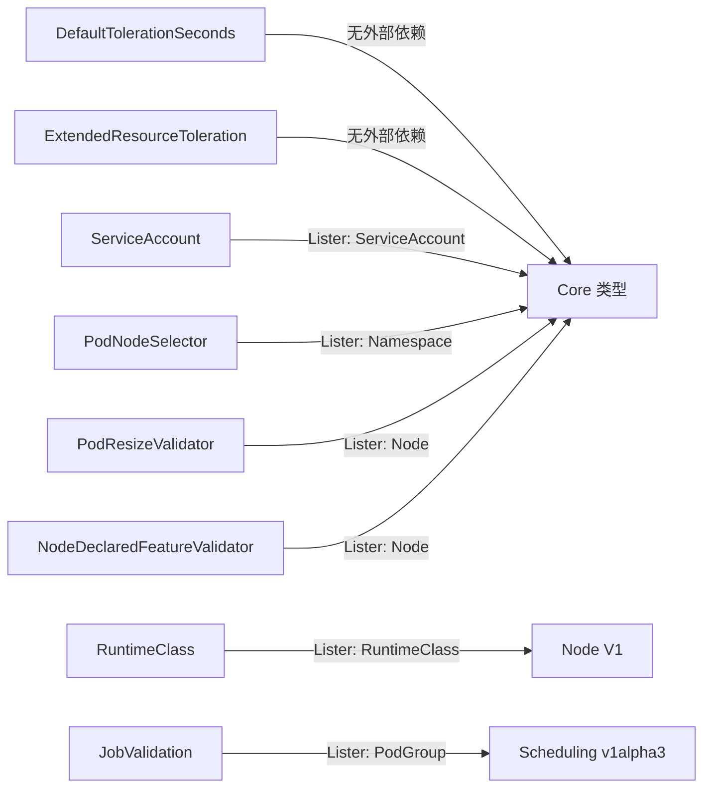

# 其他内置插件

<cite>
**本文引用的文件**   
- [defaulttolerationseconds/admission.go](file://plugin/pkg/admission/defaulttolerationseconds/admission.go)
- [extendedresourcetoleration/admission.go](file://plugin/pkg/admission/extendedresourcetoleration/admission.go)
- [job/admission.go](file://plugin/pkg/admission/job/admission.go)
- [nodedeclaredfeatures/admission.go](file://plugin/pkg/admission/nodedeclaredfeatures/admission.go)
- [podnodeselector/admission.go](file://plugin/pkg/admission/podnodeselector/admission.go)
- [podresize/admission.go](file://plugin/pkg/admission/podresize/admission.go)
- [runtimeclass/admission.go](file://plugin/pkg/admission/runtimeclass/admission.go)
- [serviceaccount/admission.go](file://plugin/pkg/admission/serviceaccount/admission.go)
</cite>

## 目录
1. [简介](#简介)
2. [项目结构](#项目结构)
3. [核心组件](#核心组件)
4. [架构总览](#架构总览)
5. [详细组件分析](#详细组件分析)
6. [依赖关系分析](#依赖关系分析)
7. [性能考量](#性能考量)
8. [故障排查指南](#故障排查指南)
9. [结论](#结论)
10. [附录](#附录)

## 简介
本技术文档聚焦 Kubernetes API Server 的若干“其他内置准入控制插件”，包括：DefaultTolerationSeconds、ExtendedResourceToleration、Job、NodeDeclaredFeatures、PodNodeSelector、PodResize、RuntimeClass、ServiceAccount。文档将逐一说明其功能与适用场景、配置选项与使用模式、执行顺序与协作关系，并提供最佳实践、性能影响分析与调优建议，以及统一的故障排查方法与常见问题解决方案。

## 项目结构
这些插件均位于 kube-apiserver 的 admission 插件目录中，遵循统一的注册与生命周期接口（WantsExternalKubeInformerFactory/WantsExternalKubeClientSet、ValidateInitialization、Admit/Validate）。每个插件以独立包形式实现，便于按需启用与组合。

[此图为概念性结构示意，不直接映射具体源码文件]

## 核心组件
本节概述各插件的职责边界与关键行为要点，后续章节将深入展开。

- DefaultTolerationSeconds：为 Pod 自动补充 notReady:NoExecute 与 unreachable:NoExecute 容忍项（若未显式声明），用于节点不可用或失联时的优雅驱逐。
- ExtendedResourceToleration：当 Pod 请求扩展资源时，自动为其添加对应键的 NoSchedule 容忍项，避免调度器因污点拒绝。
- Job：在 Gang 调度场景下，校验并阻止对已绑定 PodGroup 的 Job 并行度变更，保障 gang 语义一致性。
- NodeDeclaredFeatures：基于节点声明能力框架，校验 Pod 更新（含 resize）所需能力是否满足目标节点。
- PodNodeSelector：合并命名空间级 NodeSelector 策略，校验冲突与白名单，确保 Pod 可被调度。
- PodResize：针对 InPlace Vertical Scaling 的 Pod resize 子资源更新进行前置校验（平台与容量）。
- RuntimeClass：根据 RuntimeClass 定义注入 Overhead 与 Scheduling 信息，并校验一致性。
- ServiceAccount：为 Pod 设置默认 SA、自动挂载 Token、复制 ImagePullSecrets，并在开启限制时校验 Secret 引用范围。

**章节来源**
- [defaulttolerationseconds/admission.go](file://plugin/pkg/admission/defaulttolerationseconds/admission.go)
- [extendedresourcetoleration/admission.go](file://plugin/pkg/admission/extendedresourcetoleration/admission.go)
- [job/admission.go](file://plugin/pkg/admission/job/admission.go)
- [nodedeclaredfeatures/admission.go](file://plugin/pkg/admission/nodedeclaredfeatures/admission.go)
- [podnodeselector/admission.go](file://plugin/pkg/admission/podnodeselector/admission.go)
- [podresize/admission.go](file://plugin/pkg/admission/podresize/admission.go)
- [runtimeclass/admission.go](file://plugin/pkg/admission/runtimeclass/admission.go)
- [serviceaccount/admission.go](file://plugin/pkg/admission/serviceaccount/admission.go)

## 架构总览
下图展示典型 Pod 创建/更新路径中，上述插件如何参与默认化与校验流程。注意：实际执行顺序由 API Server 的准入链配置决定；此处给出一种常见且合理的顺序示例。

**图表来源**
- [runtimeclass/admission.go](file://plugin/pkg/admission/runtimeclass/admission.go)
- [serviceaccount/admission.go](file://plugin/pkg/admission/serviceaccount/admission.go)
- [defaulttolerationseconds/admission.go](file://plugin/pkg/admission/defaulttolerationseconds/admission.go)
- [extendedresourcetoleration/admission.go](file://plugin/pkg/admission/extendedresourcetoleration/admission.go)
- [podnodeselector/admission.go](file://plugin/pkg/admission/podnodeselector/admission.go)
- [podresize/admission.go](file://plugin/pkg/admission/podresize/admission.go)
- [nodedeclaredfeatures/admission.go](file://plugin/pkg/admission/nodedeclaredfeatures/admission.go)
- [job/admission.go](file://plugin/pkg/admission/job/admission.go)

## 详细组件分析

### DefaultTolerationSeconds
- 功能与适用场景
  - 为未显式声明的 Pod 自动添加 notReady:NoExecute 与 unreachable:NoExecute 容忍项，提升节点异常时的 Pod 存活可控性。
- 配置选项
  - 命令行参数：default-not-ready-toleration-seconds、default-unreachable-toleration-seconds。
- 使用模式
  - 仅处理 Pod 主资源的 Create/Update，忽略子资源。
  - 若 Pod 已存在匹配的容忍项则不重复添加。
- 最佳实践
  - 结合节点污点策略统一规划，避免过度容忍导致 Pod 长期停留在异常节点。
  - 合理设置秒数，平衡自愈与快速驱逐需求。
- 性能影响
  - 轻量计算，无外部 I/O，开销极低。

**章节来源**
- [defaulttolerationseconds/admission.go](file://plugin/pkg/admission/defaulttolerationseconds/admission.go)

### ExtendedResourceToleration
- 功能与适用场景
  - 当 Pod 请求扩展资源（如 example.com/device）时，自动添加对应键的 Exists + NoSchedule 容忍项，避免调度阶段因污点拒绝。
- 配置选项
  - 无需额外配置。
- 使用模式
  - 扫描容器与 InitContainer 的请求资源，识别扩展资源名并追加容忍项。
- 最佳实践
  - 配合调度器的扩展资源分配策略与节点污点管理，确保资源隔离与调度正确性。
- 性能影响
  - 轻量遍历与集合操作，开销极低。

**章节来源**
- [extendedresourcetoleration/admission.go](file://plugin/pkg/admission/extendedresourcetoleration/admission.go)

### Job（JobValidation）
- 功能与适用场景
  - 在 GenericWorkload 或 WorkloadWithJob 特性启用时，校验对 Gang 调度的 PodGroup 关联 Job 的并行度变更，防止破坏 gang 语义。
- 配置选项
  - 依赖特性门控：GenericWorkload、WorkloadWithJob。
- 使用模式
  - 监听 PodGroup 列表器，检查 Job 模板中的 SchedulingGroup 或直接查找同命名空间受控的 PodGroup。
- 最佳实践
  - 对需要严格 gang 语义的工作负载（如分布式训练）启用该插件，避免运行时扩缩容引发不一致。
- 性能影响
  - 读取 PodGroup 列表器缓存，CPU 与内存开销低。

**章节来源**
- [job/admission.go](file://plugin/pkg/admission/job/admission.go)

### NodeDeclaredFeatures（NodeDeclaredFeatureValidator）
- 功能与适用场景
  - 基于节点声明能力框架，校验 Pod 更新（含 resize）所需的节点能力是否满足，避免在不支持能力的节点上运行。
- 配置选项
  - 依赖特性门控：NodeDeclaredFeatures。
- 使用模式
  - 仅处理 Pod Update 与 resize 子资源；若 Pod 未绑定节点则跳过；比较 Generation 变化后执行能力推断与匹配。
- 最佳实践
  - 在异构节点集群中启用，确保工作负载能力声明与节点能力一致。
- 性能影响
  - 涉及版本解析与能力推断，但仅在更新路径触发，整体开销可控。

**章节来源**
- [nodedeclaredfeatures/admission.go](file://plugin/pkg/admission/nodedeclaredfeatures/admission.go)

### PodNodeSelector
- 功能与适用场景
  - 从命名空间注解或集群默认配置加载 NodeSelector，合并至 Pod，并校验冲突与白名单，保证 Pod 可调度。
- 配置选项
  - 通过 --admission-control-config-file 提供 YAML/JSON 配置，包含 clusterDefaultNodeSelector 与命名空间级覆盖。
  - 命名空间注解键：scheduler.alpha.kubernetes.io/node-selector。
- 使用模式
  - 合并策略：命名空间选择器优先，Pod 选择器覆盖；冲突检测与白名单子集校验。
- 最佳实践
  - 集中化管理命名空间级调度约束，减少应用侧配置负担。
- 性能影响
  - 读取 Namespace 列表器缓存，计算简单，开销低。

**章节来源**
- [podnodeselector/admission.go](file://plugin/pkg/admission/podnodeselector/admission.go)

### PodResize（PodResizeValidator）
- 功能与适用场景
  - 针对 InPlace Vertical Scaling 的 Pod resize 子资源更新进行前置校验：平台支持（Linux）与节点 Allocatable 容量检查。
- 配置选项
  - 依赖特性门控：InPlacePodVerticalScaling。
- 使用模式
  - 仅处理 Pod Update 的 resize 子资源；要求 Pod 已绑定节点；对比 Generation 变化后执行校验。
- 最佳实践
  - 在 Linux 节点上启用；预留足够 Allocatable 余量，避免扩容失败。
- 性能影响
  - 读取 Node 列表器缓存，资源计算轻量。

**章节来源**
- [podresize/admission.go](file://plugin/pkg/admission/podresize/admission.go)

### RuntimeClass
- 功能与适用场景
  - 根据 RuntimeClass 定义注入 Pod 的 Overhead 与 Scheduling（NodeSelector/Tolerations），并校验一致性，确保运行时开销与调度策略正确。
- 配置选项
  - 无需额外配置，依赖 RuntimeClass 对象定义。
- 使用模式
  - 若 Pod 指定 RuntimeClassName，则获取对应 RuntimeClass；若定义 Overhead，则强制写入 Pod 并拒绝不一致；合并 Scheduling 字段。
- 最佳实践
  - 统一管理运行时开销与调度约束，避免应用侧误配。
- 性能影响
  - 读取 RuntimeClass 列表器缓存，必要时回退直查；开销较低。

**章节来源**
- [runtimeclass/admission.go](file://plugin/pkg/admission/runtimeclass/admission.go)

### ServiceAccount
- 功能与适用场景
  - 为 Pod 设置默认 ServiceAccount；可选自动挂载 API Token；复制 ImagePullSecrets；在开启限制时校验 Secret 引用范围。
- 配置选项
  - 插件内部开关：LimitSecretReferences（默认关闭）、MountServiceAccountToken（默认开启）。
  - 注解：kubernetes.io/enforce-mountable-secrets=true 可强制某 SA 启用限制。
- 使用模式
  - 仅对 Pod Create 进行默认化与校验；镜像副本镜像（Mirror Pod）有特殊限制；支持临时容器（ephemeralcontainers）的 Secret 引用校验。
- 最佳实践
  - 在生产环境逐步启用 LimitSecretReferences，最小化权限暴露面；谨慎使用自动挂载 Token，结合安全策略。
- 性能影响
  - 读取 ServiceAccount 列表器缓存，必要时重试直查；开销适中。

**章节来源**
- [serviceaccount/admission.go](file://plugin/pkg/admission/serviceaccount/admission.go)

## 依赖关系分析
- 外部依赖
  - Informer/Lister：Node、Namespace、ServiceAccount、RuntimeClass、PodGroup（Scheduling v1alpha3）。
  - FeatureGate：NodeDeclaredFeatures、InPlacePodVerticalScaling、GenericWorkload、WorkloadWithJob。
- 耦合与内聚
  - 各插件职责单一，主要依赖各自资源类型的 Lister；跨资源校验（如 Job 与 PodGroup）通过外部 Informer 工厂注入。
- 潜在循环依赖
  - 插件间无直接导入关系，通过准入链串联，避免循环依赖风险。

**图表来源**
- [runtimeclass/admission.go](file://plugin/pkg/admission/runtimeclass/admission.go)
- [serviceaccount/admission.go](file://plugin/pkg/admission/serviceaccount/admission.go)
- [podnodeselector/admission.go](file://plugin/pkg/admission/podnodeselector/admission.go)
- [podresize/admission.go](file://plugin/pkg/admission/podresize/admission.go)
- [nodedeclaredfeatures/admission.go](file://plugin/pkg/admission/nodedeclaredfeatures/admission.go)
- [job/admission.go](file://plugin/pkg/admission/job/admission.go)

**章节来源**
- [runtimeclass/admission.go](file://plugin/pkg/admission/runtimeclass/admission.go)
- [serviceaccount/admission.go](file://plugin/pkg/admission/serviceaccount/admission.go)
- [podnodeselector/admission.go](file://plugin/pkg/admission/podnodeselector/admission.go)
- [podresize/admission.go](file://plugin/pkg/admission/podresize/admission.go)
- [nodedeclaredfeatures/admission.go](file://plugin/pkg/admission/nodedeclaredfeatures/admission.go)
- [job/admission.go](file://plugin/pkg/admission/job/admission.go)

## 性能考量
- 通用建议
  - 尽量利用 Lister 缓存，避免频繁直查 API Server。
  - 将高成本校验置于必要路径（如 resize、能力匹配），并通过 Generation 变化快速短路。
- 各插件概览
  - DefaultTolerationSeconds、ExtendedResourceToleration：纯内存计算，开销极低。
  - PodNodeSelector、RuntimeClass、ServiceAccount：读取少量缓存对象，开销低。
  - PodResize、NodeDeclaredFeatures：涉及资源计算与能力推断，仅在更新路径触发，整体可控。
  - JobValidation：依赖 PodGroup 列表器，查询开销低。
- 调优建议
  - 合理配置 Informer 同步等待（ReadyFunc），避免未就绪时拒绝请求。
  - 对高频路径（如大量 Pod 创建）保持插件逻辑简洁，避免复杂字符串处理或网络调用。

[本节为通用指导，不直接分析具体文件]

## 故障排查指南
- 通用步骤
  - 确认插件是否启用及准入链顺序是否符合预期。
  - 查看 Admission 拒绝原因（Forbidden/StatusError），定位具体插件。
  - 核对相关资源是否存在且状态正常（Node、Namespace、ServiceAccount、RuntimeClass、PodGroup）。
  - 检查特性门控是否按预期开启。
- 常见问题
  - Pod 无法调度
    - 检查 PodNodeSelector 合并结果与冲突提示；确认命名空间注解与集群默认配置。
    - 检查 ExtendedResourceToleration 是否正确添加扩展资源容忍项。
  - Pod 扩容失败
    - 检查 PodResize 返回的原因（UnsupportedPlatform、NodeCapacity）；确认节点 OS 标签与 Allocatable。
  - 运行时开销不一致
    - 检查 RuntimeClass 的 Overhead 是否与 Pod 一致；确认插件已注入。
  - 鉴权/令牌问题
    - 检查 ServiceAccount 自动挂载与引用限制；确认镜像拉取密钥是否被复制。
  - Gang 调度异常
    - 检查 Job 并行度变更是否被 JobValidation 拒绝；确认 PodGroup 是否为 Gang 调度。
- 日志与指标
  - 关注 API Server 准入链日志与错误堆栈；结合 Prometheus 指标观察拒绝率与延迟。

**章节来源**
- [podnodeselector/admission.go](file://plugin/pkg/admission/podnodeselector/admission.go)
- [podresize/admission.go](file://plugin/pkg/admission/podresize/admission.go)
- [runtimeclass/admission.go](file://plugin/pkg/admission/runtimeclass/admission.go)
- [serviceaccount/admission.go](file://plugin/pkg/admission/serviceaccount/admission.go)
- [job/admission.go](file://plugin/pkg/admission/job/admission.go)

## 结论
上述内置插件覆盖了 Pod 生命周期中常见的默认化与校验需求，从调度约束、运行时开销、能力匹配到身份与密钥管理，形成一套协同工作的准入体系。通过合理配置与编排准入链顺序，可在保证安全与稳定性的同时，降低应用侧复杂度并提升运维效率。

[本节为总结性内容，不直接分析具体文件]

## 附录
- 配置示例（文本描述）
  - PodNodeSelector 配置文件（YAML/JSON）
    - 顶层字段 podNodeSelectorPluginConfig
    - 键 clusterDefaultNodeSelector：集群默认 NodeSelector
    - 键 <namespace>：命名空间级覆盖
  - 命名空间注解
    - scheduler.alpha.kubernetes.io/node-selector：值为 label selector 字符串
- 使用模式速览
  - 默认化类插件（Admit）：RuntimeClass、ServiceAccount、DefaultTolerationSeconds、ExtendedResourceToleration、PodNodeSelector
  - 校验类插件（Validate）：PodResize、NodeDeclaredFeatures、Job
- 最佳实践清单
  - 明确特性门控与插件启用策略
  - 集中管理命名空间级调度策略
  - 最小化 Secret 引用范围，逐步启用限制
  - 在异构节点集群启用节点能力校验
  - 对 Gang 工作负载启用 Job 并行度保护

[本节为补充信息，不直接分析具体文件]