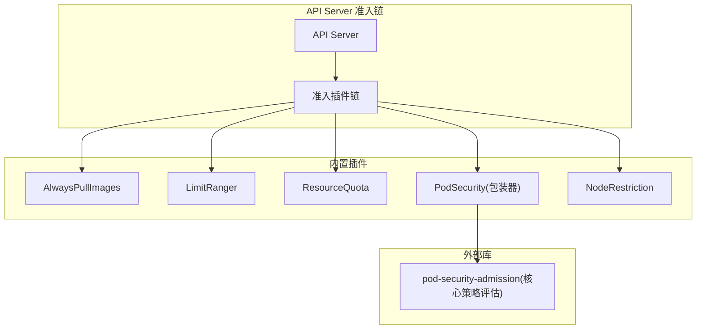
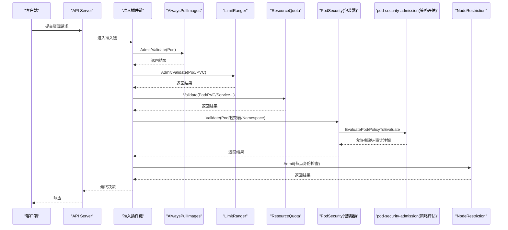
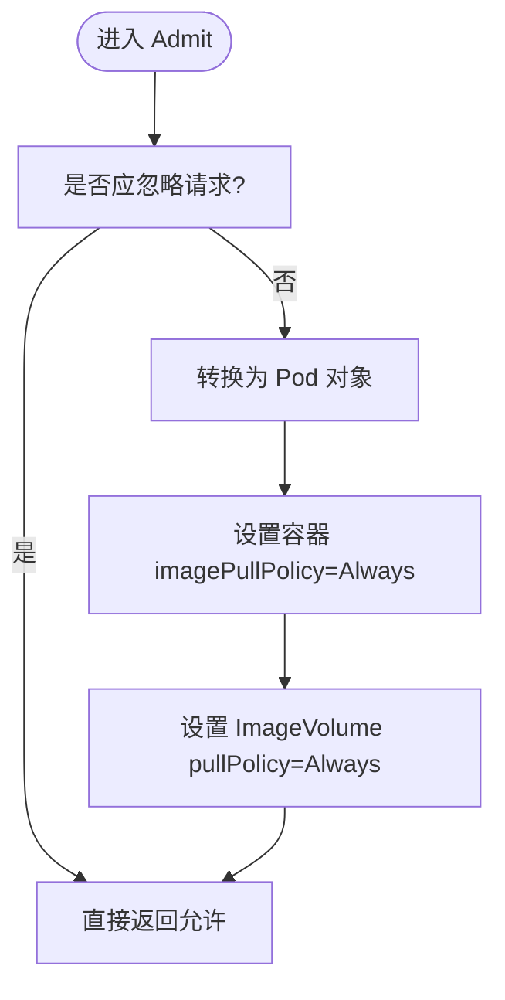
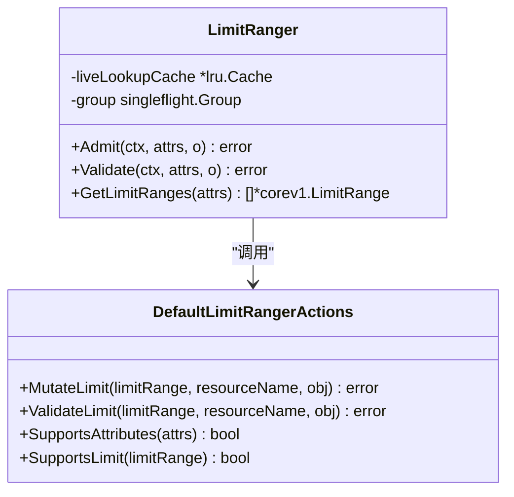
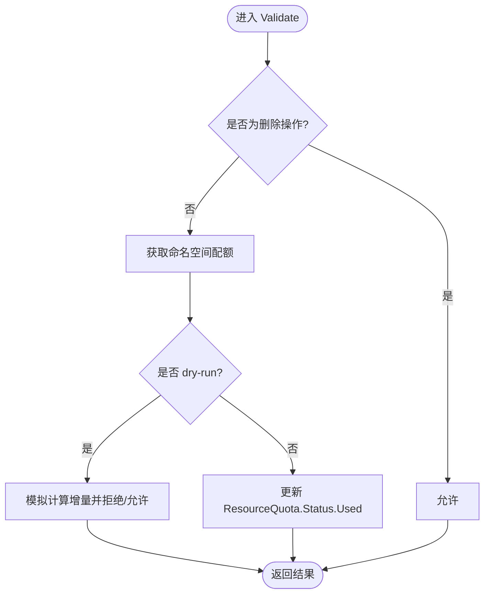
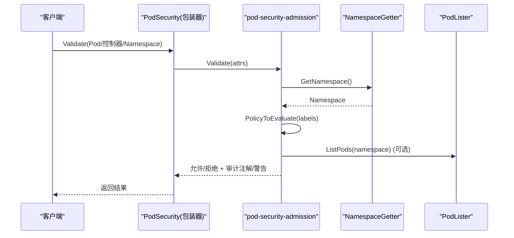
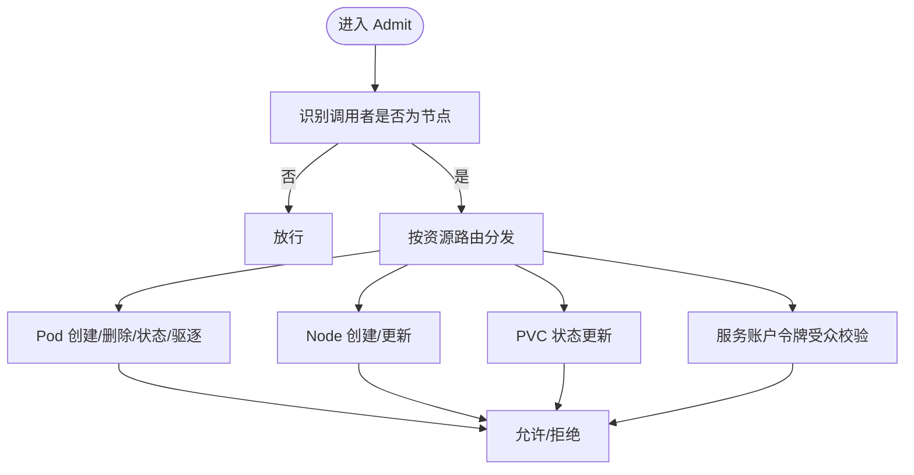
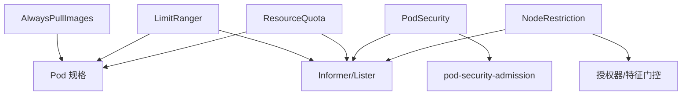

# 内置准入控制插件

<cite>
**本文引用的文件**   
- [alwayspullimages/admission.go](file://plugin/pkg/admission/alwayspullimages/admission.go)
- [limitranger/admission.go](file://plugin/pkg/admission/limitranger/admission.go)
- [resourcequota/admission_test.go](file://plugin/pkg/admission/resourcequota/admission_test.go)
- [security/podsecurity/admission.go](file://plugin/pkg/admission/security/podsecurity/admission.go)
- [staging/src/k8s.io/pod-security-admission/admission/admission.go](file://staging/src/k8s.io/pod-security-admission/admission/admission.go)
- [noderestriction/admission.go](file://plugin/pkg/admission/noderestriction/admission.go)
</cite>

## 目录
1. [简介](#简介)
2. [项目结构](#项目结构)
3. [核心组件](#核心组件)
4. [架构总览](#架构总览)
5. [详细组件分析](#详细组件分析)
6. [依赖关系分析](#依赖关系分析)
7. [性能考虑](#性能考虑)
8. [故障排查指南](#故障排查指南)
9. [结论](#结论)
10. [附录](#附录)

## 简介
本文件面向 Kubernetes 内置准入控制插件，聚焦以下核心插件的功能、工作原理、配置与使用场景：AlwaysPullImages、LimitRanger、ResourceQuota、PodSecurity、NodeRestriction。文档提供各插件的执行顺序与依赖关系说明、性能影响分析与调优建议，以及常见问题的排查方法。

## 项目结构
Kubernetes 的内置准入插件位于 plugin/pkg/admission 目录下，每个插件以独立包形式实现，遵循统一的注册与初始化接口。PodSecurity 的核心逻辑由 staging 模块中的 pod-security-admission 库提供，apiserver 侧通过包装器适配并集成。

[此图为概念性结构图，不直接映射具体源码文件，故无“图表来源”]

## 核心组件
本节概述各插件的职责与关键行为，后续章节将深入源码级细节。

- AlwaysPullImages：强制新 Pod 的镜像拉取策略为 Always，并在更新时避免对未变更镜像的请求进行重复处理。
- LimitRanger：基于命名空间的 LimitRange 对象，为容器和 PVC 设置默认资源请求/限制，并校验最小/最大及比率约束。
- ResourceQuota：在命名空间维度统计与限制资源用量，创建/更新对象时计算增量并更新配额状态；支持 dry-run 与旧对象差异比较。
- PodSecurity：按命名空间标签选择安全级别（privileged、baseline、restricted），支持 enforce/audit/warn 三种模式，并对 Pod 及其控制器模板进行策略评估。
- NodeRestriction：针对节点身份发起的请求进行强限制，仅允许操作自身相关资源（如镜像 Pod、节点状态、PVC 状态等），并限制服务账户令牌受众范围。

**章节来源**
- [alwayspullimages/admission.go:41-84](file://plugin/pkg/admission/alwayspullimages/admission.go#L41-L84)
- [limitranger/admission.go:48-118](file://plugin/pkg/admission/limitranger/admission.go#L48-L118)
- [resourcequota/admission_test.go:129-183](file://plugin/pkg/admission/resourcequota/admission_test.go#L129-L183)
- [security/podsecurity/admission.go:58-115](file://plugin/pkg/admission/security/podsecurity/admission.go#L58-L115)
- [staging/src/k8s.io/pod-security-admission/admission/admission.go:51-73](file://staging/src/k8s.io/pod-security-admission/admission/admission.go#L51-L73)
- [noderestriction/admission.go:58-104](file://plugin/pkg/admission/noderestriction/admission.go#L58-L104)

## 架构总览
下图展示 API Server 请求进入准入链后，各插件的处理流程与交互关系。

**图表来源**
- [alwayspullimages/admission.go:61-84](file://plugin/pkg/admission/alwayspullimages/admission.go#L61-L84)
- [limitranger/admission.go:110-156](file://plugin/pkg/admission/limitranger/admission.go#L110-L156)
- [resourcequota/admission_test.go:185-259](file://plugin/pkg/admission/resourcequota/admission_test.go#L185-L259)
- [security/podsecurity/admission.go:193-233](file://plugin/pkg/admission/security/podsecurity/admission.go#L193-L233)
- [staging/src/k8s.io/pod-security-admission/admission/admission.go:210-224](file://staging/src/k8s.io/pod-security-admission/admission/admission.go#L210-L224)
- [noderestriction/admission.go:187-253](file://plugin/pkg/admission/noderestriction/admission.go#L187-L253)

## 详细组件分析

### AlwaysPullImages 插件
- 功能要点
  - 对所有新建 Pod 的容器镜像拉取策略强制设置为 Always。
  - 对包含 ImageVolume 的卷也设置 PullPolicy=Always。
  - 在更新操作中，若未引入新镜像则忽略，以减少不必要的处理。
- 关键实现路径
  - 注册与构造：见 [alwayspullimages/admission.go:44-49](file://plugin/pkg/admission/alwayspullimages/admission.go#L44-L49)、[alwayspullimages/admission.go:173-179](file://plugin/pkg/admission/alwayspullimages/admission.go#L173-L179)
  - 修改与验证：见 [alwayspullimages/admission.go:61-84](file://plugin/pkg/admission/alwayspullimages/admission.go#L61-L84)、[alwayspullimages/admission.go:86-125](file://plugin/pkg/admission/alwayspullimages/admission.go#L86-L125)
  - 忽略条件与优化：见 [alwayspullimages/admission.go:127-171](file://plugin/pkg/admission/alwayspullimages/admission.go#L127-L171)
- 配置选项
  - 该插件无需额外配置文件，启用后即生效。
- 使用场景
  - 多租户集群中确保私有镜像必须携带有效凭据才能拉取，防止缓存复用导致的安全风险。
- 最佳实践
  - 配合镜像仓库认证与网络策略，确保镜像拉取安全。
  - 注意 Always 策略会增加镜像拉取开销，建议在受控环境启用。

**图表来源**
- [alwayspullimages/admission.go:61-84](file://plugin/pkg/admission/alwayspullimages/admission.go#L61-L84)
- [alwayspullimages/admission.go:127-171](file://plugin/pkg/admission/alwayspullimages/admission.go#L127-L171)

**章节来源**
- [alwayspullimages/admission.go:41-84](file://plugin/pkg/admission/alwayspullimages/admission.go#L41-L84)
- [alwayspullimages/admission.go:86-125](file://plugin/pkg/admission/alwayspullimages/admission.go#L86-L125)
- [alwayspullimages/admission.go:127-171](file://plugin/pkg/admission/alwayspullimages/admission.go#L127-L171)

### LimitRanger 插件
- 功能要点
  - 根据命名空间内的 LimitRange 对象，为 Pod 容器与 InitContainer 设置默认资源请求/限制。
  - 校验最小/最大资源用量与 limit/request 比率约束。
  - 对 PVC 的存储请求执行最小/最大约束。
  - 支持 In-Place Vertical Resize 子资源更新时的资源校验。
- 关键实现路径
  - 注册与构造：见 [limitranger/admission.go:54-59](file://plugin/pkg/admission/limitranger/admission.go#L54-L59)、[limitranger/admission.go:197-211](file://plugin/pkg/admission/limitranger/admission.go#L197-L211)
  - 获取 LimitRange 列表与缓存：见 [limitranger/admission.go:158-195](file://plugin/pkg/admission/limitranger/admission.go#L158-L195)
  - 默认值合并与注解记录：见 [limitranger/admission.go:213-292](file://plugin/pkg/admission/limitranger/admission.go#L213-L292)
  - 约束校验函数（min/max/ratio）：见 [limitranger/admission.go:294-385](file://plugin/pkg/admission/limitranger/admission.go#L294-L385)
  - Pod 与 PVC 校验入口：见 [limitranger/admission.go:397-416](file://plugin/pkg/admission/limitranger/admission.go#L397-L416)、[limitranger/admission.go:447-473](file://plugin/pkg/admission/limitranger/admission.go#L447-L473)
  - Pod 资源聚合（含 PodLevelResources 特性）：见 [limitranger/admission.go:574-675](file://plugin/pkg/admission/limitranger/admission.go#L574-L675)
- 配置选项
  - 通过命名空间 LimitRange 资源定义默认值与约束。
- 使用场景
  - 在多租户或团队环境中，统一资源基线，防止资源滥用。
- 最佳实践
  - 合理设置 default/defaultRequest，减少用户遗漏配置。
  - 谨慎设置 MaxLimitRequestRatio，避免过度限制业务弹性。
  - 结合 ResourceQuota 共同治理命名空间资源。

**图表来源**
- [limitranger/admission.go:62-74](file://plugin/pkg/admission/limitranger/admission.go#L62-L74)
- [limitranger/admission.go:387-445](file://plugin/pkg/admission/limitranger/admission.go#L387-L445)

**章节来源**
- [limitranger/admission.go:54-118](file://plugin/pkg/admission/limitranger/admission.go#L54-L118)
- [limitranger/admission.go:158-211](file://plugin/pkg/admission/limitranger/admission.go#L158-L211)
- [limitranger/admission.go:213-292](file://plugin/pkg/admission/limitranger/admission.go#L213-L292)
- [limitranger/admission.go:294-385](file://plugin/pkg/admission/limitranger/admission.go#L294-L385)
- [limitranger/admission.go:397-473](file://plugin/pkg/admission/limitranger/admission.go#L397-L473)
- [limitranger/admission.go:574-675](file://plugin/pkg/admission/limitranger/admission.go#L574-L675)

### ResourceQuota 插件
- 功能要点
  - 在命名空间维度统计与限制资源用量，包括 CPU、内存、对象数量、存储等。
  - 创建/更新对象时计算增量并更新 ResourceQuota.Status.Used。
  - 支持 dry-run 模式：不会实际更新配额，但仍可拒绝超配额请求。
  - 正确处理旧对象差异（例如 Service 类型变更导致的配额项增减）。
- 关键实现路径
  - 测试用例覆盖典型场景（忽略删除/子资源、低于配额、dry-run、负更新、PVC 扩容等）：见 [resourcequota/admission_test.go:129-183](file://plugin/pkg/admission/resourcequota/admission_test.go#L129-L183)、[resourcequota/admission_test.go:185-259](file://plugin/pkg/admission/resourcequota/admission_test.go#L185-L259)、[resourcequota/admission_test.go:261-307](file://plugin/pkg/admission/resourcequota/admission_test.go#L261-L307)、[resourcequota/admission_test.go:309-403](file://plugin/pkg/admission/resourcequota/admission_test.go#L309-L403)、[resourcequota/admission_test.go:405-545](file://plugin/pkg/admission/resourcequota/admission_test.go#L405-L545)
- 配置选项
  - 通过命名空间 ResourceQuota 资源定义 Hard 与 Scopes。
- 使用场景
  - 多租户隔离与成本管控，防止单一命名空间耗尽集群资源。
- 最佳实践
  - 明确区分 Terminating/NotTerminating 配额，便于优雅下线。
  - 监控 Used/Hard 比例，提前预警扩容需求。
  - 结合 LimitRanger 保证资源声明完整性。

**图表来源**
- [resourcequota/admission_test.go:129-183](file://plugin/pkg/admission/resourcequota/admission_test.go#L129-L183)
- [resourcequota/admission_test.go:185-259](file://plugin/pkg/admission/resourcequota/admission_test.go#L185-L259)
- [resourcequota/admission_test.go:261-307](file://plugin/pkg/admission/resourcequota/admission_test.go#L261-L307)

**章节来源**
- [resourcequota/admission_test.go:129-183](file://plugin/pkg/admission/resourcequota/admission_test.go#L129-L183)
- [resourcequota/admission_test.go:185-259](file://plugin/pkg/admission/resourcequota/admission_test.go#L185-L259)
- [resourcequota/admission_test.go:261-307](file://plugin/pkg/admission/resourcequota/admission_test.go#L261-L307)
- [resourcequota/admission_test.go:309-403](file://plugin/pkg/admission/resourcequota/admission_test.go#L309-L403)
- [resourcequota/admission_test.go:405-545](file://plugin/pkg/admission/resourcequota/admission_test.go#L405-L545)

### PodSecurity 插件
- 功能要点
  - 基于命名空间标签选择安全级别（privileged/baseline/restricted），支持 enforce/audit/warn 三种模式。
  - 对 Pod 及其控制器（Deployment/StatefulSet/DaemonSet/Job/CronJob 等）模板进行策略评估。
  - 支持豁免命名空间、用户与 RuntimeClass，并提供审计注解与警告信息。
  - 在更新 Namespace 的 enforce 级别时，扫描现有 Pod 并生成警告。
- 关键实现路径
  - 包装器注册与委托：见 [security/podsecurity/admission.go:62-115](file://plugin/pkg/admission/security/podsecurity/admission.go#L62-L115)
  - 初始化与版本探测：见 [security/podsecurity/admission.go:117-184](file://plugin/pkg/admission/security/podsecurity/admission.go#L117-L184)
  - 主验证入口与错误转换：见 [security/podsecurity/admission.go:193-233](file://plugin/pkg/admission/security/podsecurity/admission.go#L193-L233)
  - 核心策略评估（staging 库）：见 [staging/src/k8s.io/pod-security-admission/admission/admission.go:210-224](file://staging/src/k8s.io/pod-security-admission/admission/admission.go#L210-L224)
  - 命名空间策略解析与 Pod 评估：见 [staging/src/k8s.io/pod-security-admission/admission/admission.go:625-627](file://staging/src/k8s.io/pod-security-admission/admission/admission.go#L625-L627)、[staging/src/k8s.io/pod-security-admission/admission/admission.go:455-528](file://staging/src/k8s.io/pod-security-admission/admission/admission.go#L455-L528)
- 配置选项
  - 通过命名空间标签设置 enforce/audit/warn 级别与版本。
  - 可通过配置豁免命名空间、用户与 RuntimeClass。
- 使用场景
  - 企业安全基线落地，逐步从 warn 过渡到 audit 再到 enforce。
- 最佳实践
  - 先开启 warn/audit 观察影响面，再逐步收紧 enforce。
  - 利用豁免机制平滑迁移关键系统组件。
  - 关注审计注解与告警，持续改进工作负载安全性。

**图表来源**
- [security/podsecurity/admission.go:193-233](file://plugin/pkg/admission/security/podsecurity/admission.go#L193-L233)
- [staging/src/k8s.io/pod-security-admission/admission/admission.go:210-224](file://staging/src/k8s.io/pod-security-admission/admission/admission.go#L210-L224)
- [staging/src/k8s.io/pod-security-admission/admission/admission.go:455-528](file://staging/src/k8s.io/pod-security-admission/admission/admission.go#L455-L528)

**章节来源**
- [security/podsecurity/admission.go:58-115](file://plugin/pkg/admission/security/podsecurity/admission.go#L58-L115)
- [security/podsecurity/admission.go:117-184](file://plugin/pkg/admission/security/podsecurity/admission.go#L117-L184)
- [security/podsecurity/admission.go:193-233](file://plugin/pkg/admission/security/podsecurity/admission.go#L193-L233)
- [staging/src/k8s.io/pod-security-admission/admission/admission.go:51-73](file://staging/src/k8s.io/pod-security-admission/admission/admission.go#L51-L73)
- [staging/src/k8s.io/pod-security-admission/admission/admission.go:210-224](file://staging/src/k8s.io/pod-security-admission/admission/admission.go#L210-L224)
- [staging/src/k8s.io/pod-security-admission/admission/admission.go:455-528](file://staging/src/k8s.io/pod-security-admission/admission/admission.go#L455-L528)
- [staging/src/k8s.io/pod-security-admission/admission/admission.go:625-627](file://staging/src/k8s.io/pod-security-admission/admission/admission.go#L625-L627)

### NodeRestriction 插件
- 功能要点
  - 识别来自节点的请求，严格限制其可操作的资源与字段。
  - 仅允许节点创建/删除/更新与其绑定的镜像 Pod、节点状态、PVC 状态等资源。
  - 限制服务账户令牌受众范围，必要时进行授权检查。
  - 禁止节点修改敏感标签、污点、ownerReferences 等。
- 关键实现路径
  - 注册与构造：见 [noderestriction/admission.go:62-75](file://plugin/pkg/admission/noderestriction/admission.go#L62-L75)
  - 特征门控与初始化：见 [noderestriction/admission.go:106-166](file://plugin/pkg/admission/noderestriction/admission.go#L106-L166)
  - 主路由分发（Pod/Node/PVC/SA/CSR 等）：见 [noderestriction/admission.go:187-253](file://plugin/pkg/admission/noderestriction/admission.go#L187-L253)
  - Pod 创建/删除/状态/驱逐校验：见 [noderestriction/admission.go:255-341](file://plugin/pkg/admission/noderestriction/admission.go#L255-L341)、[noderestriction/admission.go:343-378](file://plugin/pkg/admission/noderestriction/admission.go#L343-L378)、[noderestriction/admission.go:449-483](file://plugin/pkg/admission/noderestriction/admission.go#L449-L483)
  - 节点与 PVC 状态更新限制：见 [noderestriction/admission.go:539-603](file://plugin/pkg/admission/noderestriction/admission.go#L539-L603)、[noderestriction/admission.go:485-537](file://plugin/pkg/admission/noderestriction/admission.go#L485-L537)
  - 服务账户令牌受众校验：见 [noderestriction/admission.go:661-752](file://plugin/pkg/admission/noderestriction/admission.go#L661-L752)
- 配置选项
  - 通过特征门控控制部分行为（如动态资源分配、证书签发、受众限制等）。
- 使用场景
  - 强化节点边界，防止被入侵节点越权访问其他资源。
- 最佳实践
  - 确保节点身份正确标识，避免误判。
  - 结合 RBAC 与审计日志，持续监控异常请求。

**图表来源**
- [noderestriction/admission.go:187-253](file://plugin/pkg/admission/noderestriction/admission.go#L187-L253)
- [noderestriction/admission.go:255-341](file://plugin/pkg/admission/noderestriction/admission.go#L255-L341)
- [noderestriction/admission.go:343-378](file://plugin/pkg/admission/noderestriction/admission.go#L343-L378)
- [noderestriction/admission.go:449-483](file://plugin/pkg/admission/noderestriction/admission.go#L449-L483)
- [noderestriction/admission.go:539-603](file://plugin/pkg/admission/noderestriction/admission.go#L539-L603)
- [noderestriction/admission.go:485-537](file://plugin/pkg/admission/noderestriction/admission.go#L485-L537)
- [noderestriction/admission.go:661-752](file://plugin/pkg/admission/noderestriction/admission.go#L661-L752)

**章节来源**
- [noderestriction/admission.go:58-104](file://plugin/pkg/admission/noderestriction/admission.go#L58-L104)
- [noderestriction/admission.go:106-166](file://plugin/pkg/admission/noderestriction/admission.go#L106-L166)
- [noderestriction/admission.go:187-253](file://plugin/pkg/admission/noderestriction/admission.go#L187-L253)
- [noderestriction/admission.go:255-341](file://plugin/pkg/admission/noderestriction/admission.go#L255-L341)
- [noderestriction/admission.go:343-378](file://plugin/pkg/admission/noderestriction/admission.go#L343-L378)
- [noderestriction/admission.go:449-483](file://plugin/pkg/admission/noderestriction/admission.go#L449-L483)
- [noderestriction/admission.go:539-603](file://plugin/pkg/admission/noderestriction/admission.go#L539-L603)
- [noderestriction/admission.go:485-537](file://plugin/pkg/admission/noderestriction/admission.go#L485-L537)
- [noderestriction/admission.go:661-752](file://plugin/pkg/admission/noderestriction/admission.go#L661-L752)

## 依赖关系分析
- 插件间耦合
  - AlwaysPullImages 与 LimitRanger 均作用于 Pod 规格，但职责不同：前者强制镜像拉取策略，后者注入资源默认值与约束。
  - LimitRanger 与 ResourceQuota 协同：前者确保资源声明完整，后者统计与限制用量。
  - PodSecurity 独立于资源配额与限制，专注于安全策略评估。
  - NodeRestriction 主要约束节点身份请求，与其他插件正交。
- 外部依赖
  - PodSecurity 依赖 staging 模块的 pod-security-admission 库进行策略评估。
  - LimitRanger 依赖 Informer/Lister 与 LRU 缓存、singleflight 降低并发压力。
  - ResourceQuota 依赖 Informer/Lister 与配额状态更新。
  - NodeRestriction 依赖 Informer/Lister、特征门控与授权器。

**图表来源**
- [limitranger/admission.go:87-97](file://plugin/pkg/admission/limitranger/admission.go#L87-97)
- [security/podsecurity/admission.go:117-130](file://plugin/pkg/admission/security/podsecurity/admission.go#L117-L130)
- [noderestriction/admission.go:116-127](file://plugin/pkg/admission/noderestriction/admission.go#L116-L127)

**章节来源**
- [limitranger/admission.go:87-97](file://plugin/pkg/admission/limitranger/admission.go#L87-L97)
- [security/podsecurity/admission.go:117-130](file://plugin/pkg/admission/security/podsecurity/admission.go#L117-L130)
- [noderestriction/admission.go:116-127](file://plugin/pkg/admission/noderestriction/admission.go#L116-L127)

## 性能考虑
- AlwaysPullImages
  - 优点：简单快速，仅在 Pod 创建/更新时遍历容器与卷。
  - 风险：Always 策略增加镜像拉取延迟与带宽消耗，需权衡安全与性能。
- LimitRanger
  - 使用 LRU 缓存与 singleflight 缓解 LimitRange 列表缺失时的并发查询压力。
  - 默认 TTL 较短（约 30 秒），可在高 QPS 环境下适当调整以提升命中率。
  - 资源聚合与比较涉及多次集合运算，建议避免过深的嵌套与过多容器。
- ResourceQuota
  - 更新 Status.Used 会触发写操作，在高并发下可能成为瓶颈。
  - dry-run 模式避免写放大，适合预检与演练。
  - 建议监控 Used/Hard 比例与更新频率，必要时分片配额或优化资源模型。
- PodSecurity
  - 策略评估可能扫描大量 Pod，存在超时与限流保护（默认最多检查一定数量的 Pod）。
  - 建议分批推进 enforce 级别，结合豁免与预热策略降低冲击。
- NodeRestriction
  - 主要进行字段比对与列表查询，开销较低。
  - 令牌受众校验可能触发授权器评估，需关注授权器性能。

[本节为通用性能讨论，不直接分析具体文件，故无“章节来源”]

## 故障排查指南
- AlwaysPullImages
  - 现象：镜像拉取变慢或失败。
  - 排查：确认镜像仓库可达性与凭据；检查是否启用了 Always 策略；查看事件与日志。
- LimitRanger
  - 现象：Pod 被拒绝，提示缺少请求/限制或超出比率。
  - 排查：检查命名空间 LimitRange 定义；核对容器资源声明；查看注解记录哪些字段被自动设置。
- ResourceQuota
  - 现象：创建/更新被拒绝，提示超过配额。
  - 排查：查看 ResourceQuota 的 Hard/Used；确认是否干跑模式；检查对象变更引起的配额项增减。
- PodSecurity
  - 现象：Pod 被拒绝或收到警告/审计注解。
  - 排查：检查命名空间安全级别标签；查看警告与审计注解详情；逐步放宽级别或添加豁免。
- NodeRestriction
  - 现象：节点相关请求被拒绝，提示权限不足或字段不允许修改。
  - 排查：确认节点身份；检查被修改字段是否在允许范围内；查看令牌受众与授权结果。

**章节来源**
- [limitranger/admission.go:274-292](file://plugin/pkg/admission/limitranger/admission.go#L274-L292)
- [resourcequota/admission_test.go:261-307](file://plugin/pkg/admission/resourcequota/admission_test.go#L261-L307)
- [security/podsecurity/admission.go:200-233](file://plugin/pkg/admission/security/podsecurity/admission.go#L200-L233)
- [noderestriction/admission.go:539-603](file://plugin/pkg/admission/noderestriction/admission.go#L539-L603)

## 结论
内置准入控制插件在安全性、资源治理与节点边界防护方面发挥关键作用。建议在生产环境中组合使用这些插件：以 PodSecurity 建立安全基线，以 LimitRanger 与 ResourceQuota 保障资源健康，以 AlwaysPullImages 提升镜像拉取安全，以 NodeRestriction 加固节点边界。同时，结合监控与审计，持续优化策略与性能。

[本节为总结性内容，不直接分析具体文件，故无“章节来源”]

## 附录
- 配置示例与最佳实践
  - AlwaysPullImages：启用即生效，无需额外配置。
  - LimitRanger：在命名空间创建 LimitRange，定义 default/defaultRequest 与 min/max/MaxLimitRequestRatio。
  - ResourceQuota：在命名空间创建 ResourceQuota，定义 Hard 与 Scopes，并监控 Used/Hard。
  - PodSecurity：在命名空间设置 enforce/audit/warn 级别与版本，逐步推进；使用豁免机制平滑迁移。
  - NodeRestriction：确保节点身份正确，结合 RBAC 与审计日志监控异常。

[本节为通用指导，不直接分析具体文件，故无“章节来源”]