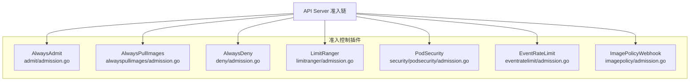
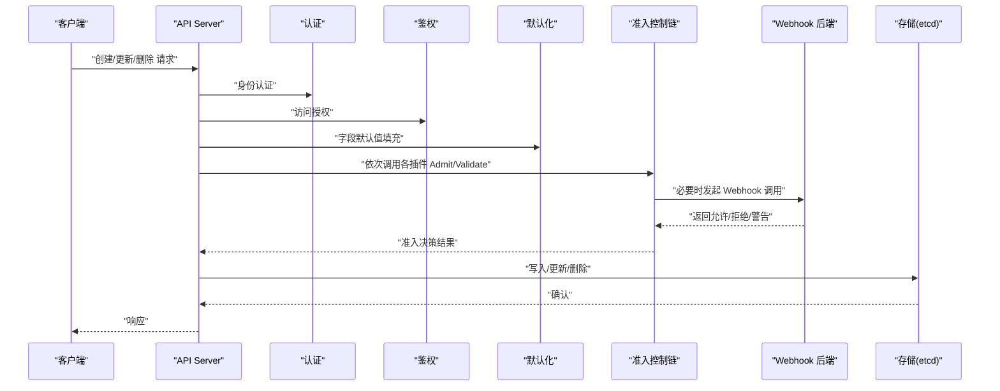
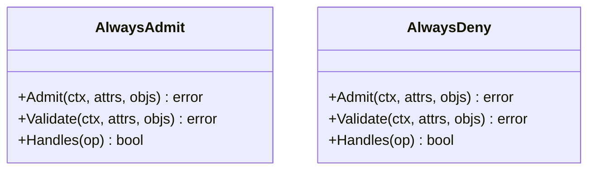
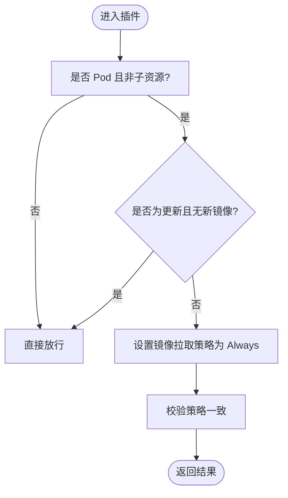
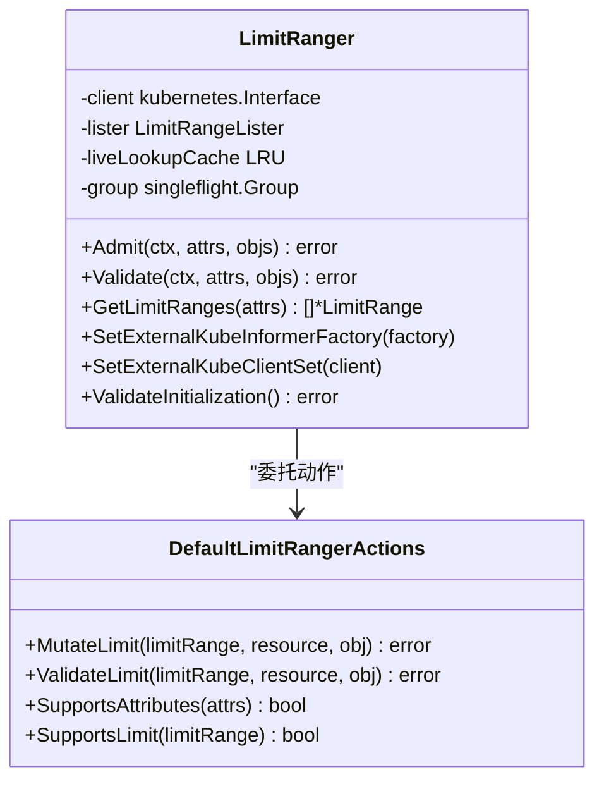
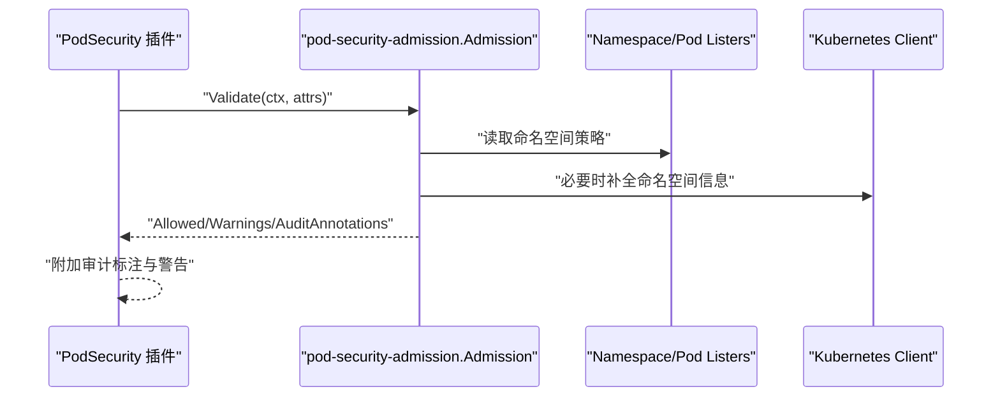
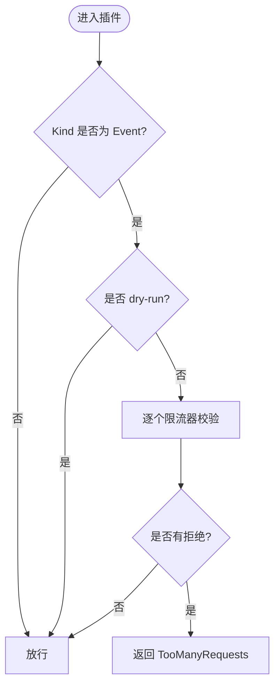
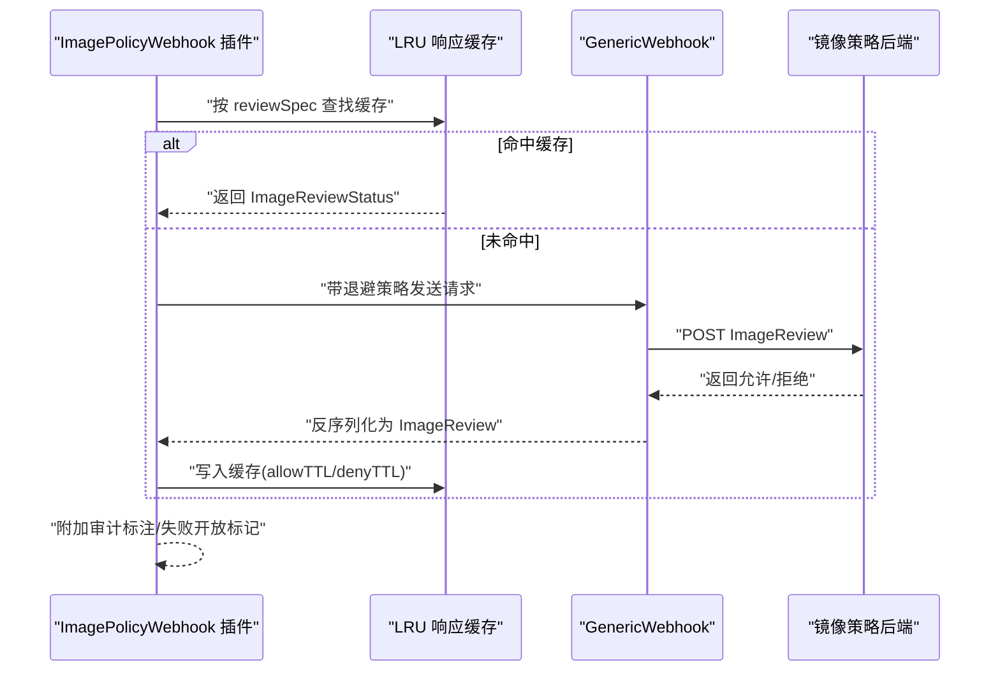
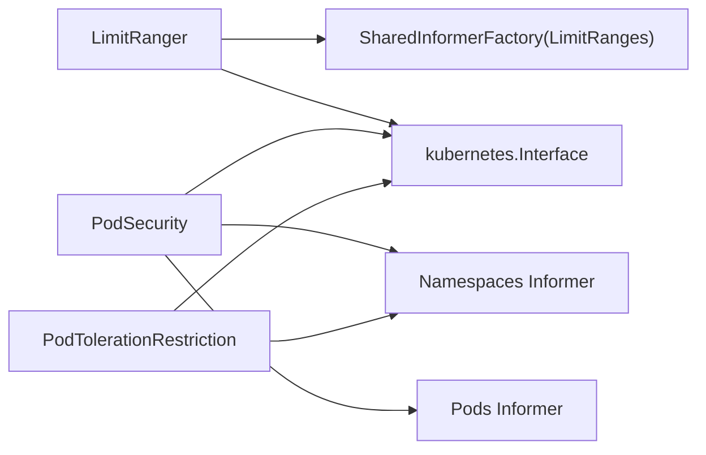

# 准入控制插件

<cite>
**本文引用的文件**   
- [admission.go](file://plugin/pkg/admission/admit/admission.go)
- [admission.go](file://plugin/pkg/admission/alwayspullimages/admission.go)
- [admission.go](file://plugin/pkg/admission/deny/admission.go)
- [admission.go](file://plugin/pkg/admission/limitranger/admission.go)
- [admission_test.go](file://plugin/pkg/admission/resourcequota/admission_test.go)
- [admission.go](file://plugin/pkg/admission/security/podsecurity/admission.go)
- [admission.go](file://plugin/pkg/admission/eventratelimit/admission.go)
- [admission.go](file://plugin/pkg/admission/imagepolicy/admission.go)
</cite>

## 目录
1. [简介](#简介)
2. [项目结构](#项目结构)
3. [核心组件](#核心组件)
4. [架构总览](#架构总览)
5. [详细组件分析](#详细组件分析)
6. [依赖关系分析](#依赖关系分析)
7. [性能考虑](#性能考虑)
8. [故障排查指南](#故障排查指南)
9. [结论](#结论)
10. [附录](#附录)

## 简介
本文件面向 Kubernetes 准入控制（Admission Control）插件的开发者与运维人员，系统性阐述：
- 准入控制的执行流程与生命周期
- Mutating Webhook 与 Validating Webhook 的开发框架与实现模式
- Webhook 配置与管理（超时、重试、错误处理）
- 自定义准入控制插件开发指南（注册、配置加载、测试策略）
- 内置插件工作原理与配置选项
- 性能优化、调试技巧与故障排查方法
- 完整代码示例与部署配置（以源码路径引用形式提供）

## 项目结构
Kubernetes 中内置的准入控制插件位于 plugin/pkg/admission 下，每个插件通常包含以下要素：
- 插件名常量与 Register 函数，用于向 apiserver 的 admission.Plugins 注册
- 实现 admission.Interface（或 MutationInterface/ValidationInterface）
- 可选的配置加载逻辑与外部依赖注入（Informer、ClientSet）
- 针对特定资源与操作的过滤与处理逻辑

图表来源
- [admission.go:1-66](file://plugin/pkg/admission/admit/admission.go#L1-L66)
- [admission.go:1-179](file://plugin/pkg/admission/alwayspullimages/admission.go#L1-L179)
- [admission.go:1-68](file://plugin/pkg/admission/deny/admission.go#L1-L68)
- [admission.go:1-711](file://plugin/pkg/admission/limitranger/admission.go#L1-L711)
- [admission.go:1-300](file://plugin/pkg/admission/security/podsecurity/admission.go#L1-L300)
- [admission.go:1-113](file://plugin/pkg/admission/eventratelimit/admission.go#L1-L113)
- [admission.go:1-292](file://plugin/pkg/admission/imagepolicy/admission.go#L1-L292)

章节来源
- [admission.go:1-66](file://plugin/pkg/admission/admit/admission.go#L1-L66)
- [admission.go:1-179](file://plugin/pkg/admission/alwayspullimages/admission.go#L1-L179)
- [admission.go:1-68](file://plugin/pkg/admission/deny/admission.go#L1-L68)
- [admission.go:1-711](file://plugin/pkg/admission/limitranger/admission.go#L1-L711)
- [admission.go:1-300](file://plugin/pkg/admission/security/podsecurity/admission.go#L1-L300)
- [admission.go:1-113](file://plugin/pkg/admission/eventratelimit/admission.go#L1-L113)
- [admission.go:1-292](file://plugin/pkg/admission/imagepolicy/admission.go#L1-L292)

## 核心组件
- 插件注册机制：每个插件通过 Register(plugins *admission.Plugins) 将自身注册到 apiserver 的准入链。
- 接口契约：
  - admission.Interface：通用入口
  - admission.MutationInterface：允许修改对象（Mutating）
  - admission.ValidationInterface：仅校验（Validating）
- 生命周期钩子：
  - SetExternalKubeInformerFactory/SetExternalKubeClientSet：注入 Informer 与 Client
  - ValidateInitialization：初始化完成后的自检
  - WaitForReady：在依赖未就绪时拒绝请求，避免不一致状态

章节来源
- [admission.go:87-108](file://plugin/pkg/admission/limitranger/admission.go#L87-L108)
- [admission.go:117-184](file://plugin/pkg/admission/security/podsecurity/admission.go#L117-L184)
- [admission.go:181-203](file://plugin/pkg/admission/podtolerationrestriction/admission.go#L181-L203)

## 架构总览
下图展示了 API Server 请求进入后，经过认证、鉴权、默认化、准入控制（含 Webhook），最终持久化的整体流程。

[此图为概念性流程图，不直接映射具体源码文件]

## 详细组件分析

### AlwaysAdmit 与 AlwaysDeny
- AlwaysAdmit：始终放行，已标记为弃用，主要用于兼容历史配置。
- AlwaysDeny：始终拒绝，已标记为弃用，可用于安全兜底或测试。

图表来源
- [admission.go:30-66](file://plugin/pkg/admission/admit/admission.go#L30-L66)
- [admission.go:32-68](file://plugin/pkg/admission/deny/admission.go#L32-L68)

章节来源
- [admission.go:1-66](file://plugin/pkg/admission/admit/admission.go#L1-L66)
- [admission.go:1-68](file://plugin/pkg/admission/deny/admission.go#L1-L68)

### AlwaysPullImages
- 功能：强制新 Pod 的所有容器镜像拉取策略为 Always，并校验更新场景下的策略一致性。
- 行为：
  - Admit：遍历容器与 ImageVolume，设置 PullPolicy=Always
  - Validate：确保所有容器的 imagePullPolicy 均为 Always
  - shouldIgnore：忽略非 Pod、子资源以及“无新镜像”的更新

图表来源
- [admission.go:60-171](file://plugin/pkg/admission/alwayspullimages/admission.go#L60-L171)

章节来源
- [admission.go:1-179](file://plugin/pkg/admission/alwayspullimages/admission.go#L1-L179)

### LimitRanger
- 功能：基于 LimitRange 对 Pod/PVC 的资源请求/限制进行默认值填充与约束校验。
- 关键特性：
  - 支持 Pod 级别资源（受特性门控影响）
  - 使用 LRU 缓存与 singleflight 降低并发重复查询开销
  - 通过注解记录被修改的资源项，便于审计与排障
  - 支持 PVC 的存储配额最小/最大约束

图表来源
- [admission.go:61-118](file://plugin/pkg/admission/limitranger/admission.go#L61-L118)
- [admission.go:387-445](file://plugin/pkg/admission/limitranger/admission.go#L387-L445)

章节来源
- [admission.go:1-711](file://plugin/pkg/admission/limitranger/admission.go#L1-L711)

### PodSecurity（Pod 安全准入）
- 功能：根据命名空间策略（如 restricted、baseline、privileged）对 Pod 及相关控制器进行安全策略校验。
- 关键点：
  - 通过 external informer/client 获取 Namespace/Pod 信息
  - 委派给 pod-security-admission 库进行策略评估
  - 支持审计标注与告警提示
  - 支持版本兼容性检查（emulation version）

图表来源
- [admission.go:117-184](file://plugin/pkg/admission/security/podsecurity/admission.go#L117-L184)
- [admission.go:193-233](file://plugin/pkg/admission/security/podsecurity/admission.go#L193-L233)

章节来源
- [admission.go:1-300](file://plugin/pkg/admission/security/podsecurity/admission.go#L1-L300)

### EventRateLimit（事件速率限制）
- 功能：对 Event 资源的创建/更新进行速率限制，防止事件风暴。
- 行为：
  - 仅作用于 Event 类型
  - 忽略 dry-run 请求
  - 聚合多个限流器拒绝原因，返回 TooManyRequests

图表来源
- [admission.go:85-112](file://plugin/pkg/admission/eventratelimit/admission.go#L85-L112)

章节来源
- [admission.go:1-113](file://plugin/pkg/admission/eventratelimit/admission.go#L1-L113)

### ImagePolicyWebhook（镜像策略 Webhook）
- 功能：将镜像合法性判定委托给外部 webhook 服务，支持缓存与失败回退策略。
- 关键点：
  - 支持 allowTTL/denyTTL 缓存策略
  - 支持 retryBackoff 指数退避
  - defaultAllow 决定后端不可用时是否放行
  - 支持审计标注与失败开放标记

图表来源
- [admission.go:178-217](file://plugin/pkg/admission/imagepolicy/admission.go#L178-L217)
- [admission.go:256-291](file://plugin/pkg/admission/imagepolicy/admission.go#L256-L291)

章节来源
- [admission.go:1-292](file://plugin/pkg/admission/imagepolicy/admission.go#L1-L292)

### PodTolerationRestriction（容忍度白名单与默认合并）
- 功能：
  - 从命名空间注解或集群配置加载默认容忍度，并在创建时合并到 Pod
  - 校验合并后的容忍度是否在白名单范围内
- 关键点：
  - 等待就绪后再处理请求
  - 非 BestEffort QoS 自动添加内存压力容忍度
  - 支持命名空间级与集群级双配置源

章节来源
- [admission.go:75-151](file://plugin/pkg/admission/podtolerationrestriction/admission.go#L75-L151)
- [admission.go:181-203](file://plugin/pkg/admission/podtolerationrestriction/admission.go#L181-L203)
- [admission.go:240-276](file://plugin/pkg/admission/podtolerationrestriction/admission.go#L240-L276)

## 依赖关系分析
- 插件对外部依赖的注入方式：
  - WantsExternalKubeInformerFactory：注入 SharedInformerFactory，用于监听相关资源
  - WantsExternalKubeClientSet：注入 kubernetes.Interface，用于实时查询
  - ValidateInitialization：校验依赖是否完备
- 典型依赖：
  - LimitRanger：依赖 LimitRange Informer/Lister 与 Client
  - PodSecurity：依赖 Namespace/Pod Listers 与 Client
  - PodTolerationRestriction：依赖 Namespace Listers 与 Client

图表来源
- [admission.go:87-108](file://plugin/pkg/admission/limitranger/admission.go#L87-L108)
- [admission.go:117-130](file://plugin/pkg/admission/security/podsecurity/admission.go#L117-L130)
- [admission.go:181-192](file://plugin/pkg/admission/podtolerationrestriction/admission.go#L181-L192)

章节来源
- [admission.go:1-118](file://plugin/pkg/admission/limitranger/admission.go#L1-L118)
- [admission.go:117-184](file://plugin/pkg/admission/security/podsecurity/admission.go#L117-L184)
- [admission.go:181-203](file://plugin/pkg/admission/podtolerationrestriction/admission.go#L181-L203)

## 性能考虑
- 缓存与去重：
  - LimitRanger 使用 LRU 缓存与 singleflight 减少并发重复查询
  - ImagePolicyWebhook 使用 LRUExpireCache 缓存 Webhook 响应，按 allow/deny TTL 过期
- 短路径优化：
  - AlwaysAdmit/AlwaysDeny 无 IO，适合快速路径
  - AlwaysPullImages 仅遍历容器列表，复杂度 O(n)
- 条件跳过：
  - 多数插件会忽略子资源与非目标资源，减少不必要计算
- 建议：
  - 合理设置缓存大小与 TTL
  - 对高延迟后端启用指数退避与熔断
  - 使用 dry-run 预检，避免不必要的状态变更

章节来源
- [admission.go:158-211](file://plugin/pkg/admission/limitranger/admission.go#L158-L211)
- [admission.go:178-217](file://plugin/pkg/admission/imagepolicy/admission.go#L178-L217)

## 故障排查指南
- 常见错误与定位：
  - 依赖未就绪：插件返回“not yet ready”，需检查 Informer 同步状态
  - 配置加载失败：插件构造阶段报错，检查配置文件格式与路径
  - Webhook 后端不可用：ImagePolicyWebhook 根据 defaultAllow 决定是否放行，并追加审计标注
  - 配额超限：ResourceQuota 相关用例显示超出配额时的拒绝与状态更新行为
- 诊断手段：
  - 查看审计日志中的插件标注（如 PodSecurity、ImagePolicyWebhook 的审计键前缀）
  - 观察插件返回的错误码与消息（Forbidden、TooManyRequests）
  - 使用 dry-run 验证策略与默认值生效情况

章节来源
- [admission.go:75-83](file://plugin/pkg/admission/podtolerationrestriction/admission.go#L75-L83)
- [admission.go:112-132](file://plugin/pkg/admission/imagepolicy/admission.go#L112-L132)
- [admission_test.go:185-259](file://plugin/pkg/admission/resourcequota/admission_test.go#L185-L259)

## 结论
Kubernetes 准入控制插件体系提供了灵活而强大的扩展点。通过清晰的接口契约、完善的依赖注入与丰富的内置插件，用户可构建符合自身治理与安全需求的准入策略。在生产环境中，应重点关注插件的性能与稳定性，结合缓存、退避与审计标注等手段提升可观测性与可靠性。

## 附录

### 自定义准入控制插件开发指南
- 插件注册
  - 定义 PluginName 常量
  - 实现 Register(plugins *admission.Plugins)，在回调中返回 admission.Interface
- 接口实现
  - 若需要修改对象，实现 admission.MutationInterface（Admit）
  - 若仅需校验，实现 admission.ValidationInterface（Validate）
  - 可选 Handles(operation) 指定支持的 Operation
- 配置加载
  - 从 io.Reader 解析 JSON/YAML 配置
  - 校验配置有效性，返回聚合错误
- 依赖注入
  - 实现 SetExternalKubeInformerFactory/SetExternalKubeClientSet
  - 在 ValidateInitialization 中校验依赖完整性
- 测试策略
  - 使用 fake client 与 informer indexer 模拟数据
  - 覆盖正常路径、边界条件与错误路径
  - 验证 dry-run 行为与副作用（如状态更新）

章节来源
- [admission.go:54-59](file://plugin/pkg/admission/limitranger/admission.go#L54-L59)
- [admission.go:62-66](file://plugin/pkg/admission/security/podsecurity/admission.go#L62-L66)
- [admission.go:36-53](file://plugin/pkg/admission/eventratelimit/admission.go#L36-L53)
- [admission.go:70-79](file://plugin/pkg/admission/imagepolicy/admission.go#L70-L79)
- [admission_test.go:102-127](file://plugin/pkg/admission/resourcequota/admission_test.go#L102-L127)

### Webhook 配置与管理（超时、重试、错误处理）
- 超时与重试
  - ImagePolicyWebhook 支持 retryBackoff 初始延迟与指数退避
  - 可通过 kubeconfig 配置 TLS、CA、客户端证书等
- 失败回退
  - defaultAllow=true 时，后端不可用则放行并追加审计标注
  - defaultAllow=false 时，后端不可用则拒绝
- 缓存策略
  - allowTTL/denyTTL 分别控制成功/失败的缓存时长
- 审计与告警
  - 通过 attributes.AddAnnotation 追加审计标注
  - 支持失败开放标记，便于追踪

章节来源
- [admission.go:219-291](file://plugin/pkg/admission/imagepolicy/admission.go#L219-L291)
- [admission.go:112-132](file://plugin/pkg/admission/imagepolicy/admission.go#L112-L132)
- [admission.go:178-217](file://plugin/pkg/admission/imagepolicy/admission.go#L178-L217)

### 内置插件工作原理与配置选项
- AlwaysPullImages
  - 作用：强制镜像拉取策略为 Always
  - 适用：Pod 创建/更新（忽略无新镜像的更新）
- LimitRanger
  - 作用：基于 LimitRange 填充默认资源与校验范围
  - 适用：Pod/PVC；支持 Pod 级别资源（特性门控）
- PodSecurity
  - 作用：依据命名空间策略校验 Pod 安全性
  - 适用：Pod 及多种控制器（通过 PodSpecExtractor）
- EventRateLimit
  - 作用：限制 Event 资源速率
  - 适用：Event 创建/更新（忽略 dry-run）
- ImagePolicyWebhook
  - 作用：镜像策略由外部 webhook 决定
  - 适用：Pod（含 ephemeralcontainers）

章节来源
- [admission.go:60-171](file://plugin/pkg/admission/alwayspullimages/admission.go#L60-L171)
- [admission.go:110-156](file://plugin/pkg/admission/limitranger/admission.go#L110-L156)
- [admission.go:193-233](file://plugin/pkg/admission/security/podsecurity/admission.go#L193-L233)
- [admission.go:85-112](file://plugin/pkg/admission/eventratelimit/admission.go#L85-L112)
- [admission.go:134-176](file://plugin/pkg/admission/imagepolicy/admission.go#L134-L176)

### 完整代码示例与部署配置（源码路径）
- 插件注册示例
  - [Register 示例:54-59](file://plugin/pkg/admission/limitranger/admission.go#L54-L59)
  - [Register 示例:62-66](file://plugin/pkg/admission/security/podsecurity/admission.go#L62-L66)
  - [Register 示例:36-53](file://plugin/pkg/admission/eventratelimit/admission.go#L36-L53)
  - [Register 示例:70-79](file://plugin/pkg/admission/imagepolicy/admission.go#L70-L79)
- 依赖注入与初始化
  - [LimitRanger 注入与校验:87-108](file://plugin/pkg/admission/limitranger/admission.go#L87-L108)
  - [PodSecurity 注入与校验:117-184](file://plugin/pkg/admission/security/podsecurity/admission.go#L117-L184)
  - [PodTolerationRestriction 注入与校验:181-203](file://plugin/pkg/admission/podtolerationrestriction/admission.go#L181-L203)
- Webhook 配置与调用
  - [ImagePolicyWebhook 配置加载:256-291](file://plugin/pkg/admission/imagepolicy/admission.go#L256-L291)
  - [ImagePolicyWebhook 调用与缓存:178-217](file://plugin/pkg/admission/imagepolicy/admission.go#L178-L217)
- 测试用例参考
  - [ResourceQuota 测试:185-259](file://plugin/pkg/admission/resourcequota/admission_test.go#L185-L259)
  - [ResourceQuota 测试:261-307](file://plugin/pkg/admission/resourcequota/admission_test.go#L261-L307)
  - [ResourceQuota 测试:309-403](file://plugin/pkg/admission/resourcequota/admission_test.go#L309-L403)