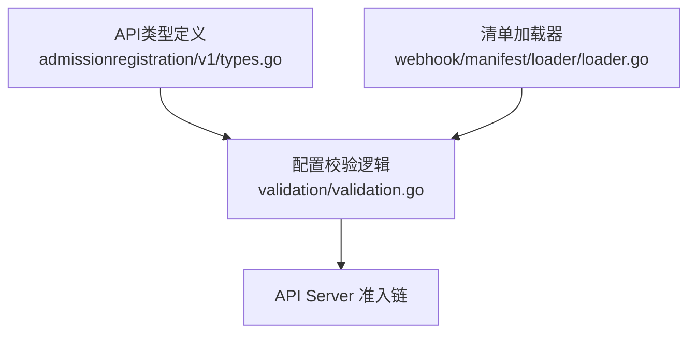
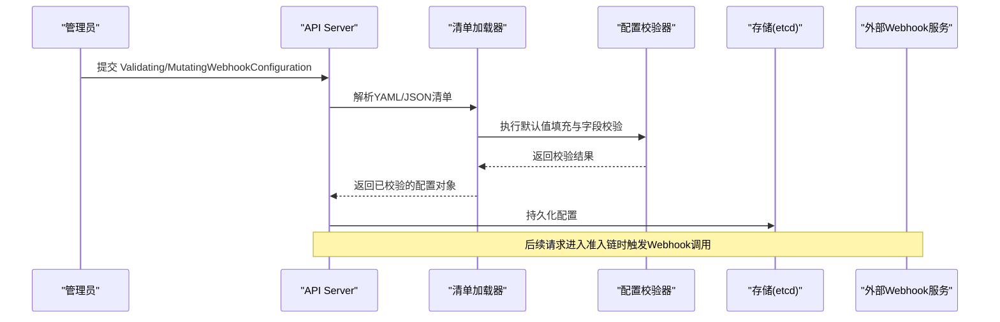
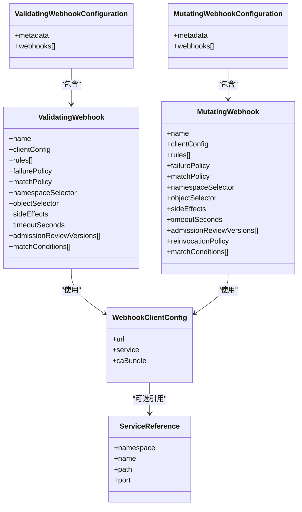
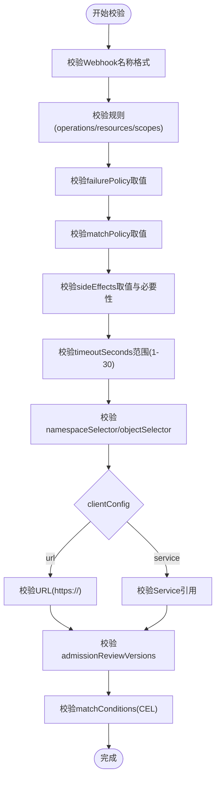
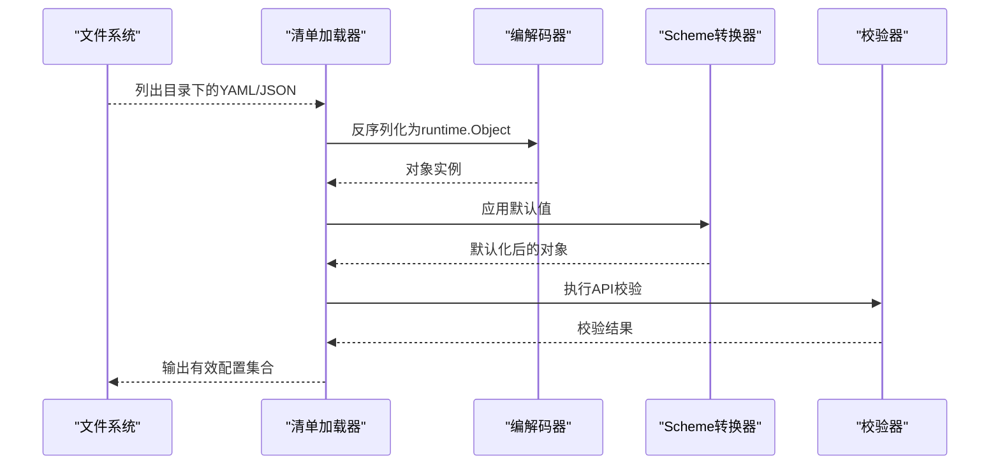
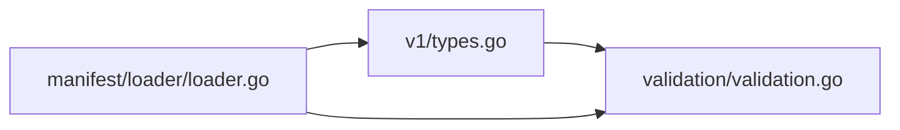

# 配置与管理

<cite>
**本文引用的文件**   
- [staging/src/k8s.io/api/admissionregistration/v1/types.go](file://staging/src/k8s.io/api/admissionregistration/v1/types.go)
- [pkg/apis/admissionregistration/validation/validation.go](file://pkg/apis/admissionregistration/validation/validation.go)
- [pkg/admission/plugin/webhook/manifest/loader/loader.go](file://pkg/admission/plugin/webhook/manifest/loader/loader.go)
</cite>

## 目录
1. [简介](#简介)
2. [项目结构](#项目结构)
3. [核心组件](#核心组件)
4. [架构总览](#架构总览)
5. [详细组件分析](#详细组件分析)
6. [依赖关系分析](#依赖关系分析)
7. [性能与超时](#性能与超时)
8. [安全与访问控制](#安全与访问控制)
9. [配置验证工具与最佳实践](#配置验证工具与最佳实践)
10. [热更新与回滚策略](#热更新与回滚策略)
11. [故障排查指南](#故障排查指南)
12. [结论](#结论)

## 简介
本文件面向Kubernetes准入控制的Webhook配置管理，聚焦以下目标：
- 详细说明 ValidatingWebhookConfiguration 与 MutatingWebhookConfiguration 的API定义与配置语法。
- 说明集群级配置方法与命名空间级覆盖机制。
- 详解Webhook的超时设置、失败处理策略（重试与忽略/拒绝）。
- 提供安全配置选项（证书、TLS、访问控制）与最佳实践。
- 给出配置验证工具与变更热更新、回滚策略建议。

## 项目结构
围绕准入Webhook配置的核心代码主要分布在：
- API类型定义：admissionregistration v1 包中的 Webhook 相关类型。
- 校验逻辑：admissionregistration 包的 validation 子包。
- 清单加载与默认值填充：kube-apiserver 侧的 webhook manifest loader。

**图表来源**
- [staging/src/k8s.io/api/admissionregistration/v1/types.go:729-790](file://staging/src/k8s.io/api/admissionregistration/v1/types.go#L729-L790)
- [pkg/apis/admissionregistration/validation/validation.go:218-257](file://pkg/apis/admissionregistration/validation/validation.go#L218-L257)
- [pkg/admission/plugin/webhook/manifest/loader/loader.go:50-76](file://pkg/admission/plugin/webhook/manifest/loader/loader.go#L50-L76)

**章节来源**
- [staging/src/k8s.io/api/admissionregistration/v1/types.go:729-790](file://staging/src/k8s.io/api/admissionregistration/v1/types.go#L729-L790)
- [pkg/apis/admissionregistration/validation/validation.go:218-257](file://pkg/apis/admissionregistration/validation/validation.go#L218-L257)
- [pkg/admission/plugin/webhook/manifest/loader/loader.go:50-76](file://pkg/admission/plugin/webhook/manifest/loader/loader.go#L50-L76)

## 核心组件
- ValidatingWebhookConfiguration：声明一组只读校验Webhook及其匹配规则、失败策略、超时等。
- MutatingWebhookConfiguration：声明一组可修改对象的Webhook，支持重入策略。
- WebhookClientConfig：Webhook客户端连接配置，包含URL或Service引用及CA证书。
- RuleWithOperations：操作与资源匹配规则组合。
- MatchConditions：基于CEL的条件过滤。
- AdmissionReviewVersions：Webhook协议版本协商列表。

关键要点：
- Webhook为集群级对象，通过 namespaceSelector/objectSelector 实现“按命名空间”的细粒度匹配。
- 同一配置内每个Webhook名称必须唯一；不同配置间无全局唯一性约束。
- timeoutSeconds 限制在1~30秒之间，超出将被拒绝。
- failurePolicy 支持 Ignore/Fail，决定调用失败的处置方式。
- sideEffects 要求显式声明，推荐 None/NoneOnDryRun。
- admissionReviewVersions 需至少包含一个API服务器接受的版本。

**章节来源**
- [staging/src/k8s.io/api/admissionregistration/v1/types.go:729-790](file://staging/src/k8s.io/api/admissionregistration/v1/types.go#L729-L790)
- [staging/src/k8s.io/api/admissionregistration/v1/types.go:792-940](file://staging/src/k8s.io/api/admissionregistration/v1/types.go#L792-L940)
- [staging/src/k8s.io/api/admissionregistration/v1/types.go:942-1108](file://staging/src/k8s.io/api/admissionregistration/v1/types.go#L942-L1108)
- [staging/src/k8s.io/api/admissionregistration/v1/types.go:1481-1546](file://staging/src/k8s.io/api/admissionregistration/v1/types.go#L1481-L1546)
- [pkg/apis/admissionregistration/validation/validation.go:360-472](file://pkg/apis/admissionregistration/validation/validation.go#L360-L472)

## 架构总览
Webhook配置从清单到生效的整体流程如下：

**图表来源**
- [pkg/admission/plugin/webhook/manifest/loader/loader.go:50-76](file://pkg/admission/plugin/webhook/manifest/loader/loader.go#L50-L76)
- [pkg/apis/admissionregistration/validation/validation.go:218-257](file://pkg/apis/admissionregistration/validation/validation.go#L218-L257)

## 详细组件分析

### API类型与字段语义
- ValidatingWebhookConfiguration / MutatingWebhookConfiguration
  - webhooks[]：Webhook条目集合，name唯一性在单配置内保证。
  - rules[]：RuleWithOperations，指定API组/版本/资源/子资源与操作。
  - failurePolicy：Ignore/Fail。
  - matchPolicy：Exact/Equivalent。
  - namespaceSelector/objectSelector：标签选择器，用于按命名空间/对象筛选。
  - sideEffects：None/NoneOnDryRun（推荐），或Some/Unknown（受限制）。
  - timeoutSeconds：1~30秒。
  - admissionReviewVersions：至少包含一个被接受的版本。
  - matchConditions[]：CEL条件表达式，最多64条。
- MutatingWebhook 特有字段
  - reinvocationPolicy：Never/IfNeeded，控制是否在其他插件修改后再次调用。

**图表来源**
- [staging/src/k8s.io/api/admissionregistration/v1/types.go:729-790](file://staging/src/k8s.io/api/admissionregistration/v1/types.go#L729-L790)
- [staging/src/k8s.io/api/admissionregistration/v1/types.go:792-940](file://staging/src/k8s.io/api/admissionregistration/v1/types.go#L792-L940)
- [staging/src/k8s.io/api/admissionregistration/v1/types.go:942-1108](file://staging/src/k8s.io/api/admissionregistration/v1/types.go#L942-L1108)
- [staging/src/k8s.io/api/admissionregistration/v1/types.go:1481-1546](file://staging/src/k8s.io/api/admissionregistration/v1/types.go#L1481-L1546)

**章节来源**
- [staging/src/k8s.io/api/admissionregistration/v1/types.go:729-790](file://staging/src/k8s.io/api/admissionregistration/v1/types.go#L729-L790)
- [staging/src/k8s.io/api/admissionregistration/v1/types.go:792-940](file://staging/src/k8s.io/api/admissionregistration/v1/types.go#L792-L940)
- [staging/src/k8s.io/api/admissionregistration/v1/types.go:942-1108](file://staging/src/k8s.io/api/admissionregistration/v1/types.go#L942-L1108)
- [staging/src/k8s.io/api/admissionregistration/v1/types.go:1481-1546](file://staging/src/k8s.io/api/admissionregistration/v1/types.go#L1481-L1546)

### 配置校验与约束
- 必填项与取值范围
  - name 需为完全限定名。
  - clientConfig 必须二选一：url 或 service。
  - timeoutSeconds 必须在1~30秒。
  - admissionReviewVersions 非空且至少包含一个被接受版本。
  - sideEffects 必须显式指定，推荐 None/NoneOnDryRun。
  - operations 不能同时包含 * 与其他操作。
  - resources 中资源与子资源的通配符组合有严格限制。
- 更新时的兼容性检查
  - 若旧配置未声明副作用，新配置不得引入副作用。
  - 若旧配置仅包含特定AdmissionReview版本，新配置需兼容。
  - 名称唯一性与选择器合法性在更新时继续校验。

**图表来源**
- [pkg/apis/admissionregistration/validation/validation.go:360-472](file://pkg/apis/admissionregistration/validation/validation.go#L360-L472)
- [pkg/apis/admissionregistration/validation/validation.go:218-257](file://pkg/apis/admissionregistration/validation/validation.go#L218-L257)

**章节来源**
- [pkg/apis/admissionregistration/validation/validation.go:360-472](file://pkg/apis/admissionregistration/validation/validation.go#L360-L472)
- [pkg/apis/admissionregistration/validation/validation.go:218-257](file://pkg/apis/admissionregistration/validation/validation.go#L218-L257)

### 清单加载与默认值
- 支持从目录批量读取YAML/JSON清单，分别解析为Validating/Mutating类型。
- 对每个对象进行Scheme默认值填充与API层校验，错误将导致加载失败。
- 支持List资源批量处理，并保证确定性顺序（字母序）。

**图表来源**
- [pkg/admission/plugin/webhook/manifest/loader/loader.go:50-76](file://pkg/admission/plugin/webhook/manifest/loader/loader.go#L50-L76)
- [pkg/admission/plugin/webhook/manifest/loader/loader.go:128-166](file://pkg/admission/plugin/webhook/manifest/loader/loader.go#L128-L166)

**章节来源**
- [pkg/admission/plugin/webhook/manifest/loader/loader.go:50-76](file://pkg/admission/plugin/webhook/manifest/loader/loader.go#L50-L76)
- [pkg/admission/plugin/webhook/manifest/loader/loader.go:128-166](file://pkg/admission/plugin/webhook/manifest/loader/loader.go#L128-L166)

## 依赖关系分析
- API类型定义位于 staging 模块，供各组件共享。
- 校验逻辑位于 pkg/apis/admissionregistration/validation，依赖通用元数据校验、CEL编译环境、Webhook URL/Service校验工具。
- 清单加载器位于 pkg/admission/plugin/webhook/manifest/loader，注入API Server Scheme与内部类型转换，再委托通用staging loader完成遍历与解析。

**图表来源**
- [staging/src/k8s.io/api/admissionregistration/v1/types.go:729-790](file://staging/src/k8s.io/api/admissionregistration/v1/types.go#L729-L790)
- [pkg/apis/admissionregistration/validation/validation.go:218-257](file://pkg/apis/admissionregistration/validation/validation.go#L218-L257)
- [pkg/admission/plugin/webhook/manifest/loader/loader.go:50-76](file://pkg/admission/plugin/webhook/manifest/loader/loader.go#L50-L76)

**章节来源**
- [staging/src/k8s.io/api/admissionregistration/v1/types.go:729-790](file://staging/src/k8s.io/api/admissionregistration/v1/types.go#L729-L790)
- [pkg/apis/admissionregistration/validation/validation.go:218-257](file://pkg/apis/admissionregistration/validation/validation.go#L218-L257)
- [pkg/admission/plugin/webhook/manifest/loader/loader.go:50-76](file://pkg/admission/plugin/webhook/manifest/loader/loader.go#L50-L76)

## 性能与超时
- timeoutSeconds：单个Webhook的超时上限为30秒，建议根据业务复杂度合理设置，避免阻塞API Server。
- sideEffects：声明为None/NoneOnDryRun可降低干跑路径的额外开销与风险。
- matchConditions：CEL表达式数量上限为64，应控制表达式复杂度，避免高成本计算。
- reinvocationPolicy（Mutating）：IfNeeded会增加多次调用概率，需谨慎评估对整体延迟的影响。

[本节为通用指导，不直接分析具体文件]

## 安全与访问控制
- TLS与证书
  - Webhook通信必须使用HTTPS。
  - 可通过 service 引用自动发现端点，或通过 url 指定外部地址。
  - caBundle 用于校验服务端证书，若不指定则使用系统信任根。
- 访问控制
  - 使用 namespaceSelector/objectSelector 精确限定作用域，减少不必要调用。
  - 结合RBAC确保只有授权主体能创建/更新Webhook配置。
- 失败策略
  - failurePolicy=Fail：Webhook不可用时拒绝请求，适合强一致场景。
  - failurePolicy=Ignore：Webhook不可用时放行请求，适合容错优先场景。

**章节来源**
- [staging/src/k8s.io/api/admissionregistration/v1/types.go:1481-1546](file://staging/src/k8s.io/api/admissionregistration/v1/types.go#L1481-L1546)
- [pkg/apis/admissionregistration/validation/validation.go:360-472](file://pkg/apis/admissionregistration/validation/validation.go#L360-L472)

## 配置验证工具与最佳实践
- 清单加载与校验
  - 使用清单加载器对目录进行批量解析与校验，提前发现语法与语义错误。
- 常见校验错误
  - 缺少必填字段（如clientConfig、admissionReviewVersions）。
  - timeoutSeconds越界。
  - sideEffects未设置或不合法。
  - operations包含*与其他操作并存。
  - resources通配符冲突。
- 最佳实践
  - 明确声明sideEffects为None或NoneOnDryRun。
  - 使用Equivalent匹配策略以兼容多版本API。
  - 使用matchConditions精细化过滤，减少无效调用。
  - 为Webhook服务配置健康检查与限流，保障可用性。
  - 定期轮换证书并确保caBundle与当前证书链一致。

**章节来源**
- [pkg/admission/plugin/webhook/manifest/loader/loader.go:50-76](file://pkg/admission/plugin/webhook/manifest/loader/loader.go#L50-L76)
- [pkg/apis/admissionregistration/validation/validation.go:360-472](file://pkg/apis/admissionregistration/validation/validation.go#L360-L472)

## 热更新与回滚策略
- 热更新
  - 更新Webhook配置后，API Server会立即生效新的匹配与调用行为。
  - 更新时保留原有兼容性约束（如副作用、版本、选择器合法性）。
- 回滚策略
  - 建议在CI/CD中对配置进行预检与沙箱测试。
  - 采用渐进发布：先小范围命名空间启用，观察指标后再全量推广。
  - 保留历史版本清单，出现问题快速回退至上一稳定版本。

[本节为通用指导，不直接分析具体文件]

## 故障排查指南
- 常见问题定位
  - 确认clientConfig的url/service与caBundle配置正确。
  - 检查timeoutSeconds是否在允许范围内。
  - 核对admissionReviewVersions是否包含被接受的版本。
  - 查看failurePolicy是否符合预期行为。
  - 审查matchConditions与selector是否过于严格导致无命中。
- 日志与观测
  - 关注API Server日志中关于Webhook调用的错误信息。
  - 监控Webhook服务的可用性与响应时间。

**章节来源**
- [pkg/apis/admissionregistration/validation/validation.go:360-472](file://pkg/apis/admissionregistration/validation/validation.go#L360-L472)

## 结论
通过对API类型、校验逻辑与清单加载器的深入分析，可以系统化地设计、部署与维护Kubernetes准入Webhook配置。遵循本文档的最佳实践与安全建议，能够在保证集群稳定的前提下，灵活扩展准入能力。