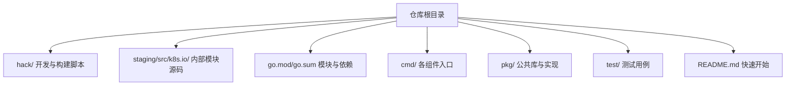
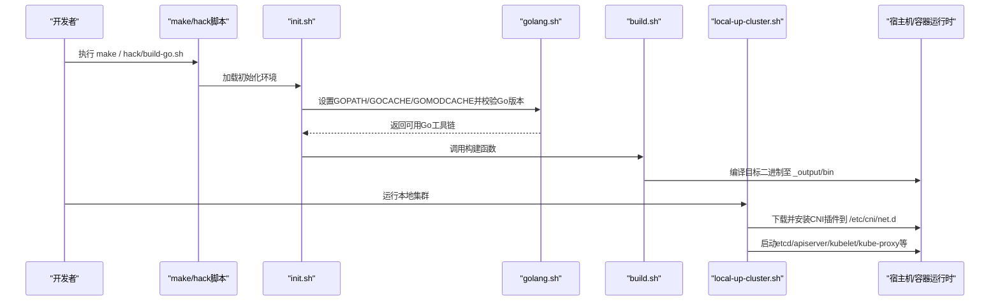
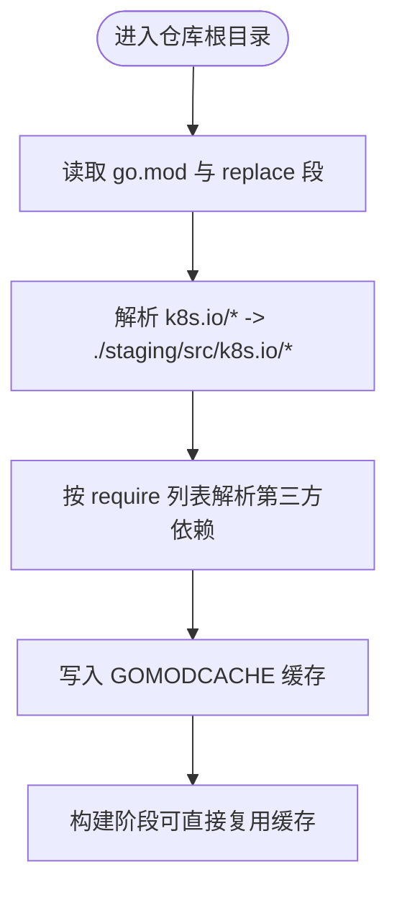
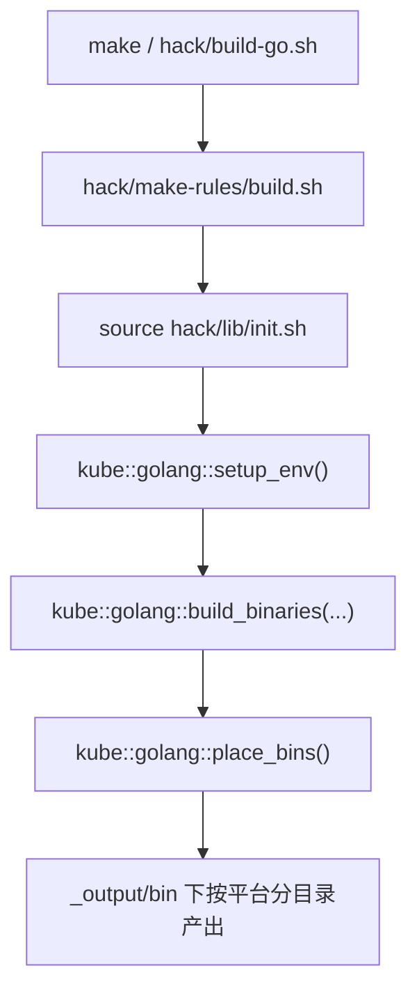
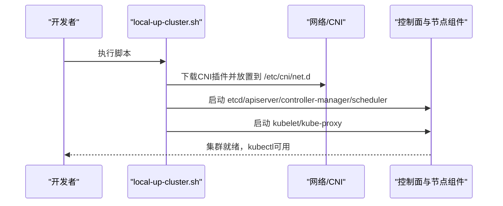
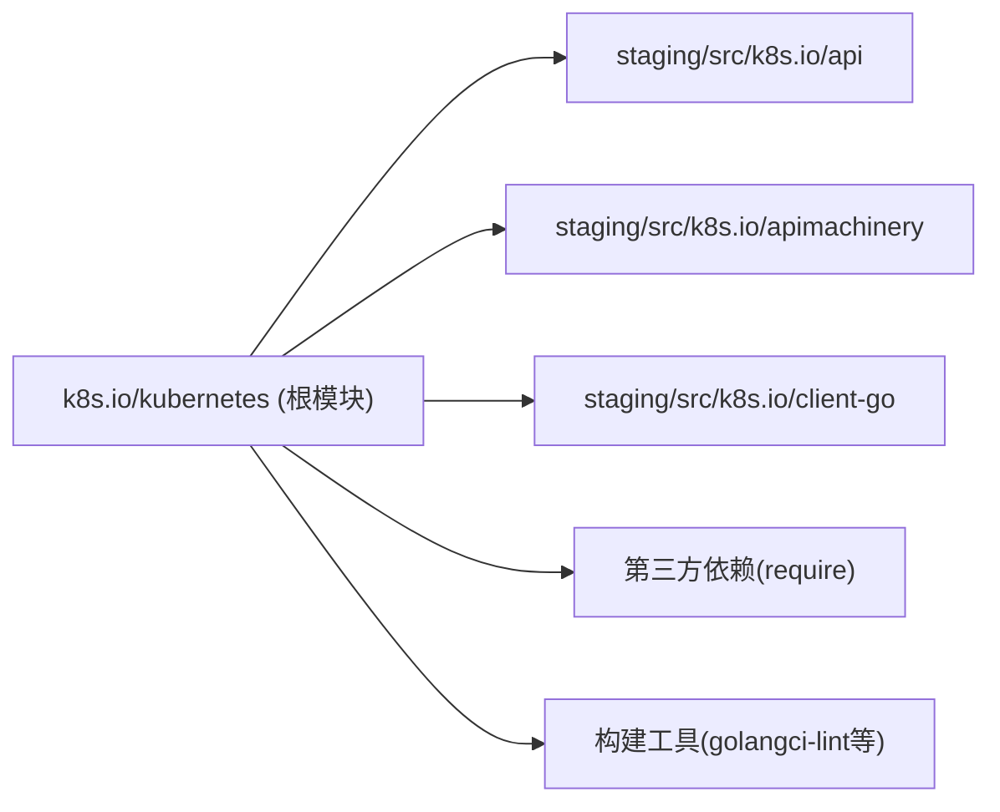

# CNI开发环境搭建

<cite>
**本文引用的文件**   
- [README.md](file://README.md)
- [go.mod](file://go.mod)
- [hack/lib/init.sh](file://hack/lib/init.sh)
- [hack/lib/golang.sh](file://hack/lib/golang.sh)
- [hack/make-rules/build.sh](file://hack/make-rules/build.sh)
- [hack/build-go.sh](file://hack/build-go.sh)
- [hack/test-go.sh](file://hack/test-go.sh)
- [hack/local-up-cluster.sh](file://hack/local-up-cluster.sh)
</cite>

## 目录
1. [简介](#简介)
2. [项目结构](#项目结构)
3. [核心组件](#核心组件)
4. [架构总览](#架构总览)
5. [详细组件分析](#详细组件分析)
6. [依赖分析](#依赖分析)
7. [性能考虑](#性能考虑)
8. [故障排查指南](#故障排查指南)
9. [结论](#结论)
10. [附录](#附录)

## 简介
本指南面向Kubernetes CNI插件开发者，提供从零开始的本地开发环境搭建与最佳实践。内容涵盖：
- Go语言版本要求与环境变量配置
- 模块依赖管理与go.mod说明
- 构建与测试工具链（Make、脚本、静态检查）
- 源码克隆与编译步骤
- 本地集群快速启动（用于CNI集成验证）
- 推荐的工作流与分支策略

## 项目结构
仓库采用多模块与staging子模块组织方式，根目录包含构建与开发脚本、API定义、组件实现与测试等。对CNI开发而言，重点关注以下路径：
- hack/*：构建、测试、本地集群启动与质量门禁脚本
- staging/src/k8s.io/*：内部模块的源码与替换映射
- go.mod/go.sum：模块声明、依赖与替换规则
- README.md：入门与快速构建指引

**章节来源**
- [README.md:1-101](file://README.md#L1-L101)

## 核心组件
本节聚焦于CNI开发所需的关键环境与构建能力：
- Go工具链与版本校验
- 构建系统入口与产物输出
- 本地集群启动（含CNI安装）
- 代码质量与静态检查

**章节来源**
- [hack/lib/golang.sh:521-629](file://hack/lib/golang.sh#L521-L629)
- [hack/make-rules/build.sh:17-30](file://hack/make-rules/build.sh#L17-L30)
- [hack/local-up-cluster.sh:65-70](file://hack/local-up-cluster.sh#L65-L70)

## 架构总览
下图展示了从“源码到可运行集群”的整体流程，包括Go环境准备、模块解析、构建产物生成以及本地集群启动（含CNI）。

**图表来源**
- [hack/lib/init.sh:28-56](file://hack/lib/init.sh#L28-L56)
- [hack/lib/golang.sh:594-629](file://hack/lib/golang.sh#L594-L629)
- [hack/make-rules/build.sh:23-30](file://hack/make-rules/build.sh#L23-L30)
- [hack/local-up-cluster.sh:65-70](file://hack/local-up-cluster.sh#L65-L70)

## 详细组件分析

### Go语言环境安装与配置
- 版本要求
  - 通过脚本内置逻辑强制最低Go版本，若未满足将提示安装指定版本或更高版本。
  - 支持GOTOOLCHAIN机制自动拉取并切换至所需版本；也可通过环境变量强制使用宿主Go。
- 关键环境变量
  - GOPATH：指向构建输出下的临时目录，避免污染用户全局环境
  - GOCACHE/GOMODCACHE：分别缓存构建产物与模块下载，提升重复构建速度
  - PATH：追加GOPATH/bin以便直接调用已安装的构建工具
  - GOBIN：显式unset以避免跨平台交叉编译时产物落盘位置不一致
- 平台与CGO
  - 脚本根据目标平台设置GOOS/GOARCH，并在需要时启用CGO与对应CC工具链
  - 支持多种服务器/节点/客户端平台组合，便于本地交叉编译与测试

**章节来源**
- [hack/lib/golang.sh:521-584](file://hack/lib/golang.sh#L521-L584)
- [hack/lib/golang.sh:594-629](file://hack/lib/golang.sh#L594-L629)
- [hack/lib/golang.sh:475-519](file://hack/lib/golang.sh#L475-L519)

### 依赖管理与go.mod
- 模块声明与版本
  - 根模块为k8s.io/kubernetes，声明了Go版本与大量第三方依赖
- 内部模块替换
  - 通过replace段将k8s.io/*系列包指向staging/src/k8s.io/*本地路径，保证主仓库与内部模块同步开发
- 依赖更新建议
  - 遵循仓库提供的脚本进行依赖锁定与vendor更新，避免手动编辑导致不一致

**图表来源**
- [go.mod:1-10](file://go.mod#L1-L10)
- [go.mod:225-259](file://go.mod#L225-L259)

**章节来源**
- [go.mod:1-10](file://go.mod#L1-L10)
- [go.mod:225-259](file://go.mod#L225-L259)

### 构建系统与编译选项
- 统一入口
  - 推荐使用make或hack/build-go.sh作为统一入口，二者最终均调用make all
- 构建流程
  - hack/make-rules/build.sh负责初始化环境、调用构建函数并将产物放置到输出目录
- 输出目录
  - 默认输出至 _output/local/bin/<os>/<arch>，同时创建THIS_PLATFORM_BIN软链接方便本地调试

**图表来源**
- [hack/build-go.sh:17-47](file://hack/build-go.sh#L17-L47)
- [hack/make-rules/build.sh:17-30](file://hack/make-rules/build.sh#L17-L30)
- [hack/lib/init.sh:28-56](file://hack/lib/init.sh#L28-L56)

**章节来源**
- [hack/build-go.sh:17-47](file://hack/build-go.sh#L17-L47)
- [hack/make-rules/build.sh:17-30](file://hack/make-rules/build.sh#L17-L30)
- [hack/lib/init.sh:28-56](file://hack/lib/init.sh#L28-L56)

### 测试与质量门禁
- 单元测试与e2e
  - 使用hack/test-go.sh或make test触发测试
- 静态检查与格式化
  - 仓库提供golangci-lint配置与相关verify脚本，建议在提交前运行
- 覆盖率
  - 构建系统支持在特定包上开启覆盖率采集

**章节来源**
- [hack/test-go.sh:17-40](file://hack/test-go.sh#L17-L40)

### 本地集群与CNI集成验证
- 一键启动
  - 使用hack/local-up-cluster.sh可在本机拉起etcd、apiserver、controller-manager、scheduler、kubelet、kube-proxy等
- CNI安装
  - 脚本默认会下载并安装CNI插件到/etc/cni/net.d，便于kubelet在Pod网络初始化时调用
- 常用参数
  - 可通过环境变量调整CNI版本、目标架构、DNS、端口、日志级别等

**图表来源**
- [hack/local-up-cluster.sh:65-70](file://hack/local-up-cluster.sh#L65-L70)

**章节来源**
- [hack/local-up-cluster.sh:65-70](file://hack/local-up-cluster.sh#L65-L70)

## 依赖分析
- 模块耦合
  - 根模块通过replace将k8s.io/*系列包指向staging源码，形成强内聚的内部模块体系
- 外部依赖
  - 大量网络、序列化、监控与测试框架依赖，均通过require声明并由GOMODCACHE管理
- 构建期依赖
  - 构建脚本依赖bash、sed、gcc（交叉编译场景）、containerd socket等系统资源

**图表来源**
- [go.mod:225-259](file://go.mod#L225-L259)

**章节来源**
- [go.mod:1-10](file://go.mod#L1-L10)
- [go.mod:225-259](file://go.mod#L225-L259)

## 性能考虑
- 缓存利用
  - 合理设置GOCACHE与GOMODCACHE路径，避免频繁网络请求与重复编译
- 并行构建
  - 在多核机器上适当提高并发度，注意内存占用（脚本中定义了并行构建内存阈值）
- 增量构建
  - 仅变更部分组件时，使用make WHAT=具体目标减少全量构建时间

[本节为通用指导，不直接分析具体文件]

## 故障排查指南
- Go版本不匹配
  - 现象：构建失败并提示最低版本要求
  - 处理：安装指定版本或允许GOTOOLCHAIN自动拉取
- CGO/交叉编译失败
  - 现象：找不到对应架构的gcc或无法启用CGO
  - 处理：安装相应交叉编译器并设置CC环境变量
- CNI插件不可用
  - 现象：Pod创建后无IP或网络不通
  - 处理：确认/etc/cni/net.d存在且包含有效配置文件；检查kubelet日志与CNI插件日志
- 端口冲突
  - 现象：apiserver或kubelet端口被占用
  - 处理：修改端口环境变量或释放占用进程

**章节来源**
- [hack/lib/golang.sh:521-584](file://hack/lib/golang.sh#L521-L584)
- [hack/lib/golang.sh:475-519](file://hack/lib/golang.sh#L475-L519)
- [hack/local-up-cluster.sh:65-70](file://hack/local-up-cluster.sh#L65-L70)

## 结论
通过本指南，你可以在本地快速搭建Kubernetes CNI插件的开发与验证环境：正确配置Go与模块缓存、理解go.mod与staging替换机制、使用make与脚本完成构建、借助local-up-cluster.sh快速拉起集群并安装CNI插件。结合静态检查与测试，可有效保障代码质量与迭代效率。

[本节为总结性内容，不直接分析具体文件]

## 附录

### 快速上手清单
- 安装Go并确保版本满足要求
- 克隆仓库并进入根目录
- 执行make或hack/build-go.sh完成构建
- 运行hack/local-up-cluster.sh启动本地集群（自动安装CNI）
- 使用kubectl验证集群与网络连通性

**章节来源**
- [README.md:41-59](file://README.md#L41-L59)
- [hack/build-go.sh:17-47](file://hack/build-go.sh#L17-L47)
- [hack/local-up-cluster.sh:65-70](file://hack/local-up-cluster.sh#L65-L70)

### 工作流与分支策略建议
- 分支模型
  - 基于功能/修复创建独立分支，定期同步上游主干
- 提交规范
  - 提交信息清晰描述变更动机与影响范围
  - 附带必要的测试与文档更新
- 质量门禁
  - 提交前运行静态检查与测试，确保CI绿灯
- 评审与合并
  - 发起PR并邀请相关SIG成员评审，通过后合入主干

[本节为通用实践建议，不直接分析具体文件]