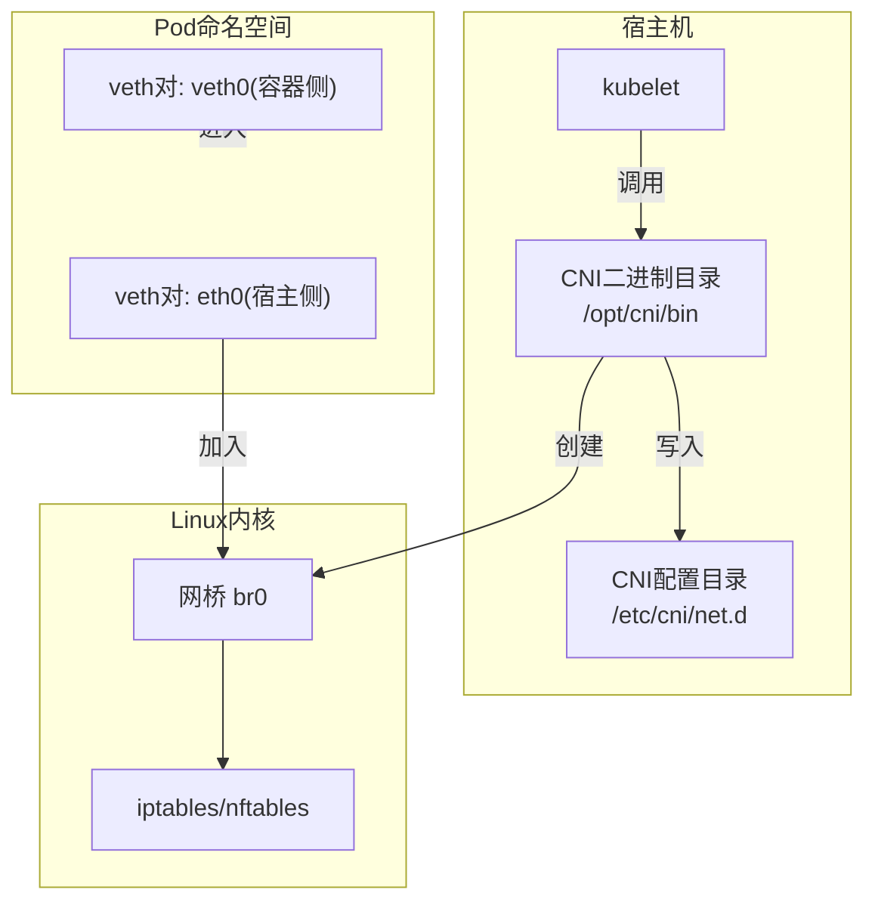
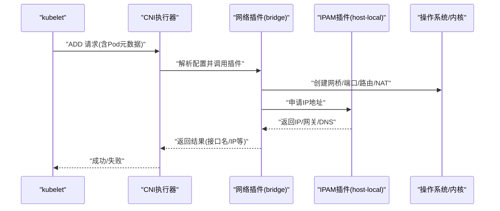
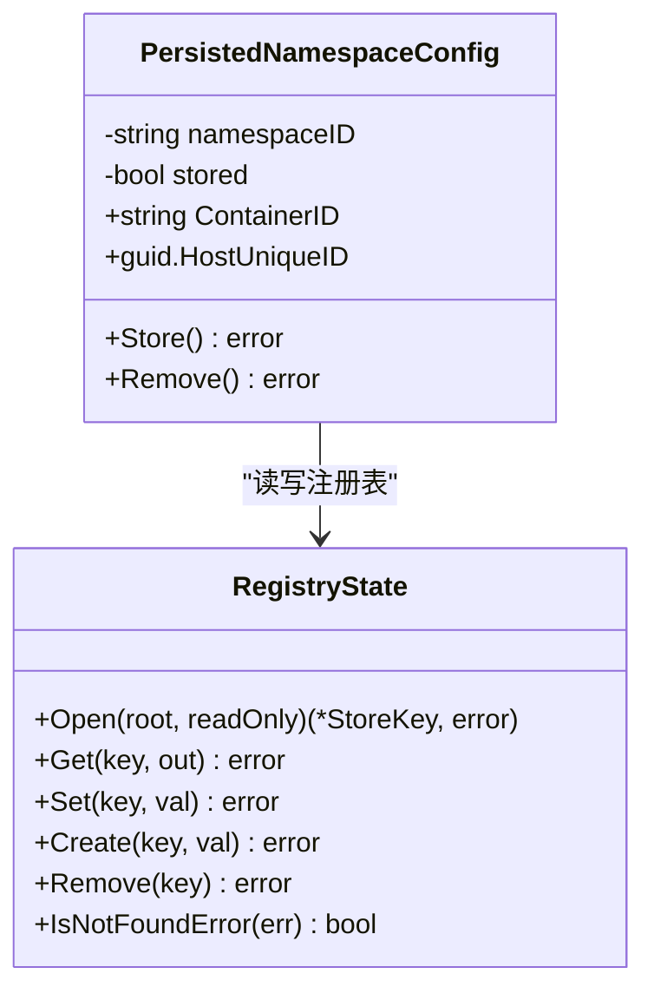
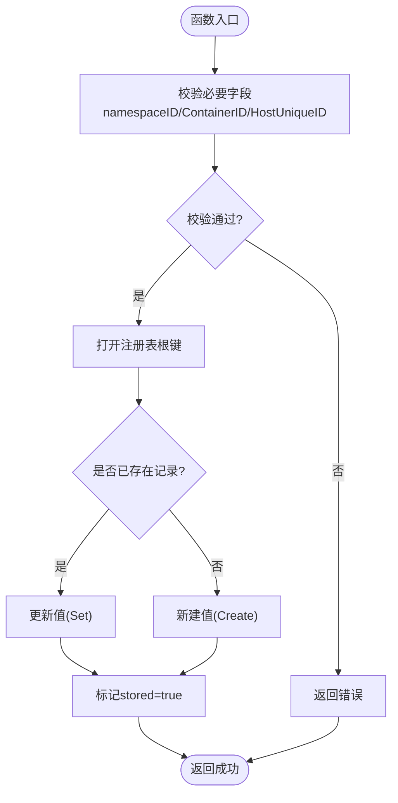
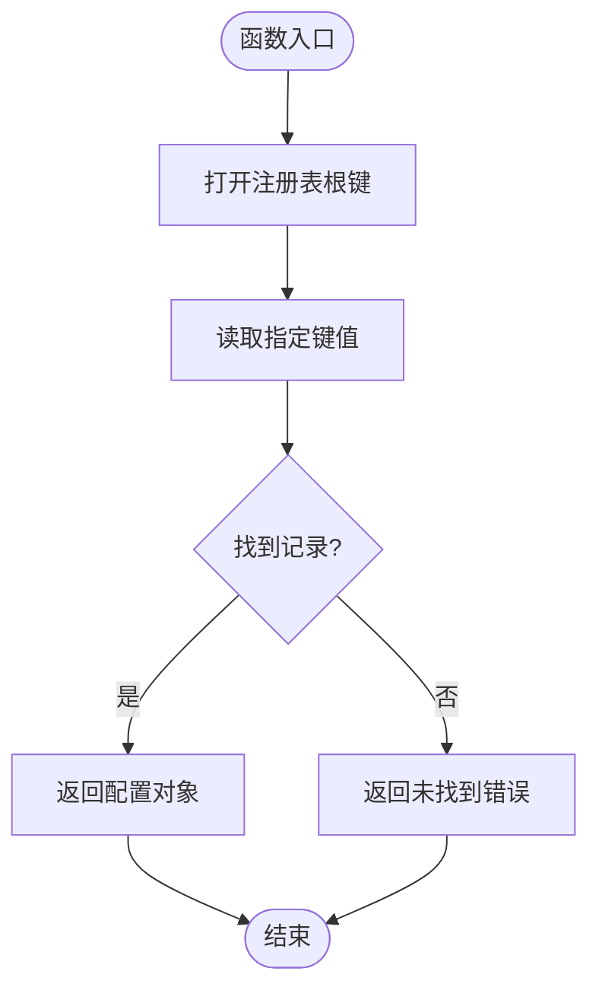
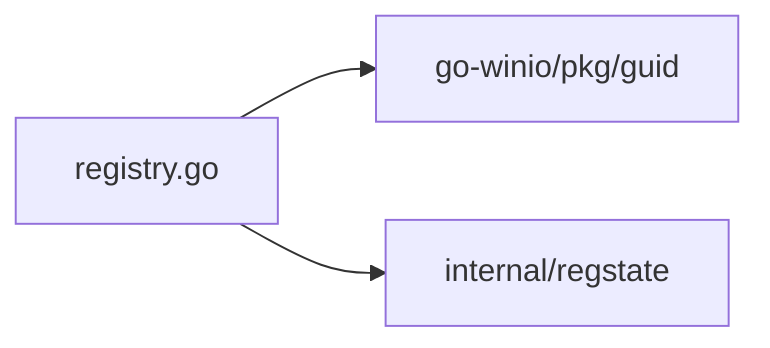

# CNI插件实现示例

<cite>
**本文引用的文件**   
- [doc.go](file://vendor/github.com/Microsoft/hnslib/internal/cni/doc.go)
- [registry.go](file://vendor/github.com/Microsoft/hnslib/internal/cni/registry.go)
</cite>

## 目录
1. [简介](#简介)
2. [项目结构](#项目结构)
3. [核心组件](#核心组件)
4. [架构总览](#架构总览)
5. [详细组件分析](#详细组件分析)
6. [依赖分析](#依赖分析)
7. [性能考虑](#性能考虑)
8. [故障排查指南](#故障排查指南)
9. [结论](#结论)
10. [附录](#附录)

## 简介
本文件面向希望从零到一掌握CNI插件开发的工程师，提供从简单到复杂的完整实现示例与最佳实践。内容覆盖：
- bridge网络插件：网桥创建、容器连接、流量转发配置
- overlay网络插件：隧道封装、跨节点通信、网络隔离
- host-local IPAM插件：IP地址池管理、租约机制
- IPv6支持：双栈网络配置与地址分配策略
- 错误处理、日志记录与性能优化技巧
- 插件配置文件编写指南与参数调优建议

说明：仓库中未包含标准CNI插件源码（如bridge、host-local等），但提供了Windows HNS CNI注册表持久化相关代码片段，可作为理解“状态持久化”的参考。

## 项目结构
本仓库为Kubernetes主工程，不包含CNI插件源码。本节仅给出概念性结构示意，帮助读者建立整体认知。

[此图为概念图，不直接映射具体源文件]

## 核心组件
- 网络插件（Network Plugin）：负责在宿主机上创建并配置网络资源（如网桥、veth、路由、防火墙规则等）。
- IPAM插件（IP Address Management）：负责为Pod分配和管理IP地址，维护地址池与租约。
- kubelet集成：kubelet通过CNI接口调用已安装的插件，完成Pod网络初始化与销毁。

本节为概念性概述，不涉及具体文件分析。

## 架构总览
下图展示典型bridge方案的数据面与控制面交互：kubelet触发CNI；CNI执行器加载配置并调用对应插件；插件创建网桥与veth，设置转发规则；IPAM负责地址分配与释放。

[此图为概念图，不直接映射具体源文件]

## 详细组件分析

### 组件A：Windows HNS CNI注册表持久化（示例）
该组件展示了如何在Windows环境下将CNI相关的命名空间配置持久化到系统注册表，便于进程重启后恢复状态。

图示来源
- [registry.go:1-113](file://vendor/github.com/Microsoft/hnslib/internal/cni/registry.go#L1-L113)

章节来源
- [registry.go:1-113](file://vendor/github.com/Microsoft/hnslib/internal/cni/registry.go#L1-L113)
- [doc.go:1-2](file://vendor/github.com/Microsoft/hnslib/internal/cni/doc.go#L1-L2)

#### 关键流程：保存与删除

图示来源
- [registry.go:56-86](file://vendor/github.com/Microsoft/hnslib/internal/cni/registry.go#L56-L86)

#### 关键流程：加载与移除

图示来源
- [registry.go:37-54](file://vendor/github.com/Microsoft/hnslib/internal/cni/registry.go#L37-L54)

## 依赖分析
- 平台限定：该模块仅在Windows构建标签下生效，避免在非Windows环境引入不必要的依赖。
- 外部依赖：使用Microsoft提供的GUID库与内部注册表状态库进行持久化操作。
- 耦合关系：PersistedNamespaceConfig与RegistryState强耦合，前者负责业务语义，后者负责底层存储。

图示来源
- [registry.go:1-15](file://vendor/github.com/Microsoft/hnslib/internal/cni/registry.go#L1-L15)

章节来源
- [registry.go:1-15](file://vendor/github.com/Microsoft/hnslib/internal/cni/registry.go#L1-L15)

## 性能考虑
- 减少系统调用：批量创建网桥与veth时合并系统调用，降低上下文切换开销。
- 并发控制：对同一网桥或地址池的操作加锁，避免竞态条件导致的重复创建或冲突。
- 缓存热点：缓存常用配置与路由条目，避免频繁重算。
- 日志级别：生产环境降低日志级别，仅保留关键事件与错误信息，减少I/O压力。

本节为通用指导，不涉及具体文件分析。

## 故障排查指南
- 常见错误定位
  - 注册表访问失败：检查权限与路径是否正确，确认是否存在未找到错误分支。
  - 字段缺失：确保namespaceID、ContainerID、HostUniqueID非空且格式正确。
  - 幂等性：重复Add时应识别已有资源并返回成功，避免重复创建。
- 调试建议
  - 增加结构化日志，记录输入参数、中间状态与返回值。
  - 在关键路径添加超时与重试逻辑，提升鲁棒性。
  - 使用e2e测试覆盖正常路径与异常路径，包括并发场景。

章节来源
- [registry.go:56-86](file://vendor/github.com/Microsoft/hnslib/internal/cni/registry.go#L56-L86)
- [registry.go:88-112](file://vendor/github.com/Microsoft/hnslib/internal/cni/registry.go#L88-L112)

## 结论
本文件基于仓库中的Windows HNS CNI注册表持久化代码，演示了状态持久化的基本模式与错误处理思路。对于完整的CNI插件实现（bridge、overlay、host-local IPAM、IPv6双栈等），建议参考官方CNI规范与社区插件源码，并结合本文给出的架构与最佳实践进行设计与开发。

## 附录

### 配置文件编写指南（概念性）
- 网络插件配置
  - 必填项：类型(type)、网桥名称(brName)、子网(ipMasq等可选)
  - 能力(capabilities)：声明带宽限制、DNS注入等能力
- IPAM插件配置
  - 地址池范围(rangeStart/rangeEnd)、网关(gateway)、DNS服务器列表
  - 租约清理策略与过期时间
- 双栈配置
  - 同时声明IPv4与IPv6子网，确保路由与NAT规则分别生效
  - 注意内核参数与内核模块兼容性

本节为概念性指导，不涉及具体文件分析。