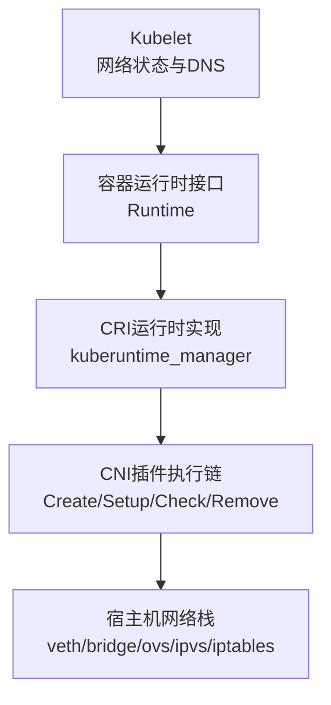
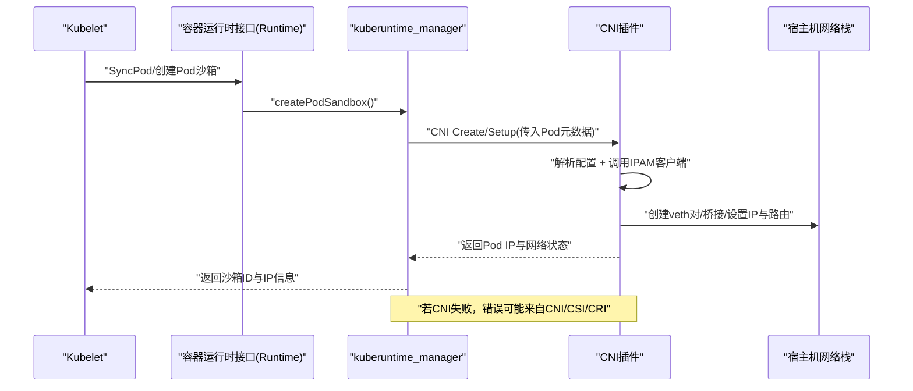
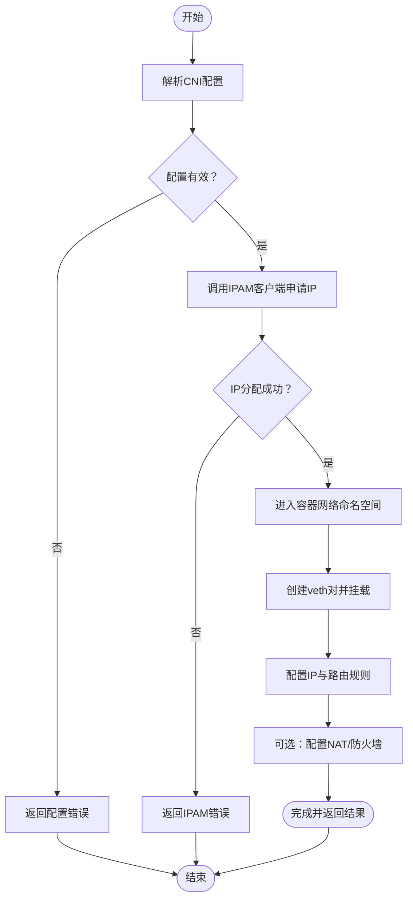
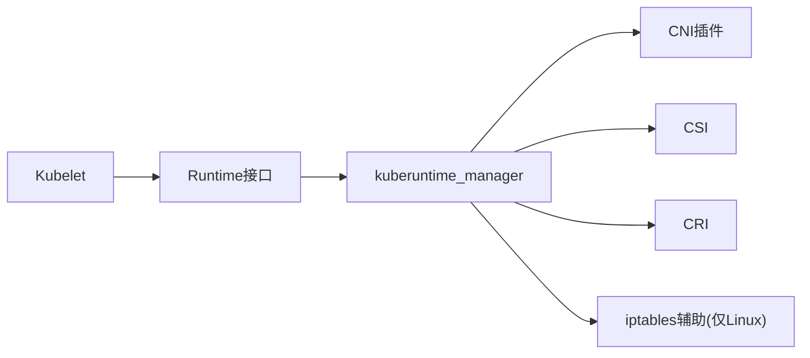

# CNI插件开发指南

<cite>
**本文引用的文件**   
- [kubelet_network.go](file://pkg/kubelet/kubelet_network.go)
- [kubelet_network_linux.go](file://pkg/kubelet/kubelet_network_linux.go)
- [runtime.go](file://pkg/kubelet/container/runtime.go)
- [kuberuntime_manager.go](file://pkg/kubelet/kuberuntime/kuberuntime_manager.go)
</cite>

## 目录
1. [简介](#简介)
2. [项目结构](#项目结构)
3. [核心组件](#核心组件)
4. [架构总览](#架构总览)
5. [详细组件分析](#详细组件分析)
6. [依赖关系分析](#依赖关系分析)
7. [性能考虑](#性能考虑)
8. [故障排查指南](#故障排查指南)
9. [结论](#结论)
10. [附录](#附录)

## 简介
本指南面向Kubernetes CNI插件开发者，聚焦于在Kubernetes生态中实现与集成CNI插件的端到端流程。内容涵盖：
- Go语言开发与依赖管理建议
- CNI插件核心组件（网络配置解析器、IPAM客户端、网络设置器）的职责与协作
- 从简单bridge到复杂overlay网络的实现路径
- 容器网络命名空间设置过程（veth对创建、IP分配、路由规则）
- 错误处理与日志记录最佳实践
- 单元测试与集成测试方法
- 性能优化技巧与调试工具使用
- 安全考虑与权限控制

## 项目结构
仓库中与CNI相关的关键代码位于kubelet侧，负责与容器运行时交互并触发CNI调用链。以下文件是理解CNI集成的关键入口：
- kubelet的网络状态更新与DNS获取
- Linux平台iptables辅助初始化
- 容器运行时接口定义（含UpdatePodCIDR等）
- kuberuntime管理器中的Pod沙箱创建流程（包含CNI错误来源说明）

图表来源
- [kubelet_network.go:28-51](file://pkg/kubelet/kubelet_network.go#L28-L51)
- [runtime.go:127-130](file://pkg/kubelet/container/runtime.go#L127-L130)
- [kuberuntime_manager.go:1625-1647](file://pkg/kubelet/kuberuntime/kuberuntime_manager.go#L1625-L1647)

章节来源
- [kubelet_network.go:28-51](file://pkg/kubelet/kubelet_network.go#L28-L51)
- [kubelet_network_linux.go:38-64](file://pkg/kubelet/kubelet_network_linux.go#L38-L64)
- [runtime.go:127-130](file://pkg/kubelet/container/runtime.go#L127-L130)
- [kuberuntime_manager.go:1625-1647](file://pkg/kubelet/kuberuntime/kuberuntime_manager.go#L1625-L1647)

## 核心组件
- 网络配置解析器
  - 职责：解析CNI配置文件（JSON/YAML），提取网络名称、子网、网关、插件参数等。
  - 关注点：兼容多版本CNI规范；支持动态参数注入（如pod元数据）。
- IPAM客户端
  - 职责：向IPAM服务申请/释放Pod IP地址，维护地址池与租约。
  - 关注点：并发安全、重试与退避、失败回滚、地址冲突检测。
- 网络设置器
  - 职责：在容器网络命名空间中执行具体网络操作（创建veth、绑定IP、添加路由、配置NAT/防火墙等）。
  - 关注点：幂等性、原子性、可观测性与错误分类。

这些组件通常以“插件”形式组合，由CNI运行时按顺序调用。

## 架构总览
下图展示了Kubelet通过容器运行时与CNI插件的交互流程，以及CNI内部组件的协作关系。

图表来源
- [kuberuntime_manager.go:1625-1647](file://pkg/kubelet/kuberuntime/kuberuntime_manager.go#L1625-L1647)
- [runtime.go:127-130](file://pkg/kubelet/container/runtime.go#L127-L130)

## 详细组件分析

### Kubelet网络状态与DNS
- Pod CIDR更新
  - 当节点Pod CIDR发生变化时，Kubelet通过运行时接口将新CIDR下发至底层运行时，以便后续CNI正确分配地址。
- DNS配置
  - Kubelet提供GetPodDNS能力，供运行时或上层组件为Pod生成DNS设置。

章节来源
- [kubelet_network.go:28-51](file://pkg/kubelet/kubelet_network.go#L28-L51)
- [kubelet_network.go:53-58](file://pkg/kubelet/kubelet_network.go#L53-L58)

### Linux平台iptables辅助初始化
- 目的：确保系统存在必要的iptables链与规则，用于保护本地回环流量等场景。
- 行为：探测可用iptables后端，创建提示链与防护规则，并在必要时监控变更进行同步。

章节来源
- [kubelet_network_linux.go:38-64](file://pkg/kubelet/kubelet_network_linux.go#L38-L64)
- [kubelet_network_linux.go:66-118](file://pkg/kubelet/kubelet_network_linux.go#L66-L118)

### 容器运行时接口（Runtime）
- UpdatePodCIDR
  - 用于将新的Pod CIDR传递给运行时，进而影响CNI的地址分配策略。
- 其他能力
  - 包括镜像拉取、容器生命周期管理、指标采集等，均与CNI协同工作。

章节来源
- [runtime.go:127-130](file://pkg/kubelet/container/runtime.go#L127-L130)

### kuberuntime管理器中的Pod沙箱创建
- 关键点
  - createPodSandbox过程中可能产生来自CNI、CSI或CRI的错误。
  - 若Pod已被删除，则不应视为真实错误。
  - 成功后会查询沙箱状态并确定Pod IP，再进入容器启动阶段。
- 错误处理
  - 记录事件与指标，避免重复日志噪音，区分用户错误与服务端错误。

章节来源
- [kuberuntime_manager.go:1625-1647](file://pkg/kubelet/kuberuntime/kuberuntime_manager.go#L1625-L1647)
- [kuberuntime_manager.go:1650-1683](file://pkg/kubelet/kuberuntime/kuberuntime_manager.go#L1650-L1683)

### CNI插件内部流程（概念图）
以下为典型CNI插件内部处理流程的概念示意，便于理解配置解析、IPAM与网络设置的协作。

[此图为概念流程，不直接映射具体源码文件]

## 依赖关系分析
- Kubelet通过容器运行时接口与CNI解耦，运行时负责实际调用CNI二进制或库。
- kuberuntime_manager在创建Pod沙箱时承担编排职责，协调CNI、CSI、CRI的错误来源与上报。
- Linux平台的iptables辅助逻辑独立于CNI，但会影响整体网络行为（例如本地回环访问保护）。

图表来源
- [runtime.go:127-130](file://pkg/kubelet/container/runtime.go#L127-L130)
- [kuberuntime_manager.go:1625-1647](file://pkg/kubelet/kuberuntime/kuberuntime_manager.go#L1625-L1647)
- [kubelet_network_linux.go:38-64](file://pkg/kubelet/kubelet_network_linux.go#L38-L64)

章节来源
- [runtime.go:127-130](file://pkg/kubelet/container/runtime.go#L127-L130)
- [kuberuntime_manager.go:1625-1647](file://pkg/kubelet/kuberuntime/kuberuntime_manager.go#L1625-L1647)
- [kubelet_network_linux.go:38-64](file://pkg/kubelet/kubelet_network_linux.go#L38-L64)

## 性能考虑
- 减少不必要的网络重配
  - 利用幂等设计，避免重复创建veth或重复写入路由。
- 批量与异步
  - 在Pod大规模调度时，尽量并行化非阻塞步骤（如日志收集、指标上报），但保持网络操作的串行一致性。
- 缓存与去抖
  - 对频繁读取的配置或状态进行合理缓存，并对变更进行去抖处理。
- 资源限制
  - 严格控制CNI进程的资源占用，避免影响宿主网络栈与其他组件。

[本节为通用指导，不直接分析具体文件]

## 故障排查指南
- 常见错误来源
  - CNI：配置错误、IPAM不可用、命名空间操作失败。
  - CSI：卷挂载失败导致Pod无法就绪。
  - CRI：运行时状态异常或API调用失败。
- 定位步骤
  - 检查Kubelet日志中关于“CreatePodSandbox”的错误信息与事件。
  - 确认CNI插件日志是否输出配置解析与IPAM调用细节。
  - 验证宿主机网络栈状态（veth、bridge、路由、iptables/nftables）。
- 快速恢复
  - 修正CNI配置后重启相关组件。
  - 清理残留网络对象（veth、网桥、路由）后重试。

章节来源
- [kuberuntime_manager.go:1625-1647](file://pkg/kubelet/kuberuntime/kuberuntime_manager.go#L1625-L1647)

## 结论
在Kubernetes中实现CNI插件需要深入理解Kubelet与容器运行时的协作方式，明确CNI内部组件的职责边界，并以幂等、可观测、可恢复为目标进行设计与实现。结合本指南的流程与最佳实践，可以构建从简单bridge到复杂overlay的高可用网络方案。

[本节为总结，不直接分析具体文件]

## 附录

### Go语言开发与依赖管理建议
- 使用Go Modules管理依赖，锁定第三方库版本，定期扫描漏洞。
- 遵循仓库内统一的构建与测试脚本，保证跨平台一致性。
- 引入静态分析与lint工具，提升代码质量与可读性。

[本节为通用指导，不直接分析具体文件]

### 单元测试与集成测试方法
- 单元测试
  - 针对配置解析器与IPAM客户端编写用例，覆盖边界条件与错误分支。
  - 使用mock模拟外部依赖（文件系统、网络命令、IPAM服务）。
- 集成测试
  - 在隔离环境中部署CNI插件，验证Pod创建、IP分配、连通性与故障恢复。
  - 使用e2e框架或自定义脚本驱动测试矩阵（不同内核、不同网络后端）。

[本节为通用指导，不直接分析具体文件]

### 调试工具使用指南
- 查看Kubelet与CNI插件日志，定位错误上下文。
- 使用iproute2工具（ip link、ip addr、ip route）检查网络对象。
- 使用iptables/nftables命令核对规则，或使用可视化前端辅助诊断。

[本节为通用指导，不直接分析具体文件]

### 安全考虑与权限控制
- 最小权限原则
  - CNI插件仅授予必要的系统调用与文件访问权限。
- 输入校验
  - 严格校验CNI配置与Pod元数据，防止注入攻击。
- 审计与告警
  - 记录关键操作与异常事件，建立告警机制。

[本节为通用指导，不直接分析具体文件]