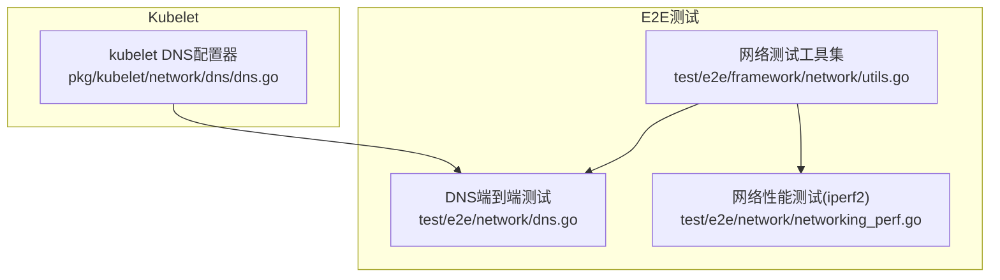
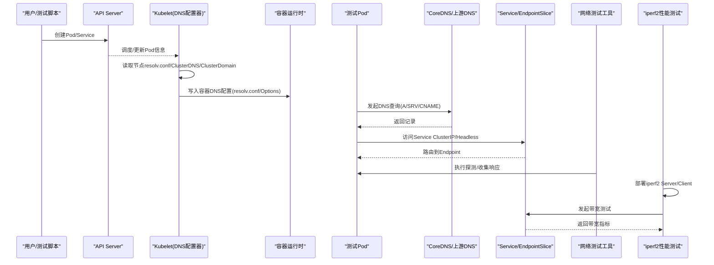
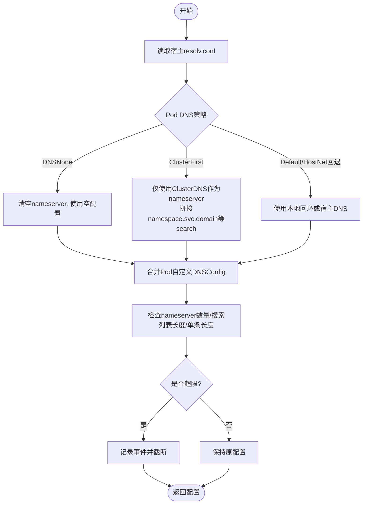
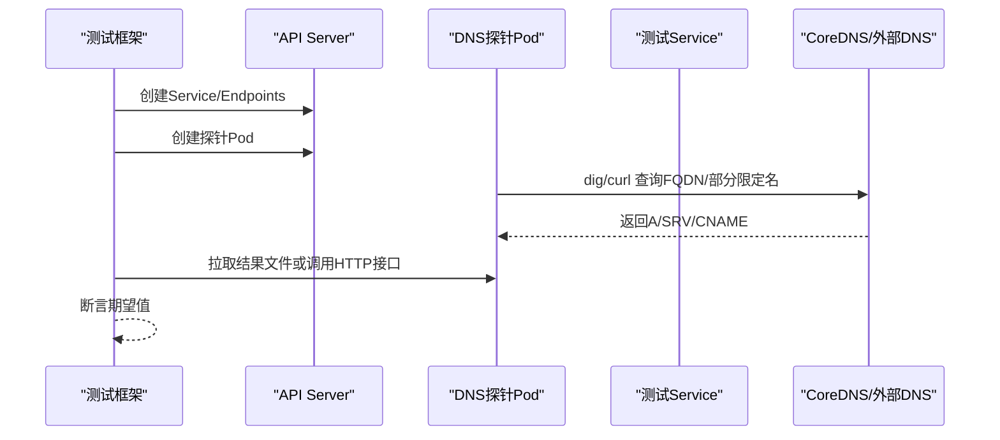
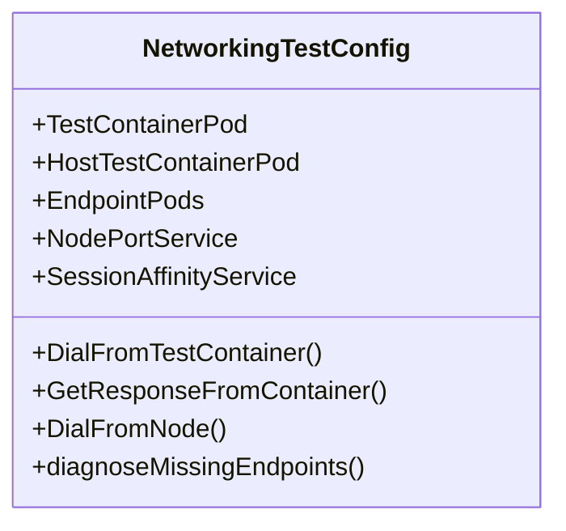
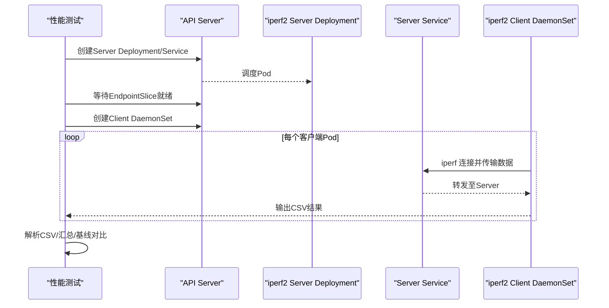
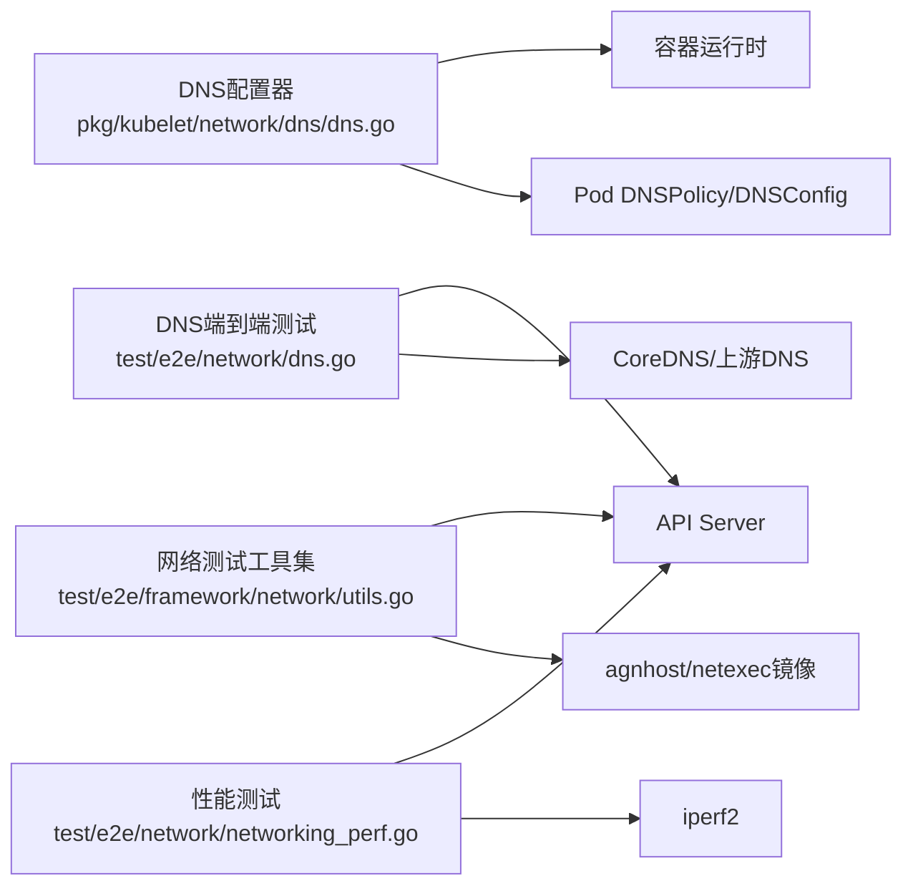

# CNI插件测试与调试

<cite>
**本文引用的文件**   
- [dns.go](file://pkg/kubelet/network/dns/dns.go)
- [dns.go](file://test/e2e/network/dns.go)
- [utils.go](file://test/e2e/framework/network/utils.go)
- [networking_perf.go](file://test/e2e/network/networking_perf.go)
</cite>

## 目录
1. [简介](#简介)
2. [项目结构](#项目结构)
3. [核心组件](#核心组件)
4. [架构总览](#架构总览)
5. [详细组件分析](#详细组件分析)
6. [依赖关系分析](#依赖关系分析)
7. [性能考量](#性能考量)
8. [故障排查指南](#故障排查指南)
9. [结论](#结论)
10. [附录](#附录)

## 简介
本文件面向CNI插件的测试与调试，结合仓库中已有的网络相关实现与端到端测试，系统化阐述：
- 单元测试编写方法（含mock对象、测试数据准备、断言验证）
- 集成测试搭建（测试集群配置、网络环境模拟、端到端用例设计）
- 性能测试方法（吞吐量、延迟、资源使用监控）
- 调试工具与技巧（日志分析、抓包、内核态调试）
- 常见问题诊断（网络连接问题、IP冲突、性能瓶颈定位）
- 自动化流水线与持续集成最佳实践

为避免泄露具体代码内容，文中以“源码路径+行号”的方式引用关键实现位置。

## 项目结构
围绕CNI插件测试与调试，仓库中与网络能力相关的核心位置包括：
- kubelet侧DNS解析配置生成逻辑：用于理解Pod DNS策略、search/ndots等选项如何注入容器运行时
- e2e网络测试套件：覆盖DNS解析、服务发现、连通性、性能压测等场景
- 网络测试框架工具：提供创建Service/Endpoint、执行探测命令、收集响应集合等通用能力

图表来源
- [dns.go:1-481](file://pkg/kubelet/network/dns/dns.go#L1-L481)
- [dns.go:1-813](file://test/e2e/network/dns.go#L1-L813)
- [utils.go:1-800](file://test/e2e/framework/network/utils.go#L1-L800)
- [networking_perf.go:1-288](file://test/e2e/network/networking_perf.go#L1-L288)

章节来源
- [dns.go:1-481](file://pkg/kubelet/network/dns/dns.go#L1-L481)
- [dns.go:1-813](file://test/e2e/network/dns.go#L1-L813)
- [utils.go:1-800](file://test/e2e/framework/network/utils.go#L1-L800)
- [networking_perf.go:1-288](file://test/e2e/network/networking_perf.go#L1-L288)

## 核心组件
- DNS配置器（kubelet侧）
  - 负责根据节点resolv.conf、ClusterDNS、ClusterDomain以及Pod的DNSPolicy/DNSConfig，生成容器的DNS配置，并做长度/数量限制校验与告警事件上报。
- 端到端DNS测试
  - 通过创建Pod与服务，验证集群DNS、部分限定名、/etc/hosts、ExternalName、自定义DNS配置等场景。
- 网络测试工具集
  - 封装了创建Service/NodePort/会话亲和、构造探测Pod、从容器内发起HTTP/UDP/SCTP探测、聚合响应集合、诊断缺失Endpoint等能力。
- 网络性能测试
  - 基于iperf2在集群内部署Server/Client，逐节点测量带宽并输出CSV结果，进行基线对比。

章节来源
- [dns.go:59-87](file://pkg/kubelet/network/dns/dns.go#L59-L87)
- [dns.go:102-163](file://pkg/kubelet/network/dns/dns.go#L102-L163)
- [dns.go:386-450](file://pkg/kubelet/network/dns/dns.go#L386-L450)
- [dns.go:47-126](file://test/e2e/network/dns.go#L47-L126)
- [utils.go:128-153](file://test/e2e/framework/network/utils.go#L128-L153)
- [utils.go:226-380](file://test/e2e/framework/network/utils.go#L226-L380)
- [networking_perf.go:142-287](file://test/e2e/network/networking_perf.go#L142-L287)

## 架构总览
下图展示了从“Pod创建→DNS配置生成→DNS查询→服务发现→端到端验证”的关键链路，以及性能测试的流量路径。

图表来源
- [dns.go:386-450](file://pkg/kubelet/network/dns/dns.go#L386-L450)
- [dns.go:47-126](file://test/e2e/network/dns.go#L47-L126)
- [utils.go:226-380](file://test/e2e/framework/network/utils.go#L226-L380)
- [networking_perf.go:142-287](file://test/e2e/network/networking_perf.go#L142-L287)

## 详细组件分析

### DNS配置器（kubelet侧）
- 职责
  - 解析节点resolv.conf，合并ClusterDNS/ClusterDomain与Pod的DNSPolicy/DNSConfig，生成最终DNS配置。
  - 对nameserver数量、search列表长度、单条search长度等进行限制检查，必要时截断并上报事件。
  - 针对DNSNone/ClusterFirst/Default等不同策略，设置不同的nameserver/search/options。
- 关键流程
  - 获取宿主DNS配置 → 判定Pod DNS类型 → 按策略组装nameserver/search/options → 应用限制检查 → 返回配置。
- 复杂度与边界
  - 解析resolv.conf为线性扫描；限制检查为O(n)；重复项去重采用map或切片处理。
  - 边界：超长search、过多nameserver、空ClusterDNS时的回退策略。

图表来源
- [dns.go:279-302](file://pkg/kubelet/network/dns/dns.go#L279-L302)
- [dns.go:304-323](file://pkg/kubelet/network/dns/dns.go#L304-L323)
- [dns.go:386-450](file://pkg/kubelet/network/dns/dns.go#L386-L450)
- [dns.go:102-163](file://pkg/kubelet/network/dns/dns.go#L102-L163)

章节来源
- [dns.go:177-222](file://pkg/kubelet/network/dns/dns.go#L177-L222)
- [dns.go:279-302](file://pkg/kubelet/network/dns/dns.go#L279-L302)
- [dns.go:304-323](file://pkg/kubelet/network/dns/dns.go#L304-L323)
- [dns.go:386-450](file://pkg/kubelet/network/dns/dns.go#L386-L450)

### 端到端DNS测试
- 覆盖场景
  - 集群DNS解析、部分限定名解析、/etc/hosts条目、Headless/普通Service、ExternalName、自定义DNS配置、超长search/ndots、带下划线或单点search、数字开头的Service名等。
- 典型流程
  - 创建测试Service/Pod → 在Pod内执行dig/curl等命令 → 拉取结果文件/HTTP接口 → 断言期望域名/IP/CNAME。
- 可复用模式
  - 使用统一探针镜像（如agnhost/glibc-dns-testing），分别验证musl/glibc行为差异。

图表来源
- [dns.go:47-126](file://test/e2e/network/dns.go#L47-L126)
- [dns.go:155-194](file://test/e2e/network/dns.go#L155-L194)
- [dns.go:403-474](file://test/e2e/network/dns.go#L403-L474)
- [dns.go:482-523](file://test/e2e/network/dns.go#L482-L523)

章节来源
- [dns.go:47-126](file://test/e2e/network/dns.go#L47-L126)
- [dns.go:155-194](file://test/e2e/network/dns.go#L155-L194)
- [dns.go:403-474](file://test/e2e/network/dns.go#L403-L474)
- [dns.go:482-523](file://test/e2e/network/dns.go#L482-L523)

### 网络测试工具集
- 能力概览
  - 创建测试Pod/HostNetwork Pod、Service（支持NodePort/会话亲和）、EndpointSlice
  - 从容器内发起HTTP/UDP/SCTP探测，聚合多轮响应集合，诊断缺失Endpoint
  - 提供便捷方法：DialFromTestContainer、GetResponseFromContainer、DialFromNode等
- 适用场景
  - 验证跨节点连通性、负载均衡分布、协议多样性、双栈/HostNetwork等特性

图表来源
- [utils.go:164-217](file://test/e2e/framework/network/utils.go#L164-L217)
- [utils.go:226-380](file://test/e2e/framework/network/utils.go#L226-L380)
- [utils.go:485-541](file://test/e2e/framework/network/utils.go#L485-L541)

章节来源
- [utils.go:128-153](file://test/e2e/framework/network/utils.go#L128-L153)
- [utils.go:226-380](file://test/e2e/framework/network/utils.go#L226-L380)
- [utils.go:485-541](file://test/e2e/framework/network/utils.go#L485-L541)

### 网络性能测试（iperf2）
- 目标
  - 在集群内部署iperf2 Server与DaemonSet Client，逐节点测量带宽，输出CSV并对比基线。
- 步骤
  - 部署Server Deployment与Service → 等待EndpointSlice就绪 → 部署Client DaemonSet → 逐个Pod执行iperf → 解析CSV汇总 → 基线校验
- 指标
  - 带宽(MB/s)、TCP/UDP增强报告字段、失败重试次数

图表来源
- [networking_perf.go:62-114](file://test/e2e/network/networking_perf.go#L62-L114)
- [networking_perf.go:116-127](file://test/e2e/network/networking_perf.go#L116-L127)
- [networking_perf.go:142-287](file://test/e2e/network/networking_perf.go#L142-L287)

章节来源
- [networking_perf.go:142-287](file://test/e2e/network/networking_perf.go#L142-L287)

## 依赖关系分析
- 组件耦合
  - DNS配置器依赖节点resolv.conf、ClusterDNS/ClusterDomain、Pod DNSPolicy/DNSConfig；对外暴露GetPodDNS接口供kubelet使用。
  - e2e测试依赖API Server、CoreDNS/上游DNS、Service/EndpointSlice机制。
  - 网络工具集依赖kubectl exec、agnhost/netexec镜像、Service/EndpointSlice。
  - 性能测试依赖iperf2二进制、Service负载均衡。
- 潜在循环依赖
  - 测试与运行时代码解耦，未见直接循环依赖。
- 外部依赖
  - 容器运行时CRI、CoreDNS/上游DNS、iperf2、curl/nc等工具。

图表来源
- [dns.go:386-450](file://pkg/kubelet/network/dns/dns.go#L386-L450)
- [dns.go:47-126](file://test/e2e/network/dns.go#L47-L126)
- [utils.go:226-380](file://test/e2e/framework/network/utils.go#L226-L380)
- [networking_perf.go:142-287](file://test/e2e/network/networking_perf.go#L142-L287)

章节来源
- [dns.go:386-450](file://pkg/kubelet/network/dns/dns.go#L386-L450)
- [dns.go:47-126](file://test/e2e/network/dns.go#L47-L126)
- [utils.go:226-380](file://test/e2e/framework/network/utils.go#L226-L380)
- [networking_perf.go:142-287](file://test/e2e/network/networking_perf.go#L142-L287)

## 性能考量
- 吞吐量测试
  - 使用iperf2在集群内建立Server/Client，按节点逐一测试，采集CSV结果并进行基线对比。
- 延迟测试
  - 可通过网络工具集在容器内执行短连接探测，统计RTT；或在性能测试中增加-lat/-t参数扩展。
- 资源使用监控
  - 关注CPU/内存占用、网络队列、conntrack表项；结合系统监控与组件指标进行关联分析。
- 优化建议
  - 合理设置并发度与超时，避免压测风暴；对大集群适当延长等待时间；对IPv6场景启用对应参数。

[本节为通用指导，不直接分析具体文件]

## 故障排查指南
- 日志分析
  - 关注kubelet事件（如DNS配置超限告警）、Pod事件、组件日志（CoreDNS、kube-proxy）。
- 网络抓包
  - 在节点或Pod内使用tcpdump/wireshark捕获DNS/HTTP/UDP流量，核对查询路径与响应。
- 内核态调试
  - 检查iptables/nftables规则、conntrack表、路由表、veth/bridge状态；必要时查看内核日志。
- 常见问题定位
  - 网络连接问题：确认Service/EndpointSlice是否就绪、NodePort/Ingress是否正确、防火墙/安全组放行。
  - IP冲突：核查Pod/Node/Service网段规划，避免重叠；检查CNI分配策略。
  - 性能瓶颈：识别热点节点、网卡拥塞、CPU软中断、内核队列丢弃。

章节来源
- [dns.go:102-163](file://pkg/kubelet/network/dns/dns.go#L102-L163)
- [dns.go:177-222](file://pkg/kubelet/network/dns/dns.go#L177-L222)
- [utils.go:269-282](file://test/e2e/framework/network/utils.go#L269-L282)

## 结论
通过将kubelet DNS配置逻辑与端到端网络测试、性能压测相结合，可以构建覆盖功能正确性、稳定性与性能的完整CNI插件测试与调试体系。建议在CI中常态化运行DNS与连通性用例，并在发布前执行性能回归，配合完善的日志与抓包手段，快速定位与修复问题。

[本节为总结性内容，不直接分析具体文件]

## 附录
- 单元测试编写要点（结合现有实现）
  - Mock对象
    - 将“获取宿主DNS配置”的函数抽象为可注入的回调，便于在测试中替换为固定返回值。
    - 将事件记录器抽象为接口，断言是否触发特定事件。
  - 测试数据准备
    - 构造不同resolv.conf样例（包含超长search、过多nameserver、特殊字符等）。
    - 构造多种DNSPolicy/DNSConfig组合，覆盖DNSNone/ClusterFirst/Default及HostNetwork场景。
  - 断言验证
    - 断言生成的DNS配置是否符合预期（nameserver/search/options）。
    - 断言超限场景下的截断与事件上报。
- 集成测试搭建要点
  - 测试集群配置
    - 确保CoreDNS可用，必要时注入自定义上游或记录。
    - 准备双栈/IPv6环境以覆盖更多场景。
  - 网络环境模拟
    - 使用网络工具集创建Service/EndpointSlice，模拟真实服务发现。
    - 使用HostNetwork/非HostNetwork两种模式验证差异。
  - 端到端用例设计
    - 参考DNS端到端测试，覆盖FQDN/部分限定名/hosts/ExternalName/自定义DNS等。
- 自动化流水线与CI最佳实践
  - 分层执行：单元测试→集成测试→性能回归
  - 并行化：按命名空间隔离用例，减少相互干扰
  - 结果归档：保存日志、抓包、CSV结果，便于回溯
  - 门禁策略：关键用例失败阻断合并，性能低于基线告警

[本节为通用指导，不直接分析具体文件]