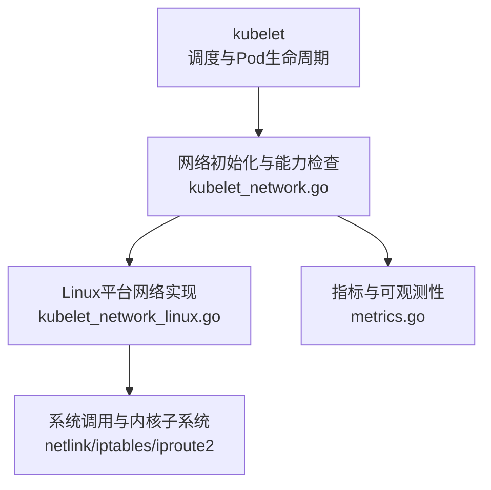
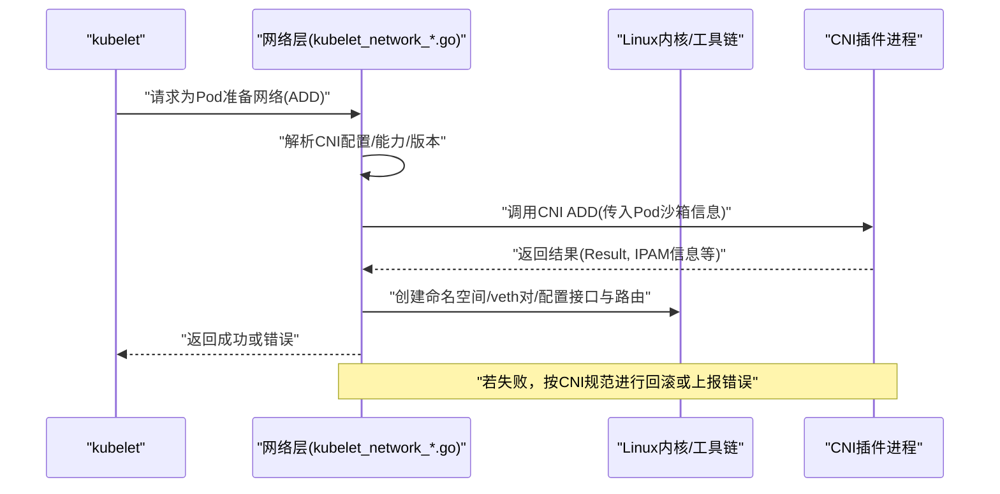
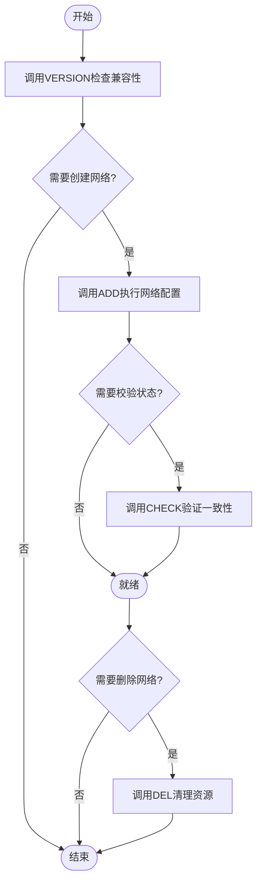
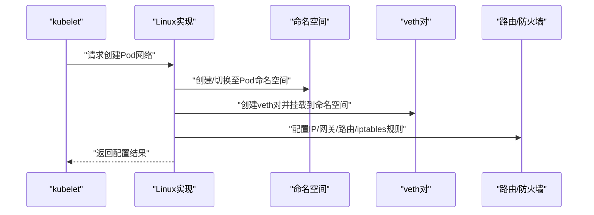
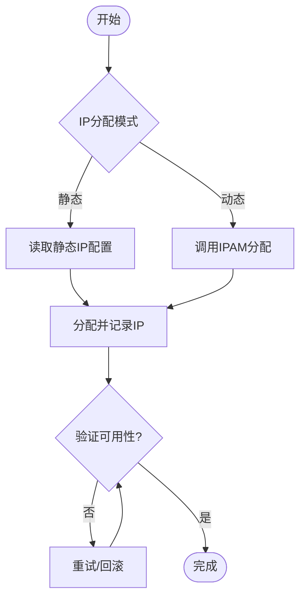
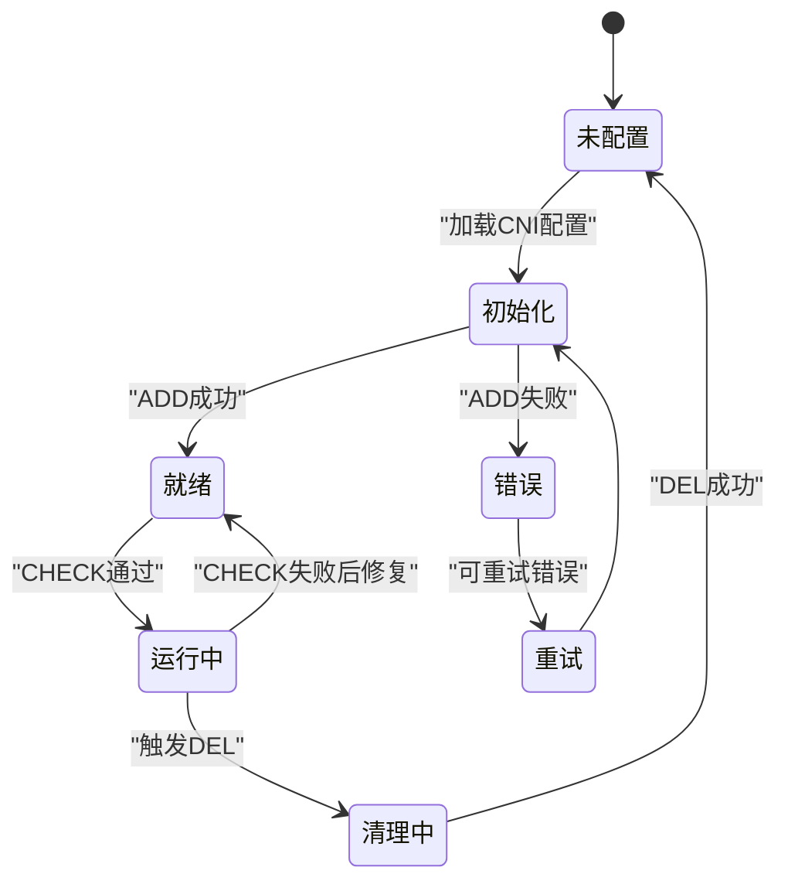
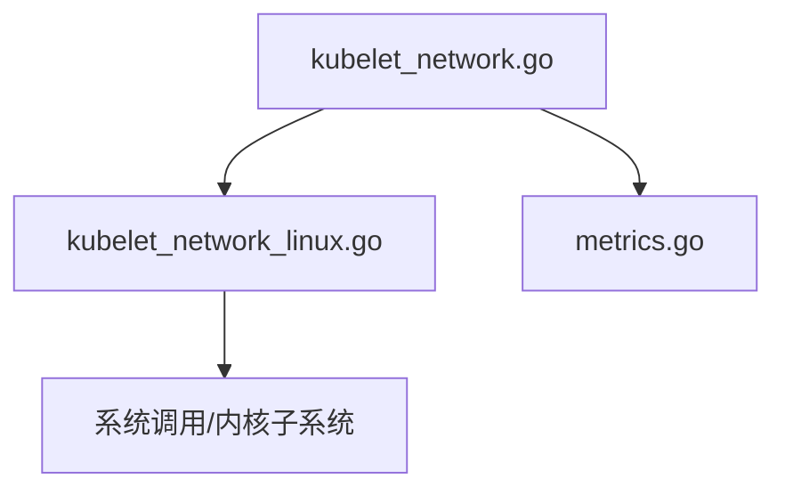

# CNI核心组件详解

<cite>
**本文引用的文件**   
- [kubelet_network.go](file://pkg/kubelet/kubelet_network.go)
- [kubelet_network_linux.go](file://pkg/kubelet/kubelet_network_linux.go)
- [metrics.go](file://pkg/kubelet/metrics/metrics.go)
</cite>

## 目录
1. [引言](#引言)
2. [项目结构](#项目结构)
3. [核心组件](#核心组件)
4. [架构总览](#架构总览)
5. [详细组件分析](#详细组件分析)
6. [依赖关系分析](#依赖关系分析)
7. [性能考量](#性能考量)
8. [故障排查指南](#故障排查指南)
9. [结论](#结论)
10. [附录](#附录)

## 引言
本文件聚焦Kubernetes节点侧与CNI（Container Network Interface）集成相关的核心实现，围绕以下目标展开：
- 解析CNI规范的关键数据类型（NetworkConfig、IPAMConfig、Result等）及其在Kubernetes中的使用场景。
- 梳理CNI插件生命周期方法（ADD/DEL/CHECK/VERSION）的调用时机与行为约束。
- 深入讲解网络命名空间管理（veth对创建、接口配置、路由设置）在Linux上的落地方式。
- 说明IP地址分配与管理（静态IP与动态IPAM集成）。
- 总结错误处理机制与状态管理策略，并给出最佳实践建议。

## 项目结构
Kubernetes仓库中，CNI相关逻辑主要位于kubelet的网络子系统中，负责将上层Pod生命周期事件转化为对底层CNI插件的调用，并在Linux上完成命名空间隔离、veth对建立、接口与路由配置等工作。

图表来源
- [kubelet_network.go](file://pkg/kubelet/kubelet_network.go)
- [kubelet_network_linux.go](file://pkg/kubelet/kubelet_network_linux.go)
- [metrics.go](file://pkg/kubelet/metrics/metrics.go)

章节来源
- [kubelet_network.go](file://pkg/kubelet/kubelet_network.go)
- [kubelet_network_linux.go](file://pkg/kubelet/kubelet_network_linux.go)
- [metrics.go](file://pkg/kubelet/metrics/metrics.go)

## 核心组件
- 网络初始化与能力探测：负责加载CNI配置、校验版本兼容性、发现可用插件与能力集（如带宽限制、IP范围等），为后续Pod网络准备提供基础。
- Linux平台网络实现：在Linux上执行具体的网络操作，包括创建网络命名空间、建立veth对、挂载到容器命名空间、配置IP地址、子网掩码、网关与路由规则等。
- 指标与可观测性：暴露与CNI相关的度量指标，便于定位启动延迟、失败原因与性能瓶颈。

章节来源
- [kubelet_network.go](file://pkg/kubelet/kubelet_network.go)
- [kubelet_network_linux.go](file://pkg/kubelet/kubelet_network_linux.go)
- [metrics.go](file://pkg/kubelet/metrics/metrics.go)

## 架构总览
下图展示了从Pod创建到CNI插件执行的端到端流程，以及各组件之间的交互关系。

图表来源
- [kubelet_network.go](file://pkg/kubelet/kubelet_network.go)
- [kubelet_network_linux.go](file://pkg/kubelet/kubelet_network_linux.go)

## 详细组件分析

### CNI数据类型与字段含义
- NetworkConfig
  - 作用：描述单个CNI插件的配置，包含插件类型、网络名称、子网、网关、DNS、能力集等。
  - 关键字段示例：type、name、ipam、capabilities、dns、ipRange等。
  - 使用场景：kubelet在初始化时读取并缓存，用于后续ADD/DEL/CHECK/VERSION调用。
- IPAMConfig
  - 作用：定义IP地址分配策略，支持静态IP或动态IPAM后端。
  - 关键字段示例：pool、subnet、rangeStart/rangeEnd、gateway、routes、dns等。
  - 使用场景：当启用IPAM时，kubelet通过CNI插件完成IP分配与释放。
- Result
  - 作用：CNI插件返回的执行结果，包含接口名、IP地址、路由、DNS等。
  - 关键字段示例：interfaces、ips、routes、dns等。
  - 使用场景：kubelet根据Result完成最终的网络配置与状态同步。

注意：以上字段来源于CNI规范，具体字段以实际CNI版本为准。Kubernetes通过标准库与CNI协议交互，不直接维护这些结构的内部实现。

章节来源
- [kubelet_network.go](file://pkg/kubelet/kubelet_network.go)
- [kubelet_network_linux.go](file://pkg/kubelet/kubelet_network_linux.go)

### CNI生命周期方法与调用时机
- VERSION
  - 目的：查询插件支持的CNI版本，确保兼容。
  - 调用时机：网络初始化阶段，选择插件前。
- ADD
  - 目的：为Pod沙箱创建网络环境，分配IP、创建veth对、配置路由等。
  - 调用时机：Pod进入网络准备阶段；若失败需回滚已创建的资源。
- DEL
  - 目的：清理Pod网络资源，释放IP、删除veth对与路由。
  - 调用时机：Pod删除或网络重建前；要求幂等与健壮的回滚。
- CHECK
  - 目的：验证当前网络状态是否符合预期（例如IP是否可达、接口是否存在）。
  - 调用时机：健康检查或一致性修复流程。

图表来源
- [kubelet_network.go](file://pkg/kubelet/kubelet_network.go)
- [kubelet_network_linux.go](file://pkg/kubelet/kubelet_network_linux.go)

章节来源
- [kubelet_network.go](file://pkg/kubelet/kubelet_network.go)
- [kubelet_network_linux.go](file://pkg/kubelet/kubelet_network_linux.go)

### 网络命名空间管理与veth对创建
- 命名空间隔离：每个Pod拥有独立的网络命名空间，kubelet在Linux上通过系统调用创建并切换至该命名空间。
- veth对建立：在宿主机命名空间与Pod命名空间之间创建一对虚拟以太网设备，一端置于宿主，另一端移入Pod命名空间。
- 接口配置：为Pod端接口设置IP地址、子网掩码、MTU等属性。
- 路由与网关：在Pod命名空间中设置默认网关与必要路由，使流量能正确转发至宿主机与集群网络。
- 安全与权限：涉及CAP_NET_ADMIN等能力，需确保kubelet具备相应权限。

图表来源
- [kubelet_network_linux.go](file://pkg/kubelet/kubelet_network_linux.go)

章节来源
- [kubelet_network_linux.go](file://pkg/kubelet/kubelet_network_linux.go)

### IP地址分配与管理
- 静态IP分配：在NetworkConfig中指定固定IP或池化范围，适用于确定性网络需求。
- 动态IPAM集成：通过IPAMConfig与CNI插件协作，由插件从后端（如数据库、外部服务）分配与回收IP。
- 冲突与重试：当IP冲突或分配失败时，应触发重试与回滚，保证幂等性与一致性。
- 元数据记录：kubelet会记录分配的IP等信息，用于后续DEL/CHECK流程。

图表来源
- [kubelet_network.go](file://pkg/kubelet/kubelet_network.go)
- [kubelet_network_linux.go](file://pkg/kubelet/kubelet_network_linux.go)

章节来源
- [kubelet_network.go](file://pkg/kubelet/kubelet_network.go)
- [kubelet_network_linux.go](file://pkg/kubelet/kubelet_network_linux.go)

### 错误处理机制与状态管理
- 幂等性：DEL应支持多次调用且无副作用；ADD失败需回滚已创建的资源。
- 错误分类：区分配置错误、运行时错误与临时错误，采取不同重试策略。
- 一致性校验：CHECK可用于检测不一致状态并触发修复。
- 指标与日志：通过指标暴露失败率、耗时等，辅助快速定位问题。

图表来源
- [kubelet_network.go](file://pkg/kubelet/kubelet_network.go)
- [kubelet_network_linux.go](file://pkg/kubelet/kubelet_network_linux.go)

章节来源
- [kubelet_network.go](file://pkg/kubelet/kubelet_network.go)
- [kubelet_network_linux.go](file://pkg/kubelet/kubelet_network_linux.go)

### 代码示例与最佳实践
- 示例路径参考
  - 网络初始化与能力检查：[kubelet_network.go](file://pkg/kubelet/kubelet_network.go)
  - Linux平台网络实现：[kubelet_network_linux.go](file://pkg/kubelet/kubelet_network_linux.go)
  - 指标与可观测性：[metrics.go](file://pkg/kubelet/metrics/metrics.go)
- 最佳实践
  - 明确能力集：在CNI配置中声明capabilities，避免不必要的功能调用。
  - 幂等设计：DEL必须幂等，ADD失败要回滚，确保集群稳定。
  - 超时与重试：为CNI调用设置合理超时，针对临时错误进行有限次重试。
  - 可观测性：完善指标与日志，覆盖关键路径（ADD/DEL/CHECK/VERSION）。
  - 安全最小权限：仅授予必要的网络能力，降低安全风险。

章节来源
- [kubelet_network.go](file://pkg/kubelet/kubelet_network.go)
- [kubelet_network_linux.go](file://pkg/kubelet/kubelet_network_linux.go)
- [metrics.go](file://pkg/kubelet/metrics/metrics.go)

## 依赖关系分析
- kubelet网络层依赖Linux平台实现，后者进一步依赖系统调用与内核子系统（netlink、iptables、iproute2等）。
- 指标模块独立于网络实现，但与其紧密耦合，用于采集与上报CNI相关指标。

图表来源
- [kubelet_network.go](file://pkg/kubelet/kubelet_network.go)
- [kubelet_network_linux.go](file://pkg/kubelet/kubelet_network_linux.go)
- [metrics.go](file://pkg/kubelet/metrics/metrics.go)

章节来源
- [kubelet_network.go](file://pkg/kubelet/kubelet_network.go)
- [kubelet_network_linux.go](file://pkg/kubelet/kubelet_network_linux.go)
- [metrics.go](file://pkg/kubelet/metrics/metrics.go)

## 性能考量
- 减少系统调用次数：批量配置接口与路由，避免频繁上下文切换。
- 并行与异步：在不破坏一致性的前提下，尽可能并行执行非阻塞步骤。
- 缓存与复用：缓存CNI配置与能力信息，避免重复解析。
- 监控与限流：对CNI调用进行速率限制与超时控制，防止雪崩。

## 故障排查指南
- 常见问题
  - CNI插件不可用：检查插件二进制路径、权限与版本兼容性。
  - 命名空间异常：确认kubelet具备CAP_NET_ADMIN，检查命名空间创建与切换。
  - IP冲突：核对IPAM后端状态，必要时手动清理残留IP。
  - 路由缺失：验证默认网关与路由表是否正确写入Pod命名空间。
- 定位手段
  - 查看kubelet日志与CNI插件日志，关注错误堆栈与时间戳。
  - 使用指标观察ADD/DEL/CHECK耗时与失败率。
  - 在宿主机与Pod内分别检查接口、IP、路由与防火墙规则。

章节来源
- [metrics.go](file://pkg/kubelet/metrics/metrics.go)

## 结论
Kubernetes通过kubelet的网络层与CNI插件协同工作，实现了Pod网络的标准化接入。理解CNI数据类型、生命周期方法、命名空间管理与IPAM机制，有助于构建稳定高效的集群网络。遵循幂等、可观测与安全最小权限等最佳实践，可以显著提升系统的可靠性与可维护性。

## 附录
- CNI规范参考：参见containernetworking/cni官方文档与SPEC，了解NetworkConfig、IPAMConfig、Result等字段的完整定义与演进。
- 版本兼容性：关注仓库变更日志中关于CNI版本升级的记录，确保与插件版本匹配。