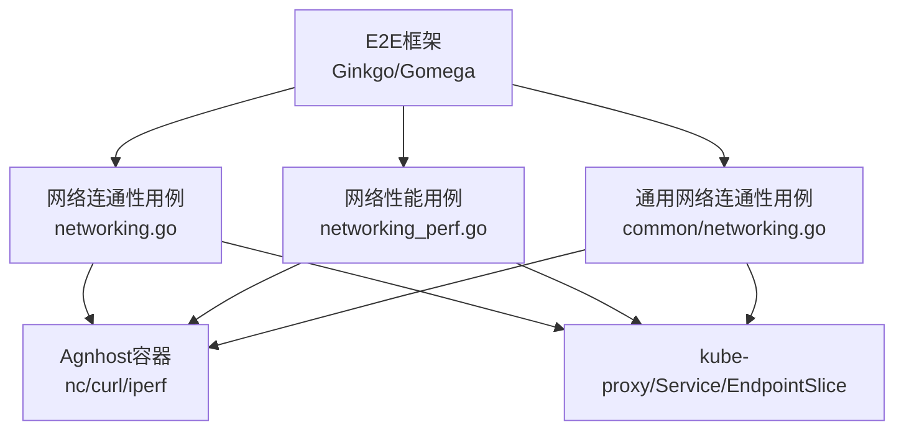
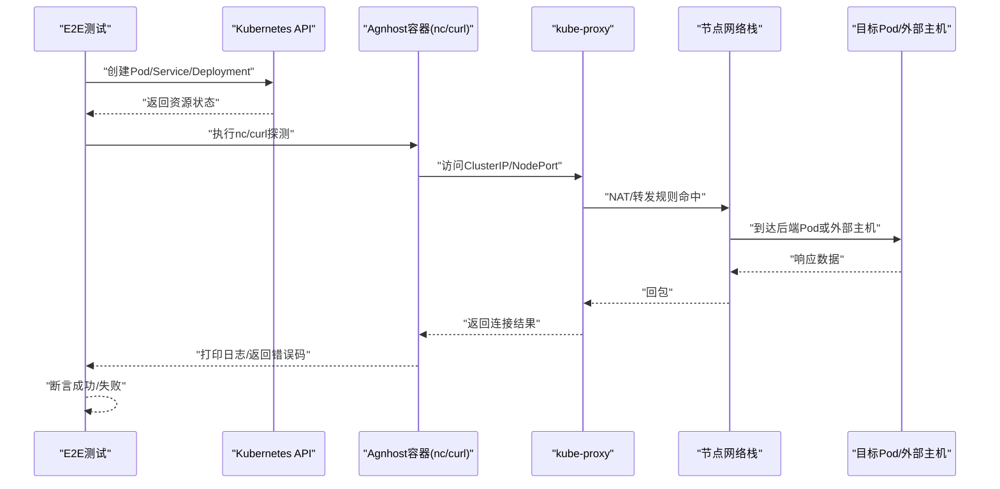
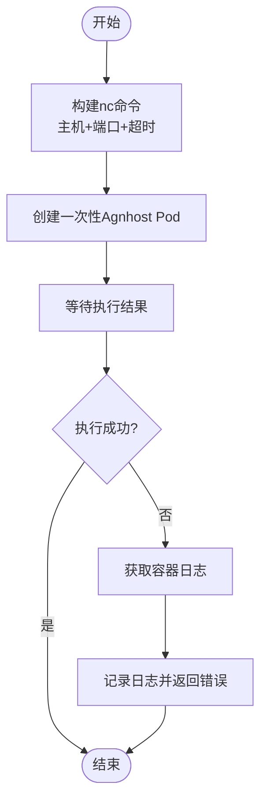
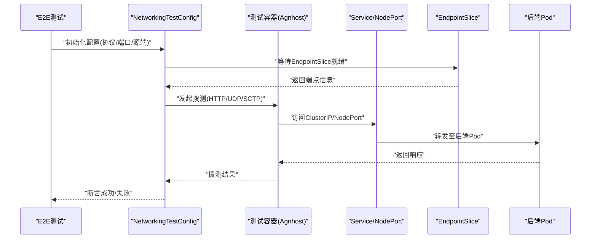
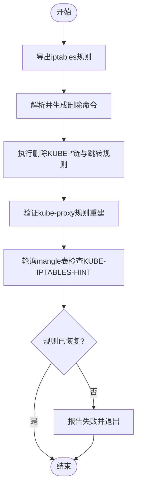
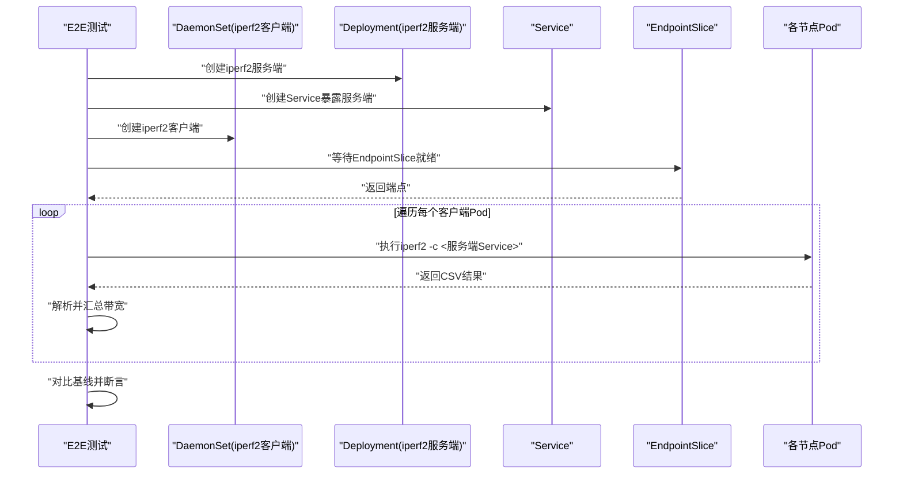
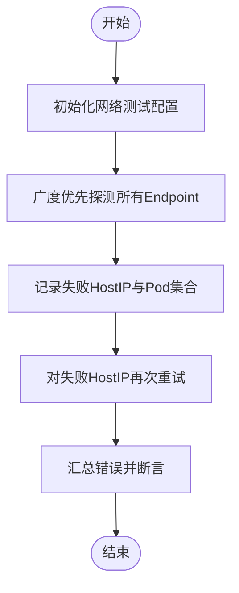
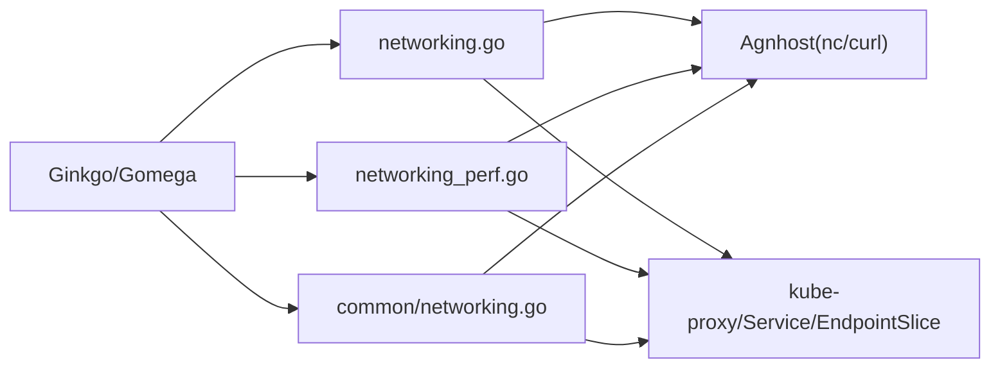

# CNI测试与故障排查

<cite>
**本文引用的文件**   
- [test/e2e/network/networking.go](file://test/e2e/network/networking.go)
- [test/e2e/network/networking_perf.go](file://test/e2e/network/networking_perf.go)
- [test/e2e/common/network/networking.go](file://test/e2e/common/network/networking.go)
</cite>

## 目录
1. [简介](#简介)
2. [项目结构](#项目结构)
3. [核心组件](#核心组件)
4. [架构总览](#架构总览)
5. [详细组件分析](#详细组件分析)
6. [依赖关系分析](#依赖关系分析)
7. [性能考量](#性能考量)
8. [故障排查指南](#故障排查指南)
9. [结论](#结论)
10. [附录](#附录)

## 简介
本指南面向Kubernetes CNI网络插件的测试与故障排查，聚焦于端到端（E2E）网络连通性、服务代理行为、SCTP特性、iptables规则自愈以及网络性能基准等关键场景。文档基于仓库中的现有E2E测试实现，提供从用例设计、执行到问题定位的系统化方法，帮助读者快速搭建可复用的网络验证流程并高效排障。

## 项目结构
围绕CNI相关网络能力的E2E测试主要分布在以下位置：
- 基础连通性与Service/NodePort/Endpoint更新等场景：test/e2e/network/networking.go
- 网络性能基准（iperf2）：test/e2e/network/networking_perf.go
- Pod间与节点到Pod的基础连通性收敛性用例：test/e2e/common/network/networking.go

图表来源
- [test/e2e/network/networking.go:1-666](file://test/e2e/network/networking.go#L1-L666)
- [test/e2e/network/networking_perf.go:1-288](file://test/e2e/network/networking_perf.go#L1-L288)
- [test/e2e/common/network/networking.go:1-153](file://test/e2e/common/network/networking.go#L1-L153)

章节来源
- [test/e2e/network/networking.go:1-666](file://test/e2e/network/networking.go#L1-L666)
- [test/e2e/network/networking_perf.go:1-288](file://test/e2e/network/networking_perf.go#L1-L288)
- [test/e2e/common/network/networking.go:1-153](file://test/e2e/common/network/networking.go#L1-L153)

## 核心组件
- 连通性探测工具
  - 使用Agnhost镜像内置工具进行连通性验证，如nc用于TCP端口可达性探测，curl用于HTTP连通性检查。
- Service/NodePort/EndpointSlice联动验证
  - 通过创建Deployment/Service/DaemonSet等资源，结合EndpointSlice等待机制，验证kube-proxy转发链路。
- SCTP能力验证
  - 在支持的平台启用SCTP，验证Pod内及跨节点的SCTP连通性。
- iptables规则自愈
  - 模拟删除KUBE-*链后，验证kube-proxy与kubelet规则重建。
- 性能基准
  - 部署iperf2服务端与客户端，逐节点测量带宽并输出CSV结果，设置基线阈值进行断言。

章节来源
- [test/e2e/network/networking.go:44-81](file://test/e2e/network/networking.go#L44-L81)
- [test/e2e/network/networking.go:145-323](file://test/e2e/network/networking.go#L145-L323)
- [test/e2e/network/networking.go:548-631](file://test/e2e/network/networking.go#L548-L631)
- [test/e2e/network/networking_perf.go:62-127](file://test/e2e/network/networking_perf.go#L62-L127)
- [test/e2e/network/networking_perf.go:142-287](file://test/e2e/network/networking_perf.go#L142-L287)
- [test/e2e/common/network/networking.go:35-149](file://test/e2e/common/network/networking.go#L35-L149)

## 架构总览
下图展示了典型网络测试的执行路径：E2E测试驱动创建资源、调用Agnhost容器执行探测命令、经由kube-proxy与内核网络栈完成转发，最终返回结果供断言。

图表来源
- [test/e2e/network/networking.go:44-81](file://test/e2e/network/networking.go#L44-L81)
- [test/e2e/network/networking.go:145-323](file://test/e2e/network/networking.go#L145-L323)

## 详细组件分析

### 连通性探测与DNS验证
- 功能要点
  - 通过Agnhost容器执行nc探测指定主机与端口，验证IPv4/IPv6与DNS解析连通性。
  - 失败时自动抓取容器日志辅助定位。
- 关键流程
  - 构造nc命令参数，创建一次性Pod，等待执行成功或失败，收集日志。
- 适用场景
  - 验证CNI是否提供出站连通性、DNS是否可用。

图表来源
- [test/e2e/network/networking.go:44-81](file://test/e2e/network/networking.go#L44-L81)

章节来源
- [test/e2e/network/networking.go:88-106](file://test/e2e/network/networking.go#L88-L106)

### Service/NodePort/EndpointSlice联动验证
- 功能要点
  - 覆盖HTTP/UDP/SCTP协议，分别验证从Pod、节点、Endpoint容器访问ClusterIP与NodePort的行为。
  - 验证多Service同选择器共存、Endpoint动态更新、NodePort删除后的停止转发。
- 关键流程
  - 使用NetworkingTestConfig封装探测逻辑，按协议与源端（Pod/节点/Endpoint）发起拨测。
  - 对EndpointSlice存在性进行等待，确保服务就绪后再拨测。
- 适用场景
  - 验证CNI+kube-proxy组合在不同流量入口下的转发正确性与稳定性。

图表来源
- [test/e2e/network/networking.go:145-323](file://test/e2e/network/networking.go#L145-L323)
- [test/e2e/network/networking_perf.go:172-184](file://test/e2e/network/networking_perf.go#L172-L184)

章节来源
- [test/e2e/network/networking.go:145-323](file://test/e2e/network/networking.go#L145-L323)

### iptables规则自愈验证
- 功能要点
  - 通过SSH进入节点，删除所有KUBE-*链与跳转规则，随后验证kube-proxy与kubelet规则重建。
- 关键流程
  - 导出iptables规则，筛选并删除KUBE-*相关条目；轮询mangle表以确认KUBE-IPTABLES-HINT恢复。
- 适用场景
  - 验证CNI/kube-proxy在极端破坏场景下的自愈能力。

图表来源
- [test/e2e/network/networking.go:548-631](file://test/e2e/network/networking.go#L548-L631)

章节来源
- [test/e2e/network/networking.go:548-631](file://test/e2e/network/networking.go#L548-L631)

### 网络性能基准（iperf2）
- 功能要点
  - 部署单实例iperf2服务端与每节点一个客户端DaemonSet，逐个节点执行iperf2测试，采集CSV结果并计算带宽。
  - 设置最低带宽基线，低于阈值则断言失败。
- 关键流程
  - 创建Deployment/Service与DaemonSet，等待EndpointSlice与客户端Pod就绪，循环执行iperf2命令并解析输出。
- 适用场景
  - 评估集群网络吞吐能力，发现跨节点瓶颈。

图表来源
- [test/e2e/network/networking_perf.go:62-127](file://test/e2e/network/networking_perf.go#L62-L127)
- [test/e2e/network/networking_perf.go:142-287](file://test/e2e/network/networking_perf.go#L142-L287)

章节来源
- [test/e2e/network/networking_perf.go:142-287](file://test/e2e/network/networking_perf.go#L142-L287)

### 通用Pod间与节点到Pod连通性
- 功能要点
  - 针对HTTP/UDP/SCTP协议，批量探测所有Endpoint，先广度优先快速失败判定，再对失败节点重试。
  - 支持从节点直接访问Pod IP，验证节点到Pod的连通性。
- 关键流程
  - 使用NewCoreNetworkingTestConfig初始化配置，遍历EndpointPods进行拨测，汇总错误并断言。
- 适用场景
  - 快速验证CNI跨Pod通信与节点到Pod路由是否正确。

图表来源
- [test/e2e/common/network/networking.go:35-149](file://test/e2e/common/network/networking.go#L35-L149)

章节来源
- [test/e2e/common/network/networking.go:35-149](file://test/e2e/common/network/networking.go#L35-L149)

## 依赖关系分析
- 测试框架依赖
  - Ginkgo/Gomega作为测试编排与断言框架。
  - Agnhost镜像提供nc/curl/iperf等常用网络工具。
- Kubernetes对象依赖
  - Deployment/Service/DaemonSet/EndpointSlice用于构建被测环境与等待就绪。
- 运行时依赖
  - kube-proxy负责Service/NodePort转发；内核网络栈与iptables/nftables参与数据包转发。
- 平台特性
  - IPv6、SCTP、Windows/Linux差异通过条件跳过或特性开关控制。

图表来源
- [test/e2e/network/networking.go:1-666](file://test/e2e/network/networking.go#L1-L666)
- [test/e2e/network/networking_perf.go:1-288](file://test/e2e/network/networking_perf.go#L1-L288)
- [test/e2e/common/network/networking.go:1-153](file://test/e2e/common/network/networking.go#L1-L153)

章节来源
- [test/e2e/network/networking.go:1-666](file://test/e2e/network/networking.go#L1-L666)
- [test/e2e/network/networking_perf.go:1-288](file://test/e2e/network/networking_perf.go#L1-L288)
- [test/e2e/common/network/networking.go:1-153](file://test/e2e/common/network/networking.go#L1-L153)

## 性能考量
- 测试规模与耗时
  - 大集群下EndpointSlice等待与客户端Pod就绪时间较长，需适当增大超时。
- 并发与隔离
  - 避免在同一节点上并行占用相同HostPort导致冲突；必要时串行执行。
- 指标与基线
  - iperf2 CSV输出便于自动化解析；建议根据硬件能力设定合理基线阈值。
- 资源清理
  - 测试结束后及时删除Deployment/Service/DaemonSet，释放端口与资源。

[本节为通用指导，不直接分析具体文件]

## 故障排查指南
- 常见现象与定位思路
  - 网络不通：优先使用nc探测目标端口，确认是否为CNI或kube-proxy转发问题。
  - DNS解析失败：通过Agnhost容器访问域名端口，检查CoreDNS与上游DNS配置。
  - 服务发现异常：观察EndpointSlice是否存在且包含预期端点，确认Service选择器与标签匹配。
  - NodePort失效：删除NodePort后应停止转发，若仍响应需检查其他同名NodePort或服务冲突。
- 日志与抓包
  - 容器日志：失败时自动抓取Agnhost容器日志，关注nc/curl/iperf输出。
  - 节点日志：查看kube-proxy与kubelet日志，确认规则重建与转发状态。
  - 抓包工具：可在节点上使用tcpdump或系统抓包工具捕获CNI接口流量，结合协议栈调试。
- 自愈与健壮性
  - iptables规则被误删后，验证kube-proxy与kubelet是否能自动重建必要规则。

章节来源
- [test/e2e/network/networking.go:44-81](file://test/e2e/network/networking.go#L44-L81)
- [test/e2e/network/networking.go:548-631](file://test/e2e/network/networking.go#L548-L631)

## 结论
通过上述E2E用例与流程，可以系统化验证CNI在网络连通性、服务代理、SCTP特性、iptables自愈与性能基准等方面的表现。建议在CI中常态化运行这些用例，并结合日志与抓包手段形成闭环的故障排查体系。

[本节为总结性内容，不直接分析具体文件]

## 附录
- 术语说明
  - CNI：容器网络接口，负责Pod网络命名空间与接口的创建与管理。
  - kube-proxy：负责Service与NodePort的转发与负载均衡。
  - EndpointSlice：Kubernetes用于高效表示Service后端端点的资源。
- 参考用例路径
  - 连通性与DNS：[test/e2e/network/networking.go](file://test/e2e/network/networking.go)
  - 性能基准：[test/e2e/network/networking_perf.go](file://test/e2e/network/networking_perf.go)
  - 通用连通性：[test/e2e/common/network/networking.go](file://test/e2e/common/network/networking.go)

[本节为补充信息，不直接分析具体文件]