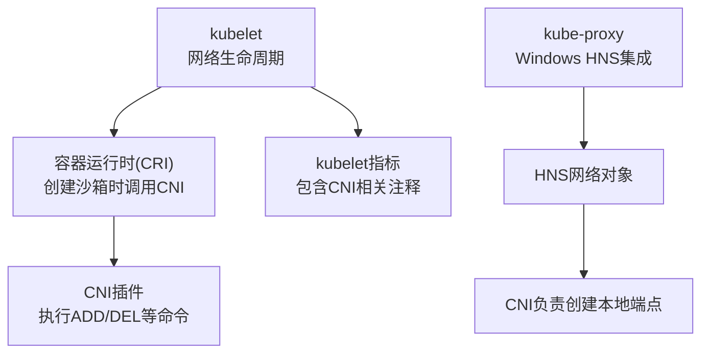
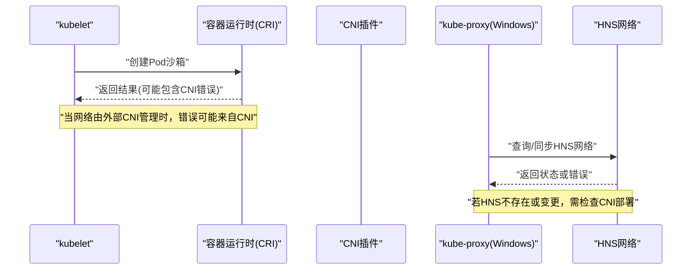
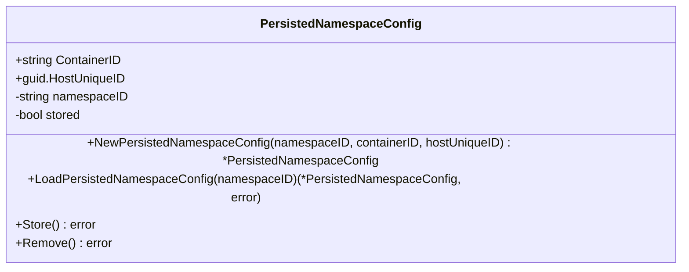
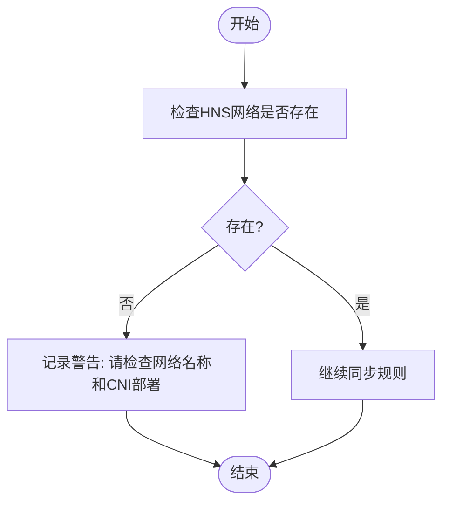
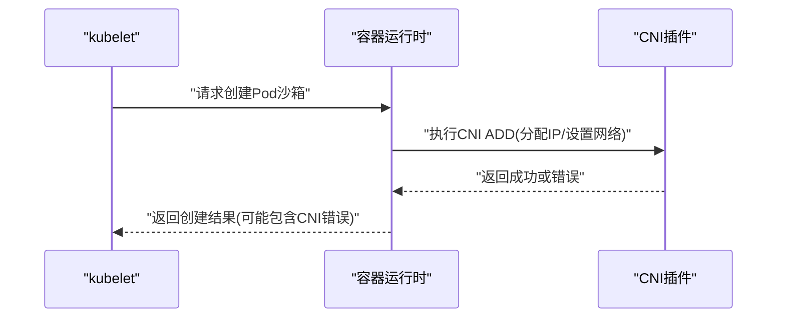
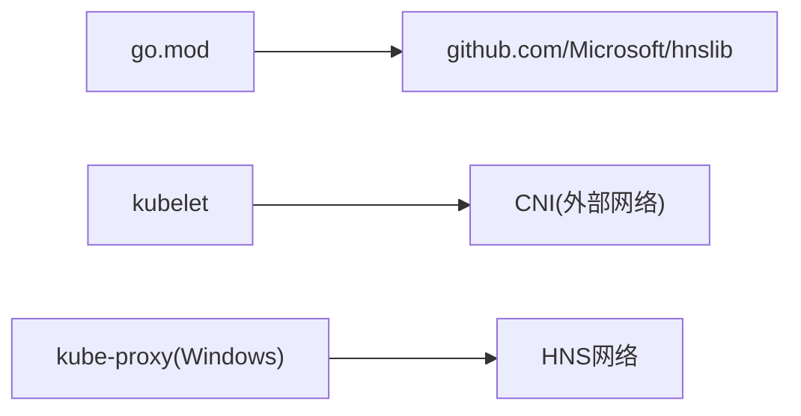

# CNI网络插件

<cite>
**本文引用的文件**   
- [go.mod](file://go.mod)
- [metrics.go](file://pkg/kubelet/metrics/metrics.go)
- [doc.go](file://vendor/github.com/Microsoft/hnslib/internal/cni/doc.go)
- [registry.go](file://vendor/github.com/Microsoft/hnslib/internal/cni/registry.go)
- [options.go](file://cmd/kube-proxy/app/options.go)
- [types.go](file://staging/src/k8s.io/kube-proxy/config/v1alpha1/types.go)
- [proxier.go](file://pkg/proxy/winkernel/proxier.go)
- [kuberuntime_manager.go](file://pkg/kubelet/kuberuntime/kuberuntime_manager.go)
</cite>

## 目录
1. [简介](#简介)
2. [项目结构](#项目结构)
3. [核心组件](#核心组件)
4. [架构总览](#架构总览)
5. [详细组件分析](#详细组件分析)
6. [依赖分析](#依赖分析)
7. [性能考虑](#性能考虑)
8. [故障排查指南](#故障排查指南)
9. [结论](#结论)
10. [附录](#附录)

## 简介
本技术文档面向Kubernetes CNI（Container Network Interface）生态，聚焦于CNI规范在Kubernetes中的集成与使用方式、kubelet与CNI的交互机制、以及Windows平台下HNS/CNI相关实现片段。文档同时提供主流CNI方案（如Flannel、Calico、Weave）的概念性说明、开发模式要点、测试与排障建议及部署最佳实践，帮助读者快速理解并落地CNI插件开发与运维。

## 项目结构
仓库中涉及CNI的关键位置包括：
- kubelet侧指标与注释中对CNI的引用
- Windows平台HNS/CNI注册表持久化能力（Microsoft hnslib）
- kube-proxy配置项对“某些CNI插件可能需要SNAT”的提示
- Windows内核代理对HNS网络的检测与日志提示

[此图为概念性结构图，不直接映射具体源码文件]

## 核心组件
- kubelet与CNI的协作
  - 在Pod沙箱创建阶段，kubelet通过CRI接口触发容器运行时进行网络初始化；当底层网络由外部CNI管理时，该过程可能返回来自CNI的错误信息。
  - kubelet内部指标中包含关于现有网络子系统与CRI/CNI实现的注释，指向社区问题以跟踪改进。
- Windows平台HNS/CNI集成
  - Windows内核代理在同步或查找HNS网络失败时会输出提示信息，提醒检查CNI部署。
  - Microsoft hnslib提供Windows下的CNI命名空间配置持久化到注册表的工具类型，用于维护命名空间与UVM映射关系。

章节来源
- [kuberuntime_manager.go:1626](file://pkg/kubelet/kuberuntime/kuberuntime_manager.go#L1626)
- [metrics.go:326](file://pkg/kubelet/metrics/metrics.go#L326)
- [proxier.go:276](file://pkg/proxy/winkernel/proxier.go#L276)
- [proxier.go:1220](file://pkg/proxy/winkernel/proxier.go#L1220)
- [proxier.go:1391](file://pkg/proxy/winkernel/proxier.go#L1391)
- [registry.go:17-35](file://vendor/github.com/Microsoft/hnslib/internal/cni/registry.go#L17-L35)
- [registry.go:37-54](file://vendor/github.com/Microsoft/hnslib/internal/cni/registry.go#L37-L54)
- [registry.go:56-86](file://vendor/github.com/Microsoft/hnslib/internal/cni/registry.go#L56-L86)
- [registry.go:88-112](file://vendor/github.com/Microsoft/hnslib/internal/cni/registry.go#L88-L112)

## 架构总览
下图展示Kubernetes中与CNI相关的典型交互路径：kubelet在Pod启动流程中协调CRI与CNI，Windows场景下kube-proxy与HNS网络协同工作，CNI负责创建本地端点。

图表来源
- [kuberuntime_manager.go:1626](file://pkg/kubelet/kuberuntime/kuberuntime_manager.go#L1626)
- [proxier.go:276](file://pkg/proxy/winkernel/proxier.go#L276)
- [proxier.go:1220](file://pkg/proxy/winkernel/proxier.go#L1220)
- [proxier.go:1391](file://pkg/proxy/winkernel/proxier.go#L1391)

## 详细组件分析

### Windows平台HNS/CNI注册表持久化
Windows环境下，hnslib提供将CNI命名空间配置持久化到系统注册表的能力，便于跨进程或重启后恢复命名空间与UVM映射关系。

图表来源
- [registry.go:17-35](file://vendor/github.com/Microsoft/hnslib/internal/cni/registry.go#L17-L35)
- [registry.go:37-54](file://vendor/github.com/Microsoft/hnslib/internal/cni/registry.go#L37-L54)
- [registry.go:56-86](file://vendor/github.com/Microsoft/hnslib/internal/cni/registry.go#L56-L86)
- [registry.go:88-112](file://vendor/github.com/Microsoft/hnslib/internal/cni/registry.go#L88-L112)

章节来源
- [doc.go:1-2](file://vendor/github.com/Microsoft/hnslib/internal/cni/doc.go#L1-L2)
- [registry.go:1-113](file://vendor/github.com/Microsoft/hnslib/internal/cni/registry.go#L1-L113)

### kube-proxy与CNI的互操作提示
kube-proxy在Windows内核模式下与HNS网络交互，当HNS网络缺失或发生变化时会输出提示信息，指导用户检查CNI部署。此外，kube-proxy的配置项中包含对“某些CNI插件可能需要SNAT”的说明，反映不同CNI方案的差异。

图表来源
- [proxier.go:276](file://pkg/proxy/winkernel/proxier.go#L276)
- [proxier.go:1220](file://pkg/proxy/winkernel/proxier.go#L1220)
- [proxier.go:1391](file://pkg/proxy/winkernel/proxier.go#L1391)

章节来源
- [options.go:134](file://cmd/kube-proxy/app/options.go#L134)
- [types.go:31](file://staging/src/k8s.io/kube-proxy/config/v1alpha1/types.go#L31)
- [types.go:86](file://staging/src/k8s.io/kube-proxy/config/v1alpha1/types.go#L86)
- [proxier.go:276](file://pkg/proxy/winkernel/proxier.go#L276)
- [proxier.go:1220](file://pkg/proxy/winkernel/proxier.go#L1220)
- [proxier.go:1391](file://pkg/proxy/winkernel/proxier.go#L1391)

### kubelet与CNI的生命周期交互
kubelet在创建Pod沙箱时，若底层网络由外部CNI管理，则可能从CNI层返回错误。该行为体现了CNI作为外部网络子系统的集成点。

图表来源
- [kuberuntime_manager.go:1626](file://pkg/kubelet/kuberuntime/kuberuntime_manager.go#L1626)

章节来源
- [kuberuntime_manager.go:1626](file://pkg/kubelet/kuberuntime/kuberuntime_manager.go#L1626)

## 依赖分析
- go.mod中声明了对Microsoft hnslib的依赖，表明Windows平台下对HNS/CNI能力的支持。
- 其他模块（如kubelet、kube-proxy）通过各自代码路径与CNI/HNS进行交互。

图表来源
- [go.mod:17](file://go.mod#L17)

章节来源
- [go.mod:1-260](file://go.mod#L1-L260)

## 性能考虑
- 在大规模集群中，CNI插件的ADD/DEL操作会影响Pod启动延迟。建议在节点上启用合理的并发策略，避免CNI成为瓶颈。
- Windows平台下，HNS网络对象的创建与更新开销较大，应尽量减少不必要的网络重建与频繁变更。
- kube-proxy在Windows模式下需要与HNS保持同步，确保规则更新频率与规模匹配，避免CPU与内存峰值。

[本节为通用性能建议，不直接分析具体文件]

## 故障排查指南
- Pod启动失败且错误来源于CNI
  - 检查kubelet日志中是否出现来自CNI的错误信息，确认CNI插件是否安装正确、配置是否有效。
  - 参考kubelet指标与注释，定位网络子系统与CRI/CNI实现相关问题。
- Windows平台HNS网络异常
  - 查看kube-proxy日志中关于HNS网络缺失或变化的提示，确认CNI是否正确创建了本地端点。
  - 验证HNS网络名称与CNI部署的一致性。
- 注册表持久化问题（Windows）
  - 检查PersistedNamespaceConfig的加载、存储与移除逻辑是否按预期执行，确认命名空间与容器ID映射是否正确。

章节来源
- [metrics.go:326](file://pkg/kubelet/metrics/metrics.go#L326)
- [proxier.go:276](file://pkg/proxy/winkernel/proxier.go#L276)
- [proxier.go:1220](file://pkg/proxy/winkernel/proxier.go#L1220)
- [proxier.go:1391](file://pkg/proxy/winkernel/proxier.go#L1391)
- [registry.go:37-54](file://vendor/github.com/Microsoft/hnslib/internal/cni/registry.go#L37-L54)
- [registry.go:56-86](file://vendor/github.com/Microsoft/hnslib/internal/cni/registry.go#L56-L86)
- [registry.go:88-112](file://vendor/github.com/Microsoft/hnslib/internal/cni/registry.go#L88-L112)

## 结论
本仓库展示了Kubernetes在Linux与Windows平台上与CNI/HNS集成的关键路径与提示。Linux侧主要通过kubelet与CRI对接外部CNI；Windows侧通过kube-proxy与HNS协同，并由hnslib提供命名空间配置的持久化能力。结合本文提供的架构图、流程图与类图，读者可更好地理解CNI在Kubernetes中的角色与交互方式，并在实际环境中进行开发与排障。

[本节为总结性内容，不直接分析具体文件]

## 附录
- 主流CNI方案概览（概念性说明）
  - Flannel：基于Overlay的网络方案，适合简单跨主机通信场景。
  - Calico：基于BGP与eBGP的数据平面，支持细粒度网络策略。
  - Weave：采用分布式哈希与加密隧道，简化多集群互联。
- CNI插件开发模式（概念性说明）
  - 网络配置解析：读取CNI配置文件，解析网络参数与IPAM选项。
  - IPAM集成：与IP地址管理插件协作，完成IP分配与释放。
  - 容器网络设置：在容器网络命名空间中创建veth、bridge、路由与iptables/nftables规则。
  - 端口映射与服务发现：结合Service与Ingress控制器，实现服务暴露与发现。
- 测试方法（概念性说明）
  - 单元测试：覆盖配置解析、IPAM交互与边界条件。
  - 集成测试：在真实或模拟Kubernetes环境中验证Pod网络连通性与策略生效。
  - 性能测试：评估高并发Pod启动与大规模网络规则更新的吞吐与时延。
- 部署最佳实践（概念性说明）
  - 使用DaemonSet部署CNI，确保每个节点运行一个实例。
  - 合理设置资源限制与探针，保障CNI稳定性。
  - 定期升级与回滚策略，配合灰度发布降低风险。

[本节为概念性内容，不直接分析具体文件]