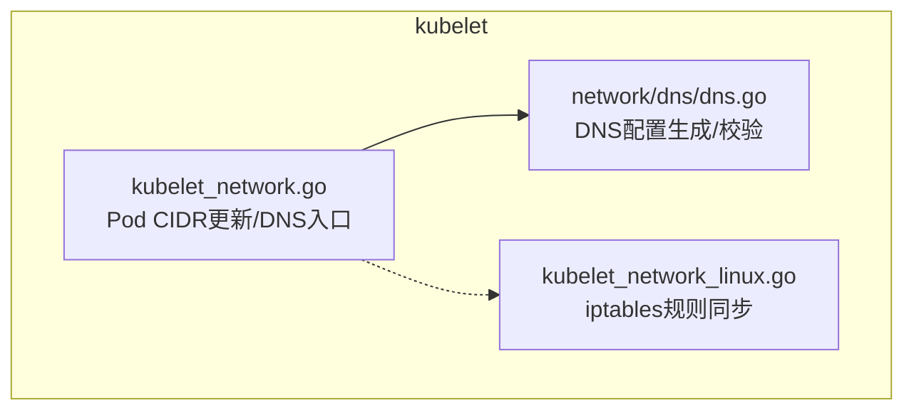
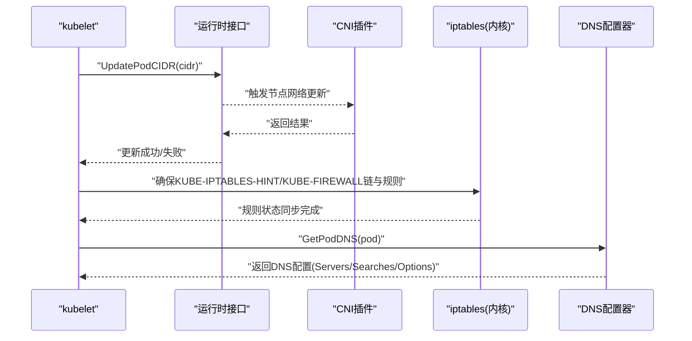
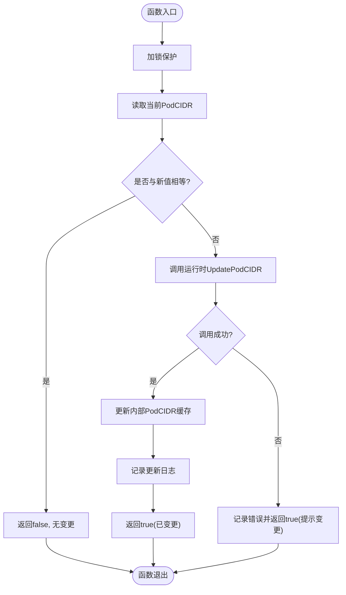
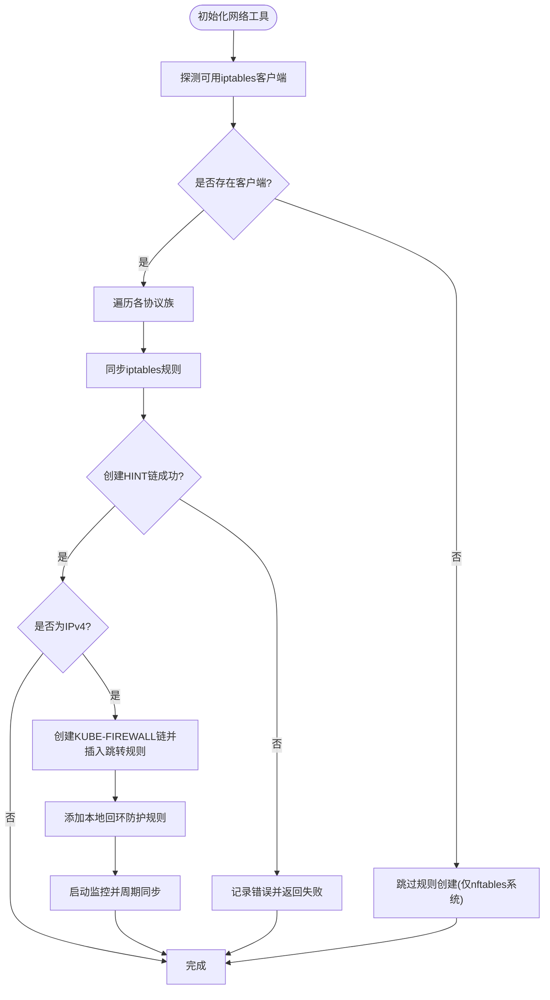
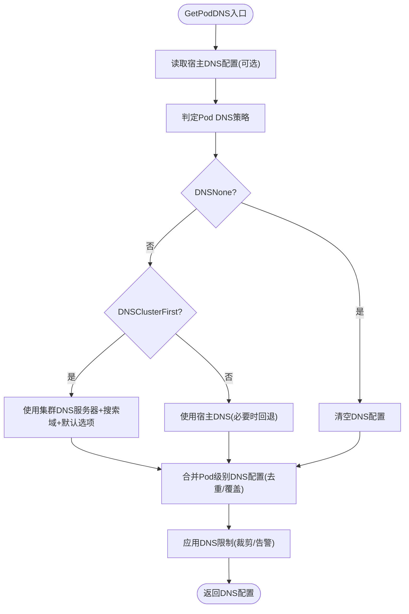
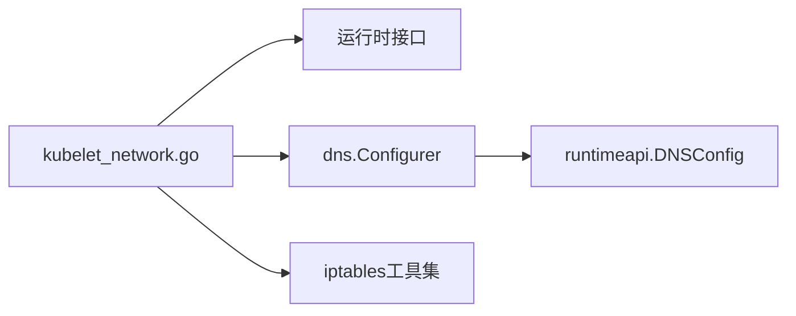

# CNI规范与架构

<cite>
**本文引用的文件**   
- [pkg/kubelet/kubelet_network.go](file://pkg/kubelet/kubelet_network.go)
- [pkg/kubelet/kubelet_network_linux.go](file://pkg/kubelet/kubelet_network_linux.go)
- [pkg/kubelet/network/dns/dns.go](file://pkg/kubelet/network/dns/dns.go)
</cite>

## 目录
1. [简介](#简介)
2. [项目结构](#项目结构)
3. [核心组件](#核心组件)
4. [架构总览](#架构总览)
5. [详细组件分析](#详细组件分析)
6. [依赖关系分析](#依赖关系分析)
7. [性能考虑](#性能考虑)
8. [故障排查指南](#故障排查指南)
9. [结论](#结论)
10. [附录](#附录)

## 简介
本文件面向Kubernetes节点侧网络能力，围绕CNI（Container Network Interface）规范与架构进行系统化说明。重点覆盖：
- CNI插件化网络架构的核心理念与设计原则
- CNI接口定义与生命周期管理（ADD、DEL、CHECK、VERSION等）
- CNI配置文件的JSON格式与字段含义（网络类型、IPAM配置、网络参数）
- CNI插件加载机制与执行环境
- CNI版本兼容策略与向后兼容实现方式
- CNI与kubelet的集成点（网络初始化时机、资源清理流程）
- CNI规范的扩展点与自定义能力

为保证准确性，本文在涉及具体实现细节时，均基于仓库中kubelet网络相关源码进行分析与引用。

## 项目结构
与CNI相关的代码主要位于kubelet的网络子系统中，包括：
- kubelet主进程中的网络更新与DNS获取入口
- Linux平台特定的iptables规则同步逻辑
- DNS解析器配置生成与合并逻辑

图表来源
- [pkg/kubelet/kubelet_network.go:28-51](file://pkg/kubelet/kubelet_network.go#L28-L51)
- [pkg/kubelet/kubelet_network_linux.go:38-64](file://pkg/kubelet/kubelet_network_linux.go#L38-L64)
- [pkg/kubelet/network/dns/dns.go:385-450](file://pkg/kubelet/network/dns/dns.go#L385-L450)

章节来源
- [pkg/kubelet/kubelet_network.go:28-51](file://pkg/kubelet/kubelet_network.go#L28-L51)
- [pkg/kubelet/kubelet_network_linux.go:38-64](file://pkg/kubelet/kubelet_network_linux.go#L38-L64)
- [pkg/kubelet/network/dns/dns.go:385-450](file://pkg/kubelet/network/dns/dns.go#L385-L450)

## 核心组件
本节聚焦于kubelet中与CNI密切相关的三个核心模块：
- Pod CIDR更新通道：负责将集群分配的Pod网段下发到运行时层，最终由CNI插件生效
- iptables规则同步：确保主机层面的转发与防护规则一致，为CNI流量路径提供基础保障
- DNS配置生成：根据Pod策略与宿主解析配置，生成容器内DNS设置，作为CNI网络栈的一部分

章节来源
- [pkg/kubelet/kubelet_network.go:28-51](file://pkg/kubelet/kubelet_network.go#L28-L51)
- [pkg/kubelet/kubelet_network_linux.go:66-118](file://pkg/kubelet/kubelet_network_linux.go#L66-L118)
- [pkg/kubelet/network/dns/dns.go:385-450](file://pkg/kubelet/network/dns/dns.go#L385-L450)

## 架构总览
下图展示了kubelet在节点侧与CNI生态的关键交互面：
- kubelet通过运行时接口向底层传递Pod CIDR，驱动CNI完成节点级网络拓扑更新
- kubelet维护iptables规则，保证本地回环访问安全与一致性
- kubelet为每个Pod生成DNS配置，交由运行时注入容器网络命名空间

图表来源
- [pkg/kubelet/kubelet_network.go:28-51](file://pkg/kubelet/kubelet_network.go#L28-L51)
- [pkg/kubelet/kubelet_network_linux.go:38-64](file://pkg/kubelet/kubelet_network_linux.go#L38-L64)
- [pkg/kubelet/network/dns/dns.go:385-450](file://pkg/kubelet/network/dns/dns.go#L385-L450)

## 详细组件分析

### Pod CIDR更新流程
- 目标：当Node对象的PodCIDR发生变化时，kubelet将其下发至运行时层，进而通知CNI插件更新节点网络拓扑
- 关键点：
  - 并发保护：使用互斥锁避免重复或竞态更新
  - 幂等性：若新值与当前值相同则直接返回
  - 错误处理：即使底层更新失败，仍记录日志并返回变更信号，便于上层重试或告警
  - 状态同步：成功后更新内部缓存，确保后续判断正确

图表来源
- [pkg/kubelet/kubelet_network.go:28-51](file://pkg/kubelet/kubelet_network.go#L28-L51)

章节来源
- [pkg/kubelet/kubelet_network.go:28-51](file://pkg/kubelet/kubelet_network.go#L28-L51)

### iptables规则同步（Linux）
- 目标：确保主机上存在必要的iptables链与规则，用于检测iptables后端类型以及防护本地回环访问的安全漏洞
- 关键点：
  - 多后端支持：自动选择最佳iptables客户端集合
  - 链与规则创建：确保KUBE-IPTABLES-HINT与KUBE-FIREWALL链存在，并在INPUT/OUTPUT链插入跳转
  - 安全规则：针对IPv4场景添加对127.0.0.0/8的入站限制，缓解特定场景下的安全风险
  - 监控与自愈：后台监控关键表变化，周期性重新同步规则

图表来源
- [pkg/kubelet/kubelet_network_linux.go:38-64](file://pkg/kubelet/kubelet_network_linux.go#L38-L64)
- [pkg/kubelet/kubelet_network_linux.go:66-118](file://pkg/kubelet/kubelet_network_linux.go#L66-L118)

章节来源
- [pkg/kubelet/kubelet_network_linux.go:38-64](file://pkg/kubelet/kubelet_network_linux.go#L38-L64)
- [pkg/kubelet/kubelet_network_linux.go:66-118](file://pkg/kubelet/kubelet_network_linux.go#L66-L118)

### DNS配置生成与合并
- 目标：根据Pod的DNS策略、集群DNS配置与宿主resolv.conf，生成容器内的DNS配置
- 关键点：
  - 策略分支：DNSNone、DNSClusterFirst、DNSDefault（含HostNetwork降级）
  - 限制校验：对nameserver数量、search域长度与数量进行裁剪与告警
  - 选项合并：Pod级别的DNS选项可覆盖默认项，去重与顺序控制
  - 基线来源：可选从宿主resolv.conf读取基础配置

图表来源
- [pkg/kubelet/network/dns/dns.go:385-450](file://pkg/kubelet/network/dns/dns.go#L385-L450)
- [pkg/kubelet/network/dns/dns.go:102-157](file://pkg/kubelet/network/dns/dns.go#L102-L157)
- [pkg/kubelet/network/dns/dns.go:279-302](file://pkg/kubelet/network/dns/dns.go#L279-L302)

章节来源
- [pkg/kubelet/network/dns/dns.go:385-450](file://pkg/kubelet/network/dns/dns.go#L385-L450)
- [pkg/kubelet/network/dns/dns.go:102-157](file://pkg/kubelet/network/dns/dns.go#L102-L157)
- [pkg/kubelet/network/dns/dns.go:279-302](file://pkg/kubelet/network/dns/dns.go#L279-L302)

## 依赖关系分析
- kubelet网络入口依赖：
  - 运行时接口：用于下发Pod CIDR与获取DNS配置
  - iptables工具集：用于规则同步与监控
  - DNS配置器：用于按策略生成容器DNS设置

图表来源
- [pkg/kubelet/kubelet_network.go:28-51](file://pkg/kubelet/kubelet_network.go#L28-L51)
- [pkg/kubelet/kubelet_network_linux.go:38-64](file://pkg/kubelet/kubelet_network_linux.go#L38-L64)
- [pkg/kubelet/network/dns/dns.go:385-450](file://pkg/kubelet/network/dns/dns.go#L385-L450)

章节来源
- [pkg/kubelet/kubelet_network.go:28-51](file://pkg/kubelet/kubelet_network.go#L28-L51)
- [pkg/kubelet/kubelet_network_linux.go:38-64](file://pkg/kubelet/kubelet_network_linux.go#L38-L64)
- [pkg/kubelet/network/dns/dns.go:385-450](file://pkg/kubelet/network/dns/dns.go#L385-L450)

## 性能考虑
- 并发与幂等：Pod CIDR更新采用互斥锁与值比较，避免重复工作
- 规则同步与监控：iptables规则同步采用后台监控，降低频繁全量同步开销
- DNS配置裁剪：对过长的search列表与过多nameserver进行裁剪，减少容器解析压力
- 最小化副作用：仅在必要情况下写入文件或修改规则，提升整体稳定性

[本节为通用指导，不直接分析具体文件]

## 故障排查指南
- Pod CIDR未生效
  - 检查kubelet日志中“Updating Pod CIDR”相关条目，确认是否发生错误
  - 验证运行时接口是否正确透传至CNI插件
- iptables规则缺失或不一致
  - 查看“Failed to ensure that ... chain exists”类错误
  - 确认系统是否仅支持nftables导致iptables不可用
- DNS解析异常
  - 关注“DNSConfigForming”事件，确认是否因限制被裁剪
  - 核对Pod DNS策略与集群DNS配置是否匹配

章节来源
- [pkg/kubelet/kubelet_network.go:28-51](file://pkg/kubelet/kubelet_network.go#L28-L51)
- [pkg/kubelet/kubelet_network_linux.go:66-118](file://pkg/kubelet/kubelet_network_linux.go#L66-L118)
- [pkg/kubelet/network/dns/dns.go:102-157](file://pkg/kubelet/network/dns/dns.go#L102-L157)

## 结论
kubelet在节点侧提供了与CNI生态对接的关键能力：Pod CIDR下发、iptables规则同步与DNS配置生成。这些能力共同保障了容器网络的正确性与安全性。对于CNI规范本身（如接口定义、配置文件格式、版本兼容策略），建议结合官方CNI规范文档与插件实现进行对照理解；本文在此基础上补充了kubelet侧的实现要点与排障指引。

[本节为总结性内容，不直接分析具体文件]

## 附录

### CNI接口定义与生命周期（概念性说明）
- ADD：为Pod创建网络命名空间并分配网络资源（IP、路由、端口映射等）
- DEL：删除Pod对应的网络资源，恢复宿主机状态
- CHECK：校验现有网络资源是否与期望一致（常用于健康检查）
- VERSION：查询插件支持的CNI版本，用于兼容性协商

[本节为概念性说明，不直接分析具体文件]

### CNI配置文件JSON格式与字段（概念性说明）
- 常见字段：
  - cniVersion：插件实现的CNI版本
  - name：网络名称
  - type：网络类型（如bridge、host-local等）
  - ipam：IP地址管理配置（type、subnet、range等）
  - dns：DNS相关参数（servers、search、options）
  - capabilities：插件能力声明（如bandwidth、ipRanges等）
  - 其他：网络参数（mtu、vlan、portmap等）

[本节为概念性说明，不直接分析具体文件]

### CNI插件加载机制与执行环境（概念性说明）
- 加载位置：通常位于/opt/cni/bin或配置的cni-bin-dir
- 执行环境：以root权限运行，具备访问宿主机网络命名空间的能力
- 输入输出：标准输入接收配置与运行时信息，标准输出返回结果

[本节为概念性说明，不直接分析具体文件]

### CNI版本兼容策略（概念性说明）
- 版本协商：通过VERSION接口确定双方支持的版本范围
- 向后兼容：较新版本应能处理旧版请求，旧版本拒绝不支持的新特性
- 渐进升级：通过capabilities与动态参数逐步引入新功能

[本节为概念性说明，不直接分析具体文件]

### CNI与kubelet集成点（概念性说明）
- 网络初始化时机：Pod调度后、容器启动前，kubelet通过运行时接口触发CNI ADD
- 资源清理：Pod删除时，kubelet触发CNI DEL，确保资源回收
- 节点级更新：Node对象PodCIDR变更时，kubelet通过UpdatePodCIDR通知运行时与CNI

[本节为概念性说明，不直接分析具体文件]

### CNI扩展点与自定义能力（概念性说明）
- 自定义网络类型：通过type字段指定不同插件实现
- IPAM扩展：支持多种IP地址管理策略与池管理
- 动态参数：通过capabilities暴露运行时可调参数（如带宽、IP范围）
- 钩子与中间件：可在网络栈前后插入自定义逻辑（需插件支持）

[本节为概念性说明，不直接分析具体文件]