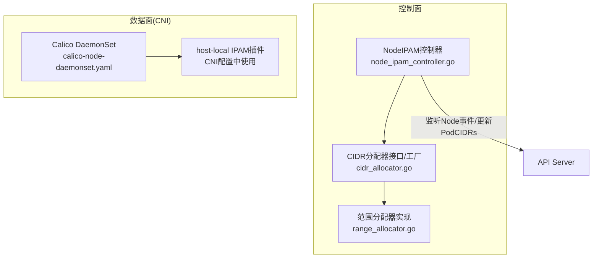
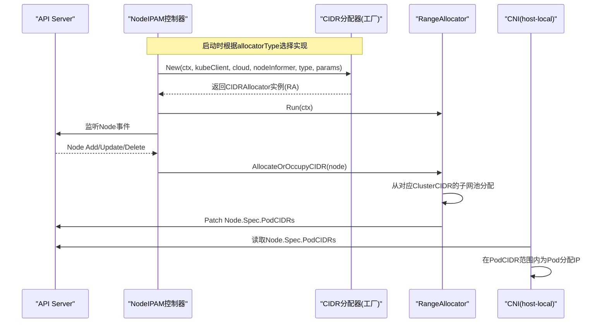
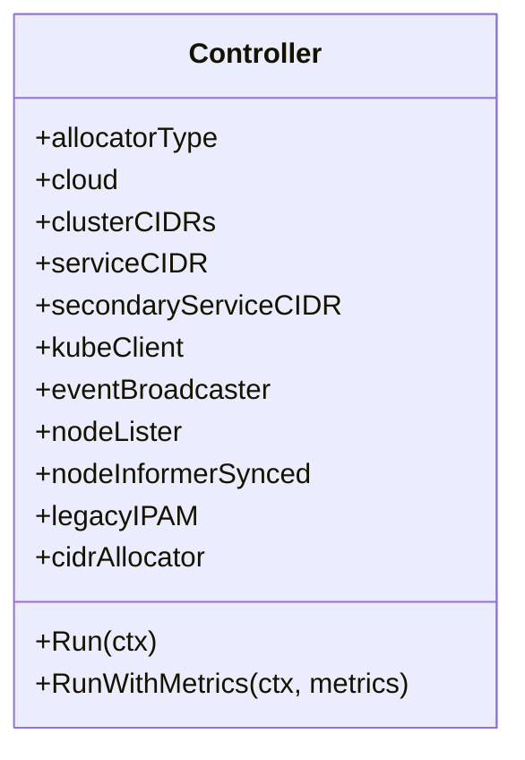
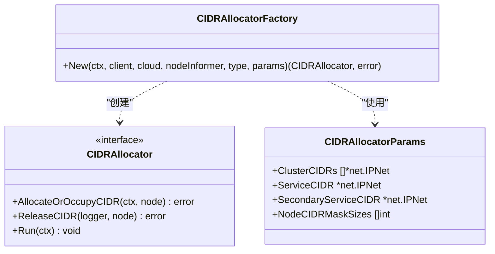
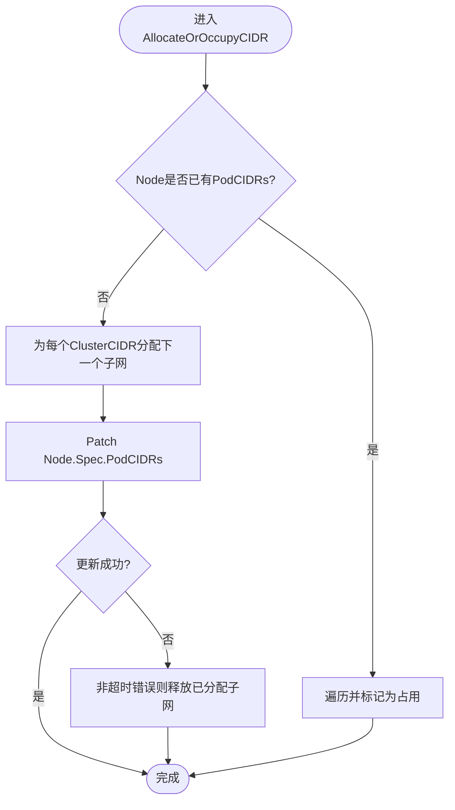
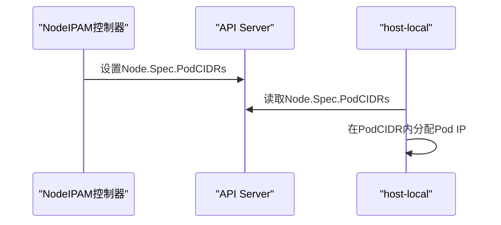
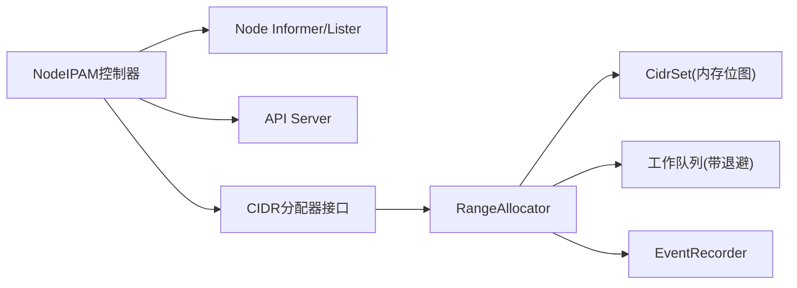

# IPAM集成与管理

<cite>
**本文引用的文件**   
- [pkg/controller/nodeipam/doc.go](file://pkg/controller/nodeipam/doc.go)
- [pkg/controller/nodeipam/node_ipam_controller.go](file://pkg/controller/nodeipam/node_ipam_controller.go)
- [pkg/controller/nodeipam/ipam/doc.go](file://pkg/controller/nodeipam/ipam/doc.go)
- [pkg/controller/nodeipam/ipam/cidr_allocator.go](file://pkg/controller/nodeipam/ipam/cidr_allocator.go)
- [pkg/controller/nodeipam/ipam/range_allocator.go](file://pkg/controller/nodeipam/ipam/range_allocator.go)
- [cluster/addons/calico-policy-controller/calico-node-daemonset.yaml](file://cluster/addons/calico-policy-controller/calico-node-daemonset.yaml)
</cite>

## 目录
1. [简介](#简介)
2. [项目结构](#项目结构)
3. [核心组件](#核心组件)
4. [架构总览](#架构总览)
5. [详细组件分析](#详细组件分析)
6. [依赖关系分析](#依赖关系分析)
7. [性能与容量规划](#性能与容量规划)
8. [故障排查与监控](#故障排查与监控)
9. [结论](#结论)
10. [附录](#附录)

## 简介
本文件面向Kubernetes CNI IPAM（IP地址管理）的集成与管理，聚焦于节点级PodCIDR分配与回收、双栈支持、外部IPAM集成方式以及运维调优与排障。内容基于仓库中Node IPAM控制器与内置RangeAllocator实现，并结合CNI插件（如host-local）在集群中的典型使用方式进行说明。

## 项目结构
围绕Node IPAM的核心代码位于controller-manager的nodeipam包及其子包ipam中；CNI侧以host-local作为常见IPAM插件示例出现在Calico等网络方案的配置清单中。

图示来源
- [pkg/controller/nodeipam/node_ipam_controller.go:1-162](file://pkg/controller/nodeipam/node_ipam_controller.go#L1-L162)
- [pkg/controller/nodeipam/ipam/cidr_allocator.go:1-155](file://pkg/controller/nodeipam/ipam/cidr_allocator.go#L1-L155)
- [pkg/controller/nodeipam/ipam/range_allocator.go:1-453](file://pkg/controller/nodeipam/ipam/range_allocator.go#L1-L453)
- [cluster/addons/calico-policy-controller/calico-node-daemonset.yaml:1-190](file://cluster/addons/calico-policy-controller/calico-node-daemonset.yaml#L1-L190)

章节来源
- [pkg/controller/nodeipam/doc.go:1-20](file://pkg/controller/nodeipam/doc.go#L1-L20)
- [pkg/controller/nodeipam/ipam/doc.go:1-31](file://pkg/controller/nodeipam/ipam/doc.go#L1-L31)

## 核心组件
- Node IPAM控制器：负责根据配置的分配策略创建并运行具体的CIDR分配器，监听Node变化，协调PodCIDR生命周期。
- CIDR分配器接口与工厂：定义统一的分配器接口与类型枚举，按类型选择具体实现。
- RangeAllocator（范围分配器）：基于内存位图维护每个ClusterCIDR下的可用子网，完成分配、占用与释放，并通过Patch更新Node.Spec.PodCIDRs。
- CNI host-local插件：在节点上依据Node的PodCIDR为Pod分配具体IP，是常见的本地IPAM实现。

章节来源
- [pkg/controller/nodeipam/node_ipam_controller.go:44-132](file://pkg/controller/nodeipam/node_ipam_controller.go#L44-L132)
- [pkg/controller/nodeipam/ipam/cidr_allocator.go:38-110](file://pkg/controller/nodeipam/ipam/cidr_allocator.go#L38-L110)
- [pkg/controller/nodeipam/ipam/range_allocator.go:47-169](file://pkg/controller/nodeipam/ipam/range_allocator.go#L47-L169)
- [cluster/addons/calico-policy-controller/calico-node-daemonset.yaml:36-63](file://cluster/addons/calico-policy-controller/calico-node-daemonset.yaml#L36-L63)

## 架构总览
Node IPAM控制器通过Node Informer感知节点新增/删除，调用CIDR分配器进行PodCIDR分配或释放，并将结果持久化到API Server。CNI插件（如host-local）读取节点的PodCIDR，为Pod分配具体IP。

图示来源
- [pkg/controller/nodeipam/node_ipam_controller.go:134-162](file://pkg/controller/nodeipam/node_ipam_controller.go#L134-L162)
- [pkg/controller/nodeipam/ipam/cidr_allocator.go:98-110](file://pkg/controller/nodeipam/ipam/cidr_allocator.go#L98-L110)
- [pkg/controller/nodeipam/ipam/range_allocator.go:171-200](file://pkg/controller/nodeipam/ipam/range_allocator.go#L171-L200)
- [cluster/addons/calico-policy-controller/calico-node-daemonset.yaml:36-63](file://cluster/addons/calico-policy-controller/calico-node-daemonset.yaml#L36-L63)

## 详细组件分析

### Node IPAM控制器
- 职责：初始化并运行CIDR分配器；校验参数（如cluster-cidr与node-cidr-mask-size的关系）；提供Run/RunWithMetrics入口。
- 关键流程：
  - 构造阶段：根据allocatorType决定走legacy路径还是新式CIDR分配器路径。
  - 运行阶段：等待Node Informer同步后，启动分配器主循环。

图示来源
- [pkg/controller/nodeipam/node_ipam_controller.go:44-132](file://pkg/controller/nodeipam/node_ipam_controller.go#L44-L132)

章节来源
- [pkg/controller/nodeipam/node_ipam_controller.go:66-132](file://pkg/controller/nodeipam/node_ipam_controller.go#L66-L132)
- [pkg/controller/nodeipam/node_ipam_controller.go:134-162](file://pkg/controller/nodeipam/node_ipam_controller.go#L134-L162)

### CIDR分配器接口与工厂
- 接口：统一分配/占用/释放/运行方法。
- 工厂：根据类型创建具体分配器；当前默认仅支持RangeAllocator类型。
- 参数：包含ClusterCIDRs、ServiceCIDR、SecondaryServiceCIDR、NodeCIDRMaskSizes等。

图示来源
- [pkg/controller/nodeipam/ipam/cidr_allocator.go:71-110](file://pkg/controller/nodeipam/ipam/cidr_allocator.go#L71-L110)
- [pkg/controller/nodeipam/ipam/cidr_allocator.go:84-95](file://pkg/controller/nodeipam/ipam/cidr_allocator.go#L84-L95)

章节来源
- [pkg/controller/nodeipam/ipam/cidr_allocator.go:38-110](file://pkg/controller/nodeipam/ipam/cidr_allocator.go#L38-L110)
- [pkg/controller/nodeipam/ipam/doc.go:17-30](file://pkg/controller/nodeipam/ipam/doc.go#L17-L30)

### RangeAllocator（范围分配器）
- 数据结构：为每个ClusterCIDR维护一个CidrSet（内存位图），记录已占用/未占用的子网。
- 事件处理：监听Node增删改，入队去重与重试；对删除节点执行CIDR释放。
- 分配逻辑：
  - 若Node已有PodCIDRs则标记为占用。
  - 否则从各ClusterCIDR对应的CidrSet依次分配下一个可用子网，并尝试Patch到Node.Spec.PodCIDRs。
  - 失败时按策略回滚或容忍短暂泄漏（重启可恢复）。
- 服务网段隔离：将ServiceCIDR与SecondaryServiceCIDR与ClusterCIDR重叠部分提前标记为占用，避免分配冲突。

图示来源
- [pkg/controller/nodeipam/ipam/range_allocator.go:316-340](file://pkg/controller/nodeipam/ipam/range_allocator.go#L316-L340)
- [pkg/controller/nodeipam/ipam/range_allocator.go:390-452](file://pkg/controller/nodeipam/ipam/range_allocator.go#L390-L452)
- [pkg/controller/nodeipam/ipam/range_allocator.go:369-388](file://pkg/controller/nodeipam/ipam/range_allocator.go#L369-L388)

章节来源
- [pkg/controller/nodeipam/ipam/range_allocator.go:47-169](file://pkg/controller/nodeipam/ipam/range_allocator.go#L47-L169)
- [pkg/controller/nodeipam/ipam/range_allocator.go:171-200](file://pkg/controller/nodeipam/ipam/range_allocator.go#L171-L200)
- [pkg/controller/nodeipam/ipam/range_allocator.go:264-287](file://pkg/controller/nodeipam/ipam/range_allocator.go#L264-L287)
- [pkg/controller/nodeipam/ipam/range_allocator.go:289-311](file://pkg/controller/nodeipam/ipam/range_allocator.go#L289-L311)
- [pkg/controller/nodeipam/ipam/range_allocator.go:342-367](file://pkg/controller/nodeipam/ipam/range_allocator.go#L342-L367)
- [pkg/controller/nodeipam/ipam/range_allocator.go:369-388](file://pkg/controller/nodeipam/ipam/range_allocator.go#L369-L388)
- [pkg/controller/nodeipam/ipam/range_allocator.go:390-452](file://pkg/controller/nodeipam/ipam/range_allocator.go#L390-L452)

### CNI host-local插件集成
- Calico DaemonSet在安装CNI配置时，指定IPAM类型为host-local，并使用usePodCidr模式，即直接复用Node.Spec.PodCIDR为Pod分配IP。
- 该方式与Node IPAM控制器配合：控制器负责节点级PodCIDR分配，host-local负责Pod级IP分配。

图示来源
- [cluster/addons/calico-policy-controller/calico-node-daemonset.yaml:36-63](file://cluster/addons/calico-policy-controller/calico-node-daemonset.yaml#L36-L63)

章节来源
- [cluster/addons/calico-policy-controller/calico-node-daemonset.yaml:36-63](file://cluster/addons/calico-policy-controller/calico-node-daemonset.yaml#L36-L63)

## 依赖关系分析
- Node IPAM控制器依赖：
  - Node Informer/Lister：获取节点状态变更。
  - API Server：读写Node.Spec.PodCIDRs。
  - Cloud Provider：在特定分配模式下参与（当前默认RangeAllocator不依赖云厂商）。
- RangeAllocator依赖：
  - CidrSet：内存位图用于快速分配/释放。
  - EventRecorder：记录事件。
  - WorkQueue：带退避的重试队列。

图示来源
- [pkg/controller/nodeipam/node_ipam_controller.go:44-132](file://pkg/controller/nodeipam/node_ipam_controller.go#L44-L132)
- [pkg/controller/nodeipam/ipam/range_allocator.go:47-102](file://pkg/controller/nodeipam/ipam/range_allocator.go#L47-L102)

章节来源
- [pkg/controller/nodeipam/node_ipam_controller.go:44-132](file://pkg/controller/nodeipam/node_ipam_controller.go#L44-L132)
- [pkg/controller/nodeipam/ipam/range_allocator.go:47-102](file://pkg/controller/nodeipam/ipam/range_allocator.go#L47-L102)

## 性能与容量规划
- 并发与吞吐
  - 控制器内部使用多worker并行处理Node变更，结合带退避的工作队列，适合大规模节点扩容场景。
- 资源预留与隔离
  - 建议在初始化时将ServiceCIDR与SecondaryServiceCIDR与ClusterCIDR重叠部分预占，避免后续分配冲突。
- 双栈与掩码大小
  - 支持多ClusterCIDR（IPv4/IPv6），需确保node-cidr-mask-size不小于cluster-cidr的掩码长度，保证子网划分合理。
- 容量规划建议
  - 根据节点规模与每节点PodCIDR大小估算所需ClusterCIDR总量，保留一定余量应对突发扩缩容。
  - 关注API Server写入压力，合理设置重试次数与退避策略。

[本节为通用指导，不直接分析具体文件]

## 故障排查与监控
- 常见问题定位
  - 节点无PodCIDR：检查控制器日志与事件，确认是否因资源不足或API写入失败导致。
  - PodCIDR冲突：确认ServiceCIDR是否与ClusterCIDR重叠且已被预占；核对node-cidr-mask-size与cluster-cidr配置。
  - 分配失败重试：观察工作队列重试与退避行为，必要时调整并发worker数量。
- 关键指标与观测点
  - 控制器启动/停止事件、Node状态变更记录。
  - API Server对Node.Spec.PodCIDRs的Patch成功率与延迟。
  - 工作队列积压与重试次数。
- 参考实现位置
  - 控制器事件广播与记录、Run入口、错误处理与重试逻辑。

章节来源
- [pkg/controller/nodeipam/node_ipam_controller.go:134-162](file://pkg/controller/nodeipam/node_ipam_controller.go#L134-L162)
- [pkg/controller/nodeipam/ipam/range_allocator.go:171-200](file://pkg/controller/nodeipam/ipam/range_allocator.go#L171-L200)
- [pkg/controller/nodeipam/ipam/range_allocator.go:212-262](file://pkg/controller/nodeipam/ipam/range_allocator.go#L212-L262)
- [pkg/controller/nodeipam/ipam/range_allocator.go:390-452](file://pkg/controller/nodeipam/ipam/range_allocator.go#L390-L452)

## 结论
Node IPAM控制器与RangeAllocator提供了稳定可靠的节点级PodCIDR管理能力，结合CNI host-local插件可实现端到端的Pod IP分配。通过合理的参数配置、容量规划与监控排障，可在大规模集群中保持高可用与高性能。对于需要与云平台或SDN控制器深度集成的场景，可通过扩展分配器类型或采用兼容的外部IPAM方案实现。

[本节为总结性内容，不直接分析具体文件]

## 附录
- 术语
  - ClusterCIDR：集群级Pod网络前缀，供节点级PodCIDR划分。
  - NodeCIDRMaskSize：节点级PodCIDR掩码长度，决定单节点可用IP数量。
  - ServiceCIDR/SecondaryServiceCIDR：集群服务网段，需避免与ClusterCIDR冲突。
- 相关配置要点
  - 确保--cluster-cidr与--node-cidr-mask-size满足约束。
  - 在双栈环境中正确配置多个ClusterCIDR及对应掩码。
  - 在CNI配置中将IPAM类型设置为host-local并使用usePodCidr模式。

[本节为概念性补充，不直接分析具体文件]