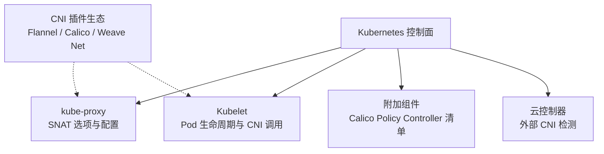
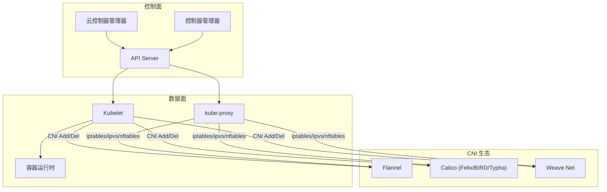

# 主流CNI插件详解

<cite>
**本文引用的文件**   
- [README.md](file://README.md)
- [cluster/addons/calico-policy-controller/README.md](file://cluster/addons/calico-policy-controller/README.md)
- [cmd/kube-proxy/app/options.go](file://cmd/kube-proxy/app/options.go)
- [pkg/proxy/apis/config/types.go](file://pkg/proxy/apis/config/types.go)
- [staging/src/k8s.io/kube-proxy/config/v1alpha1/types.go](file://staging/src/k8s.io/kube-proxy/config/v1alpha1/types.go)
- [pkg/generated/openapi/zz_generated.openapi.go](file://pkg/generated/openapi/zz_generated.openapi.go)
- [pkg/kubelet/kuberuntime/kuberuntime_manager.go](file://pkg/kubelet/kuberuntime/kuberuntime_manager.go)
- [pkg/kubelet/util/pod_startup_latency_tracker.go](file://pkg/kubelet/util/pod_startup_latency_tracker.go)
- [staging/src/k8s.io/cloud-provider/controllers/route/route_controller_test.go](file://staging/src/k8s.io/cloud-provider/controllers/route/route_controller_test.go)
</cite>

## 目录
1. [简介](#简介)
2. [项目结构](#项目结构)
3. [核心组件](#核心组件)
4. [架构总览](#架构总览)
5. [详细组件分析](#详细组件分析)
6. [依赖关系分析](#依赖关系分析)
7. [性能考量](#性能考量)
8. [故障排查指南](#故障排查指南)
9. [结论](#结论)
10. [附录](#附录)

## 简介
本文件面向在Kubernetes集群中选型与落地网络方案（CNI）的工程师，聚焦三大主流插件：Flannel、Calico、Weave Net。内容覆盖：
- Flannel的VXLAN overlay与host-gw两种模式的原理、配置要点与适用场景
- Calico的企业级能力：BGP路由、NetworkPolicy与全局策略、Typha扩展
- Weave Net的分布式特性：自动发现、加密通信
- 三者在性能、功能与兼容性上的对比
- 安装与最佳实践、升级迁移策略、混合使用方案
- 基于仓库内相关源码与清单的定位与排障线索

说明：仓库本身不包含各CNI插件的实现代码，但包含与CNI交互的关键路径、默认附加组件清单以及变更历史等，可作为理解集成点与排障依据。

## 项目结构
仓库为Kubernetes主工程，与CNI相关的可观察点包括：
- kube-proxy选项与配置类型中对“某些CNI插件可能需要SNAT”的提示
- Kubelet在创建Pod沙箱时对CNI错误的处理与启动延迟追踪
- 内置Calico Policy Controller的附加清单说明
- 云控制器路由控制器对外部CNI的识别与日志
- 版本变更日志对Calico版本的跟踪



图表来源
- [cmd/kube-proxy/app/options.go:134](file://cmd/kube-proxy/app/options.go#L134)
- [pkg/proxy/apis/config/types.go:30](file://pkg/proxy/apis/config/types.go#L30)
- [staging/src/k8s.io/kube-proxy/config/v1alpha1/types.go:31](file://staging/src/k8s.io/kube-proxy/config/v1alpha1/types.go#L31)
- [pkg/kubelet/kuberuntime/kuberuntime_manager.go:1626](file://pkg/kubelet/kuberuntime/kuberuntime_manager.go#L1626)
- [cluster/addons/calico-policy-controller/README.md:1-14](file://cluster/addons/calico-policy-controller/README.md#L1-L14)
- [staging/src/k8s.io/cloud-provider/controllers/route/route_controller_test.go:700-701](file://staging/src/k8s.io/cloud-provider/controllers/route/route_controller_test.go#L700-L701)

章节来源
- [README.md:1-101](file://README.md#L1-L101)
- [cluster/addons/calico-policy-controller/README.md:1-14](file://cluster/addons/calico-policy-controller/README.md#L1-L14)

## 核心组件
- kube-proxy 与 SNAT 的关系
  - 当某些CNI插件需要时，可通过开启masquerade-all对Service ClusterIP流量进行SNAT，避免跨节点源地址被改写导致回包失败。
  - 该开关在iptables/ipvs模式与nftables模式下均有对应配置项与OpenAPI描述。
- Kubelet 与 CNI 的集成
  - 在创建Pod沙箱阶段，若底层CNI返回错误，将作为Pod启动失败的直接原因之一上报。
  - Pod启动延迟追踪指标可用于定位CNI初始化耗时问题。
- Calico Policy Controller 附加组件
  - 仓库提供Calico策略控制器的部署清单说明，包含DaemonSet、Typha、HPA/VPA等。
- 云控制器对外部CNI的感知
  - 路由控制器测试用例中包含“External CNI configured”的场景，表明系统能识别并记录外部CNI的使用。

章节来源
- [cmd/kube-proxy/app/options.go:134](file://cmd/kube-proxy/app/options.go#L134)
- [pkg/proxy/apis/config/types.go:30](file://pkg/proxy/apis/config/types.go#L30)
- [staging/src/k8s.io/kube-proxy/config/v1alpha1/types.go:31](file://staging/src/k8s.io/kube-proxy/config/v1alpha1/types.go#L31)
- [pkg/generated/openapi/zz_generated.openapi.go:69018](file://pkg/generated/openapi/zz_generated.openapi.go#L69018)
- [pkg/generated/openapi/zz_generated.openapi.go:69144](file://pkg/generated/openapi/zz_generated.openapi.go#L69144)
- [pkg/kubelet/kuberuntime/kuberuntime_manager.go:1626](file://pkg/kubelet/kuberuntime/kuberuntime_manager.go#L1626)
- [pkg/kubelet/util/pod_startup_latency_tracker.go:160](file://pkg/kubelet/util/pod_startup_latency_tracker.go#L160)
- [cluster/addons/calico-policy-controller/README.md:1-14](file://cluster/addons/calico-policy-controller/README.md#L1-L14)
- [staging/src/k8s.io/cloud-provider/controllers/route/route_controller_test.go:700-701](file://staging/src/k8s.io/cloud-provider/controllers/route/route_controller_test.go#L700-L701)

## 架构总览
下图展示Kubernetes与CNI生态的集成边界与关键交互点。



图表来源
- [cmd/kube-proxy/app/options.go:134](file://cmd/kube-proxy/app/options.go#L134)
- [pkg/proxy/apis/config/types.go:30](file://pkg/proxy/apis/config/types.go#L30)
- [staging/src/k8s.io/kube-proxy/config/v1alpha1/types.go:31](file://staging/src/k8s.io/kube-proxy/config/v1alpha1/types.go#L31)
- [pkg/kubelet/kuberuntime/kuberuntime_manager.go:1626](file://pkg/kubelet/kuberuntime/kuberuntime_manager.go#L1626)

## 详细组件分析

### Flannel 插件（简单网络方案）
- 模式概览
  - VXLAN Overlay：通过内核VXLAN隧道封装Pod流量，适用于跨主机、跨子网或复杂二层隔离环境；实现简单、通用性强。
  - host-gw：在各节点上添加指向Pod网段的路由条目，利用宿主机的转发能力直连，减少封装开销，适合在同一二层或具备良好三层连通性的环境。
- 与Kubernetes集成要点
  - Pod创建时由Kubelet调用CNI接口完成网络配置；若CNI失败，将导致Pod无法进入运行态。
  - 某些CNI组合下，kube-proxy需开启SNAT以保障Service访问链路正确。
- 适用场景
  - 快速搭建、小规模集群、学习验证优先选择Flannel；生产大规模且对性能敏感时可评估host-gw或更高级方案。

章节来源
- [pkg/kubelet/kuberuntime/kuberuntime_manager.go:1626](file://pkg/kubelet/kuberuntime/kuberuntime_manager.go#L1626)
- [cmd/kube-proxy/app/options.go:134](file://cmd/kube-proxy/app/options.go#L134)
- [pkg/proxy/apis/config/types.go:30](file://pkg/proxy/apis/config/types.go#L30)
- [staging/src/k8s.io/kube-proxy/config/v1alpha1/types.go:31](file://staging/src/k8s.io/kube-proxy/config/v1alpha1/types.go#L31)

### Calico 插件（企业级网络与安全）
- 核心能力
  - 基于BGP的全集群路由分发，支持大规模、高性能的数据平面。
  - 原生NetworkPolicy实现，支持命名空间粒度与跨命名空间策略；Typha用于提升策略同步性能。
- 仓库关联
  - 内置Calico Policy Controller附加清单，包含DaemonSet、Typha、Service与HPA/VPA等组件说明。
- 与Kubernetes集成要点
  - 策略控制器监听API Server中的NetworkPolicy等资源，驱动Felix更新节点端规则。
  - 与kube-proxy协同工作，通常无需额外SNAT，但在特定部署下仍需结合masquerade-all策略。
- 适用场景
  - 多租户、强安全合规、大规模集群、需要细粒度网络策略与高性能转发的生产环境。

章节来源
- [cluster/addons/calico-policy-controller/README.md:1-14](file://cluster/addons/calico-policy-controller/README.md#L1-L14)
- [cmd/kube-proxy/app/options.go:134](file://cmd/kube-proxy/app/options.go#L134)

### Weave Net 插件（分布式网络与加密）
- 核心特性
  - 去中心化自动发现与连接建立，简化跨机房/多云部署。
  - 可选端到端加密通信，满足安全敏感场景。
- 与Kubernetes集成要点
  - 同样遵循CNI规范，由Kubelet在Pod生命周期中调用；与kube-proxy配合完成Service访问。
- 适用场景
  - 分布式/边缘/多云环境，强调自组织与加密传输的网络需求。

章节来源
- [pkg/kubelet/kuberuntime/kuberuntime_manager.go:1626](file://pkg/kubelet/kuberuntime/kuberuntime_manager.go#L1626)
- [pkg/proxy/apis/config/types.go:30](file://pkg/proxy/apis/config/types.go#L30)

### 网络策略实现差异与兼容性
- Calico
  - 原生实现NetworkPolicy，性能与功能完善；Typha提升策略下发效率。
- Flannel
  - 传统版本不提供NetworkPolicy；部分发行版或增强版本可能提供轻量策略能力，需结合第三方组件或自定义实现。
- Weave Net
  - 提供基础网络策略能力，具体语义与性能表现与Calico存在差异，需按实际版本与配置评估。
- 兼容性与注意事项
  - 不同插件对NetworkPolicy字段的支持范围、优先级与行为细节可能存在差异，建议以目标插件官方文档为准并在预发环境充分验证。

章节来源
- [cluster/addons/calico-policy-controller/README.md:1-14](file://cluster/addons/calico-policy-controller/README.md#L1-L14)

### 安装配置指南与最佳实践
- 通用步骤
  - 准备符合要求的节点与内核模块（如VXLAN、BPF等）。
  - 部署CNI插件（DaemonSet形式），确保每个节点正确加载。
  - 校验Pod间互通与Service访问。
- 针对Flannel
  - 根据网络拓扑选择VXLAN或host-gw；host-gw需保证节点间可达且无冲突路由。
  - 若出现跨节点访问异常，考虑开启kube-proxy的SNAT。
- 针对Calico
  - 启用Typha以提升策略同步性能；按需配置BGP对等体与AS号。
  - 结合HPA/VPA进行水平/垂直扩缩容。
- 针对Weave Net
  - 在跨地域或多云场景启用加密；合理设置带宽与分片参数。
- 最佳实践
  - 统一Pod CIDR规划，避免与宿主机网络冲突。
  - 监控CNI插件资源占用与丢包率，结合kube-proxy与节点内核参数调优。

章节来源
- [cmd/kube-proxy/app/options.go:134](file://cmd/kube-proxy/app/options.go#L134)
- [cluster/addons/calico-policy-controller/README.md:1-14](file://cluster/addons/calico-policy-controller/README.md#L1-L14)

### 升级与迁移策略
- 滚动升级
  - 采用DaemonSet滚动更新，逐步替换节点上的CNI组件，观察Pod创建成功率与网络连通性。
- 版本对齐
  - 关注Kubernetes版本与CNI插件版本的兼容性矩阵；仓库变更日志显示了对Calico版本的持续跟进。
- 回滚预案
  - 保留旧版本镜像与配置快照；一旦出现问题，立即回滚至稳定版本。
- 迁移注意
  - 从Overlay切换到host-gw或更换CNI前，需重新规划CIDR与路由，确保无冲突。

章节来源
- [CHANGELOG-1.10.md:2017](file://CHANGELOG/CHANGELOG-1.10.md#L2017)
- [CHANGELOG-1.10.md:2248](file://CHANGELOG/CHANGELOG-1.10.md#L2248)
- [CHANGELOG-1.10.md:2705](file://CHANGELOG/CHANGELOG-1.10.md#L2705)
- [CHANGELOG-1.10.md:2915](file://CHANGELOG/CHANGELOG-1.10.md#L2915)
- [CHANGELOG-1.13.md:1519](file://CHANGELOG/CHANGELOG-1.13.md#L1519)
- [CHANGELOG-1.14.md:895](file://CHANGELOG/CHANGELOG-1.14.md#L895)
- [CHANGELOG-1.14.md:1307](file://CHANGELOG/CHANGELOG-1.14.md#L1307)
- [CHANGELOG-1.15.md:1537](file://CHANGELOG/CHANGELOG-1.15.md#L1537)
- [CHANGELOG-1.16.md:2045](file://CHANGELOG/CHANGELOG-1.16.md#L2045)
- [CHANGELOG-1.18.md:2577](file://CHANGELOG/CHANGELOG-1.18.md#L2577)
- [CHANGELOG-1.20.md:2310](file://CHANGELOG/CHANGELOG-1.20.md#L2310)
- [CHANGELOG-1.20.md:3656](file://CHANGELOG/CHANGELOG-1.20.md#L3656)
- [CHANGELOG-1.22.md:2160](file://CHANGELOG/CHANGELOG-1.22.md#L2160)
- [CHANGELOG-1.22.md:2648](file://CHANGELOG/CHANGELOG-1.22.md#L2648)
- [CHANGELOG-1.22.md:3376](file://CHANGELOG/CHANGELOG-1.22.md#L3376)

### 混合使用多种CNI插件的场景与方案
- 典型场景
  - 多集群/多租户隔离：不同命名空间或集群使用不同CNI以满足差异化需求。
  - 渐进式迁移：新旧CNI并存，逐步切换业务。
- 方案要点
  - 严格划分Pod CIDR，避免重叠；必要时借助多层路由或网关。
  - 通过Node亲和与Taint/Toleration将CNI DaemonSet调度到指定节点。
  - 在控制面侧区分路由策略与策略控制器，避免相互干扰。
- 风险与缓解
  - 路由环路、策略冲突：通过自动化巡检与灰度发布降低风险。
  - 运维复杂度上升：引入统一的编排与观测平台。

章节来源
- [staging/src/k8s.io/cloud-provider/controllers/route/route_controller_test.go:700-701](file://staging/src/k8s.io/cloud-provider/controllers/route/route_controller_test.go#L700-L701)

## 依赖关系分析
- kube-proxy 与 CNI 的耦合点
  - 通过masquerade-all选项适配不同CNI的SNAT需求，影响Service访问链路。
- Kubelet 与 CNI 的耦合点
  - 在Pod沙箱创建阶段调用CNI，错误会直接影响Pod状态。
- Calico 与 Typha
  - 策略控制器与Typha协同，提高策略同步吞吐。

```mermaid
classDiagram
class KubeProxy {
+bool masqueradeAll
+配置项(iptables/ipvs/nftables)
}
class Kubelet {
+创建Pod沙箱()
+调用CNI接口()
+上报CNI错误()
}
class CalicoController {
+监听NetworkPolicy()
+驱动Felix更新规则()
}
class Typha {
+策略同步加速()
}
KubeProxy -->|"SNAT 适配"| CNI_Ecosystem["CNI 生态(Flannel/Calico/Weave)"]
Kubelet -->|"Add/Del Network"| CNI_Ecosystem
CalicoController --> Typha : "协作"
```

图表来源
- [cmd/kube-proxy/app/options.go:134](file://cmd/kube-proxy/app/options.go#L134)
- [pkg/proxy/apis/config/types.go:30](file://pkg/proxy/apis/config/types.go#L30)
- [staging/src/k8s.io/kube-proxy/config/v1alpha1/types.go:31](file://staging/src/k8s.io/kube-proxy/config/v1alpha1/types.go#L31)
- [pkg/kubelet/kuberuntime/kuberuntime_manager.go:1626](file://pkg/kubelet/kuberuntime/kuberuntime_manager.go#L1626)
- [cluster/addons/calico-policy-controller/README.md:1-14](file://cluster/addons/calico-policy-controller/README.md#L1-L14)

章节来源
- [cmd/kube-proxy/app/options.go:134](file://cmd/kube-proxy/app/options.go#L134)
- [pkg/proxy/apis/config/types.go:30](file://pkg/proxy/apis/config/types.go#L30)
- [staging/src/k8s.io/kube-proxy/config/v1alpha1/types.go:31](file://staging/src/k8s.io/kube-proxy/config/v1alpha1/types.go#L31)
- [pkg/kubelet/kuberuntime/kuberuntime_manager.go:1626](file://pkg/kubelet/kuberuntime/kuberuntime_manager.go#L1626)
- [cluster/addons/calico-policy-controller/README.md:1-14](file://cluster/addons/calico-policy-controller/README.md#L1-L14)

## 性能考量
- 转发路径
  - host-gw相比VXLAN减少封装/解封装开销，适合高吞吐场景。
  - Calico基于BGP与内核优化，在大集群下具备良好可扩展性。
- 策略下发
  - Calico Typha可显著降低策略同步压力，提升大规模策略更新性能。
- Service访问
  - 在特定CNI组合下，开启kube-proxy的SNAT可减少跨节点回包失败概率，但会带来少量CPU开销。
- 监控指标
  - 关注Pod启动延迟、CNI调用耗时、丢包率与队列长度等指标，辅助定位瓶颈。

章节来源
- [cmd/kube-proxy/app/options.go:134](file://cmd/kube-proxy/app/options.go#L134)
- [pkg/kubelet/util/pod_startup_latency_tracker.go:160](file://pkg/kubelet/util/pod_startup_latency_tracker.go#L160)
- [cluster/addons/calico-policy-controller/README.md:1-14](file://cluster/addons/calico-policy-controller/README.md#L1-L14)

## 故障排查指南
- Pod无法启动
  - 检查Kubelet在创建沙箱时的CNI错误信息，确认CNI插件是否正常运行。
- 跨节点不可达
  - 核对节点路由表与防火墙策略；对于VXLAN模式，检查内核模块与MTU设置。
  - 若Service访问异常，尝试开启kube-proxy的masquerade-all并验证。
- 策略不生效
  - 确认Calico策略控制器与Typha健康；检查NetworkPolicy对象是否正确创建与匹配。
- 启动缓慢
  - 查看Pod启动延迟追踪指标，定位CNI初始化耗时环节。
- 外部CNI识别
  - 参考路由控制器对外部CNI的日志与事件，辅助判断是否为外部CNI导致的差异。

章节来源
- [pkg/kubelet/kuberuntime/kuberuntime_manager.go:1626](file://pkg/kubelet/kuberuntime/kuberuntime_manager.go#L1626)
- [cmd/kube-proxy/app/options.go:134](file://cmd/kube-proxy/app/options.go#L134)
- [pkg/kubelet/util/pod_startup_latency_tracker.go:160](file://pkg/kubelet/util/pod_startup_latency_tracker.go#L160)
- [staging/src/k8s.io/cloud-provider/controllers/route/route_controller_test.go:700-701](file://staging/src/k8s.io/cloud-provider/controllers/route/route_controller_test.go#L700-L701)

## 结论
- Flannel适合快速上手与中小规模集群，VXLAN通用性强，host-gw性能更佳但依赖网络拓扑。
- Calico在企业级场景中优势明显，BGP与NetworkPolicy能力完善，Typha提升扩展性。
- Weave Net在分布式与加密通信方面具备特色，适合多云/边缘场景。
- 选型应综合考量网络拓扑、安全合规、性能与运维复杂度；在生产环境中务必做好灰度与回滚预案。

## 附录
- 社区与支持
  - Kubernetes官方文档与社区会议日历提供广泛支持入口。
  - 各CNI插件均有独立社区与文档站点，建议以官方文档为准并结合仓库变更日志了解版本演进。

章节来源
- [README.md:82-101](file://README.md#L82-L101)