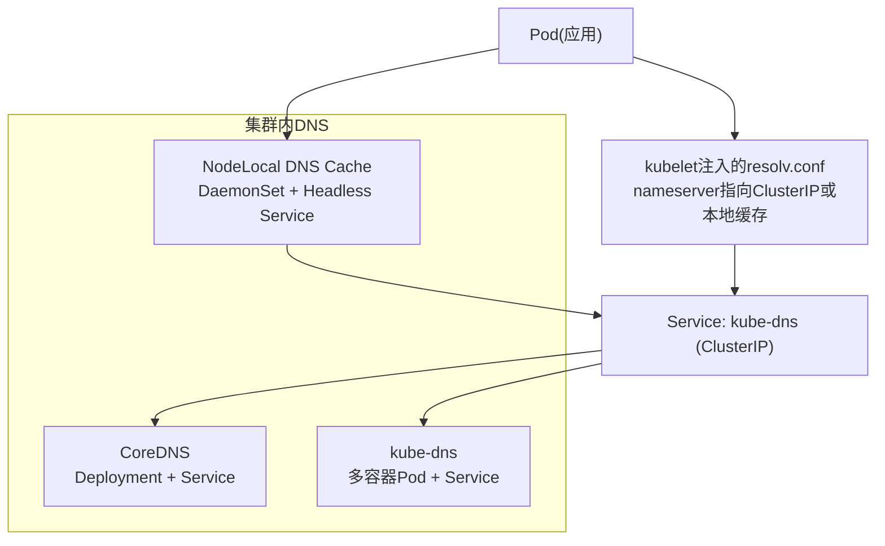
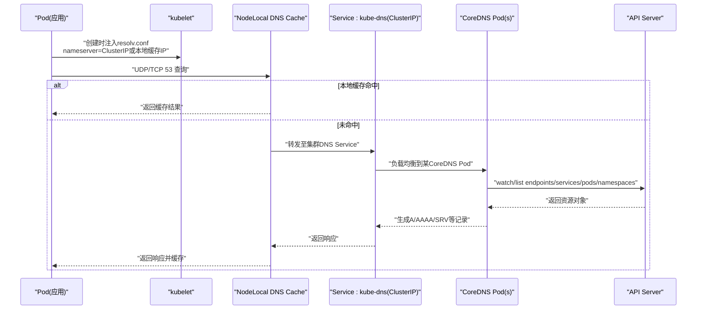
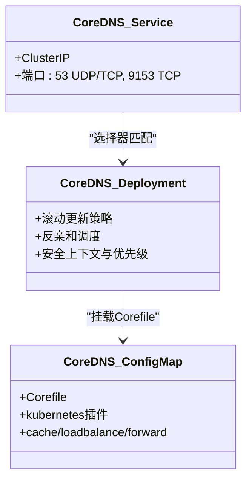
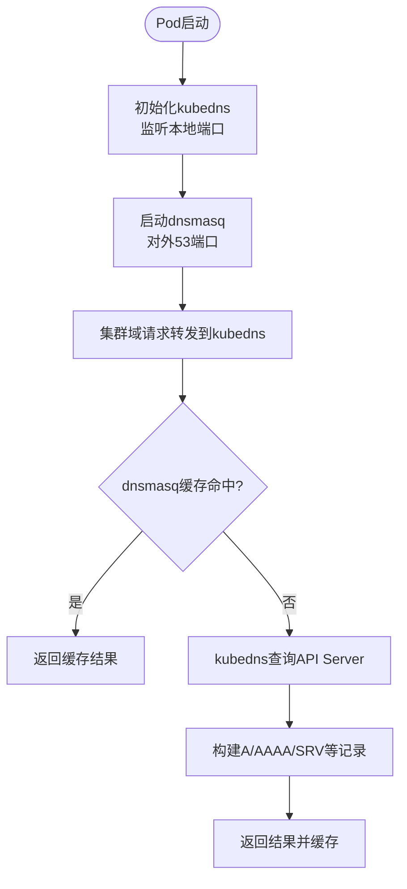
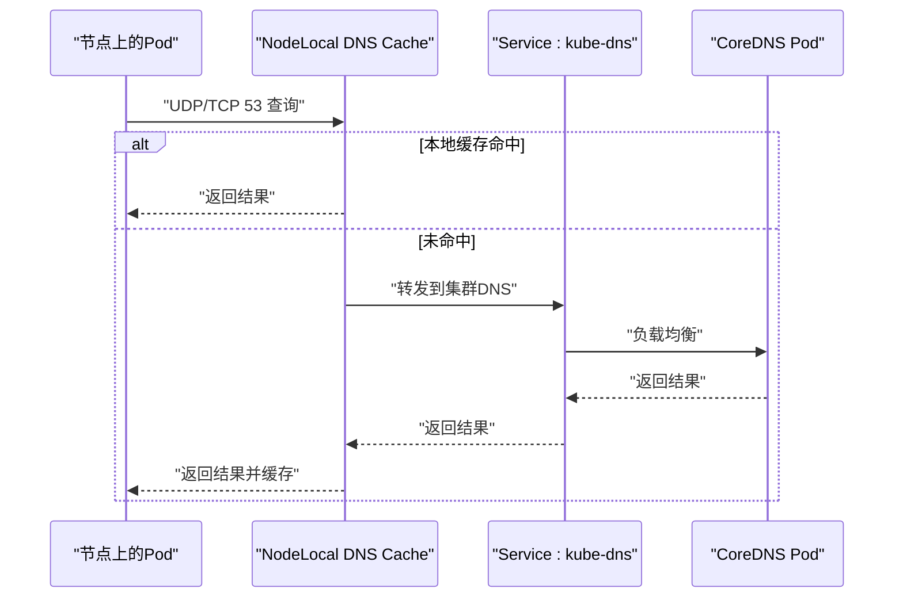
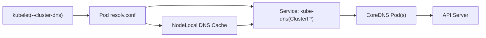
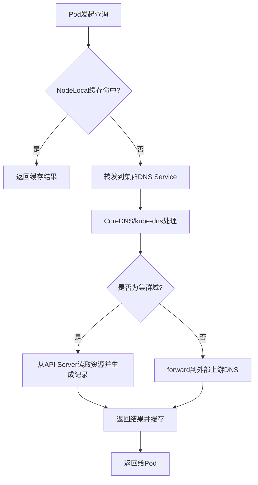

# DNS服务发现

<cite>
**本文引用的文件**
- [cluster/addons/dns/coredns/coredns.yaml.base](file://cluster/addons/dns/coredns/coredns.yaml.base)
- [cluster/addons/dns/kube-dns/kube-dns.yaml.base](file://cluster/addons/dns/kube-dns/kube-dns.yaml.base)
- [cluster/addons/dns/nodelocaldns/nodelocaldns.yaml](file://cluster/addons/dns/nodelocaldns/nodelocaldns.yaml)
- [cmd/kubeadm/app/apis/kubeadm/v1/defaults.go](file://cmd/kubeadm/app/apis/kubeadm/v1/defaults.go)
- [cmd/kubeadm/app/componentconfigs/kubelet.go](file://cmd/kubeadm/app/componentconfigs/kubelet.go)
- [cmd/kubelet/app/options/options.go](file://cmd/kubelet/app/options/options.go)
</cite>

## 目录
1. [简介](#简介)
2. [项目结构](#项目结构)
3. [核心组件](#核心组件)
4. [架构总览](#架构总览)
5. [详细组件分析](#详细组件分析)
6. [依赖关系分析](#依赖关系分析)
7. [性能考虑](#性能考虑)
8. [故障排查指南](#故障排查指南)
9. [结论](#结论)
10. [附录](#附录)

## 简介
本文件面向Kubernetes集群中的DNS服务发现，系统性阐述CoreDNS与kube-dns的实现原理、配置方式与服务名称解析流程。文档覆盖DNS缓存、负载均衡与高可用策略，记录类型与生命周期管理要点，并提供性能优化与故障排查方法。同时说明如何自定义上游DNS服务器与域名解析行为。

## 项目结构
仓库中与DNS相关的部署清单位于 cluster/addons/dns 目录下，包含：
- CoreDNS默认部署模板（Deployment + Service + ConfigMap）
- kube-dns默认部署模板（多容器Pod + Service）
- NodeLocal DNS Cache（DaemonSet + Headless Service + ConfigMap）

图表来源
- [cluster/addons/dns/coredns/coredns.yaml.base:86-217](file://cluster/addons/dns/coredns/coredns.yaml.base#L86-L217)
- [cluster/addons/dns/kube-dns/kube-dns.yaml.base:20-248](file://cluster/addons/dns/kube-dns/kube-dns.yaml.base#L20-L248)
- [cluster/addons/dns/nodelocaldns/nodelocaldns.yaml:104-212](file://cluster/addons/dns/nodelocaldns/nodelocaldns.yaml#L104-L212)

章节来源
- [cluster/addons/dns/coredns/coredns.yaml.base:1-217](file://cluster/addons/dns/coredns/coredns.yaml.base#L1-L217)
- [cluster/addons/dns/kube-dns/kube-dns.yaml.base:1-248](file://cluster/addons/dns/kube-dns/kube-dns.yaml.base#L1-L248)
- [cluster/addons/dns/nodelocaldns/nodelocaldns.yaml:1-212](file://cluster/addons/dns/nodelocaldns/nodelocaldns.yaml#L1-L212)

## 核心组件
- CoreDNS
  - 以Deployment形式运行，暴露Service（ClusterIP），通过ConfigMap提供Corefile。
  - 内置kubernetes插件负责从API Server同步Service/Endpoints/EndpointSlices并生成A/AAAA/SRV等记录。
  - 支持cache、loadbalance、forward、prometheus、health/ready探针等。
- kube-dns
  - 多容器Pod：kubedns（主进程）、dnsmasq（高性能缓存与转发）、sidecar（健康检查与指标）。
  - 通过Service暴露53端口，内部由kubedns监听本地端口，dnsmasq对外提供服务。
- NodeLocal DNS Cache
  - DaemonSet在每个节点上运行，绑定本地地址与集群DNS Service IP，优先本地缓存命中，再转发到集群DNS。
  - 使用Headless Service暴露各副本指标端口。

章节来源
- [cluster/addons/dns/coredns/coredns.yaml.base:56-217](file://cluster/addons/dns/coredns/coredns.yaml.base#L56-L217)
- [cluster/addons/dns/kube-dns/kube-dns.yaml.base:115-248](file://cluster/addons/dns/kube-dns/kube-dns.yaml.base#L115-L248)
- [cluster/addons/dns/nodelocaldns/nodelocaldns.yaml:49-212](file://cluster/addons/dns/nodelocaldns/nodelocaldns.yaml#L49-L212)

## 架构总览
下图展示从Pod发起DNS请求到返回结果的端到端路径，包括NodeLocal缓存层与集群DNS层的交互。

图表来源
- [cluster/addons/dns/nodelocaldns/nodelocaldns.yaml:56-102](file://cluster/addons/dns/nodelocaldns/nodelocaldns.yaml#L56-L102)
- [cluster/addons/dns/coredns/coredns.yaml.base:64-84](file://cluster/addons/dns/coredns/coredns.yaml.base#L64-L84)
- [cluster/addons/dns/coredns/coredns.yaml.base:190-217](file://cluster/addons/dns/coredns/coredns.yaml.base#L190-L217)

## 详细组件分析

### CoreDNS组件分析
- 部署形态
  - Deployment管理多个CoreDNS Pod，具备滚动更新策略与反亲和调度，提升可用性。
  - Service提供稳定的ClusterIP，作为集群内统一DNS入口。
- 配置要点（Corefile）
  - kubernetes插件：定义域后缀、pods模式、TTL、fallthrough等。
  - cache：启用递归查询缓存。
  - loadbalance：对多条记录进行轮询式负载均衡。
  - forward：将非集群域请求转发至系统resolv.conf的上游DNS。
  - prometheus/health/ready：监控与健康就绪探测。
- RBAC与权限
  - 为ServiceAccount授予list/watch endpoints/services/pods/namespaces以及endpointslices的权限。

图表来源
- [cluster/addons/dns/coredns/coredns.yaml.base:86-189](file://cluster/addons/dns/coredns/coredns.yaml.base#L86-L189)
- [cluster/addons/dns/coredns/coredns.yaml.base:190-217](file://cluster/addons/dns/coredns/coredns.yaml.base#L190-L217)
- [cluster/addons/dns/coredns/coredns.yaml.base:56-84](file://cluster/addons/dns/coredns/coredns.yaml.base#L56-L84)

章节来源
- [cluster/addons/dns/coredns/coredns.yaml.base:12-55](file://cluster/addons/dns/coredns/coredns.yaml.base#L12-L55)
- [cluster/addons/dns/coredns/coredns.yaml.base:56-84](file://cluster/addons/dns/coredns/coredns.yaml.base#L56-L84)
- [cluster/addons/dns/coredns/coredns.yaml.base:86-189](file://cluster/addons/dns/coredns/coredns.yaml.base#L86-L189)
- [cluster/addons/dns/coredns/coredns.yaml.base:190-217](file://cluster/addons/dns/coredns/coredns.yaml.base#L190-L217)

### kube-dns组件分析
- 多容器协作
  - kubedns：核心逻辑，监听本地端口，处理集群域解析。
  - dnsmasq：对外暴露53端口，提供高性能缓存与转发，并将集群域请求转发给kubedns。
  - sidecar：健康检查与指标收集。
- 配置要点
  - 通过参数指定domain、dns-port、config-dir等。
  - dnsmasq启动参数包含缓存大小、negcache关闭、loop检测、上游server指向本地kubedns。
- 健康与就绪
  - 各容器均配置liveness/readiness探针，保障可观测性与自愈能力。

图表来源
- [cluster/addons/dns/kube-dns/kube-dns.yaml.base:115-248](file://cluster/addons/dns/kube-dns/kube-dns.yaml.base#L115-L248)

章节来源
- [cluster/addons/dns/kube-dns/kube-dns.yaml.base:20-41](file://cluster/addons/dns/kube-dns/kube-dns.yaml.base#L20-L41)
- [cluster/addons/dns/kube-dns/kube-dns.yaml.base:115-248](file://cluster/addons/dns/kube-dns/kube-dns.yaml.base#L115-L248)

### NodeLocal DNS Cache组件分析
- 部署形态
  - DaemonSet确保每个节点运行一个本地缓存实例，hostNetwork=true，直接监听节点网络栈。
  - Headless Service用于Prometheus抓取各副本指标。
- 配置要点（Corefile）
  - 针对集群域、in-addr.arpa、ip6.arpa分别配置bind与forward到集群DNS Service。
  - 全局域转发到外部上游DNS。
  - 开启cache与reload、loop保护。
- 优势
  - 减少跨节点网络开销，降低延迟与抖动；在节点侧实现更高命中率。

图表来源
- [cluster/addons/dns/nodelocaldns/nodelocaldns.yaml:56-102](file://cluster/addons/dns/nodelocaldns/nodelocaldns.yaml#L56-L102)
- [cluster/addons/dns/nodelocaldns/nodelocaldns.yaml:104-191](file://cluster/addons/dns/nodelocaldns/nodelocaldns.yaml#L104-L191)

章节来源
- [cluster/addons/dns/nodelocaldns/nodelocaldns.yaml:16-47](file://cluster/addons/dns/nodelocaldns/nodelocaldns.yaml#L16-L47)
- [cluster/addons/dns/nodelocaldns/nodelocaldns.yaml:49-102](file://cluster/addons/dns/nodelocaldns/nodelocaldns.yaml#L49-L102)
- [cluster/addons/dns/nodelocaldns/nodelocaldns.yaml:104-212](file://cluster/addons/dns/nodelocaldns/nodelocaldns.yaml#L104-L212)

## 依赖关系分析
- kubelet与ClusterDNS
  - kubelet通过--cluster-dns注入Pod的resolv.conf nameserver列表。
  - 默认值来源于kubeadm默认配置，通常为固定的ClusterDNS IP。
- 组件耦合
  - CoreDNS/kube-dns依赖API Server的endpoints/services/pods/namespaces/endpointslices。
  - NodeLocal DNS Cache依赖集群DNS Service与外部上游DNS。

图表来源
- [cmd/kubeadm/app/apis/kubeadm/v1/defaults.go:35-36](file://cmd/kubeadm/app/apis/kubeadm/v1/defaults.go#L35-L36)
- [cmd/kubeadm/app/componentconfigs/kubelet.go:126-134](file://cmd/kubeadm/app/componentconfigs/kubelet.go#L126-L134)
- [cmd/kubelet/app/options/options.go:436-436](file://cmd/kubelet/app/options/options.go#L436-L436)
- [cluster/addons/dns/coredns/coredns.yaml.base:190-217](file://cluster/addons/dns/coredns/coredns.yaml.base#L190-L217)

章节来源
- [cmd/kubeadm/app/apis/kubeadm/v1/defaults.go:35-36](file://cmd/kubeadm/app/apis/kubeadm/v1/defaults.go#L35-L36)
- [cmd/kubeadm/app/componentconfigs/kubelet.go:126-134](file://cmd/kubeadm/app/componentconfigs/kubelet.go#L126-L134)
- [cmd/kubelet/app/options/options.go:436-436](file://cmd/kubelet/app/options/options.go#L436-L436)

## 性能考虑
- 缓存策略
  - CoreDNS启用cache，合理设置TTL以减少上游查询压力。
  - NodeLocal DNS Cache在节点侧缓存成功与否定响应，显著降低跨节点延迟。
- 负载均衡
  - CoreDNS启用loadbalance，对多后端Pod进行轮询，避免单点过载。
- 高可用
  - CoreDNS Deployment采用反亲和与滚动更新，结合多副本提升可用性。
  - NodeLocal DNS Cache以DaemonSet部署，保证每节点本地可达性。
- 监控与可观测性
  - CoreDNS暴露9153端口metrics；NodeLocal DNS Cache暴露9253端口metrics；kube-dns侧边car暴露10054端口metrics。
- 资源配额
  - 为各组件设置合理的requests/limits，避免被调度器驱逐或OOM。

[本节为通用指导，不直接分析具体文件]

## 故障排查指南
- 基础连通性
  - 确认Pod的resolv.conf中nameserver指向预期地址（ClusterIP或NodeLocal本地IP）。
  - 使用nslookup/dig验证集群域与非集群域解析是否一致。
- 健康与就绪
  - 检查CoreDNS的/health与/ready端点；kube-dns的多容器健康端点；NodeLocal的/health端点。
- 日志与指标
  - 查看CoreDNS/Pod日志与metrics；NodeLocal metrics；kube-dns sidecar指标。
- 常见错误
  - NXDOMAIN：可能由于资源尚未同步或记录不存在，关注kubernetes插件状态与API Server连接。
  - 循环检测：若出现loop保护触发，检查forward链路与上游配置。
- 变更影响
  - 修改Corefile或kube-dns配置后，观察滚动更新与Pod重启情况，确认新配置生效。

章节来源
- [cluster/addons/dns/coredns/coredns.yaml.base:159-181](file://cluster/addons/dns/coredns/coredns.yaml.base#L159-L181)
- [cluster/addons/dns/kube-dns/kube-dns.yaml.base:128-171](file://cluster/addons/dns/kube-dns/kube-dns.yaml.base#L128-L171)
- [cluster/addons/dns/nodelocaldns/nodelocaldns.yaml:161-176](file://cluster/addons/dns/nodelocaldns/nodelocaldns.yaml#L161-L176)

## 结论
CoreDNS与kube-dns均可满足Kubernetes集群内的服务发现需求。CoreDNS凭借插件化架构与更好的扩展性成为默认方案；kube-dns在多容器协作与历史兼容性方面仍有价值。NodeLocal DNS Cache进一步降低解析延迟与抖动，适合大规模集群。通过合理的缓存、负载均衡与高可用配置，配合完善的监控与排障手段，可显著提升DNS服务的稳定性与性能。

[本节为总结性内容，不直接分析具体文件]

## 附录

### Service名称解析完整流程（从Pod到DNS服务器）
- kubelet根据--cluster-dns注入Pod的resolv.conf。
- Pod发起DNS查询，优先命中NodeLocal缓存（如启用），否则转发到集群DNS Service。
- 集群DNS（CoreDNS/kube-dns）从API Server获取Service/Endpoints/EndpointSlices信息，生成相应记录并返回。
- 非集群域请求由forward插件转发至外部上游DNS。

图表来源
- [cluster/addons/dns/nodelocaldns/nodelocaldns.yaml:56-102](file://cluster/addons/dns/nodelocaldns/nodelocaldns.yaml#L56-L102)
- [cluster/addons/dns/coredns/coredns.yaml.base:64-84](file://cluster/addons/dns/coredns/coredns.yaml.base#L64-L84)

### DNS记录类型与生命周期管理
- 记录类型
  - A/AAAA：Service ClusterIP或Pod IP映射。
  - SRV：Service端口与服务元数据映射。
  - PTR：反向解析（in-addr.arpa/ip6.arpa）。
- 生命周期
  - 当Service/Endpoints/EndpointSlices变化时，CoreDNS/kube-dns动态更新记录。
  - TTL控制缓存过期时间，影响客户端刷新频率。
- 最佳实践
  - 合理设置TTL，平衡实时性与性能。
  - 使用EndpointSlices以获得更高效的增量同步。

章节来源
- [cluster/addons/dns/coredns/coredns.yaml.base:64-84](file://cluster/addons/dns/coredns/coredns.yaml.base#L64-L84)
- [cluster/addons/dns/kube-dns/kube-dns.yaml.base:183-195](file://cluster/addons/dns/kube-dns/kube-dns.yaml.base#L183-L195)

### 自定义DNS服务器与域名解析
- 自定义上游DNS
  - CoreDNS：在Corefile中配置forward . /etc/resolv.conf，或使用自定义上游列表。
  - NodeLocal：在Corefile中将全局域转发到外部上游服务器。
- 自定义域解析
  - 通过kubernetes插件的域后缀与fallthrough规则控制解析范围。
  - kube-dns：通过dnsmasq的--server参数将特定域转发到指定上游。
- 注意事项
  - 所有nameserver必须提供一致的记录集，避免解析不一致。
  - 避免形成DNS环路，启用loop检测。

章节来源
- [cluster/addons/dns/coredns/coredns.yaml.base:77-84](file://cluster/addons/dns/coredns/coredns.yaml.base#L77-L84)
- [cluster/addons/dns/nodelocaldns/nodelocaldns.yaml:94-102](file://cluster/addons/dns/nodelocaldns/nodelocaldns.yaml#L94-L102)
- [cluster/addons/dns/kube-dns/kube-dns.yaml.base:183-195](file://cluster/addons/dns/kube-dns/kube-dns.yaml.base#L183-L195)
- [cmd/kubelet/app/options/options.go:436-436](file://cmd/kubelet/app/options/options.go#L436-L436)